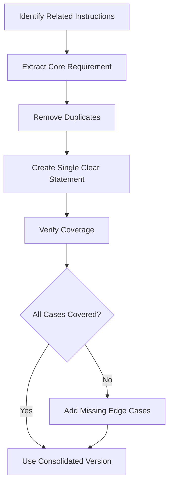

# Removing Redundancy

## Introduction

Redundancy is the hidden tax on every prompt. Repeated instructions, overlapping examples, and restated constraints consume tokens without adding value. This lesson teaches systematic techniques for identifying and eliminating redundancy while preserving prompt effectiveness.

> **🔑 Key Insight:** If you say something twice in a prompt, the model doesn't understand it twice as well—you just paid twice.

### What We'll Cover

- Identifying repeated information
- Consolidating similar instructions
- Implicit vs explicit trade-offs
- Redundancy in examples
- Single-prompt consolidation

### Prerequisites

- [Token Reduction Strategies](./01-token-reduction.md)
- Understanding of prompt structure

---

## Types of Prompt Redundancy

### The Redundancy Spectrum

| Type | Description | Token Impact |
|------|-------------|--------------|
| **Literal repetition** | Same words repeated | High |
| **Semantic repetition** | Same idea, different words | Medium |
| **Overlapping instructions** | Partially duplicated rules | Medium |
| **Redundant examples** | Examples that teach the same thing | High |
| **Over-specification** | Stating what the model already knows | Low-Medium |

---

## Identifying Repeated Information

### Literal Repetition Pattern

**Redundant prompt:**
```
You are a helpful assistant. Your role is to assist users with their 
questions. As an assistant, you should always be helpful and provide 
useful assistance to anyone who asks for help.
```

**Analysis:**
- "helpful/help" appears 4 times
- "assist/assistant/assistance" appears 5 times
- All sentences say the same thing

**Consolidated:**
```
You are a helpful assistant.
```

### Semantic Repetition

**Redundant:**
```
Format your response as valid JSON.
Make sure the output is proper JSON format.
The response should be parseable JSON.
Always return JSON.
```

**Consolidated:**
```
Return valid JSON.
```

### Cross-Section Redundancy Audit

Check for repetition across prompt sections:

```python
def audit_redundancy(prompt_sections: dict) -> list[dict]:
    """Find semantic overlaps between prompt sections."""
    
    issues = []
    section_names = list(prompt_sections.keys())
    
    for i, section1 in enumerate(section_names):
        for section2 in section_names[i+1:]:
            # Check for concept overlap
            overlap = find_semantic_overlap(
                prompt_sections[section1],
                prompt_sections[section2]
            )
            
            if overlap["similarity"] > 0.7:
                issues.append({
                    "sections": [section1, section2],
                    "overlapping_concepts": overlap["concepts"],
                    "recommendation": "Consolidate into single section"
                })
    
    return issues

# Example usage
sections = {
    "system": "You analyze text sentiment. Be objective and accurate.",
    "rules": "Analyze sentiment objectively. Provide accurate assessments.",
    "format": "Return sentiment analysis with accuracy scores."
}

# Would flag: "system" and "rules" overlap on "objective" and "accurate"
```

---

## Consolidating Similar Instructions

### The Consolidation Process



### Before and After: Complex Rules

**Before (68 tokens):**
```
When analyzing sentiment:
- If the text is positive, return "positive"
- If the text expresses happiness or satisfaction, classify as positive
- Content that shows approval should be marked positive
- Joyful, pleased, or content text is positive
- When users express gratitude, that's positive sentiment
```

**After (18 tokens):**
```
Sentiment rules:
- positive: happiness, satisfaction, approval, gratitude
- negative: frustration, complaints, disappointment
- neutral: factual, unclear emotion
```

### Merging Conditional Branches

**Redundant conditions:**
```
If the input is a question, provide an answer.
If the input is a statement, acknowledge it and respond.
If the input is a command, execute the requested action.
If the input is unclear, ask for clarification.
```

**Consolidated:**
```
Respond appropriately to input type: questions (answer), statements 
(acknowledge), commands (execute), unclear (clarify).
```

---

## Implicit vs Explicit Trade-offs

### What Models Already Know

Models have significant built-in knowledge. You don't need to explain:

| Don't Explain | Models Understand |
|---------------|-------------------|
| "JSON uses curly braces" | JSON syntax |
| "Python uses indentation" | Language syntax |
| "Be grammatically correct" | Grammar rules |
| "Don't make things up" | Factual accuracy (mostly) |
| "Answer in the same language as the question" | Language matching |

### When to Be Explicit

| Be Explicit When | Example |
|------------------|---------|
| Overriding defaults | "Use British spelling" |
| Domain-specific rules | "Use APA citation format" |
| Edge case handling | "If no data, return empty array not null" |
| Safety requirements | "Never include personal information" |
| Format requirements | "Use ISO 8601 dates" |

### Implicit Prompt Compression

**Over-specified (42 tokens):**
```
You are an AI assistant that responds in proper English with correct 
grammar, punctuation, and spelling. Make sure your responses are 
coherent and make logical sense. Use complete sentences.
```

**Implicit (0 tokens):**
```
(Remove entirely - models do this by default)
```

**Only specify exceptions (8 tokens):**
```
Use informal tone. Short fragments OK.
```

---

## Redundancy in Examples

### The Example Overlap Problem

Examples often teach the same pattern multiple times:

**Redundant examples (all show positive → "positive"):**
```
Examples:
Input: "I love this product!" → Output: "positive"
Input: "This is amazing!" → Output: "positive"  
Input: "Best purchase ever!" → Output: "positive"
Input: "Absolutely wonderful!" → Output: "positive"
```

### Optimal Example Selection

Each example should teach something new:

**Efficient examples (each teaches different pattern):**
```
Examples:
"I love this!" → "positive"
"This is broken and useless" → "negative"
"The package arrived on Tuesday" → "neutral"
"It's okay I guess" → "neutral" (mixed signals → neutral)
```

### Example Selection Algorithm

```python
def select_minimal_examples(
    all_examples: list[dict],
    max_examples: int = 5
) -> list[dict]:
    """Select examples that maximize coverage with minimum redundancy."""
    
    selected = []
    covered_patterns = set()
    
    # Sort by pattern diversity
    examples_with_patterns = [
        {**ex, "patterns": extract_patterns(ex)}
        for ex in all_examples
    ]
    
    # Greedy selection: pick example that adds most new patterns
    while len(selected) < max_examples and examples_with_patterns:
        best_example = None
        best_new_patterns = 0
        
        for ex in examples_with_patterns:
            new_patterns = len(ex["patterns"] - covered_patterns)
            if new_patterns > best_new_patterns:
                best_example = ex
                best_new_patterns = new_patterns
        
        if best_example is None or best_new_patterns == 0:
            break
            
        selected.append(best_example)
        covered_patterns.update(best_example["patterns"])
        examples_with_patterns.remove(best_example)
    
    return selected

def extract_patterns(example: dict) -> set:
    """Extract teaching patterns from an example."""
    patterns = set()
    
    # Add output class
    patterns.add(f"output:{example['output']}")
    
    # Add input characteristics
    if "?" in example["input"]:
        patterns.add("input:question")
    if any(word in example["input"].lower() for word in ["not", "never", "no"]):
        patterns.add("input:negation")
    if len(example["input"].split()) < 5:
        patterns.add("input:short")
    
    # Add edge cases
    if example.get("is_edge_case"):
        patterns.add(f"edge:{example.get('edge_type')}")
    
    return patterns
```

---

## Single-Prompt Consolidation

### The Multiple-Request Problem

**Inefficient (3 separate API calls):**
```python
# Call 1: Extract entities
entities = model.generate("Extract entities from: " + text)

# Call 2: Analyze sentiment  
sentiment = model.generate("Analyze sentiment of: " + text)

# Call 3: Summarize
summary = model.generate("Summarize: " + text)
```

**Consolidated (1 API call):**
```python
prompt = """
Analyze this text and return JSON:
{
  "entities": [...],
  "sentiment": "positive|negative|neutral",
  "summary": "..."
}

Text: {text}
"""
result = model.generate(prompt)
```

### When to Consolidate vs Separate

| Consolidate When | Keep Separate When |
|------------------|-------------------|
| Tasks share input data | Tasks need different models |
| Low interdependency | Output of one feeds another |
| Same quality requirements | Different token budgets |
| Batch processing | Real-time with partial results |

### Consolidation Patterns

**Pattern: Multi-extraction**
```
From this customer review, extract:
1. sentiment (positive/negative/neutral)
2. product mentions (list)
3. key complaints (list)
4. overall rating guess (1-5)

Return as JSON.
```

**Pattern: Multi-format**
```
Given this data, provide:
- summary: 2-3 sentences
- bullet_points: 5 key facts
- tweet: <280 chars version
- title: 5-10 words

Return as JSON with these keys.
```

---

## Redundancy Detection Tools

### Automated Redundancy Scoring

```python
from collections import Counter
import re

def calculate_redundancy_score(prompt: str) -> dict:
    """Score prompt for various types of redundancy."""
    
    # Tokenize
    words = re.findall(r'\b\w+\b', prompt.lower())
    sentences = re.split(r'[.!?]+', prompt)
    
    # Word repetition score
    word_counts = Counter(words)
    repeated_words = {w: c for w, c in word_counts.items() if c > 2}
    word_repetition = len(repeated_words) / len(set(words)) if words else 0
    
    # Phrase repetition (bigrams and trigrams)
    bigrams = [tuple(words[i:i+2]) for i in range(len(words)-1)]
    trigrams = [tuple(words[i:i+3]) for i in range(len(words)-2)]
    
    bigram_counts = Counter(bigrams)
    repeated_bigrams = sum(1 for c in bigram_counts.values() if c > 1)
    
    # Semantic similarity between sentences
    semantic_redundancy = calculate_sentence_similarity(sentences)
    
    # Overall score (0-1, higher = more redundant)
    overall = (
        word_repetition * 0.2 +
        (repeated_bigrams / len(bigrams) if bigrams else 0) * 0.3 +
        semantic_redundancy * 0.5
    )
    
    return {
        "overall_redundancy": overall,
        "word_repetition": word_repetition,
        "repeated_words": repeated_words,
        "repeated_phrases": repeated_bigrams,
        "semantic_redundancy": semantic_redundancy,
        "recommendations": generate_recommendations(overall, repeated_words)
    }

def generate_recommendations(score: float, repeated: dict) -> list[str]:
    """Generate specific recommendations based on analysis."""
    recs = []
    
    if score > 0.3:
        recs.append("HIGH REDUNDANCY: Consider major consolidation")
    
    for word, count in repeated.items():
        if count > 3:
            recs.append(f"Word '{word}' appears {count}x - consolidate or vary")
    
    return recs
```

---

## Hands-on Exercise

### Your Task

Eliminate redundancy from this prompt while maintaining all requirements.

**Original Prompt (124 tokens):**
```
You are a customer service AI assistant. Your job is to help customers 
with their questions and problems. You should always be helpful and 
try to solve customer issues.

When responding to customers:
- Be polite and professional in your responses
- Always maintain a professional and courteous tone
- Use polite language when addressing customer concerns
- Keep responses professional

If a customer is upset:
- Apologize for their experience
- Say sorry for any inconvenience  
- Express regret for the issue
- Acknowledge their frustration

Always provide solutions. Try to help solve the problem. Give customers 
actionable solutions to their issues.
```

### Requirements

1. Reduce to under 50 tokens
2. Keep all distinct behavioral requirements
3. Maintain the upset customer handling

<details>
<summary>💡 Hints (click to expand)</summary>

- "polite and professional" appears 4 different ways
- "apologize/sorry/regret" all mean the same thing
- "solutions" is mentioned 3 times
- Most of paragraph 1 is default behavior

</details>

<details>
<summary>✅ Solution (click to expand)</summary>

**Consolidated Prompt (38 tokens):**
```
Customer service assistant. Professional, polite tone.

Upset customers: apologize, acknowledge frustration.

All interactions: provide actionable solutions.
```

**Alternative (42 tokens):**
```
Role: Customer service
Tone: Professional, polite

Handle upset customers:
1. Apologize
2. Acknowledge frustration

Always: Provide actionable solutions
```

**Token Reduction:** 69% (124 → 38 tokens)

</details>

---

## Redundancy Patterns by Prompt Section

| Section | Common Redundancy | Solution |
|---------|-------------------|----------|
| System prompt | Role restated multiple ways | Single clear role statement |
| Rules | Same rule, different words | Consolidate into one |
| Examples | Similar examples | Select for diversity |
| Output format | Format repeated in multiple places | Single format section |
| Constraints | Overlapping constraints | Merge into unified list |

---

## Summary

✅ Audit prompts for literal and semantic repetition
✅ Consolidate similar instructions into single statements
✅ Leverage model defaults—don't explain what it knows
✅ Select examples for diversity, not similarity
✅ Combine multiple tasks into single prompts when possible
✅ Use automated tools to detect hidden redundancy

**Next:** [Efficient Example Formatting](./03-efficient-examples.md)

---

## Further Reading

- [Few-Shot Learning Best Practices](https://platform.openai.com/docs/guides/prompt-engineering) - Example selection
- [Prompt Caching](https://platform.openai.com/docs/guides/prompt-caching) - Reduce redundancy costs
- [Anthropic Prompt Design](https://docs.anthropic.com/en/docs/build-with-claude/prompt-caching) - Efficient prompting

---

<!-- 
Sources Consulted:
- OpenAI Prompt Engineering Guide: Few-shot example selection
- OpenAI Latency Optimization: Single prompt for multiple tasks
- Production prompt optimization patterns
-->
