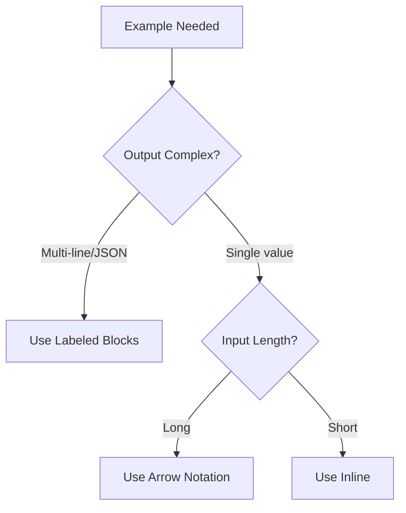

# Efficient Example Formatting

## Introduction

Few-shot examples are often the largest component of a prompt, yet many examples waste tokens on unnecessary formatting, redundant demonstrations, and verbose structures. This lesson teaches techniques for maximizing the teaching value of examples while minimizing their token footprint.

> **🔑 Key Insight:** A well-chosen single example can teach as much as five poorly chosen ones—at 80% fewer tokens.

### What We'll Cover

- Minimal example structure
- Representative example selection
- Combined examples for multiple patterns
- Dynamic example count strategies
- Example compression techniques

### Prerequisites

- [Removing Redundancy](./02-redundancy-removal.md)
- Understanding of few-shot prompting

---

## The Example Token Problem

### Where Example Tokens Go

| Component | Token Impact | Compressibility |
|-----------|--------------|-----------------|
| Input text | High | Medium |
| Output text | High | High |
| Formatting/separators | Medium | High |
| Explanations | Medium | Very High |
| Metadata/labels | Low | High |

### Example Token Budget Analysis

```python
def analyze_example_tokens(examples: list[dict]) -> dict:
    """Break down token usage in examples."""
    
    breakdown = {
        "inputs": 0,
        "outputs": 0, 
        "formatting": 0,
        "explanations": 0,
        "total": 0
    }
    
    for ex in examples:
        breakdown["inputs"] += count_tokens(ex.get("input", ""))
        breakdown["outputs"] += count_tokens(ex.get("output", ""))
        breakdown["formatting"] += count_tokens(ex.get("separator", ""))
        breakdown["explanations"] += count_tokens(ex.get("explanation", ""))
    
    breakdown["total"] = sum(breakdown.values())
    
    # Calculate percentages
    for key in breakdown:
        if key != "total":
            breakdown[f"{key}_pct"] = breakdown[key] / breakdown["total"] * 100
    
    return breakdown
```

---

## Minimal Example Structure

### Verbose vs Minimal Formatting

**Verbose (25 tokens per example):**
```
Example 1:
Input: "The movie was absolutely fantastic!"
Output: "positive"
Explanation: The word "fantastic" indicates strong positive sentiment.

---

Example 2:
...
```

**Minimal (8 tokens per example):**
```
"The movie was absolutely fantastic!" → positive
"Terrible waste of time" → negative
```

**Savings:** 68% per example

### Format Comparison

| Format | Tokens/Example | Best For |
|--------|----------------|----------|
| Labeled blocks | 20-30 | Complex multi-step |
| Input/Output pairs | 12-18 | Structured data |
| Arrow notation | 6-12 | Simple mappings |
| Inline | 4-8 | Very short I/O |

### Choosing the Right Format



---

## Arrow Notation Deep Dive

### Basic Arrow Format

```
Input → Output
```

**Examples:**
```
"I love it!" → positive
"This is broken" → negative  
"Package arrived" → neutral
```

### Extended Arrow Notation

For multiple outputs:
```
"Great but expensive" → sentiment:mixed, topics:[quality,price]
```

For transformations:
```
"hello world" → HELLO WORLD | type:uppercase
```

For chains:
```
raw_text → cleaned → entities → summary
```

### When Arrow Notation Breaks Down

| Situation | Use Instead |
|-----------|-------------|
| Multi-line output | Labeled blocks |
| JSON output | Code blocks |
| Multiple transformation steps | Numbered steps |
| Need to explain "why" | Inline comments |

---

## Representative Example Selection

### The Coverage Principle

Select examples that collectively cover all important cases:

```python
def select_representative_examples(
    examples: list[dict],
    target_count: int = 3
) -> list[dict]:
    """Select examples that maximize coverage."""
    
    # Define coverage dimensions
    dimensions = {
        "output_classes": set(),
        "edge_cases": set(),
        "input_lengths": set(),  # short/medium/long
        "special_patterns": set()  # negation, questions, etc.
    }
    
    # Score each example by unique coverage
    scored = []
    for ex in examples:
        coverage = analyze_coverage(ex)
        new_coverage = calculate_new_coverage(coverage, dimensions)
        scored.append((ex, new_coverage))
    
    # Greedy selection
    selected = []
    for _ in range(target_count):
        # Pick example with highest new coverage
        scored.sort(key=lambda x: -x[1])
        if scored and scored[0][1] > 0:
            best = scored.pop(0)[0]
            selected.append(best)
            update_dimensions(dimensions, best)
            # Rescore remaining
            scored = [(ex, calculate_new_coverage(analyze_coverage(ex), dimensions)) 
                      for ex, _ in scored]
    
    return selected

def analyze_coverage(example: dict) -> dict:
    """Analyze what an example covers."""
    return {
        "output_class": example["output"],
        "has_negation": "not" in example["input"].lower(),
        "is_question": "?" in example["input"],
        "input_length": categorize_length(example["input"]),
        "has_edge_case": example.get("is_edge_case", False)
    }
```

### Example Selection Matrix

| Dimension | Cover With |
|-----------|------------|
| All output classes | 1 example per class minimum |
| Edge cases | Unusual inputs that require special handling |
| Input variations | Different lengths, formats, styles |
| Boundary conditions | Near-threshold cases |

### Before and After: Sentiment Examples

**Before (10 examples, 80 tokens):**
```
"I love this!" → positive
"Amazing product!" → positive
"So happy!" → positive
"Best ever!" → positive
"Hate it" → negative
"Terrible" → negative  
"Awful" → negative
"The worst" → negative
"It's okay" → neutral
"Fine I guess" → neutral
```

**After (4 examples, 35 tokens):**
```
"I love this product!" → positive
"Terrible, complete waste" → negative
"Package arrived Tuesday" → neutral
"Good features but too expensive" → mixed
```

**Coverage comparison:**

| Dimension | Before | After |
|-----------|--------|-------|
| Output classes | 3 | 4 (added mixed) |
| Shows contrast words | ❌ | ✅ ("but") |
| Factual neutral | ❌ | ✅ |
| Token efficiency | 8 tok/example | 9 tok/example |

---

## Combined Examples

### Multi-Pattern Examples

One example can demonstrate multiple rules:

**Separate examples (3 examples, ~45 tokens):**
```
"Hello" → greeting: "Hi there!"
"What's 2+2?" → answer: "4"
"Tell me a joke" → joke: "Why did..."
```

**Combined example (1 example, ~25 tokens):**
```
User: "Hey, what's 2+2, and tell me a joke?"
Response: "Hi! 2+2 equals 4. Here's a joke: Why did..."

(Shows: greeting handling, math, jokes, multi-part requests)
```

### Compound Input Examples

```
Input: "The NEW iPhone 15!! 📱 is amazing but SO expensive omg $1200?!"

Output: {
  "product": "iPhone 15",
  "sentiment": "mixed",
  "emotions": ["excitement", "shock"],
  "concerns": ["price"],
  "has_emoji": true,
  "informal_language": true
}

(Demonstrates: product extraction, mixed sentiment, emoji handling, 
 informal text, price extraction—all in one example)
```

### When NOT to Combine

| Keep Separate When | Reason |
|-------------------|--------|
| Edge cases | Need clear focus |
| Error handling | One error type per example |
| Complex outputs | Readability matters |
| Teaching beginners | Clarity over efficiency |

---

## Dynamic Example Count

### Adaptive Example Strategies

```python
def calculate_optimal_examples(
    task_complexity: str,
    model_capability: str,
    input_length: int,
    token_budget: int
) -> int:
    """Determine optimal number of examples."""
    
    base_count = {
        ("simple", "high"): 1,    # GPT-4 on simple task
        ("simple", "medium"): 2,  # GPT-3.5 on simple task
        ("simple", "low"): 3,     # Smaller model
        ("medium", "high"): 2,
        ("medium", "medium"): 3,
        ("medium", "low"): 5,
        ("complex", "high"): 3,
        ("complex", "medium"): 5,
        ("complex", "low"): 8,
    }.get((task_complexity, model_capability), 3)
    
    # Adjust for input length (longer inputs = fewer examples fit)
    if input_length > 1000:
        base_count = max(1, base_count - 1)
    
    # Adjust for token budget
    tokens_per_example = estimate_example_tokens(task_complexity)
    max_from_budget = token_budget // tokens_per_example
    
    return min(base_count, max_from_budget)
```

### Model-Specific Recommendations

| Model Tier | Simple Task | Medium Task | Complex Task |
|------------|-------------|-------------|--------------|
| GPT-4/Claude 3 Opus | 0-1 | 1-2 | 2-3 |
| GPT-3.5/Claude 3 Sonnet | 1-2 | 2-3 | 3-5 |
| Smaller models | 2-3 | 4-5 | 5-8 |

> **🤖 AI Context:** Larger models have more "world knowledge" baked in and require fewer examples to understand a task pattern.

### Zero-Shot vs Few-Shot Decision

```python
def should_use_examples(
    task_type: str,
    output_format: str,
    model: str
) -> dict:
    """Decide if examples are needed."""
    
    # Tasks where examples add little value
    zero_shot_tasks = [
        "summarization",
        "translation", 
        "simple_qa",
        "grammar_correction"
    ]
    
    # Tasks that benefit significantly from examples
    few_shot_tasks = [
        "custom_classification",
        "specific_format_output",
        "domain_specific_extraction",
        "style_matching"
    ]
    
    if task_type in zero_shot_tasks:
        return {"use_examples": False, "reason": "Task is well-understood"}
    
    if task_type in few_shot_tasks:
        return {"use_examples": True, "recommended_count": 2-3}
    
    # Custom format always needs examples
    if output_format not in ["text", "json", "markdown"]:
        return {"use_examples": True, "reason": "Custom format needs demonstration"}
    
    return {"use_examples": "optional", "test_both": True}
```

---

## Example Compression Techniques

### Shortening Example Inputs

**Original input (18 tokens):**
```
"I recently purchased this product and I have to say that I am extremely 
disappointed with the overall quality."
```

**Shortened input (8 tokens):**
```
"Extremely disappointed with the quality"
```

The model learns the same pattern from the compressed version.

### Shortening Example Outputs

**Verbose output:**
```json
{
  "sentiment_classification": "negative",
  "confidence_level": "high",
  "key_indicators": ["disappointed", "quality"],
  "recommendation": "Flag for customer service follow-up"
}
```

**Compressed output:**
```json
{"sentiment":"negative","confidence":"high","keywords":["disappointed","quality"]}
```

### The Minimum Viable Example

| Component | Include If | Exclude If |
|-----------|------------|------------|
| Full input | Shows important patterns | Length doesn't matter to pattern |
| Full output | Format is complex | Output is predictable |
| Explanation | Edge case handling | Pattern is obvious |
| Metadata | Demonstrates required fields | Model can infer |

---

## Example Libraries and Caching

### Building an Example Library

```python
class ExampleLibrary:
    """Manage and select examples efficiently."""
    
    def __init__(self):
        self.examples = {}  # category -> list of examples
        self.token_cache = {}  # example_id -> token_count
        
    def add_example(self, category: str, example: dict):
        """Add example with automatic token counting."""
        if category not in self.examples:
            self.examples[category] = []
        
        example["id"] = f"{category}_{len(self.examples[category])}"
        example["tokens"] = count_tokens(format_example(example))
        self.examples[category].append(example)
    
    def get_examples(
        self, 
        categories: list[str],
        token_budget: int,
        strategy: str = "coverage"
    ) -> list[dict]:
        """Select examples within token budget."""
        
        # Gather candidates
        candidates = []
        for cat in categories:
            candidates.extend(self.examples.get(cat, []))
        
        if strategy == "coverage":
            return self._select_for_coverage(candidates, token_budget)
        elif strategy == "random":
            return self._select_random(candidates, token_budget)
        elif strategy == "shortest":
            return self._select_shortest(candidates, token_budget)
    
    def _select_for_coverage(
        self, 
        candidates: list[dict], 
        budget: int
    ) -> list[dict]:
        """Select diverse examples within budget."""
        selected = []
        remaining_budget = budget
        covered_patterns = set()
        
        # Sort by unique patterns per token
        candidates = sorted(
            candidates,
            key=lambda x: len(x.get("patterns", [])) / x["tokens"],
            reverse=True
        )
        
        for example in candidates:
            if example["tokens"] <= remaining_budget:
                new_patterns = set(example.get("patterns", [])) - covered_patterns
                if new_patterns:  # Only add if teaches something new
                    selected.append(example)
                    remaining_budget -= example["tokens"]
                    covered_patterns.update(new_patterns)
        
        return selected
```

### Caching Examples with Prompt Caching

Structure prompts to maximize example caching:

```python
# Good: Examples at the start (cacheable)
prompt = """
Examples:
{examples}

---
Now process this input:
{user_input}
"""

# Bad: Examples after dynamic content (not cacheable)
prompt = """
Process this input:
{user_input}

Here are some examples to guide you:
{examples}
"""
```

---

## Hands-on Exercise

### Your Task

Optimize this set of examples for a customer intent classification task.

**Original (8 examples, ~120 tokens):**
```
Example 1:
Input: "I want to cancel my subscription please"
Output: cancel_subscription
Explanation: Customer explicitly requests cancellation

Example 2:
Input: "Please cancel my account"
Output: cancel_subscription
Explanation: Account cancellation is same as subscription

Example 3:
Input: "How do I unsubscribe?"
Output: cancel_subscription
Explanation: Unsubscribe = cancel

Example 4:
Input: "What's my current balance?"
Output: billing_inquiry
Explanation: Asking about money

Example 5:
Input: "I was charged twice"
Output: billing_dispute
Explanation: Duplicate charge complaint

Example 6:
Input: "When does my plan renew?"
Output: billing_inquiry
Explanation: Renewal timing question

Example 7:
Input: "How do I change my password?"
Output: account_settings
Explanation: Password is account setting

Example 8:
Input: "Update my email address"
Output: account_settings
Explanation: Email is account setting
```

### Requirements

1. Reduce to 4 examples maximum
2. Maintain coverage of all 4 intent categories
3. Use minimal formatting
4. Total under 45 tokens

<details>
<summary>💡 Hints (click to expand)</summary>

- Examples 1-3 all teach the same output (cancel)
- Keep one cancel example with most distinctive language
- Use arrow notation
- Remove all explanations

</details>

<details>
<summary>✅ Solution (click to expand)</summary>

**Optimized Examples (4 examples, 38 tokens):**
```
"Cancel my subscription" → cancel_subscription
"What's my balance?" → billing_inquiry
"Charged twice, need refund" → billing_dispute  
"Change my password" → account_settings
```

**Coverage Analysis:**
- ✅ cancel_subscription: 1 example (was 3)
- ✅ billing_inquiry: 1 example (was 2)
- ✅ billing_dispute: 1 example (unchanged)
- ✅ account_settings: 1 example (was 2)

**Token Reduction:** 68% (120 → 38 tokens)

</details>

---

## Summary

✅ Use minimal formatting: arrow notation for simple mappings
✅ Select examples for coverage, not quantity
✅ Combine examples to demonstrate multiple patterns
✅ Adjust example count based on model capability
✅ Compress example inputs and outputs where possible
✅ Structure prompts to cache examples effectively

**Next:** [Cost-Aware Prompt Design](./04-cost-aware-design.md)

---

## Further Reading

- [Few-Shot Prompting](https://platform.openai.com/docs/guides/prompt-engineering) - OpenAI best practices
- [Prompt Caching](https://platform.openai.com/docs/guides/prompt-caching) - Cache static examples
- [Model Selection Guide](https://platform.openai.com/docs/models) - Match model to task

---

<!-- 
Sources Consulted:
- OpenAI Latency Optimization: Fewer tokens, example efficiency
- OpenAI Prompt Caching: Structure for cacheability
- Few-shot learning research and patterns
-->
