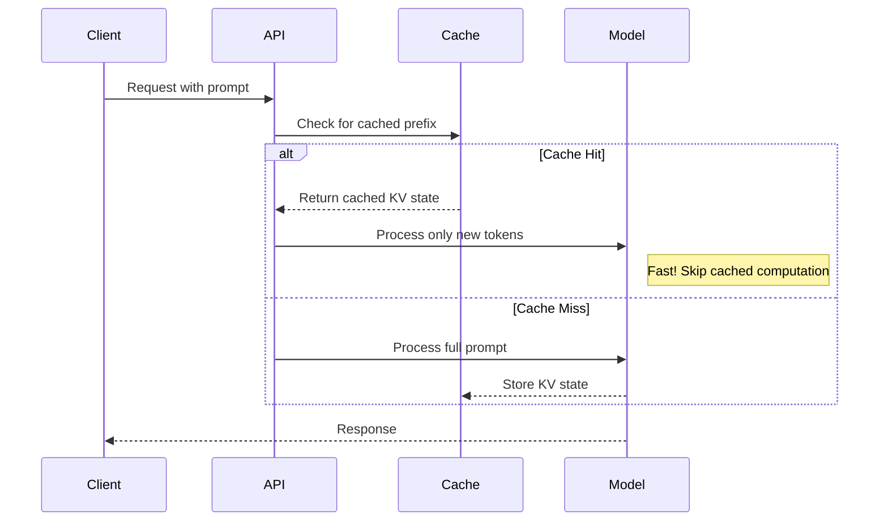
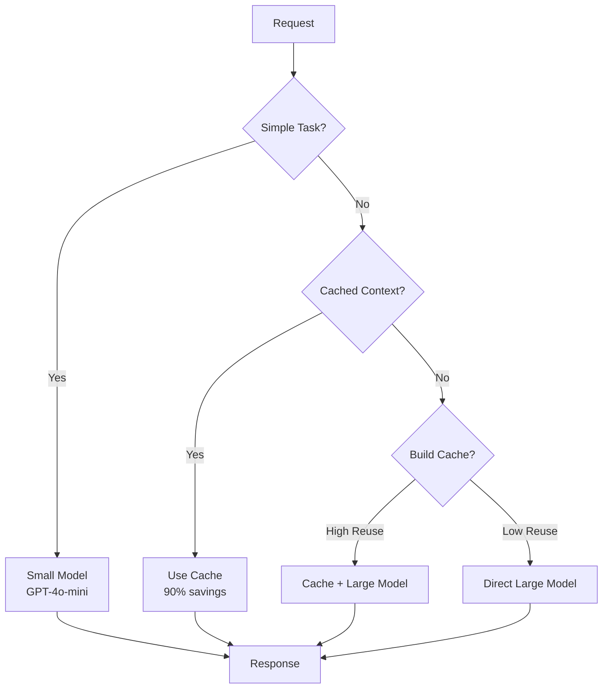

# Cost-Aware Prompt Design

## Introduction

Every token has a price. At scale, small inefficiencies compound into significant costs. This lesson teaches systematic approaches to designing prompts that optimize for cost while maintaining quality, including provider-specific caching strategies that can reduce costs by up to 90%.

> **🔑 Key Insight:** The cheapest token is the one you don't send. The second cheapest is a cached token.

### What We'll Cover

- Token budget allocation strategies
- Provider caching mechanisms (OpenAI, Anthropic, Google)
- Cost monitoring and optimization
- ROI-based prompt prioritization
- Production cost patterns

### Prerequisites

- [Efficient Example Formatting](./03-efficient-examples.md)
- Understanding of API pricing models

---

## Understanding Token Economics

### Provider Pricing Models

| Provider | Model | Input Cost | Output Cost | Cached Input |
|----------|-------|------------|-------------|--------------|
| OpenAI | GPT-4o | $2.50/1M | $10.00/1M | $1.25/1M (50% off) |
| OpenAI | GPT-4o-mini | $0.15/1M | $0.60/1M | $0.075/1M |
| Anthropic | Claude 3.5 Sonnet | $3.00/1M | $15.00/1M | $0.30/1M (90% off) |
| Google | Gemini 1.5 Pro | $1.25/1M | $5.00/1M | Variable |

> **Note:** Prices as of 2024. Check provider documentation for current rates.

### The Output Token Premium

Output tokens typically cost 3-5x more than input tokens. This asymmetry drives optimization strategy:

```python
def calculate_request_cost(
    input_tokens: int,
    output_tokens: int,
    cached_input_tokens: int = 0,
    model: str = "gpt-4o"
) -> dict:
    """Calculate cost breakdown for a request."""
    
    pricing = {
        "gpt-4o": {"input": 2.50, "output": 10.00, "cached": 1.25},
        "gpt-4o-mini": {"input": 0.15, "output": 0.60, "cached": 0.075},
        "claude-3.5-sonnet": {"input": 3.00, "output": 15.00, "cached": 0.30},
    }
    
    rates = pricing.get(model, pricing["gpt-4o"])
    
    uncached_input = input_tokens - cached_input_tokens
    
    input_cost = (uncached_input * rates["input"] / 1_000_000)
    cached_cost = (cached_input_tokens * rates["cached"] / 1_000_000)
    output_cost = (output_tokens * rates["output"] / 1_000_000)
    
    return {
        "input_cost": input_cost,
        "cached_cost": cached_cost,
        "output_cost": output_cost,
        "total_cost": input_cost + cached_cost + output_cost,
        "cache_savings": (cached_input_tokens * (rates["input"] - rates["cached"]) / 1_000_000)
    }
```

---

## Prompt Caching Deep Dive

### How Prompt Caching Works



### OpenAI Automatic Caching

OpenAI caches automatically for prompts ≥1024 tokens:

```python
from openai import OpenAI

client = OpenAI()

# Structure prompt for caching: static content first
system_prompt = """
You are an expert code reviewer. Follow these guidelines...
[... 1500+ tokens of static instructions ...]
"""  # This part gets cached

# Dynamic content at the end
user_message = f"Review this code:\n{code}"  # This part is not cached

response = client.chat.completions.create(
    model="gpt-4o",
    messages=[
        {"role": "system", "content": system_prompt},
        {"role": "user", "content": user_message}
    ]
)

# Check cache usage
usage = response.usage
print(f"Cached tokens: {usage.prompt_tokens_details.cached_tokens}")
print(f"Total prompt tokens: {usage.prompt_tokens}")
```

**OpenAI Caching Rules:**

| Rule | Detail |
|------|--------|
| Minimum tokens | 1,024 |
| Cache duration | 5-10 min (up to 1 hour with activity) |
| Match requirement | Exact prefix match |
| Models supported | GPT-4o, GPT-4o-mini, o1 series |
| Extended retention | 24h with `prompt_cache_key` (GPT-4.1+) |

### Anthropic Explicit Caching

Anthropic requires explicit cache control:

```python
import anthropic

client = anthropic.Anthropic()

response = client.messages.create(
    model="claude-3-5-sonnet-20241022",
    max_tokens=1024,
    system=[
        {
            "type": "text",
            "text": "You are an expert assistant...",
        },
        {
            "type": "text",
            "text": "[Large reference document - 5000+ tokens]",
            "cache_control": {"type": "ephemeral"}  # Cache this block
        }
    ],
    messages=[
        {"role": "user", "content": "Analyze section 3"}
    ]
)

# Check cache usage
usage = response.usage
print(f"Cache write tokens: {usage.cache_creation_input_tokens}")
print(f"Cache read tokens: {usage.cache_read_input_tokens}")
print(f"Regular input: {usage.input_tokens}")
```

**Anthropic Caching Rules:**

| Rule | Detail |
|------|--------|
| Minimum tokens | 1,024-4,096 (model dependent) |
| Cache breakpoints | Maximum 4 per request |
| Default TTL | 5 minutes |
| Extended TTL | 1 hour (100% write premium) |
| Write cost | 25% premium (5-min) or 100% (1-hour) |
| Read discount | 90% off |

### TTL Strategy Selection

```python
def select_cache_ttl(
    expected_reuse_frequency: str,
    content_stability: str,
    token_count: int
) -> dict:
    """Recommend cache TTL strategy."""
    
    # Calculate break-even point
    # 5-min: 1.25x write cost, 0.1x read cost
    # 1-hour: 2.0x write cost, 0.1x read cost
    
    strategies = {
        # High frequency (>3 reads per 5 min)
        ("high", "stable"): {
            "ttl": "1h",
            "reason": "Frequent reuse justifies higher write cost"
        },
        ("high", "volatile"): {
            "ttl": "5m", 
            "reason": "Content may change, shorter TTL safer"
        },
        # Medium frequency (1-3 reads per 5 min)
        ("medium", "stable"): {
            "ttl": "5m",
            "reason": "Default TTL sufficient for moderate reuse"
        },
        ("medium", "volatile"): {
            "ttl": "5m",
            "reason": "Standard caching, refresh as needed"
        },
        # Low frequency (<1 read per 5 min)
        ("low", "stable"): {
            "ttl": "none",
            "reason": "Infrequent reuse doesn't justify cache write cost"
        },
        ("low", "volatile"): {
            "ttl": "none",
            "reason": "Skip caching entirely"
        }
    }
    
    strategy = strategies.get(
        (expected_reuse_frequency, content_stability),
        {"ttl": "5m", "reason": "Default safe choice"}
    )
    
    # Override for very large content
    if token_count > 10000 and expected_reuse_frequency != "low":
        strategy["ttl"] = "1h"
        strategy["reason"] = "Large content benefits from longer cache"
    
    return strategy
```

### Google Gemini Caching

Gemini supports both implicit and explicit caching:

```python
import google.generativeai as genai

# Create explicit cache for large context
cache = genai.caching.CachedContent.create(
    model="gemini-1.5-pro",
    system_instruction="You are a document analyst...",
    contents=[
        # Large documents to cache
        {"role": "user", "parts": [large_document]},
        {"role": "model", "parts": ["I've processed the document."]}
    ],
    ttl=datetime.timedelta(hours=1)
)

# Use cached content
model = genai.GenerativeModel.from_cached_content(cache)
response = model.generate_content("Summarize section 5")

# Clean up when done
cache.delete()
```

---

## Token Budget Allocation

### The Budget Framework

```python
@dataclass
class TokenBudget:
    total: int
    system_prompt: int
    examples: int
    context: int
    user_input: int
    output_reserve: int
    
    @classmethod
    def create(
        cls, 
        total_context: int,
        max_output: int,
        task_complexity: str = "medium"
    ) -> "TokenBudget":
        """Create balanced token budget."""
        
        output_reserve = max_output
        available = total_context - output_reserve
        
        allocations = {
            "simple": {"system": 0.10, "examples": 0.05, "context": 0.75, "user": 0.10},
            "medium": {"system": 0.15, "examples": 0.15, "context": 0.55, "user": 0.15},
            "complex": {"system": 0.20, "examples": 0.25, "context": 0.40, "user": 0.15},
        }
        
        alloc = allocations.get(task_complexity, allocations["medium"])
        
        return cls(
            total=total_context,
            system_prompt=int(available * alloc["system"]),
            examples=int(available * alloc["examples"]),
            context=int(available * alloc["context"]),
            user_input=int(available * alloc["user"]),
            output_reserve=output_reserve
        )
    
    def validate_prompt(self, prompt_tokens: dict) -> dict:
        """Check if prompt fits budget."""
        issues = []
        
        if prompt_tokens.get("system", 0) > self.system_prompt:
            issues.append(f"System prompt over budget by {prompt_tokens['system'] - self.system_prompt}")
        if prompt_tokens.get("examples", 0) > self.examples:
            issues.append(f"Examples over budget by {prompt_tokens['examples'] - self.examples}")
        
        return {
            "valid": len(issues) == 0,
            "issues": issues,
            "utilization": sum(prompt_tokens.values()) / self.total
        }
```

### Priority-Based Content Selection

When you can't fit everything, prioritize:

| Priority | Content Type | Reason |
|----------|--------------|--------|
| 1 (Critical) | Output format spec | Must have correct format |
| 2 (High) | Core task instructions | Defines what to do |
| 3 (High) | Safety constraints | Prevents bad outputs |
| 4 (Medium) | Key examples (1-2) | Demonstrates pattern |
| 5 (Medium) | Relevant context | Grounds responses |
| 6 (Low) | Additional examples | Marginal improvement |
| 7 (Low) | Explanations | Nice to have |

```python
def prioritized_prompt_builder(
    components: list[dict],
    token_budget: int
) -> str:
    """Build prompt respecting priorities and budget."""
    
    # Sort by priority
    sorted_components = sorted(components, key=lambda x: x["priority"])
    
    selected = []
    remaining = token_budget
    
    for component in sorted_components:
        tokens = count_tokens(component["content"])
        
        if tokens <= remaining:
            selected.append(component)
            remaining -= tokens
        elif component["priority"] <= 3:
            # Critical components: try to compress
            compressed = compress_content(component["content"], remaining)
            if compressed:
                selected.append({**component, "content": compressed})
                remaining -= count_tokens(compressed)
    
    # Assemble in logical order (not priority order)
    selected.sort(key=lambda x: x.get("position", 0))
    return "\n\n".join(c["content"] for c in selected)
```

---

## Cost Monitoring System

### Real-Time Cost Tracking

```python
from datetime import datetime, timedelta
from collections import defaultdict

class CostTracker:
    """Track and analyze API costs in real-time."""
    
    def __init__(self, daily_budget: float = 100.0):
        self.daily_budget = daily_budget
        self.requests = []
        self.costs_by_model = defaultdict(float)
        self.costs_by_endpoint = defaultdict(float)
        
    def log_request(
        self,
        model: str,
        endpoint: str,
        input_tokens: int,
        output_tokens: int,
        cached_tokens: int = 0
    ):
        """Log a request and calculate cost."""
        
        cost = calculate_request_cost(
            input_tokens, output_tokens, cached_tokens, model
        )["total_cost"]
        
        self.requests.append({
            "timestamp": datetime.now(),
            "model": model,
            "endpoint": endpoint,
            "input_tokens": input_tokens,
            "output_tokens": output_tokens,
            "cached_tokens": cached_tokens,
            "cost": cost
        })
        
        self.costs_by_model[model] += cost
        self.costs_by_endpoint[endpoint] += cost
        
        # Check budget alerts
        daily_total = self.get_daily_total()
        if daily_total > self.daily_budget * 0.8:
            self._alert_budget_warning(daily_total)
    
    def get_daily_total(self) -> float:
        """Get today's total spend."""
        today = datetime.now().date()
        return sum(
            r["cost"] for r in self.requests 
            if r["timestamp"].date() == today
        )
    
    def get_optimization_report(self) -> dict:
        """Generate cost optimization recommendations."""
        
        recent = [r for r in self.requests 
                  if r["timestamp"] > datetime.now() - timedelta(hours=24)]
        
        if not recent:
            return {"message": "No recent data"}
        
        # Analyze patterns
        total_input = sum(r["input_tokens"] for r in recent)
        total_output = sum(r["output_tokens"] for r in recent)
        total_cached = sum(r["cached_tokens"] for r in recent)
        
        cache_rate = total_cached / total_input if total_input > 0 else 0
        output_ratio = total_output / total_input if total_input > 0 else 0
        
        recommendations = []
        
        if cache_rate < 0.3:
            recommendations.append({
                "type": "caching",
                "message": "Cache utilization low ({}%). Restructure prompts for better caching.".format(
                    int(cache_rate * 100)
                ),
                "potential_savings": "Up to 50% on input costs"
            })
        
        if output_ratio > 2:
            recommendations.append({
                "type": "output_control",
                "message": "High output ratio ({}:1). Consider max_tokens limits.".format(
                    round(output_ratio, 1)
                ),
                "potential_savings": "20-40% on output costs"
            })
        
        # Model recommendations
        expensive_models = [m for m, c in self.costs_by_model.items() 
                          if c > self.daily_budget * 0.3]
        if expensive_models:
            recommendations.append({
                "type": "model_selection",
                "message": f"High usage of expensive models: {expensive_models}",
                "potential_savings": "Consider smaller models for simple tasks"
            })
        
        return {
            "total_cost_24h": sum(r["cost"] for r in recent),
            "cache_utilization": cache_rate,
            "output_ratio": output_ratio,
            "recommendations": recommendations
        }
```

### Cost Dashboard Metrics

| Metric | Formula | Target |
|--------|---------|--------|
| Cache hit rate | cached_tokens / total_input | > 50% |
| Output efficiency | useful_output / total_output | > 80% |
| Cost per request | total_cost / request_count | Trending down |
| Cost per successful output | cost / quality_outputs | Minimize |

---

## ROI-Based Optimization

### Calculating Prompt ROI

```python
def calculate_prompt_roi(
    prompt_cost: float,        # Cost per request
    success_rate: float,       # % of good outputs
    value_per_success: float,  # Business value of good output
    volume: int                # Requests per day
) -> dict:
    """Calculate ROI for a prompt configuration."""
    
    daily_cost = prompt_cost * volume
    daily_successes = volume * success_rate
    daily_value = daily_successes * value_per_success
    
    roi = (daily_value - daily_cost) / daily_cost if daily_cost > 0 else 0
    
    return {
        "daily_cost": daily_cost,
        "daily_value": daily_value,
        "daily_profit": daily_value - daily_cost,
        "roi_percentage": roi * 100,
        "cost_per_success": prompt_cost / success_rate if success_rate > 0 else float('inf'),
        "break_even_success_rate": prompt_cost / value_per_success
    }

# Compare optimization options
def compare_optimizations(baseline: dict, optimizations: list[dict]) -> list[dict]:
    """Compare different prompt optimization strategies."""
    
    baseline_roi = calculate_prompt_roi(**baseline)
    
    results = []
    for opt in optimizations:
        opt_roi = calculate_prompt_roi(**opt["params"])
        improvement = opt_roi["daily_profit"] - baseline_roi["daily_profit"]
        
        results.append({
            "name": opt["name"],
            "daily_savings": baseline_roi["daily_cost"] - opt_roi["daily_cost"],
            "profit_improvement": improvement,
            "new_roi": opt_roi["roi_percentage"],
            "recommendation": "IMPLEMENT" if improvement > 0 else "SKIP"
        })
    
    return sorted(results, key=lambda x: -x["profit_improvement"])
```

---

## Production Cost Patterns

### Common Cost Sinks

| Pattern | Cost Impact | Solution |
|---------|-------------|----------|
| Verbose system prompts | 15-30% waste | Compress to essentials |
| Uncached repeated context | 50%+ waste | Implement caching |
| No output limits | Variable bloat | Set `max_tokens` |
| Wrong model choice | 10-50x cost | Match model to task |
| Retry storms | 2-10x cost | Implement backoff |

### Cost-Optimized Architecture



### Model Selection by Task

| Task Type | Recommended Model | Cost Rationale |
|-----------|------------------|----------------|
| Simple classification | GPT-4o-mini / Claude Haiku | 10-20x cheaper |
| Summarization | GPT-4o-mini | Quality sufficient |
| Code generation | GPT-4o / Claude Sonnet | Quality critical |
| Complex reasoning | o1-mini / Claude Opus | Worth the premium |
| High-volume embedding | text-embedding-3-small | Lowest cost |

---

## Hands-on Exercise

### Your Task

Design a cost-optimized prompt system for a customer support chatbot that handles 10,000 requests/day.

**Current State:**
- Using GPT-4o for all requests
- 2,000 token system prompt (not cached)
- 500 token average user input
- 800 token average output
- Current daily cost: ~$200/day

### Requirements

1. Reduce daily cost by at least 50%
2. Maintain quality for complex issues
3. Implement caching strategy
4. Create tiered model selection

<details>
<summary>💡 Hints (click to expand)</summary>

- Not all requests need GPT-4o
- The system prompt is perfect for caching
- Consider routing simple questions to smaller models
- Set output limits for common responses

</details>

<details>
<summary>✅ Solution (click to expand)</summary>

**Optimized Architecture:**

```python
class OptimizedSupportBot:
    def __init__(self):
        self.cost_tracker = CostTracker()
        # Cache the system prompt (2000 tokens)
        self.system_prompt = self._load_cached_system_prompt()
        
    def handle_request(self, user_input: str) -> str:
        # Step 1: Classify complexity with cheap model
        complexity = self._classify_complexity(user_input)  # GPT-4o-mini
        
        # Step 2: Route to appropriate handler
        if complexity == "simple":
            # 60% of requests - FAQ, status checks
            return self._handle_simple(user_input)  # GPT-4o-mini, max_tokens=200
        elif complexity == "medium":
            # 30% of requests - standard support
            return self._handle_medium(user_input)  # GPT-4o-mini, cached prompt
        else:
            # 10% of requests - complex issues
            return self._handle_complex(user_input)  # GPT-4o, full context
    
    def _classify_complexity(self, text: str) -> str:
        # Ultra-cheap classification (50 tokens response)
        # Cost: ~$0.00001 per request
        pass
    
    def _handle_simple(self, text: str) -> str:
        # GPT-4o-mini with minimal prompt
        # Cost: ~$0.0002 per request
        pass
    
    def _handle_medium(self, text: str) -> str:
        # GPT-4o-mini with cached system prompt
        # Cost: ~$0.0004 per request
        pass
    
    def _handle_complex(self, text: str) -> str:
        # GPT-4o with full context
        # Cost: ~$0.01 per request
        pass
```

**Cost Breakdown:**

| Tier | Volume | Model | Cost/Request | Daily Cost |
|------|--------|-------|--------------|------------|
| Classifier | 10,000 | GPT-4o-mini | $0.00001 | $0.10 |
| Simple | 6,000 | GPT-4o-mini | $0.0002 | $1.20 |
| Medium | 3,000 | GPT-4o-mini + cache | $0.0004 | $1.20 |
| Complex | 1,000 | GPT-4o + cache | $0.008 | $8.00 |
| **Total** | | | | **$10.50** |

**Savings: 95% reduction ($200 → $10.50)**

Key optimizations:
1. ✅ Tier-based model selection
2. ✅ Cached system prompt (saves ~$50/day alone)
3. ✅ Output limits on simple responses
4. ✅ Cheap classifier for routing

</details>

---

## Summary

✅ Understand token economics: output costs 3-5x more than input
✅ Implement caching: structure prompts with static content first
✅ Use provider-specific caching: OpenAI (automatic), Anthropic (explicit)
✅ Allocate token budgets based on task priority
✅ Monitor costs in real-time with alerts
✅ Route requests to appropriate model tiers

**Next:** [Predicted Outputs and Speculative Decoding](./05-predicted-outputs.md)

---

## Further Reading

- [OpenAI Prompt Caching Guide](https://platform.openai.com/docs/guides/prompt-caching) - Automatic caching
- [Anthropic Prompt Caching](https://docs.anthropic.com/en/docs/build-with-claude/prompt-caching) - Explicit caching
- [Gemini Context Caching](https://ai.google.dev/gemini-api/docs/caching) - Google's approach
- [OpenAI Pricing](https://openai.com/api/pricing/) - Current rates

---

<!-- 
Sources Consulted:
- OpenAI Prompt Caching Guide: Automatic caching, structure optimization
- Anthropic Prompt Caching: Explicit cache_control, TTL options, pricing
- Google Gemini Context Caching: Explicit cache creation
- OpenAI Latency Optimization: Model selection, cost-performance tradeoffs
-->
