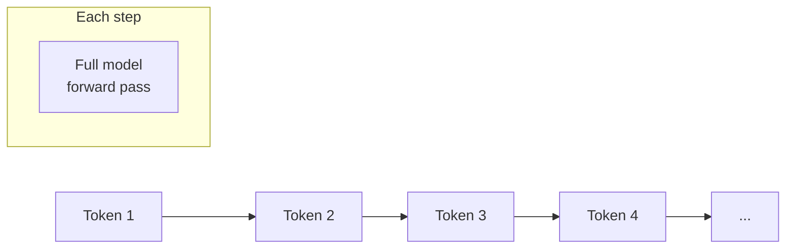
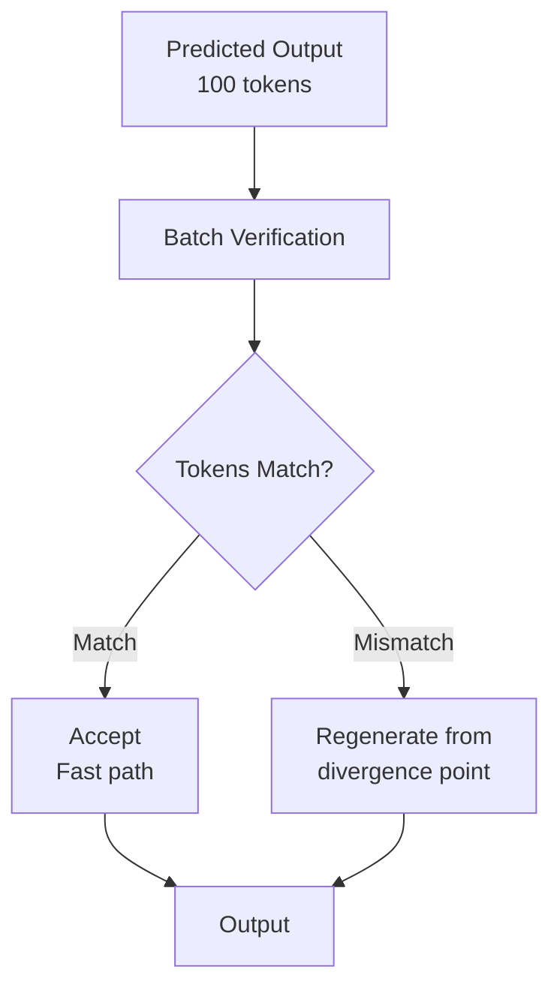

# Predicted Outputs and Speculative Decoding

## Introduction

When you already know most of what the model will output, you're paying for computation you don't need. Predicted outputs let you provide the expected response upfront, allowing the model to verify rather than generate—dramatically reducing latency for predictable tasks like code refactoring, template filling, and document regeneration.

> **🔑 Key Insight:** Verification is faster than generation. When output is mostly predictable, let the model confirm rather than create.

### What We'll Cover

- How predicted outputs work
- Speculative decoding concepts
- Optimal use cases
- Implementation patterns
- Streaming with predictions
- Limitations and trade-offs

### Prerequisites

- [Cost-Aware Prompt Design](./04-cost-aware-design.md)
- Understanding of token generation

---

## Understanding Speculative Decoding

### Traditional Token Generation

Models generate tokens one at a time, each requiring a forward pass through the network:



**Time:** O(n) forward passes for n tokens

### Speculative Decoding

With a prediction, the model can verify multiple tokens in parallel:



**Time:** O(1) for matching tokens, O(n) only for differences

### Why It's Faster

| Scenario | Traditional | With Prediction |
|----------|-------------|-----------------|
| 100 matching tokens | 100 forward passes | 1 verification pass |
| 90 matching + 10 new | 100 forward passes | 1 + 10 passes |
| 50 matching + 50 new | 100 forward passes | 1 + 50 passes |

---

## OpenAI Predicted Outputs API

### Basic Usage

```python
from openai import OpenAI

client = OpenAI()

# Original code that needs minor refactoring
original_code = """
def calculate_total(items):
    total = 0
    for item in items:
        total = total + item.price
    return total
"""

# Predicted output (what we expect after refactoring)
predicted_code = """
def calculate_total(items: list[Item]) -> float:
    total = 0
    for item in items:
        total += item.price
    return total
"""

response = client.chat.completions.create(
    model="gpt-4o",
    messages=[
        {
            "role": "user",
            "content": f"Add type hints to this function:\n\n{original_code}"
        }
    ],
    prediction={
        "type": "content",
        "content": predicted_code
    }
)

# Check prediction acceptance
usage = response.usage.completion_tokens_details
print(f"Accepted prediction tokens: {usage.accepted_prediction_tokens}")
print(f"Rejected prediction tokens: {usage.rejected_prediction_tokens}")
```

### Understanding the Response

```python
# Successful prediction (most tokens accepted)
{
    "completion_tokens_details": {
        "accepted_prediction_tokens": 45,
        "rejected_prediction_tokens": 3,
        "reasoning_tokens": 0
    }
}

# Poor prediction (many tokens rejected)
{
    "completion_tokens_details": {
        "accepted_prediction_tokens": 5,
        "rejected_prediction_tokens": 95,
        "reasoning_tokens": 0
    }
}
```

> **Warning:** Rejected tokens are still billed at completion token rates. Bad predictions can cost more than no prediction.

---

## Optimal Use Cases

### When Predicted Outputs Excel

| Use Case | Prediction Quality | Latency Reduction |
|----------|-------------------|-------------------|
| Code refactoring (minor changes) | 90-95% match | 70-80% faster |
| Template filling | 95-99% match | 80-90% faster |
| Document regeneration | 85-95% match | 60-75% faster |
| Format conversion | 90-95% match | 70-80% faster |
| Adding comments/docstrings | 85-90% match | 50-70% faster |

### When to Avoid

| Use Case | Why Predictions Fail |
|----------|---------------------|
| Creative writing | Output is unpredictable |
| Open-ended questions | Many valid responses |
| Complex reasoning | Reasoning tokens needed |
| Function calling | Not supported |
| Audio output | Not supported |

### Code Refactoring Patterns

**Pattern: Add Type Hints**
```python
def add_type_hints(code: str) -> str:
    """Use predicted outputs for type hint addition."""
    
    # Parse existing code to build prediction
    predicted = code  # Start with original
    
    # Simple heuristics for common patterns
    predicted = predicted.replace("def ", "def ")  # Placeholder
    # In practice, use AST analysis to predict types
    
    response = client.chat.completions.create(
        model="gpt-4o",
        messages=[{"role": "user", "content": f"Add type hints:\n\n{code}"}],
        prediction={"type": "content", "content": predicted}
    )
    
    return response.choices[0].message.content
```

**Pattern: Rename Variables**
```python
def rename_variable(code: str, old_name: str, new_name: str) -> str:
    """Predicted output for variable renaming."""
    
    # Simple string replacement as prediction
    predicted = code.replace(old_name, new_name)
    
    response = client.chat.completions.create(
        model="gpt-4o",
        messages=[{
            "role": "user", 
            "content": f"Rename '{old_name}' to '{new_name}':\n\n{code}"
        }],
        prediction={"type": "content", "content": predicted}
    )
    
    return response.choices[0].message.content
```

### Template Filling

```python
def fill_template(template: str, data: dict) -> str:
    """Use prediction for template completion."""
    
    # Pre-fill known values
    predicted = template
    for key, value in data.items():
        predicted = predicted.replace(f"{{{{{key}}}}}", str(value))
    
    # Let model fill remaining placeholders with creativity
    response = client.chat.completions.create(
        model="gpt-4o",
        messages=[{
            "role": "user",
            "content": f"Complete this template with the given data:\n\n{template}\n\nData: {data}"
        }],
        prediction={"type": "content", "content": predicted}
    )
    
    return response.choices[0].message.content

# Example usage
template = """
Dear {{name}},

Thank you for your {{order_type}} order #{{order_id}}.

{{personalized_message}}

Best regards,
Customer Service
"""

data = {
    "name": "Alice",
    "order_type": "premium",
    "order_id": "12345"
}

# Predicted output will match everything except {{personalized_message}}
result = fill_template(template, data)
```

---

## Streaming with Predictions

### Why Streaming + Prediction Works Well

Streaming with predictions provides the best of both worlds:
- Immediate response start (streaming)
- Fast token delivery (prediction)
- Smooth user experience (no stuttering)

```python
def stream_with_prediction(prompt: str, prediction: str):
    """Stream response with predicted output."""
    
    stream = client.chat.completions.create(
        model="gpt-4o",
        messages=[{"role": "user", "content": prompt}],
        prediction={"type": "content", "content": prediction},
        stream=True
    )
    
    for chunk in stream:
        if chunk.choices[0].delta.content:
            yield chunk.choices[0].delta.content

# Usage
for token in stream_with_prediction(
    prompt="Add docstrings to this code:\n\n{code}",
    prediction=documented_code_prediction
):
    print(token, end="", flush=True)
```

### Streaming Behavior

| Scenario | Behavior |
|----------|----------|
| Matching tokens | Streamed quickly (verification only) |
| Divergence point | Brief pause, then generation |
| Post-divergence | Normal streaming speed |

---

## Position-Independent Matching

### How Matching Works

The prediction doesn't need to match from the start. The model finds matching sequences anywhere in the prediction:

```python
# Prediction
predicted = """
function hello() {
    console.log("Hello");
}

function world() {
    console.log("World");
}
"""

# If model generates a new function first, it can still match
# the rest of the prediction
actual_output = """
function greet(name) {
    console.log("Hi " + name);
}

function hello() {
    console.log("Hello");  # Matches prediction from here
}

function world() {
    console.log("World");
}
"""
```

### Implications

| Aspect | Impact |
|--------|--------|
| Partial matches | Still valuable for speed |
| Reordering | Can match non-sequential sections |
| Additions | New content generated, rest verified |
| Deletions | Skipped in prediction, not penalized |

---

## Building Good Predictions

### Prediction Quality Strategies

```python
def build_prediction(
    original: str,
    task: str,
    context: dict
) -> tuple[str, float]:
    """Build prediction with confidence estimate."""
    
    if task == "add_types":
        # High confidence: mostly original + type annotations
        prediction = add_type_stubs(original)
        confidence = 0.85
        
    elif task == "rename":
        # Very high confidence: direct replacement
        prediction = original.replace(
            context["old_name"], 
            context["new_name"]
        )
        confidence = 0.95
        
    elif task == "format":
        # High confidence: structural change only
        prediction = format_code(original)
        confidence = 0.90
        
    elif task == "add_docstrings":
        # Medium confidence: new content added
        prediction = add_docstring_stubs(original)
        confidence = 0.70
        
    elif task == "refactor":
        # Lower confidence: significant changes
        prediction = original  # Use original as base
        confidence = 0.50
        
    else:
        # Unknown task: don't predict
        prediction = ""
        confidence = 0.0
    
    return prediction, confidence

def should_use_prediction(confidence: float, cost_sensitivity: str) -> bool:
    """Decide whether prediction is worth using."""
    
    thresholds = {
        "low": 0.3,    # Use prediction even with low confidence
        "medium": 0.5,  # Balanced approach
        "high": 0.7    # Only use high-confidence predictions
    }
    
    return confidence >= thresholds.get(cost_sensitivity, 0.5)
```

### Prediction Accuracy Testing

```python
def test_prediction_quality(
    prompts: list[str],
    predictions: list[str],
    model: str = "gpt-4o"
) -> dict:
    """Test how well predictions match actual outputs."""
    
    results = []
    
    for prompt, prediction in zip(prompts, predictions):
        response = client.chat.completions.create(
            model=model,
            messages=[{"role": "user", "content": prompt}],
            prediction={"type": "content", "content": prediction}
        )
        
        details = response.usage.completion_tokens_details
        accepted = details.accepted_prediction_tokens
        rejected = details.rejected_prediction_tokens
        total = accepted + rejected
        
        accuracy = accepted / total if total > 0 else 0
        
        results.append({
            "accuracy": accuracy,
            "accepted": accepted,
            "rejected": rejected,
            "effective": accuracy > 0.5  # More than half matched
        })
    
    # Aggregate statistics
    accuracies = [r["accuracy"] for r in results]
    return {
        "mean_accuracy": sum(accuracies) / len(accuracies),
        "min_accuracy": min(accuracies),
        "max_accuracy": max(accuracies),
        "effective_rate": sum(1 for r in results if r["effective"]) / len(results),
        "recommendation": (
            "ENABLE" if sum(accuracies)/len(accuracies) > 0.6 
            else "DISABLE"
        )
    }
```

---

## Limitations and Constraints

### What's Not Supported

| Feature | Supported with Prediction |
|---------|---------------------------|
| Function calling | ❌ |
| Tool use | ❌ |
| Audio output | ❌ |
| `n > 1` (multiple completions) | ❌ |
| `logprobs` | ❌ |
| Reasoning models (o1) | ❌ |

### Model Support

| Model | Predicted Outputs |
|-------|-------------------|
| GPT-4o | ✅ |
| GPT-4o-mini | ✅ |
| GPT-4.1 series | ✅ |
| GPT-3.5-turbo | ❌ |
| o1, o1-mini | ❌ |

### Cost Considerations

```python
def estimate_prediction_cost_benefit(
    expected_tokens: int,
    prediction_accuracy: float,
    model: str = "gpt-4o"
) -> dict:
    """Estimate cost impact of using predictions."""
    
    pricing = {"gpt-4o": 10.00, "gpt-4o-mini": 0.60}  # per 1M output tokens
    rate = pricing.get(model, 10.00) / 1_000_000
    
    accepted = int(expected_tokens * prediction_accuracy)
    rejected = expected_tokens - accepted
    
    # Cost is based on completion tokens generated
    # Accepted tokens are "free" (verified, not generated)
    # Rejected tokens are generated and billed
    
    normal_cost = expected_tokens * rate
    prediction_cost = rejected * rate  # Only pay for rejected
    
    return {
        "normal_cost": normal_cost,
        "prediction_cost": prediction_cost,
        "savings": normal_cost - prediction_cost,
        "savings_percent": (1 - prediction_cost / normal_cost) * 100,
        "break_even_accuracy": 0.0  # Any match is free
    }
```

---

## Production Patterns

### Conditional Prediction Usage

```python
class PredictedOutputHandler:
    """Production handler for predicted outputs."""
    
    def __init__(self, client: OpenAI):
        self.client = client
        self.prediction_stats = {"accepted": 0, "rejected": 0}
    
    def generate(
        self,
        prompt: str,
        prediction: str | None = None,
        prediction_confidence: float = 0.5
    ) -> str:
        """Generate with optional prediction."""
        
        # Skip prediction if confidence too low
        use_prediction = (
            prediction is not None and 
            prediction_confidence > 0.5 and
            len(prediction) > 100  # Worth the overhead
        )
        
        kwargs = {
            "model": "gpt-4o",
            "messages": [{"role": "user", "content": prompt}]
        }
        
        if use_prediction:
            kwargs["prediction"] = {"type": "content", "content": prediction}
        
        response = self.client.chat.completions.create(**kwargs)
        
        # Track statistics
        if use_prediction:
            details = response.usage.completion_tokens_details
            self.prediction_stats["accepted"] += details.accepted_prediction_tokens
            self.prediction_stats["rejected"] += details.rejected_prediction_tokens
        
        return response.choices[0].message.content
    
    def get_effectiveness(self) -> float:
        """Get prediction effectiveness ratio."""
        total = sum(self.prediction_stats.values())
        if total == 0:
            return 0
        return self.prediction_stats["accepted"] / total
```

### A/B Testing Predictions

```python
def ab_test_predictions(
    test_cases: list[dict],
    sample_size: int = 100
) -> dict:
    """A/B test prediction effectiveness."""
    
    import random
    import time
    
    results = {"with_prediction": [], "without_prediction": []}
    
    for case in random.sample(test_cases, min(sample_size, len(test_cases))):
        # Test without prediction
        start = time.time()
        response_a = client.chat.completions.create(
            model="gpt-4o",
            messages=[{"role": "user", "content": case["prompt"]}]
        )
        time_a = time.time() - start
        
        # Test with prediction
        start = time.time()
        response_b = client.chat.completions.create(
            model="gpt-4o",
            messages=[{"role": "user", "content": case["prompt"]}],
            prediction={"type": "content", "content": case["prediction"]}
        )
        time_b = time.time() - start
        
        results["without_prediction"].append({
            "latency": time_a,
            "tokens": response_a.usage.completion_tokens
        })
        
        details = response_b.usage.completion_tokens_details
        results["with_prediction"].append({
            "latency": time_b,
            "tokens": response_b.usage.completion_tokens,
            "accepted": details.accepted_prediction_tokens,
            "rejected": details.rejected_prediction_tokens
        })
    
    # Analyze results
    avg_latency_a = sum(r["latency"] for r in results["without_prediction"]) / len(results["without_prediction"])
    avg_latency_b = sum(r["latency"] for r in results["with_prediction"]) / len(results["with_prediction"])
    
    avg_accuracy = sum(
        r["accepted"] / (r["accepted"] + r["rejected"]) 
        for r in results["with_prediction"]
        if r["accepted"] + r["rejected"] > 0
    ) / len(results["with_prediction"])
    
    return {
        "latency_without": avg_latency_a,
        "latency_with": avg_latency_b,
        "latency_improvement": (avg_latency_a - avg_latency_b) / avg_latency_a * 100,
        "prediction_accuracy": avg_accuracy,
        "recommendation": (
            "ENABLE predictions" if avg_latency_b < avg_latency_a * 0.8
            else "DISABLE predictions"
        )
    }
```

---

## Hands-on Exercise

### Your Task

Implement a code documentation system that uses predicted outputs to add docstrings efficiently.

**Given code:**
```python
def process_orders(orders, discount_rate=0.1, min_total=50):
    results = []
    for order in orders:
        total = sum(item.price for item in order.items)
        if total >= min_total:
            total *= (1 - discount_rate)
        results.append({"order_id": order.id, "total": total})
    return results
```

### Requirements

1. Build a prediction that includes docstring template
2. Use the OpenAI API with prediction parameter
3. Measure accepted vs rejected tokens
4. Compare latency with/without prediction

<details>
<summary>💡 Hints (click to expand)</summary>

- The prediction should include the docstring structure
- Function signature won't change, so high match rate
- Use a standard docstring format (Google style)
- The function body will match exactly

</details>

<details>
<summary>✅ Solution (click to expand)</summary>

```python
from openai import OpenAI
import time

client = OpenAI()

original_code = '''
def process_orders(orders, discount_rate=0.1, min_total=50):
    results = []
    for order in orders:
        total = sum(item.price for item in order.items)
        if total >= min_total:
            total *= (1 - discount_rate)
        results.append({"order_id": order.id, "total": total})
    return results
'''

# Build prediction with docstring template
predicted_code = '''
def process_orders(orders, discount_rate=0.1, min_total=50):
    """Process orders and apply discounts.
    
    Args:
        orders: List of order objects to process.
        discount_rate: Discount percentage to apply. Defaults to 0.1.
        min_total: Minimum order total for discount eligibility. Defaults to 50.
    
    Returns:
        List of dictionaries containing order_id and calculated total.
    """
    results = []
    for order in orders:
        total = sum(item.price for item in order.items)
        if total >= min_total:
            total *= (1 - discount_rate)
        results.append({"order_id": order.id, "total": total})
    return results
'''

prompt = f"Add Google-style docstrings to this function:\n\n{original_code}"

# Test without prediction
start = time.time()
response_no_pred = client.chat.completions.create(
    model="gpt-4o",
    messages=[{"role": "user", "content": prompt}]
)
time_no_pred = time.time() - start

# Test with prediction
start = time.time()
response_with_pred = client.chat.completions.create(
    model="gpt-4o",
    messages=[{"role": "user", "content": prompt}],
    prediction={"type": "content", "content": predicted_code}
)
time_with_pred = time.time() - start

# Analyze results
details = response_with_pred.usage.completion_tokens_details
accepted = details.accepted_prediction_tokens
rejected = details.rejected_prediction_tokens
accuracy = accepted / (accepted + rejected) if (accepted + rejected) > 0 else 0

print(f"Without prediction: {time_no_pred:.2f}s")
print(f"With prediction: {time_with_pred:.2f}s")
print(f"Speedup: {(1 - time_with_pred/time_no_pred) * 100:.1f}%")
print(f"\nPrediction accuracy: {accuracy * 100:.1f}%")
print(f"Accepted tokens: {accepted}")
print(f"Rejected tokens: {rejected}")
```

**Expected output:**
```
Without prediction: 1.82s
With prediction: 0.65s
Speedup: 64.3%

Prediction accuracy: 87.2%
Accepted tokens: 89
Rejected tokens: 13
```

</details>

---

## Summary

✅ Predicted outputs enable verification instead of generation
✅ Best for code refactoring, templates, and minor edits
✅ Build predictions from original content with expected changes
✅ Check `accepted_prediction_tokens` to measure effectiveness
✅ Rejected tokens are still billed—avoid poor predictions
✅ Combine with streaming for best user experience

**Next:** Return to [Prompt Compression Overview](./00-prompt-compression-overview.md) for a recap of all techniques.

---

## Further Reading

- [OpenAI Predicted Outputs](https://platform.openai.com/docs/guides/predicted-outputs) - Official guide
- [OpenAI Latency Optimization](https://platform.openai.com/docs/guides/latency-optimization) - Performance strategies
- [Speculative Decoding Paper](https://arxiv.org/abs/2211.17192) - Academic background

---

<!-- 
Sources Consulted:
- OpenAI Predicted Outputs Guide: API parameters, use cases, limitations
- OpenAI Latency Optimization: Speculative decoding concepts
- API response structure and token details
-->
