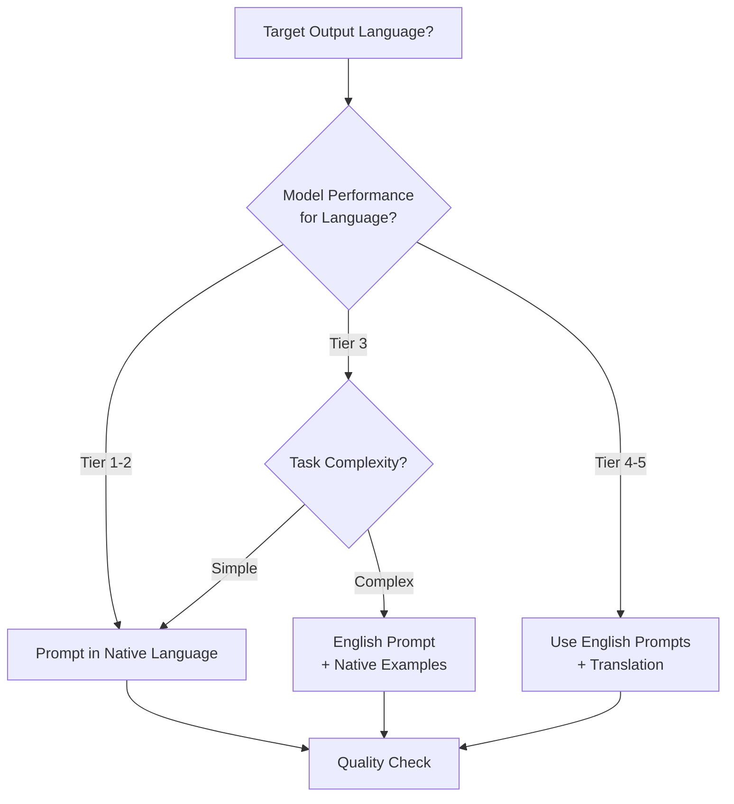

# Multi-Language Prompt Strategies

## Introduction

As AI applications go global, the ability to prompt effectively across languages becomes critical. Models demonstrate varying performance levels across languages, and prompting strategies that work well in English may need adaptation for other languages. This lesson explores techniques for building robust multilingual AI systems.

> **🔑 Key Insight:** Modern LLMs maintain 90%+ of their English performance in major world languages—but the gap widens significantly for lower-resource languages.

---

## Lesson Overview

### What You'll Learn

| Lesson | Topic | Key Skills |
|--------|-------|------------|
| [01-Prompting in Different Languages](./01-prompting-in-different-languages.md) | Native vs English prompts, model capabilities | Language selection, quality assessment |
| [02-Cross-Lingual Engineering](./02-cross-lingual-engineering.md) | Language-agnostic patterns, cultural awareness | Universal prompt design |
| [03-Language-Specific Considerations](./03-language-specific-considerations.md) | Scripts, grammar, tokenization | CJK, RTL, efficiency optimization |
| [04-Translation Pipelines](./04-translation-pipelines.md) | Pre/post translation, quality control | Pipeline architecture |
| [05-Multilingual Outputs](./05-multilingual-outputs.md) | Language detection, consistency | Output management |

---

## Model Language Performance

### Claude Performance by Language (Relative to English)

Based on Anthropic's MMLU benchmarks with human-translated test sets:

| Language | Claude 3.5 Sonnet | Claude 3 Opus | Claude 3 Sonnet | Tier |
|----------|-------------------|---------------|-----------------|------|
| English (baseline) | 100% | 100% | 100% | Tier 1 |
| Spanish | 98.1% | 98.0% | 98.2% | Tier 1 |
| Portuguese | 97.8% | 97.3% | 97.8% | Tier 1 |
| Italian | 97.7% | 97.5% | 97.9% | Tier 1 |
| French | 97.9% | 97.7% | 97.5% | Tier 1 |
| German | 97.7% | 97.1% | 97.0% | Tier 1 |
| Indonesian | 97.3% | 97.2% | 97.3% | Tier 1 |
| Arabic | 97.1% | 96.9% | 97.2% | Tier 2 |
| Chinese (Simplified) | 97.1% | 96.7% | 96.9% | Tier 2 |
| Japanese | 96.9% | 96.2% | 96.8% | Tier 2 |
| Korean | 96.6% | 96.4% | 96.7% | Tier 2 |
| Hindi | 96.8% | 96.7% | 96.7% | Tier 2 |
| Bengali | 95.7% | 95.2% | 95.4% | Tier 3 |
| Swahili | 89.8% | 89.5% | 91.1% | Tier 4 |
| Yoruba | 80.3% | 78.9% | 79.7% | Tier 5 |

### Language Tier Implications

| Tier | Performance | Strategy |
|------|-------------|----------|
| **Tier 1** (95-100%) | Near-English quality | Direct native prompting |
| **Tier 2** (90-95%) | Strong with minor gaps | Native prompting with quality checks |
| **Tier 3** (85-90%) | Noticeable quality loss | Consider hybrid approaches |
| **Tier 4** (75-85%) | Significant gaps | Use English intermediary |
| **Tier 5** (<75%) | Limited reliability | Translation pipeline recommended |

---

## Quick Decision Framework

### Prompting Language Strategy

### Key Questions to Ask

1. **What is the target output language?**
2. **What is the model's performance tier for that language?**
3. **How complex is the task?**
4. **Are cultural nuances important?**
5. **What is the tokenization cost impact?**

---

## Tokenization and Cost Considerations

### Token Efficiency by Script

| Script Type | Characters per Token | Cost Impact | Examples |
|-------------|---------------------|-------------|----------|
| Latin (English) | ~4 chars | Baseline | English, Spanish, French |
| Latin (diacritics) | ~3.5 chars | +15% | Vietnamese, Polish |
| Cyrillic | ~2.5 chars | +40% | Russian, Ukrainian |
| Arabic | ~2-3 chars | +50% | Arabic, Persian |
| CJK (Chinese) | ~1-2 chars | +100-150% | Chinese, Japanese, Korean |
| Devanagari | ~1.5 chars | +80% | Hindi, Sanskrit |

> **⚠️ Warning:** The same content in Chinese may use 2-3x more tokens than in English, significantly impacting costs.

---

## Prerequisites

Before starting these lessons, you should have:

- Completed [Prompt Engineering Fundamentals](../01-fundamentals-of-effective-prompts/)
- Understanding of tokenization basics
- Familiarity with at least one non-English language (helpful but not required)

---

## Quick Wins

### Immediate Improvements

| Technique | Implementation | Impact |
|-----------|---------------|--------|
| **Explicit language instruction** | Add "Respond in [language]" | Consistent output language |
| **Native script input** | Use أهلاً not "ahlan" | Better understanding |
| **Cultural context hints** | "For a [region] audience..." | Appropriate tone/references |
| **Language detection fallback** | Check output language matches request | Prevent language drift |

### Common Pitfalls to Avoid

| ❌ Pitfall | ✅ Better Approach |
|-----------|-------------------|
| Assuming English prompts work universally | Test in target languages |
| Ignoring tokenization costs | Calculate language-specific costs |
| Transliterating instead of native script | Use Unicode native scripts |
| Mixing languages in prompts randomly | Consistent language boundaries |
| Ignoring cultural context | Add regional/cultural hints |

---

## Lesson Navigation

**Start here:** [Prompting in Different Languages →](./01-prompting-in-different-languages.md)

| Lesson | Focus |
|--------|-------|
| [01 - Language Prompting](./01-prompting-in-different-languages.md) | When to use native vs English prompts |
| [02 - Cross-Lingual Engineering](./02-cross-lingual-engineering.md) | Universal patterns that work everywhere |
| [03 - Language-Specific Issues](./03-language-specific-considerations.md) | Scripts, grammar, and tokenization |
| [04 - Translation Pipelines](./04-translation-pipelines.md) | Building translation workflows |
| [05 - Multilingual Outputs](./05-multilingual-outputs.md) | Managing multi-language responses |

---

## Further Reading

- [Anthropic Multilingual Support](https://docs.anthropic.com/en/docs/build-with-claude/multilingual-support) - Performance benchmarks
- [OpenAI Tokenizer](https://platform.openai.com/tokenizer) - Test token counts by language
- [Google Gemini Prompting Strategies](https://ai.google.dev/gemini-api/docs/prompting-strategies) - Multi-language tips

---

<!-- 
Sources Consulted:
- Anthropic Multilingual Support: Claude language performance benchmarks
- OpenAI Prompt Engineering Guide: Multilingual considerations
- Google Gemini Prompting Strategies: Cross-language patterns
-->
