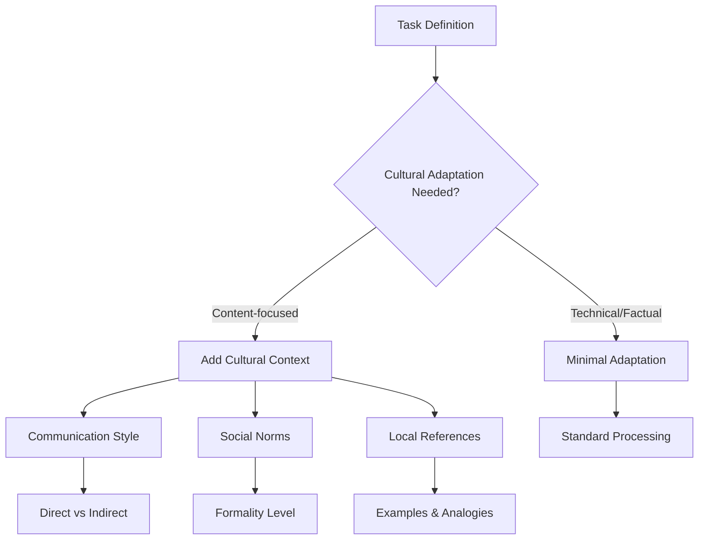

# Cross-Lingual Prompt Engineering

## Introduction

How do you write prompts that work well across multiple languages? Cross-lingual prompt engineering focuses on designing patterns that maintain effectiveness regardless of the input or output language. This lesson teaches universal techniques for building truly multilingual AI systems.

> **🔑 Key Insight:** The best multilingual prompts separate universal logic (structure, constraints) from language-specific content (examples, cultural context).

### What We'll Cover

- Language-agnostic prompt patterns
- Cultural considerations in prompting
- Handling idioms and expressions
- Universal instruction styles
- Building locale-aware systems

### Prerequisites

- [Prompting in Different Languages](./01-prompting-in-different-languages.md)
- Understanding of few-shot prompting

---

## Language-Agnostic Patterns

### The Universal Prompt Template

```python
def create_universal_prompt(
    task: str,
    constraints: list[str],
    examples: dict[str, list],  # language -> examples
    target_language: str,
    cultural_context: str = None
) -> str:
    """Create a prompt that works across languages."""
    
    # Core structure (language-independent)
    template = f"""
# Task
{task}

# Constraints
{format_constraints(constraints)}

# Language Requirements
- Output language: {target_language}
- Use native expressions and idioms
- Maintain appropriate formality for the culture
"""
    
    # Add language-specific examples if available
    if target_language in examples:
        template += f"""
# Examples (in {target_language})
{format_examples(examples[target_language])}
"""
    elif "english" in examples:
        # Fallback to English examples with instruction
        template += f"""
# Examples (adapt style for {target_language})
{format_examples(examples["english"])}

Note: Adapt these examples to natural {target_language} phrasing.
"""
    
    # Add cultural context if provided
    if cultural_context:
        template += f"""
# Cultural Context
{cultural_context}
"""
    
    return template
```

### Structural Elements That Transfer

| Element | Why It Works Universally | Example |
|---------|-------------------------|---------|
| **Numbered steps** | Sequential logic is universal | "1. Analyze 2. Summarize 3. Conclude" |
| **XML/JSON structure** | Format transcends language | `<input>...</input>` |
| **Bullet points** | Visual hierarchy is universal | "• Point one • Point two" |
| **Headers** | Section organization | "# Task # Constraints" |
| **Tables** | Data structure is language-neutral | Markdown tables |

### Anti-patterns to Avoid

| ❌ Avoid | ✅ Use Instead | Reason |
|---------|---------------|--------|
| English idioms in instructions | Clear, literal language | "Break a leg" → "Do well" |
| Culture-specific references | Universal concepts | "Super Bowl ad" → "Major advertising event" |
| Abbreviations | Full words | "ASAP" → "as quickly as possible" |
| Colloquialisms | Standard language | "gonna" → "going to" |
| Date formats (MM/DD) | ISO format | "01/02/2025" → "2025-01-02" |

---

## Cultural Considerations

### The Cultural Context Framework



### Cultural Dimensions in Prompting

| Dimension | Low-Context Cultures | High-Context Cultures |
|-----------|---------------------|----------------------|
| **Communication** | Direct, explicit | Indirect, implicit |
| **Instructions** | Detailed, step-by-step | Holistic, contextual |
| **Feedback** | Blunt, specific | Nuanced, suggestive |
| **Examples** | US, Germany, Netherlands | Japan, China, Korea, Arab countries |

### Adapting for High-Context Cultures

```python
# For Japanese audience (high-context)
japanese_context = """
Cultural Adaptation Guidelines:
- Use indirect language for suggestions ("perhaps you might consider...")
- Include polite hedging ("it seems that...")
- Acknowledge the reader's expertise and perspective
- Avoid absolute statements; use qualifiers
- Show respect for hierarchy and seniority

Communication style:
- Begin with context before making requests
- Use polite form (です/ます体)
- Include expressions of gratitude
"""

# For German audience (low-context)
german_context = """
Cultural Adaptation Guidelines:
- Be direct and precise
- State facts clearly without excessive hedging
- Provide detailed specifications
- Use formal address (Sie) unless casual context
- Structure information logically and completely

Communication style:
- Get to the point quickly
- Support claims with data
- Use formal register for business contexts
"""
```

### Formality Levels by Culture

| Region | Default Formality | Adjust Based On |
|--------|------------------|-----------------|
| Japan | Very formal | Relationship, seniority |
| Korea | Formal | Age, social position |
| Germany | Formal | Context, relationship |
| France | Formal | Setting, familiarity |
| USA | Semi-formal | Industry, company culture |
| Australia | Informal | Context only |
| Latin America | Varies by country | Relationship, generation |

```python
def get_formality_instruction(region: str, context: str) -> str:
    """Get appropriate formality instruction for a region."""
    
    formality_map = {
        "japan": {
            "business": "Use keigo (敬語) - formal honorific language",
            "casual": "Use teineigo (丁寧語) - polite form",
            "youth": "Use casual polite (です/ます) with friendly tone"
        },
        "korea": {
            "business": "Use 존댓말 (jondaenmal) - formal speech level",
            "casual": "Use 해요체 (haeyoche) - polite informal",
            "youth": "Use friendly 해요체 with appropriate honorifics"
        },
        "germany": {
            "business": "Use Sie form, formal vocabulary",
            "casual": "Du form acceptable, maintain professionalism",
            "youth": "Du form, modern vocabulary acceptable"
        },
        "spain": {
            "business": "Use usted, formal register",
            "casual": "Tú is acceptable, friendly but professional",
            "youth": "Tú, contemporary expressions acceptable"
        }
    }
    
    return formality_map.get(region, {}).get(context, "Use professional tone")
```

---

## Handling Idioms and Expressions

### The Idiom Translation Problem

Idioms rarely translate directly:

| English Idiom | Literal Translation Problem | Better Approach |
|---------------|---------------------------|-----------------|
| "Break a leg" | Confusing/alarming | "Good luck" or cultural equivalent |
| "Piece of cake" | Nonsensical | "Easy task" or local idiom |
| "Raining cats and dogs" | Absurd imagery | "Heavy rain" or local expression |
| "The ball is in your court" | Sports-specific | "It's your decision now" |

### Idiom Handling Strategy

```python
def create_idiom_aware_prompt(
    content: str,
    source_language: str,
    target_language: str
) -> str:
    """Create a prompt that handles idioms appropriately."""
    
    return f"""
Translate and culturally adapt this content.

Source ({source_language}): {content}
Target language: {target_language}

IDIOM HANDLING RULES:
1. Do NOT translate idioms literally
2. Find equivalent expressions in {target_language} that convey the same meaning
3. If no equivalent exists, use a clear, natural explanation
4. Maintain the emotional tone and register of the original

For each idiom found:
- Identify the meaning
- Find a cultural equivalent OR
- Rephrase naturally

Example transformation:
- "It's not rocket science" → 
  - Spanish: "No es tan complicado" (It's not that complicated)
  - Japanese: "それほど難しくない" (It's not that difficult)
  - NOT: "No es ciencia de cohetes" ❌
"""
```

### Building an Idiom Adaptation Layer

```python
class IdiomAdapter:
    """Handle idiom translation across languages."""
    
    def __init__(self):
        # Common business idioms with explanations
        self.idiom_meanings = {
            "touch base": "make brief contact to discuss",
            "move the needle": "make significant progress",
            "low-hanging fruit": "easy wins or simple tasks",
            "boil the ocean": "attempt something impossibly large",
            "circle back": "return to discuss later",
            "take offline": "discuss privately",
            "bandwidth": "capacity or availability",
            "synergy": "combined beneficial effect"
        }
    
    def preprocess_content(self, content: str) -> str:
        """Replace idioms with clear explanations."""
        
        processed = content
        found_idioms = []
        
        for idiom, meaning in self.idiom_meanings.items():
            if idiom.lower() in content.lower():
                found_idioms.append((idiom, meaning))
        
        if found_idioms:
            # Add context for the model
            idiom_context = "\n".join(
                f"- '{idiom}' means: {meaning}"
                for idiom, meaning in found_idioms
            )
            
            processed += f"""

IDIOM REFERENCE:
The following expressions appear in the content:
{idiom_context}

When translating, convey these meanings naturally in the target language.
"""
        
        return processed
```

---

## Universal Instruction Styles

### Instruction Patterns That Work Everywhere

**Pattern 1: Input-Process-Output**
```
INPUT: [description of input]
PROCESS: [what to do with it]
OUTPUT: [expected format]
```

**Pattern 2: Role-Task-Constraints**
```
ROLE: [who/what the assistant is]
TASK: [what to accomplish]
CONSTRAINTS: [limitations and requirements]
```

**Pattern 3: Context-Action-Format**
```
CONTEXT: [background information]
ACTION: [specific actions to take]
FORMAT: [output structure]
```

### Writing Clear Cross-Language Instructions

```python
# ❌ Culturally specific, hard to translate
prompt_bad = """
Think outside the box and give me a quick rundown of the key takeaways.
Don't beat around the bush - cut to the chase.
"""

# ✅ Clear, universal language
prompt_good = """
Provide a creative analysis with the following:
1. List the three most important points
2. Be direct and concise
3. Focus on actionable insights
"""

# ✅✅ Structured for any language
prompt_best = """
<task>
Analyze the provided content
</task>

<requirements>
- Identify 3 key insights
- Present each insight in 1-2 sentences
- Include one recommended action per insight
</requirements>

<format>
Insight 1: [description]
→ Action: [recommendation]

Insight 2: [description]
→ Action: [recommendation]

Insight 3: [description]
→ Action: [recommendation]
</format>
"""
```

---

## Building Locale-Aware Systems

### Locale Configuration

```python
from dataclasses import dataclass
from enum import Enum

class Formality(Enum):
    FORMAL = "formal"
    SEMI_FORMAL = "semi-formal"
    INFORMAL = "informal"

class CommunicationStyle(Enum):
    DIRECT = "direct"
    INDIRECT = "indirect"

@dataclass
class LocaleConfig:
    language_code: str
    region: str
    formality: Formality
    communication_style: CommunicationStyle
    date_format: str
    number_format: str
    currency: str
    cultural_notes: list[str]
    
    def get_prompt_instructions(self) -> str:
        """Generate locale-specific prompt instructions."""
        
        return f"""
LOCALE SETTINGS:
- Language: {self.language_code}
- Region: {self.region}
- Formality: {self.formality.value}
- Communication: {self.communication_style.value}
- Date format: {self.date_format}
- Number format: {self.number_format}
- Currency: {self.currency}

CULTURAL GUIDELINES:
{chr(10).join(f'- {note}' for note in self.cultural_notes)}
"""

# Example configurations
LOCALES = {
    "ja-JP": LocaleConfig(
        language_code="ja",
        region="Japan",
        formality=Formality.FORMAL,
        communication_style=CommunicationStyle.INDIRECT,
        date_format="YYYY年MM月DD日",
        number_format="1,234.56",
        currency="¥",
        cultural_notes=[
            "Use keigo (honorific language) for business",
            "Begin with context before making requests",
            "Include seasonal greetings when appropriate",
            "Avoid direct negative statements"
        ]
    ),
    "de-DE": LocaleConfig(
        language_code="de",
        region="Germany",
        formality=Formality.FORMAL,
        communication_style=CommunicationStyle.DIRECT,
        date_format="DD.MM.YYYY",
        number_format="1.234,56",
        currency="€",
        cultural_notes=[
            "Use Sie form for formal contexts",
            "Be precise and detailed",
            "State facts directly",
            "Titles (Dr., Prof.) are important"
        ]
    ),
    "es-MX": LocaleConfig(
        language_code="es",
        region="Mexico",
        formality=Formality.SEMI_FORMAL,
        communication_style=CommunicationStyle.INDIRECT,
        date_format="DD/MM/YYYY",
        number_format="1,234.56",
        currency="$",
        cultural_notes=[
            "Warmth in communication is valued",
            "Build rapport before business",
            "Usted for formal, tú for friendly professional",
            "Include courteous phrases"
        ]
    )
}
```

### Locale-Aware Prompt Generator

```python
class LocaleAwarePromptGenerator:
    """Generate prompts adapted for specific locales."""
    
    def __init__(self, locale_config: LocaleConfig):
        self.config = locale_config
    
    def generate(
        self,
        task: str,
        content: str,
        include_examples: bool = True
    ) -> str:
        """Generate a locale-aware prompt."""
        
        prompt = f"""
{self.config.get_prompt_instructions()}

# Task
{task}

# Content to Process
{content}
"""
        
        if include_examples:
            examples = self._get_locale_examples()
            if examples:
                prompt += f"""
# Style Examples
{examples}
"""
        
        return prompt
    
    def _get_locale_examples(self) -> str:
        """Get examples appropriate for the locale."""
        
        examples_db = {
            "ja": """
入力例: 製品の欠陥について報告
出力例: 
お世話になっております。
製品に関しまして、下記の事象が確認されましたのでご報告申し上げます。
[詳細]
ご確認いただけますと幸いです。
何卒よろしくお願いいたします。
""",
            "de": """
Eingabebeispiel: Produktmangel melden
Ausgabebeispiel:
Sehr geehrte Damen und Herren,
hiermit möchte ich folgenden Mangel melden:
[Details]
Ich bitte um Bearbeitung.
Mit freundlichen Grüßen
""",
            "es": """
Ejemplo de entrada: Reportar defecto del producto
Ejemplo de salida:
Estimado equipo:
Me permito informarles sobre el siguiente inconveniente:
[Detalles]
Agradezco su atención a este asunto.
Saludos cordiales
"""
        }
        
        return examples_db.get(self.config.language_code, "")
```

---

## Hands-on Exercise

### Your Task

Create a universal prompt template that generates customer support responses adaptable to Japanese, German, and Brazilian Portuguese contexts.

**Requirements:**
1. Same core logic/structure for all languages
2. Cultural adaptation for each locale
3. Appropriate formality levels
4. Include locale-specific example responses

<details>
<summary>💡 Hints (click to expand)</summary>

- Japanese: Indirect, highly formal, with keigo
- German: Direct, precise, formal with Sie
- Brazilian Portuguese: Warm, friendly-professional, building rapport

</details>

<details>
<summary>✅ Solution (click to expand)</summary>

```python
from dataclasses import dataclass

@dataclass
class SupportResponseConfig:
    language: str
    greeting: str
    closing: str
    formality_instruction: str
    cultural_notes: list[str]
    example_response: str

SUPPORT_CONFIGS = {
    "ja-JP": SupportResponseConfig(
        language="Japanese",
        greeting="お問い合わせいただきありがとうございます。",
        closing="何卒よろしくお願いいたします。",
        formality_instruction="Use keigo (敬語) throughout. Use です/ます form.",
        cultural_notes=[
            "Begin by acknowledging the customer's situation with empathy",
            "Apologize for any inconvenience first",
            "Present solutions indirectly ('Perhaps you could consider...')",
            "Never assign blame, even subtly"
        ],
        example_response="""
お問い合わせいただきありがとうございます。
ご不便をおかけし、誠に申し訳ございません。
お問い合わせの件につきまして、確認させていただきました。
[解決策]
ご不明な点がございましたら、お気軽にお申し付けください。
今後ともよろしくお願いいたします。
"""
    ),
    "de-DE": SupportResponseConfig(
        language="German",
        greeting="Vielen Dank für Ihre Anfrage.",
        closing="Mit freundlichen Grüßen",
        formality_instruction="Use Sie form. Be precise and direct.",
        cultural_notes=[
            "Get to the point quickly after brief greeting",
            "Provide specific, detailed solutions",
            "Include timelines and concrete next steps",
            "Reference any relevant policies or procedures"
        ],
        example_response="""
Sehr geehrte/r [Kunde],
vielen Dank für Ihre Nachricht.
Zu Ihrem Anliegen kann ich Ihnen Folgendes mitteilen:
[Lösung mit konkreten Details]
Sollten Sie weitere Fragen haben, stehe ich Ihnen gerne zur Verfügung.
Mit freundlichen Grüßen
"""
    ),
    "pt-BR": SupportResponseConfig(
        language="Brazilian Portuguese",
        greeting="Olá! Obrigado(a) por entrar em contato conosco.",
        closing="Estamos à disposição! 🙂",
        formality_instruction="Use você form. Be warm and friendly while professional.",
        cultural_notes=[
            "Express genuine warmth and willingness to help",
            "Use friendly but professional tone",
            "Build rapport - acknowledge the person, not just the problem",
            "Emoji usage is acceptable and expected in friendly contexts"
        ],
        example_response="""
Olá, [Nome]! Tudo bem? 😊
Obrigado por entrar em contato com a gente!
Entendo perfeitamente sua situação e vou te ajudar a resolver isso.
[Solução com tom amigável]
Se precisar de mais alguma coisa, é só chamar, tá?
Estamos aqui para ajudar! 💙
"""
    )
}

def create_universal_support_prompt(
    customer_issue: str,
    locale: str,
    customer_name: str = None
) -> str:
    """Create a culturally-adapted support response prompt."""
    
    config = SUPPORT_CONFIGS.get(locale)
    if not config:
        raise ValueError(f"Unsupported locale: {locale}")
    
    prompt = f"""
# Customer Support Response Generator

## Language & Culture Settings
Language: {config.language}
Formality: {config.formality_instruction}

## Cultural Guidelines
{chr(10).join(f'- {note}' for note in config.cultural_notes)}

## Standard Structure
1. Greeting: {config.greeting}
2. Acknowledge the issue
3. Provide solution
4. Offer further assistance
5. Closing: {config.closing}

## Example Response in {config.language}
{config.example_response}

## Customer Issue to Address
{customer_issue}

## Customer Name
{customer_name or "[Customer]"}

## Instructions
Generate a response following the cultural guidelines above.
Output ONLY the response in {config.language} - no explanations or translations.
"""
    
    return prompt

# Usage example
japanese_prompt = create_universal_support_prompt(
    customer_issue="Product arrived damaged, requesting replacement",
    locale="ja-JP",
    customer_name="田中様"
)

german_prompt = create_universal_support_prompt(
    customer_issue="Product arrived damaged, requesting replacement",
    locale="de-DE",
    customer_name="Herr Müller"
)

brazilian_prompt = create_universal_support_prompt(
    customer_issue="Product arrived damaged, requesting replacement",
    locale="pt-BR",
    customer_name="Maria"
)
```

</details>

---

## Summary

✅ **Separate structure from content:** Universal patterns + locale-specific examples
✅ **Avoid idioms in instructions:** Use clear, literal language
✅ **Respect cultural dimensions:** Direct vs indirect, formal vs informal
✅ **Build locale configurations:** Systematic approach to cultural adaptation
✅ **Use structured formats:** XML, JSON, markdown work across languages
✅ **Test with native speakers:** Cultural appropriateness requires validation

**Next:** [Language-Specific Considerations](./03-language-specific-considerations.md)

---

## Further Reading

- [Hofstede's Cultural Dimensions](https://www.hofstede-insights.com/) - Cultural framework
- [Google Localization Guide](https://developers.google.com/style/translation) - Technical localization
- [Anthropic Prompt Engineering](https://docs.anthropic.com/en/docs/build-with-claude/prompt-engineering/overview) - General patterns

---

<!-- 
Sources Consulted:
- Anthropic Multilingual Support: Best practices for language handling
- Google Gemini Prompting Strategies: Input prefixes, language-agnostic patterns
- Cross-cultural communication research and localization best practices
-->
