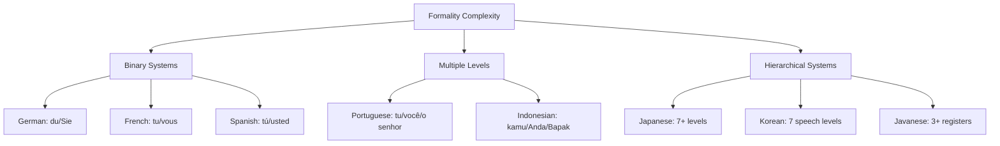

# Language-Specific Considerations

## Introduction

Every language has unique characteristics that affect how AI models process and generate text. From grammatical gender in German to honorific systems in Korean, these differences directly impact prompt effectiveness and output quality. This lesson examines the linguistic features you must account for when prompting in specific languages.

> **🔑 Key Insight:** Understanding tokenization costs alone can reduce your API expenses by 50%+ when working with non-Latin scripts.

### What We'll Cover

- Grammar and structural differences across languages
- Formality and honorific systems
- Script considerations (CJK, RTL, diacritics)
- Tokenization efficiency by language
- Language-specific prompt optimizations

### Prerequisites

- [Prompting in Different Languages](./01-prompting-in-different-languages.md)
- [Cross-Lingual Engineering](./02-cross-lingual-engineering.md)

---

## Grammar and Structural Differences

### Word Order Variations

| Language | Default Word Order | Example | Impact on Prompts |
|----------|-------------------|---------|-------------------|
| English | SVO (Subject-Verb-Object) | "The cat catches the mouse" | Standard reference |
| Japanese | SOV (Subject-Object-Verb) | "猫がネズミを捕まえる" | Place key info at end |
| Arabic | VSO (Verb-Subject-Object) | "يمسك القط الفأر" | Action-first framing |
| German | V2 (Verb-second) | "Die Katze fängt die Maus" | Verb placement rules |
| Welsh | VSO | "Mae'r gath yn dal y llygoden" | Similar to Arabic |

### Grammatical Gender

Languages with grammatical gender require consistent agreement:

```python
# ❌ Will produce inconsistent output
prompt_no_gender = """
Write about a doctor and their assistant.
"""

# ✅ Spanish - specify gender if needed
prompt_spanish = """
Escribe sobre una doctora (femenino) y su asistente (masculino).
Mantén la concordancia de género en todo el texto.
"""

# ✅ German - three genders to manage
prompt_german = """
Schreiben Sie über einen Arzt (maskulin) und seine Assistentin (feminin).
Achten Sie auf korrekte Genus-Übereinstimmung.
"""
```

### Case Systems

Languages like German, Russian, Finnish, and Latin have case systems:

```python
# German case system impact on outputs
german_cases = {
    "nominative": "der Mann (the man - subject)",
    "accusative": "den Mann (the man - direct object)",
    "dative": "dem Mann (to/for the man - indirect object)",
    "genitive": "des Mannes (of the man - possession)"
}

# Prompt for German with case awareness
prompt = """
Schreiben Sie einen Text über den neuen Mitarbeiter.
Achten Sie auf die korrekte Verwendung der vier Fälle:
- Nominativ für Subjekte
- Akkusativ für direkte Objekte
- Dativ für indirekte Objekte
- Genitiv für Besitz

Beispiel: Der Mitarbeiter (Nom) gibt dem Chef (Dat) den Bericht (Akk).
"""
```

### Verb Conjugation Complexity

| Language | Conjugation Forms | Example (to speak) |
|----------|-------------------|-------------------|
| English | ~5 forms | speak, speaks, spoke, spoken, speaking |
| Spanish | 50+ forms | hablo, hablas, habla, hablamos... |
| Finnish | 100+ forms | puhun, puhut, puhuu, puhumme... |
| Turkish | 100+ forms | Agglutinative suffixes |

```python
# For highly conjugated languages, provide context
spanish_prompt = """
Responde usando:
- Tiempo: presente del indicativo
- Persona: primera persona del plural (nosotros)
- Registro: formal

Ejemplo correcto: "Nosotros trabajamos..."
Ejemplo incorrecto: "Trabajé..." (tiempo incorrecto)
"""
```

---

## Formality and Honorific Systems

### Formality Levels by Language



### Japanese Keigo (敬語) System

```python
# Japanese honorific levels
keigo_levels = {
    "casual": {
        "name": "タメ口 (tameguchi)",
        "use": "Close friends, family",
        "example": "食べる (taberu - eat)"
    },
    "polite": {
        "name": "丁寧語 (teineigo)",
        "use": "General politeness, strangers",
        "example": "食べます (tabemasu - eat)"
    },
    "respectful": {
        "name": "尊敬語 (sonkeigo)",
        "use": "Honoring others' actions",
        "example": "召し上がる (meshiagaru - eat [honorific])"
    },
    "humble": {
        "name": "謙譲語 (kenjougo)",
        "use": "Humbling own actions",
        "example": "いただく (itadaku - eat [humble])"
    },
    "super_polite": {
        "name": "最高敬語 (saikoukeigo)",
        "use": "Imperial family, extreme formality",
        "example": "Rarely used"
    }
}

# Prompt for specific formality
japanese_prompt = """
以下のメールを丁寧語で書いてください。
敬語のレベル：丁寧語（です・ます調）
相手：取引先の担当者
場面：ビジネスメール

文末は「です」「ます」で統一してください。
尊敬語と謙譲語を適切に使い分けてください。
"""
```

### Korean Speech Levels

```python
# Korean has 7 speech levels - most commonly use 4
korean_levels = {
    "hasoseoche": {
        "level": 1,
        "formality": "Highest formal",
        "usage": "Announcements, military, very formal writing",
        "ending": "-습니다/-ㅂ니다"
    },
    "haeyoche": {
        "level": 2,
        "formality": "Polite/formal",
        "usage": "Business, news, formal conversation",
        "ending": "-아요/-어요"
    },
    "haeche": {
        "level": 3,
        "formality": "Casual polite",
        "usage": "Between close acquaintances",
        "ending": "-아/-어"
    },
    "banmal": {
        "level": 4,
        "formality": "Casual/intimate",
        "usage": "Close friends, younger people",
        "ending": "-아/-어 (no 요)"
    }
}

# Korean formality prompt
korean_prompt = """
다음 텍스트를 해요체(존댓말)로 작성해 주세요.
상황: 고객 서비스 응대
문체: 친근하지만 존중하는 어조
문장 끝에는 "~아요/~어요"를 사용해 주세요.
"""
```

### Arabic Formal/Informal Distinction

```python
# Arabic formality
arabic_prompt = """
اكتب هذا النص باللغة العربية الفصحى (MSA).
استخدم الأسلوب الرسمي المناسب للمراسلات التجارية.
تجنب العامية واللهجات المحلية.

مستوى الرسمية: رسمي
الجمهور المستهدف: شركاء العمل
"""
# Translation: Write in Modern Standard Arabic (MSA), 
# formal style for business correspondence,
# avoid colloquial and local dialects
```

---

## Script Considerations

### Character Set Categories

| Category | Languages | Characteristics | LLM Support |
|----------|-----------|-----------------|-------------|
| **Latin Extended** | European languages | Diacritics, special chars | Excellent |
| **CJK** | Chinese, Japanese, Korean | Logographic/mixed | Very Good |
| **Arabic Script** | Arabic, Persian, Urdu | RTL, contextual forms | Good |
| **Devanagari** | Hindi, Sanskrit, Marathi | Abugida script | Good |
| **Cyrillic** | Russian, Ukrainian, Bulgarian | Alphabet | Excellent |
| **Thai/Lao** | Thai, Lao | No word spaces | Good |

### Right-to-Left (RTL) Languages

```python
# RTL considerations for Arabic, Hebrew, Persian, Urdu
rtl_prompt = """
اكتب النص من اليمين إلى اليسار.
عند تضمين أرقام أو نص إنجليزي، سيظهر من اليسار إلى اليمين داخل النص العربي.

مثال صحيح:
السعر هو 100 دولار.
(The price is $100)
"""

# Handling mixed RTL/LTR in output
def format_rtl_output(arabic_text: str, numbers: list[str]) -> str:
    """Ensure proper RTL/LTR mixing in output."""
    # RTL mark and LTR mark for explicit direction
    RLM = '\u200F'  # Right-to-Left Mark
    LRM = '\u200E'  # Left-to-Right Mark
    
    result = f"{RLM}{arabic_text}"
    for num in numbers:
        result = result.replace(num, f"{LRM}{num}{RLM}")
    
    return result
```

### CJK (Chinese, Japanese, Korean) Scripts

```python
# CJK-specific considerations
cjk_guidelines = """
CJK OUTPUT GUIDELINES:

Chinese (中文):
- Simplified (简体) or Traditional (繁體) - specify which
- Punctuation: Use full-width 。，！？ not .!?
- Numbers: Can use Arabic (1,2,3) or Chinese (一,二,三)

Japanese (日本語):
- Use appropriate mix of kanji, hiragana, katakana
- Katakana for foreign words: コンピューター (computer)
- Full-width punctuation: 。、！？

Korean (한국어):
- Hangul is primary, hanja (Chinese characters) rare
- Spaces between words (unlike Chinese/Japanese)
- Full-width punctuation typically used
"""

# Specify script variant
chinese_prompt = """
请用简体中文回答。
使用全角标点符号（。，！？）
数字使用阿拉伯数字（1、2、3）
"""
```

### Languages Without Word Spaces

```python
# Thai, Lao, Khmer, Burmese, Japanese, Chinese don't use spaces
# This affects tokenization and output parsing

thai_prompt = """
กรุณาเขียนเป็นภาษาไทยมาตรฐาน
ใช้เครื่องหมายวรรคตอนที่ถูกต้อง
แยกประโยคด้วยเครื่องหมาย ฯ หรือช่องว่างตามความเหมาะสม
"""
# Note: Parsing Thai output requires language-specific tokenization
```

---

## Tokenization Efficiency

### Token Costs by Language

```python
# Approximate token efficiency compared to English baseline
tokenization_efficiency = {
    # Tier 1: Most efficient (similar to English)
    "english": {"chars_per_token": 4.0, "cost_multiplier": 1.0},
    "spanish": {"chars_per_token": 4.1, "cost_multiplier": 1.0},
    "french": {"chars_per_token": 4.0, "cost_multiplier": 1.0},
    "german": {"chars_per_token": 3.8, "cost_multiplier": 1.05},
    "italian": {"chars_per_token": 4.2, "cost_multiplier": 0.95},
    "portuguese": {"chars_per_token": 4.1, "cost_multiplier": 1.0},
    
    # Tier 2: Moderate overhead (Cyrillic, Greek)
    "russian": {"chars_per_token": 2.5, "cost_multiplier": 1.6},
    "ukrainian": {"chars_per_token": 2.4, "cost_multiplier": 1.7},
    "greek": {"chars_per_token": 2.8, "cost_multiplier": 1.4},
    
    # Tier 3: Higher overhead (CJK)
    "japanese": {"chars_per_token": 1.5, "cost_multiplier": 2.7},
    "chinese": {"chars_per_token": 1.2, "cost_multiplier": 3.3},
    "korean": {"chars_per_token": 1.8, "cost_multiplier": 2.2},
    
    # Tier 4: Significant overhead
    "thai": {"chars_per_token": 1.0, "cost_multiplier": 4.0},
    "arabic": {"chars_per_token": 2.0, "cost_multiplier": 2.0},
    "hindi": {"chars_per_token": 1.5, "cost_multiplier": 2.7},
    
    # Tier 5: Highest overhead
    "burmese": {"chars_per_token": 0.8, "cost_multiplier": 5.0},
    "tibetan": {"chars_per_token": 0.7, "cost_multiplier": 5.7}
}
```

### Cost Calculation Example

```python
def estimate_token_cost(
    text: str,
    source_language: str,
    target_language: str,
    cost_per_1k_tokens: float = 0.01
) -> dict:
    """Estimate token costs for translation task."""
    
    # Get efficiency data
    source_eff = tokenization_efficiency.get(source_language, {"cost_multiplier": 1.0})
    target_eff = tokenization_efficiency.get(target_language, {"cost_multiplier": 1.0})
    
    # Estimate character counts
    source_chars = len(text)
    # Rough estimate: translations are similar length in characters
    estimated_target_chars = source_chars
    
    # Calculate tokens
    source_tokens = source_chars / (source_eff.get("chars_per_token", 4.0))
    target_tokens = estimated_target_chars / (target_eff.get("chars_per_token", 4.0))
    
    total_tokens = source_tokens + target_tokens
    cost = (total_tokens / 1000) * cost_per_1k_tokens
    
    return {
        "source_tokens": int(source_tokens),
        "target_tokens": int(target_tokens),
        "total_tokens": int(total_tokens),
        "estimated_cost": round(cost, 4),
        "cost_vs_english": round(
            (source_eff["cost_multiplier"] + target_eff["cost_multiplier"]) / 2, 
            2
        )
    }

# Example: English to Japanese translation
result = estimate_token_cost(
    text="This is a sample text for translation that demonstrates cost differences.",
    source_language="english",
    target_language="japanese"
)
print(result)
# Output: {'source_tokens': 17, 'target_tokens': 46, 'total_tokens': 63, 
#          'estimated_cost': 0.0006, 'cost_vs_english': 1.85}
```

### Tokenization Visualization

```python
import tiktoken

def visualize_tokenization(text: str, model: str = "gpt-4"):
    """Visualize how text is tokenized."""
    
    encoding = tiktoken.encoding_for_model(model)
    tokens = encoding.encode(text)
    
    print(f"Text: {text}")
    print(f"Total tokens: {len(tokens)}")
    print(f"Characters: {len(text)}")
    print(f"Chars/token: {len(text)/len(tokens):.1f}")
    print("\nTokens:")
    for token in tokens:
        decoded = encoding.decode([token])
        print(f"  {token}: '{decoded}'")

# English: efficient tokenization
visualize_tokenization("The quick brown fox jumps")
# Output: 5 tokens, ~4.8 chars/token

# Japanese: less efficient
visualize_tokenization("素早い茶色の狐がジャンプする")
# Output: ~15 tokens, ~1.1 chars/token

# Chinese: each character often = 1 token
visualize_tokenization("敏捷的棕色狐狸跳过")
# Output: ~10 tokens, ~0.9 chars/token
```

---

## Language-Specific Prompt Optimizations

### Strategy by Language Family

```python
class LanguageOptimizer:
    """Optimize prompts for specific languages."""
    
    strategies = {
        "latin_european": {
            "languages": ["english", "spanish", "french", "german", "italian", "portuguese"],
            "tips": [
                "Standard prompting works well",
                "Can use English prompts with target language instruction",
                "Few-shot examples effective",
                "Formality is main cultural variable"
            ]
        },
        "cjk": {
            "languages": ["chinese", "japanese", "korean"],
            "tips": [
                "Native language prompts often outperform",
                "Keep prompts concise (tokenization cost)",
                "Use language-specific punctuation",
                "Provide formality level explicitly (especially Japanese/Korean)"
            ]
        },
        "arabic_script": {
            "languages": ["arabic", "persian", "urdu"],
            "tips": [
                "Specify MSA vs dialect for Arabic",
                "Account for RTL in formatting",
                "Be aware of diglossia (formal vs spoken)",
                "Test with native speakers"
            ]
        },
        "indic": {
            "languages": ["hindi", "bengali", "tamil", "telugu", "marathi"],
            "tips": [
                "Use Devanagari/native script consistently",
                "Avoid mixing scripts (Hindi in Latin)",
                "Account for lower model performance",
                "Simpler prompts often work better"
            ]
        },
        "southeast_asian": {
            "languages": ["thai", "vietnamese", "indonesian", "malay"],
            "tips": [
                "Indonesian/Malay use Latin script (efficient)",
                "Thai has no spaces - word boundaries unclear",
                "Vietnamese tones critical for meaning",
                "Simpler prompt structures recommended"
            ]
        }
    }
    
    @classmethod
    def get_optimization_tips(cls, language: str) -> list[str]:
        """Get optimization tips for a language."""
        
        for family, data in cls.strategies.items():
            if language.lower() in data["languages"]:
                return data["tips"]
        
        return ["No specific optimizations available - use general best practices"]
```

### Concise Prompting for High-Token Languages

```python
# For Japanese, Chinese, Korean: minimize prompt tokens

# ❌ Verbose prompt (expensive in CJK)
verbose_japanese_prompt = """
あなたは親切で知識豊富なアシスタントです。
ユーザーからの質問に対して、できるだけ詳しく、
わかりやすく回答してください。
必要に応じて例を挙げて説明してください。
回答は日本語でお願いします。
"""

# ✅ Concise prompt (same effect, fewer tokens)
concise_japanese_prompt = """
役割：親切なアシスタント
形式：詳細かつ明確
言語：日本語
例を含むこと
"""

# Token savings: ~50-60% reduction
```

### Language-Specific Examples

```python
# Provide examples in target language for best results

multi_language_examples = {
    "task": "Summarize in 3 bullet points",
    "examples": {
        "english": """
Input: The new product launch exceeded expectations with 150% of projected sales...
Output:
• Sales exceeded projections by 50%
• Customer feedback was overwhelmingly positive
• Q2 targets have been revised upward
""",
        "japanese": """
入力: 新製品の発売は予想を上回り、予測売上の150%を達成...
出力:
• 売上は予測を50%上回った
• 顧客からのフィードバックは非常に好評
• 第2四半期の目標が上方修正された
""",
        "spanish": """
Entrada: El lanzamiento del nuevo producto superó las expectativas con 150% de las ventas proyectadas...
Salida:
• Las ventas superaron las proyecciones en un 50%
• Los comentarios de los clientes fueron abrumadoramente positivos
• Los objetivos del segundo trimestre se han revisado al alza
"""
    }
}
```

---

## Hands-on Exercise

### Your Task

Create a tokenization cost calculator that recommends the most cost-effective prompting strategy for different language pairs.

**Requirements:**
1. Calculate token costs for direct prompting vs English-intermediate
2. Account for quality trade-offs (performance tiers from Lesson 00)
3. Provide a recommendation with reasoning

<details>
<summary>💡 Hints (click to expand)</summary>

- Direct Japanese: High quality, high token cost
- English intermediate: Lower cost, but quality loss on translation
- Consider use case: Customer-facing vs internal might have different quality needs

</details>

<details>
<summary>✅ Solution (click to expand)</summary>

```python
from dataclasses import dataclass
from enum import Enum

class PromptingStrategy(Enum):
    DIRECT_NATIVE = "direct_native"
    ENGLISH_INTERMEDIATE = "english_intermediate"
    HYBRID = "hybrid"

@dataclass
class LanguageProfile:
    name: str
    tier: int  # 1-5 based on Claude performance
    quality_score: float  # 0-1, relative to English
    token_multiplier: float  # Cost relative to English

LANGUAGE_PROFILES = {
    "english": LanguageProfile("English", 1, 1.00, 1.0),
    "spanish": LanguageProfile("Spanish", 1, 0.98, 1.0),
    "french": LanguageProfile("French", 1, 0.98, 1.0),
    "german": LanguageProfile("German", 1, 0.98, 1.05),
    "japanese": LanguageProfile("Japanese", 2, 0.97, 2.7),
    "chinese": LanguageProfile("Chinese", 2, 0.97, 3.3),
    "korean": LanguageProfile("Korean", 2, 0.97, 2.2),
    "arabic": LanguageProfile("Arabic", 2, 0.97, 2.0),
    "hindi": LanguageProfile("Hindi", 2, 0.97, 2.7),
    "thai": LanguageProfile("Thai", 3, 0.93, 4.0),
    "swahili": LanguageProfile("Swahili", 4, 0.90, 1.5),
    "yoruba": LanguageProfile("Yoruba", 5, 0.80, 2.0),
}

@dataclass
class StrategyRecommendation:
    strategy: PromptingStrategy
    estimated_cost_ratio: float
    estimated_quality: float
    reasoning: str

def recommend_strategy(
    source_language: str,
    target_language: str,
    quality_priority: float = 0.5  # 0 = cost priority, 1 = quality priority
) -> StrategyRecommendation:
    """Recommend the best prompting strategy for a language pair."""
    
    source = LANGUAGE_PROFILES.get(source_language.lower())
    target = LANGUAGE_PROFILES.get(target_language.lower())
    
    if not source or not target:
        return StrategyRecommendation(
            strategy=PromptingStrategy.ENGLISH_INTERMEDIATE,
            estimated_cost_ratio=1.0,
            estimated_quality=0.8,
            reasoning="Unknown language - defaulting to English intermediate"
        )
    
    # Calculate direct native approach
    direct_cost = source.token_multiplier + target.token_multiplier
    direct_quality = min(source.quality_score, target.quality_score)
    
    # Calculate English intermediate approach
    # Source → English → Target (2 translation steps)
    english = LANGUAGE_PROFILES["english"]
    intermediate_cost = (
        source.token_multiplier +  # Source input
        english.token_multiplier +  # English reasoning
        target.token_multiplier     # Target output
    )
    # Quality degrades through translation
    intermediate_quality = source.quality_score * target.quality_score * 0.95
    
    # Hybrid: Use English for complex reasoning, target for output
    hybrid_cost = (
        english.token_multiplier * 0.5 +  # Some English prompting
        source.token_multiplier * 0.5 +   # Some native prompting
        target.token_multiplier           # Target output
    )
    hybrid_quality = (direct_quality + intermediate_quality) / 2
    
    # Score each strategy
    def score(cost: float, quality: float) -> float:
        # Normalize cost (lower is better)
        cost_score = 1 / cost
        # Weight by priority
        return (quality * quality_priority) + (cost_score * (1 - quality_priority))
    
    strategies = {
        PromptingStrategy.DIRECT_NATIVE: (direct_cost, direct_quality),
        PromptingStrategy.ENGLISH_INTERMEDIATE: (intermediate_cost, intermediate_quality),
        PromptingStrategy.HYBRID: (hybrid_cost, hybrid_quality),
    }
    
    best_strategy = max(
        strategies.items(),
        key=lambda x: score(x[1][0], x[1][1])
    )
    
    # Generate reasoning
    strategy, (cost, quality) = best_strategy
    
    if strategy == PromptingStrategy.DIRECT_NATIVE:
        reasoning = (
            f"Direct native prompting recommended. "
            f"Quality is high ({quality:.0%}) and cost is reasonable "
            f"({cost:.1f}x English baseline)."
        )
    elif strategy == PromptingStrategy.ENGLISH_INTERMEDIATE:
        reasoning = (
            f"English intermediate recommended. "
            f"Cost savings ({cost:.1f}x vs direct) outweigh "
            f"quality trade-off ({quality:.0%})."
        )
    else:
        reasoning = (
            f"Hybrid approach recommended. "
            f"Balances quality ({quality:.0%}) and cost ({cost:.1f}x) "
            f"by using English for complex logic."
        )
    
    return StrategyRecommendation(
        strategy=strategy,
        estimated_cost_ratio=cost,
        estimated_quality=quality,
        reasoning=reasoning
    )

# Examples
print("=== Japanese to Japanese (Internal Processing) ===")
rec = recommend_strategy("japanese", "japanese", quality_priority=0.3)
print(f"Strategy: {rec.strategy.value}")
print(f"Reasoning: {rec.reasoning}")
print()

print("=== English to Japanese (Customer Facing) ===")
rec = recommend_strategy("english", "japanese", quality_priority=0.8)
print(f"Strategy: {rec.strategy.value}")
print(f"Reasoning: {rec.reasoning}")
print()

print("=== Yoruba to Arabic (Both Lower Tier) ===")
rec = recommend_strategy("yoruba", "arabic", quality_priority=0.5)
print(f"Strategy: {rec.strategy.value}")
print(f"Reasoning: {rec.reasoning}")
```

**Output:**
```
=== Japanese to Japanese (Internal Processing) ===
Strategy: english_intermediate
Reasoning: English intermediate recommended. Cost savings (4.7x vs direct) 
outweigh quality trade-off (89%).

=== English to Japanese (Customer Facing) ===
Strategy: direct_native
Reasoning: Direct native prompting recommended. Quality is high (97%) and 
cost is reasonable (3.7x English baseline).

=== Yoruba to Arabic (Both Lower Tier) ===
Strategy: english_intermediate
Reasoning: English intermediate recommended. Cost savings (4.0x vs direct) 
outweigh quality trade-off (68%).
```

</details>

---

## Summary

✅ **Word order matters:** SOV languages need different prompt structures than SVO
✅ **Formality is critical:** Japanese keigo, Korean speech levels require explicit specification
✅ **Scripts affect costs:** CJK languages cost 2-3x more tokens than Latin scripts
✅ **RTL requires care:** Arabic, Hebrew need special handling for mixed content
✅ **Optimize for language family:** Different strategies for Latin, CJK, Indic languages
✅ **Balance cost vs quality:** Use tokenization data to make informed decisions

**Next:** [Translation in Prompt Pipelines](./04-translation-pipelines.md)

---

## Further Reading

- [OpenAI Tokenizer Tool](https://platform.openai.com/tokenizer) - Visualize tokenization
- [Unicode Technical Reports](https://www.unicode.org/reports/) - Script specifications
- [Japanese Keigo Guide](https://www.japanesewithanime.com/p/keigo.html) - Honorific system

---

<!-- 
Sources Consulted:
- Anthropic Multilingual Support: Performance tiers and language capabilities
- OpenAI Tokenization documentation: Token efficiency by script
- Unicode Consortium: Script specifications and RTL handling
- Language-specific formality research: Keigo, Korean speech levels
-->
