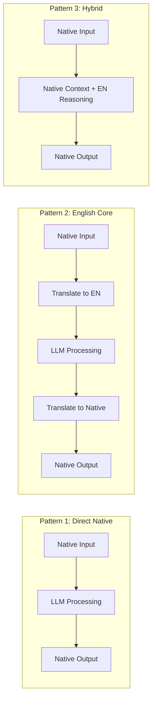

# Translation in Prompt Pipelines

## Introduction

When should you translate before sending to an LLM versus after? Translation pipelines are crucial architectural decisions that affect quality, cost, and latency in multilingual AI systems. This lesson explores when and how to integrate translation steps into your prompt workflows.

> **🔑 Key Insight:** The best pipeline architecture depends on your task—reasoning-heavy tasks benefit from English intermediates, while culturally-sensitive content needs native prompting throughout.

### What We'll Cover

- Pre-translation of inputs (user content → English)
- Post-translation of outputs (English response → target language)
- Dedicated translation steps in workflows
- Quality control and validation
- Pipeline optimization strategies

### Prerequisites

- [Language-Specific Considerations](./03-language-specific-considerations.md)
- Understanding of LLM API usage

---

## Translation Pipeline Architectures

### Three Core Patterns



### Pattern Comparison

| Aspect | Direct Native | English Core | Hybrid |
|--------|--------------|--------------|--------|
| **Quality** | Highest for Tier 1-2 | Consistent across languages | Good balance |
| **Cost** | High for non-Latin | Lower reasoning cost | Medium |
| **Latency** | Single call | 3 API calls | 1-2 calls |
| **Complexity** | Simple | Complex pipeline | Moderate |
| **Best for** | Tier 1-2 languages | Tier 4-5 languages | Mixed requirements |

---

## Pre-Translation: Input Processing

### When to Pre-Translate

```python
def should_pretranslate(
    input_language: str,
    task_type: str,
    quality_requirement: str
) -> bool:
    """Determine if input should be translated to English first."""
    
    # High-tier languages: usually no pre-translation needed
    tier_1_2_languages = {
        "english", "spanish", "french", "german", "italian",
        "portuguese", "japanese", "chinese", "korean", "arabic"
    }
    
    # Tasks that benefit from English reasoning
    reasoning_heavy_tasks = {
        "code_generation",
        "mathematical_reasoning", 
        "logical_analysis",
        "complex_summarization",
        "structured_extraction"
    }
    
    # Always keep native for cultural tasks
    cultural_tasks = {
        "customer_service",
        "marketing_copy",
        "creative_writing",
        "localization"
    }
    
    if input_language.lower() in tier_1_2_languages:
        return False  # Direct processing is fine
    
    if task_type in cultural_tasks:
        return False  # Need cultural context preserved
    
    if task_type in reasoning_heavy_tasks:
        return True  # English reasoning is stronger
    
    # Default: pre-translate for lower-tier languages
    return input_language.lower() not in tier_1_2_languages
```

### Pre-Translation Pipeline

```python
from openai import OpenAI

class PreTranslationPipeline:
    """Pipeline that translates input to English before processing."""
    
    def __init__(self, client: OpenAI):
        self.client = client
    
    def translate_to_english(
        self,
        text: str,
        source_language: str,
        preserve_formatting: bool = True
    ) -> dict:
        """Translate input to English while preserving key elements."""
        
        translation_prompt = f"""
Translate the following {source_language} text to English.

REQUIREMENTS:
- Preserve all proper nouns, names, and technical terms
- Maintain the original formatting (lists, paragraphs, etc.)
- Keep any code, numbers, or symbols unchanged
- Note any culturally-specific references that may need context

TEXT TO TRANSLATE:
{text}

OUTPUT FORMAT:
{{
  "translation": "...",
  "preserved_terms": ["term1", "term2"],
  "cultural_notes": ["note1"] or null
}}
"""
        
        response = self.client.chat.completions.create(
            model="gpt-4o",
            messages=[{"role": "user", "content": translation_prompt}],
            response_format={"type": "json_object"}
        )
        
        return json.loads(response.choices[0].message.content)
    
    def process_with_pretranslation(
        self,
        user_input: str,
        source_language: str,
        task_prompt: str
    ) -> dict:
        """Full pipeline: translate → process → return with metadata."""
        
        # Step 1: Translate
        translation_result = self.translate_to_english(
            user_input, 
            source_language
        )
        
        # Step 2: Process in English
        english_prompt = f"""
{task_prompt}

INPUT (translated from {source_language}):
{translation_result["translation"]}

Note: Original content contained these preserved terms: 
{translation_result.get("preserved_terms", [])}
"""
        
        response = self.client.chat.completions.create(
            model="gpt-4o",
            messages=[{"role": "user", "content": english_prompt}]
        )
        
        return {
            "original_language": source_language,
            "english_translation": translation_result["translation"],
            "result": response.choices[0].message.content,
            "cultural_notes": translation_result.get("cultural_notes")
        }
```

### Preserving Context During Pre-Translation

```python
def create_context_preserving_prompt(
    text: str,
    source_language: str
) -> str:
    """Create a translation prompt that preserves important context."""
    
    return f"""
You are translating from {source_language} to English for AI processing.

CRITICAL: Preserve these elements exactly:
1. Proper nouns and names (people, places, products)
2. Technical terminology
3. Numbers, dates, currencies (with original format noted)
4. Code snippets or technical identifiers
5. Formal/informal register indicators

INPUT TEXT:
{text}

OUTPUT FORMAT:
<translation>
[English translation here]
</translation>

<preserved>
- [List of preserved proper nouns/terms with context]
</preserved>

<register>
formal/informal/mixed
</register>

<cultural_context>
[Any culture-specific references that need explanation]
</cultural_context>
"""
```

---

## Post-Translation: Output Processing

### When to Post-Translate

```python
def should_posttranslate(
    output_language: str,
    response_type: str,
    original_input_language: str
) -> bool:
    """Determine if output should be generated in English then translated."""
    
    # Match input language when possible
    if output_language == original_input_language:
        # Consider direct generation for high-tier languages
        high_quality_languages = {
            "english", "spanish", "french", "german", 
            "japanese", "chinese", "korean"
        }
        if output_language in high_quality_languages:
            return False  # Direct generation is fine
    
    # Technical content: often better to generate in English
    technical_responses = {
        "code_with_explanation",
        "technical_documentation",
        "api_specifications",
        "error_messages"
    }
    
    if response_type in technical_responses:
        return True  # English generation + translation
    
    # Creative/cultural content: prefer native generation
    creative_responses = {
        "marketing_copy",
        "customer_message",
        "social_media",
        "narrative_content"
    }
    
    if response_type in creative_responses:
        return False  # Generate directly in target language
    
    return False  # Default to direct generation
```

### Post-Translation Pipeline

```python
class PostTranslationPipeline:
    """Pipeline that processes in English and translates output."""
    
    def __init__(self, client: OpenAI):
        self.client = client
    
    def translate_to_target(
        self,
        english_text: str,
        target_language: str,
        context: dict = None
    ) -> str:
        """Translate English output to target language."""
        
        context_section = ""
        if context:
            context_section = f"""
CONTEXT FOR TRANSLATION:
- Original user language: {context.get('source_language', 'unknown')}
- Formality level: {context.get('formality', 'professional')}
- Industry/domain: {context.get('domain', 'general')}
"""
        
        translation_prompt = f"""
Translate this English text to {target_language}.

{context_section}

REQUIREMENTS:
- Use natural, native {target_language} phrasing
- Adapt idioms and expressions (don't translate literally)
- Match the formality level to {target_language} conventions
- Preserve all technical terms, code, and proper nouns
- Maintain formatting (lists, headers, etc.)

ENGLISH TEXT:
{english_text}

Provide ONLY the {target_language} translation, no explanations.
"""
        
        response = self.client.chat.completions.create(
            model="gpt-4o",
            messages=[{"role": "user", "content": translation_prompt}]
        )
        
        return response.choices[0].message.content
    
    def process_with_posttranslation(
        self,
        user_input: str,
        task_prompt: str,
        target_language: str,
        context: dict = None
    ) -> dict:
        """Process in English, then translate output."""
        
        # Step 1: Process in English
        english_prompt = f"""
{task_prompt}

INPUT:
{user_input}

Respond in English.
"""
        
        response = self.client.chat.completions.create(
            model="gpt-4o",
            messages=[{"role": "user", "content": english_prompt}]
        )
        
        english_result = response.choices[0].message.content
        
        # Step 2: Translate to target language
        translated_result = self.translate_to_target(
            english_result,
            target_language,
            context
        )
        
        return {
            "english_result": english_result,
            "translated_result": translated_result,
            "target_language": target_language
        }
```

### Cultural Adaptation in Post-Translation

```python
def create_cultural_adaptation_prompt(
    english_text: str,
    target_language: str,
    target_region: str,
    content_type: str
) -> str:
    """Create a prompt for culturally-adapted translation."""
    
    cultural_guidelines = {
        "ja-JP": {
            "greeting_style": "Formal, with seasonal references",
            "politeness": "Use appropriate keigo level",
            "structure": "Build context before main point",
            "avoid": "Direct refusals or negative language"
        },
        "de-DE": {
            "greeting_style": "Professional, brief",
            "politeness": "Sie form for business",
            "structure": "Direct and logical",
            "avoid": "Excessive hedging or vagueness"
        },
        "pt-BR": {
            "greeting_style": "Warm, personable",
            "politeness": "Você form, friendly professional",
            "structure": "Build rapport, then content",
            "avoid": "Overly formal or cold tone"
        },
        "ar-SA": {
            "greeting_style": "Elaborate, with blessings",
            "politeness": "Formal with honorifics",
            "structure": "Greetings first, relationship-focused",
            "avoid": "Rushing to business"
        }
    }
    
    locale = f"{target_language[:2]}-{target_region}"
    guidelines = cultural_guidelines.get(locale, {})
    
    return f"""
Culturally adapt this English content for {target_language} ({target_region}).

CONTENT TYPE: {content_type}

CULTURAL GUIDELINES FOR {locale}:
- Greeting style: {guidelines.get('greeting_style', 'Professional')}
- Politeness: {guidelines.get('politeness', 'Standard formal')}
- Structure: {guidelines.get('structure', 'Clear and direct')}
- Avoid: {guidelines.get('avoid', 'Cultural insensitivity')}

ENGLISH CONTENT:
{english_text}

REQUIREMENTS:
1. This is cultural ADAPTATION, not word-for-word translation
2. Adjust examples, references, and metaphors for the target culture
3. Modify tone and structure to match cultural expectations
4. Keep meaning intact while making it feel native

OUTPUT: The adapted content in {target_language} only.
"""
```

---

## Dedicated Translation Steps

### Multi-Step Translation Pipeline

```python
class MultiStepTranslationPipeline:
    """Complex pipeline with dedicated translation stages."""
    
    def __init__(self, client: OpenAI):
        self.client = client
    
    async def full_pipeline(
        self,
        user_input: str,
        source_language: str,
        target_language: str,
        task: str
    ) -> dict:
        """Complete translation pipeline with quality checks."""
        
        pipeline_result = {
            "stages": [],
            "final_output": None,
            "quality_score": None
        }
        
        # Stage 1: Input Translation (if needed)
        if source_language != "english":
            translation = await self.translate_stage(
                user_input, source_language, "english", 
                stage_name="input_translation"
            )
            pipeline_result["stages"].append(translation)
            working_input = translation["output"]
        else:
            working_input = user_input
        
        # Stage 2: Core Processing (in English)
        processing = await self.process_stage(
            working_input, task,
            stage_name="core_processing"
        )
        pipeline_result["stages"].append(processing)
        english_result = processing["output"]
        
        # Stage 3: Output Translation (if needed)
        if target_language != "english":
            final_translation = await self.translate_stage(
                english_result, "english", target_language,
                stage_name="output_translation"
            )
            pipeline_result["stages"].append(final_translation)
            pipeline_result["final_output"] = final_translation["output"]
        else:
            pipeline_result["final_output"] = english_result
        
        # Stage 4: Quality Validation
        quality_check = await self.validate_stage(
            original=user_input,
            result=pipeline_result["final_output"],
            source_language=source_language,
            target_language=target_language
        )
        pipeline_result["quality_score"] = quality_check["score"]
        pipeline_result["stages"].append(quality_check)
        
        return pipeline_result
    
    async def translate_stage(
        self,
        text: str,
        source: str,
        target: str,
        stage_name: str
    ) -> dict:
        """Dedicated translation stage."""
        
        prompt = f"""
Translate from {source} to {target}.
Preserve meaning, tone, and formatting.

TEXT:
{text}

OUTPUT: Translation only, no explanations.
"""
        
        response = await self.client.chat.completions.create(
            model="gpt-4o",
            messages=[{"role": "user", "content": prompt}]
        )
        
        return {
            "stage": stage_name,
            "input": text[:200] + "..." if len(text) > 200 else text,
            "output": response.choices[0].message.content,
            "tokens_used": response.usage.total_tokens
        }
    
    async def process_stage(
        self,
        text: str,
        task: str,
        stage_name: str
    ) -> dict:
        """Core processing stage in English."""
        
        response = await self.client.chat.completions.create(
            model="gpt-4o",
            messages=[
                {"role": "system", "content": task},
                {"role": "user", "content": text}
            ]
        )
        
        return {
            "stage": stage_name,
            "task": task,
            "output": response.choices[0].message.content,
            "tokens_used": response.usage.total_tokens
        }
    
    async def validate_stage(
        self,
        original: str,
        result: str,
        source_language: str,
        target_language: str
    ) -> dict:
        """Validate translation quality."""
        
        prompt = f"""
Evaluate this translation/processing quality.

ORIGINAL ({source_language}):
{original[:500]}

RESULT ({target_language}):
{result[:500]}

Score on these dimensions (1-5):
1. Meaning preservation
2. Natural language use
3. Appropriate register/formality
4. Cultural appropriateness

OUTPUT FORMAT (JSON):
{{
  "meaning": 4,
  "naturalness": 5,
  "register": 4,
  "cultural": 4,
  "overall": 4.25,
  "issues": ["issue1"] or []
}}
"""
        
        response = await self.client.chat.completions.create(
            model="gpt-4o",
            messages=[{"role": "user", "content": prompt}],
            response_format={"type": "json_object"}
        )
        
        result = json.loads(response.choices[0].message.content)
        
        return {
            "stage": "quality_validation",
            "score": result.get("overall", 0),
            "details": result
        }
```

---

## Quality Control and Validation

### Translation Quality Metrics

```python
from dataclasses import dataclass
from enum import Enum

class QualityDimension(Enum):
    MEANING = "meaning_preservation"
    FLUENCY = "natural_fluency"
    REGISTER = "appropriate_register"
    CULTURAL = "cultural_adaptation"
    TECHNICAL = "technical_accuracy"

@dataclass
class QualityScore:
    dimension: QualityDimension
    score: float  # 0-1
    issues: list[str]
    suggestions: list[str]

class TranslationQualityChecker:
    """Validate translation quality across multiple dimensions."""
    
    def __init__(self, client: OpenAI):
        self.client = client
    
    def check_quality(
        self,
        source_text: str,
        translated_text: str,
        source_language: str,
        target_language: str,
        context: str = None
    ) -> list[QualityScore]:
        """Comprehensive quality check."""
        
        prompt = f"""
Evaluate this translation quality thoroughly.

SOURCE ({source_language}):
{source_text}

TRANSLATION ({target_language}):
{translated_text}

{"CONTEXT: " + context if context else ""}

Evaluate each dimension:

1. MEANING PRESERVATION (0-1)
   - Is the core message accurately conveyed?
   - Are there any mistranslations or omissions?

2. NATURAL FLUENCY (0-1)
   - Does it sound natural to a native {target_language} speaker?
   - Any awkward phrasing or calques?

3. APPROPRIATE REGISTER (0-1)
   - Is the formality level correct?
   - Does it match the source's tone?

4. CULTURAL ADAPTATION (0-1)
   - Are idioms properly adapted?
   - Any cultural mismatches?

5. TECHNICAL ACCURACY (0-1)
   - Are technical terms correctly handled?
   - Are proper nouns preserved?

OUTPUT FORMAT (JSON):
{{
  "meaning_preservation": {{
    "score": 0.9,
    "issues": ["Minor meaning shift in paragraph 2"],
    "suggestions": ["Consider rephrasing..."]
  }},
  "natural_fluency": {{
    "score": 0.85,
    "issues": ["Slightly awkward construction at..."],
    "suggestions": ["More natural phrasing would be..."]
  }},
  ... (all 5 dimensions)
}}
"""
        
        response = self.client.chat.completions.create(
            model="gpt-4o",
            messages=[{"role": "user", "content": prompt}],
            response_format={"type": "json_object"}
        )
        
        result = json.loads(response.choices[0].message.content)
        
        scores = []
        for dimension in QualityDimension:
            dim_data = result.get(dimension.value, {})
            scores.append(QualityScore(
                dimension=dimension,
                score=dim_data.get("score", 0),
                issues=dim_data.get("issues", []),
                suggestions=dim_data.get("suggestions", [])
            ))
        
        return scores
    
    def get_overall_score(self, scores: list[QualityScore]) -> float:
        """Calculate weighted overall score."""
        
        weights = {
            QualityDimension.MEANING: 0.35,
            QualityDimension.FLUENCY: 0.25,
            QualityDimension.REGISTER: 0.15,
            QualityDimension.CULTURAL: 0.15,
            QualityDimension.TECHNICAL: 0.10
        }
        
        weighted_sum = sum(
            score.score * weights[score.dimension]
            for score in scores
        )
        
        return round(weighted_sum, 3)
```

### Back-Translation Validation

```python
def validate_with_back_translation(
    original: str,
    translated: str,
    source_language: str,
    target_language: str,
    client: OpenAI
) -> dict:
    """Validate translation by translating back and comparing."""
    
    # Step 1: Back-translate
    back_translation_prompt = f"""
Translate this {target_language} text back to {source_language}.
Do NOT try to recreate the original - translate what you see.

TEXT:
{translated}

OUTPUT: Translation only.
"""
    
    response = client.chat.completions.create(
        model="gpt-4o",
        messages=[{"role": "user", "content": back_translation_prompt}]
    )
    
    back_translated = response.choices[0].message.content
    
    # Step 2: Compare original with back-translation
    comparison_prompt = f"""
Compare these two texts in {source_language} for semantic similarity.

ORIGINAL:
{original}

BACK-TRANSLATED:
{back_translated}

Analyze:
1. Are the core meanings the same?
2. What information was lost or changed?
3. What was added that wasn't in the original?

OUTPUT FORMAT (JSON):
{{
  "semantic_similarity": 0.0-1.0,
  "meaning_preserved": true/false,
  "information_lost": ["item1", "item2"],
  "information_added": ["item1"],
  "critical_errors": ["error1"] or [],
  "recommendation": "accept/review/reject"
}}
"""
    
    response = client.chat.completions.create(
        model="gpt-4o",
        messages=[{"role": "user", "content": comparison_prompt}],
        response_format={"type": "json_object"}
    )
    
    comparison = json.loads(response.choices[0].message.content)
    
    return {
        "original": original,
        "translated": translated,
        "back_translated": back_translated,
        "validation": comparison
    }
```

---

## Pipeline Optimization

### Cost Optimization Strategies

```python
class OptimizedTranslationPipeline:
    """Cost-optimized translation pipeline."""
    
    def __init__(self, client: OpenAI):
        self.client = client
        self.cache = {}  # Simple in-memory cache
    
    def get_optimal_model(
        self,
        task: str,
        quality_requirement: str
    ) -> str:
        """Select the most cost-effective model for the task."""
        
        model_selection = {
            # Translation tasks
            ("translation", "high"): "gpt-4o",
            ("translation", "medium"): "gpt-4o-mini",
            ("translation", "low"): "gpt-4o-mini",
            
            # Quality checking
            ("quality_check", "high"): "gpt-4o",
            ("quality_check", "medium"): "gpt-4o-mini",
            
            # Simple operations
            ("language_detection", "any"): "gpt-4o-mini",
            ("format_preservation", "any"): "gpt-4o-mini",
        }
        
        return model_selection.get(
            (task, quality_requirement),
            "gpt-4o-mini"  # Default to cost-effective
        )
    
    def batch_translate(
        self,
        texts: list[str],
        source_language: str,
        target_language: str
    ) -> list[str]:
        """Batch multiple translations in one API call."""
        
        if len(texts) == 0:
            return []
        
        if len(texts) == 1:
            return [self.single_translate(texts[0], source_language, target_language)]
        
        # Batch format
        batch_prompt = f"""
Translate each of the following texts from {source_language} to {target_language}.
Maintain the numbering in your response.

"""
        for i, text in enumerate(texts, 1):
            batch_prompt += f"""
[{i}]
{text}
---
"""
        
        batch_prompt += f"""

OUTPUT FORMAT:
[1]
[Translation 1]
---
[2]
[Translation 2]
---
(continue for all texts)
"""
        
        response = self.client.chat.completions.create(
            model=self.get_optimal_model("translation", "medium"),
            messages=[{"role": "user", "content": batch_prompt}]
        )
        
        # Parse batched response
        result = response.choices[0].message.content
        translations = self._parse_batch_response(result, len(texts))
        
        return translations
    
    def _parse_batch_response(self, response: str, expected_count: int) -> list[str]:
        """Parse batched translation response."""
        
        translations = []
        sections = response.split("---")
        
        for section in sections:
            section = section.strip()
            if section:
                # Remove the [n] prefix
                lines = section.split("\n", 1)
                if len(lines) > 1:
                    translations.append(lines[1].strip())
                elif lines and not lines[0].startswith("["):
                    translations.append(lines[0].strip())
        
        # Ensure we have expected count
        while len(translations) < expected_count:
            translations.append("")
        
        return translations[:expected_count]
    
    def cached_translate(
        self,
        text: str,
        source_language: str,
        target_language: str
    ) -> str:
        """Translate with caching for repeated content."""
        
        cache_key = f"{source_language}:{target_language}:{hash(text)}"
        
        if cache_key in self.cache:
            return self.cache[cache_key]
        
        translation = self.single_translate(text, source_language, target_language)
        self.cache[cache_key] = translation
        
        return translation
```

### Latency Optimization

```python
import asyncio

class ParallelTranslationPipeline:
    """Pipeline with parallel processing for reduced latency."""
    
    def __init__(self, client):  # AsyncOpenAI client
        self.client = client
    
    async def parallel_translate_multi_target(
        self,
        text: str,
        source_language: str,
        target_languages: list[str]
    ) -> dict[str, str]:
        """Translate to multiple languages in parallel."""
        
        async def translate_one(target: str) -> tuple[str, str]:
            prompt = f"Translate to {target}: {text}"
            response = await self.client.chat.completions.create(
                model="gpt-4o-mini",
                messages=[{"role": "user", "content": prompt}]
            )
            return (target, response.choices[0].message.content)
        
        # Run all translations in parallel
        tasks = [translate_one(lang) for lang in target_languages]
        results = await asyncio.gather(*tasks)
        
        return dict(results)
    
    async def pipeline_with_parallel_steps(
        self,
        inputs: list[dict]
    ) -> list[dict]:
        """Process multiple inputs through pipeline in parallel."""
        
        async def process_one(input_item: dict) -> dict:
            # Each item goes through its own pipeline
            return await self.full_pipeline(
                user_input=input_item["text"],
                source_language=input_item["source_lang"],
                target_language=input_item["target_lang"],
                task=input_item.get("task", "Translate accurately")
            )
        
        tasks = [process_one(item) for item in inputs]
        results = await asyncio.gather(*tasks)
        
        return list(results)
```

---

## Hands-on Exercise

### Your Task

Build a translation pipeline that:
1. Detects the input language
2. Decides whether to pre-translate based on language tier
3. Processes the request
4. Translates output if needed
5. Validates quality

<details>
<summary>💡 Hints (click to expand)</summary>

- Use language detection as the first step
- Reference the tier system from Lesson 00
- Include a quality threshold for automatic retry

</details>

<details>
<summary>✅ Solution (click to expand)</summary>

```python
from dataclasses import dataclass
from enum import Enum
import json

class LanguageTier(Enum):
    TIER_1 = 1  # English-like quality
    TIER_2 = 2  # Very high quality
    TIER_3 = 3  # High quality
    TIER_4 = 4  # Moderate quality
    TIER_5 = 5  # Lower quality

LANGUAGE_TIERS = {
    "english": LanguageTier.TIER_1,
    "spanish": LanguageTier.TIER_1,
    "french": LanguageTier.TIER_1,
    "german": LanguageTier.TIER_1,
    "japanese": LanguageTier.TIER_2,
    "chinese": LanguageTier.TIER_2,
    "korean": LanguageTier.TIER_2,
    "arabic": LanguageTier.TIER_2,
    "hindi": LanguageTier.TIER_2,
    "thai": LanguageTier.TIER_3,
    "vietnamese": LanguageTier.TIER_3,
    "swahili": LanguageTier.TIER_4,
    "yoruba": LanguageTier.TIER_5,
}

@dataclass
class PipelineResult:
    detected_language: str
    language_tier: LanguageTier
    used_pretranslation: bool
    used_posttranslation: bool
    english_intermediate: str | None
    final_output: str
    quality_score: float
    retried: bool

class AdaptiveTranslationPipeline:
    """Pipeline that adapts based on language tier."""
    
    QUALITY_THRESHOLD = 0.7
    
    def __init__(self, client):
        self.client = client
    
    def detect_language(self, text: str) -> str:
        """Detect the language of input text."""
        
        response = self.client.chat.completions.create(
            model="gpt-4o-mini",
            messages=[{
                "role": "user",
                "content": f"""
Detect the language of this text. 
Return ONLY the language name in lowercase (e.g., "japanese", "spanish").

TEXT: {text[:500]}
"""
            }]
        )
        
        return response.choices[0].message.content.strip().lower()
    
    def get_tier(self, language: str) -> LanguageTier:
        """Get the tier for a language."""
        return LANGUAGE_TIERS.get(language, LanguageTier.TIER_4)
    
    def should_use_english_intermediate(
        self,
        source_tier: LanguageTier,
        target_tier: LanguageTier,
        task_type: str = "general"
    ) -> bool:
        """Decide if English intermediate should be used."""
        
        # Always use for lowest tiers
        if source_tier.value >= 4 or target_tier.value >= 4:
            return True
        
        # Use for reasoning-heavy tasks with mid-tier languages
        reasoning_tasks = ["analysis", "summarization", "extraction"]
        if task_type in reasoning_tasks and (
            source_tier.value >= 3 or target_tier.value >= 3
        ):
            return True
        
        return False
    
    def translate(
        self,
        text: str,
        source: str,
        target: str
    ) -> str:
        """Translate between languages."""
        
        response = self.client.chat.completions.create(
            model="gpt-4o",
            messages=[{
                "role": "user",
                "content": f"""
Translate from {source} to {target}.
Preserve meaning, tone, and formatting.

TEXT:
{text}

OUTPUT: Translation only.
"""
            }]
        )
        
        return response.choices[0].message.content
    
    def process(self, text: str, task: str) -> str:
        """Process text with given task."""
        
        response = self.client.chat.completions.create(
            model="gpt-4o",
            messages=[
                {"role": "system", "content": task},
                {"role": "user", "content": text}
            ]
        )
        
        return response.choices[0].message.content
    
    def validate_quality(
        self,
        source: str,
        result: str,
        source_lang: str,
        target_lang: str
    ) -> float:
        """Validate translation quality, return score 0-1."""
        
        response = self.client.chat.completions.create(
            model="gpt-4o-mini",
            messages=[{
                "role": "user",
                "content": f"""
Rate translation quality 0-1.

SOURCE ({source_lang}): {source[:300]}
RESULT ({target_lang}): {result[:300]}

OUTPUT: Just the number (e.g., 0.85)
"""
            }]
        )
        
        try:
            return float(response.choices[0].message.content.strip())
        except ValueError:
            return 0.5
    
    def run_pipeline(
        self,
        user_input: str,
        target_language: str,
        task: str = "Respond helpfully to the user's request."
    ) -> PipelineResult:
        """Run the full adaptive pipeline."""
        
        # Step 1: Detect language
        detected = self.detect_language(user_input)
        source_tier = self.get_tier(detected)
        target_tier = self.get_tier(target_language)
        
        use_intermediate = self.should_use_english_intermediate(
            source_tier, target_tier
        )
        
        english_intermediate = None
        retried = False
        
        if use_intermediate:
            # Pre-translate to English
            english_input = self.translate(user_input, detected, "english")
            
            # Process in English
            english_result = self.process(english_input, task)
            english_intermediate = english_result
            
            # Post-translate to target
            final_output = self.translate(
                english_result, "english", target_language
            )
        else:
            # Direct processing in native language
            native_task = f"{task}\n\nRespond in {target_language}."
            final_output = self.process(user_input, native_task)
        
        # Validate quality
        quality_score = self.validate_quality(
            user_input, final_output, detected, target_language
        )
        
        # Retry with intermediate if quality is low
        if quality_score < self.QUALITY_THRESHOLD and not use_intermediate:
            retried = True
            english_input = self.translate(user_input, detected, "english")
            english_result = self.process(english_input, task)
            english_intermediate = english_result
            final_output = self.translate(
                english_result, "english", target_language
            )
            quality_score = self.validate_quality(
                user_input, final_output, detected, target_language
            )
        
        return PipelineResult(
            detected_language=detected,
            language_tier=source_tier,
            used_pretranslation=use_intermediate or retried,
            used_posttranslation=use_intermediate or retried,
            english_intermediate=english_intermediate,
            final_output=final_output,
            quality_score=quality_score,
            retried=retried
        )

# Usage example
# pipeline = AdaptiveTranslationPipeline(client)
# result = pipeline.run_pipeline(
#     user_input="日本語のテキストです。これを分析してください。",
#     target_language="japanese",
#     task="Analyze the user's request and provide helpful information."
# )
# print(f"Quality: {result.quality_score}")
# print(f"Used intermediate: {result.used_pretranslation}")
```

</details>

---

## Summary

✅ **Choose pipeline architecture based on language tier:** Direct for Tier 1-2, intermediate for Tier 4-5
✅ **Pre-translate for reasoning:** Complex logic benefits from English processing
✅ **Post-translate for output:** When English generation quality exceeds native
✅ **Validate quality programmatically:** Use back-translation and scoring
✅ **Optimize for cost and latency:** Batch requests, cache translations, parallelize
✅ **Cultural adaptation ≠ translation:** Consider context beyond words

**Next:** [Handling Multilingual Outputs](./05-multilingual-outputs.md)

---

## Further Reading

- [OpenAI Prompt Caching](https://platform.openai.com/docs/guides/prompt-caching) - Cost optimization
- [Translation Quality Metrics](https://www.taus.net/resources/dqf) - Industry standards
- [BLEU Score Explained](https://cloud.google.com/translate/automl/docs/evaluate) - Automated evaluation

---

<!-- 
Sources Consulted:
- OpenAI API documentation: Prompt caching, batch processing
- Google Cloud Translation API: Quality metrics and validation
- Translation industry best practices: TAUS, ISO 17100
-->
