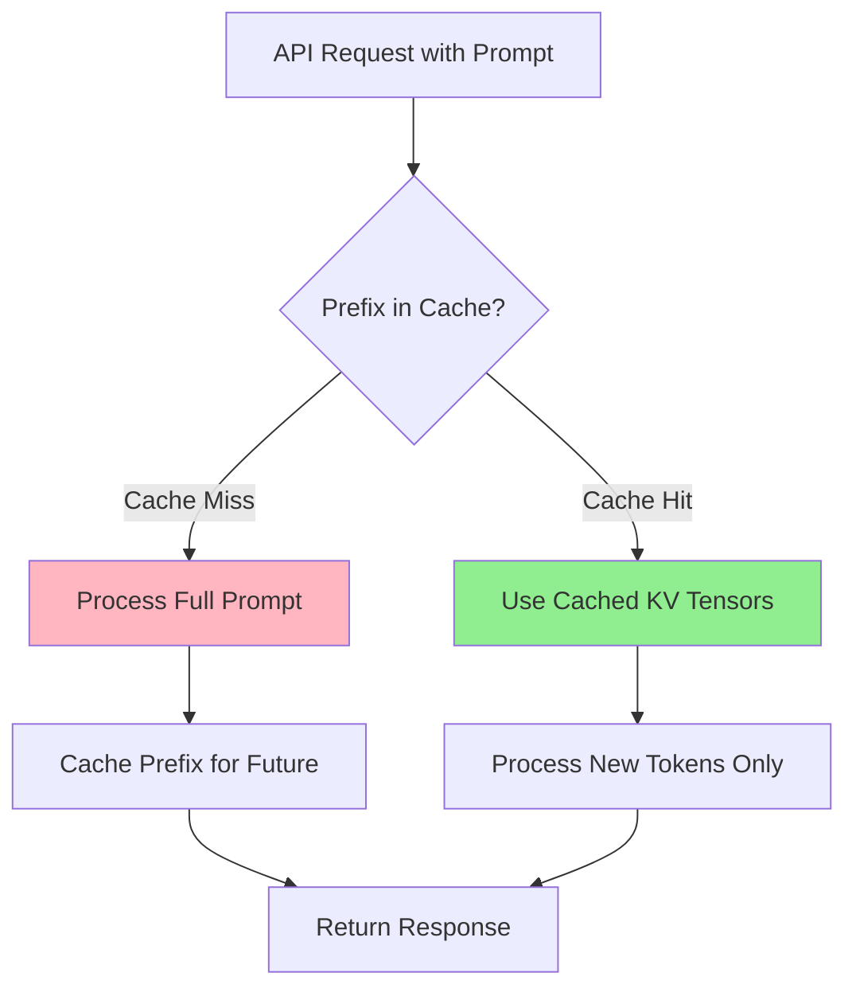
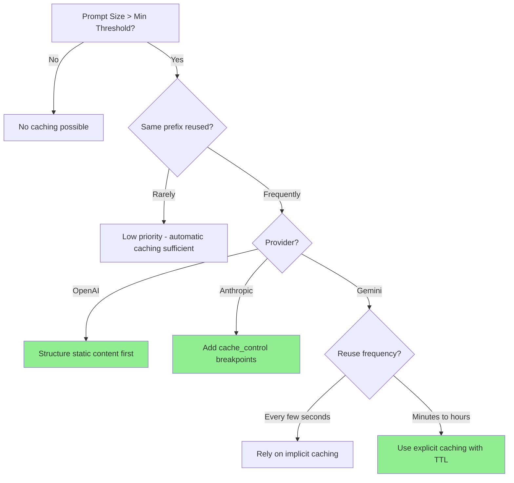

# Prompt Caching Strategies

## Introduction

What if you could reduce LLM API costs by 90% and latency by 80% with no code changes? Prompt caching makes this possible by reusing previously processed prompt content. This lesson explores how caching works across providers and when to leverage it for maximum efficiency.

> **🔑 Key Insight:** Modern LLMs automatically cache prompt prefixes, but understanding how caching works lets you structure prompts to maximize cache hits.

### What We'll Cover

- How prompt caching reduces costs and latency
- Provider comparison (OpenAI, Anthropic, Google Gemini)
- Identifying cacheable prompt patterns
- Cache key design and management
- Optimization strategies for different use cases

### Prerequisites

- Understanding of LLM token economics
- Experience with API requests to major providers
- Familiarity with prompt structure (system, user, assistant messages)

---

## Why Prompt Caching Matters

### The Cost Problem

Many AI applications repeatedly send similar prompt content:

| Use Case | Repeated Content | Potential Savings |
|----------|------------------|-------------------|
| Chatbots with system prompts | 2,000-10,000 tokens | 90% on cached portion |
| Document Q&A | Full document each query | 90% per query |
| Coding assistants | Codebase context | 80-90% per completion |
| Agentic workflows | Tool definitions + history | 70-90% per step |

### How Caching Works



> **Technical Detail:** LLMs cache the key/value tensors from attention layers, not the raw text. This means the cached computation is reused, dramatically reducing processing time.

---

## Provider Comparison

### Feature Matrix

| Feature | OpenAI | Anthropic | Google Gemini |
|---------|--------|-----------|---------------|
| **Caching Type** | Automatic | Explicit (cache_control) | Implicit + Explicit |
| **Min Tokens** | 1,024 | 1,024-4,096 (varies by model) | 1,024-4,096 |
| **Default TTL** | 5-10 min (in-memory) | 5 min | Implicit: varies |
| **Extended TTL** | 24h (models vary) | 1 hour (paid) | Explicit: custom |
| **Cost Savings** | 50% reduction | 90% on reads | Reduced on hits |
| **Write Cost** | Free | 25% premium (5m), 100% premium (1h) | Storage time billing |
| **Manual Control** | prompt_cache_key | cache_control breakpoints | client.caches.create() |

### Cost Structure Comparison

```python
# OpenAI: Automatic, no write cost
openai_pricing = {
    "regular_input": "$5/MTok",
    "cached_input": "$2.50/MTok",  # 50% discount
    "cache_write": "Free",
    "cache_retention": "Free (5min-24h depending on model)"
}

# Anthropic: Explicit control, write premium
anthropic_pricing = {
    "regular_input": "$3/MTok",  # Sonnet 4.5
    "cached_read": "$0.30/MTok",  # 90% discount!
    "cache_write_5m": "$3.75/MTok",  # 25% premium
    "cache_write_1h": "$6/MTok",  # 100% premium
}

# Gemini: Implicit automatic + explicit persistent
gemini_pricing = {
    "implicit": "Automatic savings, no guarantee",
    "explicit": "Storage time billing for TTL",
    "cached_read": "Reduced rate"
}
```

### When to Use Each Provider's Caching

| Scenario | Best Provider Approach |
|----------|----------------------|
| High-frequency, same prefix | OpenAI (automatic) or Anthropic 5m cache |
| Occasional reuse (5-60 min gaps) | Anthropic 1h cache |
| Very large static context (videos, docs) | Gemini explicit caching |
| No control needed | OpenAI automatic or Gemini implicit |
| Fine-grained breakpoints | Anthropic (up to 4 breakpoints) |

---

## Cacheable vs Non-Cacheable Content

### The Static/Dynamic Split

```
┌─────────────────────────────────────────────────────────────┐
│                    PROMPT STRUCTURE                          │
├─────────────────────────────────────────────────────────────┤
│  ┌─────────────────────────────────────────────────────┐    │
│  │           STATIC (Cacheable)                         │    │
│  │  • System instructions                               │    │
│  │  • Tool definitions                                  │    │
│  │  • Reference documents                               │    │
│  │  • Few-shot examples                                 │    │
│  │  • Background context                                │    │
│  └─────────────────────────────────────────────────────┘    │
│                         ↓                                    │
│  ┌─────────────────────────────────────────────────────┐    │
│  │           CACHE BREAKPOINT                           │    │
│  └─────────────────────────────────────────────────────┘    │
│                         ↓                                    │
│  ┌─────────────────────────────────────────────────────┐    │
│  │           DYNAMIC (Per-request)                      │    │
│  │  • Current user message                              │    │
│  │  • User-specific context                             │    │
│  │  • Session variables                                 │    │
│  │  • Real-time data                                    │    │
│  └─────────────────────────────────────────────────────┘    │
└─────────────────────────────────────────────────────────────┘
```

### Content Classification

| Content Type | Cacheability | Reasoning |
|--------------|--------------|-----------|
| System prompt | ✅ High | Rarely changes, appears in every request |
| Tool definitions | ✅ High | Static across sessions |
| RAG documents | ✅ Medium | Same docs queried multiple times |
| Conversation history | ⚠️ Variable | Grows each turn, but prefix stable |
| User query | ❌ Low | Changes every request |
| Timestamps | ❌ None | Always different |
| User IDs/names | ❌ None | Per-user, breaks cache for others |

---

## Cache Efficiency Metrics

### Measuring Cache Performance

```python
def calculate_cache_efficiency(usage: dict) -> dict:
    """Calculate caching efficiency from API response usage."""
    
    cache_read = usage.get("cache_read_input_tokens", 0)
    cache_write = usage.get("cache_creation_input_tokens", 0)
    uncached = usage.get("input_tokens", 0)
    
    total_input = cache_read + cache_write + uncached
    
    return {
        "total_input_tokens": total_input,
        "cache_hit_rate": cache_read / total_input if total_input else 0,
        "cache_miss_rate": cache_write / total_input if total_input else 0,
        "uncached_rate": uncached / total_input if total_input else 0,
        "effective_cost_reduction": cache_read * 0.9 / total_input if total_input else 0
    }

# Example usage data from Anthropic
usage = {
    "cache_read_input_tokens": 100000,
    "cache_creation_input_tokens": 0,
    "input_tokens": 50
}

metrics = calculate_cache_efficiency(usage)
# cache_hit_rate: 0.9995 (99.95% of tokens from cache)
# effective_cost_reduction: 89.95%
```

### Breakeven Analysis

When does caching pay off?

```python
def anthropic_caching_breakeven(
    cacheable_tokens: int,
    requests_per_cache_period: int,
    base_price_per_mtok: float = 3.0  # Sonnet 4.5
) -> dict:
    """Calculate if Anthropic caching is worth it."""
    
    # Costs per million tokens
    write_cost = base_price_per_mtok * 1.25  # 25% premium for 5m
    read_cost = base_price_per_mtok * 0.1    # 90% discount
    
    # Total cost with caching
    cache_cost = (
        (cacheable_tokens / 1_000_000) * write_cost +  # One write
        (cacheable_tokens / 1_000_000) * read_cost * (requests_per_cache_period - 1)  # N-1 reads
    )
    
    # Total cost without caching
    no_cache_cost = (
        (cacheable_tokens / 1_000_000) * base_price_per_mtok * requests_per_cache_period
    )
    
    savings = no_cache_cost - cache_cost
    breakeven_requests = 1.25 / (1 - 0.1)  # ~1.39, rounds to 2
    
    return {
        "cost_with_caching": round(cache_cost, 4),
        "cost_without_caching": round(no_cache_cost, 4),
        "savings": round(savings, 4),
        "savings_percent": round((savings / no_cache_cost) * 100, 1),
        "breakeven_requests": 2  # Need at least 2 requests to benefit
    }

# Example: 100K tokens, 10 requests in 5 minutes
result = anthropic_caching_breakeven(100_000, 10)
# savings_percent: ~77%
```

---

## Decision Framework

### Should You Optimize for Caching?



### Key Questions to Ask

1. **How often is the same content reused?**
   - Same user within 5 minutes? → Default caching works
   - Across users with same system prompt? → Optimize structure
   - Sporadic usage (>5 min gaps)? → Consider extended TTL

2. **How large is the cacheable portion?**
   - <1,024 tokens? → Can't cache
   - 1,024-10,000? → Moderate benefit
   - 10,000-100,000+? → Significant savings

3. **What's your cost tolerance?**
   - Anthropic charges premium for writes (recoup on 2+ reads)
   - OpenAI is free to try
   - Gemini explicit caching has storage costs

---

## Quick Start Examples

### OpenAI (Automatic)

```python
from openai import OpenAI

client = OpenAI()

# Just structure your prompt with static content first
# Caching happens automatically for prompts ≥1024 tokens

response = client.chat.completions.create(
    model="gpt-4o",
    messages=[
        {
            "role": "system",
            "content": large_static_system_prompt  # 2000+ tokens
        },
        {
            "role": "user", 
            "content": user_query  # Dynamic
        }
    ]
)

# Check cache performance
print(response.usage.prompt_tokens_details.cached_tokens)
```

### Anthropic (Explicit)

```python
from anthropic import Anthropic

client = Anthropic()

response = client.messages.create(
    model="claude-sonnet-4-5",
    max_tokens=1024,
    system=[
        {
            "type": "text",
            "text": large_static_instructions
        },
        {
            "type": "text",
            "text": reference_document,
            "cache_control": {"type": "ephemeral"}  # Cache breakpoint
        }
    ],
    messages=[{"role": "user", "content": user_query}]
)

# Check cache performance
print(f"Cache read: {response.usage.cache_read_input_tokens}")
print(f"Cache write: {response.usage.cache_creation_input_tokens}")
```

### Gemini (Explicit)

```python
from google import genai
from google.genai import types

client = genai.Client()

# Create persistent cache
cache = client.caches.create(
    model="models/gemini-3-flash-preview",
    config=types.CreateCachedContentConfig(
        display_name="my-document-cache",
        system_instruction="You are a helpful assistant...",
        contents=[large_document],
        ttl="3600s"  # 1 hour
    )
)

# Use cache in requests
response = client.models.generate_content(
    model="models/gemini-3-flash-preview",
    contents="Summarize the key points",
    config=types.GenerateContentConfig(cached_content=cache.name)
)
```

---

## Summary

✅ **Prompt caching reduces costs up to 90%** by reusing processed content
✅ **Structure matters:** Static content first, dynamic content last
✅ **Providers differ:** OpenAI automatic, Anthropic explicit, Gemini both
✅ **Minimum thresholds exist:** 1,024-4,096 tokens depending on model
✅ **Cache hits require exact prefix match** — any change invalidates
✅ **Monitor usage fields** to track cache efficiency

**Next:** [Identifying Cacheable Patterns](./01-cacheable-patterns.md)

---

## Further Reading

- [OpenAI Prompt Caching Guide](https://platform.openai.com/docs/guides/prompt-caching)
- [Anthropic Prompt Caching Docs](https://docs.anthropic.com/en/docs/build-with-claude/prompt-caching)
- [Gemini Context Caching](https://ai.google.dev/gemini-api/docs/caching)

---

<!-- 
Sources Consulted:
- OpenAI Prompt Caching: Automatic caching, 1024 token minimum, 50% cost reduction
- Anthropic Prompt Caching: cache_control, 5m/1h TTL, 90% read discount
- Gemini Context Caching: Implicit and explicit modes, TTL configuration
-->
