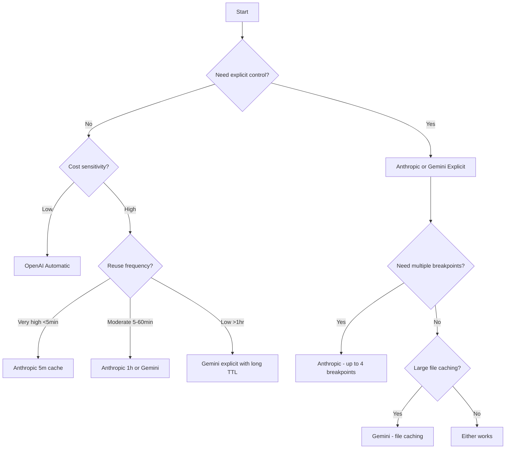

# Provider Caching Features

## Introduction

Each major LLM provider implements prompt caching differently. OpenAI uses automatic caching, Anthropic requires explicit cache control markers, and Google Gemini offers both implicit and explicit options. This lesson covers the specific APIs, configurations, and optimization strategies for each provider.

> **🔑 Key Insight:** Anthropic offers the highest savings (90% on reads) but requires explicit setup. OpenAI is simpler (automatic) but offers less discount (50%). Choose based on your optimization needs.

### What We'll Cover

- OpenAI automatic caching API
- Anthropic explicit cache_control system
- Google Gemini implicit and explicit caching
- Provider-specific code examples
- TTL management and extended caching

### Prerequisites

- [Cacheable Patterns](./01-cacheable-patterns.md)
- API access to at least one provider

---

## OpenAI Prompt Caching

### How OpenAI Caching Works

OpenAI's caching is **fully automatic**—no code changes required. The system:

1. **Routes requests** based on prompt prefix hash (first ~256 tokens)
2. **Checks cache** on the routed server for matching prefix
3. **Returns cached result** or processes and caches for future

```python
from openai import OpenAI

client = OpenAI()

# Caching happens automatically for prompts ≥1024 tokens
response = client.chat.completions.create(
    model="gpt-4o",
    messages=[
        {
            "role": "system",
            "content": large_system_prompt  # Static, at beginning
        },
        {
            "role": "user",
            "content": user_query  # Dynamic, at end
        }
    ]
)

# Check cache performance in response
usage = response.usage
print(f"Total prompt tokens: {usage.prompt_tokens}")
print(f"Cached tokens: {usage.prompt_tokens_details.cached_tokens}")
print(f"Cache hit rate: {usage.prompt_tokens_details.cached_tokens / usage.prompt_tokens:.1%}")
```

### OpenAI Cache Requirements

| Requirement | Value |
|-------------|-------|
| Minimum tokens | 1,024 |
| Cache lifetime (in-memory) | 5-10 min, up to 1 hour |
| Cache lifetime (extended) | Up to 24 hours |
| Cache sharing | Organization-level isolation |
| Cost | 50% discount on cached tokens |
| Write cost | Free |

### Extended Cache Retention

```python
# Extended caching for supported models (gpt-5.x, gpt-4.1)
response = client.chat.completions.create(
    model="gpt-5.1",
    messages=[...],
    prompt_cache_retention="24h"  # Extended retention
)
```

### Using prompt_cache_key

For better cache hit rates when many requests share common prefixes:

```python
# Use consistent cache key for related requests
response = client.chat.completions.create(
    model="gpt-4o",
    messages=[...],
    prompt_cache_key="customer-service-v2"  # Influences routing
)
```

> **Note:** Keep requests with the same `prompt_cache_key` under ~15/minute to avoid cache overflow.

### OpenAI Best Practices

```python
class OpenAICacheOptimizer:
    """Optimize prompts for OpenAI automatic caching."""
    
    @staticmethod
    def structure_prompt(
        system_instructions: str,
        static_context: str,
        dynamic_query: str
    ) -> list:
        """Structure prompt for maximum cache hits."""
        
        # Combine static content at the beginning
        static_portion = f"""
{system_instructions}

REFERENCE CONTEXT:
{static_context}
"""
        
        return [
            {
                "role": "system",
                "content": static_portion  # All static content together
            },
            {
                "role": "user",
                "content": dynamic_query  # Only dynamic at end
            }
        ]
    
    @staticmethod
    def estimate_cache_savings(
        total_tokens: int,
        cached_tokens: int,
        price_per_mtok: float = 5.0  # GPT-4o input price
    ) -> dict:
        """Estimate cost savings from caching."""
        
        uncached_tokens = total_tokens - cached_tokens
        
        # OpenAI: 50% discount on cached tokens
        cost_without_cache = (total_tokens / 1_000_000) * price_per_mtok
        cost_with_cache = (
            (uncached_tokens / 1_000_000) * price_per_mtok +
            (cached_tokens / 1_000_000) * (price_per_mtok * 0.5)
        )
        
        return {
            "cost_without_cache": round(cost_without_cache, 6),
            "cost_with_cache": round(cost_with_cache, 6),
            "savings": round(cost_without_cache - cost_with_cache, 6),
            "savings_percent": round(
                (1 - cost_with_cache / cost_without_cache) * 100, 1
            ) if cost_without_cache > 0 else 0
        }
```

---

## Anthropic Prompt Caching

### How Anthropic Caching Works

Anthropic requires **explicit cache control markers** using `cache_control`:

```python
from anthropic import Anthropic

client = Anthropic()

response = client.messages.create(
    model="claude-sonnet-4-5",
    max_tokens=1024,
    system=[
        {
            "type": "text",
            "text": "You are a helpful assistant."
        },
        {
            "type": "text",
            "text": large_reference_document,  # 50K tokens
            "cache_control": {"type": "ephemeral"}  # ← Cache breakpoint
        }
    ],
    messages=[
        {"role": "user", "content": "Summarize the key points."}
    ]
)

# Detailed cache metrics
print(f"Cache created: {response.usage.cache_creation_input_tokens}")
print(f"Cache read: {response.usage.cache_read_input_tokens}")
print(f"Uncached: {response.usage.input_tokens}")
```

### Anthropic Cache Requirements

| Requirement | Value |
|-------------|-------|
| Minimum tokens (Opus 4.5) | 4,096 |
| Minimum tokens (Sonnet/Opus 4.x) | 1,024 |
| Minimum tokens (Haiku 4.5) | 4,096 |
| Minimum tokens (Haiku 3.x) | 2,048 |
| Default TTL | 5 minutes |
| Extended TTL | 1 hour (additional cost) |
| Max breakpoints | 4 per request |
| Cache sharing | Workspace isolation |

### Cache Hierarchy

Anthropic caches in this order: `tools` → `system` → `messages`

```python
# Full hierarchy example
response = client.messages.create(
    model="claude-sonnet-4-5",
    max_tokens=1024,
    
    # 1. Tools (cached first)
    tools=[
        {"name": "search", "description": "...", "input_schema": {...}},
        # More tools...
    ],
    
    # 2. System (cached second)
    system=[
        {"type": "text", "text": "Instructions..."},
        {
            "type": "text",
            "text": "Reference document...",
            "cache_control": {"type": "ephemeral"}
        }
    ],
    
    # 3. Messages (cached last, if marked)
    messages=[
        {"role": "user", "content": "Query..."}
    ]
)
```

### TTL Configuration

```python
# Default 5-minute cache
short_cache = {"type": "ephemeral"}  # or {"type": "ephemeral", "ttl": "5m"}

# Extended 1-hour cache (higher write cost)
long_cache = {"type": "ephemeral", "ttl": "1h"}

# Using extended cache
response = client.messages.create(
    model="claude-sonnet-4-5",
    max_tokens=1024,
    system=[
        {
            "type": "text",
            "text": very_large_context,
            "cache_control": {"type": "ephemeral", "ttl": "1h"}
        }
    ],
    messages=[...]
)

# Response includes TTL-specific metrics
print(response.usage.cache_creation)
# {"ephemeral_5m_input_tokens": 0, "ephemeral_1h_input_tokens": 50000}
```

### Multiple Cache Breakpoints

```python
def create_multi_breakpoint_prompt(
    tools: list,
    instructions: str,
    static_docs: str,
    dynamic_docs: str,
    query: str
) -> dict:
    """Use multiple breakpoints for different cache lifetimes."""
    
    return {
        "tools": tools,  # Implicitly cached first
        "system": [
            # Breakpoint 1: Long-lived instructions (1 hour)
            {
                "type": "text",
                "text": instructions,
                "cache_control": {"type": "ephemeral", "ttl": "1h"}
            },
            # Breakpoint 2: Static docs (5 minutes)
            {
                "type": "text",
                "text": static_docs,
                "cache_control": {"type": "ephemeral", "ttl": "5m"}
            }
        ],
        "messages": [
            # Dynamic docs - cached per conversation turn
            {
                "role": "user",
                "content": [
                    {"type": "text", "text": dynamic_docs},
                    {
                        "type": "text",
                        "text": query,
                        "cache_control": {"type": "ephemeral"}
                    }
                ]
            }
        ]
    }
```

### Anthropic Cost Calculator

```python
class AnthropicCacheCalculator:
    """Calculate Anthropic caching costs and savings."""
    
    # Prices per million tokens (Sonnet 4.5)
    PRICING = {
        "base_input": 3.0,
        "cache_write_5m": 3.75,   # 25% premium
        "cache_write_1h": 6.0,    # 100% premium
        "cache_read": 0.30,       # 90% discount
        "output": 15.0
    }
    
    @classmethod
    def calculate_cost(
        cls,
        cache_read_tokens: int,
        cache_write_tokens: int,
        uncached_tokens: int,
        output_tokens: int,
        ttl: str = "5m"
    ) -> dict:
        """Calculate total cost for a request."""
        
        write_price = (
            cls.PRICING["cache_write_1h"] if ttl == "1h" 
            else cls.PRICING["cache_write_5m"]
        )
        
        cost = (
            (cache_read_tokens / 1_000_000) * cls.PRICING["cache_read"] +
            (cache_write_tokens / 1_000_000) * write_price +
            (uncached_tokens / 1_000_000) * cls.PRICING["base_input"] +
            (output_tokens / 1_000_000) * cls.PRICING["output"]
        )
        
        # What it would cost without caching
        total_input = cache_read_tokens + cache_write_tokens + uncached_tokens
        cost_without_cache = (
            (total_input / 1_000_000) * cls.PRICING["base_input"] +
            (output_tokens / 1_000_000) * cls.PRICING["output"]
        )
        
        return {
            "cost_with_cache": round(cost, 6),
            "cost_without_cache": round(cost_without_cache, 6),
            "input_savings": round(cost_without_cache - cost, 6),
            "savings_percent": round(
                (1 - cost / cost_without_cache) * 100, 1
            ) if cost_without_cache > 0 else 0
        }
    
    @classmethod
    def breakeven_requests(cls, cacheable_tokens: int, ttl: str = "5m") -> int:
        """Calculate requests needed to break even on cache write."""
        
        write_premium = 0.25 if ttl == "5m" else 1.0
        read_discount = 0.9
        
        # Cost of write = base + premium
        # Savings per read = base - read_cost = base * 0.9
        # Breakeven when: write_premium = (n-1) * read_discount * base
        
        # Simplified: n = 1 + (write_premium / (1 - 0.1))
        n = 1 + (write_premium / read_discount)
        
        return int(n) + 1  # Round up
```

---

## Google Gemini Caching

### Implicit vs Explicit Caching

| Feature | Implicit | Explicit |
|---------|----------|----------|
| Setup required | None | Create cache object |
| Cost guarantee | No | Yes |
| TTL control | No | Yes (custom) |
| Best for | Frequent similar requests | Large persistent context |

### Implicit Caching (Automatic)

```python
from google import genai

client = genai.Client()

# Implicit caching happens automatically
# No special configuration needed
response = client.models.generate_content(
    model="gemini-2.5-flash",
    contents=[
        large_static_content,  # Put at beginning
        user_query             # Dynamic at end
    ]
)

# Check for cache hits
print(response.usage_metadata)
# Shows cached_content_token_count if cache hit
```

### Explicit Caching (Persistent)

```python
from google import genai
from google.genai import types

client = genai.Client()

# Step 1: Create a cache
cache = client.caches.create(
    model="models/gemini-3-flash-preview",
    config=types.CreateCachedContentConfig(
        display_name="product-catalog-2024",
        system_instruction="You are a product expert...",
        contents=[product_catalog_document],  # Large content
        ttl="3600s"  # 1 hour TTL
    )
)

print(f"Cache created: {cache.name}")

# Step 2: Use the cache
response = client.models.generate_content(
    model="models/gemini-3-flash-preview",
    contents="What products are in the Electronics category?",
    config=types.GenerateContentConfig(
        cached_content=cache.name  # Reference the cache
    )
)

print(response.text)
print(response.usage_metadata)  # Shows cached token counts
```

### Gemini Cache Management

```python
class GeminiCacheManager:
    """Manage Gemini explicit caches."""
    
    def __init__(self):
        self.client = genai.Client()
    
    def create_cache(
        self,
        name: str,
        content: str | list,
        system_instruction: str = None,
        ttl_seconds: int = 3600
    ) -> str:
        """Create a new cache and return its name."""
        
        cache = self.client.caches.create(
            model="models/gemini-3-flash-preview",
            config=types.CreateCachedContentConfig(
                display_name=name,
                system_instruction=system_instruction,
                contents=content if isinstance(content, list) else [content],
                ttl=f"{ttl_seconds}s"
            )
        )
        
        return cache.name
    
    def list_caches(self) -> list:
        """List all active caches."""
        return list(self.client.caches.list())
    
    def update_ttl(self, cache_name: str, new_ttl_seconds: int):
        """Extend or reduce cache TTL."""
        
        self.client.caches.update(
            name=cache_name,
            config=types.UpdateCachedContentConfig(
                ttl=f"{new_ttl_seconds}s"
            )
        )
    
    def delete_cache(self, cache_name: str):
        """Delete a cache before expiration."""
        self.client.caches.delete(cache_name)
    
    def generate_with_cache(
        self,
        cache_name: str,
        query: str
    ) -> str:
        """Generate content using a cached context."""
        
        response = self.client.models.generate_content(
            model="models/gemini-3-flash-preview",
            contents=query,
            config=types.GenerateContentConfig(
                cached_content=cache_name
            )
        )
        
        return response.text
```

### Gemini Cache with Files

```python
import pathlib
import requests
import time

# Upload a large file
url = "https://example.com/large-document.pdf"
file_path = pathlib.Path("document.pdf")
file_path.write_bytes(requests.get(url).content)

uploaded_file = client.files.upload(file=file_path)

# Wait for processing
while uploaded_file.state.name == "PROCESSING":
    time.sleep(5)
    uploaded_file = client.files.get(name=uploaded_file.name)

print(f"File ready: {uploaded_file.uri}")

# Create cache with the file
cache = client.caches.create(
    model="models/gemini-3-flash-preview",
    config=types.CreateCachedContentConfig(
        display_name="document-qa-cache",
        system_instruction="Answer questions based on this document.",
        contents=[uploaded_file],  # Reference the uploaded file
        ttl="7200s"  # 2 hours
    )
)

# Query the cached document
response = client.models.generate_content(
    model="models/gemini-3-flash-preview",
    contents="Summarize the main findings.",
    config=types.GenerateContentConfig(cached_content=cache.name)
)
```

---

## Provider Selection Guide

### Decision Matrix



### Quick Reference

| Requirement | Recommendation |
|-------------|----------------|
| Simplest setup | OpenAI (automatic) |
| Maximum savings | Anthropic (90% on reads) |
| Long-term persistence | Gemini explicit |
| Video/large file caching | Gemini |
| Fine-grained control | Anthropic (4 breakpoints) |
| No code changes | OpenAI or Gemini implicit |

---

## Hands-on Exercise

### Your Task

Implement a cache-optimized document Q&A system that works with Anthropic's caching.

**Requirements:**
1. Cache a large document (simulate with 10,000+ character string)
2. Answer multiple questions against the same document
3. Track cache hit rates
4. Calculate cost savings

<details>
<summary>✅ Solution (click to expand)</summary>

```python
from anthropic import Anthropic
from dataclasses import dataclass

@dataclass
class CacheMetrics:
    total_requests: int = 0
    cache_reads: int = 0
    cache_writes: int = 0
    uncached_tokens: int = 0
    
    def cache_hit_rate(self) -> float:
        total = self.cache_reads + self.cache_writes + self.uncached_tokens
        return self.cache_reads / total if total > 0 else 0
    
    def estimated_savings(self, base_price: float = 3.0) -> float:
        # 90% savings on cache reads
        return (self.cache_reads / 1_000_000) * base_price * 0.9

class CachedDocumentQA:
    """Document Q&A with Anthropic caching."""
    
    def __init__(self, client: Anthropic = None):
        self.client = client or Anthropic()
        self.metrics = CacheMetrics()
    
    def create_qa_prompt(
        self,
        document: str,
        question: str
    ) -> dict:
        """Create cache-optimized prompt structure."""
        
        return {
            "model": "claude-sonnet-4-5",
            "max_tokens": 1024,
            "system": [
                {
                    "type": "text",
                    "text": """You are a document analysis assistant.
Answer questions based ONLY on the provided document.
If the information isn't in the document, say so.
Cite relevant sections when possible."""
                },
                {
                    "type": "text",
                    "text": f"DOCUMENT:\n\n{document}",
                    "cache_control": {"type": "ephemeral"}
                }
            ],
            "messages": [
                {"role": "user", "content": question}
            ]
        }
    
    def ask(self, document: str, question: str) -> str:
        """Ask a question about a document."""
        
        prompt = self.create_qa_prompt(document, question)
        response = self.client.messages.create(**prompt)
        
        # Track metrics
        self.metrics.total_requests += 1
        self.metrics.cache_reads += response.usage.cache_read_input_tokens
        self.metrics.cache_writes += response.usage.cache_creation_input_tokens
        self.metrics.uncached_tokens += response.usage.input_tokens
        
        return response.content[0].text
    
    def get_stats(self) -> dict:
        """Get caching performance statistics."""
        
        return {
            "total_requests": self.metrics.total_requests,
            "cache_hit_rate": f"{self.metrics.cache_hit_rate():.1%}",
            "estimated_savings": f"${self.metrics.estimated_savings():.4f}"
        }

# Usage example
def demo():
    # Simulate large document (would be 10K+ tokens in production)
    document = """
    ACME Corporation Annual Report 2024
    
    Executive Summary:
    Revenue increased 25% to $50M. 
    Employee count grew from 200 to 350.
    Launched 3 new product lines.
    
    Financial Highlights:
    - Q1 Revenue: $10M
    - Q2 Revenue: $12M
    - Q3 Revenue: $13M
    - Q4 Revenue: $15M
    
    Key Achievements:
    - Expanded to 5 new markets
    - Won "Best Startup" award
    - Customer satisfaction: 94%
    
    [... imagine 50,000 more characters ...]
    """ * 100  # Make it large enough to cache
    
    qa = CachedDocumentQA()
    
    # First question - cache miss (creates cache)
    answer1 = qa.ask(document, "What was the total revenue?")
    print(f"Q1: {answer1}")
    
    # Second question - cache hit
    answer2 = qa.ask(document, "How many employees does ACME have?")
    print(f"Q2: {answer2}")
    
    # Third question - cache hit
    answer3 = qa.ask(document, "What was Q4 revenue?")
    print(f"Q3: {answer3}")
    
    # Check stats
    print("\nCaching Statistics:")
    for key, value in qa.get_stats().items():
        print(f"  {key}: {value}")

# demo()
```

**Expected output:**
```
Q1: According to the document, total revenue increased 25% to $50M.
Q2: The document states that employee count grew from 200 to 350.
Q3: Q4 Revenue was $15M according to the Financial Highlights.

Caching Statistics:
  total_requests: 3
  cache_hit_rate: 66.7%
  estimated_savings: $0.27
```

</details>

---

## Summary

✅ **OpenAI:** Automatic, 50% savings, simplest setup
✅ **Anthropic:** Explicit control, 90% read savings, requires cache_control
✅ **Gemini:** Both modes, explicit for guaranteed savings and long TTL
✅ **Cache hierarchy:** Tools → System → Messages (Anthropic)
✅ **TTL options:** 5 min (default), 1 hour (premium), custom (Gemini)
✅ **Monitor metrics:** Use usage fields to track cache performance

**Next:** [Cache Management and Invalidation](./03-cache-management.md)

---

## Further Reading

- [OpenAI Prompt Caching](https://platform.openai.com/docs/guides/prompt-caching)
- [Anthropic Prompt Caching](https://docs.anthropic.com/en/docs/build-with-claude/prompt-caching)
- [Gemini Context Caching](https://ai.google.dev/gemini-api/docs/caching)

---

<!-- 
Sources Consulted:
- OpenAI Prompt Caching: Automatic caching, prompt_cache_key, extended retention
- Anthropic Prompt Caching: cache_control, TTL options, hierarchy, pricing
- Gemini Context Caching: Implicit vs explicit, TTL configuration, file caching
-->
