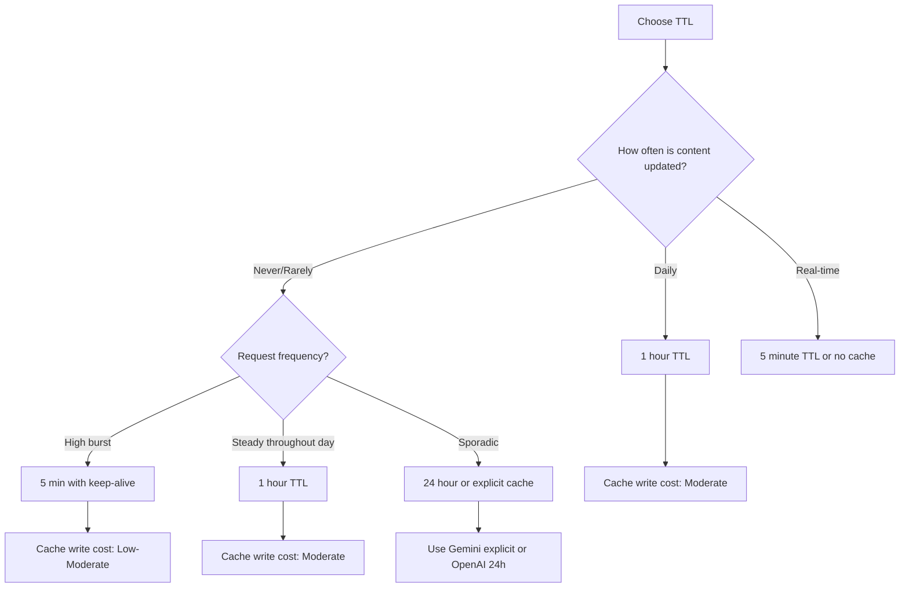

# Cache Management and Invalidation

## Introduction

Effective cache management extends beyond creating caches—it includes designing cache keys, handling invalidation gracefully, selecting appropriate TTLs, and monitoring cache performance. Poor cache management leads to stale data, wasted costs, and unpredictable behavior.

> **🔑 Key Insight:** Cache invalidation is one of the hardest problems in computing. In LLM caching, the challenge is balancing freshness against cost savings.

### What We'll Cover

- Cache key design principles
- Invalidation triggers and strategies
- TTL selection based on use case
- Monitoring and metrics
- Troubleshooting cache issues

### Prerequisites

- [Provider Features](./02-provider-features.md)
- Understanding of provider-specific caching mechanisms

---

## Cache Key Design

### How Cache Keys Work

Each provider uses different mechanisms to identify cached content:

| Provider | Key Components | Control Level |
|----------|----------------|---------------|
| OpenAI | First 256 tokens hash + `prompt_cache_key` | Low (automatic routing) |
| Anthropic | Full content hash of marked regions | High (explicit breakpoints) |
| Gemini | Cache name (explicit) or content hash (implicit) | Medium to High |

### OpenAI Cache Key Strategy

```python
class OpenAICacheKeyOptimizer:
    """Optimize cache key usage for OpenAI."""
    
    def __init__(self, base_prefix: str = "app"):
        self.base_prefix = base_prefix
    
    def create_key(
        self,
        feature: str,
        version: str,
        variant: str = "default"
    ) -> str:
        """Create consistent cache keys for related requests."""
        
        # Format: app/feature-v1/default
        return f"{self.base_prefix}/{feature}-{version}/{variant}"
    
    def request_with_key(
        self,
        client,
        model: str,
        messages: list,
        feature: str,
        version: str = "v1"
    ):
        """Make a request with optimized cache key."""
        
        cache_key = self.create_key(feature, version)
        
        return client.chat.completions.create(
            model=model,
            messages=messages,
            prompt_cache_key=cache_key
        )

# Usage
optimizer = OpenAICacheKeyOptimizer(base_prefix="customer-support")

# All support requests route to same cache
response = optimizer.request_with_key(
    client=client,
    model="gpt-4o",
    messages=[{"role": "system", "content": support_instructions}, ...],
    feature="ticket-handler",
    version="v2"
)
```

> **Warning:** Don't use more than ~15 unique cache keys per minute. Too many keys dilute cache effectiveness.

### Anthropic Content-Based Keys

Anthropic uses content hashing—same content = same cache:

```python
class AnthropicCacheManager:
    """Manage Anthropic caches through content structuring."""
    
    def __init__(self):
        self.content_registry = {}  # Track content versions
    
    def register_content(
        self,
        content_id: str,
        content: str,
        version: str
    ):
        """Register content with version tracking."""
        
        self.content_registry[content_id] = {
            "content": content,
            "version": version,
            "hash": hash(content)  # For change detection
        }
    
    def get_cached_content(self, content_id: str) -> dict:
        """Get content configured for caching."""
        
        registered = self.content_registry.get(content_id)
        if not registered:
            raise ValueError(f"Content '{content_id}' not registered")
        
        return {
            "type": "text",
            "text": registered["content"],
            "cache_control": {"type": "ephemeral"}
        }
    
    def has_changed(self, content_id: str, new_content: str) -> bool:
        """Check if content has changed (requires cache invalidation)."""
        
        registered = self.content_registry.get(content_id)
        if not registered:
            return True
        return hash(new_content) != registered["hash"]
```

### Gemini Named Caches

```python
from google import genai
from google.genai import types

class GeminiCacheRegistry:
    """Registry for managing named Gemini caches."""
    
    def __init__(self):
        self.client = genai.Client()
        self.cache_names = {}  # name -> cache_resource_name
    
    def get_or_create(
        self,
        name: str,
        content: str,
        system_instruction: str = None,
        ttl_seconds: int = 3600
    ) -> str:
        """Get existing cache or create new one."""
        
        # Check if we have this cache
        if name in self.cache_names:
            try:
                cache = self.client.caches.get(name=self.cache_names[name])
                # Cache still exists and valid
                return cache.name
            except Exception:
                # Cache expired, remove from registry
                del self.cache_names[name]
        
        # Create new cache
        cache = self.client.caches.create(
            model="models/gemini-3-flash-preview",
            config=types.CreateCachedContentConfig(
                display_name=name,
                system_instruction=system_instruction,
                contents=[content],
                ttl=f"{ttl_seconds}s"
            )
        )
        
        self.cache_names[name] = cache.name
        return cache.name
    
    def invalidate(self, name: str):
        """Explicitly invalidate a cache."""
        
        if name in self.cache_names:
            try:
                self.client.caches.delete(self.cache_names[name])
            except Exception:
                pass  # Already expired
            del self.cache_names[name]
```

---

## Invalidation Triggers

### What Causes Cache Misses

Understanding invalidation triggers helps maintain high cache hit rates:

| Provider | Invalidation Trigger | Impact |
|----------|---------------------|--------|
| All | Content change (any token) | Full cache miss |
| OpenAI | Prefix change (first 256 tokens) | New routing, miss |
| Anthropic | tool_choice change | Even if tools same |
| Anthropic | Image modification | Even if text same |
| Gemini (explicit) | TTL expiration | Must recreate |
| All | Request rate limits | Temporary misses |

### Content Change Detection

```python
import hashlib
from dataclasses import dataclass
from typing import Optional

@dataclass
class CacheableContent:
    """Content with change tracking for cache management."""
    
    content: str
    content_hash: str
    version: int = 1
    
    @classmethod
    def create(cls, content: str) -> "CacheableContent":
        """Create new cacheable content with hash."""
        
        content_hash = hashlib.sha256(content.encode()).hexdigest()[:16]
        return cls(content=content, content_hash=content_hash)
    
    def update(self, new_content: str) -> "CacheableContent":
        """Update content, incrementing version if changed."""
        
        new_hash = hashlib.sha256(new_content.encode()).hexdigest()[:16]
        
        if new_hash != self.content_hash:
            # Content changed - cache will be invalidated
            return CacheableContent(
                content=new_content,
                content_hash=new_hash,
                version=self.version + 1
            )
        return self  # No change
    
    @property
    def cache_key_suffix(self) -> str:
        """Generate suffix for cache key based on version."""
        return f"v{self.version}-{self.content_hash[:8]}"

class ContentManager:
    """Manage multiple cacheable contents with change tracking."""
    
    def __init__(self):
        self.contents: dict[str, CacheableContent] = {}
        self.change_listeners = []
    
    def register(self, name: str, content: str):
        """Register new content."""
        self.contents[name] = CacheableContent.create(content)
    
    def update(self, name: str, new_content: str) -> bool:
        """Update content, returns True if changed."""
        
        if name not in self.contents:
            self.register(name, new_content)
            return True
        
        old_version = self.contents[name].version
        self.contents[name] = self.contents[name].update(new_content)
        
        changed = self.contents[name].version > old_version
        
        if changed:
            for listener in self.change_listeners:
                listener(name, self.contents[name])
        
        return changed
    
    def get(self, name: str) -> Optional[CacheableContent]:
        return self.contents.get(name)
    
    def on_change(self, listener):
        """Register callback for content changes."""
        self.change_listeners.append(listener)
```

### Graceful Invalidation Strategies

```python
from enum import Enum
from typing import Callable

class InvalidationStrategy(Enum):
    IMMEDIATE = "immediate"     # Invalidate now
    LAZY = "lazy"              # Invalidate on next request
    GRADUAL = "gradual"        # Roll out to percentage of requests

class CacheInvalidator:
    """Handle cache invalidation gracefully."""
    
    def __init__(self, content_manager: ContentManager):
        self.content_manager = content_manager
        self.pending_invalidations: dict[str, str] = {}  # name -> new_content
        self.rollout_percentage: dict[str, float] = {}   # name -> percentage
    
    def invalidate(
        self,
        name: str,
        new_content: str,
        strategy: InvalidationStrategy = InvalidationStrategy.IMMEDIATE
    ):
        """Invalidate cache with specified strategy."""
        
        if strategy == InvalidationStrategy.IMMEDIATE:
            self.content_manager.update(name, new_content)
            
        elif strategy == InvalidationStrategy.LAZY:
            self.pending_invalidations[name] = new_content
            
        elif strategy == InvalidationStrategy.GRADUAL:
            self.pending_invalidations[name] = new_content
            self.rollout_percentage[name] = 0.0
    
    def get_content(
        self,
        name: str,
        rollout_check: Callable[[], float] = None
    ) -> str:
        """Get content, applying lazy or gradual invalidation."""
        
        # Check for lazy invalidation
        if name in self.pending_invalidations:
            if name not in self.rollout_percentage:
                # Lazy: invalidate on first access
                new_content = self.pending_invalidations.pop(name)
                self.content_manager.update(name, new_content)
            else:
                # Gradual: check rollout percentage
                if rollout_check and rollout_check() < self.rollout_percentage[name]:
                    new_content = self.pending_invalidations[name]
                    return new_content
        
        cached = self.content_manager.get(name)
        return cached.content if cached else None
    
    def increment_rollout(self, name: str, increment: float = 0.1):
        """Increase rollout percentage for gradual invalidation."""
        
        if name in self.rollout_percentage:
            self.rollout_percentage[name] = min(
                1.0,
                self.rollout_percentage[name] + increment
            )
            
            # Complete rollout at 100%
            if self.rollout_percentage[name] >= 1.0:
                new_content = self.pending_invalidations.pop(name)
                del self.rollout_percentage[name]
                self.content_manager.update(name, new_content)
```

---

## TTL Selection

### TTL Decision Framework



### TTL by Use Case

| Use Case | Request Pattern | Content Freshness | Recommended TTL |
|----------|-----------------|-------------------|-----------------|
| Customer support bot | High burst | Rarely updated | 5min + keep-alive |
| Document Q&A | Sporadic | Weekly updates | 1 hour or Gemini explicit |
| Code assistant | Steady | Version-based | 1 hour |
| Real-time data analysis | Variable | Frequently | 5 min or no cache |
| Research assistant | Session-based | Per session | 5 min (session duration) |
| Multi-turn conversation | Continuous | Per conversation | 5 min (refresh on each turn) |

### Keep-Alive Pattern

```python
import time
from threading import Thread, Event
from typing import Optional

class CacheKeepAlive:
    """Keep Anthropic caches alive with periodic refresh requests."""
    
    def __init__(self, client, refresh_interval: int = 240):  # 4 minutes
        self.client = client
        self.refresh_interval = refresh_interval
        self.active_caches: dict[str, dict] = {}
        self.stop_event = Event()
        self.refresh_thread: Optional[Thread] = None
    
    def register_cache(
        self,
        cache_id: str,
        system_content: list,
        model: str = "claude-sonnet-4-5"
    ):
        """Register a cache to keep alive."""
        
        self.active_caches[cache_id] = {
            "system": system_content,
            "model": model,
            "last_refresh": time.time()
        }
    
    def unregister_cache(self, cache_id: str):
        """Stop keeping a cache alive."""
        
        if cache_id in self.active_caches:
            del self.active_caches[cache_id]
    
    def _refresh_cache(self, cache_id: str, config: dict):
        """Send minimal request to refresh cache TTL."""
        
        try:
            # Minimal request just to touch the cache
            self.client.messages.create(
                model=config["model"],
                max_tokens=1,
                system=config["system"],
                messages=[
                    {"role": "user", "content": "ping"}
                ]
            )
            config["last_refresh"] = time.time()
        except Exception as e:
            print(f"Cache refresh failed for {cache_id}: {e}")
    
    def _refresh_loop(self):
        """Background thread to refresh caches."""
        
        while not self.stop_event.is_set():
            current_time = time.time()
            
            for cache_id, config in list(self.active_caches.items()):
                time_since_refresh = current_time - config["last_refresh"]
                
                if time_since_refresh >= self.refresh_interval:
                    self._refresh_cache(cache_id, config)
            
            # Check every 30 seconds
            self.stop_event.wait(30)
    
    def start(self):
        """Start the keep-alive background thread."""
        
        if self.refresh_thread is None or not self.refresh_thread.is_alive():
            self.stop_event.clear()
            self.refresh_thread = Thread(target=self._refresh_loop, daemon=True)
            self.refresh_thread.start()
    
    def stop(self):
        """Stop the keep-alive background thread."""
        
        self.stop_event.set()
        if self.refresh_thread:
            self.refresh_thread.join(timeout=5)
```

---

## Monitoring and Metrics

### Essential Metrics to Track

| Metric | Formula | Target |
|--------|---------|--------|
| Cache hit rate | `cache_read_tokens / total_input_tokens` | > 70% |
| Cache efficiency | `savings / (read_cost + write_cost)` | > 1.0 |
| Write frequency | `cache_writes / total_requests` | < 30% |
| TTL utilization | `actual_lifetime / configured_ttl` | > 50% |

### Metrics Collector

```python
from dataclasses import dataclass, field
from datetime import datetime
from typing import Optional
import statistics

@dataclass
class CacheMetrics:
    """Comprehensive cache metrics tracking."""
    
    # Token counters
    cache_read_tokens: int = 0
    cache_write_tokens: int = 0
    uncached_tokens: int = 0
    
    # Request counters
    total_requests: int = 0
    cache_hits: int = 0
    cache_misses: int = 0
    
    # Cost tracking (in millionths of dollars)
    read_cost_micros: int = 0
    write_cost_micros: int = 0
    base_cost_micros: int = 0
    
    # Timing
    latencies_ms: list = field(default_factory=list)
    first_request_time: Optional[datetime] = None
    last_request_time: Optional[datetime] = None
    
    @property
    def total_input_tokens(self) -> int:
        return self.cache_read_tokens + self.cache_write_tokens + self.uncached_tokens
    
    @property
    def cache_hit_rate(self) -> float:
        if self.total_input_tokens == 0:
            return 0.0
        return self.cache_read_tokens / self.total_input_tokens
    
    @property
    def total_cost_usd(self) -> float:
        return (self.read_cost_micros + self.write_cost_micros + self.base_cost_micros) / 1_000_000
    
    @property
    def avg_latency_ms(self) -> float:
        return statistics.mean(self.latencies_ms) if self.latencies_ms else 0.0
    
    def record_request(
        self,
        cache_read: int,
        cache_write: int,
        uncached: int,
        latency_ms: float,
        read_price_per_mtok: float = 0.30,
        write_price_per_mtok: float = 3.75,
        base_price_per_mtok: float = 3.0
    ):
        """Record a single request's cache performance."""
        
        now = datetime.now()
        
        # Update token counts
        self.cache_read_tokens += cache_read
        self.cache_write_tokens += cache_write
        self.uncached_tokens += uncached
        
        # Update request counts
        self.total_requests += 1
        if cache_read > 0:
            self.cache_hits += 1
        else:
            self.cache_misses += 1
        
        # Update costs (in micros for precision)
        self.read_cost_micros += int((cache_read / 1_000_000) * read_price_per_mtok * 1_000_000)
        self.write_cost_micros += int((cache_write / 1_000_000) * write_price_per_mtok * 1_000_000)
        self.base_cost_micros += int((uncached / 1_000_000) * base_price_per_mtok * 1_000_000)
        
        # Update timing
        self.latencies_ms.append(latency_ms)
        if self.first_request_time is None:
            self.first_request_time = now
        self.last_request_time = now
    
    def get_summary(self) -> dict:
        """Get a summary of all metrics."""
        
        return {
            "total_requests": self.total_requests,
            "cache_hit_rate": f"{self.cache_hit_rate:.1%}",
            "total_input_tokens": self.total_input_tokens,
            "cached_tokens": self.cache_read_tokens,
            "total_cost_usd": f"${self.total_cost_usd:.4f}",
            "avg_latency_ms": f"{self.avg_latency_ms:.1f}ms",
            "session_duration": str(
                self.last_request_time - self.first_request_time
            ) if self.first_request_time and self.last_request_time else "N/A"
        }

class CacheMonitor:
    """Monitor cache performance across multiple sessions."""
    
    def __init__(self):
        self.sessions: dict[str, CacheMetrics] = {}
        self.current_session: Optional[str] = None
    
    def start_session(self, session_id: str):
        """Start a new monitoring session."""
        
        self.sessions[session_id] = CacheMetrics()
        self.current_session = session_id
    
    def record(
        self,
        cache_read: int,
        cache_write: int,
        uncached: int,
        latency_ms: float
    ):
        """Record to current session."""
        
        if self.current_session and self.current_session in self.sessions:
            self.sessions[self.current_session].record_request(
                cache_read, cache_write, uncached, latency_ms
            )
    
    def get_aggregate_stats(self) -> dict:
        """Get aggregate stats across all sessions."""
        
        total = CacheMetrics()
        
        for session in self.sessions.values():
            total.cache_read_tokens += session.cache_read_tokens
            total.cache_write_tokens += session.cache_write_tokens
            total.uncached_tokens += session.uncached_tokens
            total.total_requests += session.total_requests
            total.cache_hits += session.cache_hits
            total.cache_misses += session.cache_misses
            total.read_cost_micros += session.read_cost_micros
            total.write_cost_micros += session.write_cost_micros
            total.base_cost_micros += session.base_cost_micros
            total.latencies_ms.extend(session.latencies_ms)
        
        return total.get_summary()
```

### Logging Integration

```python
import logging
import json

class CacheLogger:
    """Structured logging for cache operations."""
    
    def __init__(self, logger_name: str = "cache"):
        self.logger = logging.getLogger(logger_name)
    
    def log_request(
        self,
        request_id: str,
        model: str,
        cache_read: int,
        cache_write: int,
        uncached: int,
        latency_ms: float
    ):
        """Log a cache request with structured data."""
        
        total = cache_read + cache_write + uncached
        hit_rate = cache_read / total if total > 0 else 0
        
        log_data = {
            "event": "cache_request",
            "request_id": request_id,
            "model": model,
            "tokens": {
                "cache_read": cache_read,
                "cache_write": cache_write,
                "uncached": uncached,
                "total": total
            },
            "cache_hit_rate": round(hit_rate, 3),
            "latency_ms": round(latency_ms, 1),
            "cache_status": "hit" if cache_read > cache_write else "miss"
        }
        
        self.logger.info(json.dumps(log_data))
    
    def log_invalidation(
        self,
        cache_id: str,
        reason: str,
        strategy: str
    ):
        """Log cache invalidation events."""
        
        log_data = {
            "event": "cache_invalidation",
            "cache_id": cache_id,
            "reason": reason,
            "strategy": strategy
        }
        
        self.logger.warning(json.dumps(log_data))
```

---

## Troubleshooting

### Common Issues

| Issue | Symptoms | Solution |
|-------|----------|----------|
| Low hit rate | `cache_read_tokens` always 0 | Check prefix ordering, ensure static content first |
| Unexpected misses | Random cache misses | Content may have subtle changes (whitespace, versions) |
| High write costs | Frequent cache creations | Reduce content variability, increase TTL |
| Cache not triggering | Never cached | Check minimum token requirements (1024+) |

### Debugging Checklist

```python
def debug_cache_issue(
    response_usage,
    expected_cached_tokens: int
) -> list[str]:
    """Diagnose common cache issues."""
    
    issues = []
    
    # Check if caching happened at all
    cache_read = getattr(response_usage, 'cache_read_input_tokens', 0)
    cache_write = getattr(response_usage, 'cache_creation_input_tokens', 0)
    total = response_usage.input_tokens + cache_read + cache_write
    
    if cache_read == 0 and cache_write == 0:
        issues.append("❌ No caching detected. Check:")
        issues.append("  - Is content ≥1024 tokens?")
        issues.append("  - Did you include cache_control markers? (Anthropic)")
        issues.append("  - Is model supported?")
    
    elif cache_write > 0 and cache_read == 0:
        issues.append("⚠️ Cache created but not read. This is expected for first request.")
        issues.append("  - Subsequent requests should show cache_read > 0")
        issues.append("  - If not, content is changing between requests")
    
    elif cache_read < expected_cached_tokens * 0.9:
        issues.append("⚠️ Lower cache hits than expected. Check:")
        issues.append(f"  - Expected ~{expected_cached_tokens}, got {cache_read}")
        issues.append("  - Content may have subtle differences")
        issues.append("  - tool_choice or other params may have changed")
    
    else:
        issues.append("✅ Caching working as expected")
        issues.append(f"  - Hit rate: {cache_read / total:.1%}")
    
    return issues
```

---

## Hands-on Exercise

### Your Task

Build a cache monitoring dashboard that tracks performance across multiple requests.

**Requirements:**
1. Track cache hits vs misses
2. Calculate running cost savings
3. Alert when hit rate drops below threshold

<details>
<summary>✅ Solution (click to expand)</summary>

```python
from dataclasses import dataclass
from datetime import datetime
from typing import Callable, Optional

@dataclass  
class CacheAlert:
    """Alert for cache performance issues."""
    
    timestamp: datetime
    alert_type: str
    message: str
    current_value: float
    threshold: float

class CacheDashboard:
    """Real-time cache monitoring dashboard."""
    
    def __init__(
        self,
        hit_rate_threshold: float = 0.5,
        alert_callback: Optional[Callable[[CacheAlert], None]] = None
    ):
        self.hit_rate_threshold = hit_rate_threshold
        self.alert_callback = alert_callback
        
        # Metrics
        self.total_requests = 0
        self.cache_hits = 0
        self.cache_misses = 0
        self.total_tokens = 0
        self.cached_tokens = 0
        self.cost_savings = 0.0
        
        # Rolling window for recent hit rate
        self.recent_hits = []  # Last 100 requests
        self.window_size = 100
    
    def record(
        self,
        cache_read: int,
        cache_write: int,
        uncached: int,
        base_price: float = 3.0,
        read_discount: float = 0.9
    ):
        """Record a request and check alerts."""
        
        self.total_requests += 1
        total = cache_read + cache_write + uncached
        self.total_tokens += total
        self.cached_tokens += cache_read
        
        # Track hit/miss
        is_hit = cache_read > 0
        if is_hit:
            self.cache_hits += 1
        else:
            self.cache_misses += 1
        
        # Calculate savings
        savings = (cache_read / 1_000_000) * base_price * read_discount
        self.cost_savings += savings
        
        # Update rolling window
        self.recent_hits.append(1 if is_hit else 0)
        if len(self.recent_hits) > self.window_size:
            self.recent_hits.pop(0)
        
        # Check for alerts
        self._check_alerts()
    
    def _check_alerts(self):
        """Check if any alerts should be triggered."""
        
        if len(self.recent_hits) < 10:
            return  # Not enough data
        
        recent_hit_rate = sum(self.recent_hits) / len(self.recent_hits)
        
        if recent_hit_rate < self.hit_rate_threshold:
            alert = CacheAlert(
                timestamp=datetime.now(),
                alert_type="LOW_HIT_RATE",
                message=f"Cache hit rate dropped to {recent_hit_rate:.1%}",
                current_value=recent_hit_rate,
                threshold=self.hit_rate_threshold
            )
            
            if self.alert_callback:
                self.alert_callback(alert)
    
    @property
    def overall_hit_rate(self) -> float:
        return self.cached_tokens / self.total_tokens if self.total_tokens > 0 else 0
    
    @property
    def recent_hit_rate(self) -> float:
        return sum(self.recent_hits) / len(self.recent_hits) if self.recent_hits else 0
    
    def get_dashboard(self) -> dict:
        """Get current dashboard state."""
        
        return {
            "📊 Overview": {
                "total_requests": self.total_requests,
                "cache_hits": self.cache_hits,
                "cache_misses": self.cache_misses
            },
            "📈 Hit Rates": {
                "overall": f"{self.overall_hit_rate:.1%}",
                f"recent_{self.window_size}": f"{self.recent_hit_rate:.1%}",
                "threshold": f"{self.hit_rate_threshold:.1%}"
            },
            "💰 Cost": {
                "tokens_cached": f"{self.cached_tokens:,}",
                "savings_usd": f"${self.cost_savings:.4f}"
            },
            "🚨 Alerts": {
                "status": "OK" if self.recent_hit_rate >= self.hit_rate_threshold else "ALERT",
                "message": "" if self.recent_hit_rate >= self.hit_rate_threshold 
                          else f"Hit rate below {self.hit_rate_threshold:.0%}"
            }
        }
    
    def display(self):
        """Print formatted dashboard."""
        
        dashboard = self.get_dashboard()
        
        print("\n" + "="*50)
        print("        CACHE PERFORMANCE DASHBOARD")
        print("="*50)
        
        for section, metrics in dashboard.items():
            print(f"\n{section}")
            for key, value in metrics.items():
                print(f"  {key}: {value}")
        
        print("\n" + "="*50)

# Demo usage
def demo_dashboard():
    def alert_handler(alert: CacheAlert):
        print(f"\n🚨 ALERT: {alert.message}")
    
    dashboard = CacheDashboard(
        hit_rate_threshold=0.6,
        alert_callback=alert_handler
    )
    
    # Simulate requests
    # First request - cache miss (write)
    dashboard.record(cache_read=0, cache_write=10000, uncached=500)
    
    # Next 5 requests - cache hits
    for _ in range(5):
        dashboard.record(cache_read=10000, cache_write=0, uncached=500)
    
    # Some cache misses
    for _ in range(3):
        dashboard.record(cache_read=0, cache_write=0, uncached=10500)
    
    dashboard.display()

# demo_dashboard()
```

**Expected output:**
```
==================================================
        CACHE PERFORMANCE DASHBOARD
==================================================

📊 Overview
  total_requests: 9
  cache_hits: 5
  cache_misses: 4

📈 Hit Rates
  overall: 52.6%
  recent_100: 55.6%
  threshold: 60.0%

💰 Cost
  tokens_cached: 50,000
  savings_usd: $0.1350

🚨 Alerts
  status: ALERT
  message: Hit rate below 60%

==================================================
```

</details>

---

## Summary

✅ **Cache keys:** Use consistent prefixes, version tracking, content hashing
✅ **Invalidation:** Detect changes, use gradual rollout for safety
✅ **TTL selection:** Match to request patterns and content freshness
✅ **Monitoring:** Track hit rates, costs, and latency continuously
✅ **Debugging:** Check token minimums, prefix ordering, parameter consistency

**Next:** [Implementation Guide](./04-implementation-guide.md)

---

## Further Reading

- [OpenAI Prompt Cache Key](https://platform.openai.com/docs/guides/prompt-caching#tips-for-effective-caching)
- [Anthropic Cache Behavior](https://docs.anthropic.com/en/docs/build-with-claude/prompt-caching#cache-behavior)
- [Monitoring Best Practices](https://platform.openai.com/docs/guides/optimizing-llm-accuracy)

---

<!-- 
Sources Consulted:
- OpenAI: prompt_cache_key parameter, cache routing, extended retention
- Anthropic: Cache hierarchy, TTL options, invalidation triggers, 20-block lookback
- General: Cache invalidation patterns, monitoring best practices
-->
