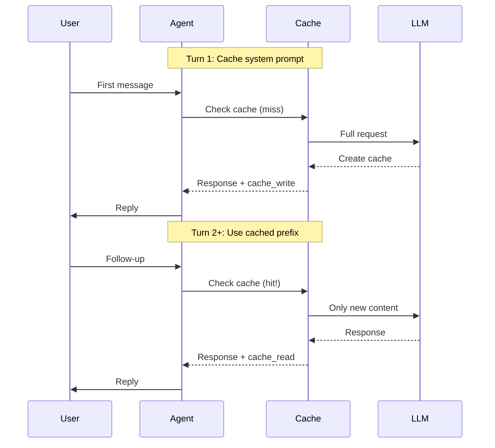

# Implementation Guide

## Introduction

This lesson brings together everything we've learned about prompt caching into practical implementation patterns. We'll build production-ready code for common use cases: conversational AI, document Q&A, agentic workflows, and batch processing. Each pattern includes cost optimization strategies and real-world considerations.

> **🔑 Key Insight:** The best caching implementation isn't the most sophisticated—it's the one that matches your request patterns and maximizes ROI.

### What We'll Cover

- Conversational agent caching
- Document Q&A optimization
- Agentic workflow patterns
- Batch processing strategies
- Cost optimization techniques
- Production deployment considerations

### Prerequisites

- [Provider Features](./02-provider-features.md)
- [Cache Management](./03-cache-management.md)

---

## Conversational Agent Caching

### The Pattern

Conversational agents benefit from caching system instructions and conversation history prefix. Each turn builds on the previous, allowing progressive cache utilization.



### Anthropic Implementation

```python
from anthropic import Anthropic
from dataclasses import dataclass, field
from typing import Optional

@dataclass
class ConversationTurn:
    role: str
    content: str

@dataclass
class ConversationContext:
    system_prompt: str
    turns: list[ConversationTurn] = field(default_factory=list)
    
    def add_turn(self, role: str, content: str):
        self.turns.append(ConversationTurn(role=role, content=content))

class CachedConversationAgent:
    """Conversational agent optimized for Anthropic caching."""
    
    def __init__(
        self,
        client: Optional[Anthropic] = None,
        model: str = "claude-sonnet-4-5",
        max_cached_turns: int = 10
    ):
        self.client = client or Anthropic()
        self.model = model
        self.max_cached_turns = max_cached_turns
        self.context: Optional[ConversationContext] = None
        
        # Metrics
        self.total_cache_reads = 0
        self.total_cache_writes = 0
    
    def start_conversation(self, system_prompt: str):
        """Initialize a new conversation with cacheable system prompt."""
        
        self.context = ConversationContext(system_prompt=system_prompt)
    
    def _build_messages(self, user_message: str) -> list[dict]:
        """Build message list with cache breakpoint at conversation prefix."""
        
        messages = []
        
        # Add previous turns (to be cached)
        for i, turn in enumerate(self.context.turns):
            is_last_cached = i == len(self.context.turns) - 1
            
            if turn.role == "user":
                content = [{"type": "text", "text": turn.content}]
                if is_last_cached:
                    # Cache breakpoint at end of history
                    content[0]["cache_control"] = {"type": "ephemeral"}
            else:
                content = turn.content
            
            messages.append({"role": turn.role, "content": content})
        
        # Add current user message (not cached)
        messages.append({"role": "user", "content": user_message})
        
        return messages
    
    def _build_system(self) -> list[dict]:
        """Build system prompt with cache control."""
        
        return [
            {
                "type": "text",
                "text": self.context.system_prompt,
                "cache_control": {"type": "ephemeral"}
            }
        ]
    
    def send_message(self, user_message: str) -> str:
        """Send a message and get a response."""
        
        if not self.context:
            raise ValueError("Call start_conversation() first")
        
        response = self.client.messages.create(
            model=self.model,
            max_tokens=2048,
            system=self._build_system(),
            messages=self._build_messages(user_message)
        )
        
        # Track cache metrics
        self.total_cache_reads += response.usage.cache_read_input_tokens
        self.total_cache_writes += response.usage.cache_creation_input_tokens
        
        assistant_response = response.content[0].text
        
        # Update conversation history
        self.context.add_turn("user", user_message)
        self.context.add_turn("assistant", assistant_response)
        
        # Trim old turns if needed
        while len(self.context.turns) > self.max_cached_turns * 2:
            self.context.turns.pop(0)
            self.context.turns.pop(0)
        
        return assistant_response
    
    def get_cache_stats(self) -> dict:
        """Get caching performance statistics."""
        
        total = self.total_cache_reads + self.total_cache_writes
        
        return {
            "cache_reads": self.total_cache_reads,
            "cache_writes": self.total_cache_writes,
            "cache_hit_rate": f"{self.total_cache_reads / total:.1%}" if total > 0 else "N/A",
            "estimated_savings": f"${(self.total_cache_reads / 1_000_000) * 2.7:.4f}"
        }

# Usage example
def demo_conversation():
    agent = CachedConversationAgent()
    
    agent.start_conversation("""You are a helpful coding assistant.
    You specialize in Python and JavaScript.
    Always provide code examples when helpful.
    Be concise but thorough.""")
    
    # Turn 1 - cache miss (creates cache)
    response1 = agent.send_message("How do I read a JSON file in Python?")
    print(f"Turn 1: {response1[:100]}...")
    
    # Turn 2 - cache hit (system + turn 1 cached)
    response2 = agent.send_message("What about writing JSON?")
    print(f"Turn 2: {response2[:100]}...")
    
    # Turn 3 - cache hit (system + turns 1-2 cached)
    response3 = agent.send_message("How would I do this in JavaScript?")
    print(f"Turn 3: {response3[:100]}...")
    
    print("\nCache Stats:", agent.get_cache_stats())

# demo_conversation()
```

### OpenAI Implementation

```python
from openai import OpenAI
from typing import Optional

class CachedConversationAgentOpenAI:
    """Conversational agent for OpenAI automatic caching."""
    
    def __init__(
        self,
        client: Optional[OpenAI] = None,
        model: str = "gpt-4o",
        cache_key: Optional[str] = None
    ):
        self.client = client or OpenAI()
        self.model = model
        self.cache_key = cache_key
        self.messages: list[dict] = []
        self.system_prompt: Optional[str] = None
        
        # Track cached tokens
        self.total_cached_tokens = 0
        self.total_prompt_tokens = 0
    
    def start_conversation(self, system_prompt: str):
        """Initialize with system prompt (will be cached automatically)."""
        
        self.system_prompt = system_prompt
        self.messages = []
    
    def send_message(self, user_message: str) -> str:
        """Send a message with automatic caching."""
        
        # Build messages with system at front (for caching)
        all_messages = [
            {"role": "system", "content": self.system_prompt}
        ] + self.messages + [
            {"role": "user", "content": user_message}
        ]
        
        # Make request
        kwargs = {
            "model": self.model,
            "messages": all_messages
        }
        
        if self.cache_key:
            kwargs["prompt_cache_key"] = self.cache_key
        
        response = self.client.chat.completions.create(**kwargs)
        
        # Track caching
        usage = response.usage
        self.total_prompt_tokens += usage.prompt_tokens
        self.total_cached_tokens += usage.prompt_tokens_details.cached_tokens
        
        assistant_response = response.choices[0].message.content
        
        # Update history
        self.messages.append({"role": "user", "content": user_message})
        self.messages.append({"role": "assistant", "content": assistant_response})
        
        return assistant_response
    
    def get_cache_stats(self) -> dict:
        return {
            "prompt_tokens": self.total_prompt_tokens,
            "cached_tokens": self.total_cached_tokens,
            "cache_rate": f"{self.total_cached_tokens / self.total_prompt_tokens:.1%}" 
                         if self.total_prompt_tokens > 0 else "N/A"
        }
```

---

## Document Q&A Caching

### The Pattern

Cache large documents once, then answer many questions against them. This pattern achieves the highest ROI when documents are queried multiple times.

### Multi-Document Q&A System

```python
from anthropic import Anthropic
from dataclasses import dataclass
from typing import Optional
import hashlib

@dataclass
class Document:
    id: str
    title: str
    content: str
    token_count: int = 0
    
    def content_hash(self) -> str:
        return hashlib.sha256(self.content.encode()).hexdigest()[:16]

class CachedDocumentQA:
    """Document Q&A system with efficient caching."""
    
    def __init__(
        self,
        client: Optional[Anthropic] = None,
        model: str = "claude-sonnet-4-5"
    ):
        self.client = client or Anthropic()
        self.model = model
        self.documents: dict[str, Document] = {}
        self.active_document_id: Optional[str] = None
        
        # Track per-document metrics
        self.document_queries: dict[str, int] = {}
        self.document_cache_hits: dict[str, int] = {}
    
    def add_document(self, doc_id: str, title: str, content: str):
        """Add a document to the system."""
        
        self.documents[doc_id] = Document(
            id=doc_id,
            title=title,
            content=content
        )
        self.document_queries[doc_id] = 0
        self.document_cache_hits[doc_id] = 0
    
    def set_active_document(self, doc_id: str):
        """Set the active document for queries."""
        
        if doc_id not in self.documents:
            raise ValueError(f"Document '{doc_id}' not found")
        self.active_document_id = doc_id
    
    def _build_request(self, question: str) -> dict:
        """Build cache-optimized request."""
        
        doc = self.documents[self.active_document_id]
        
        return {
            "model": self.model,
            "max_tokens": 2048,
            "system": [
                {
                    "type": "text",
                    "text": """You are a document analysis assistant.
Answer questions based ONLY on the provided document.
If the answer isn't in the document, say "I cannot find this information in the document."
Always cite relevant sections with quotes when possible."""
                },
                {
                    "type": "text",
                    "text": f"""DOCUMENT: {doc.title}

{doc.content}""",
                    "cache_control": {"type": "ephemeral"}
                }
            ],
            "messages": [
                {"role": "user", "content": question}
            ]
        }
    
    def ask(self, question: str) -> dict:
        """Ask a question about the active document."""
        
        if not self.active_document_id:
            raise ValueError("No active document. Call set_active_document() first.")
        
        request = self._build_request(question)
        response = self.client.messages.create(**request)
        
        # Track metrics
        doc_id = self.active_document_id
        self.document_queries[doc_id] += 1
        
        cache_read = response.usage.cache_read_input_tokens
        if cache_read > 0:
            self.document_cache_hits[doc_id] += 1
        
        return {
            "answer": response.content[0].text,
            "cache_hit": cache_read > 0,
            "cache_read_tokens": cache_read,
            "cache_write_tokens": response.usage.cache_creation_input_tokens
        }
    
    def batch_questions(
        self,
        questions: list[str],
        doc_id: Optional[str] = None
    ) -> list[dict]:
        """Answer multiple questions about a document efficiently."""
        
        if doc_id:
            self.set_active_document(doc_id)
        
        results = []
        for question in questions:
            result = self.ask(question)
            results.append({
                "question": question,
                **result
            })
        
        return results
    
    def get_document_stats(self, doc_id: str) -> dict:
        """Get caching statistics for a document."""
        
        queries = self.document_queries.get(doc_id, 0)
        hits = self.document_cache_hits.get(doc_id, 0)
        
        return {
            "document_id": doc_id,
            "total_queries": queries,
            "cache_hits": hits,
            "hit_rate": f"{hits / queries:.1%}" if queries > 0 else "N/A"
        }

# Usage
def demo_document_qa():
    qa = CachedDocumentQA()
    
    # Add a large document
    qa.add_document(
        doc_id="annual-report-2024",
        title="ACME Corp Annual Report 2024",
        content="""
        [Imagine 50,000+ characters of annual report content here]
        
        Executive Summary:
        - Revenue: $50M (up 25%)
        - Employees: 350 (up from 200)
        - New products: 3
        
        Financial Details:
        Q1: $10M | Q2: $12M | Q3: $13M | Q4: $15M
        
        Key Achievements:
        - Expanded to 5 new markets
        - Customer satisfaction: 94%
        - Won "Best Startup 2024" award
        """
    )
    
    qa.set_active_document("annual-report-2024")
    
    # Ask multiple questions (first creates cache, rest hit cache)
    questions = [
        "What was the total revenue?",
        "How many employees does the company have?",
        "What was Q4 revenue?",
        "What awards did the company win?"
    ]
    
    results = qa.batch_questions(questions)
    
    for result in results:
        print(f"Q: {result['question']}")
        print(f"A: {result['answer'][:100]}...")
        print(f"Cache: {'HIT' if result['cache_hit'] else 'MISS'}")
        print()
    
    print("Stats:", qa.get_document_stats("annual-report-2024"))

# demo_document_qa()
```

---

## Agentic Workflow Caching

### The Pattern

AI agents with tools benefit from caching tool definitions and system instructions. Tools rarely change mid-session, making them ideal cache candidates.

```python
from anthropic import Anthropic
from dataclasses import dataclass
from typing import Any, Callable, Optional
import json

@dataclass
class Tool:
    name: str
    description: str
    input_schema: dict
    handler: Callable[[dict], Any]

class CachedAgentWorkflow:
    """Agent with cached tools and instructions."""
    
    def __init__(
        self,
        client: Optional[Anthropic] = None,
        model: str = "claude-sonnet-4-5"
    ):
        self.client = client or Anthropic()
        self.model = model
        self.tools: list[Tool] = []
        self.system_instruction: str = ""
        self.conversation_history: list[dict] = []
    
    def configure(
        self,
        system_instruction: str,
        tools: list[Tool]
    ):
        """Configure agent with instruction and tools."""
        
        self.system_instruction = system_instruction
        self.tools = tools
        self.conversation_history = []
    
    def _get_tool_definitions(self) -> list[dict]:
        """Get tool definitions for API."""
        
        return [
            {
                "name": tool.name,
                "description": tool.description,
                "input_schema": tool.input_schema
            }
            for tool in self.tools
        ]
    
    def _build_system(self) -> list[dict]:
        """Build system with cache on tools + instructions."""
        
        # Tools are cached first in Anthropic's hierarchy
        # System instruction cached second
        return [
            {
                "type": "text",
                "text": self.system_instruction,
                "cache_control": {"type": "ephemeral", "ttl": "1h"}
            }
        ]
    
    def _execute_tool(self, name: str, input_data: dict) -> str:
        """Execute a tool and return result."""
        
        for tool in self.tools:
            if tool.name == name:
                try:
                    result = tool.handler(input_data)
                    return json.dumps(result) if not isinstance(result, str) else result
                except Exception as e:
                    return f"Error executing {name}: {str(e)}"
        
        return f"Tool '{name}' not found"
    
    def _process_response(self, response) -> tuple[str, bool]:
        """Process response, executing tools if needed."""
        
        # Check if tool use is requested
        tool_uses = [
            block for block in response.content 
            if block.type == "tool_use"
        ]
        
        if not tool_uses:
            # No tools, return text response
            text_blocks = [
                block.text for block in response.content 
                if block.type == "text"
            ]
            return " ".join(text_blocks), True
        
        # Execute tools and continue
        tool_results = []
        for tool_use in tool_uses:
            result = self._execute_tool(tool_use.name, tool_use.input)
            tool_results.append({
                "type": "tool_result",
                "tool_use_id": tool_use.id,
                "content": result
            })
        
        # Add assistant response and tool results to history
        self.conversation_history.append({
            "role": "assistant",
            "content": response.content
        })
        self.conversation_history.append({
            "role": "user",
            "content": tool_results
        })
        
        return None, False  # Need to continue
    
    def run(self, user_input: str, max_iterations: int = 10) -> str:
        """Run agent with user input."""
        
        # Add user message
        self.conversation_history.append({
            "role": "user",
            "content": user_input
        })
        
        for _ in range(max_iterations):
            response = self.client.messages.create(
                model=self.model,
                max_tokens=4096,
                system=self._build_system(),
                tools=self._get_tool_definitions(),
                messages=self.conversation_history
            )
            
            result, is_complete = self._process_response(response)
            
            if is_complete:
                # Add final response to history
                self.conversation_history.append({
                    "role": "assistant",
                    "content": result
                })
                return result
        
        return "Max iterations reached without completion"

# Example tools
def create_sample_tools() -> list[Tool]:
    """Create sample tools for demonstration."""
    
    def search_docs(params: dict) -> dict:
        query = params.get("query", "")
        return {
            "results": [
                {"title": f"Result for '{query}'", "snippet": "Sample content..."}
            ]
        }
    
    def calculate(params: dict) -> dict:
        expression = params.get("expression", "0")
        try:
            result = eval(expression)  # In production, use safe eval
            return {"result": result}
        except:
            return {"error": "Invalid expression"}
    
    return [
        Tool(
            name="search_documentation",
            description="Search internal documentation for information",
            input_schema={
                "type": "object",
                "properties": {
                    "query": {"type": "string", "description": "Search query"}
                },
                "required": ["query"]
            },
            handler=search_docs
        ),
        Tool(
            name="calculate",
            description="Perform mathematical calculations",
            input_schema={
                "type": "object",
                "properties": {
                    "expression": {"type": "string", "description": "Math expression"}
                },
                "required": ["expression"]
            },
            handler=calculate
        )
    ]

# Usage
def demo_agent():
    agent = CachedAgentWorkflow()
    
    agent.configure(
        system_instruction="""You are a helpful assistant with access to tools.
        Use the search tool to find documentation.
        Use the calculator for any math operations.
        Always explain your reasoning.""",
        tools=create_sample_tools()
    )
    
    # Tools + system will be cached after first request
    result1 = agent.run("What is 25 * 4?")
    print(f"Result 1: {result1}")
    
    # Second request hits cache for tools + system
    result2 = agent.run("Search for information about caching")
    print(f"Result 2: {result2}")

# demo_agent()
```

---

## Batch Processing Strategies

### Pattern: Batch Similar Requests

```python
from anthropic import Anthropic
from dataclasses import dataclass
from concurrent.futures import ThreadPoolExecutor, as_completed
from typing import Optional
import time

@dataclass
class BatchRequest:
    id: str
    content: str

@dataclass
class BatchResult:
    id: str
    response: str
    cache_hit: bool
    latency_ms: float

class CachedBatchProcessor:
    """Process batches with cache optimization."""
    
    def __init__(
        self,
        client: Optional[Anthropic] = None,
        model: str = "claude-sonnet-4-5"
    ):
        self.client = client or Anthropic()
        self.model = model
    
    def process_batch(
        self,
        requests: list[BatchRequest],
        system_prompt: str,
        static_context: str = "",
        max_workers: int = 5
    ) -> list[BatchResult]:
        """Process a batch of requests with shared cached context."""
        
        # Sort by content similarity for better cache utilization
        # In production, use embeddings for smarter grouping
        sorted_requests = sorted(requests, key=lambda r: r.content[:50])
        
        results = []
        
        # Process sequentially to maximize cache hits
        # First request creates cache, rest hit it
        for i, request in enumerate(sorted_requests):
            start_time = time.time()
            
            response = self.client.messages.create(
                model=self.model,
                max_tokens=1024,
                system=[
                    {"type": "text", "text": system_prompt},
                    {
                        "type": "text",
                        "text": static_context,
                        "cache_control": {"type": "ephemeral"}
                    }
                ] if static_context else [
                    {
                        "type": "text",
                        "text": system_prompt,
                        "cache_control": {"type": "ephemeral"}
                    }
                ],
                messages=[
                    {"role": "user", "content": request.content}
                ]
            )
            
            latency_ms = (time.time() - start_time) * 1000
            
            results.append(BatchResult(
                id=request.id,
                response=response.content[0].text,
                cache_hit=response.usage.cache_read_input_tokens > 0,
                latency_ms=latency_ms
            ))
        
        return results
    
    def process_batch_parallel(
        self,
        requests: list[BatchRequest],
        system_prompt: str,
        prime_cache_first: bool = True,
        max_workers: int = 5
    ) -> list[BatchResult]:
        """Process batch in parallel after priming cache."""
        
        results = []
        
        if prime_cache_first and requests:
            # Process first request to create cache
            first_result = self.process_batch(
                requests[:1],
                system_prompt
            )[0]
            results.append(first_result)
            
            # Small delay to ensure cache is ready
            time.sleep(0.1)
            
            # Process rest in parallel
            remaining = requests[1:]
        else:
            remaining = requests
        
        def process_single(request: BatchRequest) -> BatchResult:
            start_time = time.time()
            
            response = self.client.messages.create(
                model=self.model,
                max_tokens=1024,
                system=[
                    {
                        "type": "text",
                        "text": system_prompt,
                        "cache_control": {"type": "ephemeral"}
                    }
                ],
                messages=[
                    {"role": "user", "content": request.content}
                ]
            )
            
            latency_ms = (time.time() - start_time) * 1000
            
            return BatchResult(
                id=request.id,
                response=response.content[0].text,
                cache_hit=response.usage.cache_read_input_tokens > 0,
                latency_ms=latency_ms
            )
        
        with ThreadPoolExecutor(max_workers=max_workers) as executor:
            futures = {
                executor.submit(process_single, req): req 
                for req in remaining
            }
            
            for future in as_completed(futures):
                results.append(future.result())
        
        return results

# Usage
def demo_batch():
    processor = CachedBatchProcessor()
    
    # Large shared context
    product_catalog = """
    [Imagine a 50,000 token product catalog here]
    
    Product Categories:
    - Electronics: TVs, Phones, Laptops
    - Home: Furniture, Appliances
    - Clothing: Men's, Women's, Kids
    """
    
    # Many similar questions
    questions = [
        BatchRequest("q1", "What TVs do you have?"),
        BatchRequest("q2", "Show me laptops under $1000"),
        BatchRequest("q3", "What furniture is available?"),
        BatchRequest("q4", "Do you have kids clothing?"),
        BatchRequest("q5", "What phone brands do you carry?"),
    ]
    
    results = processor.process_batch(
        requests=questions,
        system_prompt="You are a helpful product assistant.",
        static_context=product_catalog
    )
    
    print(f"Processed {len(results)} requests")
    print(f"Cache hits: {sum(1 for r in results if r.cache_hit)}")
    print(f"Avg latency: {sum(r.latency_ms for r in results) / len(results):.1f}ms")

# demo_batch()
```

---

## Cost Optimization Techniques

### Breakeven Analysis

```python
from dataclasses import dataclass
from typing import Literal

@dataclass
class CacheBreakevenAnalysis:
    """Calculate when caching becomes cost-effective."""
    
    provider: Literal["openai", "anthropic", "gemini"]
    cacheable_tokens: int
    base_price_per_mtok: float
    
    # Provider-specific pricing
    PRICING = {
        "openai": {
            "write_premium": 0.0,      # Free writes
            "read_discount": 0.5,      # 50% off
        },
        "anthropic_5m": {
            "write_premium": 0.25,     # 25% premium
            "read_discount": 0.9,      # 90% off
        },
        "anthropic_1h": {
            "write_premium": 1.0,      # 100% premium
            "read_discount": 0.9,      # 90% off
        },
        "gemini": {
            "write_premium": 0.0,      # Varies
            "read_discount": 0.75,     # ~75% off
        }
    }
    
    def calculate_breakeven(
        self,
        ttl: str = "5m"
    ) -> dict:
        """Calculate number of requests needed to break even."""
        
        pricing_key = f"{self.provider}_{ttl}" if self.provider == "anthropic" else self.provider
        pricing = self.PRICING.get(pricing_key, self.PRICING[self.provider])
        
        write_premium = pricing["write_premium"]
        read_discount = pricing["read_discount"]
        
        # Cost of write = base_cost * (1 + write_premium)
        # Savings per read = base_cost * read_discount
        # Breakeven: write_cost = (n-1) * savings_per_read
        # n = 1 + (write_premium / read_discount) + 1
        
        if read_discount == 0:
            return {"breakeven_requests": float('inf'), "note": "No read discount"}
        
        breakeven = 1 + (write_premium / read_discount)
        
        # Calculate costs
        base_cost = (self.cacheable_tokens / 1_000_000) * self.base_price_per_mtok
        write_cost = base_cost * (1 + write_premium)
        read_cost = base_cost * (1 - read_discount)
        savings_per_read = base_cost - read_cost
        
        return {
            "breakeven_requests": int(breakeven) + 1,
            "write_cost": f"${write_cost:.4f}",
            "read_cost": f"${read_cost:.4f}",
            "savings_per_read": f"${savings_per_read:.4f}",
            "roi_at_10_reads": f"{((10 * savings_per_read - write_cost) / write_cost * 100):.1f}%"
        }

# Usage
def analyze_caching_roi():
    analyses = [
        CacheBreakevenAnalysis("openai", 10000, 5.0),
        CacheBreakevenAnalysis("anthropic", 10000, 3.0),
        CacheBreakevenAnalysis("anthropic", 10000, 3.0),
    ]
    
    print("OpenAI (10K tokens at $5/MTok):")
    print(analyses[0].calculate_breakeven())
    
    print("\nAnthropic 5m (10K tokens at $3/MTok):")
    print(analyses[1].calculate_breakeven("5m"))
    
    print("\nAnthropic 1h (10K tokens at $3/MTok):")
    print(analyses[2].calculate_breakeven("1h"))

# analyze_caching_roi()
```

### Optimization Checklist

```python
def generate_optimization_checklist(
    current_hit_rate: float,
    avg_cacheable_tokens: int,
    requests_per_5min: int
) -> list[str]:
    """Generate actionable optimization recommendations."""
    
    recommendations = []
    
    # Hit rate optimization
    if current_hit_rate < 0.5:
        recommendations.append("❌ LOW HIT RATE: Restructure prompts to put static content first")
        recommendations.append("   → Move system instructions to beginning")
        recommendations.append("   → Group related requests together")
    elif current_hit_rate < 0.8:
        recommendations.append("⚠️ MODERATE HIT RATE: Consider these improvements:")
        recommendations.append("   → Check for subtle content variations")
        recommendations.append("   → Verify cache_control placement")
    else:
        recommendations.append("✅ GOOD HIT RATE: Cache optimization working well")
    
    # Token threshold check
    if avg_cacheable_tokens < 1024:
        recommendations.append("❌ TOKENS TOO LOW: Need ≥1024 tokens to cache")
        recommendations.append("   → Combine multiple documents")
        recommendations.append("   → Add more context to system prompt")
    elif avg_cacheable_tokens < 4096:
        recommendations.append("⚠️ CHECK MODEL REQUIREMENTS: Some models need 4096+ tokens")
    
    # Request frequency
    if requests_per_5min < 2:
        recommendations.append("⚠️ LOW FREQUENCY: Cache may expire between requests")
        recommendations.append("   → Consider Anthropic 1h TTL")
        recommendations.append("   → Use Gemini explicit caching")
        recommendations.append("   → Implement keep-alive pattern")
    elif requests_per_5min > 100:
        recommendations.append("✅ HIGH FREQUENCY: Great cache utilization opportunity")
    
    return recommendations

# Usage
checklist = generate_optimization_checklist(
    current_hit_rate=0.65,
    avg_cacheable_tokens=5000,
    requests_per_5min=10
)

for item in checklist:
    print(item)
```

---

## Production Deployment

### Deployment Checklist

| Category | Check | Priority |
|----------|-------|----------|
| **Monitoring** | Cache hit rate alerts configured | Critical |
| **Monitoring** | Cost tracking per feature | High |
| **Monitoring** | Latency percentiles logged | High |
| **Reliability** | Fallback for cache failures | Critical |
| **Reliability** | Rate limiting implemented | High |
| **Security** | Sensitive data not cached | Critical |
| **Performance** | Warm-up requests on deploy | Medium |
| **Performance** | Request batching where possible | Medium |

### Production-Ready Wrapper

```python
from anthropic import Anthropic
from dataclasses import dataclass, field
from typing import Optional, Callable
from datetime import datetime
import logging
import time

@dataclass
class CacheConfig:
    """Configuration for production caching."""
    
    ttl: str = "5m"
    min_cache_tokens: int = 1024
    enable_keep_alive: bool = False
    keep_alive_interval_sec: int = 240
    fallback_on_error: bool = True
    log_all_requests: bool = True
    hit_rate_alert_threshold: float = 0.5
    alert_callback: Optional[Callable[[str, dict], None]] = None

class ProductionCacheWrapper:
    """Production-ready caching wrapper with monitoring."""
    
    def __init__(
        self,
        client: Optional[Anthropic] = None,
        config: Optional[CacheConfig] = None
    ):
        self.client = client or Anthropic()
        self.config = config or CacheConfig()
        self.logger = logging.getLogger("cache_wrapper")
        
        # Metrics
        self.request_count = 0
        self.cache_hits = 0
        self.cache_misses = 0
        self.errors = 0
        self.start_time = datetime.now()
    
    def _log_request(
        self,
        request_id: str,
        cache_read: int,
        cache_write: int,
        latency_ms: float,
        error: Optional[str] = None
    ):
        """Log request with structured data."""
        
        if not self.config.log_all_requests:
            return
        
        log_data = {
            "request_id": request_id,
            "cache_read_tokens": cache_read,
            "cache_write_tokens": cache_write,
            "cache_hit": cache_read > 0,
            "latency_ms": round(latency_ms, 1),
            "error": error
        }
        
        if error:
            self.logger.error(f"Cache request failed: {log_data}")
        else:
            self.logger.info(f"Cache request: {log_data}")
    
    def _check_alerts(self):
        """Check if any alerts should fire."""
        
        if self.request_count < 10:
            return
        
        hit_rate = self.cache_hits / self.request_count
        
        if hit_rate < self.config.hit_rate_alert_threshold:
            if self.config.alert_callback:
                self.config.alert_callback(
                    "low_cache_hit_rate",
                    {
                        "current_rate": hit_rate,
                        "threshold": self.config.hit_rate_alert_threshold,
                        "request_count": self.request_count
                    }
                )
    
    def create_message(
        self,
        system: list[dict],
        messages: list[dict],
        model: str = "claude-sonnet-4-5",
        max_tokens: int = 2048,
        request_id: Optional[str] = None,
        **kwargs
    ):
        """Create message with caching, monitoring, and fallback."""
        
        request_id = request_id or f"req_{int(time.time() * 1000)}"
        start_time = time.time()
        
        try:
            response = self.client.messages.create(
                model=model,
                max_tokens=max_tokens,
                system=system,
                messages=messages,
                **kwargs
            )
            
            latency_ms = (time.time() - start_time) * 1000
            
            # Update metrics
            self.request_count += 1
            cache_read = response.usage.cache_read_input_tokens
            cache_write = response.usage.cache_creation_input_tokens
            
            if cache_read > 0:
                self.cache_hits += 1
            else:
                self.cache_misses += 1
            
            # Log and check alerts
            self._log_request(request_id, cache_read, cache_write, latency_ms)
            self._check_alerts()
            
            return response
            
        except Exception as e:
            self.errors += 1
            latency_ms = (time.time() - start_time) * 1000
            
            self._log_request(request_id, 0, 0, latency_ms, str(e))
            
            if self.config.fallback_on_error:
                # Retry without cache control
                stripped_system = [
                    {k: v for k, v in block.items() if k != "cache_control"}
                    for block in system
                ]
                return self.client.messages.create(
                    model=model,
                    max_tokens=max_tokens,
                    system=stripped_system,
                    messages=messages,
                    **kwargs
                )
            
            raise
    
    def get_metrics(self) -> dict:
        """Get current metrics summary."""
        
        uptime = datetime.now() - self.start_time
        
        return {
            "uptime": str(uptime),
            "total_requests": self.request_count,
            "cache_hits": self.cache_hits,
            "cache_misses": self.cache_misses,
            "errors": self.errors,
            "hit_rate": f"{self.cache_hits / self.request_count:.1%}" 
                       if self.request_count > 0 else "N/A",
            "error_rate": f"{self.errors / self.request_count:.1%}"
                         if self.request_count > 0 else "N/A"
        }
```

---

## Hands-on Exercise

### Your Task

Build a complete caching solution for a customer support bot with:
1. Cached system instructions and FAQ document
2. Conversation history caching
3. Cost tracking
4. Monitoring dashboard

<details>
<summary>✅ Solution (click to expand)</summary>

```python
from anthropic import Anthropic
from dataclasses import dataclass, field
from datetime import datetime
from typing import Optional

@dataclass
class SupportMetrics:
    conversations: int = 0
    total_turns: int = 0
    cache_reads: int = 0
    cache_writes: int = 0
    cost_usd: float = 0.0

class CustomerSupportBot:
    """Production-ready customer support bot with caching."""
    
    FAQ_DOCUMENT = """
    FREQUENTLY ASKED QUESTIONS
    
    Q: What are your business hours?
    A: We're open Monday-Friday, 9 AM - 6 PM EST.
    
    Q: How do I reset my password?
    A: Click "Forgot Password" on the login page and follow the instructions.
    
    Q: What is your return policy?
    A: We accept returns within 30 days of purchase with receipt.
    
    Q: How do I contact support?
    A: Email support@example.com or call 1-800-SUPPORT.
    
    [... imagine 10,000+ more tokens of FAQ content ...]
    """
    
    SYSTEM_INSTRUCTION = """You are a helpful customer support agent for ACME Corp.
    
    Guidelines:
    - Be friendly and professional
    - Use the FAQ document to answer common questions
    - If you can't answer, escalate to a human agent
    - Always confirm the customer's issue is resolved before ending
    """
    
    def __init__(self, client: Optional[Anthropic] = None):
        self.client = client or Anthropic()
        self.metrics = SupportMetrics()
        self.active_conversations: dict[str, list] = {}
    
    def _build_system(self) -> list[dict]:
        return [
            {"type": "text", "text": self.SYSTEM_INSTRUCTION},
            {
                "type": "text",
                "text": self.FAQ_DOCUMENT,
                "cache_control": {"type": "ephemeral", "ttl": "1h"}
            }
        ]
    
    def _build_messages(
        self,
        conversation_id: str,
        new_message: str
    ) -> list[dict]:
        history = self.active_conversations.get(conversation_id, [])
        
        messages = []
        for i, turn in enumerate(history):
            msg = {"role": turn["role"], "content": turn["content"]}
            # Cache last turn of history
            if i == len(history) - 1 and turn["role"] == "user":
                msg["content"] = [
                    {
                        "type": "text",
                        "text": turn["content"],
                        "cache_control": {"type": "ephemeral"}
                    }
                ]
            messages.append(msg)
        
        messages.append({"role": "user", "content": new_message})
        return messages
    
    def start_conversation(self, conversation_id: str):
        """Start a new support conversation."""
        
        self.active_conversations[conversation_id] = []
        self.metrics.conversations += 1
    
    def send_message(
        self,
        conversation_id: str,
        message: str
    ) -> str:
        """Send a message and get response."""
        
        if conversation_id not in self.active_conversations:
            self.start_conversation(conversation_id)
        
        response = self.client.messages.create(
            model="claude-sonnet-4-5",
            max_tokens=1024,
            system=self._build_system(),
            messages=self._build_messages(conversation_id, message)
        )
        
        # Track metrics
        self.metrics.total_turns += 1
        self.metrics.cache_reads += response.usage.cache_read_input_tokens
        self.metrics.cache_writes += response.usage.cache_creation_input_tokens
        
        # Calculate cost
        read_cost = (response.usage.cache_read_input_tokens / 1_000_000) * 0.30
        write_cost = (response.usage.cache_creation_input_tokens / 1_000_000) * 6.0
        uncached_cost = (response.usage.input_tokens / 1_000_000) * 3.0
        output_cost = (response.usage.output_tokens / 1_000_000) * 15.0
        self.metrics.cost_usd += read_cost + write_cost + uncached_cost + output_cost
        
        # Update history
        assistant_response = response.content[0].text
        self.active_conversations[conversation_id].append({
            "role": "user",
            "content": message
        })
        self.active_conversations[conversation_id].append({
            "role": "assistant",
            "content": assistant_response
        })
        
        return assistant_response
    
    def end_conversation(self, conversation_id: str):
        """End a conversation."""
        
        if conversation_id in self.active_conversations:
            del self.active_conversations[conversation_id]
    
    def get_dashboard(self) -> dict:
        """Get monitoring dashboard."""
        
        total_tokens = self.metrics.cache_reads + self.metrics.cache_writes
        
        return {
            "📊 Conversations": {
                "total": self.metrics.conversations,
                "active": len(self.active_conversations),
                "total_turns": self.metrics.total_turns
            },
            "⚡ Cache Performance": {
                "read_tokens": f"{self.metrics.cache_reads:,}",
                "write_tokens": f"{self.metrics.cache_writes:,}",
                "hit_rate": f"{self.metrics.cache_reads / total_tokens:.1%}" 
                           if total_tokens > 0 else "N/A"
            },
            "💰 Cost": {
                "total_usd": f"${self.metrics.cost_usd:.4f}",
                "per_conversation": f"${self.metrics.cost_usd / self.metrics.conversations:.4f}"
                                   if self.metrics.conversations > 0 else "N/A"
            }
        }

# Demo
def demo_support_bot():
    bot = CustomerSupportBot()
    
    # Conversation 1
    bot.start_conversation("conv1")
    r1 = bot.send_message("conv1", "What are your hours?")
    print(f"Bot: {r1}")
    r2 = bot.send_message("conv1", "How do I reset my password?")
    print(f"Bot: {r2}")
    
    # Conversation 2 (reuses FAQ cache from conv1)
    bot.start_conversation("conv2")
    r3 = bot.send_message("conv2", "What's your return policy?")
    print(f"Bot: {r3}")
    
    # Print dashboard
    print("\n" + "="*50)
    dashboard = bot.get_dashboard()
    for section, metrics in dashboard.items():
        print(f"\n{section}")
        for key, value in metrics.items():
            print(f"  {key}: {value}")

# demo_support_bot()
```

</details>

---

## Summary

✅ **Conversational agents:** Cache system + history prefix, trim old turns
✅ **Document Q&A:** Cache documents, batch questions, track per-doc metrics
✅ **Agentic workflows:** Cache tools + instructions with longer TTL
✅ **Batch processing:** Prime cache first, then parallelize
✅ **Cost optimization:** Use breakeven analysis to justify caching
✅ **Production:** Monitor hit rates, implement fallbacks, log everything

**Previous:** [Cache Management](./03-cache-management.md) | **Back to:** [Prompt Caching Overview](./00-prompt-caching-overview.md)

---

## Further Reading

- [OpenAI Prompt Caching Best Practices](https://platform.openai.com/docs/guides/prompt-caching)
- [Anthropic Prompt Caching Guide](https://docs.anthropic.com/en/docs/build-with-claude/prompt-caching)
- [Gemini Context Caching](https://ai.google.dev/gemini-api/docs/caching)

---

<!-- 
Sources Consulted:
- OpenAI: Automatic caching, prompt_cache_key, extended retention
- Anthropic: cache_control breakpoints, TTL options, hierarchy, pricing
- Gemini: Explicit caching with TTL, cache management operations
- Production patterns: monitoring, fallbacks, cost optimization
-->
