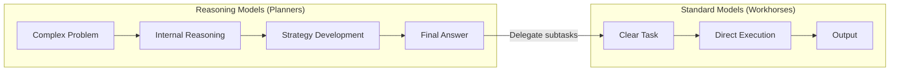
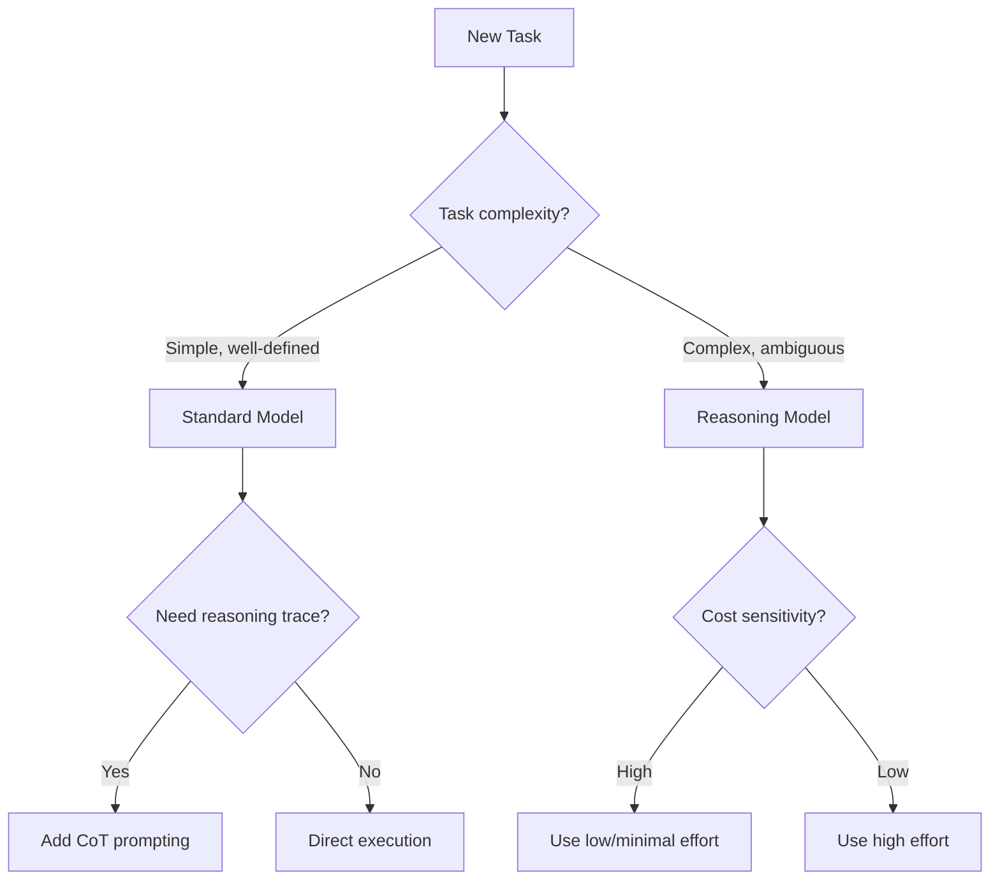

# Prompting Reasoning Models

## Introduction

Reasoning models represent a fundamental shift in how we interact with LLMs. Unlike standard models that respond immediately, reasoning models "think before they answer"—generating internal chains of thought before producing a final response. This makes them exceptionally powerful for complex tasks but requires a different prompting approach.

> **🔑 Key Insight:** Prompting a reasoning model is like delegating to a senior colleague—give them the goal and context, then let them determine the approach. Over-specifying the steps can actually hurt performance.

### What We'll Cover

- Understanding how reasoning models differ from standard models
- When to use reasoning vs standard models
- Provider-specific reasoning implementations
- Prompting best practices for reasoning models
- Configuring reasoning effort and budgets

### Prerequisites

- [Fundamentals of Effective Prompts](../01-fundamentals-of-effective-prompts/)
- [Chain-of-Thought Prompting](../07-chain-of-thought-prompting/)
- API access to at least one provider's reasoning model

---

## The Mental Model: Planners vs Workhorses

Understanding the role distinction between model types is crucial for effective usage:



| Aspect | Reasoning Models | Standard Models |
|--------|------------------|-----------------|
| **Analogy** | Senior coworker | Junior coworker |
| **Strength** | Strategy, planning, complex decisions | Execution, speed, clear tasks |
| **Prompting style** | High-level goals | Explicit instructions |
| **Latency** | Higher (thinking time) | Lower |
| **Cost** | Higher (reasoning tokens) | Lower |
| **Best for** | Ambiguity, multi-step problems | Defined, repeatable tasks |

---

## How Reasoning Models Work

### The Reasoning Token Concept

Reasoning models generate **reasoning tokens** before producing visible output. These tokens represent the model's internal thought process:

```
┌─────────────────────────────────────────────────────┐
│                   Context Window                     │
├─────────────────────────────────────────────────────┤
│  Input Tokens  │  Reasoning Tokens  │ Output Tokens │
│  (your prompt) │  (internal, billed)│ (visible)     │
└─────────────────────────────────────────────────────┘
```

> **⚠️ Important:** Reasoning tokens are billed as output tokens even though you don't see them directly. This significantly impacts cost.

### Token Flow Example

```python
# Typical usage breakdown for a complex reasoning task
{
    "usage": {
        "input_tokens": 150,
        "output_tokens": 1500,
        "output_tokens_details": {
            "reasoning_tokens": 1200,  # Internal thinking (not visible)
            "text_tokens": 300         # Visible response
        }
    }
}
```

---

## Provider Landscape

### Current Reasoning Models (January 2026)

| Provider | Models | Control Mechanism | Key Feature |
|----------|--------|-------------------|-------------|
| **OpenAI** | GPT-5, GPT-5-mini, GPT-5-nano, o3, o4-mini | `reasoning.effort` | Automatic reasoning, summaries |
| **Anthropic** | Claude Opus 4.5, Opus 4.1, Opus 4, Sonnet 4.5, Sonnet 4, Haiku 4.5 | `thinking.budget_tokens` | Extended thinking, interleaved thinking |
| **Google** | Gemini 3 Pro/Flash, Gemini 2.5 Pro/Flash | `thinking_level` / `thinking_budget` | Thought summaries, dynamic thinking |

### Quick Comparison

```python
# OpenAI - Reasoning effort control
from openai import OpenAI
client = OpenAI()

response = client.responses.create(
    model="gpt-5",
    reasoning={"effort": "medium"},  # low, medium, high
    input=[{"role": "user", "content": prompt}]
)

# Anthropic - Extended thinking with budget
from anthropic import Anthropic
client = Anthropic()

response = client.messages.create(
    model="claude-sonnet-4-5",
    max_tokens=16000,
    thinking={
        "type": "enabled",
        "budget_tokens": 10000
    },
    messages=[{"role": "user", "content": prompt}]
)

# Gemini - Thinking level
from google import genai
from google.genai import types

client = genai.Client()

response = client.models.generate_content(
    model="gemini-3-flash-preview",
    contents=prompt,
    config=types.GenerateContentConfig(
        thinking_config=types.ThinkingConfig(thinking_level="high")
    )
)
```

---

## The Fundamental Prompting Shift

### ❌ Standard Model Approach (Don't Do This)

```python
# Over-specified prompt for reasoning model
prompt = """
Analyze this code for bugs. Follow these steps:
1. First, read through each function
2. Then, identify any syntax errors
3. Next, check for logic errors
4. After that, look for edge cases
5. Finally, summarize your findings

Think step by step and explain your reasoning.
"""
```

### ✅ Reasoning Model Approach (Do This)

```python
# Goal-oriented prompt for reasoning model
prompt = """
Review this code and identify all bugs that could cause issues in production.

Code:
[code here]

Provide a prioritized list of issues with recommended fixes.
"""
```

> **💡 Tip:** "Think step by step" is unnecessary and can even hurt reasoning model performance—they already do this internally.

---

## Key Differences Summary

| Feature | Standard Models | Reasoning Models |
|---------|-----------------|------------------|
| Internal reasoning | Minimal | Extensive |
| Chain-of-thought prompts | Helpful | Unnecessary/harmful |
| Step-by-step instructions | Required | Counterproductive |
| Ambiguity handling | Poor | Excellent |
| Complex planning | Limited | Strong |
| Latency | Fast | Slower |
| Token cost | Lower | Higher |
| Developer message | `system` role | `developer` role (OpenAI) |
| Markdown in response | Default on | Must enable with `Formatting re-enabled` |

---

## Lesson Structure

This lesson is organized into the following sub-lessons:

| Lesson | Topic | Description |
|--------|-------|-------------|
| [01](./01-when-to-use-reasoning-models.md) | When to Use Reasoning Models | Use cases, decision framework, hybrid architectures |
| [02](./02-provider-comparison.md) | Provider Comparison | OpenAI, Anthropic, Gemini detailed implementations |
| [03](./03-prompting-best-practices.md) | Prompting Best Practices | Techniques, examples, anti-patterns |
| [04](./04-reasoning-configuration.md) | Reasoning Configuration | Effort control, budgets, summaries, context management |

---

## Quick Start

### Choosing the Right Approach



### Minimal Example

```python
from openai import OpenAI

client = OpenAI()

# Simple task - use standard model
simple_response = client.chat.completions.create(
    model="gpt-4o",
    messages=[{"role": "user", "content": "Translate 'hello' to Spanish"}]
)

# Complex task - use reasoning model
complex_response = client.responses.create(
    model="gpt-5",
    reasoning={"effort": "high"},
    input=[{
        "role": "user",
        "content": """
        A company's revenue grew 15% in Q1, but costs grew 22%.
        Operating margin was 18% last year.
        Should they expand to a new market that requires 
        $2M upfront but projects 25% ROI in year 2?
        """
    }]
)
```

---

## Summary

✅ **Reasoning models** think before responding with internal chain-of-thought
✅ **Mental model:** Senior colleague (give goals) vs junior colleague (give steps)
✅ **Prompting shift:** High-level goals, not step-by-step instructions
✅ **Trade-offs:** Higher quality and reasoning vs higher latency and cost
✅ **Reasoning tokens:** Billed as output but not visible to you
✅ **Three providers:** OpenAI (effort), Anthropic (budget), Gemini (level)

**Next:** [When to Use Reasoning Models](./01-when-to-use-reasoning-models.md)

---

## Further Reading

- [OpenAI Reasoning Models Guide](https://platform.openai.com/docs/guides/reasoning)
- [OpenAI Reasoning Best Practices](https://platform.openai.com/docs/guides/reasoning-best-practices)
- [Anthropic Extended Thinking](https://platform.claude.com/docs/en/docs/build-with-claude/extended-thinking)
- [Gemini Thinking](https://ai.google.dev/gemini-api/docs/thinking)

---

<!-- 
Sources Consulted:
- OpenAI Reasoning Guide: reasoning effort, summaries, context management
- OpenAI Reasoning Best Practices: planner vs workhorse analogy, use cases
- Anthropic Extended Thinking: budget_tokens, summarized thinking, interleaved thinking
- Gemini Thinking: thinking_level, thinking_budget, thought summaries
-->
