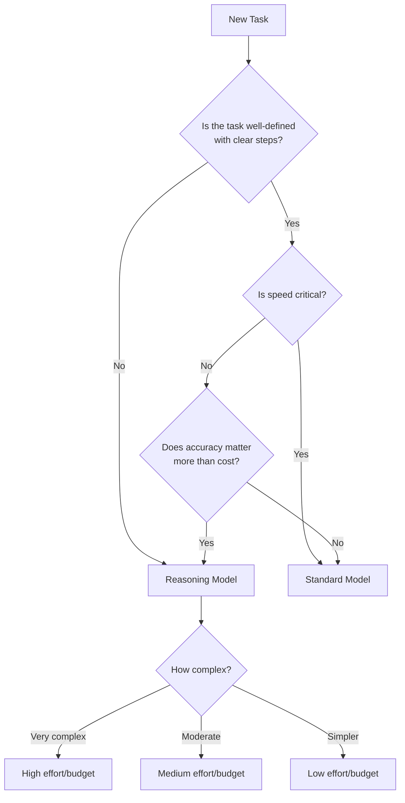
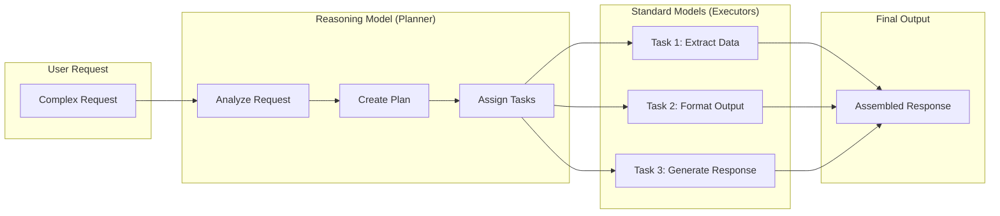

# When to Use Reasoning Models

## Introduction

Reasoning models excel at tasks that would challenge even experienced human experts—complex analysis, multi-step planning, and navigating ambiguity. However, they're not the right choice for every task. This lesson provides a framework for deciding when to use reasoning models versus standard models, with real-world examples from production deployments.

> **🔑 Key Insight:** The question isn't "which model is better?" but "which model fits this task?" Most production systems use both—reasoning models for planning and decision-making, standard models for execution.

### What We'll Cover

- Seven proven use cases for reasoning models
- Decision framework for model selection
- Hybrid architectures combining both model types
- Cost-benefit analysis
- Real-world deployment patterns

### Prerequisites

- [Prompting Reasoning Models Overview](./00-prompting-reasoning-models-overview.md)

---

## The Seven Proven Use Cases

Based on extensive production testing by OpenAI and their customers, reasoning models consistently outperform standard models in these scenarios:

### 1. Navigating Ambiguous Tasks

Reasoning models handle incomplete or conflicting information gracefully, often asking clarifying questions rather than making assumptions.

```python
# Ambiguous legal document analysis
prompt = """
Identify baskets available under the restricted payments 
capacity in this credit agreement.

[Credit Agreement Document]
"""

# Reasoning model excels because:
# - Contract terms are often ambiguous
# - Multiple clauses may interact
# - Context from different sections must be synthesized
```

> **Real-world result:** Hebbia reported that o1 "yielded stronger results on 52% of complex prompts on dense Credit Agreements compared to other models."

### 2. Finding a Needle in a Haystack

When searching through large volumes of unstructured information for specific, relevant details:

```python
# Acquisition due diligence
prompt = """
Review these 47 company documents—contracts, leases, and agreements.
Identify any conditions that could affect this acquisition deal.
Flag critical terms that require immediate attention.

[Document Collection]
"""

# Reasoning model advantages:
# - Maintains context across many documents
# - Identifies subtle implications
# - Connects related clauses across documents
```

> **Real-world result:** Endex found that o1 identified a "change of control" provision in footnotes requiring immediate payoff of a $75M loan—a detail easily missed by human reviewers.

### 3. Finding Relationships Across Data

Drawing conclusions from the interplay between multiple documents or data sources:

```python
# Tax research synthesis
prompt = """
Based on these tax code sections, case law documents, and IRS rulings,
determine the tax implications for this corporate restructuring.

[Multiple source documents]
"""

# Why reasoning models excel:
# - Synthesize information from disparate sources
# - Draw conclusions not explicit in any single document
# - Apply nuanced rules to specific situations
```

> **Real-world result:** Blue J saw a "4x improvement in end-to-end performance" switching from GPT-4o to o1 for tax research that requires reasoning across multiple documents.

### 4. Multi-Step Agentic Planning

When AI needs to break down complex tasks and orchestrate multiple steps:

```python
# Agent planning prompt
prompt = """
A user wants to book a team offsite for 12 people.
Budget: $15,000
Dates: March 15-17
Requirements: Meeting room, team dinner, outdoor activity

Create a comprehensive plan and identify the tools needed 
to execute each step.
"""

# Reasoning model role:
# - Break complex goal into steps
# - Identify required tools/actions
# - Handle dependencies between steps
# - Adjust plan based on constraints
```

> **Real-world result:** Lindy.AI reported "switching all agentic steps that used to cause issues to o1 and observing our agents becoming basically flawless overnight."

### 5. Visual Reasoning

Analyzing complex visuals—charts, architectural drawings, low-quality images:

```python
# Architectural analysis
prompt = """
Analyze this architectural drawing and generate a 
comprehensive bill of materials.

[Complex multi-page architectural PDF]
"""

# Reasoning model capabilities:
# - Correlate legend on one page with details on another
# - Interpret ambiguous notations (e.g., "PT" = pressure treated)
# - Handle poor image quality
# - Reason about spatial relationships
```

> **Real-world result:** SafetyKit achieved 88% accuracy on their hardest image classification tasks with o1, compared to 50% with GPT-4o.

### 6. Code Review and Debugging

Reviewing large codebases, identifying subtle bugs, and suggesting improvements:

```python
# Code review prompt
prompt = """
Review this pull request that modifies the authentication system.
Identify:
1. Security vulnerabilities
2. Logic errors
3. Edge cases not handled
4. Performance implications

[Diff of multiple files]
"""

# Why reasoning works:
# - Understands code flow across files
# - Identifies subtle bugs humans miss
# - Considers security implications
# - Not latency-sensitive (async review)
```

> **Real-world result:** CodeRabbit "increased product conversion rates by 3x after switching to o-series models" for automated code reviews.

### 7. Evaluation and Benchmarking

Using reasoning models as judges to evaluate other model outputs:

```python
# LLM-as-judge prompt
prompt = """
Evaluate this patient question summary for accuracy and completeness.

Original Question: [patient question]
Generated Summary: [model output]

Score on: 
- Medical accuracy (1-5)
- Completeness (1-5)  
- Clarity for clinician (1-5)

Provide detailed reasoning for each score.
"""

# Reasoning model advantages:
# - Catches nuanced differences
# - Consistent evaluation criteria
# - Detailed justification
```

> **Real-world result:** Braintrust customer saw F1 score for a judge go from 0.12 with GPT-4o to 0.74 with o1 for complex healthcare grading tasks.

---

## Decision Framework

### Quick Decision Matrix

| If your task requires... | Use |
|--------------------------|-----|
| Speed and low cost | Standard model |
| Well-defined, repeatable execution | Standard model |
| Complex problem-solving | Reasoning model |
| Navigating ambiguity | Reasoning model |
| Multi-step planning | Reasoning model |
| Highest accuracy on complex tasks | Reasoning model |

### Decision Tree



### Detailed Selection Criteria

```python
def select_model(task_characteristics: dict) -> str:
    """
    Decision logic for model selection.
    
    Args:
        task_characteristics: Dict with task properties
    
    Returns:
        Recommended model type
    """
    
    # Task characteristics
    is_ambiguous = task_characteristics.get("ambiguous", False)
    requires_planning = task_characteristics.get("multi_step", False)
    needs_high_accuracy = task_characteristics.get("accuracy_critical", False)
    latency_sensitive = task_characteristics.get("latency_sensitive", False)
    cost_sensitive = task_characteristics.get("cost_sensitive", False)
    involves_reasoning = task_characteristics.get("complex_reasoning", False)
    
    # Reasoning model indicators
    reasoning_score = sum([
        is_ambiguous * 2,
        requires_planning * 2,
        needs_high_accuracy * 1,
        involves_reasoning * 2,
        (not latency_sensitive) * 1,
        (not cost_sensitive) * 1
    ])
    
    # Standard model indicators
    standard_score = sum([
        (not is_ambiguous) * 1,
        (not requires_planning) * 1,
        latency_sensitive * 2,
        cost_sensitive * 2,
        (not involves_reasoning) * 1
    ])
    
    if reasoning_score > standard_score:
        if involves_reasoning and needs_high_accuracy:
            return "reasoning_high_effort"
        elif requires_planning:
            return "reasoning_medium_effort"
        else:
            return "reasoning_low_effort"
    else:
        return "standard_model"

# Example usage
task = {
    "ambiguous": True,
    "multi_step": True,
    "accuracy_critical": True,
    "latency_sensitive": False,
    "cost_sensitive": False,
    "complex_reasoning": True
}

recommendation = select_model(task)
# Returns: "reasoning_high_effort"
```

---

## Hybrid Architectures

### The Planner-Executor Pattern

Most production AI systems combine reasoning and standard models:



### Implementation Example

```python
from openai import OpenAI

client = OpenAI()

class HybridAgent:
    """
    Combines reasoning model for planning with 
    standard model for execution.
    """
    
    def __init__(self):
        self.planner_model = "gpt-5"
        self.executor_model = "gpt-4o"
    
    async def process_request(self, user_request: str) -> str:
        # Step 1: Use reasoning model to create plan
        plan = await self.create_plan(user_request)
        
        # Step 2: Execute each step with standard model
        results = []
        for step in plan["steps"]:
            result = await self.execute_step(step)
            results.append(result)
        
        # Step 3: Optionally use reasoning model to synthesize
        if plan.get("requires_synthesis"):
            return await self.synthesize_results(results)
        
        return results[-1]
    
    async def create_plan(self, request: str) -> dict:
        """Use reasoning model to break down complex request."""
        
        response = client.responses.create(
            model=self.planner_model,
            reasoning={"effort": "high"},
            input=[{
                "role": "user",
                "content": f"""
                Analyze this request and create an execution plan.
                
                Request: {request}
                
                Return a JSON object with:
                - steps: Array of specific tasks to execute
                - requires_synthesis: Boolean indicating if final synthesis needed
                - context: Any context needed for execution
                """
            }]
        )
        
        return self._parse_plan(response.output_text)
    
    async def execute_step(self, step: dict) -> str:
        """Use standard model for fast execution of defined tasks."""
        
        response = client.chat.completions.create(
            model=self.executor_model,
            messages=[{
                "role": "user",
                "content": step["instruction"]
            }]
        )
        
        return response.choices[0].message.content
    
    async def synthesize_results(self, results: list) -> str:
        """Use reasoning model to synthesize multiple results."""
        
        response = client.responses.create(
            model=self.planner_model,
            reasoning={"effort": "medium"},
            input=[{
                "role": "user",
                "content": f"""
                Synthesize these results into a coherent final response:
                
                {results}
                """
            }]
        )
        
        return response.output_text
```

### When to Use Hybrid Architecture

| Scenario | Architecture |
|----------|--------------|
| Simple Q&A | Standard model only |
| Complex analysis | Reasoning model only |
| Multi-step workflow with clear subtasks | Hybrid |
| High-volume with occasional complexity | Hybrid with routing |
| Agentic system | Reasoning for planning, standard for tools |

---

## Cost-Benefit Analysis

### Token Economics

```python
def calculate_cost_comparison(
    input_tokens: int,
    expected_reasoning_tokens: int,
    output_tokens: int
) -> dict:
    """
    Compare costs between reasoning and standard models.
    
    Prices as of January 2026 (OpenAI, per million tokens):
    - GPT-4o: $5 input, $15 output
    - GPT-5: $10 input, $30 output (includes reasoning)
    """
    
    # Standard model (GPT-4o)
    standard_cost = (
        (input_tokens / 1_000_000) * 5 +
        (output_tokens / 1_000_000) * 15
    )
    
    # Reasoning model (GPT-5)
    # Reasoning tokens are billed as output
    reasoning_output = expected_reasoning_tokens + output_tokens
    reasoning_cost = (
        (input_tokens / 1_000_000) * 10 +
        (reasoning_output / 1_000_000) * 30
    )
    
    return {
        "standard_cost": f"${standard_cost:.4f}",
        "reasoning_cost": f"${reasoning_cost:.4f}",
        "cost_ratio": f"{reasoning_cost / standard_cost:.1f}x",
        "note": "Reasoning often produces better results on complex tasks"
    }

# Example: Complex analysis task
result = calculate_cost_comparison(
    input_tokens=2000,
    expected_reasoning_tokens=5000,
    output_tokens=500
)

# Output:
# {
#     "standard_cost": "$0.0175",
#     "reasoning_cost": "$0.1850",
#     "cost_ratio": "10.6x",
#     "note": "Reasoning often produces better results on complex tasks"
# }
```

### ROI Framework

```python
def calculate_reasoning_roi(
    task_count: int,
    standard_accuracy: float,
    reasoning_accuracy: float,
    error_cost: float,
    standard_cost_per_task: float,
    reasoning_cost_per_task: float
) -> dict:
    """
    Calculate ROI of using reasoning models based on error reduction.
    """
    
    # Errors with each model
    standard_errors = task_count * (1 - standard_accuracy)
    reasoning_errors = task_count * (1 - reasoning_accuracy)
    errors_prevented = standard_errors - reasoning_errors
    
    # Costs
    standard_total = task_count * standard_cost_per_task + standard_errors * error_cost
    reasoning_total = task_count * reasoning_cost_per_task + reasoning_errors * error_cost
    
    # Savings
    savings = standard_total - reasoning_total
    
    return {
        "errors_prevented": int(errors_prevented),
        "standard_total_cost": f"${standard_total:.2f}",
        "reasoning_total_cost": f"${reasoning_total:.2f}",
        "net_savings": f"${savings:.2f}",
        "recommendation": "Use reasoning" if savings > 0 else "Use standard"
    }

# Example: Medical record review
# Each error (missed issue) costs $1000 in downstream problems
result = calculate_reasoning_roi(
    task_count=1000,
    standard_accuracy=0.85,
    reasoning_accuracy=0.95,
    error_cost=1000,
    standard_cost_per_task=0.02,
    reasoning_cost_per_task=0.20
)

# Result shows reasoning saves money despite higher cost per task
# because 100 fewer errors × $1000 = $100,000 saved
```

---

## Common Mistakes

### ❌ Mistake 1: Using Reasoning for Simple Tasks

```python
# Bad: Overkill for simple translation
response = client.responses.create(
    model="gpt-5",
    reasoning={"effort": "high"},
    input=[{"role": "user", "content": "Translate 'hello' to French"}]
)

# Good: Use standard model for simple tasks
response = client.chat.completions.create(
    model="gpt-4o",
    messages=[{"role": "user", "content": "Translate 'hello' to French"}]
)
```

### ❌ Mistake 2: Ignoring Latency Requirements

```python
# Bad: Reasoning model in real-time chat
# User expects instant response but gets 5-30 second delay

# Good: Use standard for real-time, reasoning for background
if is_realtime_interaction:
    model = "gpt-4o"
else:
    model = "gpt-5"
```

### ❌ Mistake 3: Not Considering Hybrid Approach

```python
# Bad: All tasks with one model type
# Either too slow/expensive OR poor quality on complex tasks

# Good: Route based on task
def route_request(request: dict) -> str:
    complexity = analyze_complexity(request)
    
    if complexity < 0.3:
        return "gpt-4o"  # Standard for simple
    elif complexity < 0.7:
        return "gpt-5-mini"  # Reasoning mini for medium
    else:
        return "gpt-5"  # Full reasoning for complex
```

---

## Hands-on Exercise

### Your Task

Build a task router that analyzes incoming requests and selects the appropriate model.

**Requirements:**
1. Classify task complexity (simple, medium, complex)
2. Determine if reasoning is needed
3. Select appropriate model and configuration
4. Log decisions for analysis

<details>
<summary>✅ Solution (click to expand)</summary>

```python
from dataclasses import dataclass
from enum import Enum
from typing import Optional

class TaskComplexity(Enum):
    SIMPLE = "simple"
    MEDIUM = "medium"
    COMPLEX = "complex"

@dataclass
class RoutingDecision:
    model: str
    reasoning_effort: Optional[str]
    complexity: TaskComplexity
    reasoning: str

class TaskRouter:
    """Route tasks to appropriate models based on complexity analysis."""
    
    # Indicators of complexity
    COMPLEX_INDICATORS = [
        "analyze", "evaluate", "compare", "synthesize", "plan",
        "decide", "recommend", "review", "debug", "optimize",
        "multiple", "several", "various", "considering"
    ]
    
    SIMPLE_INDICATORS = [
        "translate", "convert", "format", "list", "define",
        "what is", "who is", "when", "where"
    ]
    
    def route(self, request: str) -> RoutingDecision:
        """Analyze request and determine optimal routing."""
        
        request_lower = request.lower()
        
        # Count indicators
        complex_count = sum(
            1 for ind in self.COMPLEX_INDICATORS 
            if ind in request_lower
        )
        simple_count = sum(
            1 for ind in self.SIMPLE_INDICATORS 
            if ind in request_lower
        )
        
        # Word count as complexity proxy
        word_count = len(request.split())
        
        # Classify
        if complex_count >= 2 or word_count > 100:
            complexity = TaskComplexity.COMPLEX
        elif simple_count >= 2 or word_count < 20:
            complexity = TaskComplexity.SIMPLE
        else:
            complexity = TaskComplexity.MEDIUM
        
        # Route based on classification
        if complexity == TaskComplexity.SIMPLE:
            return RoutingDecision(
                model="gpt-4o",
                reasoning_effort=None,
                complexity=complexity,
                reasoning="Simple task, standard model sufficient"
            )
        elif complexity == TaskComplexity.MEDIUM:
            return RoutingDecision(
                model="gpt-5-mini",
                reasoning_effort="low",
                complexity=complexity,
                reasoning="Medium complexity, light reasoning helpful"
            )
        else:
            return RoutingDecision(
                model="gpt-5",
                reasoning_effort="high",
                complexity=complexity,
                reasoning="Complex task, full reasoning recommended"
            )
    
    def execute(self, request: str) -> str:
        """Route and execute the request."""
        
        from openai import OpenAI
        client = OpenAI()
        
        decision = self.route(request)
        
        print(f"Routing: {decision.model} ({decision.reasoning})")
        
        if decision.reasoning_effort:
            # Use reasoning model
            response = client.responses.create(
                model=decision.model,
                reasoning={"effort": decision.reasoning_effort},
                input=[{"role": "user", "content": request}]
            )
            return response.output_text
        else:
            # Use standard model
            response = client.chat.completions.create(
                model=decision.model,
                messages=[{"role": "user", "content": request}]
            )
            return response.choices[0].message.content

# Test the router
router = TaskRouter()

# Simple task
decision1 = router.route("What is the capital of France?")
print(f"Task 1: {decision1}")
# RoutingDecision(model='gpt-4o', reasoning_effort=None, ...)

# Complex task
decision2 = router.route("""
Analyze our Q4 financial results compared to Q3.
Consider revenue trends, cost structure changes, and 
market conditions. Recommend strategic priorities for Q1.
""")
print(f"Task 2: {decision2}")
# RoutingDecision(model='gpt-5', reasoning_effort='high', ...)
```

</details>

---

## Summary

✅ **Seven proven use cases:** Ambiguity, needle-in-haystack, relationships, planning, visual, code review, evaluation
✅ **Decision framework:** Complexity, ambiguity, accuracy needs vs latency and cost
✅ **Hybrid architectures:** Reasoning for planning, standard for execution
✅ **Cost-benefit:** Higher per-task cost often offset by better accuracy
✅ **Common mistakes:** Overkill on simple tasks, ignoring latency, not using hybrid

**Next:** [Provider Comparison](./02-provider-comparison.md)

---

## Further Reading

- [OpenAI Reasoning Best Practices](https://platform.openai.com/docs/guides/reasoning-best-practices)
- [Hebbia Case Study](https://www.hebbia.com/)
- [Lindy.AI Agent Architecture](https://lindy.ai/)

---

<!-- 
Sources Consulted:
- OpenAI Reasoning Best Practices: Seven use cases with customer quotes
- OpenAI Reasoning Guide: Token economics, context management
- Production case studies: Hebbia, Endex, Blue J, Lindy.AI, CodeRabbit, Braintrust
-->
