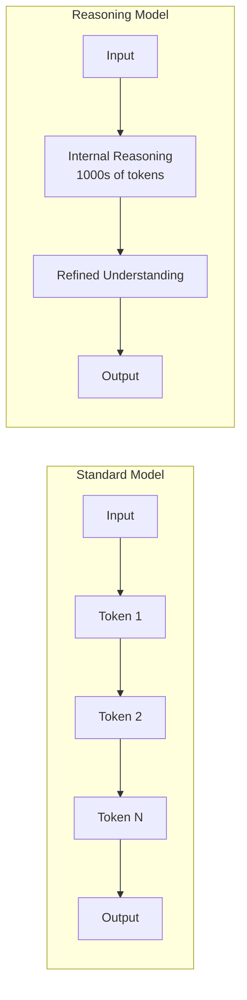

# Prompting Best Practices for Reasoning Models

## Introduction

Reasoning models think differently than standard models—they have built-in chain-of-thought capabilities that fundamentally change how you should write prompts. Many techniques that improve standard model performance actually *hurt* reasoning model performance.

> **🔑 Key Insight:** The golden rule for reasoning prompts is simplicity. Tell the model *what* you want, not *how* to think. The model's internal reasoning is more sophisticated than any chain-of-thought prompt you could write.

### What We'll Cover

- Why reasoning models need different prompts
- The simplicity principle with examples
- Structuring complex inputs effectively
- Zero-shot vs few-shot approaches
- Anti-patterns to avoid
- Provider-specific considerations

### Prerequisites

- [Provider Comparison](./02-provider-comparison.md)
- Experience with standard model prompting

---

## Why Reasoning Models Are Different

### The Built-In Chain of Thought

Standard models benefit from explicit reasoning instructions because they process tokens sequentially without backtracking. Reasoning models, however, generate extensive internal reasoning *before* producing output.



### What This Means for Prompting

| Standard Model | Reasoning Model |
|----------------|-----------------|
| "Think step by step" helps | Already thinking step by step |
| Examples guide reasoning | Examples can constrain reasoning |
| Detailed instructions improve output | Over-specification hurts output |
| Format instructions useful | Markdown often disabled |

---

## The Simplicity Principle

### Before and After Examples

**Task: Analyze a business decision**

```python
# ❌ Standard model prompt (too complex for reasoning)
prompt_standard = """
I need you to analyze this business decision. Please follow these steps:

Step 1: First, identify all stakeholders involved
Step 2: List the potential benefits for each stakeholder
Step 3: List the potential risks for each stakeholder
Step 4: Consider second-order effects
Step 5: Weigh the pros and cons
Step 6: Make a recommendation

Think carefully about each step before moving to the next.
Show your reasoning for each step.

Decision: [Company considering remote-first policy]
"""

# ✅ Reasoning model prompt (simple and direct)
prompt_reasoning = """
Analyze this business decision and provide a recommendation.

Decision: [Company considering remote-first policy]
"""
```

**Why the simple version works better:**
- The model already thinks through stakeholders, benefits, risks, and second-order effects
- Explicit steps may actually cause the model to *skip* considerations you didn't list
- The simple prompt lets the model apply its full reasoning capability

### Another Example: Code Review

```python
# ❌ Over-specified (limits reasoning)
prompt_complex = """
Review this code for:
1. Syntax errors
2. Logic bugs
3. Security vulnerabilities
4. Performance issues
5. Style violations

For each issue found:
- State the line number
- Describe the problem
- Suggest a fix
- Rate severity (low/medium/high)

Think about edge cases. Consider null values. Check for race conditions.
"""

# ✅ Goal-oriented (unlocks full reasoning)
prompt_simple = """
Review this code. Identify any issues that could cause bugs, 
security problems, or performance degradation in production.

[code]
"""
```

### The Anti-Pattern of Explicit Chain-of-Thought

```python
# ❌ DON'T use chain-of-thought prompts with reasoning models
prompt_cot = """
Let's solve this step by step.

First, I'll identify what we know:
- [fact 1]
- [fact 2]

Then, I'll consider what we need to find:
- [goal]

Now, let me work through this systematically...
"""

# ✅ DO state the problem directly
prompt_direct = """
Given these facts, determine the optimal solution.

Facts: [facts]
Goal: [goal]
"""
```

> **Warning:** Chain-of-thought prompts that work well with GPT-4o or Claude often *degrade* performance with reasoning models. The internal reasoning is far more sophisticated than any prompt-guided thinking.

---

## Structuring Complex Inputs

While prompts should be simple, complex inputs (documents, code, data) need clear structure. Use delimiters to help the model parse your input.

### XML Tags (Recommended)

```python
prompt = """
Compare these two proposals and recommend which to accept.

<proposal_a>
Title: Microservices Migration
Timeline: 18 months
Budget: $2.4M
Risk: Medium
Key benefit: Scalability
</proposal_a>

<proposal_b>
Title: Modular Monolith Refactor
Timeline: 8 months
Budget: $800K
Risk: Low
Key benefit: Maintainability
</proposal_b>
"""
```

### Markdown Headers

```python
prompt = """
Analyze the security of this authentication system.

## Current Implementation

```python
def authenticate(username, password):
    user = db.find_user(username)
    if user and user.password == password:
        return create_session(user)
    return None
```

## Requirements

- Must support MFA
- Session timeout: 30 minutes
- Password policy: 12+ characters
"""
```

### Triple Backticks for Code

```python
prompt = """
Identify the bug in this function.

```javascript
function calculateDiscount(price, percentage) {
    return price - (price * percentage);
}
```

Expected: calculateDiscount(100, 10) should return 90
Actual: Returns -900
"""
```

### Numbered Lists for Multiple Items

```python
prompt = """
Evaluate these three database options for our use case.

1. PostgreSQL
   - Relational, ACID compliant
   - Strong ecosystem
   - Self-hosted

2. MongoDB
   - Document store
   - Flexible schema
   - Managed options available

3. DynamoDB
   - Key-value/document
   - Fully managed
   - AWS-native

Use case: High-write IoT sensor data with occasional complex queries
"""
```

---

## Zero-Shot vs Few-Shot

### Start with Zero-Shot

Reasoning models often perform better with zero-shot prompts because examples can inadvertently constrain their reasoning.

```python
# ✅ Zero-shot (try this first)
prompt = """
Classify this customer support ticket by urgency and category.

Ticket: "Our entire production system is down and we're losing 
$50,000 per hour. The error started after your latest update."
"""
```

### When to Use Few-Shot

Add examples only when:
1. Zero-shot produces incorrect format
2. Task requires domain-specific conventions
3. Classification scheme is non-obvious

```python
# Few-shot for specific format requirements
prompt = """
Extract action items from meeting notes in this format.

Example 1:
Notes: "John will prepare the Q3 report by Friday. Sarah needs 
to review the vendor contracts."
Action Items:
- [ ] John: Prepare Q3 report (Due: Friday)
- [ ] Sarah: Review vendor contracts (Due: Not specified)

Example 2:
Notes: "Team agreed to postpone the launch. Mike volunteered 
to draft the customer communication."
Action Items:
- [ ] Mike: Draft customer communication (Due: Not specified)

Now extract from these notes:
Notes: "[actual meeting notes]"
"""
```

### Keep Examples Minimal

```python
# ❌ Too many examples (constrains reasoning)
prompt = """
Example 1: [long example]
Example 2: [long example]
Example 3: [long example]
Example 4: [long example]
Example 5: [long example]

Now do this task: [task]
"""

# ✅ Minimal examples (guides without constraining)
prompt = """
Example:
Input: [short input]
Output: [short output showing format]

Task:
Input: [actual input]
"""
```

---

## Providing Success Criteria

Instead of specifying *how* to solve a problem, specify *what success looks like*.

### Define the Goal, Not the Path

```python
# ❌ Specifying the path
prompt = """
To analyze this code:
1. First scan for variable declarations
2. Then trace the data flow
3. Identify where data is validated
4. Check for SQL injection points
5. Look for XSS vulnerabilities
6. Check authentication handling
"""

# ✅ Defining success criteria
prompt = """
Perform a security review of this code.

A successful review will:
- Identify all exploitable vulnerabilities
- Explain the attack vector for each
- Suggest specific fixes with code examples
- Prioritize by severity (critical > high > medium > low)
"""
```

### Specify Output Requirements

```python
prompt = """
Generate a migration plan for our database upgrade.

Requirements for the plan:
- Zero downtime during migration
- Rollback procedure for each step
- Data integrity verification checkpoints
- Estimated duration for each phase
- Resource requirements (team size, infrastructure)
"""
```

---

## Developer Messages vs System Prompts

### OpenAI: Use Developer Role

```python
from openai import OpenAI
client = OpenAI()

# ✅ Correct for reasoning models
response = client.responses.create(
    model="gpt-5",
    reasoning={"effort": "medium"},
    input=[
        {
            "role": "developer",
            "content": """
            You are a senior security engineer reviewing code.
            Focus on authentication, authorization, and data validation.
            Be specific about vulnerable code paths.
            """
        },
        {
            "role": "user",
            "content": "Review this authentication module: [code]"
        }
    ]
)
```

### Anthropic: Use System Parameter

```python
import anthropic
client = anthropic.Anthropic()

# ✅ System prompt separate from messages
response = client.messages.create(
    model="claude-sonnet-4-20250514",
    max_tokens=16000,
    system="You are a senior security engineer...",
    thinking={"type": "enabled", "budget_tokens": 5000},
    messages=[
        {"role": "user", "content": "Review this authentication module: [code]"}
    ]
)
```

### Gemini: System Instruction

```python
from google import genai
client = genai.Client()

# ✅ System instruction in config
response = client.models.generate_content(
    model="gemini-3-flash",
    contents="Review this authentication module: [code]",
    config={
        "system_instruction": "You are a senior security engineer...",
        "thinking_config": {"thinking_level": "medium"}
    }
)
```

---

## Handling Markdown and Formatting

### OpenAI: Markdown Disabled by Default

Reasoning models have markdown rendering disabled by default. To enable:

```python
# Enable markdown output
response = client.responses.create(
    model="gpt-5",
    reasoning={"effort": "medium"},
    input=[
        {
            "role": "developer",
            "content": "Formatting re-enabled"  # Magic phrase
        },
        {
            "role": "user",
            "content": "Create a comparison table of cloud providers."
        }
    ]
)
```

### When to Request Specific Formats

```python
# ✅ Request format when needed
prompt = """
Analyze these options and return your recommendation as JSON.

Expected format:
{
    "recommendation": "Option A or B",
    "confidence": 0.0-1.0,
    "key_factors": ["factor1", "factor2"],
    "risks": ["risk1", "risk2"]
}
"""

# ✅ Or request structured tables
prompt = """
Compare these three approaches. Present findings in a table format.
"""
```

---

## Anti-Patterns to Avoid

### ❌ Telling the Model How to Think

```python
# Bad
prompt = """
Think about this carefully. Consider all angles. 
Make sure to think step by step. Don't rush to conclusions.
First, identify the key factors. Then weigh each one.
Finally, synthesize your analysis.
"""

# Good
prompt = """
Analyze this situation and provide your recommendation.
"""
```

### ❌ Excessive Caveats and Warnings

```python
# Bad
prompt = """
Be very careful with this analysis. Don't make mistakes.
Double-check your work. Make sure you don't miss anything.
If you're unsure, say so. Don't hallucinate information.
"""

# Good
prompt = """
Analyze this data and report your findings. Flag any 
areas where the data is ambiguous or incomplete.
"""
```

### ❌ Redundant Instructions

```python
# Bad
prompt = """
I need you to review this code.
Please look at the code carefully.
Examine the code for issues.
Check the code thoroughly.
Find problems in the code.
"""

# Good
prompt = """
Review this code for issues.
"""
```

### ❌ Over-Specification of Approach

```python
# Bad
prompt = """
To solve this optimization problem:
1. Define the objective function
2. Identify constraints
3. Use Lagrange multipliers
4. Solve the system of equations
5. Verify the solution
"""

# Good
prompt = """
Find the optimal solution to this constrained optimization problem.
Explain your approach and show your work.
"""
```

---

## Provider-Specific Tips

### OpenAI

| Tip | Reason |
|-----|--------|
| Use `developer` role, not `system` | Required for instruction hierarchy |
| Add "Formatting re-enabled" for markdown | Markdown disabled by default |
| Reserve 25,000+ tokens for `max_output_tokens` | Reasoning uses many tokens |
| Don't include previous reasoning in follow-ups | Model handles context internally |

### Anthropic

| Tip | Reason |
|-----|--------|
| `budget_tokens` must be ≥ 1,024 | Minimum requirement |
| Preserve all content blocks in multi-turn | Thinking blocks contain signatures |
| Use `betas=["interleaved-thinking-2025-05-14"]` for complex tasks | Allows multiple thinking phases |
| Don't toggle thinking mid-conversation | Must stay consistent |

### Gemini

| Tip | Reason |
|-----|--------|
| Use `thinking_level` for 3.x, `thinking_budget` for 2.5 | Different APIs |
| Can't disable thinking on Gemini 3 Pro | Permanent feature |
| Include thought signatures in multi-turn | Required for context |
| Use `include_thoughts=True` to see reasoning | Otherwise reasoning is hidden |

---

## Prompt Templates

### Analysis Template

```python
ANALYSIS_TEMPLATE = """
{context_if_needed}

Analyze the following and provide your assessment.

{input_data}

Focus on:
{focus_areas}
"""

# Usage
prompt = ANALYSIS_TEMPLATE.format(
    context_if_needed="You're evaluating enterprise software vendors.",
    input_data="[RFP responses from three vendors]",
    focus_areas="""
    - Total cost of ownership
    - Implementation risk
    - Long-term viability
    """
)
```

### Decision Template

```python
DECISION_TEMPLATE = """
Given the following situation, recommend the best course of action.

Situation:
{situation}

Constraints:
{constraints}

Desired outcome:
{outcome}
"""
```

### Review Template

```python
REVIEW_TEMPLATE = """
Review the following {artifact_type} and provide feedback.

{artifact}

Evaluation criteria:
{criteria}
"""
```

---

## Hands-on Exercise

### Your Task

Transform these over-engineered prompts into effective reasoning model prompts.

**Prompt 1 (Debug):**
```
I need you to debug this code. Please follow these steps carefully:
1. First, read through the entire code
2. Identify any syntax errors
3. Look for logic errors
4. Check variable names for typos
5. Trace the execution flow
6. Find where the bug might be
7. Suggest a fix
Think step by step. Be thorough. Don't miss anything.
```

**Prompt 2 (Writing):**
```
Write a blog post. Make sure to:
- Have a catchy introduction
- Include relevant examples
- Use clear language
- Have a strong conclusion
- Be engaging
- Be informative
- Use proper grammar
- Have good flow
- Be the right length
Think about your audience. Consider what they want to know.
```

<details>
<summary>✅ Solutions (click to expand)</summary>

**Prompt 1 (Improved):**
```
Find and fix the bug in this code.

[code]

The expected behavior is [X], but it currently does [Y].
```

**Prompt 2 (Improved):**
```
Write a blog post about [topic] for [target audience].

Goal: [specific purpose, e.g., "Explain why developers should learn TypeScript"]
Length: ~800 words
```

**Why these work better:**
- State the goal, not the process
- Remove redundant instructions (the model knows how to debug and write)
- Include only essential constraints (output format, length, audience)
- Trust the model's reasoning to handle the "how"

</details>

---

## Summary

✅ **Simplicity is key:** State goals, not procedures
✅ **Avoid chain-of-thought prompts:** Built-in reasoning is more sophisticated
✅ **Structure inputs clearly:** Use XML tags, markdown, or delimiters
✅ **Start zero-shot:** Add examples only when necessary
✅ **Define success criteria:** What good output looks like, not how to produce it
✅ **Follow provider guidelines:** Developer role (OpenAI), budget limits (Anthropic), thinking levels (Gemini)

**Next:** [Reasoning Configuration](./04-reasoning-configuration.md)

---

## Further Reading

- [OpenAI Reasoning Best Practices](https://platform.openai.com/docs/guides/reasoning-best-practices)
- [Anthropic Prompt Engineering Guide](https://docs.anthropic.com/en/docs/build-with-claude/prompt-engineering)
- [Google AI Prompt Design](https://ai.google.dev/docs/prompt_best_practices)

---

<!-- 
Sources Consulted:
- OpenAI Reasoning Best Practices: Keep prompts simple, avoid CoT, use delimiters
- Anthropic Extended Thinking: Budget minimums, multi-turn signatures
- Gemini Thinking: thinking_level vs thinking_budget, model-specific behavior
-->
