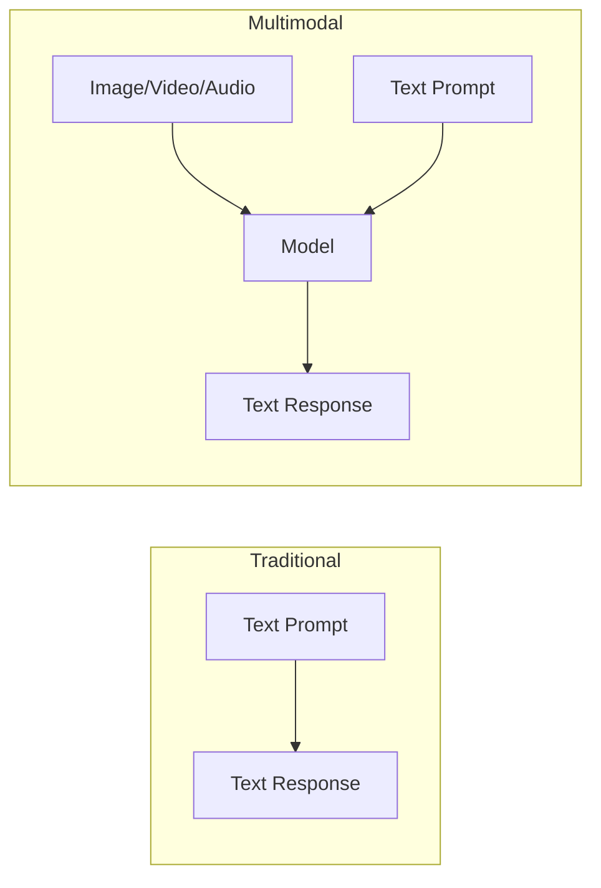
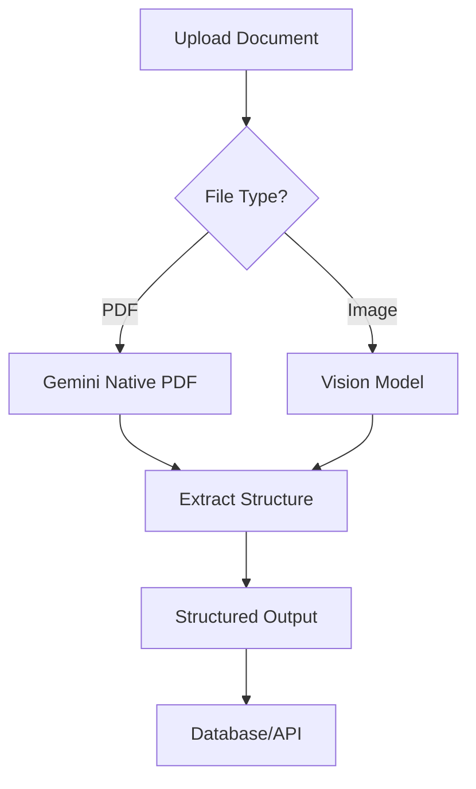

# Multimodal Prompting Overview

## Introduction

Multimodal AI unlocks the ability to process images, documents, audio, and video alongside text—enabling applications that were impossible just a few years ago. From analyzing receipts and diagrams to understanding video content and transcribing audio, multimodal prompting extends AI capabilities far beyond text.

> **🔑 Key Insight:** Multimodal models don't just "see" images—they understand them in context with your text prompts. This means you can ask specific questions, request structured extraction, and combine multiple media types in a single request.

### What We'll Cover in This Lesson

- The multimodal landscape across providers
- Input methods: inline data, URLs, and file APIs
- Token costs and resolution trade-offs
- Prompt ordering and structure
- Common use cases

### Prerequisites

- API integration basics from Unit 4
- Understanding of token economics

---

## The Multimodal Landscape

### Provider Capabilities

| Provider | Images | PDFs | Video | Audio | Object Detection | Segmentation |
|----------|--------|------|-------|-------|------------------|--------------|
| **OpenAI** | ✅ GPT-4o, GPT-5 | ✅ Via vision | ❌ | ✅ Whisper | ❌ | ❌ |
| **Anthropic** | ✅ Claude Sonnet/Opus | ✅ Via vision | ❌ | ❌ | ❌ | ❌ |
| **Gemini** | ✅ All models | ✅ Native | ✅ Native | ✅ Native | ✅ 2.0+ | ✅ 2.5+ |

> **🤖 AI Context:** Gemini is the most comprehensive multimodal model, supporting native video and audio input. OpenAI and Anthropic focus on image and document understanding, with audio handled separately via Whisper.

### Mental Model: Text + Context

Think of multimodal prompting as providing **visual context** for your text questions:



The model combines:
1. **Visual/audio understanding** of the media
2. **Text comprehension** of your prompt
3. **Contextual reasoning** to produce relevant output

---

## Input Methods

### Method 1: Inline Data (Base64)

Best for: Small files, one-time use, simple integrations

```python
import base64
from openai import OpenAI

client = OpenAI()

# Read and encode image
with open("receipt.jpg", "rb") as f:
    image_data = base64.standard_b64encode(f.read()).decode("utf-8")

response = client.responses.create(
    model="gpt-4.1-mini",
    input=[{
        "role": "user",
        "content": [
            {
                "type": "input_image",
                "image_url": f"data:image/jpeg;base64,{image_data}"
            },
            {
                "type": "input_text",
                "text": "Extract the total amount and date from this receipt."
            }
        ]
    }]
)
```

### Method 2: URL Reference

Best for: Public images, quick prototyping, external content

```python
# OpenAI
response = client.responses.create(
    model="gpt-4.1-mini",
    input=[{
        "role": "user",
        "content": [
            {
                "type": "input_image",
                "image_url": "https://example.com/chart.png"
            },
            {
                "type": "input_text",
                "text": "Analyze this chart and summarize the trends."
            }
        ]
    }]
)
```

```python
# Anthropic
import anthropic

client = anthropic.Anthropic()

response = client.messages.create(
    model="claude-sonnet-4-5",
    max_tokens=1024,
    messages=[{
        "role": "user",
        "content": [
            {
                "type": "image",
                "source": {
                    "type": "url",
                    "url": "https://example.com/chart.png"
                }
            },
            {
                "type": "text",
                "text": "Analyze this chart and summarize the trends."
            }
        ]
    }]
)
```

### Method 3: File API Upload

Best for: Large files, repeated use, production systems

```python
# OpenAI Files API
file = client.files.create(
    file=open("large_document.pdf", "rb"),
    purpose="vision"
)

response = client.responses.create(
    model="gpt-4.1-mini",
    input=[{
        "role": "user",
        "content": [
            {"type": "input_file", "file_id": file.id},
            {"type": "input_text", "text": "Summarize this document."}
        ]
    }]
)
```

```python
# Gemini Files API
from google import genai

client = genai.Client()

# Upload file (stored for 48 hours)
uploaded_file = client.files.upload(file="large_video.mp4")

response = client.models.generate_content(
    model="gemini-3-flash-preview",
    contents=[uploaded_file, "Summarize this video."]
)
```

### Comparison Table

| Method | Max Size | Reusable | Latency | Cost Efficiency |
|--------|----------|----------|---------|-----------------|
| Inline (base64) | ~20MB total | No | Low | Low for single use |
| URL Reference | N/A (remote) | Via URL | Medium | Free (no upload) |
| File API | Large files | Yes (48h) | Higher initial | High for repeated use |

---

## Token Costs and Resolution

### Understanding Image Token Costs

Image tokens are calculated based on **resolution and detail level**:

```python
def estimate_openai_image_tokens(
    width: int, 
    height: int, 
    detail: str = "auto"
) -> int:
    """
    Estimate token cost for OpenAI GPT-4o image input.
    
    Detail levels:
    - "low": Fixed 85 tokens regardless of size
    - "high": Based on 512px tiles + base tokens
    """
    
    if detail == "low":
        return 85
    
    # Scale to fit 2048x2048
    max_dim = 2048
    if width > max_dim or height > max_dim:
        scale = max_dim / max(width, height)
        width = int(width * scale)
        height = int(height * scale)
    
    # Scale shortest side to 768px
    min_dim = 768
    scale = min_dim / min(width, height)
    width = int(width * scale)
    height = int(height * scale)
    
    # Count 512px tiles
    tiles_x = (width + 511) // 512
    tiles_y = (height + 511) // 512
    
    # Cost: 170 per tile + 85 base
    return (tiles_x * tiles_y * 170) + 85

# Examples
print(estimate_openai_image_tokens(1024, 1024, "high"))  # 765 tokens
print(estimate_openai_image_tokens(1024, 1024, "low"))   # 85 tokens
```

### Provider Token Calculations

| Provider | Model | Token Calculation |
|----------|-------|-------------------|
| **OpenAI GPT-4o** | `detail: low` → 85 tokens, `high` → tiles × 170 + 85 |
| **OpenAI GPT-4.1-mini** | 32px patches, multiplier 1.62, cap 1536 |
| **Anthropic** | `(width × height) / 750` tokens |
| **Gemini** | 258 tokens if ≤384px, else 258 per 768×768 tile |

### When to Use Each Detail Level

| Detail | Use Case | Cost |
|--------|----------|------|
| `low` | Dominant colors, general shapes, simple classification | Fixed, low |
| `high` | Fine text, detailed analysis, small objects | Variable, higher |
| `auto` | Let model decide based on content | Varies |

---

## Prompt Structure and Ordering

### The Golden Rule: Media Before Text

All providers recommend placing images **before** your text prompt:

```python
# ✅ Recommended: Image first, then text
contents = [
    image_part,
    "What objects are in this image?"
]

# ⚠️ Works but less optimal: Text first
contents = [
    "What objects are in this image?",
    image_part
]
```

### Multi-Image Prompts

When comparing or analyzing multiple images:

```python
# Gemini multi-image example
response = client.models.generate_content(
    model="gemini-3-flash-preview",
    contents=[
        "Compare these two product designs:",
        image1_part,
        "Design A (above)",
        image2_part,
        "Design B (above)",
        "Which design is more user-friendly and why?"
    ]
)
```

### Structured Extraction Pattern

For extracting structured data from images:

```python
from pydantic import BaseModel
from openai import OpenAI

client = OpenAI()

class ReceiptData(BaseModel):
    merchant: str
    date: str
    total: float
    items: list[str]

response = client.responses.parse(
    model="gpt-4.1-mini",
    input=[{
        "role": "user",
        "content": [
            {"type": "input_image", "image_url": receipt_url},
            {"type": "input_text", "text": "Extract the receipt information."}
        ]
    }],
    text_format=ReceiptData
)

receipt = response.output_parsed
print(f"Total: ${receipt.total}")
```

---

## Common Use Cases

### Document Processing Pipeline



### Use Case Matrix

| Use Case | Recommended Provider | Key Configuration |
|----------|---------------------|-------------------|
| Receipt/invoice extraction | OpenAI, Anthropic, Gemini | `detail: high` for fine text |
| Chart analysis | All providers | Describe chart type in prompt |
| Form field extraction | Gemini (PDF native) | Structured output |
| Object detection | Gemini 2.0+ | `box_2d` output format |
| Image segmentation | Gemini 2.5+ | `thinking_budget: 0` |
| Video summarization | Gemini | Files API upload |
| Before/after comparison | All providers | Multi-image prompt |

---

## Best Practices Summary

### Do ✅

| Practice | Why |
|----------|-----|
| Place images before text prompts | Better context understanding |
| Use `detail: low` when fine detail isn't needed | Reduce costs and latency |
| Resize images before upload (max 1568px for Anthropic) | Faster processing |
| Use Files API for repeated analysis | Efficiency and cost savings |
| Rotate images to correct orientation | Models struggle with rotated content |
| Be specific about what to extract | Better accuracy |

### Don't ❌

| Anti-pattern | Why |
|--------------|-----|
| Send blurry or low-quality images | Degraded accuracy |
| Use vision for medical diagnosis | Not designed for clinical use |
| Expect precise spatial reasoning | Known limitation |
| Trust object counts for large quantities | Approximate at best |
| Process CAPTCHAs | Blocked for safety |

---

## Lesson Structure

This lesson folder covers:

| File | Focus |
|------|-------|
| [01-image-prompting.md](./01-image-prompting.md) | Image input methods, detail levels, multi-image prompts |
| [02-document-understanding.md](./02-document-understanding.md) | PDF processing, tables, charts, forms, OCR |
| [03-vision-capabilities.md](./03-vision-capabilities.md) | Object detection, segmentation, spatial reasoning |
| [04-video-audio-prompting.md](./04-video-audio-prompting.md) | Video input, temporal reasoning, audio handling |

---

## Summary

✅ **Three input methods:** Inline base64, URL reference, File API upload
✅ **Token costs vary:** Detail level and resolution significantly impact pricing
✅ **Media before text:** Place images/video before your text prompt
✅ **Provider differences:** Gemini offers broadest multimodal support (video, audio, PDF)
✅ **Use case matching:** Choose the right provider and configuration for your task

**Next:** [Image Prompting](./01-image-prompting.md)

---

## Further Reading

- [OpenAI Vision Guide](https://platform.openai.com/docs/guides/images-vision)
- [Anthropic Vision](https://docs.anthropic.com/en/docs/build-with-claude/vision)
- [Gemini Image Understanding](https://ai.google.dev/gemini-api/docs/image-understanding)

---

<!-- 
Sources Consulted:
- OpenAI Vision Guide: platform.openai.com/docs/guides/images-vision
- Anthropic Vision: platform.claude.com/docs/en/docs/build-with-claude/vision
- Gemini Image Understanding: ai.google.dev/gemini-api/docs/image-understanding
- Gemini Document Processing: ai.google.dev/gemini-api/docs/document-processing
-->
