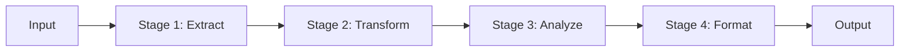
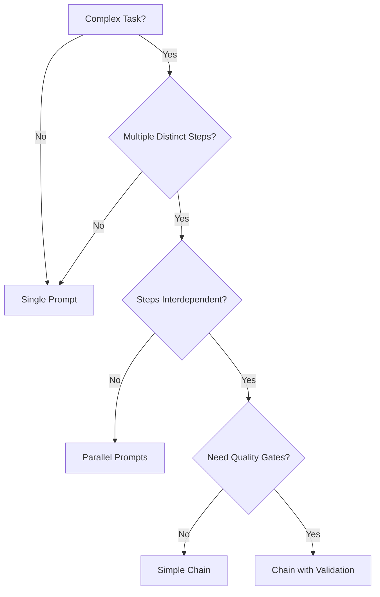

# Prompt Chaining & Pipelines

## Introduction

Have you ever asked an LLM to perform a complex task, only to have it miss steps, lose focus, or produce inconsistent results? When you try to accomplish too much in a single prompt, even the most capable models struggle. The solution is **prompt chaining**—breaking complex tasks into a series of focused, sequential LLM calls where each step builds on the previous one's output.

Prompt chaining transforms how we approach complex AI workflows. Instead of cramming everything into one monolithic prompt, we decompose tasks into manageable stages, each with its own specialized instructions and quality gates.

### What We'll Cover

- What prompt chaining is and why it dramatically improves results
- Core concepts: stages, handoffs, and output-to-input flow
- When to use single prompts versus chains
- The relationship between chaining and agentic workflows
- Real-world applications and performance benefits

### Prerequisites

- Understanding of prompt engineering fundamentals (previous lessons)
- Experience with API calls to LLM providers
- Familiarity with structured outputs (JSON mode)
- Basic Python programming knowledge

---

## What is Prompt Chaining?

**Prompt chaining** is the practice of making sequential LLM calls where the output of one call becomes the input (or part of the input) for the next. Each call in the chain has a specific, focused purpose, and together they accomplish a complex task that would be difficult or impossible in a single prompt.



### The Core Principle

The fundamental insight behind prompt chaining is simple but powerful:

> **Each link in the chain gets the model's full attention.**

When you ask a model to do multiple complex things at once, its attention is divided. By isolating each subtask into its own prompt, you ensure the model can focus entirely on that specific operation.

### Why Single Prompts Fail at Complex Tasks

Consider asking an LLM to:
1. Analyze a legal contract for risks
2. Categorize each risk by severity
3. Suggest mitigations for high-severity risks
4. Format everything as a structured report

In a single prompt, the model might:
- Skip categories or miss risks
- Apply inconsistent severity ratings
- Provide mitigations for the wrong risks
- Produce malformed output structure

With prompt chaining, each step gets dedicated focus, and the output of each step is validated before moving forward.

---

## Key Concepts in Prompt Chaining

### Stages

A **stage** is a single LLM call within a chain. Each stage has:

| Component | Description |
|-----------|-------------|
| **Input** | Data from previous stage(s) or original input |
| **Prompt** | Specialized instructions for this specific task |
| **Output** | Structured data passed to subsequent stages |
| **Validation** | Quality checks before proceeding |

```python
# Example: A single stage in a chain
def analyze_sentiment_stage(text: str) -> dict:
    """Stage 1: Analyze document sentiment."""
    response = client.chat.completions.create(
        model="gpt-4o",
        messages=[
            {
                "role": "system",
                "content": "Analyze the sentiment of the following text. Return JSON with 'sentiment' (positive/negative/neutral) and 'confidence' (0-1)."
            },
            {"role": "user", "content": text}
        ],
        response_format={"type": "json_object"}
    )
    return json.loads(response.choices[0].message.content)
```

### Handoffs

**Handoffs** are the transitions between stages where one stage's output becomes another's input. Effective handoffs require:

- **Clear data contracts**: Each stage knows exactly what format to expect and produce
- **Structured formats**: JSON, XML, or other parseable formats enable reliable handoffs
- **Context preservation**: Essential information flows through the chain without loss

### Quality Gates

**Quality gates** are validation checkpoints that verify stage outputs before proceeding:

```python
def quality_gate(stage_output: dict, requirements: dict) -> bool:
    """Validate stage output meets requirements before proceeding."""
    # Check required fields exist
    for field in requirements.get("required_fields", []):
        if field not in stage_output:
            return False
    
    # Check confidence threshold
    if stage_output.get("confidence", 0) < requirements.get("min_confidence", 0.7):
        return False
    
    return True
```

---

## When to Chain vs. When to Use Single Prompts

### Use Single Prompts When

| Scenario | Example |
|----------|---------|
| Task is straightforward | "Translate this sentence to French" |
| No interdependent subtasks | "Summarize this paragraph" |
| Output format is simple | Freeform text response |
| Speed is critical | Real-time chat responses |
| Context is minimal | Short inputs, simple outputs |

### Use Prompt Chaining When

| Scenario | Example |
|----------|---------|
| Task has multiple distinct steps | Research → Outline → Draft → Edit |
| Steps depend on previous results | Extract entities → Analyze relationships |
| Different expertise per step | Technical analysis → Plain language explanation |
| Quality gates are needed | Generate → Validate → Regenerate if failed |
| Debugging is important | Trace exactly where errors occur |

### The Decision Framework



---

## Benefits of Prompt Chaining

### 1. Improved Accuracy

Each subtask gets the model's undivided attention. Studies and practitioner experience show that breaking down tasks consistently produces better results than monolithic prompts.

> **Warning:** A chain is only as strong as its weakest link. If one stage fails, subsequent stages will work with flawed data.

### 2. Enhanced Traceability

When something goes wrong, you can pinpoint exactly which stage failed:

```python
def run_chain_with_logging(input_data: str):
    """Execute chain with detailed logging for debugging."""
    stages = ["extract", "transform", "analyze", "format"]
    
    for i, stage_name in enumerate(stages):
        try:
            result = execute_stage(stage_name, input_data)
            print(f"✅ Stage {i+1} ({stage_name}): Success")
            input_data = result
        except Exception as e:
            print(f"❌ Stage {i+1} ({stage_name}): Failed - {e}")
            raise
    
    return result
```

### 3. Modular Optimization

You can optimize individual stages independently:

- Use different models for different stages (GPT-4o for analysis, GPT-4o-mini for formatting)
- Fine-tune prompts for specific stages without affecting others
- Replace underperforming stages without rebuilding the entire system

### 4. Better Error Handling

Chains allow sophisticated error recovery strategies:

```python
async def stage_with_retry(prompt: str, max_retries: int = 3):
    """Execute a stage with automatic retry on failure."""
    for attempt in range(max_retries):
        try:
            result = await execute_prompt(prompt)
            if validate_output(result):
                return result
            # Output failed validation, retry
            print(f"Attempt {attempt + 1}: Validation failed, retrying...")
        except Exception as e:
            print(f"Attempt {attempt + 1}: Error - {e}")
    
    raise RuntimeError(f"Stage failed after {max_retries} attempts")
```

---

## Chaining vs. Agentic Workflows

It's important to understand how prompt chaining relates to AI agents:

| Aspect | Prompt Chaining | Agentic Workflows |
|--------|-----------------|-------------------|
| **Control Flow** | Predetermined sequence | Dynamic, model-decided |
| **Flexibility** | Fixed pipeline | Adapts to circumstances |
| **Predictability** | High | Variable |
| **Debugging** | Straightforward | Can be complex |
| **Use Case** | Structured processes | Open-ended problem solving |

Prompt chaining is **deterministic orchestration**—you define the exact sequence of operations. Agents introduce **autonomous decision-making** where the model chooses what to do next.

> **🤖 AI Context:** Many agentic systems use prompt chaining internally. An agent might chain prompts to plan → execute → verify, but the decision of *what* to plan and execute is made dynamically.

---

## Real-World Applications

### Content Creation Pipeline


### Data Processing

| Stage | Purpose | Model |
|-------|---------|-------|
| Extract | Pull entities from unstructured text | GPT-4o |
| Normalize | Standardize formats and values | GPT-4o-mini |
| Validate | Check against business rules | GPT-4o |
| Enrich | Add metadata and classifications | GPT-4o |
| Load | Format for database insertion | GPT-4o-mini |

### Decision Support

1. **Gather Info**: Collect relevant facts from documents
2. **List Options**: Generate possible courses of action
3. **Analyze Each**: Evaluate pros/cons of each option
4. **Recommend**: Synthesize analysis into a recommendation

---

## Common Pitfalls

| ❌ Mistake | ✅ Solution |
|-----------|-------------|
| Passing too much context between stages | Pass only what's needed; summarize when possible |
| No validation between stages | Add quality gates with clear pass/fail criteria |
| Monolithic error handling | Handle errors at each stage with stage-specific recovery |
| Using the same model for every stage | Match model capability to stage complexity |
| Ignoring partial failures | Design graceful degradation paths |

---

## Summary

✅ **Prompt chaining** breaks complex tasks into focused, sequential LLM calls

✅ Each **stage** gets the model's full attention, improving accuracy

✅ **Handoffs** use structured formats (JSON) for reliable data transfer

✅ **Quality gates** validate outputs before proceeding to the next stage

✅ Chaining provides **traceability**—you can debug exactly where failures occur

✅ Choose chaining when tasks have multiple interdependent steps requiring validation

**Next:** [Pipeline Design Patterns](./01-pipeline-design-patterns.md)

---

## Further Reading

- [Anthropic: Chain Complex Prompts](https://docs.anthropic.com/en/docs/build-with-claude/prompt-engineering/chain-prompts) — Official guide to prompt chaining
- [OpenAI Cookbook: Orchestrating Agents](https://cookbook.openai.com/examples/orchestrating_agents) — Routines and handoffs patterns
- [LangChain Documentation](https://docs.langchain.com/) — Framework for building LLM pipelines
- [Previous Lesson: Prompt Security](../20-prompt-security-injection-defense/00-prompt-security-overview.md)

---

<!-- 
Sources Consulted:
- Anthropic Chain Complex Prompts: https://platform.claude.com/docs/en/docs/build-with-claude/prompt-engineering/chain-prompts
- OpenAI Cookbook Orchestrating Agents: https://cookbook.openai.com/examples/orchestrating_agents
- OpenAI Prompt Engineering Guide: https://platform.openai.com/docs/guides/prompt-engineering
-->
