# Pipeline Design Patterns

## Introduction

Once you understand the basics of prompt chaining, the next question is: **how should you structure your chain?** The answer depends on your task's requirements—whether steps must run sequentially, can execute in parallel, or need to loop until quality thresholds are met.

This lesson explores the four fundamental pipeline design patterns that form the building blocks of any prompt chaining architecture. Understanding these patterns enables you to design pipelines that are efficient, maintainable, and robust.

### What We'll Cover

- Linear pipelines: sequential stage execution
- Branching pipelines: parallel and conditional flows
- Iterative pipelines: loops and refinement cycles
- Validation pipelines: quality gates and checkpoints

### Prerequisites

- Understanding of prompt chaining concepts (previous lesson)
- Basic knowledge of async programming in Python
- Experience with LLM API calls

---

## Linear Pipelines

The **linear pipeline** is the simplest and most common pattern. Stages execute in strict sequence, with each stage's output feeding directly into the next stage's input.

### Pattern Diagram


### When to Use Linear Pipelines

| Use Case | Example |
|----------|---------|
| Sequential transformations | Raw text → Cleaned → Summarized → Translated |
| Dependent operations | Extract entities → Analyze relationships |
| Progressive refinement | Draft → Review → Polish |
| Layered processing | Parse → Validate → Enrich → Format |

### Implementation

```python
import json
from openai import OpenAI

client = OpenAI()

def execute_stage(system_prompt: str, user_input: str, model: str = "gpt-4o") -> str:
    """Execute a single pipeline stage."""
    response = client.chat.completions.create(
        model=model,
        messages=[
            {"role": "system", "content": system_prompt},
            {"role": "user", "content": user_input}
        ]
    )
    return response.choices[0].message.content


def linear_pipeline(input_text: str) -> dict:
    """Execute a linear 3-stage pipeline."""
    
    # Stage 1: Extract key information
    stage1_prompt = """Extract the key facts from this text as a JSON object with:
    - "main_topic": string
    - "key_points": list of strings
    - "entities": list of {name, type}
    Return only valid JSON."""
    
    extracted = execute_stage(stage1_prompt, input_text)
    print(f"✅ Stage 1 (Extract): Complete")
    
    # Stage 2: Analyze and categorize
    stage2_prompt = """Given this extracted data, analyze and add:
    - "sentiment": positive/negative/neutral
    - "complexity": low/medium/high
    - "category": appropriate category
    Return the enhanced JSON."""
    
    analyzed = execute_stage(stage2_prompt, extracted)
    print(f"✅ Stage 2 (Analyze): Complete")
    
    # Stage 3: Generate summary
    stage3_prompt = """Create a structured summary from this analysis.
    Return JSON with:
    - "executive_summary": 2-3 sentence overview
    - "key_insights": top 3 insights
    - "recommended_actions": list of actions
    Return only valid JSON."""
    
    final = execute_stage(stage3_prompt, analyzed)
    print(f"✅ Stage 3 (Summarize): Complete")
    
    return json.loads(final)
```

**Output:**
```
✅ Stage 1 (Extract): Complete
✅ Stage 2 (Analyze): Complete
✅ Stage 3 (Summarize): Complete
```

### Best Practices for Linear Pipelines

| ✅ Do | ❌ Don't |
|-------|---------|
| Keep each stage focused on one task | Overload stages with multiple operations |
| Validate output before passing forward | Assume every stage succeeds |
| Use structured outputs (JSON) | Pass freeform text between stages |
| Log progress for debugging | Hide stage transitions |

---

## Branching Pipelines

**Branching pipelines** allow multiple paths through the chain. This includes:
- **Parallel branches**: Multiple stages execute simultaneously
- **Conditional branches**: Different paths based on intermediate results
- **Merge points**: Combining results from multiple branches

### Parallel Branching

When stages are independent, run them in parallel to reduce total latency:


### Parallel Implementation

```python
import asyncio
from openai import AsyncOpenAI

async_client = AsyncOpenAI()


async def async_stage(system_prompt: str, user_input: str) -> str:
    """Execute a stage asynchronously."""
    response = await async_client.chat.completions.create(
        model="gpt-4o",
        messages=[
            {"role": "system", "content": system_prompt},
            {"role": "user", "content": user_input}
        ]
    )
    return response.choices[0].message.content


async def parallel_branching_pipeline(document: str) -> dict:
    """Pipeline with parallel analysis branches."""
    
    # Stage 1: Initial extraction (sequential)
    extraction = await async_stage(
        "Extract the main content from this document as structured text.",
        document
    )
    print("✅ Stage 1 (Extract): Complete")
    
    # Stage 2: Parallel analysis branches
    sentiment_task = asyncio.create_task(
        async_stage("Analyze sentiment. Return: {sentiment, confidence, key_phrases}", extraction)
    )
    topics_task = asyncio.create_task(
        async_stage("Identify main topics. Return: {topics: [{name, relevance}]}", extraction)
    )
    entities_task = asyncio.create_task(
        async_stage("Extract named entities. Return: {entities: [{name, type, mentions}]}", extraction)
    )
    
    # Wait for all parallel tasks
    sentiment, topics, entities = await asyncio.gather(
        sentiment_task, topics_task, entities_task
    )
    print("✅ Stage 2 (Parallel Analysis): Complete")
    
    # Stage 3: Merge and synthesize
    merged_input = f"""
    Sentiment Analysis: {sentiment}
    Topics: {topics}
    Entities: {entities}
    """
    
    synthesis = await async_stage(
        "Synthesize these analyses into a comprehensive report as JSON.",
        merged_input
    )
    print("✅ Stage 3 (Synthesize): Complete")
    
    return json.loads(synthesis)


# Run the async pipeline
result = asyncio.run(parallel_branching_pipeline(document_text))
```

### Conditional Branching

Route to different stages based on intermediate results:


```python
async def conditional_pipeline(input_text: str) -> dict:
    """Route processing based on content classification."""
    
    # Stage 1: Classify the input
    classification = await async_stage(
        """Classify this content. Return JSON:
        {"content_type": "technical|business|legal|general", "confidence": 0.0-1.0}""",
        input_text
    )
    
    content_type = json.loads(classification)["content_type"]
    print(f"✅ Classification: {content_type}")
    
    # Stage 2: Route to specialized processor
    processors = {
        "technical": "You are a technical documentation expert. Analyze for accuracy and completeness.",
        "business": "You are a business analyst. Extract KPIs, metrics, and strategic insights.",
        "legal": "You are a legal analyst. Identify obligations, risks, and compliance requirements.",
        "general": "You are a content analyst. Summarize key points and themes."
    }
    
    specialized_prompt = processors.get(content_type, processors["general"])
    analysis = await async_stage(specialized_prompt, input_text)
    print(f"✅ Specialized Analysis: Complete")
    
    # Stage 3: Standard formatting
    formatted = await async_stage(
        "Format this analysis as a structured JSON report.",
        analysis
    )
    
    return json.loads(formatted)
```

> **Tip:** Conditional branching is ideal when different content types need fundamentally different processing—not just minor prompt variations.

---

## Iterative Pipelines

**Iterative pipelines** include loops that repeat until a condition is met. Common patterns include:
- **Refinement loops**: Improve output until quality threshold
- **Retry loops**: Attempt until success or max retries
- **Convergence loops**: Iterate until output stabilizes

### Refinement Loop Pattern

```mermaid
flowchart TD
    A[Input] --> B[Generate]
    B --> C[Evaluate]
    C -->|Quality < Threshold| D[Refine]
    D --> C
    C -->|Quality ≥ Threshold| E[Output]
```



### Implementation

```python
def iterative_refinement_pipeline(
    task: str, 
    max_iterations: int = 5,
    quality_threshold: float = 0.8
) -> dict:
    """Refine output iteratively until quality threshold is met."""
    
    # Initial generation
    current_output = execute_stage(
        "Complete this task to the best of your ability.",
        task
    )
    print(f"📝 Initial generation complete")
    
    for iteration in range(max_iterations):
        # Evaluate current output
        evaluation = execute_stage(
            f"""Evaluate this output for the task: "{task}"
            
            Return JSON:
            {{
                "quality_score": 0.0-1.0,
                "issues": ["list of specific issues"],
                "suggestions": ["specific improvements"]
            }}""",
            current_output
        )
        
        eval_result = json.loads(evaluation)
        quality = eval_result["quality_score"]
        print(f"🔍 Iteration {iteration + 1}: Quality = {quality:.2f}")
        
        # Check if quality threshold met
        if quality >= quality_threshold:
            print(f"✅ Quality threshold met after {iteration + 1} iteration(s)")
            return {
                "output": current_output,
                "iterations": iteration + 1,
                "final_quality": quality
            }
        
        # Refine based on feedback
        refinement_prompt = f"""Improve this output based on the feedback:
        
        Current Output:
        {current_output}
        
        Issues to Fix:
        {json.dumps(eval_result["issues"])}
        
        Suggestions:
        {json.dumps(eval_result["suggestions"])}
        
        Provide an improved version addressing all issues."""
        
        current_output = execute_stage(refinement_prompt, "")
    
    print(f"⚠️ Max iterations reached. Final quality: {quality:.2f}")
    return {
        "output": current_output,
        "iterations": max_iterations,
        "final_quality": quality
    }
```

**Output:**
```
📝 Initial generation complete
🔍 Iteration 1: Quality = 0.65
🔍 Iteration 2: Quality = 0.78
🔍 Iteration 3: Quality = 0.85
✅ Quality threshold met after 3 iteration(s)
```

### Safeguards for Iterative Pipelines

| Safeguard | Purpose |
|-----------|---------|
| Max iterations | Prevent infinite loops |
| Quality tracking | Detect if quality is degrading |
| Timeout limits | Bound total execution time |
| Early termination | Stop if improvement plateaus |
| Cost limits | Cap total API spending |

```python
def check_improvement(history: list[float], min_improvement: float = 0.05) -> bool:
    """Check if recent iterations are still improving."""
    if len(history) < 2:
        return True
    
    recent_improvement = history[-1] - history[-2]
    return recent_improvement >= min_improvement
```

> **Warning:** Iterative pipelines can be expensive. Always implement cost controls and monitor spending, especially during development.

---

## Validation Pipelines

**Validation pipelines** embed quality checks at critical points, ensuring that flawed data doesn't propagate through the chain. They differ from simple quality gates by potentially including:
- Multiple validation criteria
- Corrective actions (not just pass/fail)
- Audit logging

### Pattern Diagram


### Implementation

```python
from dataclasses import dataclass
from typing import Callable, Optional


@dataclass
class ValidationResult:
    passed: bool
    errors: list[str]
    warnings: list[str]
    corrected_output: Optional[str] = None


def create_validator(schema: dict) -> Callable[[str], ValidationResult]:
    """Create a validator function for a given schema."""
    
    def validate(output: str) -> ValidationResult:
        try:
            data = json.loads(output)
        except json.JSONDecodeError:
            return ValidationResult(
                passed=False,
                errors=["Invalid JSON format"],
                warnings=[]
            )
        
        errors = []
        warnings = []
        
        # Check required fields
        for field in schema.get("required", []):
            if field not in data:
                errors.append(f"Missing required field: {field}")
        
        # Check field types
        for field, expected_type in schema.get("types", {}).items():
            if field in data and not isinstance(data[field], expected_type):
                errors.append(f"Field '{field}' has wrong type")
        
        # Check value constraints
        for field, constraint in schema.get("constraints", {}).items():
            if field in data:
                value = data[field]
                if constraint.get("min") and value < constraint["min"]:
                    errors.append(f"Field '{field}' below minimum")
                if constraint.get("max") and value > constraint["max"]:
                    errors.append(f"Field '{field}' above maximum")
        
        return ValidationResult(
            passed=len(errors) == 0,
            errors=errors,
            warnings=warnings
        )
    
    return validate


def validated_pipeline(input_data: str) -> dict:
    """Pipeline with validation at each stage."""
    
    # Define validators for each stage
    stage1_validator = create_validator({
        "required": ["entities", "relationships"],
        "types": {"entities": list, "relationships": list}
    })
    
    stage2_validator = create_validator({
        "required": ["summary", "confidence"],
        "types": {"summary": str, "confidence": float},
        "constraints": {"confidence": {"min": 0, "max": 1}}
    })
    
    stages = [
        {
            "name": "Extract",
            "prompt": "Extract entities and relationships. Return JSON with 'entities' and 'relationships' arrays.",
            "validator": stage1_validator,
            "max_retries": 3
        },
        {
            "name": "Summarize",
            "prompt": "Create a summary. Return JSON with 'summary' string and 'confidence' float 0-1.",
            "validator": stage2_validator,
            "max_retries": 3
        }
    ]
    
    current_input = input_data
    
    for stage in stages:
        for attempt in range(stage["max_retries"]):
            output = execute_stage(stage["prompt"], current_input)
            validation = stage["validator"](output)
            
            if validation.passed:
                print(f"✅ {stage['name']}: Passed validation")
                current_input = output
                break
            else:
                print(f"⚠️ {stage['name']} attempt {attempt + 1}: {validation.errors}")
                if attempt == stage["max_retries"] - 1:
                    raise ValueError(f"Stage {stage['name']} failed after {stage['max_retries']} attempts")
    
    return json.loads(current_input)
```

---

## Combining Patterns

Real-world pipelines often combine multiple patterns:


---

## Best Practices Summary

| Pattern | Best For | Watch Out For |
|---------|----------|---------------|
| **Linear** | Sequential transformations | Single point of failure |
| **Parallel Branch** | Independent subtasks | Coordination overhead |
| **Conditional Branch** | Type-specific processing | Branch proliferation |
| **Iterative** | Quality refinement | Cost and time explosion |
| **Validation** | Data integrity | Overly strict validators |

---

## Hands-on Exercise

### Your Task

Design and implement a pipeline that processes product reviews:

1. **Extract** structured data (product, rating, pros, cons)
2. **Analyze** sentiment and categorize issues (parallel branches)
3. **Generate** a response (if rating ≤ 3) using iterative refinement
4. **Validate** all outputs before proceeding

### Requirements

1. Use at least 3 different pipeline patterns
2. Implement quality gates between stages
3. Handle errors gracefully
4. Log progress at each stage

### Expected Result

A working pipeline that outputs:
```json
{
  "review_id": "12345",
  "extracted": {...},
  "analysis": {...},
  "response": "...",
  "metadata": {
    "stages_completed": 4,
    "iterations": 2,
    "total_time_ms": 3500
  }
}
```

<details>
<summary>💡 Hints (click to expand)</summary>

- Start with a linear pipeline, then add parallel branches for the analysis step
- Use `asyncio.gather()` for parallel execution
- Implement the iterative refinement for response generation
- Create reusable validator functions

</details>

<details>
<summary>✅ Solution (click to expand)</summary>

```python
import asyncio
import json
import time
from openai import AsyncOpenAI

client = AsyncOpenAI()


async def review_processing_pipeline(review: str, review_id: str) -> dict:
    """Complete pipeline combining multiple patterns."""
    start_time = time.time()
    metadata = {"stages_completed": 0, "iterations": 0}
    
    # Stage 1: Extract (Linear)
    extracted = await execute_async_stage(
        """Extract from this review:
        - product_name
        - rating (1-5)
        - pros (list)
        - cons (list)
        Return as JSON.""",
        review
    )
    metadata["stages_completed"] += 1
    
    # Validate extraction
    extracted_data = json.loads(extracted)
    if "rating" not in extracted_data:
        raise ValueError("Failed to extract rating")
    
    # Stage 2: Parallel Analysis (Branching)
    sentiment_task = asyncio.create_task(
        execute_async_stage("Analyze sentiment details. Return JSON.", extracted)
    )
    categorize_task = asyncio.create_task(
        execute_async_stage("Categorize issues mentioned. Return JSON.", extracted)
    )
    
    sentiment, categories = await asyncio.gather(sentiment_task, categorize_task)
    metadata["stages_completed"] += 1
    
    analysis = {
        "sentiment": json.loads(sentiment),
        "categories": json.loads(categories)
    }
    
    # Stage 3: Conditional Response Generation (Iterative)
    response = None
    if extracted_data.get("rating", 5) <= 3:
        response, iterations = await generate_response_iteratively(
            extracted_data, analysis
        )
        metadata["iterations"] = iterations
    metadata["stages_completed"] += 1
    
    # Final output
    metadata["total_time_ms"] = int((time.time() - start_time) * 1000)
    
    return {
        "review_id": review_id,
        "extracted": extracted_data,
        "analysis": analysis,
        "response": response,
        "metadata": metadata
    }


async def generate_response_iteratively(extracted: dict, analysis: dict, max_iter: int = 3) -> tuple[str, int]:
    """Generate response with iterative refinement."""
    
    context = f"Review: {json.dumps(extracted)}\nAnalysis: {json.dumps(analysis)}"
    
    response = await execute_async_stage(
        "Write a helpful customer service response addressing the concerns.",
        context
    )
    
    for i in range(max_iter):
        evaluation = await execute_async_stage(
            f"""Evaluate this response for:
            - Empathy (0-1)
            - Actionability (0-1)
            - Professionalism (0-1)
            Return JSON with scores and overall_score (average).""",
            response
        )
        
        eval_data = json.loads(evaluation)
        if eval_data.get("overall_score", 0) >= 0.8:
            return response, i + 1
        
        response = await execute_async_stage(
            f"Improve this response based on: {evaluation}\n\nOriginal: {response}",
            ""
        )
    
    return response, max_iter
```

</details>

---

## Summary

✅ **Linear pipelines** are simplest—stages execute in strict sequence

✅ **Parallel branches** reduce latency when stages are independent

✅ **Conditional branches** route to specialized processors based on content

✅ **Iterative pipelines** refine output until quality thresholds are met (with safeguards)

✅ **Validation pipelines** ensure data integrity at each stage

✅ Real-world pipelines often **combine multiple patterns**

**Next:** [Stage Handoff Strategies](./02-stage-handoff-strategies.md)

---

## Further Reading

- [Anthropic: Chain Complex Prompts](https://docs.anthropic.com/en/docs/build-with-claude/prompt-engineering/chain-prompts) — Chained workflow examples
- [OpenAI Cookbook: Orchestrating Agents](https://cookbook.openai.com/examples/orchestrating_agents) — Routines and handoffs
- [Python asyncio Documentation](https://docs.python.org/3/library/asyncio.html) — Async programming guide
- [Previous: Overview](./00-prompt-chaining-overview.md)

---

<!-- 
Sources Consulted:
- Anthropic Chain Complex Prompts: https://platform.claude.com/docs/en/docs/build-with-claude/prompt-engineering/chain-prompts
- OpenAI Cookbook Orchestrating Agents: https://cookbook.openai.com/examples/orchestrating_agents
- OpenAI How to Implement LLM Guardrails: https://cookbook.openai.com/examples/how_to_use_guardrails
-->
