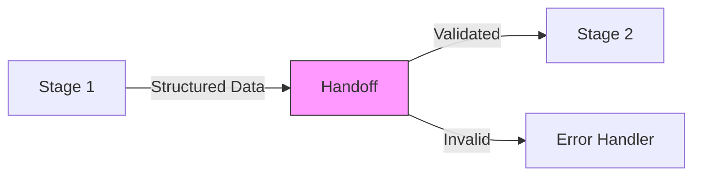
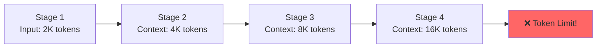

# Stage Handoff Strategies

## Introduction

The transitions between pipeline stages—**handoffs**—are where chains often break. A stage might produce perfect output, but if that output isn't properly formatted, extracted, or passed to the next stage, the entire pipeline fails. Mastering stage handoffs is what separates fragile chains from production-ready pipelines.

This lesson covers the essential strategies for reliable data transfer between stages, including structured output formats, context management, and error propagation techniques that keep your pipelines robust.

### What We'll Cover

- Structured output formats for reliable handoffs
- Extracting specific portions from stage outputs
- Context summarization to manage token budgets
- Error handling and propagation between stages
- State management across pipeline execution

### Prerequisites

- Understanding of pipeline design patterns (previous lesson)
- Familiarity with JSON Schema and structured outputs
- Experience with error handling in Python
- Basic understanding of LLM context windows

---

## The Handoff Problem

When one stage's output becomes another stage's input, several things can go wrong:

| Problem | Consequence |
|---------|-------------|
| Malformed output | Next stage receives invalid input and fails |
| Missing fields | Downstream logic breaks on `KeyError` |
| Excess context | Token limits exceeded, costs increase |
| Lost information | Critical details don't make it through |
| Error confusion | Unclear which stage caused a failure |



A well-designed handoff ensures:
1. **Reliability**: Data always arrives in the expected format
2. **Efficiency**: Only necessary information is passed forward
3. **Traceability**: Errors can be traced to their source
4. **Resilience**: Failures are handled gracefully

---

## Structured Output Formats

The foundation of reliable handoffs is **structured output**. Instead of passing freeform text between stages, use formats that can be validated and parsed programmatically.

### JSON as the Standard

JSON is the de facto standard for stage handoffs because:
- Native support from all major LLM providers
- Easy to validate with JSON Schema
- Parseable in any programming language
- Human-readable for debugging

```python
from openai import OpenAI
import json

client = OpenAI()


def stage_with_structured_output(
    system_prompt: str,
    user_input: str,
    output_schema: dict
) -> dict:
    """Execute stage with guaranteed JSON output."""
    
    # Enhance prompt with schema requirements
    enhanced_prompt = f"""{system_prompt}
    
You MUST return a valid JSON object matching this schema:
{json.dumps(output_schema, indent=2)}

Return ONLY the JSON object, no additional text."""

    response = client.chat.completions.create(
        model="gpt-4o",
        messages=[
            {"role": "system", "content": enhanced_prompt},
            {"role": "user", "content": user_input}
        ],
        response_format={"type": "json_object"}
    )
    
    return json.loads(response.choices[0].message.content)
```

### Using JSON Schema for Validation

Define explicit schemas for each stage's output to catch errors immediately:

```python
# Schema for entity extraction stage
EXTRACTION_SCHEMA = {
    "type": "object",
    "required": ["entities", "relationships", "metadata"],
    "properties": {
        "entities": {
            "type": "array",
            "items": {
                "type": "object",
                "required": ["name", "type"],
                "properties": {
                    "name": {"type": "string"},
                    "type": {"type": "string", "enum": ["person", "org", "location", "date"]},
                    "confidence": {"type": "number", "minimum": 0, "maximum": 1}
                }
            }
        },
        "relationships": {
            "type": "array",
            "items": {
                "type": "object",
                "required": ["source", "target", "relation"],
                "properties": {
                    "source": {"type": "string"},
                    "target": {"type": "string"},
                    "relation": {"type": "string"}
                }
            }
        },
        "metadata": {
            "type": "object",
            "properties": {
                "entity_count": {"type": "integer"},
                "extraction_confidence": {"type": "number"}
            }
        }
    }
}
```

### Validating Outputs

```python
from jsonschema import validate, ValidationError


def validated_handoff(output: str, schema: dict) -> dict:
    """Validate stage output against schema before handoff."""
    try:
        data = json.loads(output)
    except json.JSONDecodeError as e:
        raise HandoffError(f"Invalid JSON: {e}")
    
    try:
        validate(instance=data, schema=schema)
    except ValidationError as e:
        raise HandoffError(f"Schema validation failed: {e.message}")
    
    return data


class HandoffError(Exception):
    """Error during stage handoff."""
    def __init__(self, message: str, stage: str = None, recoverable: bool = True):
        super().__init__(message)
        self.stage = stage
        self.recoverable = recoverable
```

> **Tip:** OpenAI's `response_format={"type": "json_object"}` enforces valid JSON output, but doesn't guarantee schema compliance. Always validate against your schema.

---

## XML for Complex Handoffs

For handoffs involving mixed content (code, text, structured data), **XML tags** provide cleaner boundaries than JSON:

```python
def xml_structured_stage(content: str) -> dict:
    """Stage that returns XML-structured output."""
    
    prompt = """Analyze this content and return your response in XML format:
    
<analysis>
    <summary>Brief summary here</summary>
    <key_points>
        <point priority="high">First key point</point>
        <point priority="medium">Second key point</point>
    </key_points>
    <code_samples>
        <sample language="python">
            <description>What this code does</description>
            <code><![CDATA[
def example():
    pass
            ]]></code>
        </sample>
    </code_samples>
</analysis>
"""
    
    response = execute_stage(prompt, content)
    return parse_xml_response(response)


import xml.etree.ElementTree as ET

def parse_xml_response(xml_string: str) -> dict:
    """Parse XML response into structured data."""
    # Extract XML from response (in case of wrapper text)
    start = xml_string.find("<analysis>")
    end = xml_string.find("</analysis>") + len("</analysis>")
    xml_content = xml_string[start:end]
    
    root = ET.fromstring(xml_content)
    
    return {
        "summary": root.find("summary").text,
        "key_points": [
            {"text": p.text, "priority": p.get("priority")}
            for p in root.findall(".//point")
        ],
        "code_samples": [
            {
                "language": s.get("language"),
                "description": s.find("description").text,
                "code": s.find("code").text.strip()
            }
            for s in root.findall(".//sample")
        ]
    }
```

### When to Use XML vs JSON

| Format | Best For |
|--------|----------|
| **JSON** | API integration, simple structured data, machine-to-machine |
| **XML** | Mixed content, code blocks, nested text with attributes |

---

## Extracting Portions for Handoff

Not everything from one stage needs to go to the next. Selective extraction keeps handoffs lean and focused.

### Field Selection

```python
def selective_handoff(stage_output: dict, fields: list[str]) -> dict:
    """Extract only specified fields for handoff."""
    return {
        field: stage_output.get(field)
        for field in fields
        if field in stage_output
    }


# Example usage
full_analysis = {
    "raw_text": "... very long original text ...",
    "entities": [...],
    "sentiment": {"score": 0.8, "label": "positive"},
    "metadata": {"tokens": 5000, "processing_time": 1.2},
    "debug_info": {"model": "gpt-4o", "temperature": 0.7}
}

# Only pass what next stage needs
handoff_data = selective_handoff(
    full_analysis, 
    ["entities", "sentiment"]
)
# Result: {"entities": [...], "sentiment": {...}}
```

### Computed Extractions

Sometimes you need to transform or compute values for the handoff:

```python
def computed_handoff(stage_output: dict) -> dict:
    """Compute derived values for handoff."""
    entities = stage_output.get("entities", [])
    
    return {
        # Pass raw data
        "entities": entities,
        
        # Compute aggregations
        "entity_count": len(entities),
        "entity_types": list(set(e["type"] for e in entities)),
        "high_confidence_only": [
            e for e in entities 
            if e.get("confidence", 0) > 0.8
        ],
        
        # Add context for next stage
        "processing_note": f"Extracted {len(entities)} entities"
    }
```

---

## Context Summarization

As pipelines grow, accumulated context can exceed token limits. **Context summarization** compresses information while preserving what matters.

### The Context Growth Problem



### Summarization Strategies

**Strategy 1: Rolling Summary**

Maintain a compressed summary that updates with each stage:

```python
def rolling_summary_handoff(
    current_summary: str,
    new_stage_output: str,
    max_tokens: int = 500
) -> str:
    """Update rolling summary with new stage output."""
    
    prompt = f"""You are maintaining a rolling summary across pipeline stages.

Current Summary:
{current_summary}

New Stage Output:
{new_stage_output}

Create an updated summary that:
1. Preserves critical information from the current summary
2. Incorporates key findings from the new stage
3. Stays under {max_tokens} tokens
4. Prioritizes actionable information

Return only the updated summary."""

    response = execute_stage(prompt, "")
    return response
```

**Strategy 2: Hierarchical Summarization**

Summarize at different levels of detail:

```python
def hierarchical_handoff(full_output: dict) -> dict:
    """Create multi-level summary for flexible handoff."""
    
    # Level 1: Executive summary (very brief)
    executive = execute_stage(
        "Create a 1-sentence executive summary of these findings.",
        json.dumps(full_output)
    )
    
    # Level 2: Key points (moderate detail)
    key_points = execute_stage(
        "Extract the 5 most important points. Return as JSON array.",
        json.dumps(full_output)
    )
    
    return {
        "executive_summary": executive,
        "key_points": json.loads(key_points),
        "full_data": full_output  # Keep full data available
    }


# Next stage can choose appropriate detail level
def adaptive_stage(handoff: dict, detail_needed: str = "key_points"):
    """Stage that adapts to available detail level."""
    
    if detail_needed == "executive":
        context = handoff["executive_summary"]
    elif detail_needed == "key_points":
        context = json.dumps(handoff["key_points"])
    else:
        context = json.dumps(handoff["full_data"])
    
    return execute_stage("Process this information...", context)
```

**Strategy 3: Selective Context Windows**

Keep only recent context plus a persistent summary:

```python
@dataclass
class PipelineContext:
    """Manages context across pipeline stages."""
    persistent_summary: str = ""
    recent_stages: list[dict] = None
    max_recent: int = 2
    
    def __post_init__(self):
        if self.recent_stages is None:
            self.recent_stages = []
    
    def add_stage_result(self, stage_name: str, result: dict):
        """Add a stage result, maintaining context window."""
        self.recent_stages.append({
            "stage": stage_name,
            "result": result
        })
        
        # Keep only recent stages
        if len(self.recent_stages) > self.max_recent:
            old_stage = self.recent_stages.pop(0)
            self._update_persistent_summary(old_stage)
    
    def _update_persistent_summary(self, old_stage: dict):
        """Incorporate old stage into persistent summary."""
        self.persistent_summary = rolling_summary_handoff(
            self.persistent_summary,
            json.dumps(old_stage)
        )
    
    def get_context_for_stage(self) -> str:
        """Get combined context for next stage."""
        return f"""
Background Summary:
{self.persistent_summary}

Recent Processing:
{json.dumps(self.recent_stages, indent=2)}
"""
```

---

## Error Handling and Propagation

Robust pipelines need clear strategies for handling errors at handoff points.

### Error Types

| Error Type | Cause | Handling Strategy |
|------------|-------|-------------------|
| **Parse Error** | Invalid JSON/XML | Retry with clearer format instructions |
| **Validation Error** | Missing required fields | Retry or fill defaults |
| **Content Error** | Logically invalid data | Escalate for human review |
| **Timeout** | Stage took too long | Retry with shorter input |
| **Rate Limit** | API throttling | Exponential backoff |

### Structured Error Handling

```python
from enum import Enum
from dataclasses import dataclass
from typing import Optional


class ErrorSeverity(Enum):
    WARNING = "warning"      # Continue with degraded data
    RECOVERABLE = "recoverable"  # Can retry
    FATAL = "fatal"          # Must stop pipeline


@dataclass
class StageError:
    stage_name: str
    error_type: str
    message: str
    severity: ErrorSeverity
    original_input: Optional[str] = None
    partial_output: Optional[dict] = None
    retry_count: int = 0


class PipelineErrorHandler:
    """Centralized error handling for pipeline stages."""
    
    def __init__(self, max_retries: int = 3):
        self.max_retries = max_retries
        self.errors: list[StageError] = []
    
    def handle_handoff_error(
        self, 
        error: Exception, 
        stage_name: str,
        input_data: str,
        output_data: str = None
    ) -> tuple[bool, Optional[dict]]:
        """
        Handle an error during handoff.
        Returns: (should_retry, fallback_data)
        """
        
        if isinstance(error, json.JSONDecodeError):
            stage_error = StageError(
                stage_name=stage_name,
                error_type="parse_error",
                message=str(error),
                severity=ErrorSeverity.RECOVERABLE,
                original_input=input_data
            )
        elif isinstance(error, ValidationError):
            # Try to extract partial valid data
            partial = self._extract_partial_valid(output_data)
            stage_error = StageError(
                stage_name=stage_name,
                error_type="validation_error",
                message=str(error),
                severity=ErrorSeverity.WARNING if partial else ErrorSeverity.RECOVERABLE,
                partial_output=partial
            )
        else:
            stage_error = StageError(
                stage_name=stage_name,
                error_type="unknown",
                message=str(error),
                severity=ErrorSeverity.FATAL
            )
        
        self.errors.append(stage_error)
        
        # Determine action
        if stage_error.severity == ErrorSeverity.FATAL:
            return False, None
        elif stage_error.severity == ErrorSeverity.WARNING:
            return False, stage_error.partial_output
        else:
            return stage_error.retry_count < self.max_retries, None
    
    def _extract_partial_valid(self, output: str) -> Optional[dict]:
        """Attempt to extract any valid data from malformed output."""
        try:
            # Try to find and parse JSON objects in the output
            import re
            json_pattern = r'\{[^{}]*\}'
            matches = re.findall(json_pattern, output)
            for match in matches:
                try:
                    return json.loads(match)
                except:
                    continue
        except:
            pass
        return None
```

### Error Propagation Patterns

**Pattern 1: Fail Fast**

Stop immediately on any error:

```python
def fail_fast_pipeline(input_data: str, stages: list) -> dict:
    """Pipeline that stops on first error."""
    current_data = input_data
    
    for stage in stages:
        try:
            current_data = execute_validated_stage(stage, current_data)
        except Exception as e:
            raise PipelineError(
                f"Pipeline failed at stage '{stage['name']}': {e}",
                failed_stage=stage['name'],
                partial_results=current_data
            )
    
    return current_data
```

**Pattern 2: Continue with Defaults**

Fill missing data and continue:

```python
def resilient_pipeline(input_data: str, stages: list) -> dict:
    """Pipeline that continues with defaults on recoverable errors."""
    current_data = input_data
    warnings = []
    
    for stage in stages:
        try:
            current_data = execute_validated_stage(stage, current_data)
        except RecoverableError as e:
            warnings.append(f"Stage '{stage['name']}': {e}")
            current_data = apply_defaults(current_data, stage['defaults'])
        except FatalError:
            raise
    
    return {"result": current_data, "warnings": warnings}
```

**Pattern 3: Error Accumulation**

Collect all errors for batch review:

```python
def batch_error_pipeline(input_data: str, stages: list) -> dict:
    """Pipeline that accumulates errors for batch handling."""
    current_data = input_data
    errors = []
    
    for stage in stages:
        result, stage_errors = execute_stage_with_error_capture(stage, current_data)
        errors.extend(stage_errors)
        current_data = result or current_data
    
    if any(e.severity == ErrorSeverity.FATAL for e in errors):
        raise BatchPipelineError(errors)
    
    return {
        "result": current_data,
        "errors": [e.to_dict() for e in errors]
    }
```

---

## State Management

Complex pipelines need to track state across stages for debugging, resumption, and audit.

### Pipeline State Object

```python
from dataclasses import dataclass, field
from datetime import datetime
from typing import Any
import uuid


@dataclass
class PipelineState:
    """Tracks complete state of a pipeline execution."""
    
    pipeline_id: str = field(default_factory=lambda: str(uuid.uuid4()))
    started_at: datetime = field(default_factory=datetime.now)
    current_stage: int = 0
    status: str = "running"
    
    # Stage tracking
    stage_inputs: dict[str, Any] = field(default_factory=dict)
    stage_outputs: dict[str, Any] = field(default_factory=dict)
    stage_timings: dict[str, float] = field(default_factory=dict)
    
    # Error tracking
    errors: list[StageError] = field(default_factory=list)
    
    # Context management
    context: PipelineContext = field(default_factory=PipelineContext)
    
    def record_stage_start(self, stage_name: str, input_data: Any):
        """Record the start of a stage."""
        self.current_stage += 1
        self.stage_inputs[stage_name] = input_data
        self._stage_start_time = datetime.now()
    
    def record_stage_complete(self, stage_name: str, output_data: Any):
        """Record successful stage completion."""
        self.stage_outputs[stage_name] = output_data
        self.stage_timings[stage_name] = (
            datetime.now() - self._stage_start_time
        ).total_seconds()
        self.context.add_stage_result(stage_name, output_data)
    
    def record_error(self, error: StageError):
        """Record a stage error."""
        self.errors.append(error)
        if error.severity == ErrorSeverity.FATAL:
            self.status = "failed"
    
    def to_checkpoint(self) -> dict:
        """Create a checkpoint for pipeline resumption."""
        return {
            "pipeline_id": self.pipeline_id,
            "current_stage": self.current_stage,
            "stage_outputs": self.stage_outputs,
            "context": {
                "persistent_summary": self.context.persistent_summary,
                "recent_stages": self.context.recent_stages
            }
        }
    
    @classmethod
    def from_checkpoint(cls, checkpoint: dict) -> "PipelineState":
        """Resume pipeline from checkpoint."""
        state = cls(pipeline_id=checkpoint["pipeline_id"])
        state.current_stage = checkpoint["current_stage"]
        state.stage_outputs = checkpoint["stage_outputs"]
        state.context.persistent_summary = checkpoint["context"]["persistent_summary"]
        state.context.recent_stages = checkpoint["context"]["recent_stages"]
        state.status = "resumed"
        return state
```

### Checkpointing for Long Pipelines

```python
def resumable_pipeline(
    stages: list[dict],
    input_data: str,
    checkpoint: dict = None
) -> dict:
    """Pipeline with checkpoint/resume capability."""
    
    if checkpoint:
        state = PipelineState.from_checkpoint(checkpoint)
        start_stage = state.current_stage
        current_data = state.stage_outputs.get(
            stages[start_stage - 1]["name"], 
            input_data
        )
    else:
        state = PipelineState()
        start_stage = 0
        current_data = input_data
    
    try:
        for i, stage in enumerate(stages[start_stage:], start=start_stage):
            state.record_stage_start(stage["name"], current_data)
            
            result = execute_stage(stage["prompt"], current_data)
            validated = validated_handoff(result, stage["schema"])
            
            state.record_stage_complete(stage["name"], validated)
            current_data = json.dumps(validated)
            
            # Save checkpoint after each stage
            save_checkpoint(state.to_checkpoint())
        
        state.status = "completed"
        return {"result": json.loads(current_data), "state": state}
        
    except Exception as e:
        state.record_error(StageError(
            stage_name=stage["name"],
            error_type=type(e).__name__,
            message=str(e),
            severity=ErrorSeverity.FATAL
        ))
        # Save checkpoint for later resumption
        save_checkpoint(state.to_checkpoint())
        raise
```

---

## Best Practices Summary

| Aspect | Best Practice |
|--------|---------------|
| **Format** | Use JSON with explicit schemas; XML for mixed content |
| **Validation** | Validate every handoff against defined schema |
| **Context** | Summarize progressively; don't accumulate indefinitely |
| **Extraction** | Pass only what the next stage needs |
| **Errors** | Define error types and recovery strategies upfront |
| **State** | Track inputs, outputs, and timing for every stage |
| **Checkpoints** | Enable resumption for long-running pipelines |

---

## Summary

✅ **Structured outputs** (JSON/XML) are essential for reliable handoffs

✅ **Schema validation** catches errors immediately at handoff points

✅ **Selective extraction** keeps handoffs lean and focused

✅ **Context summarization** prevents token limit issues in long pipelines

✅ **Error classification** enables appropriate recovery strategies

✅ **State management** provides debugging, resumption, and audit capability

**Next:** [Common Pipeline Patterns](./03-common-pipeline-patterns.md)

---

## Further Reading

- [OpenAI Structured Outputs](https://platform.openai.com/docs/guides/structured-outputs) — JSON mode and schema enforcement
- [Anthropic: Use XML Tags](https://docs.anthropic.com/en/docs/build-with-claude/prompt-engineering/use-xml-tags) — XML for structured prompts
- [JSON Schema Documentation](https://json-schema.org/) — Schema definition reference
- [Previous: Pipeline Design Patterns](./01-pipeline-design-patterns.md)

---

<!-- 
Sources Consulted:
- OpenAI Prompt Engineering Guide: https://platform.openai.com/docs/guides/prompt-engineering
- Anthropic Prompt Engineering Overview: https://platform.claude.com/docs/en/docs/build-with-claude/prompt-engineering/overview
- OpenAI Cookbook Orchestrating Agents: https://cookbook.openai.com/examples/orchestrating_agents
-->
