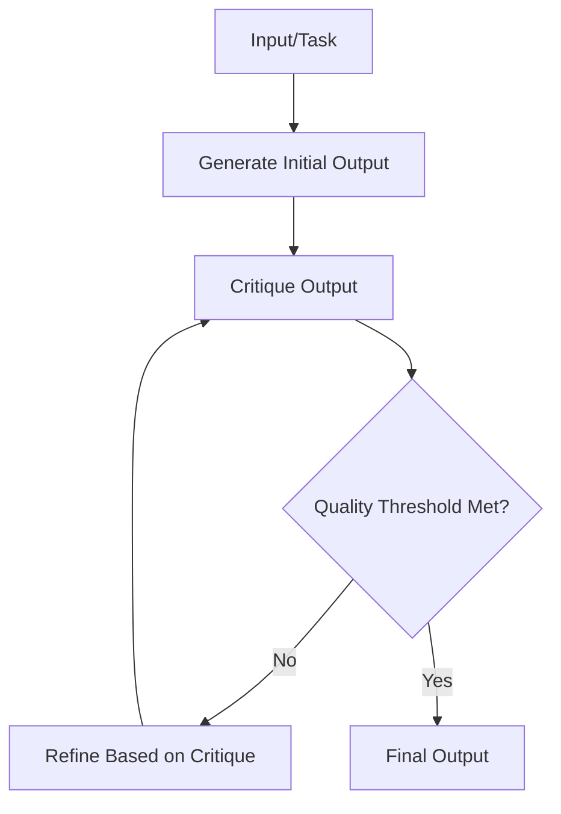
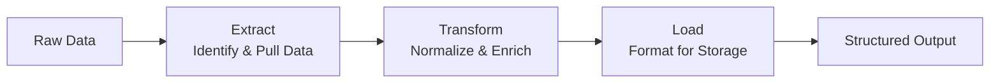
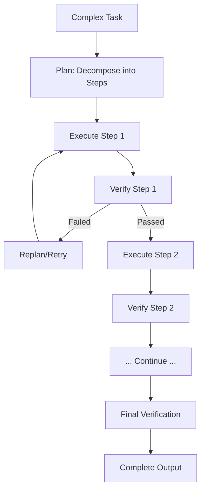
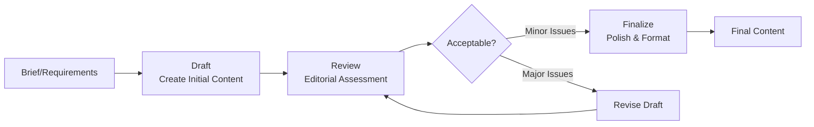
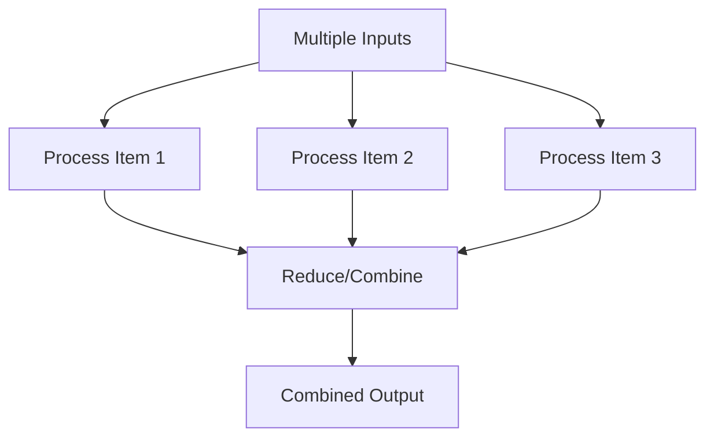

# Common Pipeline Patterns

## Introduction

After mastering pipeline design and stage handoffs, you need a repertoire of **battle-tested patterns** that solve common problems. These patterns have emerged from real-world AI applications and represent proven solutions for content creation, data processing, decision support, and quality assurance workflows.

This lesson covers the most widely-used prompt chaining patterns you'll encounter and implement in production systems.

### What We'll Cover

- Generate → Critique → Refine: Self-improving content
- Extract → Transform → Load (ETL): Data processing pipelines  
- Plan → Execute → Verify: Task decomposition workflows
- Draft → Review → Finalize: Multi-stage content creation
- Other essential patterns and when to apply them

### Prerequisites

- Understanding of pipeline design patterns
- Familiarity with stage handoff strategies
- Experience with LLM API calls in Python

---

## Generate → Critique → Refine (GCR)

The **Generate-Critique-Refine** pattern uses the LLM to review and improve its own output. This creates a self-correction loop that dramatically improves quality without human intervention.

### Pattern Diagram



### Why This Pattern Works

| Benefit | Explanation |
|---------|-------------|
| **Fresh perspective** | Critique prompt approaches output as a reviewer, not creator |
| **Explicit feedback** | Issues are articulated before attempting fixes |
| **Targeted improvement** | Refinement focuses on specific identified problems |
| **Controllable quality** | Set thresholds appropriate to your use case |

### Implementation

```python
from openai import OpenAI
import json

client = OpenAI()


def generate_critique_refine(
    task: str,
    max_iterations: int = 3,
    quality_threshold: float = 0.85
) -> dict:
    """
    Generate content with self-critique and refinement.
    
    Returns:
        dict with 'output', 'iterations', 'final_score', 'critique_history'
    """
    critique_history = []
    
    # Stage 1: Generate initial output
    generate_prompt = f"""Complete the following task to the best of your ability.
    
Task: {task}

Provide a comprehensive, well-structured response."""

    current_output = execute_stage(generate_prompt, "")
    print("📝 Initial generation complete")
    
    for iteration in range(max_iterations):
        # Stage 2: Critique
        critique_prompt = f"""You are a critical reviewer. Evaluate this output for the task: "{task}"

OUTPUT TO REVIEW:
{current_output}

Provide your critique as JSON:
{{
    "quality_score": <float 0.0-1.0>,
    "strengths": ["list of what works well"],
    "weaknesses": ["specific issues to address"],
    "suggestions": ["concrete improvement actions"],
    "critical_issues": <boolean - any fundamental problems?>
}}"""

        critique = execute_stage(critique_prompt, "")
        critique_data = json.loads(critique)
        critique_history.append(critique_data)
        
        quality_score = critique_data["quality_score"]
        print(f"🔍 Iteration {iteration + 1}: Score = {quality_score:.2f}")
        
        # Check if quality threshold met
        if quality_score >= quality_threshold:
            print(f"✅ Quality threshold met!")
            return {
                "output": current_output,
                "iterations": iteration + 1,
                "final_score": quality_score,
                "critique_history": critique_history
            }
        
        # Stage 3: Refine based on critique
        refine_prompt = f"""Improve your previous response based on this feedback.

ORIGINAL TASK: {task}

YOUR PREVIOUS OUTPUT:
{current_output}

CRITIQUE RECEIVED:
Weaknesses: {json.dumps(critique_data["weaknesses"])}
Suggestions: {json.dumps(critique_data["suggestions"])}

Create an improved version that addresses ALL the weaknesses and incorporates the suggestions.
Maintain the strengths from the original: {json.dumps(critique_data["strengths"])}"""

        current_output = execute_stage(refine_prompt, "")
        print(f"🔄 Refinement {iteration + 1} complete")
    
    # Final quality check
    final_critique = json.loads(execute_stage(critique_prompt.replace(current_output, current_output), ""))
    
    return {
        "output": current_output,
        "iterations": max_iterations,
        "final_score": final_critique["quality_score"],
        "critique_history": critique_history + [final_critique]
    }
```

**Output:**
```
📝 Initial generation complete
🔍 Iteration 1: Score = 0.72
🔄 Refinement 1 complete
🔍 Iteration 2: Score = 0.81
🔄 Refinement 2 complete
🔍 Iteration 3: Score = 0.89
✅ Quality threshold met!
```

### Critique Dimensions

Customize critique criteria for your domain:

| Domain | Critique Dimensions |
|--------|---------------------|
| **Technical Writing** | Accuracy, completeness, clarity, examples, formatting |
| **Marketing Copy** | Hook strength, benefits focus, call-to-action, tone, length |
| **Code Generation** | Correctness, efficiency, readability, edge cases, documentation |
| **Research Summary** | Source accuracy, balanced perspective, key findings, citations |

```python
TECHNICAL_CRITIQUE_PROMPT = """Evaluate this technical documentation:

Score each dimension 0.0-1.0:
- accuracy: Are all technical claims correct?
- completeness: Are all necessary topics covered?
- clarity: Is the explanation easy to follow?
- examples: Are there helpful, working examples?
- formatting: Is the structure logical with proper headings?

Return JSON with dimension scores and overall_score (weighted average)."""
```

> **🤖 AI Context:** The GCR pattern is how many AI writing assistants achieve high-quality output—they generate, self-critique, and refine behind the scenes before showing you the result.

---

## Extract → Transform → Load (ETL)

The **ETL pattern** processes unstructured data through a structured pipeline, converting raw content into clean, normalized, queryable data.

### Pattern Diagram



### When to Use ETL

| Use Case | Example |
|----------|---------|
| Document processing | Extract invoice data from PDFs |
| Log analysis | Parse and categorize log entries |
| Content migration | Convert legacy content to new format |
| Data entry automation | Structure form submissions |
| Research compilation | Normalize data from multiple sources |

### Implementation

```python
def etl_pipeline(raw_content: str, target_schema: dict) -> dict:
    """
    Extract, Transform, and Load unstructured content into structured data.
    """
    
    # Stage 1: EXTRACT - Identify and pull raw data
    extract_prompt = f"""Extract all relevant data from this content.

CONTENT:
{raw_content}

Identify and extract:
- Named entities (people, organizations, locations, dates)
- Numerical values with their units
- Key-value pairs
- Categories or classifications
- Relationships between entities

Return as JSON with 'extracted_data' containing categorized lists."""

    extracted = execute_stage(extract_prompt, "")
    extracted_data = json.loads(extracted)
    print(f"📥 Extracted {len(extracted_data.get('extracted_data', {}))} data categories")
    
    # Stage 2: TRANSFORM - Normalize and enrich
    transform_prompt = f"""Transform this extracted data into a normalized format.

EXTRACTED DATA:
{json.dumps(extracted_data, indent=2)}

Transformations to apply:
1. Normalize dates to ISO 8601 format (YYYY-MM-DD)
2. Convert all currencies to USD with original noted
3. Standardize phone numbers to E.164 format
4. Resolve entity references (he/she → actual name)
5. Calculate any derived values (totals, percentages)
6. Add confidence scores for uncertain extractions
7. Flag any data quality issues

Return JSON with 'transformed_data' and 'data_quality_flags'."""

    transformed = execute_stage(transform_prompt, "")
    transformed_data = json.loads(transformed)
    print(f"🔄 Transformation complete, {len(transformed_data.get('data_quality_flags', []))} quality flags")
    
    # Stage 3: LOAD - Format for target schema
    load_prompt = f"""Format this data to match the target schema exactly.

TRANSFORMED DATA:
{json.dumps(transformed_data['transformed_data'], indent=2)}

TARGET SCHEMA:
{json.dumps(target_schema, indent=2)}

Requirements:
1. Map all available data to schema fields
2. Use null for missing required fields (list them in 'missing_fields')
3. Ignore data that doesn't fit the schema (list in 'unmapped_data')
4. Validate all field types match schema expectations
5. Add 'validation_status': 'valid', 'partial', or 'invalid'

Return the formatted record matching the schema plus metadata."""

    loaded = execute_stage(load_prompt, "")
    final_data = json.loads(loaded)
    print(f"📤 Load complete: {final_data.get('validation_status', 'unknown')}")
    
    return {
        "record": final_data,
        "extraction_summary": extracted_data,
        "transformations": transformed_data.get("data_quality_flags", [])
    }


# Example usage
invoice_schema = {
    "type": "object",
    "required": ["vendor", "invoice_number", "date", "total"],
    "properties": {
        "vendor": {"type": "string"},
        "invoice_number": {"type": "string"},
        "date": {"type": "string", "format": "date"},
        "line_items": {
            "type": "array",
            "items": {
                "type": "object",
                "properties": {
                    "description": {"type": "string"},
                    "quantity": {"type": "number"},
                    "unit_price": {"type": "number"},
                    "amount": {"type": "number"}
                }
            }
        },
        "subtotal": {"type": "number"},
        "tax": {"type": "number"},
        "total": {"type": "number"}
    }
}

result = etl_pipeline(invoice_text, invoice_schema)
```

### ETL Best Practices

| Stage | Best Practice |
|-------|---------------|
| **Extract** | Over-extract initially; filter in Transform |
| **Transform** | Define clear normalization rules upfront |
| **Load** | Validate against schema before inserting |
| **All** | Log data lineage for debugging |

---

## Plan → Execute → Verify (PEV)

The **Plan-Execute-Verify** pattern decomposes complex tasks into sub-tasks, executes each systematically, and verifies the results. It's essential for agentic workflows and multi-step problem-solving.

### Pattern Diagram



### When to Use PEV

| Scenario | Why PEV Helps |
|----------|---------------|
| Multi-step research | Each source needs verification |
| Complex calculations | Intermediate results need checking |
| Data analysis | Each analysis phase builds on previous |
| Content creation | Outline → Draft → Edit needs quality gates |
| Automated tasks | Actions need verification before continuing |

### Implementation

```python
from dataclasses import dataclass
from typing import Callable, Optional


@dataclass
class PlanStep:
    description: str
    execute_prompt: str
    verify_prompt: str
    max_retries: int = 2
    dependencies: list[int] = None  # Indices of steps this depends on


def plan_execute_verify(task: str, context: str = "") -> dict:
    """
    Decompose task into steps, execute each with verification.
    """
    
    # Stage 1: PLAN - Decompose into steps
    plan_prompt = f"""Create a detailed execution plan for this task.

TASK: {task}

CONTEXT:
{context}

Break this into concrete, executable steps. For each step, specify:
1. What exactly needs to be done
2. What inputs it needs (from context or previous steps)
3. What outputs it should produce
4. How to verify it succeeded

Return JSON:
{{
    "goal": "overall objective",
    "steps": [
        {{
            "step_number": 1,
            "description": "what this step does",
            "inputs": ["required inputs"],
            "expected_output": "what should result",
            "success_criteria": "how to verify success",
            "dependencies": []
        }}
    ],
    "final_verification": "how to verify overall task completion"
}}"""

    plan = json.loads(execute_stage(plan_prompt, ""))
    print(f"📋 Plan created: {len(plan['steps'])} steps")
    
    # Stage 2: EXECUTE & VERIFY each step
    step_results = {}
    
    for step in plan["steps"]:
        step_num = step["step_number"]
        print(f"\n🔧 Executing Step {step_num}: {step['description']}")
        
        # Gather inputs from dependencies
        dependency_context = ""
        for dep_idx in step.get("dependencies", []):
            if dep_idx in step_results:
                dependency_context += f"\nStep {dep_idx} Result:\n{json.dumps(step_results[dep_idx])}\n"
        
        # Execute with retries
        for attempt in range(step.get("max_retries", 2) + 1):
            # Execute
            execute_prompt = f"""Execute this step of the plan.

STEP: {step['description']}
EXPECTED OUTPUT: {step['expected_output']}

ORIGINAL CONTEXT:
{context}

RESULTS FROM PREVIOUS STEPS:
{dependency_context}

Complete this step and return the result."""

            result = execute_stage(execute_prompt, "")
            
            # Verify
            verify_prompt = f"""Verify if this step was completed successfully.

STEP DESCRIPTION: {step['description']}
SUCCESS CRITERIA: {step['success_criteria']}
EXPECTED OUTPUT: {step['expected_output']}

ACTUAL RESULT:
{result}

Return JSON:
{{
    "passed": true/false,
    "score": 0.0-1.0,
    "issues": ["any problems found"],
    "recommendations": ["improvements if failed"]
}}"""

            verification = json.loads(execute_stage(verify_prompt, ""))
            
            if verification["passed"]:
                print(f"   ✅ Step {step_num} verified (score: {verification['score']:.2f})")
                step_results[step_num] = {
                    "result": result,
                    "verification": verification,
                    "attempts": attempt + 1
                }
                break
            else:
                print(f"   ⚠️ Attempt {attempt + 1} failed: {verification['issues']}")
                if attempt == step.get("max_retries", 2):
                    step_results[step_num] = {
                        "result": result,
                        "verification": verification,
                        "failed": True,
                        "attempts": attempt + 1
                    }
    
    # Stage 3: Final verification
    all_results = json.dumps({k: v["result"] for k, v in step_results.items()}, indent=2)
    
    final_verify_prompt = f"""Verify the overall task completion.

ORIGINAL TASK: {task}
VERIFICATION CRITERIA: {plan['final_verification']}

ALL STEP RESULTS:
{all_results}

Return JSON:
{{
    "task_completed": true/false,
    "completeness_score": 0.0-1.0,
    "summary": "what was accomplished",
    "gaps": ["anything missing or incomplete"]
}}"""

    final_verification = json.loads(execute_stage(final_verify_prompt, ""))
    print(f"\n📊 Final verification: {final_verification['completeness_score']:.0%} complete")
    
    return {
        "plan": plan,
        "step_results": step_results,
        "final_verification": final_verification,
        "success": final_verification["task_completed"]
    }
```

---

## Draft → Review → Finalize (DRF)

The **Draft-Review-Finalize** pattern mirrors traditional editorial workflows, making it ideal for content that needs human-like quality assurance.

### Pattern Diagram



### Implementation

```python
def draft_review_finalize(
    brief: str,
    content_type: str = "article",
    style_guide: str = "",
    max_revisions: int = 2
) -> dict:
    """
    Create content through draft, review, and finalization stages.
    """
    
    # Stage 1: DRAFT
    draft_prompt = f"""Create a {content_type} based on this brief.

BRIEF:
{brief}

STYLE GUIDE:
{style_guide if style_guide else "Use clear, professional language."}

Create a complete first draft. Focus on:
- Covering all requirements from the brief
- Clear structure and flow
- Appropriate tone and voice

Return your draft (not in JSON, just the content)."""

    draft = execute_stage(draft_prompt, "")
    print(f"📝 Draft created ({len(draft.split())} words)")
    revision_history = [{"version": "draft", "content": draft}]
    
    # Stage 2: REVIEW (with potential revisions)
    current_content = draft
    
    for revision in range(max_revisions + 1):
        review_prompt = f"""Review this {content_type} as a professional editor.

ORIGINAL BRIEF:
{brief}

STYLE GUIDE:
{style_guide if style_guide else "Use clear, professional language."}

CONTENT TO REVIEW:
{current_content}

Provide editorial review as JSON:
{{
    "overall_quality": 0.0-1.0,
    "recommendation": "approve" | "minor_revisions" | "major_revisions",
    "structural_issues": ["list of structure/organization problems"],
    "content_issues": ["list of factual/completeness problems"],
    "style_issues": ["list of tone/voice/grammar problems"],
    "specific_edits": [
        {{"location": "where", "issue": "problem", "suggestion": "fix"}}
    ],
    "strengths": ["what works well"]
}}"""

        review = json.loads(execute_stage(review_prompt, ""))
        print(f"🔍 Review complete: {review['recommendation']} (quality: {review['overall_quality']:.2f})")
        
        if review["recommendation"] == "approve":
            break
        elif review["recommendation"] == "minor_revisions" and revision == max_revisions:
            # Accept minor issues on final revision
            break
        else:
            # Revise based on feedback
            revise_prompt = f"""Revise this {content_type} based on editorial feedback.

ORIGINAL BRIEF: {brief}

CURRENT VERSION:
{current_content}

EDITORIAL FEEDBACK:
Structural Issues: {json.dumps(review['structural_issues'])}
Content Issues: {json.dumps(review['content_issues'])}
Style Issues: {json.dumps(review['style_issues'])}
Specific Edits: {json.dumps(review['specific_edits'])}

Create a revised version addressing ALL feedback while maintaining strengths:
{json.dumps(review['strengths'])}

Return the revised content (not JSON, just the content)."""

            current_content = execute_stage(revise_prompt, "")
            revision_history.append({
                "version": f"revision_{revision + 1}",
                "content": current_content,
                "addressed": review
            })
            print(f"🔄 Revision {revision + 1} complete")
    
    # Stage 3: FINALIZE
    finalize_prompt = f"""Apply final polish to this {content_type}.

CONTENT:
{current_content}

STYLE GUIDE:
{style_guide if style_guide else "Use clear, professional language."}

Final polish tasks:
1. Fix any remaining grammar/spelling issues
2. Ensure consistent formatting throughout
3. Optimize sentence structure for readability
4. Verify all requirements from brief are addressed
5. Add any missing transitions or connectors
6. Format appropriately for final delivery

Return the finalized content (not JSON, just the content)."""

    final_content = execute_stage(finalize_prompt, "")
    print(f"✅ Finalized ({len(final_content.split())} words)")
    
    return {
        "final_content": final_content,
        "word_count": len(final_content.split()),
        "revision_count": len(revision_history) - 1,
        "final_quality": review["overall_quality"],
        "history": revision_history
    }
```

---

## Other Essential Patterns

### Map-Reduce Pattern

Process multiple items in parallel, then combine results:



```python
async def map_reduce_pipeline(items: list[str], process_prompt: str, reduce_prompt: str) -> dict:
    """Process items in parallel, then combine results."""
    
    # Map: Process each item in parallel
    tasks = [
        async_stage(process_prompt, item)
        for item in items
    ]
    processed = await asyncio.gather(*tasks)
    print(f"📊 Processed {len(processed)} items")
    
    # Reduce: Combine all results
    combined_input = "\n---\n".join(processed)
    final = await async_stage(reduce_prompt, combined_input)
    
    return {
        "individual_results": processed,
        "combined_result": final
    }
```

### Router Pattern

Route inputs to specialized processors:

```python
def router_pipeline(input_data: str) -> dict:
    """Route to specialized processor based on content type."""
    
    # Classify
    classification = json.loads(execute_stage(
        "Classify this content. Return {type, confidence}",
        input_data
    ))
    
    # Route to specialist
    processors = {
        "technical": technical_processor,
        "legal": legal_processor,
        "financial": financial_processor,
        "general": general_processor
    }
    
    processor = processors.get(classification["type"], processors["general"])
    result = processor(input_data)
    
    return {"classification": classification, "result": result}
```

### Aggregator Pattern

Collect information from multiple sources:

```python
async def aggregator_pipeline(query: str, sources: list[str]) -> dict:
    """Query multiple sources and synthesize results."""
    
    # Query each source in parallel
    source_tasks = [
        async_stage(f"Search this source for: {query}", source)
        for source in sources
    ]
    source_results = await asyncio.gather(*source_tasks)
    
    # Synthesize with deduplication
    synthesis = await async_stage(
        """Synthesize these findings:
        - Identify common themes
        - Note contradictions
        - Rank by reliability
        - Deduplicate information""",
        json.dumps(source_results)
    )
    
    return {"sources": source_results, "synthesis": synthesis}
```

---

## Pattern Selection Guide

| Pattern | Use When | Key Benefit |
|---------|----------|-------------|
| **GCR** | Quality matters more than speed | Self-improvement |
| **ETL** | Processing unstructured → structured | Data normalization |
| **PEV** | Complex multi-step tasks | Systematic verification |
| **DRF** | Content needs editorial quality | Professional polish |
| **Map-Reduce** | Many similar items to process | Parallelization |
| **Router** | Different content needs different processing | Specialization |
| **Aggregator** | Multiple sources of truth | Information synthesis |

---

## Hands-on Exercise

### Your Task

Implement a **Research Report Generator** that combines multiple patterns:

1. Use **PEV** to plan the research and verify findings
2. Use **Map-Reduce** to process multiple sources in parallel
3. Use **DRF** to create and polish the final report
4. Use **GCR** if quality is below threshold after DRF

### Requirements

- Research a topic using 3+ simulated sources
- Produce a 500+ word research report
- Include citations and quality metrics
- Log each pipeline stage

### Expected Output

```json
{
  "report": "...",
  "word_count": 650,
  "sources_used": 3,
  "quality_score": 0.88,
  "patterns_used": ["PEV", "MapReduce", "DRF"],
  "total_api_calls": 12
}
```

<details>
<summary>💡 Hints (click to expand)</summary>

- Start with PEV to create a research plan
- Use Map-Reduce to gather and synthesize source information
- Feed the synthesis into DRF for report creation
- Add GCR as a final quality check if needed

</details>

---

## Summary

✅ **Generate-Critique-Refine** enables self-improving content through iterative review

✅ **ETL pipelines** transform unstructured data into clean, normalized records

✅ **Plan-Execute-Verify** ensures complex tasks are completed systematically

✅ **Draft-Review-Finalize** mirrors editorial workflows for content quality

✅ **Map-Reduce** processes many items in parallel with efficient combination

✅ Combine patterns to solve complex real-world problems

**Next:** [Optimization & Framework Integration](./04-optimization-frameworks.md)

---

## Further Reading

- [Anthropic: Self-Correction Chains](https://docs.anthropic.com/en/docs/build-with-claude/prompt-engineering/chain-prompts) — Advanced chaining examples
- [OpenAI Cookbook: Orchestrating Agents](https://cookbook.openai.com/examples/orchestrating_agents) — Routines and handoffs
- [LangChain Patterns](https://docs.langchain.com/) — Framework-specific implementations
- [Previous: Stage Handoff Strategies](./02-stage-handoff-strategies.md)

---

<!-- 
Sources Consulted:
- Anthropic Chain Complex Prompts: https://platform.claude.com/docs/en/docs/build-with-claude/prompt-engineering/chain-prompts
- OpenAI Cookbook Orchestrating Agents: https://cookbook.openai.com/examples/orchestrating_agents
- OpenAI How to Implement LLM Guardrails: https://cookbook.openai.com/examples/how_to_use_guardrails
-->
