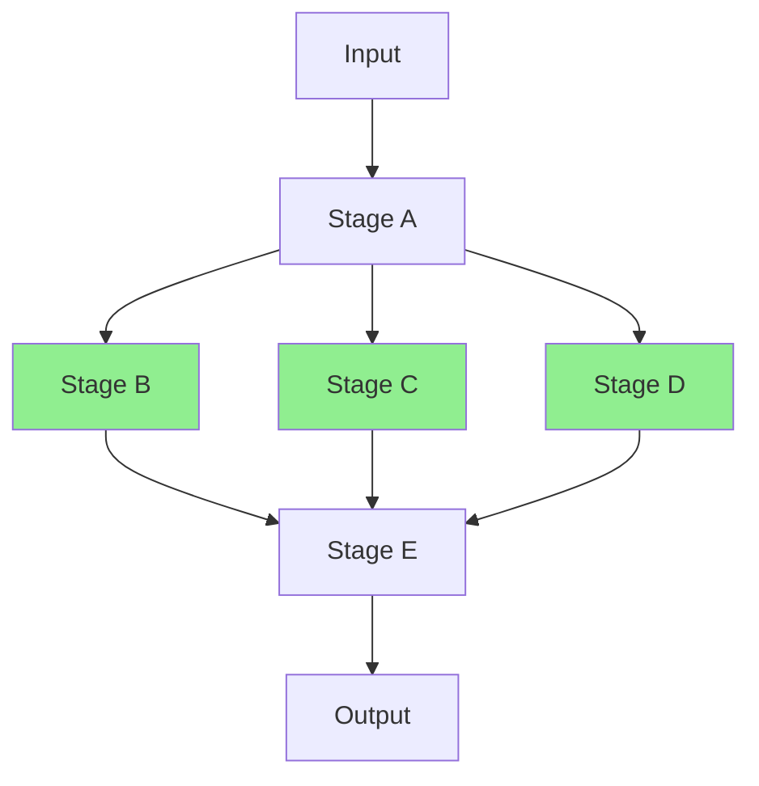

# Pipeline Optimization & Framework Integration

## Introduction

Building working pipelines is one thing—building pipelines that are **fast**, **cost-effective**, and **maintainable** is another. This lesson covers the optimization techniques and framework integrations that transform prototype chains into production-ready systems.

We'll explore parallel execution strategies, intelligent caching, early termination conditions, stage-specific model selection, and how popular frameworks like LangChain and LlamaIndex implement these patterns.

### What We'll Cover

- Parallel execution for independent stages
- Caching strategies to reduce redundant API calls
- Early termination conditions for efficiency
- Stage-specific model selection for cost optimization
- Framework integration: LangChain, LlamaIndex, custom orchestration
- Streaming pipelines for real-time output

### Prerequisites

- Understanding of common pipeline patterns (previous lessons)
- Familiarity with async Python programming
- Experience with LLM API calls
- Basic understanding of caching concepts

---

## Parallel Execution

When pipeline stages don't depend on each other, running them in parallel dramatically reduces total latency.

### Identifying Parallelization Opportunities



Stages B, C, and D (green) can run in parallel since they all depend only on Stage A.

### Rule: Identify Independent Stages

| Question | If Yes... |
|----------|-----------|
| Does stage X need output from stage Y? | X must wait for Y |
| Do stages share no dependencies? | Run them in parallel |
| Is there a merge point downstream? | Parallel stages feed into it |

### Implementation with asyncio

```python
import asyncio
from openai import AsyncOpenAI
import time
from typing import Callable, Any

async_client = AsyncOpenAI()


async def parallel_stage_executor(
    stages: list[dict],
    shared_input: str
) -> dict[str, Any]:
    """
    Execute independent stages in parallel.
    
    Args:
        stages: List of stage configs with 'name' and 'prompt'
        shared_input: Input available to all stages
    
    Returns:
        Dict mapping stage names to their outputs
    """
    start_time = time.time()
    
    async def run_stage(stage: dict) -> tuple[str, str]:
        response = await async_client.chat.completions.create(
            model=stage.get("model", "gpt-4o"),
            messages=[
                {"role": "system", "content": stage["prompt"]},
                {"role": "user", "content": shared_input}
            ]
        )
        return stage["name"], response.choices[0].message.content
    
    # Execute all stages in parallel
    tasks = [run_stage(stage) for stage in stages]
    results = await asyncio.gather(*tasks)
    
    elapsed = time.time() - start_time
    print(f"⚡ Parallel execution: {len(stages)} stages in {elapsed:.2f}s")
    
    return dict(results)


# Example usage
async def analyze_document_parallel(document: str) -> dict:
    """Run multiple analyses in parallel."""
    
    parallel_stages = [
        {
            "name": "sentiment",
            "prompt": "Analyze sentiment. Return JSON: {sentiment, confidence, key_phrases}",
            "model": "gpt-4o-mini"  # Fast model for simple task
        },
        {
            "name": "entities",
            "prompt": "Extract named entities. Return JSON: {entities: [{name, type}]}",
            "model": "gpt-4o-mini"
        },
        {
            "name": "summary",
            "prompt": "Create an executive summary in 3 sentences.",
            "model": "gpt-4o"  # Better model for nuanced task
        },
        {
            "name": "key_topics",
            "prompt": "Identify main topics. Return JSON: {topics: [{name, relevance}]}",
            "model": "gpt-4o-mini"
        }
    ]
    
    return await parallel_stage_executor(parallel_stages, document)
```

**Output:**
```
⚡ Parallel execution: 4 stages in 1.8s
```

Compare to sequential: 4 stages × ~1.5s each = 6s total. Parallel: ~1.8s.

### Parallel with Dependencies

When some stages depend on parallel results:

```python
async def mixed_parallel_sequential(document: str) -> dict:
    """Pipeline with both parallel and sequential sections."""
    
    # Phase 1: Initial extraction (sequential)
    extraction = await async_stage(
        "Extract key information from this document.",
        document
    )
    
    # Phase 2: Independent analyses (parallel)
    analysis_stages = [
        {"name": "risk", "prompt": "Analyze risks mentioned."},
        {"name": "opportunity", "prompt": "Analyze opportunities mentioned."},
        {"name": "requirements", "prompt": "Extract requirements."}
    ]
    parallel_results = await parallel_stage_executor(analysis_stages, extraction)
    
    # Phase 3: Synthesis (sequential, depends on all parallel results)
    synthesis_input = json.dumps({
        "extraction": extraction,
        **parallel_results
    })
    
    final = await async_stage(
        "Synthesize these analyses into a comprehensive report.",
        synthesis_input
    )
    
    return {
        "extraction": extraction,
        "analyses": parallel_results,
        "synthesis": final
    }
```

---

## Caching Strategies

LLM calls are expensive and often redundant. Smart caching can cut costs significantly.

### Types of Caching

| Cache Type | What It Stores | Best For |
|------------|----------------|----------|
| **Exact Match** | Responses for identical inputs | Repeated identical queries |
| **Semantic** | Responses for similar inputs | Near-duplicate requests |
| **Stage Output** | Intermediate results | Resumable pipelines |
| **Prompt Template** | Compiled prompt patterns | Template reuse |

### Implementing an Exact Match Cache

```python
import hashlib
import json
from datetime import datetime, timedelta
from typing import Optional
from dataclasses import dataclass


@dataclass
class CacheEntry:
    response: str
    created_at: datetime
    hit_count: int = 0
    model: str = ""
    prompt_hash: str = ""


class PipelineCache:
    """Simple in-memory cache for pipeline stages."""
    
    def __init__(self, ttl_hours: int = 24, max_entries: int = 1000):
        self.cache: dict[str, CacheEntry] = {}
        self.ttl = timedelta(hours=ttl_hours)
        self.max_entries = max_entries
        self.stats = {"hits": 0, "misses": 0}
    
    def _hash_input(self, system_prompt: str, user_input: str, model: str) -> str:
        """Create deterministic hash for cache key."""
        content = f"{model}::{system_prompt}::{user_input}"
        return hashlib.sha256(content.encode()).hexdigest()[:16]
    
    def get(self, system_prompt: str, user_input: str, model: str) -> Optional[str]:
        """Retrieve cached response if available and valid."""
        key = self._hash_input(system_prompt, user_input, model)
        
        if key in self.cache:
            entry = self.cache[key]
            
            # Check TTL
            if datetime.now() - entry.created_at < self.ttl:
                entry.hit_count += 1
                self.stats["hits"] += 1
                return entry.response
            else:
                # Expired, remove entry
                del self.cache[key]
        
        self.stats["misses"] += 1
        return None
    
    def set(self, system_prompt: str, user_input: str, model: str, response: str):
        """Store response in cache."""
        key = self._hash_input(system_prompt, user_input, model)
        
        # Evict oldest entries if at capacity
        if len(self.cache) >= self.max_entries:
            oldest_key = min(self.cache, key=lambda k: self.cache[k].created_at)
            del self.cache[oldest_key]
        
        self.cache[key] = CacheEntry(
            response=response,
            created_at=datetime.now(),
            model=model,
            prompt_hash=key
        )
    
    def get_stats(self) -> dict:
        """Return cache statistics."""
        total = self.stats["hits"] + self.stats["misses"]
        hit_rate = self.stats["hits"] / total if total > 0 else 0
        return {
            **self.stats,
            "hit_rate": f"{hit_rate:.1%}",
            "entries": len(self.cache)
        }


# Global cache instance
cache = PipelineCache()


def cached_stage(system_prompt: str, user_input: str, model: str = "gpt-4o") -> str:
    """Execute stage with caching."""
    
    # Check cache first
    cached = cache.get(system_prompt, user_input, model)
    if cached:
        print("  📦 Cache hit")
        return cached
    
    # Execute and cache
    response = execute_stage(system_prompt, user_input, model)
    cache.set(system_prompt, user_input, model, response)
    return response
```

### Semantic Caching with Embeddings

For approximate matches, use embeddings to find similar previous queries:

```python
import numpy as np
from openai import OpenAI

client = OpenAI()


class SemanticCache:
    """Cache using embeddings for semantic similarity matching."""
    
    def __init__(self, similarity_threshold: float = 0.95):
        self.threshold = similarity_threshold
        self.entries: list[dict] = []  # {embedding, input, response}
    
    def _get_embedding(self, text: str) -> list[float]:
        """Get embedding for text."""
        response = client.embeddings.create(
            model="text-embedding-3-small",
            input=text
        )
        return response.data[0].embedding
    
    def _cosine_similarity(self, a: list[float], b: list[float]) -> float:
        """Calculate cosine similarity between two vectors."""
        a, b = np.array(a), np.array(b)
        return np.dot(a, b) / (np.linalg.norm(a) * np.linalg.norm(b))
    
    def find_similar(self, query: str) -> Optional[str]:
        """Find cached response for semantically similar query."""
        if not self.entries:
            return None
        
        query_embedding = self._get_embedding(query)
        
        best_match = None
        best_similarity = 0
        
        for entry in self.entries:
            similarity = self._cosine_similarity(query_embedding, entry["embedding"])
            if similarity > best_similarity and similarity >= self.threshold:
                best_similarity = similarity
                best_match = entry["response"]
        
        if best_match:
            print(f"  📦 Semantic cache hit (similarity: {best_similarity:.2%})")
        
        return best_match
    
    def store(self, query: str, response: str):
        """Store query-response pair with embedding."""
        embedding = self._get_embedding(query)
        self.entries.append({
            "embedding": embedding,
            "input": query,
            "response": response
        })
```

> **Tip:** Semantic caching adds embedding API calls, so it's most valuable when LLM calls are much more expensive than embedding calls, or when you have very high query volume with many near-duplicates.

---

## Early Termination

Stop pipelines early when possible to save time and cost.

### Termination Conditions

| Condition | Example | Action |
|-----------|---------|--------|
| **Quality threshold met** | Score ≥ 0.9 | Skip remaining refinement |
| **No improvement** | 2 iterations with <1% improvement | Stop iterating |
| **Confidence high** | Classification 99% confident | Skip verification |
| **Input trivial** | One-word query | Use simple path |
| **Error detected** | Invalid input format | Fast fail |

### Implementation

```python
from dataclasses import dataclass
from typing import Optional


@dataclass
class TerminationCondition:
    name: str
    check: Callable[[dict], bool]
    message: str


class EarlyTerminationPipeline:
    """Pipeline with configurable early termination."""
    
    def __init__(self):
        self.conditions: list[TerminationCondition] = []
    
    def add_condition(self, name: str, check: Callable, message: str):
        """Add an early termination condition."""
        self.conditions.append(TerminationCondition(name, check, message))
    
    def check_termination(self, state: dict) -> Optional[str]:
        """Check if any termination condition is met."""
        for condition in self.conditions:
            if condition.check(state):
                return condition.message
        return None
    
    def run(self, stages: list[Callable], initial_input: str) -> dict:
        """Run pipeline with early termination checks."""
        state = {"input": initial_input, "outputs": [], "terminated_early": False}
        
        for i, stage in enumerate(stages):
            # Check termination before each stage
            termination = self.check_termination(state)
            if termination:
                print(f"⏹️ Early termination: {termination}")
                state["terminated_early"] = True
                state["termination_reason"] = termination
                break
            
            # Execute stage
            output = stage(state)
            state["outputs"].append(output)
            state["last_output"] = output
        
        return state


# Example: Quality-based early termination
pipeline = EarlyTerminationPipeline()

pipeline.add_condition(
    "quality_threshold",
    lambda state: state.get("quality_score", 0) >= 0.9,
    "Quality threshold met"
)

pipeline.add_condition(
    "no_improvement",
    lambda state: (
        len(state.get("quality_history", [])) >= 2 and
        state["quality_history"][-1] - state["quality_history"][-2] < 0.01
    ),
    "No significant improvement in last iteration"
)

pipeline.add_condition(
    "max_cost_exceeded",
    lambda state: state.get("total_cost", 0) > 1.00,  # $1 limit
    "Cost budget exceeded"
)
```

### Early Exit Optimization

```python
async def optimized_analysis_pipeline(document: str) -> dict:
    """Pipeline with intelligent early exits."""
    
    # Quick classification to determine processing path
    classification = await async_stage(
        """Classify this document:
        - complexity: simple/medium/complex
        - length: short/medium/long
        - type: technical/business/general
        Return JSON.""",
        document
    )
    
    class_data = json.loads(classification)
    
    # Simple documents: fast path
    if class_data["complexity"] == "simple" and class_data["length"] == "short":
        print("⚡ Fast path: simple document")
        summary = await async_stage("Summarize briefly.", document)
        return {"summary": summary, "path": "fast", "stages": 2}
    
    # Medium complexity: standard path
    if class_data["complexity"] == "medium":
        print("📊 Standard path: medium complexity")
        # Run standard 3-stage pipeline
        analysis = await standard_analysis_pipeline(document)
        return {**analysis, "path": "standard", "stages": 4}
    
    # Complex documents: full path
    print("🔬 Full path: complex document")
    analysis = await comprehensive_analysis_pipeline(document)
    return {**analysis, "path": "full", "stages": 8}
```

---

## Stage-Specific Model Selection

Different stages have different complexity requirements. Match models to stages for cost optimization.

### Model Selection Strategy

| Stage Type | Recommended Model | Rationale |
|------------|-------------------|-----------|
| Classification | GPT-4o-mini | Simple, fast task |
| Extraction | GPT-4o-mini | Pattern matching |
| Complex analysis | GPT-4o | Requires reasoning |
| Creative writing | GPT-4o | Quality matters |
| Formatting | GPT-4o-mini | Mechanical task |
| Verification | GPT-4o | Accuracy critical |

### Implementation

```python
from enum import Enum


class ModelTier(Enum):
    FAST = "gpt-4o-mini"      # $0.15/1M input, $0.60/1M output
    BALANCED = "gpt-4o"       # $2.50/1M input, $10/1M output
    PREMIUM = "gpt-4.5"       # Future premium model
    REASONING = "o1"          # For complex reasoning


def get_optimal_model(stage_config: dict) -> str:
    """Select optimal model based on stage requirements."""
    
    complexity = stage_config.get("complexity", "medium")
    task_type = stage_config.get("task_type", "general")
    quality_critical = stage_config.get("quality_critical", False)
    
    # Reasoning tasks always use reasoning model
    if task_type == "reasoning":
        return ModelTier.REASONING.value
    
    # Quality-critical stages use balanced model
    if quality_critical:
        return ModelTier.BALANCED.value
    
    # Simple tasks use fast model
    if complexity == "low" or task_type in ["format", "classify", "extract"]:
        return ModelTier.FAST.value
    
    # Default to balanced
    return ModelTier.BALANCED.value


def cost_optimized_pipeline(stages: list[dict], input_data: str) -> dict:
    """Run pipeline with optimized model selection per stage."""
    
    results = []
    total_cost = 0
    current_input = input_data
    
    for stage in stages:
        model = get_optimal_model(stage)
        
        response = execute_stage(
            stage["prompt"],
            current_input,
            model=model
        )
        
        # Track costs (approximate)
        tokens_used = len(current_input.split()) + len(response.split())
        if model == ModelTier.FAST.value:
            cost = tokens_used * 0.00000015  # Approximate
        else:
            cost = tokens_used * 0.0000025
        
        total_cost += cost
        results.append({
            "stage": stage["name"],
            "model": model,
            "cost": cost
        })
        
        current_input = response
    
    print(f"💰 Total estimated cost: ${total_cost:.4f}")
    return {"results": results, "total_cost": total_cost, "final_output": current_input}
```

---

## Framework Integration

Popular frameworks provide abstractions that simplify pipeline development.

### LangChain Integration

LangChain's `create_agent()` and chain abstractions:

```python
from langchain.agents import create_agent
from langchain_openai import ChatOpenAI


# Create a simple agent with tools
def get_weather(city: str) -> str:
    """Get weather for a city."""
    return f"Weather in {city}: Sunny, 72°F"


def search_database(query: str) -> str:
    """Search internal database."""
    return f"Results for '{query}': Document A, Document B"


# Create agent
model = ChatOpenAI(model="gpt-4o")
agent = create_agent(
    model=model,
    tools=[get_weather, search_database],
    system_prompt="""You are a helpful assistant that can check weather 
    and search documents. Use tools when needed."""
)

# Run agent
result = agent.invoke({
    "messages": [{"role": "user", "content": "What's the weather in NYC?"}]
})
```

### LangGraph for Complex Pipelines

For stateful, multi-step workflows:

```python
from langgraph.graph import StateGraph, END
from typing import TypedDict


class PipelineState(TypedDict):
    document: str
    extraction: str
    analysis: str
    report: str


def extract_node(state: PipelineState) -> dict:
    """Extraction stage node."""
    result = execute_stage("Extract key information.", state["document"])
    return {"extraction": result}


def analyze_node(state: PipelineState) -> dict:
    """Analysis stage node."""
    result = execute_stage("Analyze this data.", state["extraction"])
    return {"analysis": result}


def report_node(state: PipelineState) -> dict:
    """Report generation node."""
    result = execute_stage("Generate report.", state["analysis"])
    return {"report": result}


# Build graph
workflow = StateGraph(PipelineState)
workflow.add_node("extract", extract_node)
workflow.add_node("analyze", analyze_node)
workflow.add_node("report", report_node)

workflow.set_entry_point("extract")
workflow.add_edge("extract", "analyze")
workflow.add_edge("analyze", "report")
workflow.add_edge("report", END)

# Compile and run
app = workflow.compile()
result = app.invoke({"document": document_text})
```

### Custom Orchestration

For maximum control, build your own orchestrator:

```python
from dataclasses import dataclass
from typing import Callable, Optional, Any
import asyncio


@dataclass
class Stage:
    name: str
    execute: Callable
    model: str = "gpt-4o"
    cache_enabled: bool = True
    timeout: float = 30.0
    retry_count: int = 2
    depends_on: list[str] = None


class PipelineOrchestrator:
    """Custom pipeline orchestrator with full control."""
    
    def __init__(self):
        self.stages: dict[str, Stage] = {}
        self.results: dict[str, Any] = {}
        self.cache = PipelineCache()
    
    def add_stage(self, stage: Stage):
        """Register a stage."""
        self.stages[stage.name] = stage
    
    async def run(self, initial_input: str) -> dict:
        """Execute the pipeline."""
        self.results = {"_input": initial_input}
        pending = set(self.stages.keys())
        
        while pending:
            # Find stages whose dependencies are satisfied
            ready = [
                name for name in pending
                if self._dependencies_satisfied(name)
            ]
            
            if not ready:
                raise RuntimeError("Circular dependency detected")
            
            # Execute ready stages in parallel
            tasks = [
                self._execute_stage(name)
                for name in ready
            ]
            await asyncio.gather(*tasks)
            
            pending -= set(ready)
        
        return self.results
    
    def _dependencies_satisfied(self, stage_name: str) -> bool:
        """Check if all dependencies have completed."""
        stage = self.stages[stage_name]
        if not stage.depends_on:
            return True
        return all(dep in self.results for dep in stage.depends_on)
    
    async def _execute_stage(self, stage_name: str):
        """Execute a single stage with retries and caching."""
        stage = self.stages[stage_name]
        
        # Gather inputs from dependencies
        inputs = {
            dep: self.results[dep]
            for dep in (stage.depends_on or [])
        }
        inputs["_input"] = self.results["_input"]
        
        # Check cache
        cache_key = f"{stage_name}:{json.dumps(inputs, sort_keys=True)}"
        if stage.cache_enabled:
            cached = self.cache.get(stage.name, cache_key, stage.model)
            if cached:
                self.results[stage_name] = cached
                return
        
        # Execute with retries
        for attempt in range(stage.retry_count + 1):
            try:
                result = await asyncio.wait_for(
                    stage.execute(inputs),
                    timeout=stage.timeout
                )
                
                if stage.cache_enabled:
                    self.cache.set(stage.name, cache_key, stage.model, result)
                
                self.results[stage_name] = result
                return
                
            except asyncio.TimeoutError:
                if attempt == stage.retry_count:
                    raise TimeoutError(f"Stage {stage_name} timed out")
            except Exception as e:
                if attempt == stage.retry_count:
                    raise
```

---

## Streaming Pipelines

For real-time output, stream results as they're generated:

```python
async def streaming_pipeline(document: str):
    """Pipeline that streams intermediate results."""
    
    print("📄 Starting analysis...\n")
    
    # Stream extraction
    print("📥 Extracting key information:")
    async for chunk in stream_stage("Extract key information.", document):
        print(chunk, end="", flush=True)
    print("\n")
    
    # Stream analysis
    print("🔍 Analyzing:")
    async for chunk in stream_stage("Analyze this content.", extraction_result):
        print(chunk, end="", flush=True)
    print("\n")
    
    print("✅ Analysis complete")


async def stream_stage(prompt: str, input_text: str):
    """Stream a single stage's output."""
    response = await async_client.chat.completions.create(
        model="gpt-4o",
        messages=[
            {"role": "system", "content": prompt},
            {"role": "user", "content": input_text}
        ],
        stream=True
    )
    
    async for chunk in response:
        if chunk.choices[0].delta.content:
            yield chunk.choices[0].delta.content
```

---

## Best Practices Summary

| Optimization | Technique | Benefit |
|--------------|-----------|---------|
| **Parallelization** | `asyncio.gather()` for independent stages | Reduce latency |
| **Caching** | Hash-based or semantic matching | Reduce cost |
| **Early termination** | Quality thresholds, no-improvement detection | Save resources |
| **Model selection** | Match model tier to task complexity | Optimize cost/quality |
| **Streaming** | Real-time chunk output | Better UX |
| **Frameworks** | LangChain/LangGraph for common patterns | Faster development |

---

## Hands-on Exercise

### Your Task

Build an **optimized document processing pipeline** that:

1. Uses parallel execution for independent analyses
2. Implements exact-match caching
3. Applies early termination based on document complexity
4. Selects models based on stage requirements
5. Tracks and reports cost metrics

### Requirements

- Process a sample document through at least 4 stages
- Achieve at least 50% latency reduction vs. sequential
- Demonstrate cache hit on repeated processing
- Show cost breakdown by stage

### Expected Output

```
📊 Pipeline Execution Report
━━━━━━━━━━━━━━━━━━━━━━━━━━━━
Sequential time estimate: 6.2s
Actual parallel time:     2.1s
Speedup:                  2.95x

Cache Stats:
  Hits: 2, Misses: 4, Rate: 33%

Cost Breakdown:
  classify:  $0.0002 (gpt-4o-mini)
  extract:   $0.0003 (gpt-4o-mini)
  analyze:   $0.0018 (gpt-4o)
  summarize: $0.0012 (gpt-4o)
  ─────────────────────
  Total:     $0.0035
```

<details>
<summary>💡 Hints (click to expand)</summary>

- Use `asyncio.gather()` for parallel stages
- Create a simple cache dictionary with hash keys
- Track time before/after each stage
- Estimate tokens from word count

</details>

---

## Summary

✅ **Parallel execution** with `asyncio.gather()` dramatically reduces pipeline latency

✅ **Caching** (exact or semantic) eliminates redundant API calls

✅ **Early termination** stops pipelines when goals are met or improvement stalls

✅ **Stage-specific models** optimize the cost/quality tradeoff per stage

✅ **Frameworks** like LangChain provide tested abstractions for common patterns

✅ **Streaming** enables real-time output for better user experience

**Next:** [Context Windows & Token Management](../22-context-window-token-management/00-context-window-overview.md)

---

## Further Reading

- [LangChain Documentation](https://docs.langchain.com/) — Official framework docs
- [LangGraph Documentation](https://docs.langchain.com/langgraph/) — Stateful workflow framework
- [OpenAI Cookbook: Orchestrating Agents](https://cookbook.openai.com/examples/orchestrating_agents) — Swarm patterns
- [OpenAI Prompt Caching](https://platform.openai.com/docs/guides/prompt-caching) — Native caching support
- [Previous: Common Pipeline Patterns](./03-common-pipeline-patterns.md)

---

<!-- 
Sources Consulted:
- LangChain Overview: https://python.langchain.com/docs/concepts/lcel/
- OpenAI Cookbook Orchestrating Agents: https://cookbook.openai.com/examples/orchestrating_agents
- OpenAI Prompt Engineering Guide: https://platform.openai.com/docs/guides/prompt-engineering
- OpenAI How to Implement LLM Guardrails: https://cookbook.openai.com/examples/how_to_use_guardrails
-->
