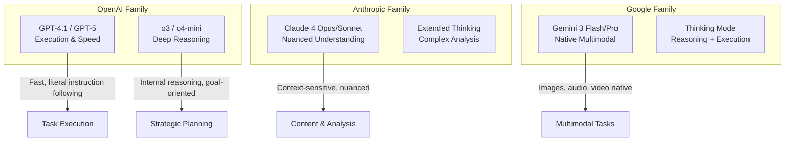
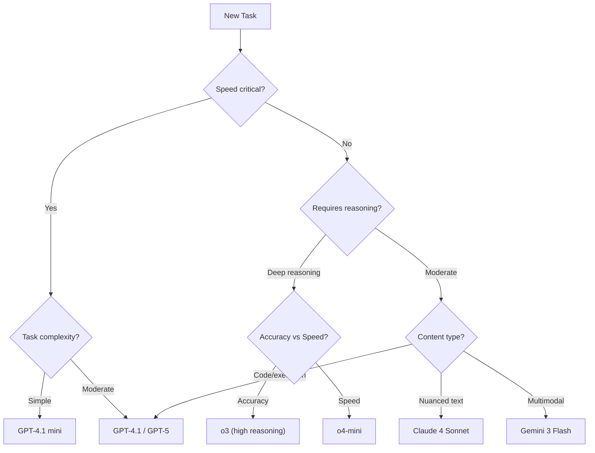

# Model-Specific Prompting Tips

## Introduction

In the evolving landscape of AI, not all language models are created equal—and neither should your prompts be. While the fundamental principles of prompt engineering apply broadly, each major AI provider has trained their models with distinct architectures, training methodologies, and optimization targets that reward specific prompting approaches.

Understanding these model-specific nuances transforms you from a generic prompt writer into a precision engineer who can extract maximum performance from any model. This knowledge becomes especially critical as AI applications increasingly rely on multiple models for different tasks within the same system.

### Why Model Differences Matter

Consider this analogy: both a Formula 1 car and a pickup truck are vehicles with engines and wheels, but you wouldn't drive them the same way. Similarly, prompting GPT-5 like you would Claude 4, or treating Gemini 3 like a reasoning model, leads to suboptimal results—wasted tokens, slower responses, and lower quality outputs.

> **🤖 AI Context:** Model-specific optimization becomes essential in production systems where you might use reasoning models for complex decisions, GPT models for execution, and Claude for nuanced content generation—all within a single workflow.

### What We'll Cover

In this lesson series, we'll explore provider-specific prompting strategies:

- **OpenAI GPT Models (GPT-4.1, GPT-5)**: Instruction-following workhorses optimized for execution and agentic workflows
- **OpenAI Reasoning Models (o3, o4-mini)**: Deep thinkers designed for complex multi-step problems
- **Anthropic Claude Models**: Masters of nuanced instructions with extended thinking capabilities
- **Google Gemini Models**: Native multimodal reasoners with unique parameter requirements
- **Cross-Provider Strategies**: Techniques for building portable prompts and model-agnostic systems

### Prerequisites

Before diving in, you should have:

- Completed earlier prompt engineering lessons (fundamentals, patterns, chaining)
- Basic experience with at least one major LLM API
- Understanding of token concepts and context windows
- Familiarity with structured outputs (JSON mode)

---

## The Model Landscape in 2025

The AI model ecosystem has evolved into distinct families, each with specialized strengths:



### Understanding Model Architectures

Each provider optimizes for different use cases:

| Provider | Model Type | Core Strength | Best For |
|----------|------------|---------------|----------|
| OpenAI GPT | Execution | Literal instruction following | Agentic tasks, coding, structured outputs |
| OpenAI o-series | Reasoning | Deep internal thinking | Complex decisions, math, planning |
| Anthropic Claude | Nuance | Context interpretation | Content generation, analysis, safety |
| Google Gemini | Multimodal | Native multi-format | Vision, audio, long context |

### The Steerability Spectrum

Modern models differ dramatically in how they respond to steering:

**High Steerability (GPT-5, Claude 4)**
- Follow instructions literally
- Respond immediately to explicit constraints
- May struggle with ambiguous or contradictory instructions

**Moderate Steerability (Gemini 3, GPT-4.1)**
- Balance inference with instruction following
- Fill gaps with reasonable assumptions
- May require more explicit formatting

**Internal Reasoning (o3, o4-mini)**
- Don't respond to "think step by step" prompts
- Optimize for goals rather than steps
- Require different prompting paradigm entirely

---

## Choosing the Right Model for the Task

Not every task requires the same model. Here's a decision framework:



### When to Use Each Model Family

**Use OpenAI GPT Models When:**
- Task is well-defined with clear instructions
- Speed and cost efficiency matter
- Building agentic workflows with tool calling
- Generating structured outputs (JSON)
- Processing long documents (1M token context)

**Use OpenAI Reasoning Models When:**
- Problem requires multi-step logical reasoning
- Accuracy matters more than latency
- Making decisions from ambiguous information
- Planning complex agentic strategies
- Evaluating or benchmarking other model outputs

**Use Anthropic Claude When:**
- Task requires nuanced interpretation
- Content needs careful ethical consideration
- Extended analysis of complex documents
- Creative writing with specific voice requirements
- Handling potentially sensitive topics

**Use Google Gemini When:**
- Working with images, audio, or video
- Need native multimodal understanding
- Require grounded responses (with Google Search)
- Processing extremely long contexts
- Building applications with real-time capabilities

---

## Common Cross-Provider Patterns

While each model has unique characteristics, some patterns work across providers:

### Pattern 1: Explicit Role Definition

All modern models benefit from clear role specification:

```
# OpenAI Style
You are a senior software architect reviewing code for security vulnerabilities.

# Anthropic Style (in system parameter)
You are a senior software architect. Your task is to review code for security vulnerabilities. Be thorough but concise.

# Google Style
<role>
You are a senior software architect specializing in security review.
</role>
```

### Pattern 2: Structured Output Requests

Each provider supports structured outputs, but syntax differs:

```python
# OpenAI - Use response_format or structured outputs
response = client.chat.completions.create(
    model="gpt-4.1",
    response_format={"type": "json_object"},
    messages=[{"role": "user", "content": "..."}]
)

# Anthropic - Instruct in prompt, optionally prefill
response = client.messages.create(
    model="claude-4-sonnet",
    messages=[{
        "role": "user",
        "content": "Return your response as JSON..."
    }]
)

# Google - Use responseSchema parameter
response = model.generate_content(
    "...",
    generation_config={"response_mime_type": "application/json"}
)
```

### Pattern 3: Clear Delimiters

All providers respond well to clear structural markers:

| Delimiter Type | Example | Best For |
|----------------|---------|----------|
| Markdown | `## Section Title` | General structure |
| XML tags | `<context>...</context>` | Claude, Gemini 3 |
| JSON | `{"input": "..."}` | Structured data, coding |
| Triple backticks | ` ```code``` ` | Code blocks |

---

## Lesson Navigation

This lesson is divided into focused modules for each provider:

| Lesson | Focus Area | Key Concepts |
|--------|------------|--------------|
| [OpenAI GPT Models](./01-openai-gpt-models.md) | GPT-4.1, GPT-5 | Responses API, agentic prompts, developer role, verbosity control |
| [OpenAI Reasoning Models](./02-openai-reasoning-models.md) | o3, o4-mini | Reasoning effort, goal-oriented prompts, token reservation |
| [Anthropic Claude Models](./03-anthropic-claude-models.md) | Claude 4 | Extended thinking, XML structure, system prompts, harm avoidance |
| [Google Gemini Models](./04-google-gemini-models.md) | Gemini 3 | Temperature 1.0, thinking levels, multimodal, grounding |

---

## Summary

✅ Different models require different prompting approaches for optimal results

✅ Model selection depends on task complexity, speed requirements, and content type

✅ OpenAI splits between execution (GPT) and reasoning (o-series) models

✅ Claude excels at nuanced understanding; Gemini leads in multimodal

✅ Cross-provider patterns exist but syntax and parameters vary

**Next:** [OpenAI GPT Models (GPT-4.1, GPT-5)](./01-openai-gpt-models.md)

---

## Further Reading

- [OpenAI GPT-5 Prompting Guide](https://cookbook.openai.com/examples/gpt-5/gpt-5_prompting_guide) - Official best practices
- [OpenAI Reasoning Best Practices](https://platform.openai.com/docs/guides/reasoning-best-practices) - o-series guidance
- [Anthropic Prompt Engineering Overview](https://platform.claude.com/docs/en/build-with-claude/prompt-engineering/overview) - Claude strategies
- [Google Gemini Prompting Strategies](https://ai.google.dev/gemini-api/docs/prompting-strategies) - Gemini 3 best practices
- [Google Gemini Thinking Guide](https://ai.google.dev/gemini-api/docs/thinking) - Thinking mode configuration

<!-- 
Sources Consulted:
- OpenAI GPT-5 Prompting Guide: https://cookbook.openai.com/examples/gpt-5/gpt-5_prompting_guide
- OpenAI GPT-4.1 Prompting Guide: https://cookbook.openai.com/examples/gpt4-1_prompting_guide
- OpenAI Reasoning Best Practices: https://platform.openai.com/docs/guides/reasoning-best-practices
- Anthropic Prompt Engineering Overview: https://platform.claude.com/docs/en/build-with-claude/prompt-engineering/overview
- Anthropic Extended Thinking Tips: https://platform.claude.com/docs/en/build-with-claude/prompt-engineering/extended-thinking-tips
- Google Gemini Prompting Strategies: https://ai.google.dev/gemini-api/docs/prompting-strategies
- Google Gemini Thinking: https://ai.google.dev/gemini-api/docs/thinking
-->
