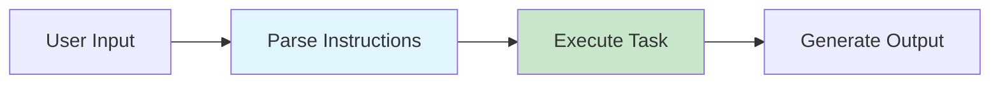

# OpenAI GPT Models: GPT-4.1 and GPT-5

## Introduction

OpenAI's GPT models represent the "workhorse" tier of their model lineup—optimized for speed, efficiency, and precise instruction following. Unlike reasoning models that think deeply before answering, GPT-4.1 and GPT-5 excel at executing well-defined tasks quickly and reliably.

These models have been specifically trained for agentic workflows, making them the backbone of AI coding assistants, customer service bots, and automated pipelines where consistent, literal instruction following matters more than deep reasoning.

### What We'll Cover

- GPT-4.1 and GPT-5 key characteristics and differences
- The Responses API and agentic workflow optimization
- Developer messages vs system prompts
- Verbosity and steerability controls
- Long context handling (1M tokens)
- Structured output best practices
- Common pitfalls and how to avoid them

### Prerequisites

- Familiarity with OpenAI API basics
- Understanding of chat completions format
- Experience with at least one agentic workflow

---

## Understanding GPT Model Characteristics

GPT-4.1 and GPT-5 share core design principles but differ in capability:

| Feature | GPT-4.1 | GPT-5 |
|---------|---------|-------|
| Context Window | 1M tokens | 1M+ tokens |
| Instruction Following | Excellent | Exceptional |
| Agentic Performance | Strong | State-of-art |
| Reasoning Depth | Moderate | Enhanced |
| Steerability | High | Very High |
| Verbosity Control | Prompt-based | API parameter |

> **🔑 Key Insight:** GPT-5 is described by OpenAI as "our most steerable model yet"—it responds to prompting adjustments more precisely than any previous model, but this also means poorly constructed prompts can cause more problems.

### The Execution-First Philosophy

Unlike reasoning models that "think" before responding, GPT models are designed for immediate execution:



This makes them ideal for:
- **Agentic tasks** requiring tool calling and multi-step execution
- **Coding workflows** where literal interpretation prevents creative deviations
- **Structured outputs** needing consistent JSON formatting
- **High-throughput applications** where latency matters

---

## The Responses API: Optimizing Agentic Workflows

OpenAI recommends the newer Responses API over Chat Completions for GPT-5 agentic applications. The key advantage: **reasoning context persistence**.

### Why Responses API Matters

When using Chat Completions, each API call starts fresh. The Responses API maintains reasoning context between tool calls:

```python
from openai import OpenAI

client = OpenAI()

# First call - includes reasoning context
response = client.responses.create(
    instructions="You are an expert code reviewer...",
    model="gpt-5",
    tools=[code_analysis_tool],
    input="Review this Python function for security issues..."
)

# Subsequent calls can reference previous reasoning
# using previous_response_id
follow_up = client.responses.create(
    model="gpt-5",
    previous_response_id=response.id,
    input="Now suggest fixes for the issues you found"
)
```

> **⚠️ Warning:** OpenAI observed a 4.3% improvement on Tau-Bench evaluations simply by switching to Responses API with `previous_response_id`. This isn't optional for production agentic systems.

### Developer Messages: The New System Prompts

Starting with `o1-2024-12-17` and extending to GPT-5, OpenAI introduces **developer messages** to replace system messages:

```python
response = client.responses.create(
    # Developer message (preferred for GPT-5)
    instructions="""
    You are an expert code reviewer for a Python codebase.
    
    # Core Behaviors
    - Always check for security vulnerabilities first
    - Flag any use of eval() or exec()
    - Recommend type hints for untyped functions
    """,
    model="gpt-5",
    input=user_query
)
```

Developer messages align with OpenAI's "chain of command" model spec—they represent the developer's authoritative instructions that take precedence over user requests in case of conflict.

---

## Mastering Instruction Following

GPT-4.1 and GPT-5 follow instructions with "surgical precision." This is powerful but requires careful prompt construction.

### The Literal Interpretation Challenge

These models interpret instructions literally. What worked with earlier models may cause unexpected behavior:

| ❌ Vague Instruction | ✅ Precise Instruction |
|---------------------|----------------------|
| "Be helpful" | "Answer questions about Python, provide code examples when relevant" |
| "Don't be verbose" | "Limit responses to 3 sentences maximum unless code is required" |
| "Use tools when needed" | "Always use the search tool before answering factual questions. If insufficient information exists, ask for clarification" |

### Recommended Prompt Structure

OpenAI's testing reveals an optimal structure for GPT models:

```markdown
# Role and Objective
You are [specific role]. Your goal is [clear objective].

# Instructions
## Core Behaviors
- Specific behavior 1
- Specific behavior 2

## Constraints  
- What NOT to do
- Limits on scope

# Reasoning Steps (optional)
1. First, analyze...
2. Then, determine...
3. Finally, output...

# Output Format
Specify exact format requirements here.

# Examples
## Example 1
Input: ...
Output: ...

# Context
{context_variable}

# Final Instructions
Remember to [key reminder] before responding.
```

### Handling Contradictory Instructions

GPT-5's precise instruction following means contradictions cause significant issues. The model expends reasoning tokens trying to reconcile conflicts:

```markdown
❌ Problematic Prompt (contains contradictions):
"""
Always verify user identity before any action.
For urgent cases, process immediately without verification.
Never take action without explicit confirmation.
If risk is high, act first and confirm later.
"""

✅ Resolved Prompt:
"""
# Authentication Requirements
- Verify user identity for ALL non-emergency requests
- For emergency requests (user says "urgent" or "emergency"):
  - Skip verification
  - Process immediately
  - Document decision for audit

# Confirmation Requirements  
- Always get explicit confirmation EXCEPT for emergencies
- For emergencies: act first, then notify user of actions taken
"""
```

> **💡 Tip:** Use the [OpenAI Prompt Optimizer](https://platform.openai.com/chat/edit?optimize=true) to identify contradictions and improve prompts.

---

## Agentic System Prompts: The Three Essential Components

For agentic workflows, OpenAI recommends three specific prompt components:

### 1. Persistence Instruction

Ensures the model doesn't prematurely return control to the user:

```markdown
<persistence>
You are an agent - please keep going until the user's query is 
completely resolved, before ending your turn and yielding back 
to the user. Only terminate your turn when you are sure that 
the problem is solved.
</persistence>
```

### 2. Tool-Calling Instruction

Prevents hallucination and encourages tool usage:

```markdown
<tool_usage>
If you are not sure about file content or codebase structure 
pertaining to the user's request, use your tools to read files 
and gather the relevant information: do NOT guess or make up 
an answer.
</tool_usage>
```

### 3. Planning Instruction (Optional)

Induces explicit reasoning between tool calls:

```markdown
<planning>
You MUST plan extensively before each function call, and reflect 
extensively on the outcomes of the previous function calls. 
DO NOT do this entire process by making function calls only, 
as this can impair your ability to solve the problem and think 
insightfully.
</planning>
```

> **🔑 Key Insight:** These three instructions alone increased OpenAI's internal SWE-bench Verified score by nearly 20%.

---

## Controlling Verbosity

GPT-5 introduces API-level verbosity control via the `verbosity` parameter:

```python
response = client.responses.create(
    model="gpt-5",
    verbosity="low",  # Options: low, medium, high
    instructions="...",
    input="..."
)
```

### Cursor's Dual Verbosity Pattern

AI code editor Cursor discovered an effective pattern: global low verbosity with context-specific high verbosity for code:

```markdown
# System Instructions
Write code for clarity first. Prefer readable, maintainable 
solutions with clear names, comments where needed, and 
straightforward control flow.

Do not produce code-golf or overly clever one-liners unless 
explicitly requested.

Use HIGH verbosity for writing code and code tools.
Use LOW verbosity for status updates and explanations.
```

This combination produces:
- Concise status updates that don't interrupt flow
- Highly readable code with proper variable names
- No single-letter variable names or compressed code

---

## Long Context Best Practices

GPT-4.1 and GPT-5 support up to 1M tokens of context. Here's how to use it effectively:

### Instruction Placement

For long context, instruction placement significantly impacts performance:

| Placement Strategy | Effectiveness | When to Use |
|-------------------|---------------|-------------|
| Instructions at top AND bottom | ✅ Best | Complex tasks with long context |
| Instructions at top only | Good | Moderate context lengths |
| Instructions at bottom only | ⚠️ Weaker | Not recommended |

```markdown
# Instructions (BEFORE context)
You are analyzing financial documents to identify risk factors.
Focus on: liquidity risks, market risks, regulatory risks.

# Documents
{long_document_content}

# Reminder (AFTER context)
Based on the above documents, identify and summarize all risk 
factors. Focus on liquidity, market, and regulatory risks.
```

### Tuning Context Reliance

Control how much the model relies on provided context vs. internal knowledge:

```markdown
# For strict context-only responses:
Only use the documents in the provided External Context to 
answer the User Query. If you don't know the answer based on 
this context, you must respond "I don't have the information 
needed to answer that."

# For context + internal knowledge:
By default, use the provided external context to answer. 
If additional basic knowledge is needed and you're confident, 
you may supplement with your own knowledge.
```

---

## Structured Output Optimization

GPT models excel at structured outputs when properly configured:

### Method 1: Response Format

```python
response = client.chat.completions.create(
    model="gpt-4.1",
    response_format={"type": "json_object"},
    messages=[{
        "role": "user",
        "content": """Extract the following fields from this text:
        - name (string)
        - age (integer)
        - skills (array of strings)
        
        Text: John is a 32-year-old developer skilled in Python and TypeScript."""
    }]
)
```

### Method 2: Structured Outputs with Schema

```python
from pydantic import BaseModel
from typing import List

class PersonInfo(BaseModel):
    name: str
    age: int
    skills: List[str]

response = client.beta.chat.completions.parse(
    model="gpt-4.1",
    messages=[...],
    response_format=PersonInfo
)
```

### Method 3: Tool Definitions

For maximum control, define output structure as a tool:

```python
extract_info_tool = {
    "type": "function",
    "name": "extract_person_info",
    "description": "Extract structured person information",
    "parameters": {
        "type": "object",
        "strict": True,
        "properties": {
            "name": {"type": "string"},
            "age": {"type": "integer"},
            "skills": {
                "type": "array",
                "items": {"type": "string"}
            }
        },
        "required": ["name", "age", "skills"]
    }
}
```

---

## Common Pitfalls and Solutions

### Pitfall 1: Over-Eager Tool Calling

**Problem:** Model hallucinates tool inputs when told to "always call a tool":

```markdown
❌ "You must call a tool before responding to the user."

✅ "If you don't have enough information to call the tool, 
ask the user for the information you need."
```

### Pitfall 2: Repetitive Sample Phrases

**Problem:** When given sample phrases, model uses them verbatim and sounds robotic:

```markdown
❌ Sample Phrases:
- "I'd be happy to help with that!"

✅ Sample Phrases:
Vary these phrases naturally to avoid sounding repetitive:
- "I'd be happy to help with that!"
- "Sure, I can assist with that."
- "Let me help you with that."
```

### Pitfall 3: Excessive Prose

**Problem:** Model adds unnecessary explanations:

```markdown
❌ No explicit format instruction

✅ Output Requirements:
- Provide only the requested output
- Do not add explanatory prose before or after
- No "Here's the answer:" or "I hope this helps!"
```

### Pitfall 4: Markdown When Not Wanted

**Problem:** GPT-5 defaults to NO markdown in API responses:

```markdown
# To enable markdown formatting:
Add to the first line of your developer message:
"Formatting re-enabled"

Then specify:
- Use Markdown where semantically correct
- Use backticks for `code`, ```fences``` for blocks
- Use \( \) for inline math, \[ \] for block math
```

---

## Hands-on Exercise

### Your Task

Create an agentic prompt for a code review assistant using GPT-5 best practices.

### Requirements

1. Include the three essential agentic components (persistence, tool-usage, planning)
2. Define clear role and objective
3. Specify output format with structured feedback
4. Handle the case where code looks perfect (no issues found)
5. Include at least one example

### Expected Result

A complete system prompt that could power a production code review agent.

<details>
<summary>💡 Hints (click to expand)</summary>

- Start with role definition using markdown headers
- Use XML tags for the three agentic components
- Consider what tools a code reviewer would need (read_file, search_codebase, etc.)
- Think about both security and code quality dimensions

</details>

<details>
<summary>✅ Solution (click to expand)</summary>

```markdown
# Role and Objective
You are an expert senior code reviewer specializing in Python 
and TypeScript. Your goal is to identify bugs, security issues, 
and code quality problems, then provide actionable feedback.

<persistence>
You are an agent - continue reviewing until all files are checked 
and all issues documented. Only finish when you're confident the 
review is complete. Never stop mid-review.
</persistence>

<tool_usage>
Always use read_file to examine code before commenting on it.
Never guess at code contents - verify with tools first.
If you can't access a file, report that explicitly.
</tool_usage>

<planning>
Before each action:
1. State what you're checking and why
2. Use appropriate tools to gather context
3. Analyze findings before moving to next file
4. Track issues found for final summary
</planning>

# Review Dimensions
Check each file for:
1. **Security**: SQL injection, XSS, hardcoded secrets, unsafe eval
2. **Bugs**: Null references, type errors, race conditions
3. **Quality**: Naming, complexity, missing error handling

# Output Format
For each issue found:
```json
{
  "file": "path/to/file.py",
  "line": 42,
  "severity": "high|medium|low",
  "category": "security|bug|quality",
  "issue": "Brief description",
  "suggestion": "How to fix"
}
```

If no issues found in a file, output:
```json
{
  "file": "path/to/file.py",
  "status": "clean",
  "notes": "Any positive observations"
}
```

# Example
Input: Review auth/login.py
Output:
```json
{
  "file": "auth/login.py",
  "line": 23,
  "severity": "high",
  "category": "security",
  "issue": "Password compared with == instead of constant-time comparison",
  "suggestion": "Use secrets.compare_digest() or werkzeug.security.safe_str_cmp()"
}
```
```

</details>

---

## Summary

✅ GPT-4.1 and GPT-5 are execution-focused models optimized for literal instruction following

✅ The Responses API with `previous_response_id` significantly improves agentic performance

✅ Developer messages replace system messages and represent authoritative instructions

✅ Three essential agentic components: persistence, tool-usage, and planning

✅ Avoid contradictory instructions—GPT-5's precision makes conflicts costly

✅ Use dual verbosity (low global, high for code) for optimal output quality

✅ Long context works best with instructions at both start and end

**Next:** [OpenAI Reasoning Models (o3, o4-mini)](./02-openai-reasoning-models.md)

---

## Further Reading

- [GPT-5 Prompting Guide](https://cookbook.openai.com/examples/gpt-5/gpt-5_prompting_guide) - Complete official guide
- [GPT-4.1 Prompting Guide](https://cookbook.openai.com/examples/gpt4-1_prompting_guide) - Foundation concepts
- [Responses API Reference](https://platform.openai.com/docs/api-reference/responses) - API documentation
- [Structured Outputs Guide](https://platform.openai.com/docs/guides/structured-outputs) - JSON schema enforcement

<!-- 
Sources Consulted:
- OpenAI GPT-5 Prompting Guide: https://cookbook.openai.com/examples/gpt-5/gpt-5_prompting_guide
- OpenAI GPT-4.1 Prompting Guide: https://cookbook.openai.com/examples/gpt4-1_prompting_guide
- Cursor GPT-5 Integration Blog (referenced in GPT-5 guide)
- OpenAI Responses API documentation
-->
