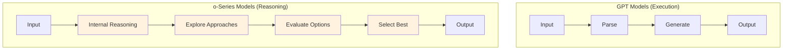
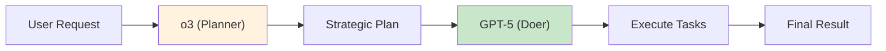
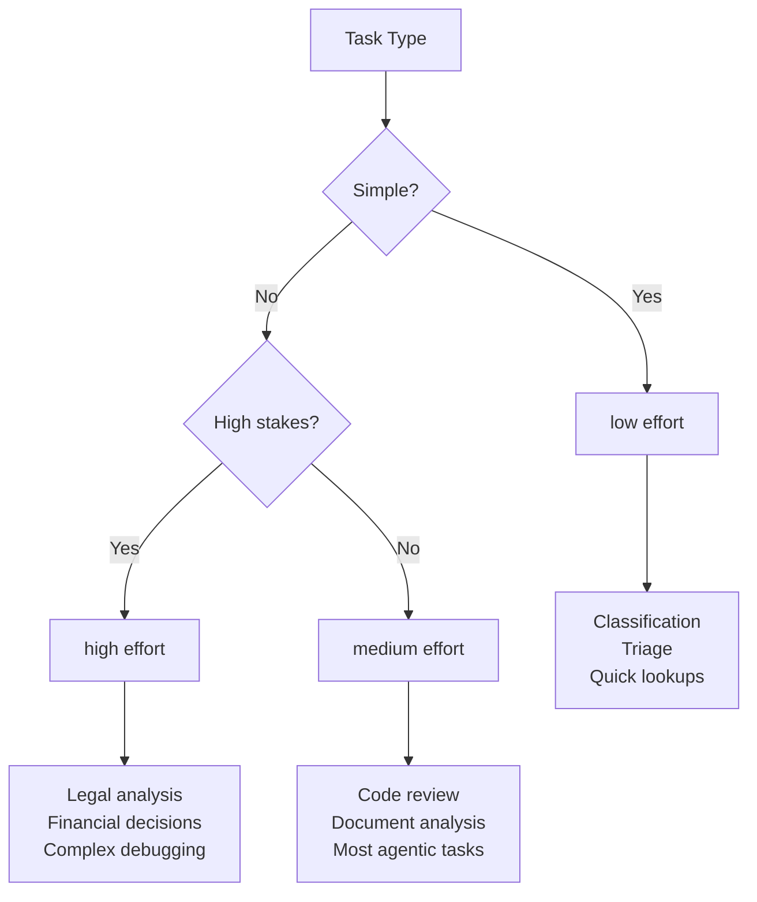
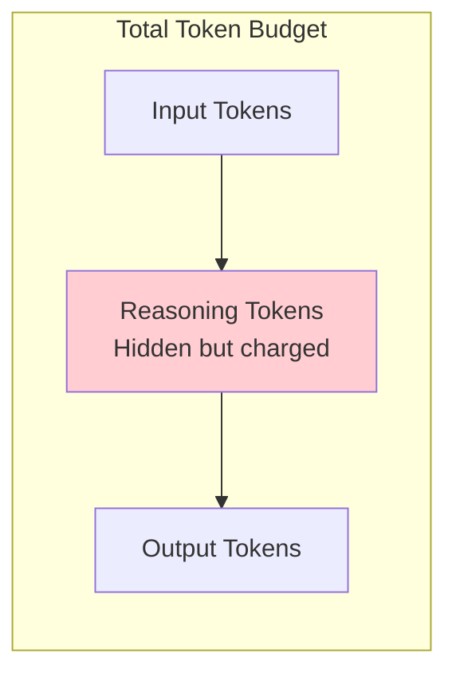

# OpenAI Reasoning Models: o3 and o4-mini

## Introduction

OpenAI's o-series models represent a fundamentally different approach to AI problem-solving. Unlike GPT models that execute instructions immediately, reasoning models engage in extended internal "thinking" before responding—making them exceptionally powerful for complex, multi-step problems where accuracy matters more than speed.

The critical insight for prompting these models: **everything you know about chain-of-thought prompting is wrong here.** Telling an o-series model to "think step by step" doesn't help—it already thinks deeply by design. In fact, such prompts can actually hurt performance.

### What We'll Cover

- How reasoning models differ from GPT models fundamentally
- When to use o3 vs o4-mini vs GPT models
- The reasoning effort parameter and how to tune it
- Goal-oriented prompting vs step-by-step instructions
- Token reservation for reasoning
- Multi-turn conversations with reasoning context
- Real-world use cases and patterns

### Prerequisites

- Understanding of GPT model prompting (previous lesson)
- Familiarity with token concepts and costs
- Basic experience with complex problem-solving prompts

---

## Understanding Reasoning Models

Reasoning models are trained differently than GPT models—they learn to "think" before answering, exploring multiple approaches internally before committing to a response.

### The Fundamental Difference



> **🔑 Key Insight:** GPT models are like expert typists—fast and accurate when told exactly what to do. Reasoning models are like expert problem-solvers—slower but capable of figuring out complex solutions independently.

### When to Choose Each Model Type

| Factor | GPT Models | Reasoning Models |
|--------|------------|------------------|
| **Speed** | ✅ Fast | ⏱️ Slower (thinking takes time) |
| **Cost** | ✅ Lower | 💰 Higher (reasoning tokens) |
| **Well-defined tasks** | ✅ Excellent | Overkill |
| **Ambiguous problems** | ⚠️ May struggle | ✅ Excels |
| **Complex reasoning** | ⚠️ Needs explicit CoT | ✅ Built-in |
| **Multi-step planning** | ⚠️ Requires scaffolding | ✅ Natural |

### The Planner-Doer Architecture

Many production systems combine both model types:



> **🤖 AI Context:** This architecture mirrors how humans work—strategic thinking for planning, then focused execution. Use reasoning models to decide *what* to do, GPT models to *do* it quickly.

---

## The Reasoning Effort Parameter

The `reasoning_effort` parameter controls how deeply the model thinks:

```python
from openai import OpenAI

client = OpenAI()

response = client.chat.completions.create(
    model="o3",
    reasoning_effort="high",  # Options: low, medium, high
    messages=[{
        "role": "user",
        "content": "Analyze this acquisition deal for hidden risks..."
    }]
)
```

### Choosing the Right Effort Level

| Effort Level | Thinking Depth | Latency | Cost | Best For |
|--------------|----------------|---------|------|----------|
| `low` | Minimal exploration | Fast | Lower | Simple decisions, quick classifications |
| `medium` | Balanced analysis | Moderate | Medium | Most tasks (default) |
| `high` | Deep, thorough | Slow | Higher | Complex problems, high-stakes decisions |

### Task-Based Recommendations



---

## Goal-Oriented Prompting

The most important paradigm shift for reasoning models: **give goals, not steps.**

### Why Step-by-Step Fails

Traditional chain-of-thought prompting explicitly tells the model how to think:

```markdown
❌ WRONG for reasoning models:
"Think step by step. First, identify the variables. 
Then, set up the equation. Next, solve for x..."
```

This is counterproductive because:
1. The model already thinks deeply—external CoT is redundant
2. Your prescribed steps may be suboptimal
3. It constrains the model's natural reasoning process

### The Goal-Oriented Approach

Instead, describe the desired outcome and let the model figure out how:

```markdown
✅ CORRECT for reasoning models:
"Solve this equation and explain your final answer. 
I need to understand both the solution and why it works."
```

### Comparative Example

**Problem:** Analyze a complex legal contract for risks.

```markdown
❌ Step-by-step (hurts performance):
"Analyze this contract by:
1. First, identify all parties mentioned
2. Then, list all obligations for each party
3. Next, find any conditional clauses
4. Then, identify termination conditions
5. Finally, summarize risks"

✅ Goal-oriented (optimal):
"Analyze this contract and identify all provisions that could 
create financial or legal risk for Party A. I need a comprehensive 
risk assessment with specific clause references."
```

> **💡 Tip:** Think of it like delegating to an expert. You wouldn't tell a lawyer *how* to analyze a contract—you'd tell them what outcome you need.

---

## Prompting Best Practices

OpenAI provides specific guidance for reasoning models that differs significantly from GPT prompting:

### Do's and Don'ts

| ✅ Do | ❌ Don't |
|-------|---------|
| Keep prompts simple and direct | Use elaborate chain-of-thought instructions |
| State the goal clearly | Prescribe reasoning steps |
| Use delimiters for structure | Over-explain obvious things |
| Provide context when needed | Include unnecessary examples |
| Specify success criteria | Add "think step by step" |
| Try zero-shot first | Start with many examples |

### Delimiter Usage

Reasoning models benefit from clear structure, but the structure should organize *information*, not *thinking*:

```markdown
✅ Good structure (organizes information):
<context>
Company financial data for Q3 2025...
</context>

<question>
Should we proceed with the acquisition given these financials?
</question>

<constraints>
- Budget cap: $50M
- Must close by Q1 2026
- Regulatory approval required
</constraints>
```

```markdown
❌ Bad structure (prescribes thinking):
<step1>
First analyze the revenue trends...
</step1>

<step2>
Then calculate the valuation...
</step2>
```

### Developer Messages for Reasoning Models

Like GPT-5, reasoning models use developer messages instead of system messages:

```python
response = client.chat.completions.create(
    model="o3",
    messages=[
        {
            "role": "developer",  # Not "system"
            "content": """You are a financial analyst evaluating M&A deals.
            
            Focus on:
            - Hidden liabilities
            - Integration risks  
            - Synergy assumptions
            
            Be skeptical of optimistic projections."""
        },
        {
            "role": "user",
            "content": "Evaluate this acquisition proposal: [data]"
        }
    ]
)
```

---

## Token Management for Reasoning

Reasoning models consume tokens for internal thinking that you're charged for but don't see. Understanding this is crucial for cost management.

### The Token Budget Reality



### Reserving Tokens for Reasoning

For complex problems, ensure the model has room to think:

```python
response = client.chat.completions.create(
    model="o3",
    max_completion_tokens=16000,  # Total budget
    # Model will use what it needs for reasoning
    # Remainder goes to output
    messages=[...]
)
```

> **⚠️ Warning:** If your output is truncated on complex problems, the model may have exhausted tokens on reasoning. Increase `max_completion_tokens` or simplify the problem.

### Checking Token Usage

```python
response = client.chat.completions.create(
    model="o3",
    messages=[...]
)

# Inspect token breakdown
usage = response.usage
print(f"Input tokens: {usage.prompt_tokens}")
print(f"Reasoning tokens: {usage.completion_tokens_details.reasoning_tokens}")
print(f"Output tokens: {usage.completion_tokens}")
```

---

## Multi-Turn Conversations

The Responses API handles reasoning context differently than Chat Completions:

### The Context Persistence Advantage

With `o3` and `o4-mini`, some reasoning context persists between function calls:

```python
# Initial analysis request
response = client.responses.create(
    model="o3",
    store=True,  # Enable context storage
    input="Analyze this codebase for security vulnerabilities..."
)

# Follow-up uses previous reasoning context
follow_up = client.responses.create(
    model="o3",
    previous_response_id=response.id,  # Connects to prior reasoning
    input="Now prioritize the vulnerabilities by severity"
)
```

> **🔑 Key Insight:** The Responses API with `previous_response_id` allows the model to reference prior reasoning traces, reducing redundant thinking and improving consistency.

### Best Practices for Multi-Turn

1. **Use Responses API** with `store=True` for multi-turn reasoning tasks
2. **Include all reasoning items** from previous responses in follow-ups
3. **Don't modify conversation history** between turns—let the API manage it
4. **For simple follow-ups**, Chat Completions works fine; Responses API matters for complex chains

---

## Real-World Use Cases

### 1. Navigating Ambiguous Tasks

Reasoning models excel when instructions are incomplete:

```markdown
Prompt:
"Our customer data shows unusual patterns. Figure out what's happening 
and whether we should be concerned."

[Reasoning model will:]
- Ask itself clarifying questions
- Consider multiple hypotheses
- Evaluate evidence for each
- Recommend based on analysis
```

### 2. Finding Needles in Haystacks

Complex document analysis with high accuracy requirements:

```markdown
Prompt:
"Review these 50 contract documents and identify any 'change of control' 
provisions that could trigger obligations if the company is acquired."

[Reasoning model approach:]
- Systematically reviews each document
- Identifies relevant clauses even in footnotes
- Cross-references between documents
- Surfaces non-obvious implications
```

### 3. Multi-Step Agentic Planning

Using reasoning models as the "brain" of an agent:

```python
# o3 plans the strategy
planning_response = client.chat.completions.create(
    model="o3",
    reasoning_effort="high",
    messages=[{
        "role": "user",
        "content": """
        Goal: Deploy a new microservice to production
        
        Available tools:
        - git operations
        - docker build/push
        - kubernetes deploy
        - monitoring setup
        
        Current state: Code is in feature branch, not tested
        
        Create a deployment plan with rollback strategy.
        """
    }]
)

# GPT-5 executes each step
for step in planning_response.plan:
    execution = client.responses.create(
        model="gpt-5",
        tools=[git_tool, docker_tool, k8s_tool],
        input=f"Execute: {step}"
    )
```

### 4. Evaluating Other Model Outputs

Reasoning models as judges:

```markdown
Prompt:
"Here are three different summaries of the same research paper, 
generated by different models. Evaluate which is most accurate 
and comprehensive. Explain any errors or omissions in each."

[Original Paper]
...

[Summary A]
...

[Summary B]
...

[Summary C]
...
```

> **💡 Tip:** One Braintrust customer saw F1 scores jump from 0.12 with GPT-4o to 0.74 with o1 for model evaluation tasks.

---

## Visual Reasoning with o1

Currently, `o1` is the only reasoning model with vision capabilities:

```python
response = client.chat.completions.create(
    model="o1",
    messages=[{
        "role": "user",
        "content": [
            {
                "type": "text",
                "text": "Analyze this architectural drawing and generate a bill of materials"
            },
            {
                "type": "image_url",
                "image_url": {"url": "data:image/png;base64,..."}
            }
        ]
    }]
)
```

Visual reasoning excels at:
- Complex charts with ambiguous structure
- Technical diagrams requiring inference
- Poor quality images needing interpretation
- Cross-referencing between image elements

---

## Hands-on Exercise

### Your Task

Design a prompt for a reasoning model to evaluate a business acquisition.

### Requirements

1. Use goal-oriented prompting (no step-by-step instructions)
2. Provide structured context using appropriate delimiters
3. Specify clear success criteria
4. Include constraints the model should consider
5. Allow the model to identify risks you haven't anticipated

### Scenario

A tech startup is considering acquiring a smaller competitor. You have:
- Target company financials (revenue: $5M, losses: $2M/year)
- Due diligence report (some customer concentration risk noted)
- Market analysis (growing market, 3 other competitors)

### Expected Result

A prompt that would help an o3 model provide thorough acquisition analysis.

<details>
<summary>💡 Hints (click to expand)</summary>

- Focus on what you want to *know*, not how to analyze
- Use XML tags to separate context from the question
- Include both hard constraints and softer preferences
- Ask for reasoning transparency in the output

</details>

<details>
<summary>✅ Solution (click to expand)</summary>

```markdown
<context>
# Acquisition Target: TechStartup Inc.

## Financial Summary
- Annual Revenue: $5M (growing 20% YoY)
- Net Loss: $2M/year (improving from $3M prior year)
- Cash Runway: 8 months at current burn
- Key Customers: Top 3 customers = 60% of revenue

## Due Diligence Findings
- Clean IP ownership
- Customer concentration risk flagged
- Key employee retention uncertain
- No pending litigation

## Market Context
- TAM growing 25% annually
- Three well-funded competitors
- Consolidation trend in sector
</context>

<question>
Should we proceed with this acquisition at a proposed $15M valuation?

Provide your recommendation with:
1. Key factors supporting the decision
2. Key risks that could derail value
3. Deal structure suggestions to mitigate risks
4. Walk-away conditions we should establish
</question>

<constraints>
- Maximum budget: $20M including integration costs
- Must retain at least 70% of engineering team
- Integration must complete within 6 months
- Cannot disrupt our current product roadmap
</constraints>

<output_requirements>
Be direct about your recommendation (proceed/don't proceed/conditional).
Identify risks I may not have considered based on patterns you've seen.
Quantify risks where possible (likelihood, impact).
</output_requirements>
```

</details>

---

## Summary

✅ Reasoning models think internally—don't tell them *how* to think

✅ Use goal-oriented prompts: describe outcomes, not steps

✅ The `reasoning_effort` parameter controls thinking depth vs speed tradeoff

✅ Reserve tokens for reasoning on complex problems

✅ Combine with GPT models: o-series for planning, GPT for execution

✅ Responses API with `previous_response_id` maintains reasoning context

✅ Best for: ambiguous tasks, complex analysis, multi-step planning, evaluation

**Next:** [Anthropic Claude Models](./03-anthropic-claude-models.md)

---

## Further Reading

- [Reasoning Best Practices](https://platform.openai.com/docs/guides/reasoning-best-practices) - Official guide
- [Reasoning Models Overview](https://platform.openai.com/docs/guides/reasoning) - Technical documentation
- [Using Reasoning for Validation](https://cookbook.openai.com/examples/o1/using_reasoning_for_data_validation) - Cookbook example
- [Reasoning with o1 Course](https://www.deeplearning.ai/short-courses/reasoning-with-o1/) - DeepLearning.AI

<!-- 
Sources Consulted:
- OpenAI Reasoning Best Practices: https://platform.openai.com/docs/guides/reasoning-best-practices
- OpenAI GPT-5 Prompting Guide: https://cookbook.openai.com/examples/gpt-5/gpt-5_prompting_guide
- OpenAI Reasoning Models documentation
- Customer quotes from Hebbia, Endex, Blue J, BlueFlame AI, Argon AI, Lindy.AI, SafetyKit, CodeRabbit, Windsurf, Braintrust
-->
