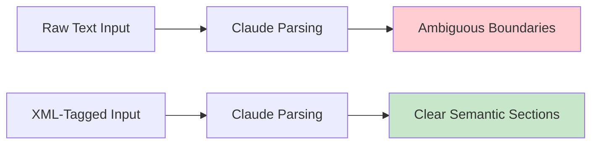

# Anthropic Claude Models: Claude 4 Opus and Sonnet

## Introduction

Anthropic's Claude models bring a distinctive philosophy to AI: they're designed for nuanced understanding, careful reasoning, and thoughtful responses. Where GPT models excel at literal instruction following and o-series at deep reasoning, Claude models shine at interpreting context, handling ambiguity gracefully, and maintaining consistent behavior across complex conversations.

Claude 4 represents Anthropic's most capable model family, with Opus offering maximum capability and Sonnet providing an excellent balance of performance and efficiency. Both share prompting principles that differ meaningfully from other providers.

### What We'll Cover

- Claude's unique approach to instruction interpretation
- System prompts as a separate API parameter
- XML tags as Claude's native structure
- Extended thinking mode for complex tasks
- Prompt engineering fundamentals (clarity, examples, prefilling)
- Handling Claude's safety behaviors
- Best practices for multi-turn conversations

### Prerequisites

- Basic understanding of LLM prompting
- Familiarity with API-based AI interactions
- Understanding of token concepts

---

## Claude's Design Philosophy

Claude is trained with Constitutional AI principles, making it inherently thoughtful about its responses. This affects how you should prompt it:

### Key Characteristics

| Trait | What It Means | Prompting Implication |
|-------|---------------|----------------------|
| **Nuanced interpretation** | Reads between the lines | Be explicit when you want literal behavior |
| **Safety-conscious** | May decline harmful requests | Frame requests with clear legitimate purpose |
| **Context-sensitive** | Adapts to conversational context | Provide sufficient background |
| **Explanation-oriented** | Tends to explain reasoning | Ask for concise answers when needed |

> **🔑 Key Insight:** Claude interprets prompts like a thoughtful colleague who wants to understand your intent, not just execute instructions. This is powerful for complex tasks but requires clear communication for straightforward ones.

### The Golden Rule of Prompting Claude

From Anthropic's documentation:

> Show your prompt to a colleague, ideally someone who has minimal context on the task, and ask them to follow the instructions. If they're confused, Claude will likely be too.

This simple test captures Claude's prompting philosophy—clarity and directness matter.

---

## System Prompts: A Separate Parameter

Unlike OpenAI's message-based system prompts, Claude accepts system prompts as a distinct API parameter:

```python
import anthropic

client = anthropic.Anthropic()

response = client.messages.create(
    model="claude-4-sonnet-20250115",
    max_tokens=1024,
    system="You are an expert Python developer. Provide concise, production-ready code with clear comments.",
    messages=[
        {"role": "user", "content": "Write a function to validate email addresses"}
    ]
)
```

### Why the Separate Parameter Matters

1. **Clear hierarchy**: System prompts have higher authority than user messages
2. **Consistent behavior**: System context persists across multi-turn conversations
3. **Cleaner conversation history**: System instructions don't clutter the message array
4. **Easy updates**: Change system behavior without reconstructing messages

### Effective System Prompt Structure

```markdown
# Role Definition
You are [specific role] with expertise in [domain].

# Core Behaviors
- Always [key behavior 1]
- Never [prohibited behavior]
- When uncertain, [fallback behavior]

# Output Preferences
- Format: [preferred format]
- Length: [concise/detailed]
- Tone: [professional/casual/technical]

# Domain-Specific Rules
[Any special constraints or knowledge]
```

---

## XML Tags: Claude's Native Structure

Claude responds exceptionally well to XML-tagged prompts. This isn't just formatting preference—Claude was trained extensively on XML-structured content.

### Why XML Works for Claude



### Basic XML Patterns

```markdown
<context>
The user is a senior developer working on a payment processing system.
They need help with PCI compliance requirements.
</context>

<task>
Review this code for security vulnerabilities, focusing on 
payment data handling.
</task>

<code>
def process_payment(card_number, cvv, amount):
    # User's code here
    pass
</code>

<output_format>
For each issue found:
1. Line number
2. Vulnerability type
3. Risk level (high/medium/low)
4. Recommended fix
</output_format>
```

### Advanced XML Patterns

**Nested structures for complex data:**

```xml
<documents>
  <document id="1" type="contract">
    <title>Service Agreement</title>
    <content>...</content>
  </document>
  <document id="2" type="policy">
    <title>Privacy Policy</title>
    <content>...</content>
  </document>
</documents>

<analysis_request>
Compare these documents for consistency in data handling terms.
</analysis_request>
```

**Conditional sections:**

```xml
<instructions>
  <always>Always verify user identity before proceeding.</always>
  <if condition="user_is_admin">
    Provide full system access and detailed logs.
  </if>
  <if condition="user_is_guest">
    Limit to read-only operations.
  </if>
</instructions>
```

---

## Be Clear, Direct, and Detailed

Anthropic emphasizes three principles for effective prompting:

### 1. Give Contextual Information

Tell Claude what the output is for:

```markdown
❌ Vague:
"Summarize this document."

✅ Contextual:
"Summarize this legal document for a non-lawyer client who needs 
to understand their obligations. Focus on actionable items and 
deadlines. The client has 10 minutes to review before a meeting."
```

### 2. Be Specific About Desired Behavior

```markdown
❌ Ambiguous:
"Write good code."

✅ Specific:
"Write Python code that:
- Follows PEP 8 style guidelines
- Includes type hints for all parameters and returns
- Has docstrings in Google format
- Handles edge cases with explicit error messages
- Uses no external dependencies beyond the standard library"
```

### 3. Use Sequential Steps

When order matters, use numbered lists:

```markdown
To process this customer request:

1. First, verify the customer ID exists in our system
2. Check if they have an active subscription
3. If yes, process the feature request
4. If no, explain upgrade options
5. Log the interaction with outcome code
```

---

## Extended Thinking Mode

Claude 4 supports extended thinking—a mode where Claude explicitly works through complex problems before responding.

### When to Use Extended Thinking

| Task Type | Extended Thinking? | Reasoning |
|-----------|-------------------|-----------|
| Simple Q&A | ❌ No | Overhead not needed |
| Code generation | ⚠️ Sometimes | For complex logic only |
| Complex analysis | ✅ Yes | Benefits from structured reasoning |
| Math problems | ✅ Yes | Reduces errors significantly |
| Multi-step planning | ✅ Yes | Improves coherence |

### Enabling Extended Thinking

```python
response = client.messages.create(
    model="claude-4-sonnet-20250115",
    max_tokens=16000,
    thinking={
        "type": "enabled",
        "budget_tokens": 10000  # Tokens allocated for thinking
    },
    messages=[
        {"role": "user", "content": "Solve this optimization problem..."}
    ]
)

# Access thinking and response separately
for block in response.content:
    if block.type == "thinking":
        print("Claude's reasoning:", block.thinking)
    elif block.type == "text":
        print("Final answer:", block.text)
```

### Extended Thinking Best Practices

From Anthropic's documentation:

**Do: Use general instructions**
```markdown
✅ "Think deeply about this problem. Consider multiple approaches 
and show your complete reasoning. Try different methods if your 
first approach doesn't work."
```

**Don't: Prescribe exact thinking steps**
```markdown
❌ "Think step by step:
1. First, identify the variables
2. Then, set up the equation
3. Next, solve for x..."
```

> **💡 Tip:** Claude's extended thinking often exceeds human ability to prescribe optimal reasoning paths. Let it explore freely, then add constraints only if outputs need correction.

### Token Budget Considerations

```python
# Minimum thinking budget: 1024 tokens
# For complex tasks: 10,000-32,000 tokens
# Maximum: model-dependent

thinking_config = {
    "type": "enabled",
    "budget_tokens": 16000  # Adjust based on task complexity
}
```

> **⚠️ Warning:** For workloads requiring 32K+ thinking tokens, Anthropic recommends batch processing to avoid networking timeouts.

---

## Multishot Prompting (Few-Shot Examples)

Claude benefits significantly from well-crafted examples:

### Example Structure

```markdown
I need you to extract action items from meeting notes.

<example>
<input>
Meeting discussed Q3 targets. John will prepare the budget by Friday.
Sarah needs to review the marketing plan. We agreed to reconvene next Tuesday.
</input>
<output>
- John: Prepare Q3 budget (Due: Friday)
- Sarah: Review marketing plan (Due: Not specified)
- Team: Reconvene meeting (Due: Tuesday)
</output>
</example>

<example>
<input>
Quick sync about the launch. Maria to finalize copy today.
Dev team blocked on API specs - needs PM input ASAP.
</input>
<output>
- Maria: Finalize copy (Due: Today)
- PM: Provide API specs to dev team (Due: ASAP - blocking)
</output>
</example>

Now extract action items from this:
<input>
{user's meeting notes}
</input>
```

### Example Selection Guidelines

| Principle | Why It Matters |
|-----------|---------------|
| **Diverse examples** | Shows range of acceptable inputs/outputs |
| **Edge cases** | Demonstrates handling of tricky situations |
| **Consistent format** | Reinforces expected output structure |
| **Realistic complexity** | Matches actual use case difficulty |

---

## Prefilling Claude's Response

A powerful Claude-specific technique: start Claude's response to guide format and approach.

### Basic Prefilling

```python
response = client.messages.create(
    model="claude-4-sonnet-20250115",
    max_tokens=1024,
    messages=[
        {"role": "user", "content": "What's the capital of France?"},
        {"role": "assistant", "content": "The capital of France is"}  # Prefill
    ]
)
# Claude will complete: "Paris." (concise, no preamble)
```

### Prefilling for JSON Output

```python
response = client.messages.create(
    model="claude-4-sonnet-20250115",
    max_tokens=1024,
    messages=[
        {
            "role": "user", 
            "content": "Extract the name and age from: 'John is 32 years old'"
        },
        {
            "role": "assistant", 
            "content": "{"  # Forces JSON output
        }
    ]
)
# Claude completes with valid JSON
```

### Prefilling for Specific Formats

```python
# For code output
messages = [
    {"role": "user", "content": "Write a Python function to reverse a string"},
    {"role": "assistant", "content": "```python\ndef reverse_string("}
]

# For structured analysis  
messages = [
    {"role": "user", "content": "Analyze this business proposal"},
    {"role": "assistant", "content": "## Analysis\n\n### Strengths\n1."}
]
```

> **⚠️ Important:** Prefilling is NOT allowed when extended thinking is enabled. The model needs freedom to think before responding.

---

## Handling Safety Behaviors

Claude is designed to decline harmful requests. Understanding this helps you work with, not against, these behaviors.

### Common Decline Scenarios

| Request Type | Claude's Concern | Solution |
|--------------|------------------|----------|
| Code for "hacking" | Potential misuse | Frame as security testing with authorization |
| Medical advice | Risk of harm | Request general information, not diagnosis |
| Legal guidance | Liability | Ask for general principles, not specific advice |
| Controversial topics | Polarization | Request balanced perspectives explicitly |

### Framing Legitimate Requests

```markdown
❌ May trigger safety behavior:
"Write code to break into a system"

✅ Clear legitimate purpose:
"I'm a security researcher authorized to test our company's 
systems. Write a Python script that tests for common SQL injection 
vulnerabilities, with inline comments explaining each test for 
our security training documentation."
```

### When Claude Declines

If Claude declines a legitimate request:

1. **Add context**: Explain the legitimate purpose
2. **Specify authorization**: Mention you have appropriate access/permission
3. **Narrow scope**: Request a smaller, clearly benign subset
4. **Rephrase**: Sometimes different wording helps

---

## Long Context Handling

Claude 4 supports extended context windows. Here's how to use them effectively:

### Document Placement

```markdown
# Best structure for long context:

<documents>
[All your reference documents here]
</documents>

<instructions>
[Place instructions AFTER the documents]
Based on the documents above, [your request]...
</instructions>
```

### Anchoring Context

For very long contexts, explicitly anchor your query:

```markdown
<context>
[100+ pages of content]
</context>

---
Based on the information provided in the context above, 
specifically focusing on the sections about data handling 
and user privacy:

1. What are the main compliance requirements?
2. Are there any contradictions between documents?
```

### Tips for Long Documents

- Place all documents first, instructions last
- Use clear document separators with IDs
- Reference specific documents by ID in questions
- Ask Claude to quote relevant sections in its answers

---

## Hands-on Exercise

### Your Task

Create a Claude prompt for a customer support analysis system that reviews support tickets and categorizes them.

### Requirements

1. Use XML tags to structure the prompt
2. Include a clear system prompt
3. Provide 2-3 diverse examples
4. Use prefilling to ensure consistent output format
5. Handle edge cases (empty tickets, multiple issues)

### Expected Result

A complete prompt that produces consistent, well-structured ticket categorizations.

<details>
<summary>💡 Hints (click to expand)</summary>

- Use `<ticket>` tags for input structure
- Categories might include: billing, technical, feature request, complaint
- Consider urgency levels alongside categories
- Examples should show different ticket types

</details>

<details>
<summary>✅ Solution (click to expand)</summary>

**System Prompt:**
```markdown
You are a customer support ticket analyzer. Your job is to:
1. Categorize incoming tickets by type and urgency
2. Extract key information for routing
3. Flag any tickets requiring immediate escalation

Categories: billing, technical, feature_request, complaint, general_inquiry
Urgency: critical (service down), high (major issue), medium (inconvenience), low (question)

Always respond in the exact JSON format shown in examples.
```

**User Prompt:**
```xml
<examples>
<example>
<ticket id="1001">
Subject: Can't login to my account
Body: I've tried resetting my password 3 times but still can't access 
my account. This is urgent as I have a presentation in 2 hours that 
requires data from your platform.
</ticket>
<analysis>
{
  "ticket_id": "1001",
  "category": "technical",
  "urgency": "critical",
  "key_issues": ["login failure", "password reset not working"],
  "escalation_needed": true,
  "escalation_reason": "Time-sensitive business impact",
  "suggested_routing": "tier_2_technical"
}
</analysis>
</example>

<example>
<ticket id="1002">
Subject: Question about pricing tiers
Body: Hi, I'm considering upgrading from Basic to Pro. Can you explain 
the differences and if there's a discount for annual billing?
</ticket>
<analysis>
{
  "ticket_id": "1002",
  "category": "general_inquiry",
  "urgency": "low",
  "key_issues": ["pricing question", "upgrade consideration"],
  "escalation_needed": false,
  "escalation_reason": null,
  "suggested_routing": "sales_team"
}
</analysis>
</example>

<example>
<ticket id="1003">
Subject: 
Body: 
</ticket>
<analysis>
{
  "ticket_id": "1003",
  "category": "unknown",
  "urgency": "low",
  "key_issues": ["empty ticket"],
  "escalation_needed": false,
  "escalation_reason": null,
  "suggested_routing": "auto_response_request_details"
}
</analysis>
</example>
</examples>

<ticket id="1004">
{user's actual ticket content}
</ticket>
```

**Assistant Prefill:**
```json
{
  "ticket_id": "1004",
```

</details>

---

## Summary

✅ Claude interprets prompts contextually—be explicit when you want literal behavior

✅ Use the separate `system` parameter for persistent instructions

✅ XML tags are Claude's native structural language—use them freely

✅ Extended thinking helps complex tasks but requires different prompting

✅ Prefilling guides output format without lengthy instructions

✅ Frame legitimate requests clearly to work with safety behaviors

✅ For long context: documents first, instructions last, anchor clearly

**Next:** [Google Gemini Models](./04-google-gemini-models.md)

---

## Further Reading

- [Anthropic Prompt Engineering Overview](https://platform.claude.com/docs/en/build-with-claude/prompt-engineering/overview) - Official guide
- [Extended Thinking Tips](https://platform.claude.com/docs/en/build-with-claude/prompt-engineering/extended-thinking-tips) - Advanced reasoning
- [Be Clear and Direct](https://platform.claude.com/docs/en/build-with-claude/prompt-engineering/be-clear-and-direct) - Core principles
- [Prompt Engineering Interactive Tutorial](https://github.com/anthropics/prompt-eng-interactive-tutorial) - Hands-on practice
- [Claude Prompt Library](https://platform.claude.com/docs/en/resources/prompt-library/library) - Example prompts

<!-- 
Sources Consulted:
- Anthropic Prompt Engineering Overview: https://platform.claude.com/docs/en/build-with-claude/prompt-engineering/overview
- Anthropic Extended Thinking Tips: https://platform.claude.com/docs/en/build-with-claude/prompt-engineering/extended-thinking-tips
- Anthropic Be Clear and Direct: https://platform.claude.com/docs/en/build-with-claude/prompt-engineering/be-clear-and-direct
- Claude API documentation
-->
