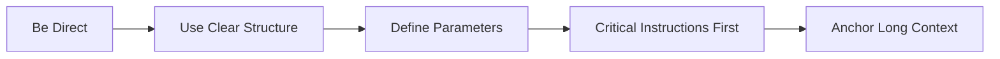
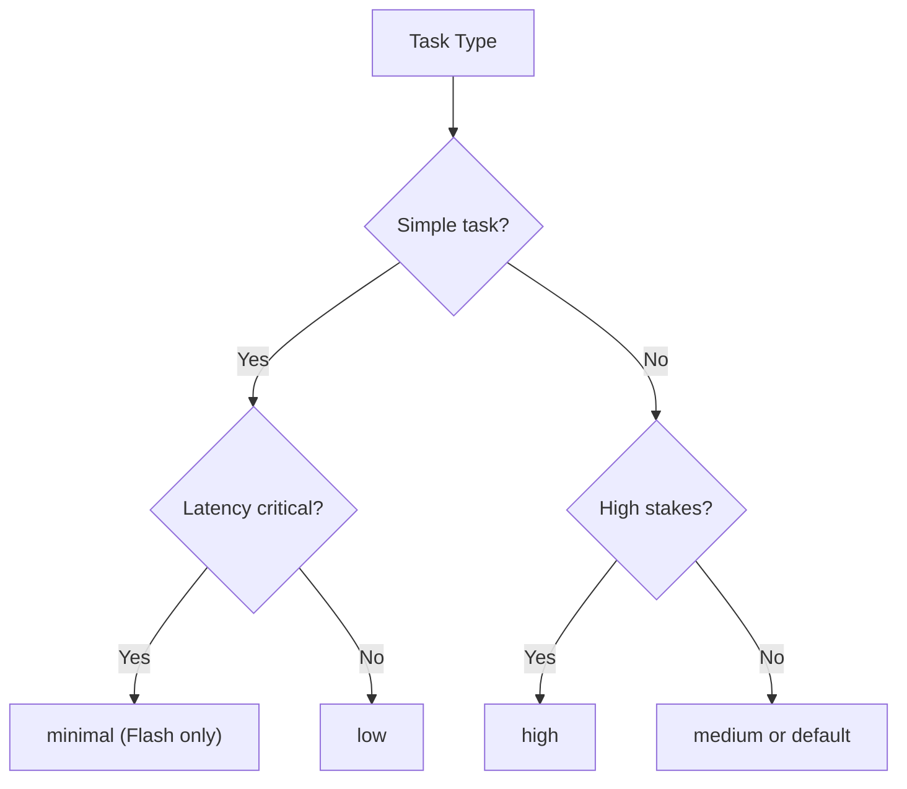

# Google Gemini Models: Gemini 3 Flash and Pro

## Introduction

Google's Gemini models bring unique strengths to the AI landscape: native multimodal understanding, deep integration with Google's ecosystem (Search, Maps, YouTube), and distinctive thinking capabilities. Gemini 3 represents Google's latest generation, with Flash optimized for speed and Pro for maximum capability.

What sets Gemini apart is its ground-up multimodal design—images, audio, video, and text are equal-class inputs, not afterthoughts. This fundamentally changes how you can structure prompts.

### What We'll Cover

- Gemini 3 architecture and key characteristics
- The critical temperature setting (keep it at 1.0!)
- Thinking levels and thinking budgets
- System instruction best practices
- Native multimodal prompting
- Grounding with Google Search
- Knowledge cutoff and time-awareness
- Agentic workflow patterns

### Prerequisites

- Basic understanding of LLM prompting
- Familiarity with multimodal AI concepts
- Experience with at least one major LLM API

---

## Gemini 3 Model Characteristics

Gemini 3 comes in two primary variants:

| Feature | Gemini 3 Flash | Gemini 3 Pro |
|---------|----------------|--------------|
| **Speed** | ✅ Fastest | Moderate |
| **Context Window** | 1M tokens | 1M+ tokens |
| **Thinking** | Configurable (can be minimal) | Always-on (minimum enabled) |
| **Multimodal** | Full support | Full support |
| **Best For** | High-throughput, chat, simple tasks | Complex reasoning, detailed analysis |

### Core Prompting Principles

From Google's official guidance, Gemini 3 responds best to prompts that are:



> **🔑 Key Insight:** Gemini 3 provides direct, efficient answers by default. If you want conversational or detailed responses, you must explicitly request them.

---

## Critical: Temperature Configuration

**This is the most important Gemini-specific guidance**: keep temperature at its default of 1.0.

### Why Temperature 1.0 Matters

```python
from google import genai
from google.genai import types

# ✅ CORRECT - Keep default temperature
response = client.models.generate_content(
    model="gemini-3-flash",
    contents="Solve this math problem...",
    config=types.GenerateContentConfig(
        # Temperature defaults to 1.0 - leave it alone!
    )
)

# ❌ DANGEROUS - Changing temperature
response = client.models.generate_content(
    model="gemini-3-flash", 
    contents="Solve this math problem...",
    config=types.GenerateContentConfig(
        temperature=0.7  # Can cause loops, degraded performance!
    )
)
```

> **⚠️ Warning:** Google explicitly states: "Setting temperature below 1.0 may lead to unexpected behavior, such as looping or degraded performance, particularly in complex mathematical or reasoning tasks."

### When You Might Adjust Temperature

The only scenarios where temperature adjustment might be appropriate:
- Creative writing where you want more variation
- Brainstorming where "randomness" adds value
- **Always** test thoroughly if you deviate from 1.0

---

## Thinking Modes

Gemini 3 introduces `thinkingLevel` for controlling reasoning depth, replacing the older `thinkingBudget` from Gemini 2.5.

### Thinking Level Options

| Level | Gemini 3 Flash | Gemini 3 Pro | Description |
|-------|----------------|--------------|-------------|
| `minimal` | ✅ Supported | ❌ Not supported | Near-zero thinking, fastest |
| `low` | ✅ Supported | ✅ Supported | Minimal latency, simple tasks |
| `medium` | ❌ Not supported | ✅ Supported | Balanced for most tasks |
| `high` | ✅ Default (dynamic) | ✅ Default (dynamic) | Maximum reasoning depth |

### Setting Thinking Levels

```python
from google import genai
from google.genai import types

client = genai.Client()

# For simple, fast tasks
response = client.models.generate_content(
    model="gemini-3-flash",
    contents="List 3 famous physicists",
    config=types.GenerateContentConfig(
        thinking_config=types.ThinkingConfig(thinking_level="low")
    )
)

# For complex reasoning
response = client.models.generate_content(
    model="gemini-3-pro",
    contents="Analyze this legal contract for risks...",
    config=types.GenerateContentConfig(
        thinking_config=types.ThinkingConfig(thinking_level="high")
    )
)
```

### Choosing the Right Level



> **💡 Tip:** Start with the default (`high` with dynamic adjustment) and only reduce if latency is a problem. Gemini auto-adjusts based on task complexity.

---

## System Instructions

Gemini uses `systemInstruction` as a separate configuration parameter:

```python
response = client.models.generate_content(
    model="gemini-3-flash",
    contents="How do I handle authentication?",
    config=types.GenerateContentConfig(
        system_instruction="""
        You are a senior backend developer specializing in security.
        
        Core behaviors:
        - Always recommend industry-standard approaches
        - Include code examples in Python
        - Warn about common security pitfalls
        - Reference OWASP when relevant
        """
    )
)
```

### System Instruction Best Practices

From Google's Gemini 3 guidance:

```markdown
<role>
You are Gemini 3, a specialized assistant for [Domain].
You are precise, analytical, and persistent.
</role>

<instructions>
1. **Plan**: Analyze the task and create a step-by-step plan.
2. **Execute**: Carry out the plan.
3. **Validate**: Review your output against the user's task.
4. **Format**: Present the final answer in the requested structure.
</instructions>

<constraints>
- Verbosity: [Low/Medium/High]
- Tone: [Formal/Casual/Technical]
</constraints>

<output_format>
Structure your response as follows:
1. **Executive Summary**: [Short overview]
2. **Detailed Response**: [The main content]
</output_format>
```

### Placement Matters

For long contexts, Google recommends:

1. **System instruction**: Role, constraints, output format
2. **Context first**: All documents, data, reference material
3. **Instructions last**: Your specific question or task
4. **Anchor transition**: Clear phrase connecting context to query

```markdown
<context>
[100 pages of documents here]
</context>

---

Based on the information provided above, specifically focusing 
on the sections about data governance:

[Your specific question]
```

---

## Multimodal Prompting

Gemini's native multimodal design means images, audio, and video are first-class inputs:

### Image Analysis

```python
import PIL.Image

image = PIL.Image.open("diagram.png")

response = client.models.generate_content(
    model="gemini-3-flash",
    contents=[
        "Analyze this architecture diagram. Identify all services and their connections.",
        image  # Image is a direct input
    ]
)
```

### Video Understanding

```python
# Upload video for analysis
video_file = client.files.upload(path="presentation.mp4")

response = client.models.generate_content(
    model="gemini-3-pro",
    contents=[
        video_file,
        "Summarize the key points from this presentation. Include timestamps for each major topic."
    ]
)
```

### Multi-Modal Best Practices

| Input Type | Best Practices |
|------------|---------------|
| **Images** | Reference image content directly in instructions |
| **Diagrams** | Ask for specific elements, relationships, or data |
| **Video** | Request timestamps when relevant |
| **Audio** | Specify transcription vs analysis needs |
| **Mixed** | Treat all modalities as equal-class inputs |

> **🤖 AI Context:** Gemini's multimodal training means it doesn't "convert" images to text first—it understands them natively. This enables tasks like object detection and segmentation that pure text models can't do.

---

## Time Awareness and Knowledge Cutoff

Gemini 3 has a knowledge cutoff, and Google provides specific guidance for handling time-sensitive queries:

### Setting Knowledge Cutoff Context

Add this to your system instructions:

```markdown
Your knowledge cutoff date is January 2025.
```

### Time-Sensitive Query Handling

For queries that need current information:

```markdown
For time-sensitive user queries that require up-to-date information, 
you MUST follow the provided current time (date and year) when 
formulating search queries in tool calls. Remember it is 2025 this year.
```

### Grounding with Google Search

Enable search grounding for real-time information:

```python
from google.genai import types

response = client.models.generate_content(
    model="gemini-3-flash",
    contents="What are the latest developments in quantum computing?",
    config=types.GenerateContentConfig(
        tools=[types.Tool(google_search=types.GoogleSearch())]
    )
)
```

### Grounding Performance Improvement

Add this to system instructions for better factual accuracy:

```markdown
You are a strictly grounded assistant limited to the information 
provided in the User Context. In your answers, rely **only** on 
the facts that are directly mentioned in that context. 

You must **not** access or utilize your own knowledge or common 
sense to answer. Do not assume or infer from the provided facts; 
simply report them exactly as they appear.

If the exact answer is not explicitly written in the context, 
you must state that the information is not available.
```

---

## Enhancing Reasoning and Planning

For complex tasks, explicitly guide Gemini's reasoning process:

### Explicit Planning Prompt

```markdown
Before providing the final answer, please:
1. Parse the stated goal into distinct sub-tasks.
2. Check if the input information is complete.
3. Create a structured outline to achieve the goal.
```

### Self-Critique Pattern

```markdown
Before returning your final response, review your generated 
output against the user's original constraints.

1. Did I answer the user's *intent*, not just their literal words?
2. Is the tone authentic to the requested persona?
3. Have I addressed all specified requirements?
```

### Combining Both

```markdown
<final_instruction>
Remember to think step-by-step before answering. After generating 
your response, verify it meets all specified constraints before 
presenting.
</final_instruction>
```

---

## Agentic Workflows with Gemini

Gemini 3 supports sophisticated agentic patterns. Google provides a comprehensive system instruction template:

### Agentic System Prompt Template

```markdown
You are a very strong reasoner and planner. Use these critical 
instructions to structure your plans, thoughts, and responses.

Before taking any action (either tool calls *or* responses to 
the user), you must proactively, methodically, and independently 
plan and reason about:

1) Logical dependencies and constraints: Analyze the intended 
   action against policy-based rules, order of operations, 
   prerequisites, and user constraints.

2) Risk assessment: What are the consequences of taking the 
   action? Will the new state cause any future issues?

3) Abductive reasoning: At each step, identify the most logical 
   reason for any problem encountered. Look beyond obvious causes.

4) Outcome evaluation: Does the previous observation require 
   changes to your plan?

5) Information availability: Incorporate all applicable sources 
   including tools, policies, history, and user input.

6) Precision and grounding: Verify claims by quoting exact 
   applicable information.

7) Completeness: Ensure all requirements are exhaustively 
   incorporated.

8) Persistence and patience: Do not give up unless all reasoning 
   is exhausted. On transient errors, retry. On other errors, 
   change strategy.
```

### Thought Signatures for Multi-Turn

Gemini uses "thought signatures" to maintain reasoning context across multi-turn interactions:

```python
# First turn
response1 = client.models.generate_content(
    model="gemini-3-flash",
    contents="Analyze this codebase for security issues...",
    config=types.GenerateContentConfig(
        thinking_config=types.ThinkingConfig(
            include_thoughts=True  # Return thought signatures
        )
    )
)

# Subsequent turns - include previous response for context
# The SDK handles thought signature circulation automatically
```

> **⚠️ Important:** When using function calling with thinking enabled, always return the complete response including thought signatures. Don't concatenate or merge parts with signatures.

---

## Structured Prompting Template

Google recommends this comprehensive template for Gemini 3:

### System Instruction

```markdown
<role>
You are Gemini 3, a specialized assistant for [Insert Domain].
You are precise, analytical, and persistent.
</role>

<instructions>
1. **Plan**: Analyze the task and create a step-by-step plan.
2. **Execute**: Carry out the plan.
3. **Validate**: Review your output against the user's task.
4. **Format**: Present the final answer in the requested structure.
</instructions>

<constraints>
- Verbosity: [Specify Low/Medium/High]
- Tone: [Specify Formal/Casual/Technical]
</constraints>

<output_format>
Structure your response as follows:
1. **Executive Summary**: [Short overview]
2. **Detailed Response**: [The main content]
</output_format>
```

### User Prompt

```markdown
<context>
[Insert relevant documents, code snippets, or background info here]
</context>

<task>
[Insert specific user request here]
</task>

<final_instruction>
Remember to think step-by-step before answering.
</final_instruction>
```

---

## Common Pitfalls and Solutions

### Pitfall 1: Changing Temperature

**Problem:** Loops, degraded performance, unexpected outputs

```python
# ❌ Don't do this
config = types.GenerateContentConfig(temperature=0.5)

# ✅ Keep default
config = types.GenerateContentConfig()  # temperature=1.0
```

### Pitfall 2: Over-Verbose Outputs

**Problem:** Gemini defaults to concise—but sometimes too concise

```markdown
❌ Gets minimal response:
"Explain quantum computing"

✅ Gets detailed response:
"Explain quantum computing in detail, suitable for a computer 
science graduate student. Include the mathematical foundations, 
key algorithms, and current hardware limitations."
```

### Pitfall 3: Ignoring Knowledge Cutoff

**Problem:** Outdated information for time-sensitive queries

```markdown
✅ Add to system instruction:
"Your knowledge cutoff date is January 2025. For current events 
or recent developments, use the Google Search tool to verify 
information."
```

### Pitfall 4: Not Using Native Multimodal

**Problem:** Describing images in text instead of providing them directly

```python
# ❌ Suboptimal
response = client.models.generate_content(
    model="gemini-3-flash",
    contents="I have an image of a flowchart. It shows boxes connected by arrows..."
)

# ✅ Use native multimodal
response = client.models.generate_content(
    model="gemini-3-flash",
    contents=[image_file, "Describe this flowchart and identify any logical issues"]
)
```

---

## Hands-on Exercise

### Your Task

Create a Gemini 3 prompt for a multimodal document analysis system that processes scanned invoices.

### Requirements

1. Use appropriate system instruction structure
2. Configure thinking level appropriately
3. Handle both the image input and text extraction
4. Output structured JSON for downstream processing
5. Include error handling for unclear/damaged scans

### Expected Result

A complete prompt configuration that extracts invoice data reliably.

<details>
<summary>💡 Hints (click to expand)</summary>

- Invoices have standard fields: vendor, date, items, totals
- Some scans may be rotated, blurry, or partial
- Consider confidence scores for extracted data
- Think about handling multiple pages

</details>

<details>
<summary>✅ Solution (click to expand)</summary>

```python
from google import genai
from google.genai import types

client = genai.Client()

system_instruction = """
<role>
You are an invoice processing specialist. You extract structured 
data from scanned invoice images with high accuracy.
</role>

<instructions>
1. Analyze the image quality first
2. Identify the invoice type and vendor
3. Extract all standard invoice fields
4. Flag any fields that are unclear or partially visible
5. Return structured JSON output
</instructions>

<constraints>
- Always provide confidence scores (high/medium/low)
- If a field is unreadable, set value to null with reason
- Handle rotated or skewed images
- Process multi-page invoices if present
</constraints>

<output_format>
Return valid JSON matching this schema:
{
  "processing_status": "success|partial|failed",
  "image_quality": "good|fair|poor",
  "invoice_data": {
    "vendor_name": {"value": string|null, "confidence": "high|medium|low"},
    "invoice_number": {"value": string|null, "confidence": "high|medium|low"},
    "invoice_date": {"value": "YYYY-MM-DD"|null, "confidence": "high|medium|low"},
    "due_date": {"value": "YYYY-MM-DD"|null, "confidence": "high|medium|low"},
    "line_items": [
      {
        "description": string,
        "quantity": number|null,
        "unit_price": number|null,
        "total": number,
        "confidence": "high|medium|low"
      }
    ],
    "subtotal": {"value": number|null, "confidence": "high|medium|low"},
    "tax": {"value": number|null, "confidence": "high|medium|low"},
    "total": {"value": number, "confidence": "high|medium|low"}
  },
  "extraction_notes": [string]  // Any issues or observations
}
</output_format>
"""

# Usage
def process_invoice(image_path: str):
    import PIL.Image
    image = PIL.Image.open(image_path)
    
    response = client.models.generate_content(
        model="gemini-3-flash",
        contents=[
            image,
            "Extract all invoice data from this scanned document. Follow the output format exactly."
        ],
        config=types.GenerateContentConfig(
            system_instruction=system_instruction,
            thinking_config=types.ThinkingConfig(thinking_level="low"),  # Fast processing
            response_mime_type="application/json"
        )
    )
    
    return response.text
```

</details>

---

## Summary

✅ **Keep temperature at 1.0**—this is the single most important Gemini-specific rule

✅ Use `thinkingLevel` (not budget) for Gemini 3 thinking control

✅ System instructions go in `systemInstruction` parameter, not messages

✅ Images, audio, and video are equal-class inputs—use them directly

✅ Add knowledge cutoff context and use Search grounding for current info

✅ Structure prompts: role → instructions → constraints → output format

✅ For agentic tasks, use the comprehensive reasoning template

**Previous:** [Anthropic Claude Models](./03-anthropic-claude-models.md)

**Return to:** [Model-Specific Overview](./00-model-specific-overview.md)

---

## Further Reading

- [Gemini Prompting Strategies](https://ai.google.dev/gemini-api/docs/prompting-strategies) - Official prompt design guide
- [Gemini Thinking Guide](https://ai.google.dev/gemini-api/docs/thinking) - Thinking mode documentation
- [Gemini 3 Overview](https://ai.google.dev/gemini-api/docs/gemini-3) - Model capabilities
- [Multimodal Prompting](https://ai.google.dev/gemini-api/docs/files) - Working with media files
- [Google Search Grounding](https://ai.google.dev/gemini-api/docs/google-search) - Real-time information

<!-- 
Sources Consulted:
- Google Gemini Prompting Strategies: https://ai.google.dev/gemini-api/docs/prompting-strategies
- Google Gemini Thinking: https://ai.google.dev/gemini-api/docs/thinking
- Google Gemini 3 documentation
- Gemini API reference documentation
-->
