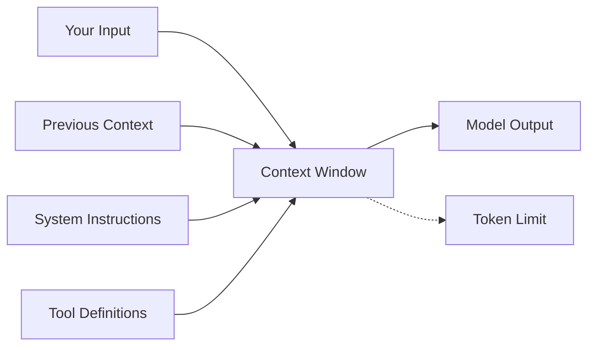

# Context Window Management

## Introduction

Every interaction with an AI model has a fundamental constraint: the **context window**. Think of it as the model's working memory—the total amount of information it can "see" and reason about in a single request. Understanding and managing context windows is essential for building reliable AI applications.

Modern models have dramatically expanded context windows—from 8K tokens in early GPT-4 to over 1 million tokens in Gemini 3. But more isn't always better. Effective context window management means knowing how to budget tokens, handle overflow gracefully, and position content for optimal performance.

### What We'll Cover in This Lesson

This lesson is divided into four focused sub-lessons:

| Sub-Lesson | Focus |
|------------|-------|
| [Understanding Context Windows](./01-understanding-context-windows.md) | What context windows are, model limits, token calculation |
| [Token Budgeting Strategies](./02-token-budgeting-strategies.md) | Reserving space for output, reasoning, and caching |
| [Context Overflow Handling](./03-context-overflow-handling.md) | Truncation, sliding windows, summarization, pinning |
| [Long Context Best Practices](./04-long-context-best-practices.md) | Placement optimization, caching, multimodal considerations |

### Prerequisites

- Understanding of LLM fundamentals and tokenization
- Basic experience with API calls to any major provider
- Familiarity with prompt engineering basics

---

## Why Context Windows Matter

The context window is not just a technical limitation—it shapes what's possible with AI:



### Everything Counts

The context window includes **all** of:

| Component | Description |
|-----------|-------------|
| **System instructions** | Role, behavior, constraints |
| **Tool definitions** | Function schemas for tool calling |
| **Conversation history** | Previous messages in multi-turn chats |
| **User input** | Current query plus any attached context |
| **Generated output** | The model's response (yes, this counts too!) |

> **🔑 Key Insight:** When you hit a context limit, the API returns an error. Modern models (like Claude 4) return validation errors rather than silently truncating—giving you control but requiring proactive management.

---

## Current Model Context Windows

Context windows have grown dramatically. Here's the current landscape:

### OpenAI Models

| Model | Context Window | Notes |
|-------|---------------|-------|
| GPT-5.2 | 1M tokens | Latest flagship |
| GPT-5.1 | 1M tokens | Extended caching (24h) |
| GPT-5 | 1M tokens | Codex variants available |
| GPT-4.1 | 1M tokens | Cost-effective option |
| o3 / o4-mini | 200K tokens | Reasoning models |

### Anthropic Models

| Model | Context Window | Notes |
|-------|---------------|-------|
| Claude 4 Opus | 200K standard, 1M beta | 1M requires Tier 4 |
| Claude Sonnet 4.5 | 200K standard, 1M beta | Context awareness built-in |
| Claude Haiku 4.5 | 200K tokens | Fast, context-aware |

### Google Models

| Model | Context Window | Notes |
|-------|---------------|-------|
| Gemini 3 Pro | 1M+ tokens | Thinking always on |
| Gemini 3 Flash | 1M tokens | Configurable thinking |
| Gemini 2.5 Pro/Flash | 1M tokens | Mature, well-tested |

> **💡 Tip:** Context window sizes and pricing change frequently. Always check the official documentation for current limits.

---

## The Token Economy

Tokens are the currency of AI interactions. Understanding how they work is essential:

### What Is a Token?

- Roughly **4 characters** or **0.75 words** in English
- Languages with non-Latin scripts may tokenize differently
- Code often uses more tokens per line than prose

### Quick Estimates

| Content Type | Token Estimate |
|--------------|---------------|
| 1 page of text (~500 words) | ~675 tokens |
| 1 line of code (~80 chars) | ~20 tokens |
| 50,000 lines of code | ~1M tokens |
| 8 average novels | ~1M tokens |
| 200 podcast transcripts | ~1M tokens |

### Formula for Context Management

```
Available Output = Context Window - (Input Tokens + Reserved Tokens)
```

Where "Reserved Tokens" might include:
- Reasoning tokens (for o-series models)
- Extended thinking tokens (for Claude with thinking enabled)
- Safety buffer for unexpected overhead

---

## Navigation

This overview introduces the concepts. Dive into the sub-lessons for implementation details:

1. **[Understanding Context Windows](./01-understanding-context-windows.md)** - Deep dive into what context windows are and how to query model limits programmatically

2. **[Token Budgeting Strategies](./02-token-budgeting-strategies.md)** - Learn to calculate and reserve appropriate token budgets for different use cases

3. **[Context Overflow Handling](./03-context-overflow-handling.md)** - Techniques for gracefully handling when content exceeds available context

4. **[Long Context Best Practices](./04-long-context-best-practices.md)** - Optimize performance with proper content placement and caching strategies

---

## Summary

✅ Context windows are the model's "working memory" for each request

✅ Everything counts: system prompts, history, tools, input, AND output

✅ Modern models offer 1M+ tokens, but management is still essential

✅ Proactive token budgeting prevents errors and optimizes costs

✅ Different providers have different approaches to context limits

**Next:** [Understanding Context Windows](./01-understanding-context-windows.md)

---

## Further Reading

- [OpenAI Prompt Caching](https://platform.openai.com/docs/guides/prompt-caching) - Cost optimization strategies
- [Google Long Context Guide](https://ai.google.dev/gemini-api/docs/long-context) - Gemini-specific best practices
- [Anthropic Context Windows](https://platform.claude.com/docs/en/build-with-claude/context-windows) - Claude context management
- [Anthropic Token Counting](https://platform.claude.com/docs/en/build-with-claude/token-counting) - Pre-flight token estimation

<!-- 
Sources Consulted:
- OpenAI Prompt Engineering: https://platform.openai.com/docs/guides/prompt-engineering
- OpenAI Prompt Caching: https://platform.openai.com/docs/guides/prompt-caching
- Google Long Context: https://ai.google.dev/gemini-api/docs/long-context
- Anthropic Context Windows: https://platform.claude.com/docs/en/build-with-claude/context-windows
- Google Token Counting: https://ai.google.dev/gemini-api/docs/tokens
- Anthropic Token Counting: https://platform.claude.com/docs/en/build-with-claude/token-counting
-->
