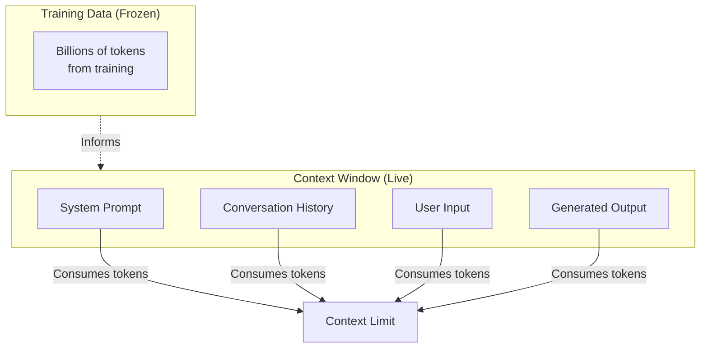
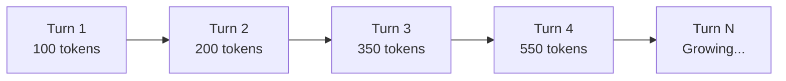

# Understanding Context Windows

## Introduction

The context window is the fundamental constraint that shapes every AI interaction. It defines how much information a model can "see" at once—and understanding it deeply is essential for building reliable applications that don't unexpectedly fail when they hit limits.

This lesson explores what context windows really are, how to query limits programmatically, and how different components consume your available tokens.

### What We'll Cover

- The mechanics of context windows as "working memory"
- How to query context limits for any model
- Understanding input vs. output token allocation
- How different content types affect token consumption
- Provider-specific context window behaviors

### Prerequisites

- Basic understanding of how LLMs process text
- Familiarity with API calls to OpenAI, Anthropic, or Google
- Understanding of tokenization concepts

---

## What Is a Context Window?

Think of a context window as the model's **short-term memory**. Unlike the massive training data the model learned from, the context window is the live, working space where your current conversation happens.



> **🔑 Key Insight:** The context window is ephemeral. When a conversation ends, the model "forgets" everything unless you explicitly pass it back in the next request.

### The 1 Million Token Reality

Modern context windows are massive:

- **1 million tokens** ≈ 50,000 lines of code
- **1 million tokens** ≈ 8 average novels
- **1 million tokens** ≈ 5 years of your text messages

But here's what many developers miss: **having 1M tokens available doesn't mean you should use them all**. Performance, cost, and latency all degrade as you approach limits.

---

## Querying Context Limits Programmatically

Don't hardcode context limits—query them from the API. Models and limits change frequently.

### OpenAI: Check Model Metadata

```python
import openai

# Get model information
models = openai.models.list()

for model in models.data:
    if "gpt-5" in model.id:
        print(f"Model: {model.id}")
        # Context window info is in model metadata
        # Check docs for specific limits
```

> **Note:** OpenAI's Responses API returns usage metadata in every response:

```python
response = client.responses.create(
    model="gpt-5",
    input="Your prompt here"
)

# Access usage information
print(response.usage.prompt_tokens)
print(response.usage.completion_tokens)
print(response.usage.total_tokens)

# Check for cached tokens
print(response.usage.prompt_tokens_details.cached_tokens)
```

### Google Gemini: Query Model Info

```python
from google import genai

client = genai.Client()

# Get model limits directly
model_info = client.models.get(model="gemini-3-flash")
print(f"Input limit: {model_info.input_token_limit}")
print(f"Output limit: {model_info.output_token_limit}")

# Example output:
# Input limit: 1000000
# Output limit: 8192
```

### Anthropic Claude: Model Comparison

Claude provides context window information in documentation. Current limits:

```python
import anthropic

client = anthropic.Anthropic()

# Claude returns usage in every response
response = client.messages.create(
    model="claude-sonnet-4-5",
    max_tokens=1024,
    messages=[{"role": "user", "content": "Hello"}]
)

print(f"Input tokens: {response.usage.input_tokens}")
print(f"Output tokens: {response.usage.output_tokens}")
```

| Model | Standard Context | Beta Extended |
|-------|-----------------|---------------|
| Claude 4 Opus | 200K | 1M (Tier 4+) |
| Claude Sonnet 4.5 | 200K | 1M (Tier 4+) |
| Claude Haiku 4.5 | 200K | — |

---

## What Consumes Context Tokens?

**Everything in the request counts.** Let's break down each component:

### 1. System Instructions

Your system prompt is included in every request and consumes tokens each time:

```python
system_prompt = """
You are a senior software architect specializing in distributed systems.
You provide detailed, technical responses with code examples.
Always consider scalability, reliability, and maintainability.
"""

# This consumes ~40 tokens on EVERY request
```

> **💡 Tip:** System prompts are prime candidates for [prompt caching](./04-long-context-best-practices.md)—put them first to maximize cache hits.

### 2. Tool/Function Definitions

Each tool you define adds to your token count:

```python
tools = [
    {
        "name": "get_weather",
        "description": "Get current weather for a location",
        "input_schema": {
            "type": "object",
            "properties": {
                "location": {
                    "type": "string",
                    "description": "City and state, e.g., San Francisco, CA"
                },
                "unit": {
                    "type": "string",
                    "enum": ["celsius", "fahrenheit"]
                }
            },
            "required": ["location"]
        }
    }
]

# Each tool definition consumes 50-200+ tokens depending on complexity
```

### 3. Conversation History

Multi-turn conversations accumulate tokens linearly:



Each turn includes:
- User message
- Assistant response
- Any tool calls and results

### 4. Multimodal Content

Images, audio, and video consume tokens at fixed rates:

| Content Type | Token Rate | Example |
|--------------|-----------|---------|
| **Text** | ~4 chars/token | 1,000 chars ≈ 250 tokens |
| **Images (Gemini 2.0+)** | 258 tokens/tile | Small image ≈ 258, large ≈ 516+ |
| **Video** | 263 tokens/second | 1 min video ≈ 15,780 tokens |
| **Audio** | 32 tokens/second | 1 min audio ≈ 1,920 tokens |

> **⚠️ Warning:** A 10-minute video consumes ~157,800 tokens—nearly 80% of a 200K context window before you've written anything!

### 5. Generated Output

**The model's response counts toward the context window too!**

```
Total Context = Input Tokens + Output Tokens

If context window = 200,000 tokens
And input = 150,000 tokens
Then max output = 50,000 tokens
```

But it's more nuanced—many models have separate output limits:

| Model | Context Window | Max Output |
|-------|---------------|------------|
| GPT-5.x | 1M tokens | 32K tokens |
| Gemini 3 | 1M tokens | 8K tokens |
| Claude 4 | 200K tokens | 128K tokens |

---

## Token Counting Before Sending

Don't wait for an error—count tokens before making expensive API calls.

### Anthropic: Token Counting API

```python
import anthropic

client = anthropic.Anthropic()

# Count tokens BEFORE sending
token_count = client.messages.count_tokens(
    model="claude-sonnet-4-5",
    system="You are a helpful assistant",
    messages=[
        {"role": "user", "content": "Explain quantum computing in detail"}
    ]
)

print(f"This message will use: {token_count.input_tokens} tokens")

# Only send if within budget
if token_count.input_tokens < 180000:  # Leave room for output
    response = client.messages.create(...)
```

### Google Gemini: Count Tokens Method

```python
from google import genai

client = genai.Client()

# Count tokens for any content
prompt = "Explain the theory of relativity"
result = client.models.count_tokens(
    model="gemini-3-flash",
    contents=prompt
)

print(f"Token count: {result.total_tokens}")

# Count tokens for chat history
history = [
    {"role": "user", "parts": [{"text": "What is AI?"}]},
    {"role": "model", "parts": [{"text": "AI is..."}]},
]
result = client.models.count_tokens(
    model="gemini-3-flash",
    contents=history
)
```

### OpenAI: Check Response Usage

OpenAI returns usage information in every response:

```python
response = client.responses.create(
    model="gpt-5",
    input="Your prompt"
)

# After the fact, check actual usage
usage = response.usage
print(f"Prompt tokens: {usage.prompt_tokens}")
print(f"Completion tokens: {usage.completion_tokens}")
print(f"Cached tokens: {usage.prompt_tokens_details.cached_tokens}")
```

For pre-flight estimation, use the `tiktoken` library:

```python
import tiktoken

# Get encoder for the model family
encoder = tiktoken.encoding_for_model("gpt-4")

text = "Your prompt text here"
token_count = len(encoder.encode(text))
print(f"Estimated tokens: {token_count}")
```

---

## Provider-Specific Behaviors

Each provider handles context limits differently:

### OpenAI: Automatic Truncation in Chat Completions

Older Chat Completions API might truncate silently. The newer Responses API is more explicit:

```python
# Responses API returns clear usage info
response = client.responses.create(
    model="gpt-5",
    input=very_long_prompt
)

# Check if you're near limits
if response.usage.total_tokens > 900000:
    print("Warning: Approaching context limit")
```

### Anthropic: Validation Errors

Claude (3.7+) returns validation errors instead of truncating:

```python
try:
    response = client.messages.create(
        model="claude-sonnet-4-5",
        max_tokens=1024,
        messages=messages  # Too long!
    )
except anthropic.BadRequestError as e:
    if "context window" in str(e):
        # Handle overflow - truncate or summarize
        pass
```

> **🔑 Key Insight:** Anthropic's explicit errors are actually helpful—you know exactly when you've exceeded limits rather than getting mysterious truncation.

### Google Gemini: Graceful with Long Context

Gemini handles long context well but query placement matters:

```python
from google import genai

# Best practice: query at the END for long context
response = client.models.generate_content(
    model="gemini-3-flash",
    contents=[
        large_document,  # Context first
        "Based on the above, what are the key themes?"  # Query last
    ]
)
```

---

## Context Awareness in Claude 4.5

Claude Sonnet 4.5 and Haiku 4.5 include a powerful feature: **context awareness**. The model knows how many tokens remain:

```xml
<!-- At conversation start, Claude receives: -->
<budget:token_budget>200000</budget:token_budget>

<!-- After tool calls, Claude receives updates: -->
<system_warning>Token usage: 35000/200000; 165000 remaining</system_warning>
```

This enables Claude to:
- Persist on tasks until completion
- Make informed decisions about response length
- Better manage multi-turn workflows

> **💡 Tip:** For long-running agent sessions, this context awareness helps prevent the model from giving up prematurely on complex tasks.

---

## Common Mistakes

### Mistake 1: Ignoring Tool Token Overhead

```python
# ❌ Forgot that 20 tools add ~3,000 tokens of overhead
tools = [tool_1, tool_2, ..., tool_20]
long_prompt = "..."  # 197,000 tokens

# This will fail! 197,000 + 3,000 = 200,000 (no room for output)
```

**Solution:** Account for tool definitions in your budget.

### Mistake 2: Not Reserving Output Space

```python
# ❌ Used all available context for input
input_tokens = 195000  # Out of 200K context

# Model can only generate 5K tokens of output!
```

**Solution:** Always reserve appropriate output space (see [Token Budgeting](./02-token-budgeting-strategies.md)).

### Mistake 3: Assuming Static Limits

```python
# ❌ Hardcoded limits
MAX_CONTEXT = 128000  # This was true in 2023...

# Models update frequently! GPT-5 now has 1M tokens
```

**Solution:** Query limits dynamically or maintain configuration that's easy to update.

---

## Hands-on Exercise

### Your Task

Build a context budget calculator that:
1. Accepts a model name
2. Counts tokens for a system prompt, tools, and messages
3. Reports remaining capacity
4. Warns when approaching limits

### Requirements

1. Support at least one provider (OpenAI, Anthropic, or Google)
2. Handle text and image token estimation
3. Output a clear budget breakdown
4. Warn at 80% capacity

<details>
<summary>💡 Hints (click to expand)</summary>

- Use the provider's token counting API (Anthropic and Google have explicit ones)
- For images, estimate based on dimensions
- Create a simple data class to hold budget information
- Consider making it a reusable utility function

</details>

<details>
<summary>✅ Solution (click to expand)</summary>

```python
from dataclasses import dataclass
from typing import Optional
import anthropic

@dataclass
class ContextBudget:
    model: str
    context_limit: int
    system_tokens: int
    tool_tokens: int
    message_tokens: int
    reserved_output: int
    
    @property
    def total_input(self) -> int:
        return self.system_tokens + self.tool_tokens + self.message_tokens
    
    @property
    def available_for_output(self) -> int:
        return self.context_limit - self.total_input
    
    @property
    def capacity_used(self) -> float:
        return (self.total_input + self.reserved_output) / self.context_limit
    
    def report(self) -> str:
        lines = [
            f"=== Context Budget: {self.model} ===",
            f"Context Limit:    {self.context_limit:,} tokens",
            f"",
            f"System Prompt:    {self.system_tokens:,} tokens",
            f"Tool Definitions: {self.tool_tokens:,} tokens",
            f"Messages:         {self.message_tokens:,} tokens",
            f"Reserved Output:  {self.reserved_output:,} tokens",
            f"",
            f"Total Input:      {self.total_input:,} tokens",
            f"Available Output: {self.available_for_output:,} tokens",
            f"Capacity Used:    {self.capacity_used:.1%}",
        ]
        
        if self.capacity_used > 0.9:
            lines.append("\n⚠️  CRITICAL: Over 90% capacity!")
        elif self.capacity_used > 0.8:
            lines.append("\n⚠️  WARNING: Over 80% capacity")
        
        return "\n".join(lines)


def calculate_budget(
    model: str,
    system: str,
    messages: list,
    tools: Optional[list] = None,
    reserved_output: int = 4096
) -> ContextBudget:
    """Calculate context budget for Anthropic Claude."""
    
    client = anthropic.Anthropic()
    
    # Model context limits
    limits = {
        "claude-sonnet-4-5": 200000,
        "claude-4-opus": 200000,
        "claude-haiku-4-5": 200000,
    }
    
    context_limit = limits.get(model, 200000)
    
    # Count system tokens
    system_count = client.messages.count_tokens(
        model=model,
        system=system,
        messages=[{"role": "user", "content": "test"}]
    )
    
    # Count message tokens
    message_count = client.messages.count_tokens(
        model=model,
        system=system,
        messages=messages
    )
    
    # Estimate tool tokens (tools add overhead)
    tool_tokens = 0
    if tools:
        # Each tool is roughly 50-200 tokens
        tool_tokens = len(tools) * 100  # Conservative estimate
    
    return ContextBudget(
        model=model,
        context_limit=context_limit,
        system_tokens=system_count.input_tokens - 5,  # Subtract test message
        tool_tokens=tool_tokens,
        message_tokens=message_count.input_tokens - system_count.input_tokens,
        reserved_output=reserved_output
    )


# Usage example
if __name__ == "__main__":
    budget = calculate_budget(
        model="claude-sonnet-4-5",
        system="You are a helpful coding assistant.",
        messages=[
            {"role": "user", "content": "Explain Python decorators"},
            {"role": "assistant", "content": "Decorators are..."},
            {"role": "user", "content": "Show me an example"}
        ],
        tools=[{"name": "run_code"}, {"name": "read_file"}],
        reserved_output=8192
    )
    
    print(budget.report())
```

**Output:**
```
=== Context Budget: claude-sonnet-4-5 ===
Context Limit:    200,000 tokens

System Prompt:    12 tokens
Tool Definitions: 200 tokens
Messages:         45 tokens
Reserved Output:  8,192 tokens

Total Input:      257 tokens
Available Output: 199,743 tokens
Capacity Used:    4.2%
```

</details>

---

## Summary

✅ Context windows are the model's working memory—everything in a request counts

✅ Query limits programmatically—don't hardcode values that change

✅ All content consumes tokens: system prompts, tools, history, images, AND output

✅ Use token counting APIs before sending to prevent errors

✅ Different providers handle overflow differently—Claude errors, others may truncate

✅ Claude 4.5 has built-in context awareness for long-running tasks

**Next:** [Token Budgeting Strategies](./02-token-budgeting-strategies.md)

---

## Further Reading

- [OpenAI Models Documentation](https://platform.openai.com/docs/models) - Current model limits
- [Google Token Guide](https://ai.google.dev/gemini-api/docs/tokens) - Gemini token counting
- [Anthropic Token Counting](https://platform.claude.com/docs/en/build-with-claude/token-counting) - Claude pre-flight estimation
- [tiktoken Library](https://github.com/openai/tiktoken) - OpenAI tokenizer for local counting

<!-- 
Sources Consulted:
- OpenAI Prompt Engineering: https://platform.openai.com/docs/guides/prompt-engineering
- Google Tokens Guide: https://ai.google.dev/gemini-api/docs/tokens
- Anthropic Context Windows: https://platform.claude.com/docs/en/build-with-claude/context-windows
- Anthropic Token Counting: https://platform.claude.com/docs/en/build-with-claude/token-counting
-->
