# Token Budgeting Strategies

## Introduction

Token budgeting is the discipline of planning your context window usage before making API calls. Just as a financial budget allocates money to different categories, a token budget allocates your context window to different purposes: input, output, reasoning, and safety margins.

Without proper budgeting, you'll encounter context overflow errors, truncated responses, or unexpectedly high costs. This lesson teaches systematic approaches to token allocation that scale from simple chat applications to complex agentic systems.

### What We'll Cover

- The fundamental budgeting equation
- Reserving space for model outputs
- Special considerations for reasoning models
- Multi-turn conversation budgets
- Budgeting for agentic workflows
- Cost optimization through smart allocation

### Prerequisites

- Understanding of context windows from the previous lesson
- Basic experience with multi-turn API calls
- Familiarity with reasoning models (o3, Claude with thinking)

---

## The Budgeting Equation

Every context window allocation follows this fundamental equation:

```
Input Budget + Output Budget + Reserved Buffer ≤ Context Window
```

Let's break this down:

```mermaid
flowchart LR
    subgraph CONTEXT["Context Window (200K)"]
        INPUT[Input Budget<br/>System + Tools + History + Query]
        OUTPUT[Output Budget<br/>max_tokens parameter]
        BUFFER[Safety Buffer<br/>Overhead + Variance]
    end
    
    INPUT --> CHECK{Total ≤ Limit?}
    OUTPUT --> CHECK
    BUFFER --> CHECK
    CHECK -->|Yes| SUCCESS[✅ Request succeeds]
    CHECK -->|No| FAIL[❌ Context overflow]
```



### Practical Example

```python
# For a 200K context window model
CONTEXT_LIMIT = 200_000

# Your budgeting
system_prompt = 500        # tokens
tool_definitions = 1_500   # tokens  
conversation_history = 50_000  # tokens
current_query = 2_000      # tokens
reserved_output = 8_000    # tokens (max_tokens parameter)
safety_buffer = 5_000      # tokens (for overhead)

total_needed = (
    system_prompt + 
    tool_definitions + 
    conversation_history + 
    current_query + 
    reserved_output + 
    safety_buffer
)

print(f"Budget: {total_needed:,} / {CONTEXT_LIMIT:,} tokens")
# Budget: 67,000 / 200,000 tokens

remaining = CONTEXT_LIMIT - total_needed
print(f"Headroom: {remaining:,} tokens")
# Headroom: 133,000 tokens
```

---

## Reserving Output Space

The `max_tokens` parameter reserves space for the model's response. Setting it correctly is crucial.

### The Output Reservation Trade-off

| max_tokens | Effect |
|------------|--------|
| Too low | Response gets cut off mid-sentence |
| Too high | Wastes context that could hold more input |
| Just right | Complete responses with efficient context usage |

### Guidelines by Use Case

| Use Case | Recommended max_tokens |
|----------|----------------------|
| Classification (yes/no) | 10-50 |
| Short answers | 100-500 |
| Explanations | 500-2,000 |
| Code generation | 2,000-8,000 |
| Long-form content | 4,000-16,000 |
| Extended analysis | 8,000-32,000 |

### Dynamic Output Reservation

Rather than hardcoding, adjust based on available space:

```python
def calculate_max_tokens(
    context_limit: int,
    input_tokens: int,
    min_output: int = 1000,
    max_output: int = 8000,
    safety_margin: float = 0.05
) -> int:
    """Calculate optimal max_tokens based on available space."""
    
    # Reserve safety margin
    safe_limit = int(context_limit * (1 - safety_margin))
    
    # Calculate available output space
    available = safe_limit - input_tokens
    
    # Clamp to reasonable bounds
    return max(min_output, min(available, max_output))


# Example usage
input_tokens = 150_000
max_tokens = calculate_max_tokens(
    context_limit=200_000,
    input_tokens=input_tokens
)
print(f"Recommended max_tokens: {max_tokens}")
# Recommended max_tokens: 8000 (capped at max)
```

---

## Budgeting for Reasoning Models

Reasoning models (o3, o4-mini, Claude with extended thinking) require **additional token reservation** for their internal reasoning process.

### OpenAI Reasoning Models (o3, o4-mini)

Reasoning tokens are generated internally and count toward usage but aren't visible in output:

```python
# With o3/o4-mini, reasoning tokens are a significant overhead
response = client.responses.create(
    model="o3",
    reasoning={"effort": "high"},  # More reasoning = more tokens
    input="Solve this complex problem..."
)

# Check reasoning token usage
print(f"Reasoning tokens: {response.usage.completion_tokens_details.reasoning_tokens}")
print(f"Output tokens: {response.usage.completion_tokens}")
```

#### Reasoning Effort Impact

| Reasoning Effort | Typical Reasoning Tokens | Total Overhead |
|-----------------|-------------------------|----------------|
| `low` | 1,000-5,000 | Minimal |
| `medium` | 5,000-25,000 | Moderate |
| `high` | 25,000-100,000+ | Significant |

> **⚠️ Warning:** High-effort reasoning on complex problems can use 100K+ reasoning tokens. Budget accordingly!

### Anthropic Extended Thinking

Claude's extended thinking uses `budget_tokens` to control thinking depth:

```python
response = client.messages.create(
    model="claude-sonnet-4-5",
    max_tokens=16000,  # Total output budget
    thinking={
        "type": "enabled",
        "budget_tokens": 10000  # Subset of max_tokens for thinking
    },
    messages=[...]
)

# Thinking tokens + response tokens must fit within max_tokens
```

#### The Thinking Budget Trade-off


#### Budget Recommendations by Task

| Task Complexity | budget_tokens | max_tokens |
|-----------------|---------------|------------|
| Simple reasoning | 5,000 | 10,000 |
| Moderate analysis | 10,000-20,000 | 25,000 |
| Complex problems | 30,000-50,000 | 60,000+ |
| Deep research | 100,000+ | 128,000 |

> **💡 Tip:** Previous thinking blocks are automatically stripped from context in subsequent turns, so you don't pay for them repeatedly.

---

## Multi-Turn Conversation Budgeting

Conversations accumulate tokens over time. Without management, you'll hit limits:


### Strategy 1: Fixed Turn Budget

Allocate a fixed token budget per turn:

```python
class ConversationBudget:
    def __init__(
        self,
        context_limit: int = 200_000,
        system_budget: int = 500,
        tools_budget: int = 2_000,
        output_budget: int = 4_000,
        safety_margin: int = 5_000
    ):
        self.context_limit = context_limit
        self.fixed_overhead = system_budget + tools_budget + safety_margin
        self.output_budget = output_budget
        
        # Available for conversation history
        self.history_budget = (
            context_limit - self.fixed_overhead - output_budget
        )
    
    def tokens_per_turn(self, max_turns: int) -> int:
        """Calculate token budget per turn for fixed-length conversations."""
        return self.history_budget // max_turns
    
    def can_add_turn(self, current_tokens: int, new_turn_tokens: int) -> bool:
        """Check if a new turn fits within budget."""
        return (current_tokens + new_turn_tokens) <= self.history_budget


# Example: Budget for 50-turn conversation
budget = ConversationBudget()
per_turn = budget.tokens_per_turn(max_turns=50)
print(f"Budget per turn: {per_turn:,} tokens")
# Budget per turn: 3,770 tokens
```

### Strategy 2: Sliding Window with Priority

Keep recent messages, summarize or drop older ones:

```python
def manage_conversation_window(
    messages: list,
    max_tokens: int,
    token_counter,  # Function to count tokens
    priority_messages: list = None  # Messages to always keep
) -> list:
    """
    Manage conversation history to fit within token budget.
    Keeps most recent messages, optionally preserving priority ones.
    """
    priority_messages = priority_messages or []
    
    # Calculate priority message tokens
    priority_tokens = sum(token_counter(m) for m in priority_messages)
    available = max_tokens - priority_tokens
    
    if available <= 0:
        # Priority messages alone exceed budget
        return priority_messages[:max_tokens // 100]  # Rough truncation
    
    # Add messages from newest to oldest until budget exhausted
    kept_messages = []
    current_tokens = 0
    
    for message in reversed(messages):
        if message in priority_messages:
            continue  # Already counted
        
        msg_tokens = token_counter(message)
        if current_tokens + msg_tokens <= available:
            kept_messages.insert(0, message)
            current_tokens += msg_tokens
        else:
            break  # Budget exhausted
    
    # Combine priority messages with recent history
    return priority_messages + kept_messages
```

---

## Budgeting for Agentic Workflows

Agents present unique budgeting challenges because:
- They make multiple sequential calls
- Tool results add unpredictable tokens
- Reasoning must persist across many steps

### The Agent Token Budget

```python
@dataclass
class AgentBudget:
    """Token budget for an agentic workflow."""
    context_limit: int
    system_prompt: int
    tool_definitions: int
    max_steps: int
    tokens_per_step: int
    output_per_step: int
    
    @property
    def total_step_budget(self) -> int:
        return self.max_steps * (self.tokens_per_step + self.output_per_step)
    
    @property
    def available_for_context(self) -> int:
        return (
            self.context_limit - 
            self.system_prompt - 
            self.tool_definitions - 
            self.total_step_budget
        )
    
    def can_continue(self, current_tokens: int, step: int) -> bool:
        """Check if agent can continue to next step."""
        remaining_steps = self.max_steps - step
        needed = remaining_steps * (self.tokens_per_step + self.output_per_step)
        return (current_tokens + needed) <= self.context_limit


# Example: 10-step agent workflow
agent_budget = AgentBudget(
    context_limit=200_000,
    system_prompt=1_000,
    tool_definitions=3_000,
    max_steps=10,
    tokens_per_step=5_000,   # Tool results, reasoning
    output_per_step=2_000     # Agent responses
)

print(f"Available for initial context: {agent_budget.available_for_context:,}")
# Available for initial context: 126,000 tokens
```

### Multi-Window Agent Pattern

For complex agents that exceed single context windows:

```python
class MultiWindowAgent:
    """Agent that operates across multiple context windows."""
    
    def __init__(self, context_limit: int = 200_000):
        self.context_limit = context_limit
        self.persistent_context = []  # Summarized across windows
        self.current_window = []      # Current window messages
        self.window_count = 0
    
    def checkpoint(self, summary: str):
        """Create a checkpoint when approaching context limit."""
        self.persistent_context.append({
            "window": self.window_count,
            "summary": summary,
            "key_findings": self._extract_key_findings()
        })
        self.current_window = []
        self.window_count += 1
    
    def get_context_for_new_window(self) -> str:
        """Generate context for starting a new window."""
        return f"""
        ## Previous Work Summary
        
        This is window {self.window_count + 1} of the task.
        
        Previous findings:
        {self._format_persistent_context()}
        
        Continue from where we left off.
        """
    
    def _extract_key_findings(self) -> list:
        # Extract important findings from current window
        pass
    
    def _format_persistent_context(self) -> str:
        # Format persistent context for new window
        pass
```

---

## Cost Optimization Through Budgeting

Smart budgeting directly impacts your API costs.

### The Cost Equation

```
Cost = (Input Tokens × Input Price) + (Output Tokens × Output Price)
```

For most models, output tokens cost more than input tokens:

| Provider | Model | Input Price | Output Price |
|----------|-------|-------------|--------------|
| OpenAI | GPT-5 | $2.50/1M | $10.00/1M |
| Anthropic | Claude Sonnet 4.5 | $3.00/1M | $15.00/1M |
| Google | Gemini 3 Flash | $0.075/1M | $0.30/1M |

> **💡 Tip:** Output tokens typically cost 3-5x more than input tokens. Reducing unnecessary output is the fastest path to cost savings.

### Prompt Caching for Budget Efficiency

Place static content first to maximize cache hits:

```python
# ✅ Good: Static content first (cacheable)
messages = [
    {
        "role": "system",
        "content": long_system_prompt  # 2,000 tokens - cached
    },
    {
        "role": "user", 
        "content": static_context + user_query  # Variable part last
    }
]

# OpenAI: Cached tokens are 50% off input price
# Anthropic: Cached tokens are 90% off
# Google: Implicit caching, automatic discounts
```

### Budget-Aware Request Planning

```python
def plan_request(
    query: str,
    context: str,
    model: str,
    budget_cents: float
) -> dict:
    """Plan a request within a cost budget."""
    
    # Pricing (per 1M tokens, in cents)
    pricing = {
        "gpt-5": {"input": 250, "output": 1000},
        "claude-sonnet-4-5": {"input": 300, "output": 1500},
        "gemini-3-flash": {"input": 7.5, "output": 30}
    }
    
    prices = pricing[model]
    
    # Estimate input tokens
    input_tokens = estimate_tokens(query + context)
    input_cost = (input_tokens / 1_000_000) * prices["input"]
    
    # Calculate remaining budget for output
    remaining_budget = budget_cents - input_cost
    
    # How many output tokens can we afford?
    affordable_output = int(
        (remaining_budget / prices["output"]) * 1_000_000
    )
    
    return {
        "model": model,
        "estimated_input_tokens": input_tokens,
        "max_affordable_output": affordable_output,
        "recommended_max_tokens": min(affordable_output, 8000),
        "estimated_cost_cents": input_cost + (min(affordable_output, 8000) / 1_000_000 * prices["output"])
    }


# Example: $0.05 budget
plan = plan_request(
    query="Explain quantum computing",
    context="Background material here...",
    model="claude-sonnet-4-5",
    budget_cents=5.0
)
print(f"Can afford up to {plan['max_affordable_output']:,} output tokens")
```

---

## Common Budgeting Pitfalls

### Pitfall 1: Forgetting Output in Budget

```python
# ❌ Only counting input
input_tokens = 195_000
# "Great, I have 5K tokens left!"
# But max_tokens=8000... OVERFLOW!

# ✅ Include output in calculation
input_tokens = 195_000
max_tokens = 8_000
total_needed = input_tokens + max_tokens  # 203,000 > 200,000!
```

### Pitfall 2: Ignoring Reasoning Overhead

```python
# ❌ Treating reasoning models like standard models
response = client.responses.create(
    model="o3",
    reasoning={"effort": "high"},
    input=query  # 50K tokens
)
# Surprise! 80K reasoning tokens generated!

# ✅ Budget for reasoning
REASONING_BUFFER = 100_000  # For high effort
actual_budget = context_limit - REASONING_BUFFER
```

### Pitfall 3: Static Budgets for Dynamic Content

```python
# ❌ Fixed budget for variable content
max_tokens = 4000  # Always

# ✅ Dynamic based on available space
available = context_limit - current_input_tokens - safety_margin
max_tokens = min(desired_output, available)
```

---

## Hands-on Exercise

### Your Task

Build a `TokenBudgetManager` class that:
1. Tracks token usage across a conversation
2. Automatically adjusts max_tokens based on remaining budget
3. Provides warnings at configurable thresholds
4. Suggests when to summarize or truncate

### Requirements

1. Support configurable context limits
2. Track separate budgets for system, tools, history, and output
3. Emit warnings at 70%, 85%, and 95% capacity
4. Provide a `should_summarize()` method

<details>
<summary>💡 Hints (click to expand)</summary>

- Use properties for computed values
- Consider an enum for warning levels
- The manager should be stateful, tracking across turns
- Include a method to "reset" for new conversations

</details>

<details>
<summary>✅ Solution (click to expand)</summary>

```python
from dataclasses import dataclass, field
from enum import Enum
from typing import Callable, Optional


class BudgetWarning(Enum):
    OK = "ok"
    MODERATE = "moderate"      # 70%+
    HIGH = "high"              # 85%+
    CRITICAL = "critical"      # 95%+


@dataclass
class TokenBudgetManager:
    """Manages token budget across a conversation."""
    
    context_limit: int = 200_000
    system_tokens: int = 0
    tool_tokens: int = 0
    history_tokens: int = 0
    reserved_output: int = 4_000
    
    # Thresholds
    moderate_threshold: float = 0.70
    high_threshold: float = 0.85
    critical_threshold: float = 0.95
    
    # Callbacks
    on_warning: Optional[Callable[[BudgetWarning, dict], None]] = None
    
    # State
    _turn_count: int = field(default=0, init=False)
    
    @property
    def total_allocated(self) -> int:
        return (
            self.system_tokens + 
            self.tool_tokens + 
            self.history_tokens + 
            self.reserved_output
        )
    
    @property
    def utilization(self) -> float:
        return self.total_allocated / self.context_limit
    
    @property
    def available_for_history(self) -> int:
        fixed = self.system_tokens + self.tool_tokens + self.reserved_output
        return self.context_limit - fixed
    
    @property
    def remaining_history_budget(self) -> int:
        return self.available_for_history - self.history_tokens
    
    @property
    def warning_level(self) -> BudgetWarning:
        if self.utilization >= self.critical_threshold:
            return BudgetWarning.CRITICAL
        elif self.utilization >= self.high_threshold:
            return BudgetWarning.HIGH
        elif self.utilization >= self.moderate_threshold:
            return BudgetWarning.MODERATE
        return BudgetWarning.OK
    
    def add_turn(self, user_tokens: int, assistant_tokens: int) -> BudgetWarning:
        """Record a conversation turn and check budget."""
        self.history_tokens += user_tokens + assistant_tokens
        self._turn_count += 1
        
        warning = self.warning_level
        if warning != BudgetWarning.OK and self.on_warning:
            self.on_warning(warning, self.get_status())
        
        return warning
    
    def get_recommended_max_tokens(self) -> int:
        """Get recommended max_tokens based on remaining budget."""
        # Leave room for user's next message (estimate)
        estimated_next_user = 500
        safety_margin = int(self.context_limit * 0.05)
        
        available = (
            self.context_limit - 
            self.total_allocated - 
            estimated_next_user - 
            safety_margin
        )
        
        # Don't go below minimum or above reserved
        return max(500, min(available, self.reserved_output))
    
    def should_summarize(self) -> bool:
        """Check if conversation history should be summarized."""
        return self.utilization >= self.high_threshold
    
    def apply_summary(self, summary_tokens: int):
        """Replace history with a summary."""
        self.history_tokens = summary_tokens
        self._turn_count = 0  # Reset turn count
    
    def reset(self):
        """Reset for a new conversation."""
        self.history_tokens = 0
        self._turn_count = 0
    
    def get_status(self) -> dict:
        return {
            "context_limit": self.context_limit,
            "total_allocated": self.total_allocated,
            "utilization": f"{self.utilization:.1%}",
            "warning_level": self.warning_level.value,
            "history_tokens": self.history_tokens,
            "remaining_history_budget": self.remaining_history_budget,
            "recommended_max_tokens": self.get_recommended_max_tokens(),
            "should_summarize": self.should_summarize(),
            "turn_count": self._turn_count
        }


# Usage example
def warning_handler(level: BudgetWarning, status: dict):
    print(f"⚠️ Budget {level.value}: {status['utilization']} used")


manager = TokenBudgetManager(
    context_limit=200_000,
    system_tokens=500,
    tool_tokens=1500,
    reserved_output=4000,
    on_warning=warning_handler
)

# Simulate conversation
for i in range(20):
    user_tokens = 1000
    assistant_tokens = 2000
    
    warning = manager.add_turn(user_tokens, assistant_tokens)
    
    if manager.should_summarize():
        print(f"Turn {i+1}: Summarization recommended!")
        # In practice, you'd summarize here
        manager.apply_summary(5000)  # Compressed summary
        print("Applied summary, continuing...")

print("\nFinal status:")
for key, value in manager.get_status().items():
    print(f"  {key}: {value}")
```

</details>

---

## Summary

✅ Token budgeting follows: Input + Output + Buffer ≤ Context Limit

✅ Always reserve space for output with the `max_tokens` parameter

✅ Reasoning models need extra buffer (25K-100K+) for thinking tokens

✅ Multi-turn conversations need sliding window or summarization strategies

✅ Agents require per-step budgets and multi-window patterns for long tasks

✅ Smart budgeting directly reduces costs—output tokens cost 3-5x more

**Previous:** [Understanding Context Windows](./01-understanding-context-windows.md)

**Next:** [Context Overflow Handling](./03-context-overflow-handling.md)

---

## Further Reading

- [OpenAI Reasoning Guide](https://platform.openai.com/docs/guides/reasoning) - Understanding reasoning token usage
- [Anthropic Extended Thinking](https://platform.claude.com/docs/en/build-with-claude/extended-thinking) - Thinking budget configuration
- [OpenAI Prompt Caching](https://platform.openai.com/docs/guides/prompt-caching) - Cost optimization through caching

<!-- 
Sources Consulted:
- OpenAI Prompt Engineering: https://platform.openai.com/docs/guides/prompt-engineering
- OpenAI Prompt Caching: https://platform.openai.com/docs/guides/prompt-caching
- Anthropic Context Windows: https://platform.claude.com/docs/en/build-with-claude/context-windows
- Anthropic Extended Thinking: https://platform.claude.com/docs/en/build-with-claude/extended-thinking
-->
