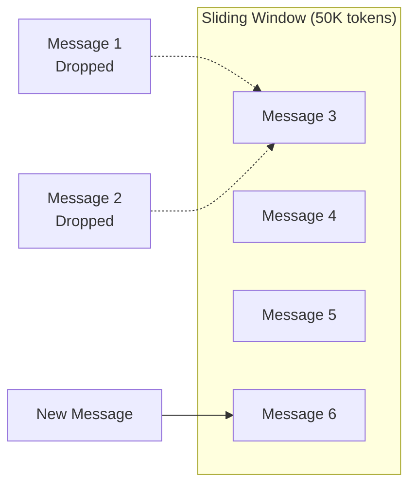

# Context Overflow Handling

## Introduction

No matter how well you budget, context overflow happens. Users paste unexpectedly large documents, conversations run longer than anticipated, or tool results return more data than expected. The key is handling these situations gracefully without crashing or losing critical information.

This lesson covers practical strategies for detecting, preventing, and recovering from context overflow—from simple truncation to sophisticated summarization pipelines.

### What We'll Cover

- Detecting overflow before it happens
- Truncation strategies (oldest-first, smart truncation)
- Sliding window implementations
- Real-time summarization techniques
- Priority-based content pinning
- Graceful degradation patterns

### Prerequisites

- Understanding of token budgeting from the previous lesson
- Experience with multi-turn conversations
- Basic familiarity with summarization prompts

---

## Detecting Overflow Before It Happens

The best overflow handling is prevention. Check token counts before making API calls.

### Pre-Flight Token Checking

```python
from dataclasses import dataclass
from typing import Tuple

@dataclass
class OverflowCheck:
    will_overflow: bool
    current_tokens: int
    limit: int
    overflow_amount: int
    
    @property
    def utilization(self) -> float:
        return self.current_tokens / self.limit
    
    def __str__(self) -> str:
        status = "⚠️ OVERFLOW" if self.will_overflow else "✅ OK"
        return f"{status}: {self.current_tokens:,}/{self.limit:,} ({self.utilization:.1%})"


def check_for_overflow(
    messages: list,
    system: str,
    tools: list,
    max_tokens: int,
    context_limit: int,
    token_counter  # Provider-specific counter
) -> OverflowCheck:
    """Check if a request will overflow before sending."""
    
    # Count all components
    input_tokens = token_counter(
        messages=messages,
        system=system,
        tools=tools
    )
    
    total_needed = input_tokens + max_tokens
    
    return OverflowCheck(
        will_overflow=total_needed > context_limit,
        current_tokens=total_needed,
        limit=context_limit,
        overflow_amount=max(0, total_needed - context_limit)
    )


# Usage
check = check_for_overflow(
    messages=conversation_history,
    system=system_prompt,
    tools=tool_definitions,
    max_tokens=4000,
    context_limit=200_000,
    token_counter=count_tokens  # Your implementation
)

if check.will_overflow:
    print(f"Need to free {check.overflow_amount:,} tokens")
    # Apply overflow handling strategy
```

### Provider Error Detection

When overflow does occur, handle provider-specific errors:

```python
import anthropic
import openai

def safe_completion(client, **kwargs):
    """Wrapper that handles context overflow gracefully."""
    try:
        return client.messages.create(**kwargs)
    
    except anthropic.BadRequestError as e:
        if "context window" in str(e).lower():
            return handle_anthropic_overflow(e, kwargs)
        raise
    
    except openai.BadRequestError as e:
        if "maximum context length" in str(e).lower():
            return handle_openai_overflow(e, kwargs)
        raise


def handle_anthropic_overflow(error, original_kwargs):
    """Handle Claude context overflow."""
    # Claude returns explicit errors - parse for details
    # Reduce context and retry
    messages = original_kwargs["messages"]
    reduced = apply_truncation(messages, reduction=0.2)  # Remove 20%
    
    original_kwargs["messages"] = reduced
    return client.messages.create(**original_kwargs)
```

---

## Truncation Strategies

Truncation is the simplest overflow solution: remove content until you fit. The question is *what* to remove.

### Strategy 1: Oldest-First (FIFO)

Remove the oldest messages first, keeping recent context:

```python
def truncate_oldest_first(
    messages: list,
    target_tokens: int,
    token_counter
) -> list:
    """Remove oldest messages until under target token count."""
    
    current_tokens = token_counter(messages)
    
    if current_tokens <= target_tokens:
        return messages
    
    # Keep removing from the front until we fit
    truncated = messages.copy()
    
    while current_tokens > target_tokens and len(truncated) > 2:
        # Always keep at least the last user message
        removed = truncated.pop(0)
        current_tokens = token_counter(truncated)
    
    return truncated
```

**Pros:**
- Simple to implement
- Preserves recent, relevant context
- Predictable behavior

**Cons:**
- May lose important early context (system setup, key decisions)
- No semantic awareness—removes blindly

### Strategy 2: Keep First and Last

Preserve conversation bookends, remove the middle:

```python
def truncate_keep_bookends(
    messages: list,
    target_tokens: int,
    token_counter,
    keep_first: int = 3,   # Keep first N messages
    keep_last: int = 5     # Keep last N messages
) -> list:
    """Keep first and last messages, remove from middle."""
    
    if len(messages) <= keep_first + keep_last:
        return messages
    
    first_messages = messages[:keep_first]
    last_messages = messages[-keep_last:]
    middle_messages = messages[keep_first:-keep_last]
    
    # Calculate what we have and what we need
    bookend_tokens = token_counter(first_messages + last_messages)
    available_for_middle = target_tokens - bookend_tokens
    
    # Fit as much middle as possible (from the end)
    kept_middle = []
    middle_tokens = 0
    
    for msg in reversed(middle_messages):
        msg_tokens = token_counter([msg])
        if middle_tokens + msg_tokens <= available_for_middle:
            kept_middle.insert(0, msg)
            middle_tokens += msg_tokens
        else:
            break
    
    return first_messages + kept_middle + last_messages
```

### Strategy 3: Semantic Truncation

Score messages by relevance and remove lowest-scoring:

```python
def truncate_by_relevance(
    messages: list,
    target_tokens: int,
    token_counter,
    current_query: str,
    embedder  # Function to get embeddings
) -> list:
    """Remove least relevant messages based on semantic similarity."""
    
    current_tokens = token_counter(messages)
    if current_tokens <= target_tokens:
        return messages
    
    # Get embedding for current query
    query_embedding = embedder(current_query)
    
    # Score each message by relevance
    scored_messages = []
    for i, msg in enumerate(messages):
        content = msg.get("content", "")
        msg_embedding = embedder(content)
        similarity = cosine_similarity(query_embedding, msg_embedding)
        
        # Boost recent messages
        recency_boost = (i / len(messages)) * 0.2
        
        scored_messages.append({
            "message": msg,
            "score": similarity + recency_boost,
            "tokens": token_counter([msg])
        })
    
    # Sort by score (highest first)
    scored_messages.sort(key=lambda x: x["score"], reverse=True)
    
    # Keep highest-scoring messages until we hit budget
    kept = []
    total_tokens = 0
    
    for item in scored_messages:
        if total_tokens + item["tokens"] <= target_tokens:
            kept.append(item["message"])
            total_tokens += item["tokens"]
    
    # Restore original order
    kept.sort(key=lambda m: messages.index(m))
    
    return kept
```

---

## Sliding Window Implementation

A sliding window maintains a fixed-size "view" of conversation history, automatically dropping old content as new content arrives.



### Basic Sliding Window

```python
class SlidingWindowConversation:
    """Conversation manager with automatic sliding window."""
    
    def __init__(
        self,
        window_tokens: int = 50_000,
        token_counter = None
    ):
        self.window_tokens = window_tokens
        self.token_counter = token_counter or self._default_counter
        self.messages = []
    
    def _default_counter(self, messages: list) -> int:
        """Rough token estimate: 4 chars per token."""
        text = "".join(str(m.get("content", "")) for m in messages)
        return len(text) // 4
    
    def add_message(self, role: str, content: str):
        """Add a message, sliding window if needed."""
        new_message = {"role": role, "content": content}
        self.messages.append(new_message)
        
        # Slide window if over budget
        while self.token_counter(self.messages) > self.window_tokens:
            if len(self.messages) <= 2:
                # Can't remove more - truncate content instead
                self._truncate_oldest_content()
                break
            self.messages.pop(0)
    
    def _truncate_oldest_content(self):
        """Truncate content of oldest message if we can't remove it."""
        if self.messages:
            oldest = self.messages[0]
            content = oldest.get("content", "")
            # Keep last 25% of content
            oldest["content"] = "..." + content[-(len(content) // 4):]
    
    def get_messages(self) -> list:
        return self.messages.copy()


# Usage
conversation = SlidingWindowConversation(window_tokens=10_000)

# Add messages - window slides automatically
for i in range(100):
    conversation.add_message("user", f"Question {i}: " + "x" * 500)
    conversation.add_message("assistant", f"Answer {i}: " + "x" * 500)

print(f"Messages kept: {len(conversation.get_messages())}")
```

### Sliding Window with Summaries

Enhanced version that summarizes dropped content:

```python
class SlidingWindowWithSummary:
    """Sliding window that maintains summaries of dropped content."""
    
    def __init__(
        self,
        window_tokens: int = 50_000,
        summary_tokens: int = 2_000,
        summarizer = None  # Function to summarize messages
    ):
        self.window_tokens = window_tokens
        self.summary_tokens = summary_tokens
        self.summarizer = summarizer
        
        self.summary = ""  # Rolling summary of dropped content
        self.messages = []
    
    def add_message(self, role: str, content: str):
        """Add message with summary-aware sliding."""
        self.messages.append({"role": role, "content": content})
        
        current_tokens = self._count_tokens()
        
        if current_tokens > self.window_tokens:
            self._slide_with_summary()
    
    def _slide_with_summary(self):
        """Slide window and update rolling summary."""
        # Remove oldest messages until under budget
        removed = []
        
        while self._count_tokens() > self.window_tokens and len(self.messages) > 2:
            removed.append(self.messages.pop(0))
        
        if removed and self.summarizer:
            # Summarize removed content
            removed_summary = self.summarizer(removed)
            
            # Combine with existing summary
            combined = f"{self.summary}\n\n{removed_summary}"
            
            # Keep summary under budget (re-summarize if needed)
            if len(combined) // 4 > self.summary_tokens:
                self.summary = self.summarizer([
                    {"role": "system", "content": combined}
                ])
            else:
                self.summary = combined
    
    def get_context(self) -> dict:
        """Get full context including summary."""
        return {
            "summary": self.summary,
            "messages": self.messages.copy()
        }
    
    def format_for_request(self) -> list:
        """Format context for API request."""
        messages = []
        
        if self.summary:
            messages.append({
                "role": "system",
                "content": f"## Conversation Summary\n{self.summary}"
            })
        
        messages.extend(self.messages)
        return messages
```

---

## Real-Time Summarization

When simple truncation isn't enough, summarize content to preserve meaning in fewer tokens.

### Progressive Summarization

Summarize as you go, building on previous summaries:

```python
class ProgressiveSummarizer:
    """Summarizes conversation progressively as it grows."""
    
    def __init__(
        self,
        llm_client,
        model: str = "gpt-4.1",
        chunk_threshold: int = 10  # Summarize every N messages
    ):
        self.client = llm_client
        self.model = model
        self.chunk_threshold = chunk_threshold
        
        self.summaries = []  # Progressive summaries
        self.unsummarized = []  # Messages not yet summarized
    
    def add_turn(self, user_msg: str, assistant_msg: str):
        """Add a conversation turn."""
        self.unsummarized.append({"role": "user", "content": user_msg})
        self.unsummarized.append({"role": "assistant", "content": assistant_msg})
        
        if len(self.unsummarized) >= self.chunk_threshold * 2:
            self._summarize_chunk()
    
    def _summarize_chunk(self):
        """Summarize current unsummarized chunk."""
        messages_to_summarize = self.unsummarized[:]
        
        summary_prompt = f"""
Summarize this conversation segment concisely.
Focus on: key decisions, important information, action items.
Previous context: {self._get_context_summary()}

Conversation:
{self._format_messages(messages_to_summarize)}

Summary (2-3 sentences):
"""
        
        response = self.client.responses.create(
            model=self.model,
            input=summary_prompt,
            max_tokens=200
        )
        
        self.summaries.append(response.output_text)
        self.unsummarized = []
    
    def _get_context_summary(self) -> str:
        if not self.summaries:
            return "Start of conversation"
        return " | ".join(self.summaries[-3:])  # Last 3 summaries
    
    def _format_messages(self, messages: list) -> str:
        return "\n".join(
            f"{m['role'].upper()}: {m['content']}" 
            for m in messages
        )
    
    def get_compressed_context(self) -> str:
        """Get full context as compressed summary."""
        all_summaries = "\n".join(self.summaries)
        recent = self._format_messages(self.unsummarized)
        
        return f"""
## Conversation History (Summarized)
{all_summaries}

## Recent Messages
{recent}
"""
```

### Hierarchical Summarization

For very long contexts, use hierarchical summaries (summaries of summaries):

```python
class HierarchicalSummarizer:
    """
    Multi-level summarization for very long contexts.
    
    Level 0: Raw messages (most detail)
    Level 1: Chunk summaries (10 messages → 1 summary)
    Level 2: Section summaries (10 L1 summaries → 1 L2 summary)
    ...
    """
    
    def __init__(self, llm_client, chunk_size: int = 10):
        self.client = llm_client
        self.chunk_size = chunk_size
        
        # Hierarchical storage
        self.levels = {
            0: [],  # Raw messages
            1: [],  # First-level summaries
            2: [],  # Second-level summaries
        }
    
    def add_messages(self, messages: list):
        """Add messages and trigger summarization as needed."""
        self.levels[0].extend(messages)
        
        # Check if we need to summarize
        self._cascade_summaries()
    
    def _cascade_summaries(self):
        """Cascade summarization up the hierarchy."""
        for level in range(len(self.levels) - 1):
            if len(self.levels[level]) >= self.chunk_size:
                # Summarize this level
                chunk = self.levels[level][:self.chunk_size]
                summary = self._summarize(chunk, level)
                
                # Move summary up
                self.levels[level + 1].append(summary)
                
                # Remove summarized content
                self.levels[level] = self.levels[level][self.chunk_size:]
    
    def _summarize(self, content: list, level: int) -> str:
        """Summarize content at a given level."""
        if level == 0:
            # Summarize raw messages
            formatted = "\n".join(f"{m['role']}: {m['content']}" for m in content)
        else:
            # Summarize previous summaries
            formatted = "\n---\n".join(content)
        
        response = self.client.responses.create(
            model="gpt-4.1",
            input=f"Summarize this Level {level} content:\n{formatted}",
            max_tokens=300
        )
        
        return response.output_text
    
    def get_context(self, max_tokens: int) -> str:
        """Get best context representation within token budget."""
        # Start with highest-level summaries, add detail as budget allows
        context_parts = []
        
        for level in sorted(self.levels.keys(), reverse=True):
            for item in self.levels[level]:
                content = item if isinstance(item, str) else str(item)
                context_parts.append(f"[L{level}] {content}")
        
        return "\n\n".join(context_parts)
```

---

## Priority-Based Content Pinning

Some content is too important to truncate. Pinning ensures critical information survives overflow handling.

### Message Pinning System

```python
from dataclasses import dataclass, field
from typing import Optional
from enum import IntEnum


class Priority(IntEnum):
    NORMAL = 0
    IMPORTANT = 1
    CRITICAL = 2
    PINNED = 3  # Never remove


@dataclass
class PinnedMessage:
    role: str
    content: str
    priority: Priority = Priority.NORMAL
    pin_reason: Optional[str] = None
    
    def to_dict(self) -> dict:
        return {"role": self.role, "content": self.content}


class PinnedConversation:
    """Conversation manager with priority-based content pinning."""
    
    def __init__(self, max_tokens: int = 100_000):
        self.max_tokens = max_tokens
        self.messages: list[PinnedMessage] = []
    
    def add(
        self, 
        role: str, 
        content: str, 
        priority: Priority = Priority.NORMAL,
        pin_reason: str = None
    ):
        """Add a message with priority."""
        self.messages.append(PinnedMessage(
            role=role,
            content=content,
            priority=priority,
            pin_reason=pin_reason
        ))
        
        self._enforce_budget()
    
    def pin(self, index: int, reason: str = "User pinned"):
        """Pin an existing message."""
        if 0 <= index < len(self.messages):
            self.messages[index].priority = Priority.PINNED
            self.messages[index].pin_reason = reason
    
    def _enforce_budget(self):
        """Remove lowest-priority messages to fit budget."""
        while self._count_tokens() > self.max_tokens:
            # Find lowest priority, oldest message
            removable = [
                (i, m) for i, m in enumerate(self.messages)
                if m.priority < Priority.PINNED
            ]
            
            if not removable:
                # All messages are pinned - nothing we can do
                break
            
            # Sort by priority (ascending), then by index (oldest first)
            removable.sort(key=lambda x: (x[1].priority, x[0]))
            
            # Remove lowest priority
            idx_to_remove = removable[0][0]
            self.messages.pop(idx_to_remove)
    
    def _count_tokens(self) -> int:
        text = "".join(m.content for m in self.messages)
        return len(text) // 4
    
    def get_messages(self) -> list[dict]:
        return [m.to_dict() for m in self.messages]
    
    def get_pinned_summary(self) -> str:
        """Show what's pinned and why."""
        pinned = [m for m in self.messages if m.priority == Priority.PINNED]
        return "\n".join(
            f"- {m.pin_reason}: {m.content[:50]}..."
            for m in pinned
        )


# Usage
conv = PinnedConversation(max_tokens=10_000)

# Important context - pin it
conv.add(
    "user", 
    "My API key is xyz-123 and I'm working on the billing service.",
    priority=Priority.PINNED,
    pin_reason="Critical context"
)

# Normal conversation
for i in range(50):
    conv.add("user", f"Question {i}")
    conv.add("assistant", f"Answer {i}")

# Original pinned message is preserved even though we're over budget
print(f"Messages: {len(conv.get_messages())}")
print(f"Pinned:\n{conv.get_pinned_summary()}")
```

---

## Graceful Degradation Patterns

When all else fails, degrade gracefully rather than crash.

### Tiered Fallback Strategy

```python
from enum import Enum
from typing import Callable, Optional


class DegradationLevel(Enum):
    FULL = "full"              # All context, all features
    REDUCED = "reduced"        # Truncated context
    MINIMAL = "minimal"        # Summary only
    EMERGENCY = "emergency"    # Just current query


def with_graceful_degradation(
    make_request: Callable,
    messages: list,
    system: str,
    max_attempts: int = 3
) -> tuple[any, DegradationLevel]:
    """
    Try request with progressive degradation.
    Returns (response, degradation_level).
    """
    
    degradation_strategies = [
        (DegradationLevel.FULL, lambda m: m),
        (DegradationLevel.REDUCED, lambda m: truncate_oldest_first(m, 0.5)),
        (DegradationLevel.MINIMAL, lambda m: summarize_to_single_message(m)),
        (DegradationLevel.EMERGENCY, lambda m: [m[-1]] if m else []),
    ]
    
    last_error = None
    
    for level, transform in degradation_strategies[:max_attempts]:
        try:
            modified_messages = transform(messages)
            response = make_request(
                messages=modified_messages,
                system=system
            )
            return response, level
            
        except Exception as e:
            if "context" in str(e).lower():
                last_error = e
                continue
            raise  # Re-raise non-context errors
    
    raise RuntimeError(
        f"All degradation levels failed. Last error: {last_error}"
    )


def truncate_oldest_first(messages: list, keep_ratio: float) -> list:
    """Keep the last keep_ratio of messages."""
    keep_count = max(1, int(len(messages) * keep_ratio))
    return messages[-keep_count:]


def summarize_to_single_message(messages: list) -> list:
    """Compress all messages to a single summary."""
    text = "\n".join(f"{m['role']}: {m['content'][:100]}" for m in messages)
    return [{
        "role": "user",
        "content": f"[Summarized conversation]\n{text[:2000]}\n[End summary]\n\nContinue from here:"
    }]


# Usage
response, level = with_graceful_degradation(
    make_request=lambda **kw: client.messages.create(**kw),
    messages=very_long_conversation,
    system=system_prompt
)

if level != DegradationLevel.FULL:
    print(f"⚠️ Running in degraded mode: {level.value}")
```

---

## Hands-on Exercise

### Your Task

Build an `OverflowManager` class that:
1. Detects when a conversation will overflow
2. Applies the best overflow strategy based on content
3. Maintains a summary of removed content
4. Provides metrics on what was removed

### Requirements

1. Support multiple overflow strategies (truncate, summarize, hybrid)
2. Preserve pinned/important messages
3. Track and report compression ratio
4. Provide clear logging of overflow handling

<details>
<summary>💡 Hints (click to expand)</summary>

- Use a strategy pattern for different overflow handlers
- Keep metadata about removed content
- Consider a "dry run" mode to preview changes
- Make the summarizer injectable for testing

</details>

<details>
<summary>✅ Solution (click to expand)</summary>

```python
from abc import ABC, abstractmethod
from dataclasses import dataclass, field
from enum import Enum
from typing import Callable, Optional, Protocol


class TokenCounter(Protocol):
    def __call__(self, messages: list) -> int: ...


class OverflowStrategy(Enum):
    TRUNCATE_OLDEST = "truncate_oldest"
    TRUNCATE_SMART = "truncate_smart"
    SUMMARIZE = "summarize"
    HYBRID = "hybrid"


@dataclass
class OverflowResult:
    original_tokens: int
    final_tokens: int
    messages_removed: int
    strategy_used: OverflowStrategy
    summary_of_removed: Optional[str] = None
    
    @property
    def compression_ratio(self) -> float:
        if self.original_tokens == 0:
            return 0
        return 1 - (self.final_tokens / self.original_tokens)
    
    def report(self) -> str:
        lines = [
            f"=== Overflow Handling Report ===",
            f"Strategy: {self.strategy_used.value}",
            f"Original: {self.original_tokens:,} tokens",
            f"Final: {self.final_tokens:,} tokens",
            f"Compression: {self.compression_ratio:.1%}",
            f"Messages removed: {self.messages_removed}",
        ]
        if self.summary_of_removed:
            lines.append(f"Summary: {self.summary_of_removed[:200]}...")
        return "\n".join(lines)


@dataclass
class PrioritizedMessage:
    message: dict
    pinned: bool = False
    importance: float = 0.5  # 0-1 scale


class OverflowManager:
    """Manages context overflow with configurable strategies."""
    
    def __init__(
        self,
        max_tokens: int,
        token_counter: TokenCounter,
        summarizer: Optional[Callable[[list], str]] = None,
        default_strategy: OverflowStrategy = OverflowStrategy.HYBRID
    ):
        self.max_tokens = max_tokens
        self.token_counter = token_counter
        self.summarizer = summarizer
        self.default_strategy = default_strategy
        
        self._last_result: Optional[OverflowResult] = None
    
    def needs_handling(self, messages: list, reserved_output: int = 0) -> bool:
        """Check if messages will overflow."""
        return self.token_counter(messages) + reserved_output > self.max_tokens
    
    def handle(
        self,
        messages: list,
        reserved_output: int = 0,
        strategy: Optional[OverflowStrategy] = None,
        pinned_indices: list[int] = None
    ) -> list:
        """Handle overflow and return processed messages."""
        
        strategy = strategy or self.default_strategy
        pinned_indices = pinned_indices or []
        
        original_tokens = self.token_counter(messages)
        target_tokens = self.max_tokens - reserved_output
        
        if original_tokens <= target_tokens:
            self._last_result = OverflowResult(
                original_tokens=original_tokens,
                final_tokens=original_tokens,
                messages_removed=0,
                strategy_used=strategy
            )
            return messages
        
        # Apply strategy
        if strategy == OverflowStrategy.TRUNCATE_OLDEST:
            result_messages, removed = self._truncate_oldest(
                messages, target_tokens, pinned_indices
            )
        elif strategy == OverflowStrategy.SUMMARIZE:
            result_messages, removed = self._summarize(
                messages, target_tokens, pinned_indices
            )
        elif strategy == OverflowStrategy.HYBRID:
            result_messages, removed = self._hybrid(
                messages, target_tokens, pinned_indices
            )
        else:
            result_messages, removed = self._truncate_oldest(
                messages, target_tokens, pinned_indices
            )
        
        # Create summary of removed content if we have a summarizer
        summary = None
        if removed and self.summarizer:
            summary = self.summarizer(removed)
        
        final_tokens = self.token_counter(result_messages)
        
        self._last_result = OverflowResult(
            original_tokens=original_tokens,
            final_tokens=final_tokens,
            messages_removed=len(removed),
            strategy_used=strategy,
            summary_of_removed=summary
        )
        
        return result_messages
    
    def _truncate_oldest(
        self, 
        messages: list, 
        target: int,
        pinned: list[int]
    ) -> tuple[list, list]:
        """Remove oldest non-pinned messages."""
        kept = []
        removed = []
        
        # Process in reverse (newest first)
        current_tokens = 0
        
        for i in range(len(messages) - 1, -1, -1):
            msg = messages[i]
            msg_tokens = self.token_counter([msg])
            
            if i in pinned:
                # Always keep pinned
                kept.insert(0, msg)
                current_tokens += msg_tokens
            elif current_tokens + msg_tokens <= target:
                kept.insert(0, msg)
                current_tokens += msg_tokens
            else:
                removed.insert(0, msg)
        
        return kept, removed
    
    def _summarize(
        self,
        messages: list,
        target: int,
        pinned: list[int]
    ) -> tuple[list, list]:
        """Summarize older messages, keep recent ones."""
        if not self.summarizer:
            return self._truncate_oldest(messages, target, pinned)
        
        # Keep last 1/3 of messages, summarize rest
        split_point = len(messages) * 2 // 3
        to_summarize = messages[:split_point]
        to_keep = messages[split_point:]
        
        # Add pinned messages from summarized portion back
        for i in pinned:
            if i < split_point:
                to_keep.insert(0, messages[i])
                to_summarize = [m for j, m in enumerate(to_summarize) if j != i]
        
        # Create summary message
        summary_text = self.summarizer(to_summarize)
        summary_msg = {
            "role": "system",
            "content": f"[Conversation summary: {summary_text}]"
        }
        
        return [summary_msg] + to_keep, to_summarize
    
    def _hybrid(
        self,
        messages: list,
        target: int,
        pinned: list[int]
    ) -> tuple[list, list]:
        """Try truncation first, fall back to summarization."""
        # First try truncation
        kept, removed = self._truncate_oldest(messages, target, pinned)
        
        # If we had to remove more than 50%, try summarization instead
        if len(removed) > len(messages) // 2 and self.summarizer:
            return self._summarize(messages, target, pinned)
        
        return kept, removed
    
    @property
    def last_result(self) -> Optional[OverflowResult]:
        return self._last_result


# Usage
def simple_counter(messages: list) -> int:
    return sum(len(str(m.get("content", ""))) // 4 for m in messages)


def simple_summarizer(messages: list) -> str:
    contents = [m.get("content", "")[:50] for m in messages]
    return f"Discussed: {', '.join(contents)}"


manager = OverflowManager(
    max_tokens=5000,
    token_counter=simple_counter,
    summarizer=simple_summarizer
)

# Create a conversation that will overflow
messages = [
    {"role": "user", "content": f"Question {i}: " + "x" * 500}
    for i in range(50)
]

# Pin the first message
result = manager.handle(
    messages=messages,
    reserved_output=1000,
    pinned_indices=[0]
)

print(manager.last_result.report())
```

</details>

---

## Summary

✅ Pre-flight token checking prevents surprise overflow errors

✅ Truncation strategies: oldest-first, bookends, semantic relevance

✅ Sliding windows automatically maintain fixed-size context

✅ Real-time summarization preserves meaning in fewer tokens

✅ Priority-based pinning protects critical information

✅ Graceful degradation ensures your app never crashes on overflow

**Previous:** [Token Budgeting Strategies](./02-token-budgeting-strategies.md)

**Next:** [Long Context Best Practices](./04-long-context-best-practices.md)

---

## Further Reading

- [LangChain Conversation Memory](https://python.langchain.com/docs/concepts/memory) - Built-in memory management
- [Anthropic Context Guide](https://platform.claude.com/docs/en/build-with-claude/context-windows) - Official overflow guidance
- [Google Long Context](https://ai.google.dev/gemini-api/docs/long-context) - Gemini-specific strategies

<!-- 
Sources Consulted:
- Anthropic Context Windows: https://platform.claude.com/docs/en/build-with-claude/context-windows
- Google Long Context: https://ai.google.dev/gemini-api/docs/long-context
- OpenAI Prompt Engineering: https://platform.openai.com/docs/guides/prompt-engineering
-->
