# Long Context Best Practices

## Introduction

Modern LLMs can process over 1 million tokens in a single request—equivalent to reading several books at once. But having a large context window doesn't mean you should use it carelessly. Where you place content, how you structure it, and whether you leverage caching all dramatically impact quality, cost, and latency.

This lesson covers proven strategies for getting the most out of long context: optimal content placement, prompt caching for cost savings, handling the "needle in a haystack" problem, and special considerations for multimodal content.

### What We'll Cover

- Optimal content placement patterns
- Prompt caching strategies (all major providers)
- Needle-in-haystack retrieval patterns
- Multimodal token considerations
- Many-shot learning with long context
- Performance and latency optimization

### Prerequisites

- Understanding of context windows and token budgeting
- Experience making API calls with large prompts
- Familiarity with prompt engineering basics

---

## Content Placement Optimization

Where you put content in a long context matters more than you might think. Models have different retrieval characteristics depending on position.

### The Golden Rule: Instructions Last

For long-context prompts, **place your query at the end**, after all context material:

```mermaid
flowchart TD
    subgraph PROMPT["Optimal Long-Context Structure"]
        SYS["🔧 System Instructions<br/>(Cacheable prefix)"]
        CONTEXT["📄 Context Material<br/>(Documents, data, history)"]
        ANCHOR["🔗 Anchor Transition<br/>'Based on the above...'"]
        QUERY["❓ Your Question<br/>(Dynamic, specific)"]
    end
    
    SYS --> CONTEXT
    CONTEXT --> ANCHOR
    ANCHOR --> QUERY
```



### Why Position Matters

Research on transformer attention shows:
- **Beginning and end** positions get the strongest attention
- **Middle sections** can suffer from the "lost in the middle" phenomenon
- Models process context as a whole, but retrieval is position-sensitive

### Implementation Pattern

```python
def structure_long_context_prompt(
    system_instruction: str,
    context_documents: list[str],
    query: str
) -> str:
    """Structure a long-context prompt for optimal retrieval."""
    
    # 1. System instruction (brief, cacheable)
    prompt = f"""# System
{system_instruction}

# Context Documents
"""
    
    # 2. All context material with clear markers
    for i, doc in enumerate(context_documents, 1):
        prompt += f"""
<document id="{i}">
{doc}
</document>
"""
    
    # 3. Anchor transition
    prompt += """
---

Based on the documents provided above, please answer the following question.
If the answer is not in the documents, state that clearly.

"""
    
    # 4. Query at the very end
    prompt += f"# Question\n{query}"
    
    return prompt


# Usage
prompt = structure_long_context_prompt(
    system_instruction="You are a legal document analyst.",
    context_documents=[contract_1, contract_2, contract_3],
    query="What are the termination conditions across all contracts?"
)
```

### Provider-Specific Guidance

#### Google Gemini

From Google's official documentation:

> "In most cases, especially if the total context is long, the model's performance will be better if you put your query/question at the end of the prompt (after all the other context)."

```python
# Gemini-optimized pattern
response = client.models.generate_content(
    model="gemini-3-flash",
    contents=[
        huge_document,  # Context first
        "Based on this document, what are the key findings?"  # Query last
    ]
)
```

#### OpenAI GPT

OpenAI recommends this structure order:
1. **Identity** - Purpose and communication style
2. **Instructions** - Rules and guidance
3. **Examples** - Few-shot demonstrations
4. **Context** - Data and documents (position near end)
5. **Query** - The actual question (very end)

---

## Prompt Caching Strategies

Prompt caching is the single most impactful optimization for long-context workloads. Cached tokens cost 50-90% less and reduce latency.

### How Caching Works


### The Caching Rule

**Put static content at the beginning, dynamic content at the end.**

```python
# ✅ Cacheable: Static system prompt first
messages = [
    {
        "role": "system",
        "content": long_system_prompt  # 10K tokens - will be cached
    },
    {
        "role": "user",
        "content": reference_documents  # 50K tokens - will be cached
    },
    {
        "role": "user", 
        "content": user_query  # Dynamic - changes each request
    }
]

# ❌ Not cacheable: Dynamic content first
messages = [
    {
        "role": "user",
        "content": user_query  # Dynamic - breaks cache chain
    },
    {
        "role": "system",
        "content": long_system_prompt  # Can't cache after dynamic content
    }
]
```

### OpenAI Prompt Caching

OpenAI automatically caches prompts over 1024 tokens:

```python
response = client.responses.create(
    model="gpt-5",
    input=[
        {
            "role": "developer",
            "content": long_static_instructions  # Cached prefix
        },
        {
            "role": "user",
            "content": dynamic_query  # Variable suffix
        }
    ]
)

# Check cache performance
cached = response.usage.prompt_tokens_details.cached_tokens
print(f"Cache hit: {cached:,} tokens (saving ~50%)")
```

**Extended retention (24h):**

```python
response = client.responses.create(
    model="gpt-5.1",
    input="...",
    prompt_cache_retention="24h"  # Keep cache for 24 hours
)
```

### Anthropic Prompt Caching

Anthropic offers the largest discount (90% off cached tokens) but requires explicit cache control:

```python
# Use cache_control to mark cacheable sections
response = client.messages.create(
    model="claude-sonnet-4-5",
    max_tokens=1024,
    system=[
        {
            "type": "text",
            "text": long_system_prompt,
            "cache_control": {"type": "ephemeral"}  # Cache this
        }
    ],
    messages=[...]
)
```

### Google Gemini Caching

Gemini offers both implicit (automatic) and explicit caching:

**Implicit (automatic):**
```python
# Just use large prefixes - caching happens automatically
response = client.models.generate_content(
    model="gemini-3-flash",
    contents=[large_context, query]
)

# Check cache hits in response
print(response.usage_metadata)  # Shows cached_tokens if hit
```

**Explicit (guaranteed):**
```python
from google.genai import types

# Create an explicit cache
cache = client.caches.create(
    model="gemini-3-flash",
    config=types.CreateCachedContentConfig(
        display_name="legal_documents",
        system_instruction="You are a legal analyst",
        contents=[document_1, document_2, document_3],
        ttl="3600s"  # 1 hour
    )
)

# Use the cache
response = client.models.generate_content(
    model="gemini-3-flash",
    contents="What are the key liability clauses?",
    config=types.GenerateContentConfig(cached_content=cache.name)
)
```

### Caching Cost Comparison

| Provider | Cache Discount | Minimum Tokens | Storage Cost |
|----------|---------------|----------------|--------------|
| OpenAI | 50% off input | 1024 | Free (in-memory), extended available |
| Anthropic | 90% off input | 1024-4096 (varies) | Free (ephemeral) |
| Google | ~75% off input | 1024-4096 (varies) | Per-hour storage |

---

## Needle-in-Haystack Retrieval

The "needle in a haystack" problem: can the model find a specific piece of information buried in a massive context?

### The Challenge

```
[100K tokens of documents]
...somewhere in here is the answer...
[More documents]

Question: What was the specific contract value mentioned?
```

### Retrieval Accuracy by Position

Research shows retrieval accuracy varies by position:

| Position | Relative Accuracy |
|----------|------------------|
| Beginning (first 10%) | ~95% |
| Middle (40-60%) | ~75-85% |
| End (last 10%) | ~95% |

### Strategies for Reliable Retrieval

#### 1. Multiple Needle Strategy

Don't rely on finding one piece of information. Request multiple pieces to verify:

```python
query = """
Based on the documents above, please find and cite:
1. The total contract value
2. The section number where this value appears
3. Any conditions attached to this value
4. The date this value was agreed upon

Cite the exact text for each answer.
"""
```

#### 2. Structured Extraction

Use structured outputs to force systematic retrieval:

```python
from pydantic import BaseModel

class ContractExtraction(BaseModel):
    contract_value: float
    value_location: str  # "Document X, Section Y"
    source_quote: str    # Exact quoted text
    confidence: float    # 0-1 confidence score

response = client.responses.create(
    model="gpt-5",
    input=documents + "\n\n" + "Extract contract value details:",
    response_format=ContractExtraction
)
```

#### 3. Position-Aware Prompting

Remind the model to check all positions:

```python
query = """
IMPORTANT: The answer may appear anywhere in the documents - 
beginning, middle, or end. Please search thoroughly.

Question: What is the termination notice period?

Cite the exact location (document and section) where you found this.
"""
```

#### 4. Section Markers

Add explicit markers to help navigation:

```python
def add_section_markers(documents: list[str]) -> str:
    """Add navigation markers to documents."""
    
    marked = []
    for i, doc in enumerate(documents, 1):
        # Split into chunks and mark each
        chunks = doc.split('\n\n')
        marked_chunks = []
        
        for j, chunk in enumerate(chunks, 1):
            marker = f"[DOC-{i}-SECTION-{j}]"
            marked_chunks.append(f"{marker}\n{chunk}")
        
        marked.append('\n\n'.join(marked_chunks))
    
    return '\n\n---\n\n'.join(marked)
```

---

## Multimodal Token Considerations

Images, videos, and audio consume tokens differently than text. Poor planning leads to budget exhaustion.

### Token Rates by Media Type

| Media Type | Token Rate | 1 Minute = |
|------------|-----------|------------|
| **Text** | ~4 chars/token | — |
| **Images** | 258-516+ tokens/image | — |
| **Video** | 263 tokens/second | 15,780 tokens |
| **Audio** | 32 tokens/second | 1,920 tokens |

### Image Token Calculation (Gemini 2.0+)

```python
def estimate_image_tokens(width: int, height: int) -> int:
    """Estimate token count for an image in Gemini 2.0+."""
    
    # Images ≤384px in both dimensions = 258 tokens
    if width <= 384 and height <= 384:
        return 258
    
    # Larger images are tiled into 768x768 chunks
    # Each tile = 258 tokens
    tiles_x = (width + 767) // 768
    tiles_y = (height + 767) // 768
    
    return tiles_x * tiles_y * 258


# Examples
print(estimate_image_tokens(300, 300))   # 258 tokens (small)
print(estimate_image_tokens(1920, 1080)) # 1032 tokens (3x2 tiles)
print(estimate_image_tokens(4000, 3000)) # 2580 tokens (6x4 tiles)
```

### Video Budget Planning

```python
def video_token_budget(
    video_seconds: int,
    context_limit: int = 200_000,
    reserved_output: int = 4_000
) -> dict:
    """Calculate token budget for video processing."""
    
    video_tokens = video_seconds * 263
    available_for_text = context_limit - video_tokens - reserved_output
    
    return {
        "video_tokens": video_tokens,
        "available_for_text": available_for_text,
        "video_percentage": video_tokens / context_limit * 100,
        "can_fit": video_tokens < context_limit - reserved_output
    }


# Example: 10-minute video
budget = video_token_budget(600)
print(f"Video uses: {budget['video_tokens']:,} tokens ({budget['video_percentage']:.1f}%)")
# Video uses: 157,800 tokens (78.9%)
# Only 38,200 tokens left for text!
```

> **⚠️ Warning:** A 10-minute video consumes ~79% of a 200K context window. Plan accordingly!

### Best Practices for Multimodal

1. **Process segments, not whole files**
   ```python
   # Instead of uploading 1-hour video (946K tokens!)
   # Break into 5-minute segments and process sequentially
   for segment in split_video(video, segment_length=300):
       result = process_segment(segment)
   ```

2. **Use lower resolution when possible**
   ```python
   # Gemini 3 Pro supports media_resolution parameter
   response = client.models.generate_content(
       model="gemini-3-pro",
       contents=[image, query],
       config=types.GenerateContentConfig(
           media_resolution="low"  # Fewer tokens
       )
   )
   ```

3. **Extract text from images first**
   ```python
   # OCR is cheaper than vision tokens for text-heavy images
   text = extract_text_with_ocr(image)  # Cheap
   response = process_text(text)  # Much fewer tokens
   ```

---

## Many-Shot Learning

Long context windows enable a powerful technique: **many-shot learning**. Instead of 1-3 examples (few-shot), provide hundreds or thousands.

### The Many-Shot Advantage

Research shows that scaling from few-shot to many-shot can:
- Approach fine-tuned model performance
- Enable learning new tasks without training
- Improve consistency and edge case handling

### Implementation

```python
def many_shot_prompt(
    task_description: str,
    examples: list[dict],  # {"input": ..., "output": ...}
    query: str,
    max_examples: int = 500
) -> str:
    """Create a many-shot learning prompt."""
    
    prompt = f"""# Task
{task_description}

# Examples
Below are {min(len(examples), max_examples)} examples of correct input/output pairs.
Learn the pattern and apply it to the query at the end.

"""
    
    for i, ex in enumerate(examples[:max_examples], 1):
        prompt += f"""
<example id="{i}">
<input>{ex['input']}</input>
<output>{ex['output']}</output>
</example>
"""
    
    prompt += f"""
---

Now apply what you learned from the examples above.

<input>{query}</input>
<output>
"""
    
    return prompt


# Usage: Classification with 200 examples
examples = load_labeled_examples("sentiment_data.json")

prompt = many_shot_prompt(
    task_description="Classify customer reviews as positive, negative, or neutral.",
    examples=examples,  # 200+ labeled examples
    query="The product arrived late but works perfectly."
)
```

### Many-Shot + Caching

Many-shot prompts are perfect for caching—the examples are static:

```python
# First request: Examples get cached
response1 = client.responses.create(
    model="gpt-5",
    input=[
        {"role": "system", "content": many_shot_examples},  # Cached
        {"role": "user", "content": query_1}  # Variable
    ]
)

# Subsequent requests: Cache hit on examples!
response2 = client.responses.create(
    model="gpt-5",
    input=[
        {"role": "system", "content": many_shot_examples},  # Cache hit
        {"role": "user", "content": query_2}  # Different query
    ]
)
```

---

## Performance and Latency Optimization

Long context affects latency. Here's how to optimize:

### Latency Factors

| Factor | Impact | Mitigation |
|--------|--------|------------|
| Input tokens | Linear increase in prefill time | Reduce unnecessary context |
| Output tokens | Linear increase in generation time | Set appropriate max_tokens |
| First token | Higher for long prompts | Use streaming |
| Cache status | Cached prefixes are faster | Structure for cache hits |

### Streaming for Long Contexts

Always stream responses for long-context requests:

```python
# Python with OpenAI
stream = client.responses.create(
    model="gpt-5",
    input=very_long_prompt,
    stream=True
)

for chunk in stream:
    if chunk.output_text:
        print(chunk.output_text, end="", flush=True)
```

### Parallel Processing for Multiple Documents

If you need to process many documents, parallelize when possible:

```python
import asyncio
from concurrent.futures import ThreadPoolExecutor

async def process_documents_parallel(documents: list[str]) -> list[str]:
    """Process multiple documents in parallel."""
    
    async def process_one(doc: str) -> str:
        response = await client.responses.create(
            model="gpt-5",
            input=doc + "\n\nSummarize this document in 2-3 sentences."
        )
        return response.output_text
    
    # Process in batches to respect rate limits
    batch_size = 5
    results = []
    
    for i in range(0, len(documents), batch_size):
        batch = documents[i:i+batch_size]
        batch_results = await asyncio.gather(*[process_one(d) for d in batch])
        results.extend(batch_results)
        await asyncio.sleep(1)  # Rate limit pause
    
    return results
```

### Batch API for Non-Urgent Workloads

For large workloads without latency requirements, use batch APIs:

```python
# Google Gemini Batch API
batch_request = client.batches.create(
    model="gemini-3-flash",
    requests=[
        {"contents": doc + query} for doc in large_document_set
    ]
)

# Poll for completion
result = client.batches.get(batch_request.name)
```

---

## Hands-on Exercise

### Your Task

Build a `LongContextOptimizer` that:
1. Structures prompts for optimal retrieval
2. Calculates if caching will be effective
3. Estimates latency and cost
4. Provides recommendations

### Requirements

1. Accept system prompt, documents, and query
2. Output optimized prompt structure
3. Calculate cache potential (what percentage is static)
4. Estimate token counts and costs
5. Provide latency tier (fast/medium/slow)

<details>
<summary>💡 Hints (click to expand)</summary>

- Structure: system → context → anchor → query
- Cache potential = static_tokens / total_tokens
- Use rough estimates: 4 chars = 1 token
- Latency tiers: <10K fast, 10-100K medium, >100K slow

</details>

<details>
<summary>✅ Solution (click to expand)</summary>

```python
from dataclasses import dataclass
from enum import Enum


class LatencyTier(Enum):
    FAST = "fast"       # <10K tokens
    MEDIUM = "medium"   # 10-100K tokens
    SLOW = "slow"       # >100K tokens


@dataclass
class OptimizationResult:
    optimized_prompt: str
    total_tokens: int
    static_tokens: int
    dynamic_tokens: int
    cache_potential: float
    latency_tier: LatencyTier
    estimated_cost_per_request: float
    estimated_cached_cost: float
    recommendations: list[str]
    
    def report(self) -> str:
        return f"""
=== Long Context Optimization Report ===

Token Breakdown:
  Total: {self.total_tokens:,}
  Static (cacheable): {self.static_tokens:,}
  Dynamic: {self.dynamic_tokens:,}
  
Cache Potential: {self.cache_potential:.1%}

Latency Tier: {self.latency_tier.value}

Estimated Costs (per request):
  Without cache: ${self.estimated_cost_per_request:.4f}
  With cache: ${self.estimated_cached_cost:.4f}
  Savings: ${self.estimated_cost_per_request - self.estimated_cached_cost:.4f}

Recommendations:
{chr(10).join(f'  • {r}' for r in self.recommendations)}
"""


class LongContextOptimizer:
    """Optimizes long-context prompts for performance and cost."""
    
    def __init__(
        self,
        model: str = "gpt-5",
        input_price_per_million: float = 2.50,
        output_price_per_million: float = 10.00,
        cache_discount: float = 0.50
    ):
        self.model = model
        self.input_price = input_price_per_million
        self.output_price = output_price_per_million
        self.cache_discount = cache_discount
    
    def optimize(
        self,
        system_prompt: str,
        documents: list[str],
        query: str,
        expected_output_tokens: int = 1000
    ) -> OptimizationResult:
        """Optimize a long-context prompt."""
        
        # Build optimized prompt structure
        optimized = self._build_optimized_prompt(
            system_prompt, documents, query
        )
        
        # Calculate token counts
        system_tokens = self._count_tokens(system_prompt)
        doc_tokens = sum(self._count_tokens(d) for d in documents)
        query_tokens = self._count_tokens(query)
        
        static_tokens = system_tokens + doc_tokens
        dynamic_tokens = query_tokens
        total_tokens = static_tokens + dynamic_tokens
        
        # Calculate metrics
        cache_potential = static_tokens / total_tokens if total_tokens > 0 else 0
        latency_tier = self._get_latency_tier(total_tokens)
        
        # Cost estimates
        base_cost = (total_tokens / 1_000_000) * self.input_price
        base_cost += (expected_output_tokens / 1_000_000) * self.output_price
        
        cached_input_cost = (
            (dynamic_tokens / 1_000_000) * self.input_price +
            (static_tokens / 1_000_000) * self.input_price * (1 - self.cache_discount)
        )
        cached_cost = cached_input_cost + (expected_output_tokens / 1_000_000) * self.output_price
        
        # Generate recommendations
        recommendations = self._generate_recommendations(
            total_tokens, cache_potential, latency_tier, len(documents)
        )
        
        return OptimizationResult(
            optimized_prompt=optimized,
            total_tokens=total_tokens,
            static_tokens=static_tokens,
            dynamic_tokens=dynamic_tokens,
            cache_potential=cache_potential,
            latency_tier=latency_tier,
            estimated_cost_per_request=base_cost,
            estimated_cached_cost=cached_cost,
            recommendations=recommendations
        )
    
    def _build_optimized_prompt(
        self,
        system: str,
        documents: list[str],
        query: str
    ) -> str:
        """Build optimized prompt structure."""
        
        parts = []
        
        # 1. System prompt first (cacheable)
        parts.append(f"# System Instructions\n\n{system}")
        
        # 2. Documents with markers (cacheable)
        parts.append("\n\n# Context Documents\n")
        for i, doc in enumerate(documents, 1):
            parts.append(f"\n<document id=\"{i}\">\n{doc}\n</document>")
        
        # 3. Anchor transition
        parts.append("\n\n---\n")
        parts.append("Based on the documents provided above, answer the following question.")
        parts.append("If the information is not in the documents, state that clearly.")
        parts.append("Cite specific document IDs when possible.\n")
        
        # 4. Query last (dynamic)
        parts.append(f"\n# Question\n\n{query}")
        
        return "\n".join(parts)
    
    def _count_tokens(self, text: str) -> int:
        """Rough token estimate."""
        return len(text) // 4
    
    def _get_latency_tier(self, tokens: int) -> LatencyTier:
        if tokens < 10_000:
            return LatencyTier.FAST
        elif tokens < 100_000:
            return LatencyTier.MEDIUM
        return LatencyTier.SLOW
    
    def _generate_recommendations(
        self,
        total_tokens: int,
        cache_potential: float,
        latency_tier: LatencyTier,
        doc_count: int
    ) -> list[str]:
        """Generate optimization recommendations."""
        
        recs = []
        
        if cache_potential < 0.7:
            recs.append("Consider moving more content to the static prefix for better caching")
        
        if cache_potential > 0.9:
            recs.append("Excellent cache potential! Ensure prefix ordering is consistent across requests")
        
        if latency_tier == LatencyTier.SLOW:
            recs.append("Use streaming responses to improve perceived latency")
            recs.append("Consider if all documents are necessary for this query")
        
        if doc_count > 10:
            recs.append("Many documents detected - consider relevance filtering before inclusion")
        
        if total_tokens > 500_000:
            recs.append("Very large context - monitor for 'lost in the middle' retrieval issues")
            recs.append("Add explicit section markers to improve navigation")
        
        if not recs:
            recs.append("Configuration looks optimal!")
        
        return recs


# Usage
optimizer = LongContextOptimizer(model="gpt-5")

result = optimizer.optimize(
    system_prompt="You are a legal document analyst specializing in contract review.",
    documents=[
        "This is a sample contract document with many terms and conditions...",
        "Another document with different provisions...",
        "A third document for comparison..."
    ],
    query="What are the termination clauses across all three contracts?"
)

print(result.report())
print("\n=== Optimized Prompt Preview ===")
print(result.optimized_prompt[:500] + "...")
```

</details>

---

## Summary

✅ **Place content strategically**: Context first, instructions/query last

✅ **Leverage prompt caching**: Static prefixes save 50-90% on tokens

✅ **Handle needle-in-haystack**: Use multiple extraction, structured outputs, position awareness

✅ **Plan for multimodal**: Video/audio consume tokens rapidly (263/sec, 32/sec)

✅ **Consider many-shot learning**: Hundreds of examples can match fine-tuned performance

✅ **Optimize for latency**: Stream responses, parallel process, use batch APIs when appropriate

**Previous:** [Context Overflow Handling](./03-context-overflow-handling.md)

**Return to:** [Context Window Overview](./00-context-window-overview.md)

---

## Further Reading

- [OpenAI Prompt Caching Guide](https://platform.openai.com/docs/guides/prompt-caching) - In-depth caching strategies
- [Google Long Context Documentation](https://ai.google.dev/gemini-api/docs/long-context) - Gemini-specific optimizations
- [Google Context Caching](https://ai.google.dev/gemini-api/docs/caching) - Explicit caching with TTL
- [Many-Shot In-Context Learning Paper](https://arxiv.org/pdf/2404.11018) - Research on scaling examples
- [Anthropic Prompt Caching](https://platform.claude.com/docs/en/build-with-claude/prompt-caching) - Claude cache control

<!-- 
Sources Consulted:
- OpenAI Prompt Engineering: https://platform.openai.com/docs/guides/prompt-engineering
- OpenAI Prompt Caching: https://platform.openai.com/docs/guides/prompt-caching
- Google Long Context: https://ai.google.dev/gemini-api/docs/long-context
- Google Context Caching: https://ai.google.dev/gemini-api/docs/caching
- Google Token Counting: https://ai.google.dev/gemini-api/docs/tokens
- Anthropic Context Windows: https://platform.claude.com/docs/en/build-with-claude/context-windows
-->
