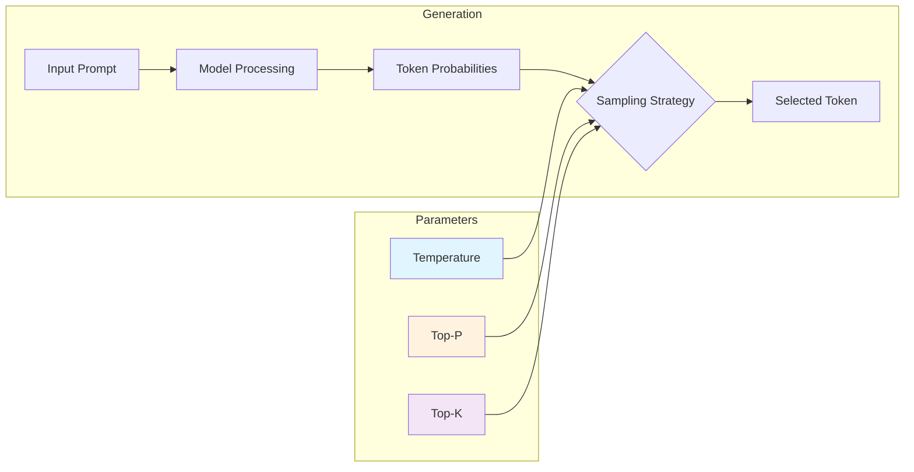
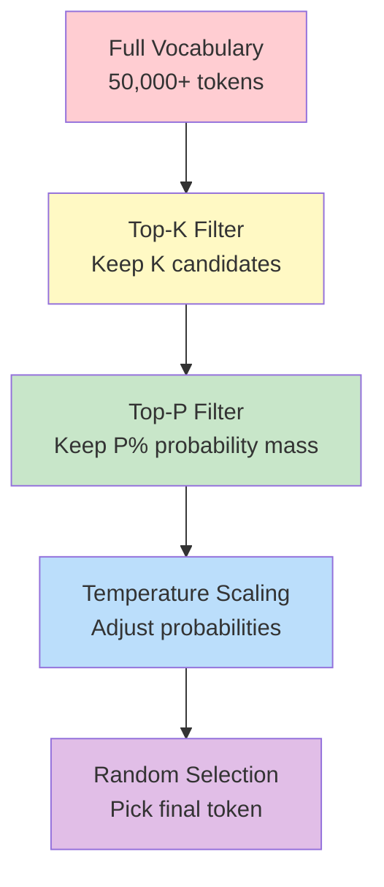

# Temperature & Sampling Interaction

## Overview

Temperature and sampling parameters are the hidden controls that determine how "creative" or "predictable" your AI responses become. These settings directly affect whether your application produces reliable, consistent outputs or surprising, diverse content—and understanding them is essential for building production AI systems.

Every API call to a language model involves a decision point: after calculating probabilities for thousands of possible next tokens, how should the model actually *choose* one? Temperature and sampling parameters (`top_p`, `top_k`) control this selection process, fundamentally shaping output behavior.

### What We'll Cover

This lesson explores the interaction between temperature and sampling parameters across major providers:

1. **Temperature Effects** - How temperature values from 0.0 to 2.0 shift output from deterministic to creative
2. **Prompt Design for Temperature** - Designing prompts that work well with different temperature settings
3. **Top-P and Top-K Parameters** - Nucleus sampling, candidate limiting, and parameter interactions
4. **When to Adjust Sampling** - Task-specific recommendations and provider-specific defaults

### Prerequisites

Before starting this lesson, you should understand:

- Basic LLM API interactions (from earlier units)
- Token concepts and probability distributions
- Prompt engineering fundamentals
- Context window management (Lesson 23)

---

## Why Temperature Matters

When a model generates text, it doesn't simply output "the answer." Instead, it produces a probability distribution over its entire vocabulary for each position. The next token could be any of thousands of possibilities, each with an assigned probability.



Consider the prompt "The weather today is...":

| Token | Raw Probability | After Temp=0.5 | After Temp=2.0 |
|-------|-----------------|----------------|----------------|
| sunny | 0.45 | 0.68 | 0.28 |
| cloudy | 0.25 | 0.22 | 0.22 |
| rainy | 0.15 | 0.07 | 0.18 |
| beautiful | 0.08 | 0.02 | 0.16 |
| unpredictable | 0.04 | 0.01 | 0.10 |
| apocalyptic | 0.001 | ~0 | 0.04 |

Lower temperatures concentrate probability on likely tokens. Higher temperatures spread probability more evenly, giving unlikely tokens a realistic chance of selection.

---

## The Two-Stage Generation Process

Text generation happens in two distinct phases, as documented by Google:

### Stage 1: Probability Calculation (Deterministic)

The model processes the input and generates a probability distribution over possible tokens. **This stage is deterministic**—the same input always produces the same probability distribution.

### Stage 2: Token Selection (Configurable)

The model selects actual tokens from the distribution. This is where temperature and sampling parameters apply:

- **Temperature = 0**: Always select the highest-probability token (greedy decoding)
- **Temperature > 0**: Randomly sample from the adjusted distribution
- **Top-P / Top-K**: Further filter which tokens are candidates for selection

> **🤖 AI Context:** Understanding this two-stage process explains why `temperature=0` isn't quite "deterministic"—while token selection becomes greedy, the underlying probability calculation can still vary slightly with model updates or floating-point differences.

---

## Provider Defaults and Critical Differences

Each major provider has different default settings and constraints:

| Provider | Default Temperature | Temperature Range | Top-P Default | Top-K Support |
|----------|---------------------|-------------------|---------------|---------------|
| **OpenAI** | 1.0 | 0-2.0 | 1.0 | No |
| **Anthropic Claude** | 1.0 | 0-1.0 | 0.999 | Yes (0-500) |
| **Google Gemini** | 1.0 | 0-2.0 | 0.95 | Yes (1-40) |

> **Warning:** Gemini 3 models require `temperature=1.0`. Changing the temperature (setting it below 1.0) may lead to unexpected behavior, such as looping or degraded performance, particularly in complex mathematical or reasoning tasks. This is a critical constraint documented by Google.

---

## Learning Objectives

By the end of this lesson, you will be able to:

✅ Explain how temperature affects token probability distributions  
✅ Choose appropriate temperature values for different task types  
✅ Configure top_p and top_k for fine-grained output control  
✅ Handle provider-specific requirements (especially Gemini 3's temperature constraint)  
✅ Design prompts that work well with your chosen sampling parameters  
✅ Debug unexpected model behavior caused by sampling misconfigurations  

---

## Lesson Structure

This lesson is organized into four focused sub-lessons:

| Lesson | Focus | Duration |
|--------|-------|----------|
| [01-Temperature Effects](./01-temperature-effects.md) | Temperature math, ranges, deterministic vs creative | 15-20 min |
| [02-Prompt Design for Temperature](./02-prompt-design-for-temperature.md) | Designing prompts for different temperature settings | 15-20 min |
| [03-Top-P and Top-K](./03-top-p-and-top-k.md) | Nucleus sampling, top-k, parameter interactions | 15-20 min |
| [04-When to Adjust Sampling](./04-when-to-adjust-sampling.md) | Task-specific recommendations, provider defaults | 15-20 min |

---

## Key Concepts Preview

### Temperature as a Dial

```
0.0 ←——————————————————————————————————→ 2.0
│                                           │
Deterministic                         Highly Creative
Predictable                           Diverse/Surprising
Factual Tasks                         Brainstorming
Code Generation                       Creative Writing
```

### The Sampling Pipeline



---

## Summary

Temperature and sampling parameters control the "personality" of model outputs:

✅ **Temperature** adjusts probability distribution sharpness (0 = focused, 2 = spread)  
✅ **Top-P** filters tokens by cumulative probability (nucleus sampling)  
✅ **Top-K** limits candidates to top K most likely tokens  
✅ **Provider differences** are significant—especially Gemini 3's temperature=1.0 requirement  

**Next:** [Temperature Effects](./01-temperature-effects.md) - Deep dive into how temperature values transform output behavior

---

## Further Reading

- [OpenAI API Reference - Temperature](https://platform.openai.com/docs/api-reference/responses/create) - Official parameter documentation
- [Google Gemini Prompting Strategies](https://ai.google.dev/gemini-api/docs/prompting-strategies) - Temperature and sampling guidance
- [Anthropic API - Messages](https://platform.claude.com/docs/en/api/messages/create) - Claude parameter specifications

<!-- 
Sources Consulted:
- OpenAI API Reference: https://platform.openai.com/docs/api-reference/responses/create
- Google Gemini Text Generation: https://ai.google.dev/gemini-api/docs/text-generation
- Google Prompting Strategies: https://ai.google.dev/gemini-api/docs/prompting-strategies
- Anthropic Claude API: https://platform.claude.com/docs/en/api/messages/create
-->
