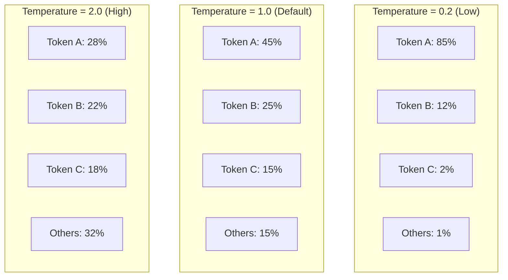
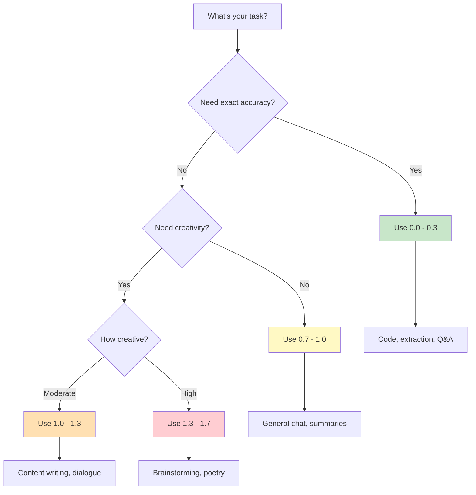

# Temperature Effects

## Introduction

Temperature is the single most important parameter controlling how "random" or "deterministic" language model outputs become. Named after the thermodynamics concept of physical systems, temperature in LLMs controls how the model samples from its probability distribution—essentially deciding whether to play it safe with high-probability tokens or take chances on less likely options.

Understanding temperature effects is critical because the wrong setting can make a powerful model produce unusable results: too low for creative tasks leads to repetitive, boring output; too high for factual tasks leads to hallucinations and nonsense.

### What We'll Cover

- The mathematics behind temperature scaling
- Temperature ranges across providers (0.0 to 2.0)
- Deterministic vs. creative output behavior
- **Critical:** Gemini 3's mandatory temperature=1.0 constraint
- Code examples across all major providers

### Prerequisites

- Understanding of token probability distributions
- Basic API interaction with at least one LLM provider
- Familiarity with JSON and REST APIs

---

## The Mathematics of Temperature

Temperature affects the probability distribution through a mathematical operation called **softmax scaling**. Before temperature is applied, the model produces "logits"—raw scores for each possible token. Temperature divides these logits before converting them to probabilities.

### The Temperature Formula

```
P(token) = exp(logit / T) / Σ exp(all_logits / T)
```

Where:
- `logit` is the raw score for a token
- `T` is the temperature value
- The denominator normalizes all probabilities to sum to 1.0

### Visual Impact



### Temperature Effects Summary

| Temperature | Effect on Distribution | Output Behavior |
|-------------|------------------------|-----------------|
| **0.0** | Infinitely sharp—always picks highest | Fully deterministic, greedy decoding |
| **0.1-0.3** | Very concentrated | Highly predictable, minor variation |
| **0.5-0.7** | Moderately concentrated | Balanced, some creativity |
| **1.0** | Original distribution | Default behavior, natural balance |
| **1.2-1.5** | Spread out | More creative, less predictable |
| **1.8-2.0** | Very flat | Highly random, potentially chaotic |

---

## Temperature = 0: Deterministic Mode

When temperature is exactly 0, the model uses **greedy decoding**—always selecting the token with the highest probability. This produces consistent, reproducible outputs.

### OpenAI Example: Temperature 0

```python
from openai import OpenAI

client = OpenAI()

def generate_deterministic(prompt: str) -> str:
    """Generate fully deterministic output with temperature=0."""
    response = client.responses.create(
        model="gpt-4.1",
        temperature=0,  # Greedy decoding
        input=prompt
    )
    return response.output_text

# Running this multiple times produces identical output
prompt = "What is 2 + 2? Answer with just the number."

for i in range(3):
    result = generate_deterministic(prompt)
    print(f"Run {i + 1}: {result}")
```

**Expected Output:**
```
Run 1: 4
Run 2: 4
Run 3: 4
```

### Anthropic Claude Example: Temperature 0

```python
import anthropic

client = anthropic.Anthropic()

def generate_deterministic_claude(prompt: str) -> str:
    """Generate deterministic output with Claude."""
    message = client.messages.create(
        model="claude-sonnet-4-5-20250929",
        max_tokens=100,
        temperature=0,  # Deterministic mode
        messages=[
            {"role": "user", "content": prompt}
        ]
    )
    return message.content[0].text

result = generate_deterministic_claude("List the primary colors.")
print(result)
```

**Expected Output:**
```
The primary colors are:
1. Red
2. Blue
3. Yellow
```

> **Note:** Even at temperature=0, outputs may vary slightly between API calls due to model updates, infrastructure changes, or floating-point precision differences. For true reproducibility, also use a fixed `seed` parameter where available.

---

## Low Temperature (0.1 - 0.5): Focused Responses

Low temperatures concentrate probability mass on the most likely tokens, producing focused, predictable output with minimal variation.

### Use Cases for Low Temperature

| Task | Recommended Range | Why |
|------|-------------------|-----|
| Code generation | 0.0 - 0.2 | Syntax must be correct |
| Data extraction | 0.0 - 0.1 | Consistent formatting |
| Translation | 0.2 - 0.4 | Accuracy over creativity |
| Summarization | 0.3 - 0.5 | Faithful to source |
| Question answering | 0.0 - 0.3 | Factual accuracy |

### OpenAI Example: Low Temperature for Code

```python
from openai import OpenAI

client = OpenAI()

def generate_code(task: str) -> str:
    """Generate code with low temperature for accuracy."""
    response = client.responses.create(
        model="gpt-4.1",
        temperature=0.2,  # Low for code accuracy
        input=f"""Write a Python function that {task}.
        
Return only the code, no explanations."""
    )
    return response.output_text

code = generate_code("calculates the factorial of a number recursively")
print(code)
```

**Expected Output:**
```python
def factorial(n):
    if n <= 1:
        return 1
    return n * factorial(n - 1)
```

---

## Default Temperature (1.0): Balanced Output

Temperature 1.0 uses the model's original probability distribution without modification. This is the default for most providers and represents the "intended" behavior of the model.

### When to Use Default Temperature

- **General-purpose chatbots** - Natural, varied conversation
- **Content generation** - Balanced creativity and coherence
- **Multi-turn conversations** - Consistent but not robotic
- **Most production applications** - Safe starting point

### OpenAI Response Object Example

```python
from openai import OpenAI

client = OpenAI()

response = client.responses.create(
    model="gpt-4.1",
    temperature=1.0,  # Default - balanced
    input="Tell me an interesting fact about space."
)

print(response.output_text)
# The response object shows the temperature used:
print(f"Temperature used: {response.temperature}")
```

**Sample Outputs (will vary):**
```
Run 1: The largest known star, UY Scuti, has a radius about 1,700 times 
       that of our Sun—so large that if placed in our solar system, its 
       surface would extend beyond Jupiter's orbit.

Run 2: Space is completely silent because there's no atmosphere for sound 
       waves to travel through. Astronauts communicate via radio waves.

Run 3: A day on Venus is longer than its year. Venus takes 243 Earth days 
       to rotate once but only 225 Earth days to orbit the Sun.
```

---

## High Temperature (1.2 - 2.0): Creative Mode

High temperatures flatten the probability distribution, giving less likely tokens a realistic chance of selection. This produces more diverse, creative, and sometimes surprising outputs.

### Use Cases for High Temperature

| Task | Recommended Range | Why |
|------|-------------------|-----|
| Creative writing | 1.2 - 1.5 | Varied prose and ideas |
| Brainstorming | 1.3 - 1.8 | Diverse suggestions |
| Poetry/music | 1.2 - 1.6 | Artistic expression |
| Character dialogue | 1.1 - 1.4 | Personality variation |
| Story generation | 1.2 - 1.5 | Plot unpredictability |

### OpenAI Example: High Temperature for Brainstorming

```python
from openai import OpenAI

client = OpenAI()

def brainstorm_ideas(topic: str, count: int = 5) -> list[str]:
    """Generate diverse ideas with high temperature."""
    response = client.responses.create(
        model="gpt-4.1",
        temperature=1.6,  # High for creativity
        input=f"""Generate {count} unusual and creative business ideas 
related to {topic}. Be unconventional and surprising.

Format: numbered list, one idea per line."""
    )
    return response.output_text

ideas = brainstorm_ideas("sustainable food", 5)
print(ideas)
```

**Sample Output (will vary significantly):**
```
1. Edible packaging made from seaweed that dissolves in water
2. A restaurant where all dishes are made from "ugly" produce
3. Subscription service for leftover restaurant meals at 80% off
4. Vertical farm pods for apartment balconies
5. An app that connects neighbors to share excess garden produce
```

> **Warning:** Temperatures above 1.5 can produce incoherent or nonsensical output. Always test high-temperature outputs carefully before using in production.

---

## Critical: Gemini 3 Temperature Constraint

Google's Gemini 3 models have a **mandatory temperature=1.0 constraint** that differs significantly from other providers. This is not a recommendation—it's a requirement for proper model behavior.

### The Official Guidance

From Google's documentation:

> "When using Gemini 3 models, we strongly recommend keeping the `temperature` at its default value of 1.0. Changing the temperature (setting it below 1.0) may lead to unexpected behavior, such as **looping or degraded performance**, particularly in complex mathematical or reasoning tasks."

### Why Gemini 3 is Different

Gemini 3's architecture and training process were optimized with temperature=1.0 as an integral part of the model's behavior. Unlike earlier models where temperature was purely a post-processing step, Gemini 3 may use temperature expectations in its internal reasoning.

### Google Gemini Example: Correct Usage

```python
from google import genai
from google.genai import types

client = genai.Client()

# ✅ CORRECT: Use default temperature for Gemini 3
response = client.models.generate_content(
    model="gemini-3-flash-preview",
    contents="Solve this step by step: What is 15% of 240?",
    config=types.GenerateContentConfig(
        temperature=1.0  # REQUIRED for Gemini 3
    )
)
print(response.text)
```

**Expected Output:**
```
I'll solve this step by step.

To find 15% of 240:

Step 1: Convert the percentage to a decimal
15% = 15/100 = 0.15

Step 2: Multiply by the number
0.15 × 240 = 36

Therefore, 15% of 240 is 36.
```

### Google Gemini Example: What NOT to Do

```python
from google import genai
from google.genai import types

client = genai.Client()

# ❌ WRONG: Low temperature can cause looping in Gemini 3
response = client.models.generate_content(
    model="gemini-3-flash-preview",
    contents="Solve this step by step: What is 15% of 240?",
    config=types.GenerateContentConfig(
        temperature=0.2  # DON'T DO THIS with Gemini 3!
    )
)
print(response.text)
```

**Potential Problematic Output:**
```
Step 1: Convert percentage to decimal
15% = 0.15

Step 1: Convert percentage to decimal
15% = 0.15

Step 1: Convert percentage to decimal
[... repeating indefinitely ...]
```

### Provider Comparison

| Provider | Can Use Temp=0? | Default | Notes |
|----------|-----------------|---------|-------|
| **OpenAI GPT** | ✅ Yes | 1.0 | Full 0-2.0 range supported |
| **OpenAI o-series** | ⚠️ Fixed | 1.0 | Reasoning models ignore temperature |
| **Anthropic Claude** | ✅ Yes | 1.0 | Range 0-1.0 only |
| **Google Gemini 2** | ✅ Yes | 1.0 | Full 0-2.0 range supported |
| **Google Gemini 3** | ❌ No | 1.0 | **Must use 1.0** |

---

## Temperature and Reasoning Models

Reasoning models like OpenAI's o-series and Claude with extended thinking have special temperature handling:

### OpenAI o-series Models

OpenAI's reasoning models (o1, o3, etc.) **ignore temperature settings**. The internal reasoning process uses its own sampling strategy, and the final output is produced based on that reasoning.

```python
from openai import OpenAI

client = OpenAI()

# Temperature is ignored for o-series
response = client.responses.create(
    model="o3",
    temperature=0.5,  # This setting is ignored
    reasoning={"effort": "medium"},
    input="What is the most efficient sorting algorithm for nearly sorted data?"
)

# The model reasons internally regardless of temperature setting
print(response.output_text)
```

### Claude Extended Thinking

When using Claude's extended thinking mode, temperature affects only the final response, not the internal thinking process:

```python
import anthropic

client = anthropic.Anthropic()

# Temperature affects final output only
response = client.messages.create(
    model="claude-sonnet-4-5-20250929",
    max_tokens=16000,
    temperature=0.3,  # Affects final response
    thinking={
        "type": "enabled",
        "budget_tokens": 10000  # Thinking uses fixed sampling
    },
    messages=[
        {"role": "user", "content": "Analyze the trade-offs of microservices vs monoliths."}
    ]
)
```

---

## Comparing Temperature Across Providers

Here's a unified example showing the same prompt at different temperatures:

```python
# Temperature comparison function
def compare_temperatures(prompt: str, temperatures: list[float]):
    """Compare outputs at different temperature settings."""
    
    from openai import OpenAI
    import anthropic
    
    openai_client = OpenAI()
    claude_client = anthropic.Anthropic()
    
    print(f"Prompt: {prompt}\n")
    print("=" * 60)
    
    for temp in temperatures:
        print(f"\n--- Temperature: {temp} ---")
        
        # OpenAI
        oai_response = openai_client.responses.create(
            model="gpt-4.1",
            temperature=temp,
            input=prompt
        )
        print(f"OpenAI: {oai_response.output_text[:100]}...")
        
        # Claude (clamp to 0-1 range)
        claude_temp = min(temp, 1.0)
        claude_response = claude_client.messages.create(
            model="claude-sonnet-4-5-20250929",
            max_tokens=100,
            temperature=claude_temp,
            messages=[{"role": "user", "content": prompt}]
        )
        print(f"Claude (temp={claude_temp}): {claude_response.content[0].text[:100]}...")

# Test
compare_temperatures(
    "Describe a sunset in one sentence.",
    [0.0, 0.5, 1.0, 1.5]
)
```

---

## Best Practices

### Temperature Selection Guide



### Common Mistakes

| ❌ Mistake | ✅ Solution |
|-----------|-------------|
| Using high temperature for code generation | Use temperature 0.0-0.2 for code |
| Using temperature=0 for creative writing | Use temperature 1.0-1.5 for creativity |
| Changing temperature for Gemini 3 | Always use temperature=1.0 for Gemini 3 |
| Ignoring temperature for reproducibility needs | Use temperature=0 + seed for reproducible outputs |
| Using temperature 2.0 in production | Cap at 1.5 maximum for coherent output |

---

## Hands-on Exercise

### Your Task

Build a function that automatically selects appropriate temperature based on task classification.

### Requirements

1. Create a `TaskTemperature` enum with task categories
2. Implement `get_temperature(task_type)` that returns appropriate temperature
3. Handle provider-specific constraints (especially Gemini 3)
4. Test with at least 3 different task types

### Expected Result

```python
temp = get_temperature(TaskType.CODE_GENERATION, provider="openai")
# Returns: 0.1

temp = get_temperature(TaskType.CREATIVE_WRITING, provider="openai")
# Returns: 1.3

temp = get_temperature(TaskType.ANY, provider="gemini-3")
# Returns: 1.0 (always, due to constraint)
```

<details>
<summary>💡 Hints (click to expand)</summary>

- Use an Enum for task types: `CODE`, `FACTUAL`, `GENERAL`, `CREATIVE`, `BRAINSTORM`
- Create a mapping dictionary from task type to temperature range
- Add provider-specific overrides (Gemini 3 always returns 1.0)
- Consider returning a tuple of (min, max) for flexibility

</details>

<details>
<summary>✅ Solution (click to expand)</summary>

```python
from enum import Enum
from typing import Literal

class TaskType(Enum):
    CODE_GENERATION = "code"
    DATA_EXTRACTION = "extraction"
    FACTUAL_QA = "factual"
    SUMMARIZATION = "summary"
    GENERAL_CHAT = "general"
    CONTENT_WRITING = "content"
    CREATIVE_WRITING = "creative"
    BRAINSTORMING = "brainstorm"

# Temperature recommendations by task type
TEMPERATURE_MAP = {
    TaskType.CODE_GENERATION: 0.1,
    TaskType.DATA_EXTRACTION: 0.0,
    TaskType.FACTUAL_QA: 0.2,
    TaskType.SUMMARIZATION: 0.4,
    TaskType.GENERAL_CHAT: 0.8,
    TaskType.CONTENT_WRITING: 1.0,
    TaskType.CREATIVE_WRITING: 1.3,
    TaskType.BRAINSTORMING: 1.5,
}

ProviderType = Literal["openai", "claude", "gemini-2", "gemini-3"]

def get_temperature(
    task_type: TaskType, 
    provider: ProviderType = "openai"
) -> float:
    """Get recommended temperature for a task and provider.
    
    Args:
        task_type: The type of task being performed
        provider: The LLM provider being used
        
    Returns:
        Recommended temperature value
        
    Note:
        Gemini 3 always returns 1.0 due to model constraints.
        Claude temperatures are clamped to 0-1 range.
    """
    # Gemini 3 constraint: always use 1.0
    if provider == "gemini-3":
        return 1.0
    
    base_temp = TEMPERATURE_MAP.get(task_type, 0.8)
    
    # Claude only supports 0-1 range
    if provider == "claude":
        return min(base_temp, 1.0)
    
    return base_temp


# Test the function
def test_temperature_selection():
    """Test temperature selection across providers and tasks."""
    
    test_cases = [
        (TaskType.CODE_GENERATION, "openai", 0.1),
        (TaskType.CREATIVE_WRITING, "openai", 1.3),
        (TaskType.BRAINSTORMING, "claude", 1.0),  # Clamped
        (TaskType.FACTUAL_QA, "gemini-3", 1.0),   # Override
        (TaskType.CREATIVE_WRITING, "gemini-3", 1.0),  # Override
    ]
    
    for task, provider, expected in test_cases:
        result = get_temperature(task, provider)
        status = "✅" if result == expected else "❌"
        print(f"{status} {task.value} + {provider}: {result} (expected {expected})")

test_temperature_selection()
```

**Output:**
```
✅ code + openai: 0.1 (expected 0.1)
✅ creative + openai: 1.3 (expected 1.3)
✅ brainstorm + claude: 1.0 (expected 1.0)
✅ factual + gemini-3: 1.0 (expected 1.0)
✅ creative + gemini-3: 1.0 (expected 1.0)
```

</details>

### Bonus Challenge

- [ ] Extend the solution to return a `(min, max)` range instead of a single value
- [ ] Add support for custom temperature overrides per-request
- [ ] Implement logging when Gemini 3 constraint overrides a different preference

---

## Summary

✅ **Temperature scales probability distributions** - Low = focused, high = spread  
✅ **Temperature 0 = deterministic** - Always picks highest probability token  
✅ **Temperature 1.0 = default** - Uses original distribution (balanced)  
✅ **Temperature 1.5+ = creative** - High variation, potential for incoherence  
✅ **Gemini 3 requires temperature=1.0** - Critical constraint to avoid looping  
✅ **Reasoning models may ignore temperature** - o-series and extended thinking have fixed sampling  

**Next:** [Prompt Design for Temperature](./02-prompt-design-for-temperature.md) - Designing prompts that work with different temperature settings

---

## Further Reading

- [OpenAI API Reference](https://platform.openai.com/docs/api-reference/responses/create) - Temperature parameter details
- [Google Gemini 3 Guide](https://ai.google.dev/gemini-api/docs/gemini-3) - Temperature constraints
- [Anthropic API](https://platform.claude.com/docs/en/api/messages/create) - Claude sampling parameters

<!-- 
Sources Consulted:
- OpenAI API Reference: https://platform.openai.com/docs/api-reference/responses/create
- Google Gemini Text Generation: https://ai.google.dev/gemini-api/docs/text-generation
- Google Prompting Strategies: https://ai.google.dev/gemini-api/docs/prompting-strategies
- Anthropic Claude API: https://platform.claude.com/docs/en/api/messages/create
-->
