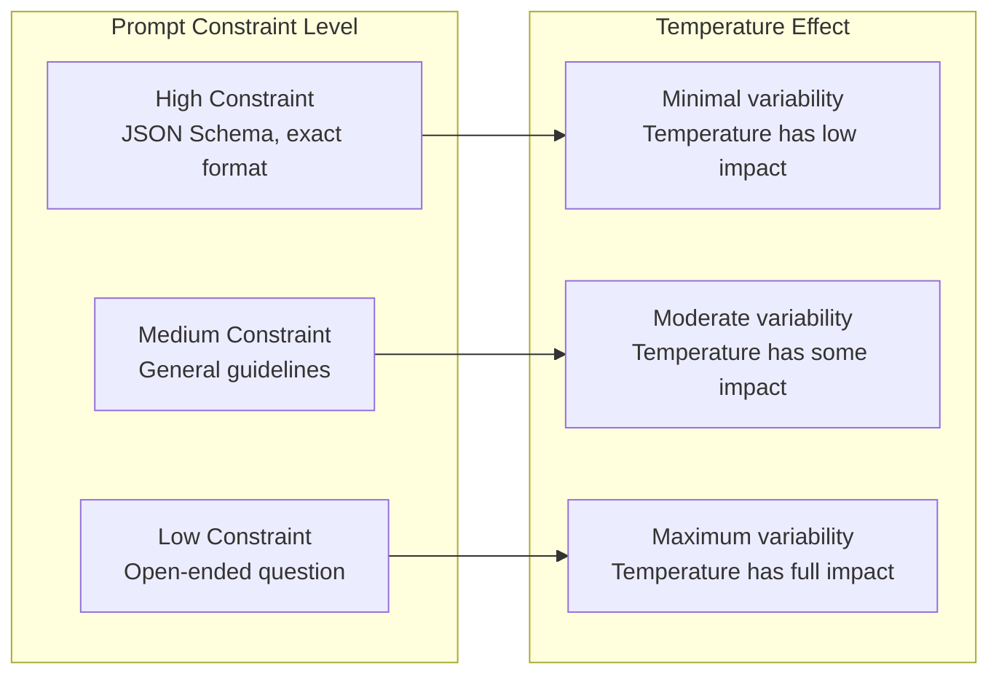

# Prompt Design for Temperature

## Introduction

Temperature settings and prompt design work together as an integrated system. A prompt optimized for low-temperature code generation will produce poor results at high temperature, while a creative writing prompt designed for temperature 1.5 becomes repetitive and boring at temperature 0.

This lesson explores how to design prompts that work harmoniously with your chosen temperature settings—and how to recognize when a prompt-temperature mismatch is causing poor results.

### What We'll Cover

- How prompt structure interacts with temperature
- Designing prompts for low, medium, and high temperature
- Constraint specificity and its relationship to sampling
- Provider-specific prompt patterns
- Debugging prompt-temperature mismatches

### Prerequisites

- Understanding of temperature effects (Lesson 01)
- Prompt engineering basics (earlier Unit 6 lessons)
- Experience with at least one LLM API

---

## The Prompt-Temperature Relationship

Prompts and temperature work as a push-pull system:

- **Structured prompts** constrain output, reducing the impact of temperature
- **Open prompts** allow temperature to have maximum effect
- **The combination determines output variability**



### The Constraint Spectrum

| Prompt Type | Example | Temperature Impact |
|------------|---------|-------------------|
| **Highly constrained** | "Return only 'yes' or 'no'" | Minimal - format dominates |
| **Format-specified** | "Return JSON with {fields}" | Low - structure constrains |
| **Guided** | "Write a summary in 2-3 sentences" | Medium - guidelines provide direction |
| **Topic-bounded** | "Explain quantum computing" | Medium-High - content can vary |
| **Open-ended** | "Tell me something interesting" | Maximum - full temperature effect |

---

## Designing Prompts for Low Temperature (0.0 - 0.4)

Low-temperature prompts should be **highly specific** because the model will strongly prefer high-probability outputs. Vague prompts at low temperature produce generic, predictable results.

### Principles for Low-Temperature Prompts

1. **Be extremely specific about requirements**
2. **Provide exact output format specifications**
3. **Include examples of desired output**
4. **Specify edge cases and constraints explicitly**

### Example: Data Extraction at Temperature 0

```python
from openai import OpenAI

client = OpenAI()

# ✅ GOOD: Highly specific for low temperature
specific_prompt = """Extract contact information from this text and return as JSON.

Required fields:
- name (string): Full name, or null if not found
- email (string): Email address, or null if not found  
- phone (string): Phone number in format XXX-XXX-XXXX, or null if not found
- company (string): Company name, or null if not found

Text: "Please reach out to Sarah Chen at TechCorp. She can be contacted at 
sarah.chen@techcorp.com or call her at 555-123-4567."

Return ONLY the JSON object, no additional text."""

response = client.responses.create(
    model="gpt-4.1",
    temperature=0,  # Deterministic
    input=specific_prompt
)

print(response.output_text)
```

**Expected Output:**
```json
{
  "name": "Sarah Chen",
  "email": "sarah.chen@techcorp.com",
  "phone": "555-123-4567",
  "company": "TechCorp"
}
```

### Anti-Pattern: Vague Prompt at Low Temperature

```python
# ❌ BAD: Vague prompt at low temperature produces generic output
vague_prompt = """Get the contact info from this text:

"Please reach out to Sarah Chen at TechCorp. She can be contacted at 
sarah.chen@techcorp.com or call her at 555-123-4567."
"""

response = client.responses.create(
    model="gpt-4.1",
    temperature=0,
    input=vague_prompt
)

print(response.output_text)
```

**Problematic Output:**
```
The contact information is:
- Name: Sarah Chen
- Company: TechCorp
- Email: sarah.chen@techcorp.com
- Phone: 555-123-4567
```

The output is correct but inconsistent with what you might need—no JSON, bullet points instead of structured data, inconsistent field ordering.

---

## Designing Prompts for Medium Temperature (0.5 - 1.0)

Medium-temperature prompts should provide **guidance without over-constraining**. Give the model direction while allowing natural variation.

### Principles for Medium-Temperature Prompts

1. **Provide clear objectives, not exact outputs**
2. **Specify tone and style, not word-for-word content**
3. **Use examples to show range of acceptable outputs**
4. **Allow flexibility in structure and phrasing**

### Example: Content Generation at Temperature 0.8

```python
from openai import OpenAI

client = OpenAI()

# ✅ GOOD: Guided but flexible for medium temperature
guided_prompt = """Write a product description for a smart water bottle.

Target audience: Health-conscious professionals ages 25-40
Tone: Friendly but professional, not overly casual
Length: 2-3 short paragraphs
Key features to mention:
- Temperature tracking
- Hydration reminders  
- Mobile app integration

Focus on benefits, not just features. Use the second person ("you")."""

response = client.responses.create(
    model="gpt-4.1",
    temperature=0.8,  # Balanced creativity
    input=guided_prompt
)

print(response.output_text)
```

**Sample Output:**
```
Stay effortlessly hydrated throughout your busy day with the HydraSmart bottle. 
Our intelligent temperature sensor lets you know exactly when your water hits 
that perfect refreshing coolness, while gentle reminders keep you on track 
with your hydration goals—even during back-to-back meetings.

Connect to our companion app to track your daily intake, set personalized 
targets, and see how proper hydration is boosting your energy and focus. 
Because when you're performing at your best, every sip counts.
```

### Multiple Runs Show Natural Variation

At temperature 0.8, running the same prompt produces varied but consistent-quality outputs:

```python
for i in range(3):
    response = client.responses.create(
        model="gpt-4.1",
        temperature=0.8,
        input=guided_prompt
    )
    print(f"--- Run {i+1} ---")
    print(response.output_text[:200] + "...")
    print()
```

**Output shows variation while maintaining quality:**
```
--- Run 1 ---
Stay effortlessly hydrated throughout your busy day with the HydraSmart bottle...

--- Run 2 ---
Your hydration just got smarter. The HydraSmart bottle tracks your water...

--- Run 3 ---
Meet your new wellness companion. Our smart water bottle takes the guesswork...
```

---

## Designing Prompts for High Temperature (1.1 - 1.7)

High-temperature prompts should be **open-ended and encouraging of divergent thinking**. Too much constraint at high temperature creates tension—the model wants to explore but the prompt restricts it.

### Principles for High-Temperature Prompts

1. **Encourage exploration and novel ideas**
2. **Use open-ended questions, not prescriptive instructions**
3. **Ask for multiple diverse options**
4. **Embrace unexpected directions**

### Example: Brainstorming at Temperature 1.5

```python
from openai import OpenAI

client = OpenAI()

# ✅ GOOD: Open-ended for high temperature creativity
creative_prompt = """I'm looking for unusual and creative marketing campaign ideas 
for a new plant-based protein bar.

Think beyond traditional advertising. What unexpected, memorable, or 
unconventional approaches could make this product stand out?

Give me 5 ideas, ranging from practical to wild. Surprise me."""

response = client.responses.create(
    model="gpt-4.1",
    temperature=1.5,  # High creativity
    input=creative_prompt
)

print(response.output_text)
```

**Sample Output:**
```
1. **Guerrilla Gardening Campaign**: Partner with urban gardening groups to 
   plant protein-bar-shaped garden beds in public spaces. Each "bar garden" 
   grows the actual ingredients in the product. QR codes lead to time-lapse 
   videos of the growing process.

2. **Flavor Voting via Running Routes**: Create a fitness app challenge where 
   runners' GPS routes vote on new flavors. Run a shape that looks like a 
   strawberry? That's a vote for strawberry flavor.

3. **Protein Bar Fortune Telling**: Each wrapper contains an AI-generated 
   "fortune" based on the nutritional benefits ("Your future holds improved 
   focus and sustained energy"). Collect all 50 fortunes to unlock a 
   personalized meal plan.

4. **Edible Business Cards**: Send product samples to influencers in the form 
   of actual edible business cards—same size, printed with plant-based ink on 
   a thin wafer version of the bar.

5. **Adopt a Farmer**: Each bar package includes a code to "meet" the specific 
   farmer who grew the pea protein used in that batch. Video interviews, farm 
   tours, even options to fund their next crop.
```

### Anti-Pattern: Over-Constrained Prompt at High Temperature

```python
# ❌ BAD: Too constrained for high temperature
over_constrained = """Write exactly 3 marketing taglines for a protein bar.
Each tagline must:
- Be exactly 5 words
- Start with a verb
- Include the word "protein"
- End with an exclamation mark
- Not use the words "power" or "energy"

Format: numbered list."""

response = client.responses.create(
    model="gpt-4.1",
    temperature=1.5,  # High temp fighting tight constraints
    input=over_constrained
)
```

This creates tension—the high temperature wants to explore, but the constraints force convergence. Results are often awkward or the model struggles to meet all criteria.

---

## Provider-Specific Prompt Patterns

Different providers respond differently to prompt-temperature combinations. Here are optimized patterns for each:

### OpenAI Pattern: Instruction Following

OpenAI models excel at following structured instructions. Use clear instruction-response format:

```python
from openai import OpenAI

client = OpenAI()

openai_prompt = """<instructions>
You are a creative writing assistant. Generate story opening paragraphs.

Style: Atmospheric and immersive
Length: 2-3 sentences
Avoid: Clichés like "It was a dark and stormy night"
</instructions>

<task>
Write an opening paragraph for a mystery story set in a lighthouse.
</task>"""

response = client.responses.create(
    model="gpt-4.1",
    temperature=1.2,
    input=openai_prompt
)
```

### Claude Pattern: XML Structure

Claude responds particularly well to XML-tagged prompts:

```python
import anthropic

client = anthropic.Anthropic()

claude_prompt = """<context>
You are helping brainstorm product features for a meditation app.
</context>

<constraints>
- Target audience: Busy professionals with 5-10 minutes daily
- Platform: Mobile-first, iOS and Android
- Differentiation: Must stand out from Calm and Headspace
</constraints>

<task>
Generate 5 innovative feature ideas that would make this app unique.
Focus on features that leverage AI or personalization.
</task>"""

response = client.messages.create(
    model="claude-sonnet-4-5-20250929",
    max_tokens=1000,
    temperature=1.0,  # Claude's max for creativity
    messages=[{"role": "user", "content": claude_prompt}]
)
```

### Gemini 3 Pattern: Direct and Structured

Gemini 3 prefers direct, well-structured prompts. Remember: always use temperature=1.0.

```python
from google import genai
from google.genai import types

client = genai.Client()

# System instruction for role definition
system_instruction = """You are a creative strategist specializing in 
brand positioning for tech startups."""

gemini_prompt = """Generate positioning strategies for a B2B SaaS company 
entering the HR tech space.

Consider:
1. Current market leaders (Workday, BambooHR)
2. Emerging AI-first competitors
3. Underserved mid-market segment

Provide 3 distinct positioning angles with rationale for each."""

response = client.models.generate_content(
    model="gemini-3-flash-preview",
    config=types.GenerateContentConfig(
        system_instruction=system_instruction,
        temperature=1.0  # REQUIRED for Gemini 3
    ),
    contents=gemini_prompt
)
```

> **Note:** With Gemini 3's fixed temperature=1.0, control output variation through prompt design rather than temperature adjustment.

---

## Debugging Prompt-Temperature Mismatches

When outputs don't match expectations, the issue is often a mismatch between prompt design and temperature setting.

### Common Symptoms and Solutions

| Symptom | Likely Cause | Solution |
|---------|--------------|----------|
| Output is generic/boring at high temp | Prompt too constrained | Open up the prompt, remove rigid requirements |
| Output misses format requirements | Temperature too high for precision task | Lower temperature or add stronger format constraints |
| Output is repetitive at low temp | Prompt lacks specificity | Add more detailed requirements and examples |
| Output is inconsistent quality | Medium temp with vague prompt | Either add structure or commit to high creativity |
| Output ignores instructions | Temperature too high | Lower temperature or move critical instructions to system prompt |

### Diagnostic Prompting

When debugging, test across temperature range with the same prompt:

```python
from openai import OpenAI

client = OpenAI()

def diagnose_prompt(prompt: str, temperatures: list[float] = [0, 0.5, 1.0, 1.5]):
    """Test a prompt across multiple temperatures to diagnose issues."""
    
    print(f"Testing prompt: {prompt[:50]}...")
    print("=" * 60)
    
    for temp in temperatures:
        response = client.responses.create(
            model="gpt-4.1",
            temperature=temp,
            input=prompt
        )
        
        output = response.output_text
        
        # Analyze output characteristics
        word_count = len(output.split())
        has_format = any(c in output for c in ['•', '-', '1.', '{', '['])
        
        print(f"\nTemp {temp}:")
        print(f"  Words: {word_count}")
        print(f"  Has formatting: {has_format}")
        print(f"  Preview: {output[:100]}...")

# Diagnose a potentially problematic prompt
diagnose_prompt("""Tell me about renewable energy sources.""")
```

### Red Flags in Diagnostic Output

- **Same output at temp 0 and 0.5**: Prompt may be too constrained
- **Vastly different word counts**: Format stability issues
- **Formatting lost at high temp**: Add stronger format instructions
- **Quality drops sharply above 1.0**: Prompt needs more grounding

---

## Prompt Templates by Temperature Range

### Low Temperature Template (0.0 - 0.4)

```
You are a {role} performing {specific_task}.

INPUT:
{input_data}

REQUIREMENTS:
1. {exact_requirement_1}
2. {exact_requirement_2}
3. {exact_requirement_3}

OUTPUT FORMAT:
{exact_format_specification}

Return ONLY the {output_type} with no additional text or explanation.
```

### Medium Temperature Template (0.5 - 1.0)

```
You are a {role} helping with {general_task}.

CONTEXT:
{relevant_background}

GUIDELINES:
- Tone: {desired_tone}
- Audience: {target_audience}
- Length: {approximate_length}

TASK:
{what_to_accomplish}

Focus on {key_aspect} while maintaining {quality_attribute}.
```

### High Temperature Template (1.1 - 1.7)

```
You are a {creative_role} known for {distinctive_quality}.

CHALLENGE:
{open_ended_problem}

INSPIRATION:
- {thought_starter_1}
- {thought_starter_2}

Think beyond conventional approaches. What unexpected angles could work?
Generate {number} diverse ideas, ranging from practical to experimental.
Surprise me with at least one unconventional suggestion.
```

---

## Hands-on Exercise

### Your Task

Create three versions of a prompt for the same task, each optimized for a different temperature range.

### The Task

Generate product names for a new line of sustainable office supplies.

### Requirements

1. Write a prompt optimized for **temperature 0.2** (consistent, brand-safe names)
2. Write a prompt optimized for **temperature 0.8** (balanced creativity)
3. Write a prompt optimized for **temperature 1.5** (wild, innovative ideas)
4. Test each prompt at its target temperature
5. Document how the outputs differ

### Expected Result

Three distinct prompts that produce appropriate outputs at their target temperatures:
- Low temp: Safe, conventional names that follow brand guidelines
- Medium temp: Creative but professional names
- High temp: Unusual, memorable, potentially edgy names

<details>
<summary>💡 Hints (click to expand)</summary>

- For low temp: Specify naming conventions, length limits, and mandatory elements
- For medium temp: Describe the brand personality and give examples of the tone
- For high temp: Encourage wordplay, unexpected connections, and risk-taking
- Test each prompt at temperatures above and below its target to see the difference

</details>

<details>
<summary>✅ Solution (click to expand)</summary>

```python
from openai import OpenAI

client = OpenAI()

# LOW TEMPERATURE PROMPT (0.2)
low_temp_prompt = """Generate 5 product names for a sustainable office supplies brand.

BRAND REQUIREMENTS:
- Brand name: "GreenDesk"
- Naming convention: [Adjective] + [Noun] format
- Must include reference to sustainability OR nature
- 2-3 syllables maximum per name
- Must be easily pronounceable in English

PRODUCT CATEGORIES:
1. Recycled paper notebooks
2. Plant-based pens
3. Bamboo desk organizers

OUTPUT FORMAT:
Return a numbered list with category label and name only.

Example format:
1. Notebooks: EcoNote
2. Pens: LeafWrite"""

# MEDIUM TEMPERATURE PROMPT (0.8)  
medium_temp_prompt = """Create product names for GreenDesk, a sustainable office supplies startup.

Brand personality: Modern, approachable, environmentally conscious but not preachy.
Think: Patagonia meets Muji

We need names for:
- Paper products (notebooks, journals)
- Writing instruments
- Desk organization

Guidelines:
- Names should feel fresh and contemporary
- Can be playful but still professional
- Evoke nature or sustainability subtly, not heavy-handedly

Give me 5 options per category. Include a brief (one phrase) explanation 
for your favorites."""

# HIGH TEMPERATURE PROMPT (1.5)
high_temp_prompt = """You're naming products for GreenDesk—but forget safe corporate naming.

What if sustainable office supplies had the creativity of startup naming 
(think Spotify, Figma) or the playfulness of indie brands?

Categories: paper goods, pens, desk organization

Go wild. Some constraints to break:
- Names don't have to be "nature-y"
- Can be unexpected metaphors
- Single made-up words are fine
- References and wordplay encouraged
- A name that makes someone ask "wait, what?" is good

Give me 10 names across categories. The weirder the better—we can always 
dial back, but I want to see the edges of possibility."""


def test_prompt(prompt: str, temperature: float, label: str):
    """Test a prompt at its target temperature."""
    response = client.responses.create(
        model="gpt-4.1",
        temperature=temperature,
        input=prompt
    )
    print(f"\n{'='*60}")
    print(f"{label} (temp={temperature})")
    print('='*60)
    print(response.output_text)


# Run tests
test_prompt(low_temp_prompt, 0.2, "LOW TEMP - Conservative")
test_prompt(medium_temp_prompt, 0.8, "MEDIUM TEMP - Balanced")
test_prompt(high_temp_prompt, 1.5, "HIGH TEMP - Experimental")
```

**Sample Outputs:**

```
============================================================
LOW TEMP - Conservative (temp=0.2)
============================================================
1. Notebooks: EcoLeaf
2. Notebooks: GreenPage  
3. Pens: BioWrite
4. Pens: NaturePen
5. Organizers: BambooNest

============================================================
MEDIUM TEMP - Balanced (temp=0.8)
============================================================
Paper Products:
1. Canopy - evokes forest coverage, the source of sustainable paper
2. Grain - references paper texture and natural origins
3. Seedling - growth mindset, new beginnings
4. Drift - light, natural movement ⭐ Favorite: feels modern yet organic
5. Meadow - open, inviting, natural

Writing Instruments:
1. Sprout - growth, beginning of ideas
2. Current - flow of ideas, also water/nature reference
3. Wisp - light touch, delicate
4. Ember - spark of creativity ⭐ Favorite: unexpected warmth
5. Reed - natural writing instrument reference

============================================================
HIGH TEMP - Experimental (temp=1.5)
============================================================
1. Thunk - the sound an idea makes when it lands
2. Paperweight - ironic, the opposite of what eco paper should be
3. Dendrite - brain cell branches, tree branches, double meaning
4. Compost - everything eventually returns, embrace the cycle
5. Oops - for erasable products, embracing mistakes
6. Mulch - earthy, weird, memorable
7. Chlorophyll & (yes, with the ampersand) - science meets design
8. Felled - dramatic, acknowledges what paper comes from
9. 404 - "tree not found" - tech meets sustainability irony
10. Second Growth - forestry term, regrowth after logging
```

</details>

### Bonus Challenges

- [ ] Test each prompt at the "wrong" temperature to see what breaks
- [ ] Create a fourth prompt optimized for Gemini 3 (temperature fixed at 1.0)
- [ ] Add few-shot examples to the low-temp prompt and observe consistency improvements

---

## Summary

✅ **Prompt constraint level determines temperature impact** - More structure = less temperature effect  
✅ **Low-temp prompts need high specificity** - Vague + low temp = generic output  
✅ **High-temp prompts should encourage exploration** - Over-constraint creates tension  
✅ **Provider patterns differ** - OpenAI likes instructions, Claude likes XML, Gemini 3 needs temp=1.0  
✅ **Diagnostic testing reveals mismatches** - Test across temperature range to find optimal pairing  

**Next:** [Top-P and Top-K](./03-top-p-and-top-k.md) - Nucleus sampling and advanced parameter control

---

## Further Reading

- [OpenAI Prompt Engineering Guide](https://platform.openai.com/docs/guides/text-generation) - Official prompting strategies
- [Anthropic Prompt Engineering](https://platform.claude.com/docs/en/docs/build-with-claude/prompt-engineering/overview) - Claude-specific techniques
- [Google Gemini 3 Prompting](https://ai.google.dev/gemini-api/docs/prompting-strategies) - Gemini 3 best practices

<!-- 
Sources Consulted:
- OpenAI API Reference: https://platform.openai.com/docs/api-reference/responses/create
- OpenAI Text Generation Guide: https://platform.openai.com/docs/guides/text-generation
- Google Prompting Strategies: https://ai.google.dev/gemini-api/docs/prompting-strategies
- Anthropic Prompt Engineering: https://platform.claude.com/docs/en/docs/build-with-claude/prompt-engineering/overview
-->
