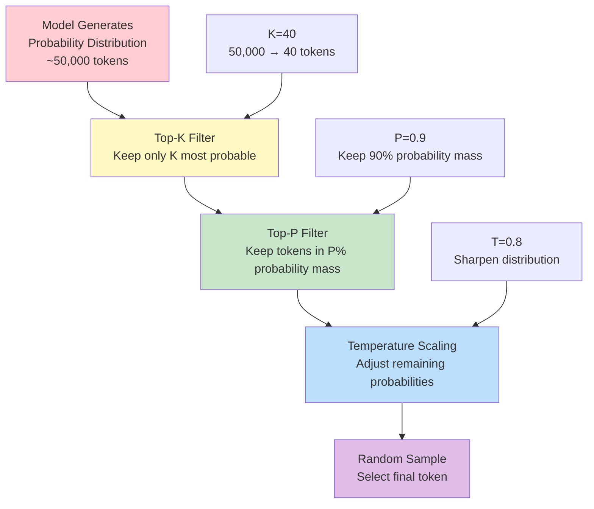
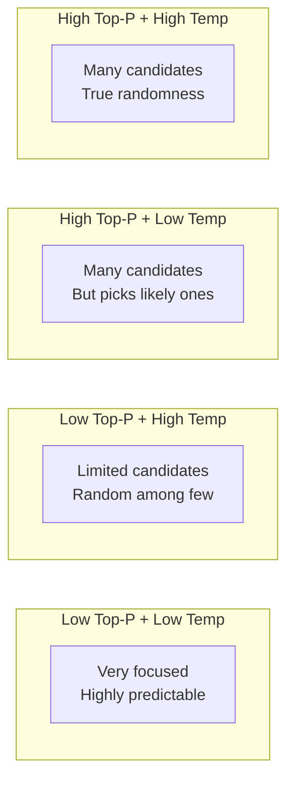
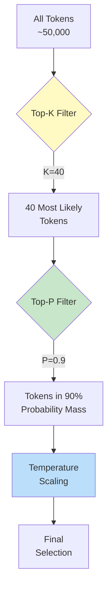
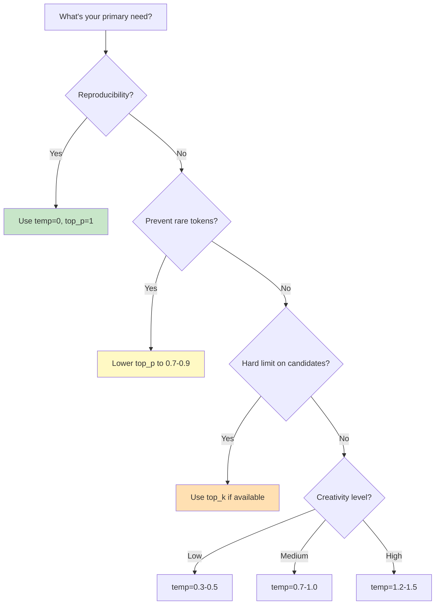

# Top-P and Top-K Parameters

## Introduction

While temperature controls the *sharpness* of the probability distribution, Top-P (nucleus sampling) and Top-K control *which tokens are eligible* for selection in the first place. These parameters act as filters that limit the candidate pool before temperature-adjusted random sampling occurs.

Understanding how these parameters interact—and when to use which—gives you fine-grained control over output behavior that temperature alone cannot provide.

### What We'll Cover

- Nucleus sampling (Top-P): Probability mass filtering
- Top-K sampling: Hard candidate count limits
- The filtering pipeline: How parameters combine
- Provider-specific implementations and defaults
- When to use Top-P vs. Top-K vs. temperature

### Prerequisites

- Temperature effects (Lesson 01)
- Basic probability concepts
- Familiarity with LLM API parameters

---

## The Sampling Pipeline

Token selection isn't a single step—it's a pipeline of filters. Understanding the order is critical:



> **Important:** Top-K is applied *before* Top-P. This matters because limiting to K candidates first changes which tokens are considered for the probability mass calculation.

---

## Nucleus Sampling (Top-P)

Top-P, also known as **nucleus sampling**, filters tokens based on cumulative probability. It keeps the smallest set of tokens whose combined probability exceeds a threshold P.

### How Top-P Works

1. Sort tokens by probability (highest first)
2. Calculate cumulative probability as you go down the list
3. Stop when cumulative probability reaches P
4. Only tokens in this "nucleus" are candidates for selection

### Visual Example

For the prompt "The weather is..." with token probabilities:

| Token | Probability | Cumulative | In Nucleus (P=0.9)? |
|-------|-------------|------------|---------------------|
| sunny | 0.35 | 0.35 | ✅ Yes |
| cloudy | 0.25 | 0.60 | ✅ Yes |
| nice | 0.15 | 0.75 | ✅ Yes |
| warm | 0.10 | 0.85 | ✅ Yes |
| cold | 0.06 | 0.91 | ✅ Yes (crosses threshold) |
| rainy | 0.04 | 0.95 | ❌ No |
| terrible | 0.02 | 0.97 | ❌ No |
| apocalyptic | 0.01 | 0.98 | ❌ No |
| ... | ... | ... | ❌ No |

With Top-P=0.9, only "sunny", "cloudy", "nice", "warm", and "cold" are candidates.

### Top-P Values and Effects

| Top-P Value | Effect | Use Case |
|-------------|--------|----------|
| **0.1** | Only most likely token(s) | Near-deterministic, like temp=0 |
| **0.5** | Top 50% probability mass | Conservative, focused |
| **0.7** | Top 70% probability mass | Moderately focused |
| **0.9** | Top 90% probability mass | Balanced (common default) |
| **0.95** | Top 95% probability mass | Slight creativity boost |
| **1.0** | All tokens eligible | Temperature has full control |

### Top-P Code Example

```python
from openai import OpenAI

client = OpenAI()

def compare_top_p(prompt: str, top_p_values: list[float]):
    """Compare outputs at different top_p settings."""
    
    print(f"Prompt: {prompt}\n")
    
    for top_p in top_p_values:
        response = client.responses.create(
            model="gpt-4.1",
            temperature=1.0,  # Keep temperature constant
            top_p=top_p,
            input=prompt
        )
        print(f"top_p={top_p}: {response.output_text[:100]}...")

compare_top_p(
    "Complete this sentence creatively: The old lighthouse keeper...",
    [0.3, 0.7, 0.95]
)
```

**Sample Output:**
```
top_p=0.3: The old lighthouse keeper watched the ships pass by every evening...
top_p=0.7: The old lighthouse keeper had a secret collection of messages in bottles...
top_p=0.95: The old lighthouse keeper taught origami to the seagulls who visited...
```

---

## Top-K Sampling

Top-K is a simpler filter: it keeps exactly the K most probable tokens, regardless of how much probability mass they represent.

### How Top-K Works

1. Sort tokens by probability (highest first)
2. Keep only the top K tokens
3. Discard all others
4. Renormalize probabilities of remaining tokens

### Visual Example

For the same "The weather is..." prompt with K=3:

| Token | Probability | Rank | In Top-K (K=3)? |
|-------|-------------|------|-----------------|
| sunny | 0.35 | 1 | ✅ Yes |
| cloudy | 0.25 | 2 | ✅ Yes |
| nice | 0.15 | 3 | ✅ Yes |
| warm | 0.10 | 4 | ❌ No |
| cold | 0.06 | 5 | ❌ No |
| ... | ... | ... | ❌ No |

After filtering and renormalizing: sunny (47%), cloudy (33%), nice (20%).

### Top-K Values and Effects

| Top-K Value | Effect | Use Case |
|-------------|--------|----------|
| **1** | Only most likely token | Greedy decoding, like temp=0 |
| **3-5** | Very focused | High-precision tasks |
| **10-20** | Moderately focused | Balanced control |
| **40** | Typical default | General purpose |
| **100+** | Loose filter | Creative tasks |

### Top-K Code Example (Google Gemini)

OpenAI doesn't support Top-K, but Google Gemini does:

```python
from google import genai
from google.genai import types

client = genai.Client()

def compare_top_k(prompt: str, top_k_values: list[int]):
    """Compare outputs at different top_k settings with Gemini."""
    
    print(f"Prompt: {prompt}\n")
    
    for top_k in top_k_values:
        response = client.models.generate_content(
            model="gemini-2.0-flash",  # Use Gemini 2 for top_k flexibility
            contents=prompt,
            config=types.GenerateContentConfig(
                temperature=1.0,
                top_k=top_k
            )
        )
        print(f"top_k={top_k}: {response.text[:100]}...")

compare_top_k(
    "Suggest an unusual pizza topping:",
    [3, 20, 100]
)
```

**Sample Output:**
```
top_k=3: Pepperoni
top_k=20: Pineapple with jalapeños
top_k=100: Fermented black garlic with honey drizzle
```

---

## Provider Support Matrix

Not all providers support all parameters:

| Provider | Temperature | Top-P | Top-K | Notes |
|----------|-------------|-------|-------|-------|
| **OpenAI** | ✅ 0-2.0 | ✅ 0-1.0 | ❌ No | "We recommend altering temperature OR top_p, not both" |
| **Anthropic** | ✅ 0-1.0 | ✅ 0-1.0 | ✅ 0-500 | Full parameter support |
| **Gemini 2** | ✅ 0-2.0 | ✅ 0-1.0 | ✅ 1-40 | Full parameter support |
| **Gemini 3** | ⚠️ Fixed 1.0 | ✅ 0-1.0 | ✅ 1-40 | Temperature must be 1.0 |

### Default Values by Provider

| Provider | Default Temp | Default Top-P | Default Top-K |
|----------|--------------|---------------|---------------|
| **OpenAI** | 1.0 | 1.0 | N/A |
| **Anthropic** | 1.0 | 0.999 | N/A |
| **Gemini** | Varies* | 0.95 | 64 |

*Gemini 3 defaults to 1.0 with strong recommendation not to change.

---

## Parameter Interactions

### Temperature + Top-P

When both are set, they combine their effects:



### Interaction Matrix

| Temperature | Top-P | Combined Effect |
|-------------|-------|-----------------|
| Low (0.2) | Low (0.5) | Very deterministic, narrow focus |
| Low (0.2) | High (0.95) | Picks from many, but conservatively |
| High (1.5) | Low (0.5) | Random picks among limited options |
| High (1.5) | High (0.95) | Maximum creativity and variation |

### OpenAI's Recommendation

From OpenAI's documentation:

> "We generally recommend altering this or `top_p` but not both."

This is because:
1. Both parameters serve similar purposes (controlling diversity)
2. Combined effects can be unpredictable
3. Simpler configurations are easier to debug

### Practical Approach

```python
from openai import OpenAI

client = OpenAI()

# APPROACH 1: Use temperature, leave top_p at default
def using_temperature(creativity_level: str) -> dict:
    """Control creativity via temperature only."""
    temp_map = {"low": 0.2, "medium": 0.7, "high": 1.3}
    return {
        "temperature": temp_map.get(creativity_level, 0.7),
        "top_p": 1.0  # Default, no filtering
    }

# APPROACH 2: Use top_p, leave temperature at default
def using_top_p(focus_level: str) -> dict:
    """Control focus via top_p only."""
    top_p_map = {"narrow": 0.5, "balanced": 0.8, "wide": 0.95}
    return {
        "temperature": 1.0,  # Default
        "top_p": top_p_map.get(focus_level, 0.8)
    }

# Example usage
params = using_temperature("high")
response = client.responses.create(
    model="gpt-4.1",
    **params,
    input="Write a creative opening line for a mystery novel."
)
```

---

## Top-P + Top-K Combined (Google/Anthropic)

When both Top-P and Top-K are available, they work together:



### Google Gemini Example

```python
from google import genai
from google.genai import types

client = genai.Client()

# Combining Top-K and Top-P with Gemini 2
response = client.models.generate_content(
    model="gemini-2.0-flash",
    contents="Describe an alien landscape.",
    config=types.GenerateContentConfig(
        temperature=0.9,
        top_k=30,    # Consider top 30 tokens first
        top_p=0.85   # Then filter to 85% probability mass
    )
)

print(response.text)
```

### Anthropic Claude Example

```python
import anthropic

client = anthropic.Anthropic()

# Claude supports all three parameters
response = client.messages.create(
    model="claude-sonnet-4-5-20250929",
    max_tokens=500,
    temperature=0.8,
    top_p=0.9,
    top_k=100,  # Claude allows up to 500
    messages=[
        {
            "role": "user",
            "content": "Invent a new musical instrument and describe how it works."
        }
    ]
)

print(response.content[0].text)
```

---

## When to Use Each Parameter

### Use Temperature When...

| Scenario | Recommended Temperature |
|----------|-------------------------|
| Need deterministic output | 0.0 |
| Precise tasks (code, extraction) | 0.0-0.3 |
| General purpose tasks | 0.7-1.0 |
| Creative writing | 1.0-1.4 |
| Brainstorming / ideation | 1.2-1.6 |

### Use Top-P When...

| Scenario | Recommended Top-P |
|----------|-------------------|
| Want controlled diversity | 0.7-0.9 |
| Prevent rare word usage | 0.5-0.8 |
| Balance creativity and safety | 0.85-0.95 |
| Maximum diversity needed | 0.95-1.0 |

### Use Top-K When...

| Scenario | Recommended Top-K |
|----------|-------------------|
| Very conservative output | 3-10 |
| Prevent outlier tokens | 20-40 |
| General purpose | 40-64 |
| Maximum creativity | 100+ |

### Decision Tree



---

## Best Practices

### DO ✅

| Practice | Rationale |
|----------|-----------|
| Start with defaults | Understand baseline before tuning |
| Change one parameter at a time | Isolate effects for debugging |
| Use temperature OR top_p, not both (OpenAI) | Avoid unpredictable interactions |
| Test extensively before production | Sampling has inherent variance |
| Document your parameter choices | Future debugging and handoffs |

### DON'T ❌

| Anti-Pattern | Problem |
|--------------|---------|
| Setting top_p=0 | No tokens pass filter, causes errors |
| Very high temp + low top_p | Fighting constraints |
| Ignoring provider constraints | Gemini 3 temp=1.0 requirement |
| Changing parameters without testing | Unexpected quality changes |
| Using extreme values in production | Unpredictable edge cases |

---

## Hands-on Exercise

### Your Task

Build a `SamplingConfig` class that provides appropriate sampling parameters for different use cases, respecting provider-specific constraints.

### Requirements

1. Define sampling presets: `DETERMINISTIC`, `CONSERVATIVE`, `BALANCED`, `CREATIVE`, `EXPERIMENTAL`
2. Handle provider-specific constraints (OpenAI no top_k, Gemini 3 temp=1.0)
3. Return only the parameters that the provider supports
4. Validate that parameters are within valid ranges

### Expected Usage

```python
config = SamplingConfig(provider="openai", preset="CREATIVE")
params = config.get_params()
# Returns: {"temperature": 1.2, "top_p": 0.95}

config = SamplingConfig(provider="gemini-3", preset="DETERMINISTIC")
params = config.get_params()
# Returns: {"temperature": 1.0, "top_p": 0.5}  # temp forced to 1.0
```

<details>
<summary>💡 Hints (click to expand)</summary>

- Use an Enum for presets
- Store preset definitions as dictionaries with all possible parameters
- Create provider-specific filtering logic
- Add validation methods for parameter ranges
- Consider using dataclasses for clean configuration

</details>

<details>
<summary>✅ Solution (click to expand)</summary>

```python
from enum import Enum
from dataclasses import dataclass
from typing import Literal, Optional

class SamplingPreset(Enum):
    DETERMINISTIC = "deterministic"
    CONSERVATIVE = "conservative"
    BALANCED = "balanced"
    CREATIVE = "creative"
    EXPERIMENTAL = "experimental"

# Full preset definitions with all possible parameters
PRESET_CONFIGS = {
    SamplingPreset.DETERMINISTIC: {
        "temperature": 0.0,
        "top_p": 1.0,
        "top_k": None  # Not needed at temp=0
    },
    SamplingPreset.CONSERVATIVE: {
        "temperature": 0.3,
        "top_p": 0.7,
        "top_k": 20
    },
    SamplingPreset.BALANCED: {
        "temperature": 0.8,
        "top_p": 0.9,
        "top_k": 40
    },
    SamplingPreset.CREATIVE: {
        "temperature": 1.2,
        "top_p": 0.95,
        "top_k": 80
    },
    SamplingPreset.EXPERIMENTAL: {
        "temperature": 1.6,
        "top_p": 0.99,
        "top_k": 200
    }
}

ProviderType = Literal["openai", "claude", "gemini-2", "gemini-3"]

@dataclass
class ProviderConstraints:
    """Defines constraints for each provider."""
    supports_top_k: bool
    temp_range: tuple[float, float]
    top_p_range: tuple[float, float]
    top_k_range: Optional[tuple[int, int]]
    temp_fixed: Optional[float] = None  # For Gemini 3

PROVIDER_CONSTRAINTS = {
    "openai": ProviderConstraints(
        supports_top_k=False,
        temp_range=(0.0, 2.0),
        top_p_range=(0.0, 1.0),
        top_k_range=None
    ),
    "claude": ProviderConstraints(
        supports_top_k=True,
        temp_range=(0.0, 1.0),
        top_p_range=(0.0, 1.0),
        top_k_range=(0, 500)
    ),
    "gemini-2": ProviderConstraints(
        supports_top_k=True,
        temp_range=(0.0, 2.0),
        top_p_range=(0.0, 1.0),
        top_k_range=(1, 64)
    ),
    "gemini-3": ProviderConstraints(
        supports_top_k=True,
        temp_range=(1.0, 1.0),  # Fixed
        top_p_range=(0.0, 1.0),
        top_k_range=(1, 64),
        temp_fixed=1.0
    )
}

class SamplingConfig:
    """Configures sampling parameters with provider-specific constraints."""
    
    def __init__(
        self, 
        provider: ProviderType,
        preset: SamplingPreset | str = SamplingPreset.BALANCED
    ):
        self.provider = provider
        self.preset = (
            preset if isinstance(preset, SamplingPreset) 
            else SamplingPreset(preset.lower())
        )
        self.constraints = PROVIDER_CONSTRAINTS[provider]
    
    def _clamp(self, value: float, min_val: float, max_val: float) -> float:
        """Clamp value to range."""
        return max(min_val, min(max_val, value))
    
    def get_params(self) -> dict:
        """Get provider-appropriate sampling parameters."""
        base_config = PRESET_CONFIGS[self.preset].copy()
        result = {}
        
        # Handle temperature
        if self.constraints.temp_fixed is not None:
            result["temperature"] = self.constraints.temp_fixed
        else:
            temp = base_config["temperature"]
            result["temperature"] = self._clamp(
                temp, 
                self.constraints.temp_range[0],
                self.constraints.temp_range[1]
            )
        
        # Handle top_p
        top_p = base_config["top_p"]
        result["top_p"] = self._clamp(
            top_p,
            self.constraints.top_p_range[0],
            self.constraints.top_p_range[1]
        )
        
        # Handle top_k (only if supported)
        if self.constraints.supports_top_k and base_config["top_k"] is not None:
            top_k = base_config["top_k"]
            result["top_k"] = int(self._clamp(
                top_k,
                self.constraints.top_k_range[0],
                self.constraints.top_k_range[1]
            ))
        
        return result
    
    def __repr__(self) -> str:
        params = self.get_params()
        return f"SamplingConfig(provider={self.provider}, preset={self.preset.value}, params={params})"


# Test the class
def test_sampling_config():
    """Test SamplingConfig across providers and presets."""
    
    test_cases = [
        ("openai", "creative"),
        ("openai", "deterministic"),
        ("claude", "experimental"),
        ("gemini-2", "balanced"),
        ("gemini-3", "creative"),  # Should force temp=1.0
        ("gemini-3", "deterministic"),  # Should force temp=1.0
    ]
    
    for provider, preset in test_cases:
        config = SamplingConfig(provider=provider, preset=preset)
        params = config.get_params()
        print(f"{provider} + {preset}:")
        print(f"  {params}")
        
        # Validate Gemini 3 constraint
        if provider == "gemini-3":
            assert params["temperature"] == 1.0, "Gemini 3 temp must be 1.0"
        
        # Validate OpenAI no top_k
        if provider == "openai":
            assert "top_k" not in params, "OpenAI doesn't support top_k"
    
    print("\n✅ All tests passed!")

test_sampling_config()
```

**Output:**
```
openai + creative:
  {'temperature': 1.2, 'top_p': 0.95}
openai + deterministic:
  {'temperature': 0.0, 'top_p': 1.0}
claude + experimental:
  {'temperature': 1.0, 'top_p': 0.99, 'top_k': 200}
gemini-2 + balanced:
  {'temperature': 0.8, 'top_p': 0.9, 'top_k': 40}
gemini-3 + creative:
  {'temperature': 1.0, 'top_p': 0.95, 'top_k': 64}
gemini-3 + deterministic:
  {'temperature': 1.0, 'top_p': 1.0}

✅ All tests passed!
```

</details>

### Bonus Challenges

- [ ] Add support for custom parameter overrides
- [ ] Implement a `describe()` method that explains what the configuration will do
- [ ] Add logging warnings when constraints force parameter changes

---

## Summary

✅ **Top-P (nucleus sampling)** filters by cumulative probability—keeps tokens until P% is reached  
✅ **Top-K** filters by rank—keeps exactly K most probable tokens  
✅ **Pipeline order:** Top-K → Top-P → Temperature → Selection  
✅ **OpenAI recommends** using temperature OR top_p, not both  
✅ **Provider support varies**—OpenAI lacks top_k, Gemini 3 fixes temperature  
✅ **Combined effects** require careful testing to understand  

**Next:** [When to Adjust Sampling](./04-when-to-adjust-sampling.md) - Task-specific recommendations and decision frameworks

---

## Further Reading

- [The Curious Case of Neural Text Degeneration](https://arxiv.org/abs/1904.09751) - Original nucleus sampling paper
- [OpenAI API Reference](https://platform.openai.com/docs/api-reference/responses/create) - Temperature and top_p docs
- [Google GenerationConfig](https://ai.google.dev/api/generate-content#generationconfig) - Full parameter reference

<!-- 
Sources Consulted:
- OpenAI API Reference: https://platform.openai.com/docs/api-reference/responses/create
- Google Generate Content API: https://ai.google.dev/api/generate-content
- Google Prompting Strategies: https://ai.google.dev/gemini-api/docs/prompting-strategies
- Anthropic Claude API: https://platform.claude.com/docs/en/api/messages/create
-->
