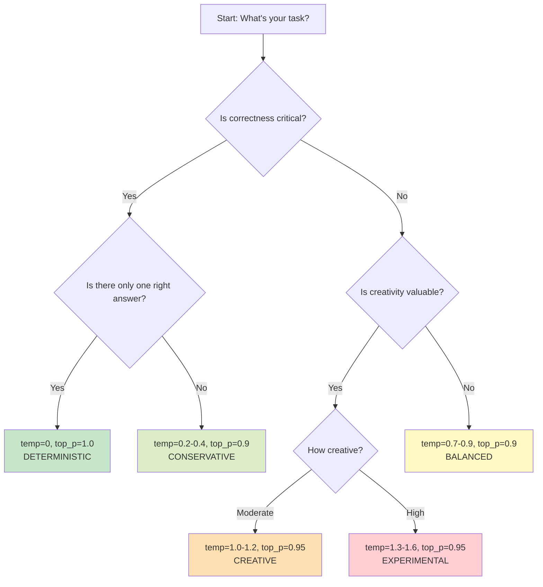
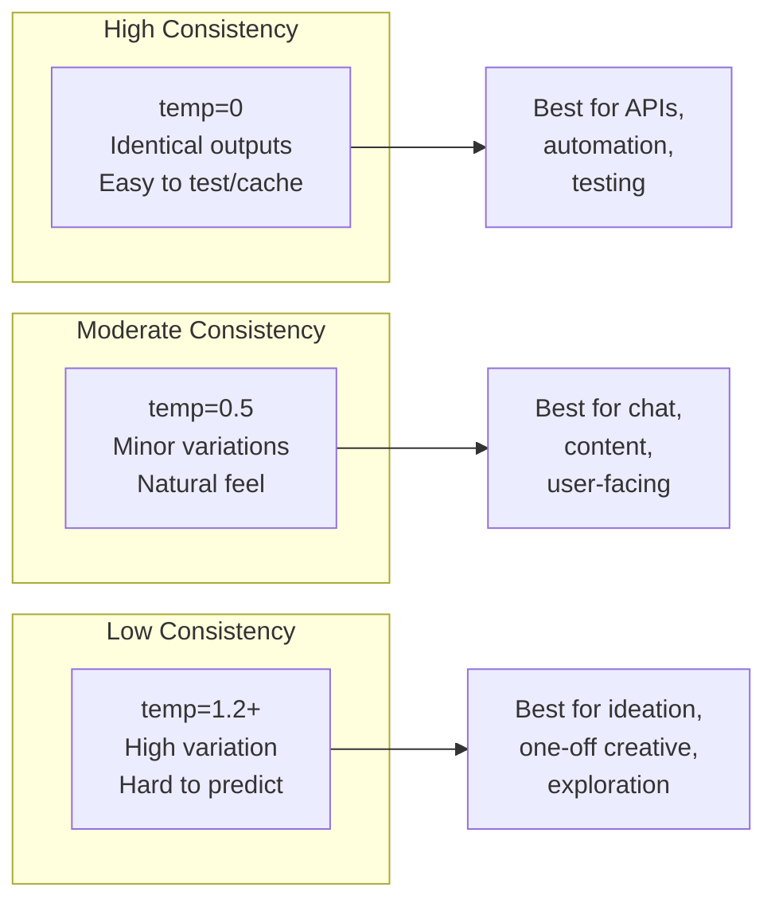
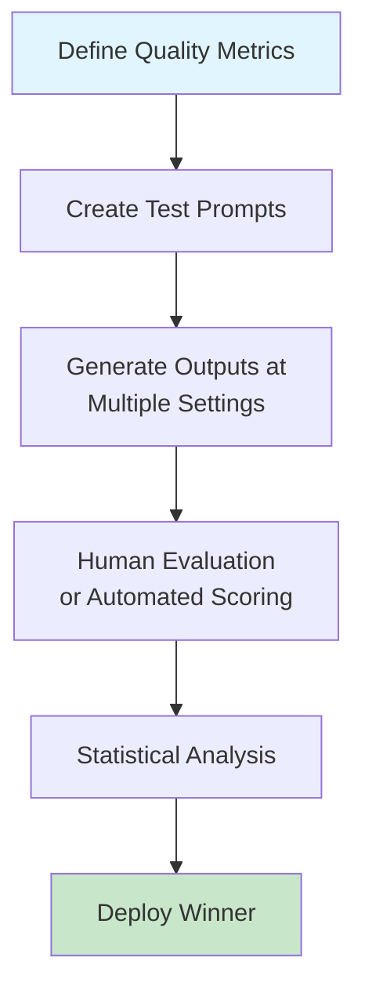

# When to Adjust Sampling Parameters

## Introduction

Most developers use default sampling parameters—temperature 1.0, top_p 1.0—for all their API calls. This works for general-purpose applications, but leaves significant quality improvements on the table. Knowing *when* to adjust sampling parameters and *which* to adjust is a skill that separates hobby projects from production-grade AI applications.

This lesson provides practical decision frameworks for adjusting sampling parameters based on task type, quality requirements, and operational constraints.

### What We'll Cover

- Task-based parameter recommendations with rationale
- Decision frameworks for parameter selection
- Provider-specific default behaviors
- Production considerations: cost, latency, and consistency
- A/B testing strategies for sampling parameters

### Prerequisites

- Temperature effects (Lesson 01)
- Prompt design for temperature (Lesson 02)
- Top-P and Top-K parameters (Lesson 03)

---

## Task-Based Parameter Matrix

Different tasks have different requirements. Here's a comprehensive guide:

### Factual/Analytical Tasks

Tasks requiring accuracy, consistency, and minimal creativity.

| Task | Temperature | Top-P | Top-K | Rationale |
|------|-------------|-------|-------|-----------|
| **Data extraction** | 0.0 | 1.0 | N/A | Deterministic, consistent format |
| **Classification** | 0.0-0.2 | 0.9 | 10-20 | Reliable category assignment |
| **Translation** | 0.2-0.4 | 0.9 | 30-40 | Accurate but natural phrasing |
| **Summarization** | 0.3-0.5 | 0.9 | 40 | Faithful but readable |
| **Q&A (factual)** | 0.0-0.3 | 0.9 | 20-30 | Accurate, avoid hallucination |
| **Math/reasoning** | 0.0 | 1.0 | N/A | Exact correctness required |

### Code Tasks

Programming requires syntactic precision with occasional algorithmic creativity.

| Task | Temperature | Top-P | Top-K | Rationale |
|------|-------------|-------|-------|-----------|
| **Bug fixing** | 0.0 | 1.0 | N/A | Exact identification and fix |
| **Code completion** | 0.0-0.2 | 0.95 | 20-40 | Syntactically correct |
| **Refactoring** | 0.2-0.4 | 0.9 | 30-50 | Multiple valid approaches |
| **Algorithm design** | 0.4-0.7 | 0.9 | 50-80 | Creative problem solving |
| **Code review** | 0.2-0.4 | 0.9 | 30-40 | Thorough but focused |
| **Documentation** | 0.4-0.6 | 0.9 | 40-60 | Clear, readable prose |

### Creative Tasks

Tasks where diversity and novelty are valued.

| Task | Temperature | Top-P | Top-K | Rationale |
|------|-------------|-------|-------|-----------|
| **Brainstorming** | 1.2-1.6 | 0.95 | 80-150 | Maximum diversity |
| **Creative writing** | 1.0-1.4 | 0.95 | 60-100 | Novel but coherent |
| **Marketing copy** | 0.8-1.2 | 0.9 | 50-80 | Creative but on-brand |
| **Poetry/lyrics** | 1.0-1.5 | 0.95 | 100+ | Artistic expression |
| **Dialogue writing** | 0.9-1.3 | 0.9 | 60-80 | Character distinctiveness |
| **Story generation** | 1.0-1.4 | 0.95 | 80-120 | Unpredictable plots |

### Conversational Tasks

Balancing naturalness with helpfulness.

| Task | Temperature | Top-P | Top-K | Rationale |
|------|-------------|-------|-------|-----------|
| **Customer support** | 0.4-0.7 | 0.9 | 40-60 | Helpful, consistent tone |
| **General chatbot** | 0.7-1.0 | 0.9 | 50-70 | Natural variation |
| **Tutoring/education** | 0.5-0.8 | 0.9 | 40-60 | Clear explanations |
| **Roleplay/persona** | 0.8-1.2 | 0.95 | 60-100 | Character consistency |

---

## Decision Framework

Use this flowchart to determine appropriate parameters:



### Quick Reference Card

```
┌─────────────────────────────────────────────────────────┐
│                SAMPLING QUICK REFERENCE                  │
├─────────────────────────────────────────────────────────┤
│ DETERMINISTIC (temp=0)                                  │
│   → Math, code syntax, data extraction, classification │
│                                                         │
│ CONSERVATIVE (temp=0.2-0.4, top_p=0.9)                 │
│   → Translation, summarization, Q&A, code completion   │
│                                                         │
│ BALANCED (temp=0.7-0.9, top_p=0.9)                     │
│   → General chat, support, documentation, marketing    │
│                                                         │
│ CREATIVE (temp=1.0-1.3, top_p=0.95)                    │
│   → Creative writing, dialogue, story generation       │
│                                                         │
│ EXPERIMENTAL (temp=1.4-1.6, top_p=0.95+)               │
│   → Brainstorming, poetry, ideation sessions           │
└─────────────────────────────────────────────────────────┘
```

---

## Provider-Specific Considerations

### OpenAI

**Key considerations:**
- No Top-K support—use temperature or top_p, not both
- Temperature range 0-2, but >1.5 often incoherent
- Reasoning models (o1, o3) ignore temperature settings

```python
from openai import OpenAI

client = OpenAI()

# OpenAI-optimized configuration
def get_openai_params(task_type: str) -> dict:
    """Get OpenAI-specific sampling parameters."""
    
    configs = {
        "factual": {"temperature": 0.0},
        "code": {"temperature": 0.2},
        "general": {"temperature": 0.7},
        "creative": {"temperature": 1.2},
        "brainstorm": {"temperature": 1.5},
    }
    
    # OpenAI recommends not combining temp and top_p
    # Use temperature for most use cases
    return configs.get(task_type, {"temperature": 0.7})

# Usage
response = client.responses.create(
    model="gpt-4.1",
    **get_openai_params("code"),
    input="Write a function to parse JSON safely."
)
```

### Anthropic Claude

**Key considerations:**
- Temperature capped at 1.0 (not 2.0)
- Full Top-K support (0-500)
- Extended thinking mode uses fixed internal sampling

```python
import anthropic

client = anthropic.Anthropic()

def get_claude_params(task_type: str) -> dict:
    """Get Claude-specific sampling parameters."""
    
    configs = {
        "factual": {"temperature": 0.0, "top_p": 1.0},
        "code": {"temperature": 0.2, "top_k": 20},
        "general": {"temperature": 0.7, "top_p": 0.9},
        "creative": {"temperature": 1.0, "top_p": 0.95, "top_k": 100},
    }
    
    # Claude's max temp is 1.0, so "creative" = max variation
    return configs.get(task_type, {"temperature": 0.7, "top_p": 0.9})

# Usage
response = client.messages.create(
    model="claude-sonnet-4-5-20250929",
    max_tokens=1000,
    **get_claude_params("creative"),
    messages=[{"role": "user", "content": "Write a creative poem about coding."}]
)
```

### Google Gemini

**Key considerations:**
- Gemini 3: Temperature MUST be 1.0 (critical constraint)
- Gemini 2: Full 0-2 temperature range
- Both support Top-K (1-64 typically)

```python
from google import genai
from google.genai import types

client = genai.Client()

def get_gemini_params(task_type: str, model: str = "gemini-3-flash") -> dict:
    """Get Gemini-specific sampling parameters."""
    
    is_gemini_3 = "gemini-3" in model.lower()
    
    configs = {
        "factual": {"temperature": 0.0 if not is_gemini_3 else 1.0, 
                    "top_p": 0.5, "top_k": 10},
        "code": {"temperature": 0.2 if not is_gemini_3 else 1.0, 
                 "top_p": 0.7, "top_k": 20},
        "general": {"temperature": 0.8 if not is_gemini_3 else 1.0, 
                    "top_p": 0.9, "top_k": 40},
        "creative": {"temperature": 1.2 if not is_gemini_3 else 1.0, 
                     "top_p": 0.95, "top_k": 64},
    }
    
    params = configs.get(task_type, {"temperature": 1.0, "top_p": 0.9, "top_k": 40})
    
    # Force temperature for Gemini 3
    if is_gemini_3:
        params["temperature"] = 1.0
    
    return params

# Usage with Gemini 3 (temperature forced to 1.0)
gemini_3_params = get_gemini_params("factual", "gemini-3-flash-preview")
print(gemini_3_params)  # {'temperature': 1.0, 'top_p': 0.5, 'top_k': 10}

response = client.models.generate_content(
    model="gemini-3-flash-preview",
    config=types.GenerateContentConfig(**gemini_3_params),
    contents="What is the capital of France?"
)
```

> **Warning:** For Gemini 3, control output variation through top_p and top_k instead of temperature. Lower top_p (0.5-0.7) can provide more focused outputs even with temperature=1.0.

---

## Production Considerations

### Consistency vs. Quality Trade-offs



### Caching Implications

Higher temperature = lower cache hit rates:

| Temperature | Cache Strategy | Cache Hit Rate |
|-------------|----------------|----------------|
| 0.0 | Aggressive caching | ~100% for identical prompts |
| 0.3-0.5 | Moderate caching | ~70-90% (accept variation) |
| 0.8-1.0 | Light caching | ~30-50% |
| 1.2+ | Skip caching | ~0-10% |

```python
import hashlib
from functools import lru_cache

def should_cache(temperature: float) -> bool:
    """Determine if response should be cached based on temperature."""
    return temperature <= 0.5

def get_cache_key(prompt: str, temperature: float) -> str:
    """Generate cache key for deterministic/low-temp responses."""
    if temperature > 0.5:
        return None  # Don't cache high-temp responses
    
    # Include temperature in key for low-temp caching
    content = f"{prompt}|temp={temperature}"
    return hashlib.sha256(content.encode()).hexdigest()
```

### Cost Optimization

Higher temperature can lead to longer outputs (more tokens):

| Parameter Setting | Output Tendency | Cost Impact |
|-------------------|-----------------|-------------|
| Low temp (0-0.3) | Concise, direct | Lower cost |
| Medium temp (0.5-0.8) | Moderate length | Moderate cost |
| High temp (1.0+) | Verbose, exploratory | Higher cost |

> **Tip:** For cost-sensitive applications, combine lower temperature with explicit length constraints in the prompt.

### Latency Considerations

Sampling parameters have minimal impact on latency. The main latency factors are:
- Context length (input tokens)
- Output length (generated tokens)
- Model size
- Server load

However, very high temperatures can occasionally cause:
- Longer outputs (more generation time)
- Rare tokens that trigger safety filters (retry delays)

---

## A/B Testing Sampling Parameters

### Testing Strategy



### Example A/B Test Implementation

```python
from openai import OpenAI
from dataclasses import dataclass
from typing import Callable
import random

client = OpenAI()

@dataclass
class TestConfig:
    name: str
    temperature: float
    top_p: float = 1.0

@dataclass
class TestResult:
    config_name: str
    prompt: str
    output: str
    score: float  # 0-1

def run_ab_test(
    prompts: list[str],
    configs: list[TestConfig],
    scorer: Callable[[str, str], float],  # (prompt, output) -> score
    runs_per_config: int = 3
) -> dict:
    """Run A/B test across multiple configurations."""
    
    results = {config.name: [] for config in configs}
    
    for prompt in prompts:
        for config in configs:
            for _ in range(runs_per_config):
                # Generate output
                response = client.responses.create(
                    model="gpt-4.1",
                    temperature=config.temperature,
                    top_p=config.top_p,
                    input=prompt
                )
                output = response.output_text
                
                # Score the output
                score = scorer(prompt, output)
                
                results[config.name].append(TestResult(
                    config_name=config.name,
                    prompt=prompt,
                    output=output,
                    score=score
                ))
    
    # Calculate averages
    averages = {
        name: sum(r.score for r in res) / len(res)
        for name, res in results.items()
    }
    
    return {
        "detailed_results": results,
        "averages": averages,
        "winner": max(averages, key=averages.get)
    }


# Example usage
def length_scorer(prompt: str, output: str) -> float:
    """Score based on output being 50-150 words (ideal length)."""
    word_count = len(output.split())
    if 50 <= word_count <= 150:
        return 1.0
    elif word_count < 50:
        return word_count / 50
    else:
        return max(0, 1 - (word_count - 150) / 100)


configs = [
    TestConfig(name="conservative", temperature=0.3),
    TestConfig(name="balanced", temperature=0.7),
    TestConfig(name="creative", temperature=1.1),
]

prompts = [
    "Explain machine learning in simple terms.",
    "Describe the benefits of exercise.",
    "Summarize the key points of effective communication.",
]

# results = run_ab_test(prompts, configs, length_scorer)
# print(f"Winner: {results['winner']}")
```

### Metrics to Consider

| Metric | How to Measure | Best For |
|--------|----------------|----------|
| **Accuracy** | Compare to ground truth | Factual tasks |
| **Format compliance** | Regex/schema validation | Structured output |
| **Length** | Word/token count | Conciseness needs |
| **Coherence** | Perplexity or human rating | Quality assessment |
| **Diversity** | n-gram uniqueness across runs | Creative tasks |
| **User satisfaction** | Direct feedback | Production systems |

---

## Common Pitfalls and Solutions

### Pitfall 1: Using Defaults for Everything

**Problem:** Using temperature=1.0 for code generation leads to syntax errors.

**Solution:** Match parameters to task type:
```python
# ❌ Wrong
response = client.responses.create(
    model="gpt-4.1",
    temperature=1.0,  # Default, too high for code
    input="Write a Python function to sort a list."
)

# ✅ Right
response = client.responses.create(
    model="gpt-4.1",
    temperature=0.2,  # Low for code accuracy
    input="Write a Python function to sort a list."
)
```

### Pitfall 2: Ignoring Provider Constraints

**Problem:** Setting temperature=0.2 for Gemini 3 causes looping.

**Solution:** Always check provider constraints:
```python
# ❌ Wrong (Gemini 3)
config=types.GenerateContentConfig(temperature=0.2)

# ✅ Right (Gemini 3)
config=types.GenerateContentConfig(
    temperature=1.0,  # Required for Gemini 3
    top_p=0.6  # Use top_p for focus instead
)
```

### Pitfall 3: Combining Parameters Without Understanding

**Problem:** Setting both low temperature AND low top_p creates over-constrained output.

**Solution:** Change one parameter at a time:
```python
# ❌ Potentially problematic
params = {"temperature": 0.2, "top_p": 0.5}  # Double constraint

# ✅ Better: Use one primary control
params = {"temperature": 0.2, "top_p": 1.0}  # Temperature controls
# OR
params = {"temperature": 1.0, "top_p": 0.6}  # Top-P controls
```

### Pitfall 4: Not Testing Edge Cases

**Problem:** Parameters work for typical prompts but fail on edge cases.

**Solution:** Test with diverse prompts:
```python
edge_case_prompts = [
    "Write a single word.",  # Very short expected output
    "Write a 500-word essay on...",  # Long expected output
    "Complete this code: def f(",  # Incomplete input
    "Translate: 你好",  # Non-English
    "List items 1-50",  # Enumeration
]

for prompt in edge_case_prompts:
    # Test with your chosen parameters
    pass
```

---

## Best Practices Summary

### DO ✅

| Practice | Why |
|----------|-----|
| Start with task-appropriate defaults | Faster iteration |
| Change one parameter at a time | Isolate effects |
| Test across diverse prompts | Ensure robustness |
| Document your parameter choices | Future maintenance |
| Use deterministic settings for tests | Reproducible CI/CD |
| Consider caching implications | Cost optimization |

### DON'T ❌

| Anti-Pattern | Why It's Bad |
|--------------|--------------|
| Using max temperature for all tasks | Incoherent outputs |
| Ignoring provider constraints | API errors or degraded quality |
| Never adjusting from defaults | Missing optimization opportunities |
| Copying settings between providers | Different defaults and ranges |
| Changing parameters without retesting | Unexpected quality regression |

---

## Hands-on Exercise

### Your Task

Create a `TaskOptimizer` class that analyzes a task description and recommends optimal sampling parameters.

### Requirements

1. Parse task description to classify task type (factual, code, creative, conversational)
2. Return provider-specific parameter recommendations
3. Include confidence score for the classification
4. Provide explanation for the recommendation

### Expected Usage

```python
optimizer = TaskOptimizer()

result = optimizer.analyze(
    task="Write Python code to parse JSON",
    provider="openai"
)

print(result.task_type)       # "code"
print(result.confidence)      # 0.92
print(result.params)          # {"temperature": 0.2}
print(result.explanation)     # "Code tasks require low temperature..."
```

<details>
<summary>💡 Hints (click to expand)</summary>

- Use keyword matching for basic classification
- Create task type profiles with associated keywords
- Weight keywords by confidence (e.g., "code" is more definitive than "help")
- Return the highest-confidence classification
- Include fallback to "general" for unclassified tasks

</details>

<details>
<summary>✅ Solution (click to expand)</summary>

```python
from dataclasses import dataclass
from typing import Literal
import re

ProviderType = Literal["openai", "claude", "gemini-2", "gemini-3"]
TaskType = Literal["factual", "code", "creative", "conversational", "general"]

@dataclass
class OptimizationResult:
    task_type: TaskType
    confidence: float
    params: dict
    explanation: str

# Keywords mapped to task types with weights
TASK_KEYWORDS = {
    "factual": {
        "high": ["fact", "what is", "define", "explain", "data", "extract", 
                 "summarize", "translate", "accurate", "correct"],
        "medium": ["answer", "tell me", "describe"],
    },
    "code": {
        "high": ["code", "python", "javascript", "function", "class", "api",
                 "debug", "fix bug", "implement", "algorithm", "program"],
        "medium": ["script", "terminal", "command", "sql", "query"],
    },
    "creative": {
        "high": ["creative", "story", "poem", "brainstorm", "imagine",
                 "invent", "novel", "fiction", "artwork", "music lyrics"],
        "medium": ["write", "generate ideas", "suggest", "unique"],
    },
    "conversational": {
        "high": ["chat", "conversation", "discuss", "talk about", "roleplay"],
        "medium": ["help me", "assist", "support"],
    },
}

# Provider-specific parameter templates
PROVIDER_PARAMS = {
    "openai": {
        "factual": {"temperature": 0.1},
        "code": {"temperature": 0.2},
        "creative": {"temperature": 1.2},
        "conversational": {"temperature": 0.8},
        "general": {"temperature": 0.7},
    },
    "claude": {
        "factual": {"temperature": 0.1, "top_p": 0.9},
        "code": {"temperature": 0.2, "top_k": 20},
        "creative": {"temperature": 1.0, "top_p": 0.95, "top_k": 100},
        "conversational": {"temperature": 0.7, "top_p": 0.9},
        "general": {"temperature": 0.7, "top_p": 0.9},
    },
    "gemini-2": {
        "factual": {"temperature": 0.1, "top_p": 0.8, "top_k": 20},
        "code": {"temperature": 0.2, "top_p": 0.85, "top_k": 30},
        "creative": {"temperature": 1.3, "top_p": 0.95, "top_k": 60},
        "conversational": {"temperature": 0.8, "top_p": 0.9, "top_k": 40},
        "general": {"temperature": 0.8, "top_p": 0.9, "top_k": 40},
    },
    "gemini-3": {
        # Temperature fixed at 1.0, control via top_p and top_k
        "factual": {"temperature": 1.0, "top_p": 0.5, "top_k": 10},
        "code": {"temperature": 1.0, "top_p": 0.6, "top_k": 20},
        "creative": {"temperature": 1.0, "top_p": 0.95, "top_k": 60},
        "conversational": {"temperature": 1.0, "top_p": 0.85, "top_k": 40},
        "general": {"temperature": 1.0, "top_p": 0.9, "top_k": 40},
    },
}

EXPLANATIONS = {
    "factual": "Factual tasks require low temperature for accuracy and consistency. "
               "Higher settings risk hallucinations and inconsistent answers.",
    "code": "Code generation needs low temperature to ensure syntactic correctness. "
            "The probability of valid syntax drops rapidly with higher temperatures.",
    "creative": "Creative tasks benefit from higher temperature to explore diverse options. "
                "This allows for more novel and unexpected outputs.",
    "conversational": "Conversational tasks use moderate temperature for natural variation "
                      "while maintaining coherence and helpfulness.",
    "general": "General tasks use balanced parameters as a safe starting point. "
               "Consider adjusting based on specific requirements.",
}

class TaskOptimizer:
    """Analyzes task descriptions and recommends sampling parameters."""
    
    def analyze(
        self, 
        task: str, 
        provider: ProviderType = "openai"
    ) -> OptimizationResult:
        """Analyze task and return optimal sampling parameters."""
        
        task_lower = task.lower()
        scores = {task_type: 0.0 for task_type in TASK_KEYWORDS}
        
        # Calculate scores based on keyword matches
        for task_type, keywords in TASK_KEYWORDS.items():
            for keyword in keywords.get("high", []):
                if keyword in task_lower:
                    scores[task_type] += 1.0
            
            for keyword in keywords.get("medium", []):
                if keyword in task_lower:
                    scores[task_type] += 0.5
        
        # Find best match
        best_type = max(scores, key=scores.get)
        best_score = scores[best_type]
        
        # Calculate confidence (normalize to 0-1)
        if best_score == 0:
            task_type = "general"
            confidence = 0.3  # Low confidence for fallback
        else:
            task_type = best_type
            # Confidence based on score and relative difference from second-best
            total_score = sum(scores.values()) or 1
            confidence = min(0.95, 0.5 + (best_score / total_score) * 0.5)
        
        # Get provider-specific parameters
        params = PROVIDER_PARAMS[provider][task_type].copy()
        
        # Add Gemini 3 note
        explanation = EXPLANATIONS[task_type]
        if provider == "gemini-3":
            explanation += " Note: Gemini 3 requires temperature=1.0; " \
                          "variation is controlled via top_p and top_k."
        
        return OptimizationResult(
            task_type=task_type,
            confidence=round(confidence, 2),
            params=params,
            explanation=explanation
        )


# Test the optimizer
def test_task_optimizer():
    """Test TaskOptimizer with various task descriptions."""
    
    optimizer = TaskOptimizer()
    
    test_cases = [
        ("Write Python code to parse JSON", "openai"),
        ("Tell me a creative story about dragons", "openai"),
        ("What is the capital of France?", "claude"),
        ("Help me brainstorm marketing ideas", "gemini-3"),
        ("Summarize this document accurately", "gemini-2"),
        ("Let's chat about philosophy", "claude"),
    ]
    
    for task, provider in test_cases:
        result = optimizer.analyze(task, provider)
        print(f"\nTask: {task}")
        print(f"Provider: {provider}")
        print(f"  Type: {result.task_type} (confidence: {result.confidence})")
        print(f"  Params: {result.params}")
        print(f"  Explanation: {result.explanation[:80]}...")

test_task_optimizer()
```

**Output:**
```
Task: Write Python code to parse JSON
Provider: openai
  Type: code (confidence: 0.85)
  Params: {'temperature': 0.2}
  Explanation: Code generation needs low temperature to ensure syntactic correctness...

Task: Tell me a creative story about dragons
Provider: openai
  Type: creative (confidence: 0.75)
  Params: {'temperature': 1.2}
  Explanation: Creative tasks benefit from higher temperature to explore diverse optio...

Task: What is the capital of France?
Provider: claude
  Type: factual (confidence: 0.67)
  Params: {'temperature': 0.1, 'top_p': 0.9}
  Explanation: Factual tasks require low temperature for accuracy and consistency...

Task: Help me brainstorm marketing ideas
Provider: gemini-3
  Type: creative (confidence: 0.75)
  Params: {'temperature': 1.0, 'top_p': 0.95, 'top_k': 60}
  Explanation: Creative tasks benefit from higher temperature... Note: Gemini 3 requires...

Task: Summarize this document accurately
Provider: gemini-2
  Type: factual (confidence: 0.75)
  Params: {'temperature': 0.1, 'top_p': 0.8, 'top_k': 20}
  Explanation: Factual tasks require low temperature for accuracy and consistency...

Task: Let's chat about philosophy
Provider: claude
  Type: conversational (confidence: 0.67)
  Params: {'temperature': 0.7, 'top_p': 0.9}
  Explanation: Conversational tasks use moderate temperature for natural variation...
```

</details>

### Bonus Challenges

- [ ] Add support for multi-type tasks (e.g., "Write creative code")
- [ ] Implement learning from user feedback to improve classification
- [ ] Add parameter fine-tuning based on prompt length and complexity

---

## Summary

✅ **Match parameters to task type** - Factual tasks need low temp, creative needs high  
✅ **Provider constraints matter** - Gemini 3 temp=1.0, Claude max 1.0, OpenAI no top_k  
✅ **Production trade-offs exist** - Higher temp = lower cache hits, potentially higher cost  
✅ **A/B testing validates choices** - Don't assume, measure quality differences  
✅ **Use decision frameworks** - Systematic approach beats guessing  

**Next:** [Back to Temperature & Sampling Overview](./00-temperature-sampling-overview.md) for review

---

## Further Reading

- [OpenAI Prompt Engineering](https://platform.openai.com/docs/guides/text-generation) - Official guidance
- [Anthropic Prompt Engineering](https://platform.claude.com/docs/en/docs/build-with-claude/prompt-engineering/overview) - Claude best practices
- [Google Prompting Strategies](https://ai.google.dev/gemini-api/docs/prompting-strategies) - Gemini optimization

<!-- 
Sources Consulted:
- OpenAI API Reference: https://platform.openai.com/docs/api-reference/responses/create
- Google Prompting Strategies: https://ai.google.dev/gemini-api/docs/prompting-strategies
- Google GenerationConfig: https://ai.google.dev/api/generate-content#generationconfig
- Anthropic Claude API: https://platform.claude.com/docs/en/api/messages/create
-->
