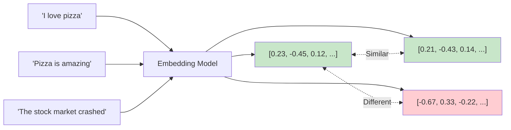
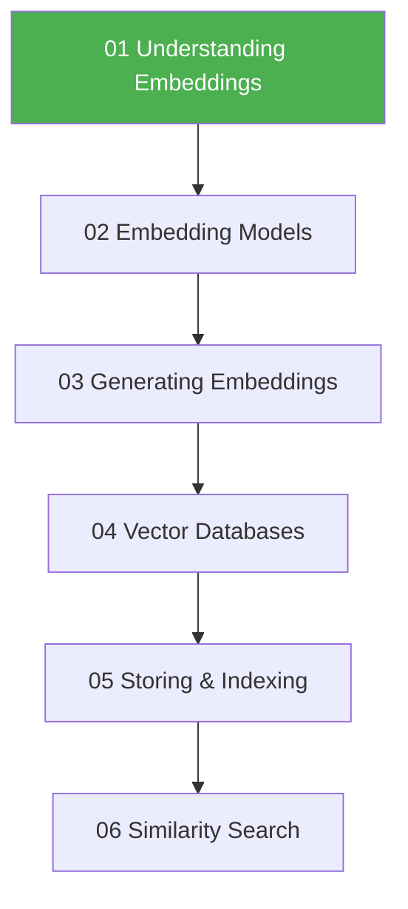

# Understanding Embeddings

## Introduction

Embeddings are the foundation of modern AI search and retrieval systems. They transform human language—words, sentences, documents—into numerical representations that machines can process, compare, and reason about. Without embeddings, there would be no semantic search, no RAG systems, and no way to connect AI to your custom data.

This lesson explores what embeddings are, how they work, and why they're essential for building intelligent applications.

### What We'll Cover

This lesson is divided into the following sub-topics:

| Lesson | Topic | Description |
|--------|-------|-------------|
| [01](./01-what-are-embeddings.md) | What Are Embeddings? | Numerical representations, dense vectors, machine-readable semantics |
| [02](./02-vector-representations-of-meaning.md) | Vector Representations of Meaning | How meaning is encoded, semantic relationships, vector arithmetic |
| [03](./03-dimensionality.md) | Dimensionality | 768, 1536, 3072 dimensions—what they represent and trade-offs |
| [04](./04-semantic-similarity.md) | Semantic Similarity | Beyond keywords, understanding concepts, limitations |
| [05](./05-distance-metrics.md) | Distance Metrics | Cosine similarity, Euclidean distance, dot product |
| [06](./06-visualizing-embeddings.md) | Visualizing Embeddings | t-SNE, UMAP, PCA for understanding embedding spaces |

### Prerequisites

- Basic linear algebra concepts (vectors, matrices)
- Python fundamentals
- Understanding of AI/LLM basics (Unit 3)

---

## Why Embeddings Matter

Embeddings solve a fundamental problem: **computers work with numbers, but humans communicate with language**. Traditional approaches like keyword matching fail when:

- Users search "cheap flights" but the document says "affordable airfare"
- A support ticket mentions "the app crashes" but your FAQ uses "application error"
- Someone asks "how to fix my code" but the answer is about "debugging"

Embeddings bridge this gap by converting text into vectors where **semantically similar content has similar vectors**.



### Real-World Applications

| Application | How Embeddings Help |
|-------------|---------------------|
| **Semantic Search** | Find documents by meaning, not just keywords |
| **RAG Systems** | Retrieve relevant context for LLM responses |
| **Recommendations** | Suggest similar products, articles, or content |
| **Duplicate Detection** | Find semantically identical content |
| **Classification** | Categorize text by comparing to labeled examples |
| **Clustering** | Group related documents automatically |
| **Anomaly Detection** | Identify outliers in text data |

---

## Embedding Model Landscape (2025-2026)

Here's a quick overview of popular embedding models:

| Provider | Model | Dimensions | Context | Key Features |
|----------|-------|------------|---------|--------------|
| **OpenAI** | text-embedding-3-small | 1536 | 8192 | Cost-effective, good quality |
| **OpenAI** | text-embedding-3-large | 3072 | 8192 | Highest quality, variable dimensions |
| **Google** | gemini-embedding-001 | 768-3072 | 2048 | Matryoshka, task types |
| **Cohere** | embed-v4.0 | 256-1536 | 512 | Multimodal, 100+ languages |
| **Voyage** | voyage-3 | 1024 | 32000 | Long context, code |

> **Note:** Anthropic doesn't offer a public embedding model. For Claude-based applications, use OpenAI, Cohere, or Voyage embeddings.

---

## Quick Start Example

Here's a simple example using OpenAI embeddings:

```python
from openai import OpenAI
import numpy as np

client = OpenAI()

def get_embedding(text: str, model: str = "text-embedding-3-small") -> list[float]:
    """Generate an embedding for the given text."""
    response = client.embeddings.create(
        model=model,
        input=text
    )
    return response.data[0].embedding

def cosine_similarity(a: list[float], b: list[float]) -> float:
    """Calculate cosine similarity between two vectors."""
    a, b = np.array(a), np.array(b)
    return np.dot(a, b) / (np.linalg.norm(a) * np.linalg.norm(b))

# Generate embeddings
texts = [
    "I love programming in Python",
    "Python is my favorite programming language",
    "The weather is nice today"
]

embeddings = [get_embedding(text) for text in texts]

# Compare similarities
print(f"Similarity 1-2: {cosine_similarity(embeddings[0], embeddings[1]):.4f}")
print(f"Similarity 1-3: {cosine_similarity(embeddings[0], embeddings[2]):.4f}")
```

**Output:**
```
Similarity 1-2: 0.9234
Similarity 1-3: 0.1823
```

The first two sentences about Python programming have high similarity (~0.92), while the unrelated weather sentence has low similarity (~0.18).

---

## How This Lesson Fits Into Unit 7



This foundational lesson prepares you for:
- **Lesson 02**: Choosing the right embedding model for your use case
- **Lesson 03**: Generating embeddings efficiently with APIs
- **Lesson 04-05**: Storing embeddings in vector databases
- **Lesson 06**: Building semantic search systems

---

## Summary

✅ **Embeddings are numerical representations** of text that capture semantic meaning  
✅ **Similar meanings produce similar vectors**, enabling semantic comparison  
✅ **Dimensions range from 256 to 3072**, trading storage for quality  
✅ **Multiple providers offer embedding APIs** with different strengths  
✅ **Embeddings power RAG, search, recommendations**, and many AI applications  

**Next:** [What Are Embeddings?](./01-what-are-embeddings.md) — Deep dive into how embeddings represent meaning numerically

---

## Further Reading

- [OpenAI Embeddings Guide](https://platform.openai.com/docs/guides/embeddings) - Official documentation
- [Google Gemini Embeddings](https://ai.google.dev/gemini-api/docs/embeddings) - Gemini embedding API
- [Cohere Embeddings](https://docs.cohere.com/docs/embeddings) - Multimodal embeddings

<!-- 
Sources Consulted:
- OpenAI Embeddings Guide: https://platform.openai.com/docs/guides/embeddings
- Google Gemini Embeddings: https://ai.google.dev/gemini-api/docs/embeddings
- Cohere Embeddings: https://docs.cohere.com/docs/embeddings
-->
