# What Are Embeddings?

## Introduction

At its core, an embedding is a translation: converting human-understandable content (text, images, audio) into machine-understandable numbers. But unlike simple encoding schemes like ASCII or UTF-8, embeddings capture **meaning**, not just characters. Two sentences that express the same idea will have similar embeddings, even if they share no words in common.

This lesson explores the fundamental nature of embeddings—what they are, why they work, and how they differ from traditional text representations.

### What We'll Cover

- The concept of numerical representations
- Dense vs. sparse vectors
- How embeddings encode semantics
- Why embeddings are the foundation for AI search

### Prerequisites

- [Understanding Embeddings Overview](./00-understanding-embeddings.md)
- Basic programming concepts
- Familiarity with lists/arrays

---

## From Text to Numbers

Computers can't process words directly—they need numbers. There are many ways to convert text to numbers, but they vary dramatically in quality:

### Approach 1: Character Codes (ASCII/Unicode)

```python
text = "cat"
codes = [ord(c) for c in text]
print(codes)  # [99, 97, 116]
```

**Problem:** "cat" and "dog" are both 3 numbers, but nothing indicates they're both animals. The codes are arbitrary.

### Approach 2: One-Hot Encoding

Represent each word as a vector with one "1" and all other positions "0":

```python
vocabulary = ["cat", "dog", "bird", "fish"]

# One-hot vectors
cat_vector = [1, 0, 0, 0]
dog_vector = [0, 1, 0, 0]
bird_vector = [0, 0, 1, 0]
fish_vector = [0, 0, 0, 1]
```

**Problems:**
- Vector size = vocabulary size (100,000+ words = 100,000+ dimensions)
- "cat" and "dog" are equally distant from each other as "cat" and "fish"
- No semantic relationship is captured
- Adding new words requires rebuilding all vectors

### Approach 3: Embeddings (Dense Vectors)

Embeddings solve these problems by learning **dense, continuous vectors** where:
- Dimensions are much smaller (768-3072, not 100,000+)
- Every dimension has a meaningful value (not mostly zeros)
- Similar concepts cluster together in the vector space

```python
# Conceptual example (actual values learned by model)
cat_embedding = [0.23, -0.45, 0.67, 0.12, ..., -0.34]   # 1536 dimensions
dog_embedding = [0.21, -0.42, 0.65, 0.15, ..., -0.31]   # Similar!
fish_embedding = [0.45, 0.12, -0.23, 0.78, ..., 0.56]   # Different
```

---

## Dense vs. Sparse Vectors

Understanding the distinction between dense and sparse vectors is crucial:

### Sparse Vectors

**Definition:** Most values are zero; only a few positions have non-zero values.

```python
# One-hot: 10,000-dimensional vector for word "cat" (position 2451)
sparse = [0, 0, 0, ..., 1, ..., 0, 0, 0]  # 9,999 zeros, one 1

# TF-IDF: Non-zero only for words in the document
sparse_tfidf = [0, 0.23, 0, 0, 0.45, 0, ..., 0, 0.12, 0]  # Mostly zeros
```

**Characteristics:**
- Very high-dimensional (vocabulary size)
- Memory-efficient if stored smartly (only store non-zeros)
- Used in traditional search (BM25, TF-IDF)
- No semantic understanding—"car" and "automobile" are unrelated

### Dense Vectors (Embeddings)

**Definition:** Most or all values are non-zero floating-point numbers.

```python
# Embedding: 1536-dimensional dense vector
dense = [0.023, -0.156, 0.089, 0.234, -0.045, ...]  # All positions meaningful
```

**Characteristics:**
- Lower-dimensional (768-3072 typically)
- Every dimension contributes meaning
- Captures semantic relationships
- Similar meanings → similar vectors

### Comparison

| Property | Sparse Vectors | Dense Vectors (Embeddings) |
|----------|---------------|---------------------------|
| Dimensions | 10,000-100,000+ | 768-3072 |
| Non-zero values | Very few | All or most |
| Semantic understanding | ❌ No | ✅ Yes |
| "car" ≈ "automobile" | ❌ No | ✅ Yes |
| Storage per vector | Variable | Fixed |
| Search method | Inverted index | ANN (approximate nearest neighbor) |

---

## How Embeddings Encode Meaning

Embeddings are created by neural networks trained on massive text corpora. The training process teaches the model to:

1. **Place similar concepts near each other** in the vector space
2. **Spread different concepts apart**
3. **Encode relationships** between concepts

### The Training Process (Simplified)

```mermaid
flowchart TD
    A[Massive Text Corpus<br/>Books, Web, Wikipedia] --> B[Neural Network Training]
    B --> C[Learn Word Relationships]
    C --> D[Similar contexts →<br/>Similar vectors]
    D --> E[Trained Embedding Model]
```



The key insight: **words that appear in similar contexts have similar meanings**.

- "The ___ ran across the street" → dog, cat, child, squirrel
- "I deposited money in the ___" → bank (financial)
- "We walked along the river ___" → bank (geography)

The model learns that "dog" and "cat" are similar (both appear in similar contexts), while "bank" has multiple meanings depending on context.

### What Each Dimension Represents

Individual dimensions don't map to specific concepts like "animal-ness" or "size." Instead:

- Each dimension captures a **learned feature** from training
- The **combination of all dimensions** encodes the meaning
- Some researchers have found interpretable directions (e.g., gender, plurality)
- But most dimensions are abstract, not human-interpretable

```python
# You can't ask "what does dimension 742 mean?"
# But you CAN compare vectors meaningfully

embedding_king = get_embedding("king")
embedding_queen = get_embedding("queen")
embedding_man = get_embedding("man")
embedding_woman = get_embedding("woman")

# The relationship is encoded in the vector space
# king - man + woman ≈ queen
```

---

## Machine-Readable Semantics

Embeddings give machines a form of "semantic understanding"—not human-like comprehension, but the ability to:

### 1. Compare Meaning

```python
from openai import OpenAI
import numpy as np

client = OpenAI()

def get_embedding(text: str) -> list[float]:
    response = client.embeddings.create(
        model="text-embedding-3-small",
        input=text
    )
    return response.data[0].embedding

def similarity(a: list[float], b: list[float]) -> float:
    a, b = np.array(a), np.array(b)
    return np.dot(a, b) / (np.linalg.norm(a) * np.linalg.norm(b))

# Compare semantically similar vs different phrases
phrases = [
    "The cat sat on the mat",
    "A feline rested on the rug",
    "Stock prices fell sharply today"
]

embeddings = [get_embedding(p) for p in phrases]

print(f"Cat/Feline similarity: {similarity(embeddings[0], embeddings[1]):.4f}")
print(f"Cat/Stocks similarity: {similarity(embeddings[0], embeddings[2]):.4f}")
```

**Output:**
```
Cat/Feline similarity: 0.8234
Cat/Stocks similarity: 0.1456
```

### 2. Search by Meaning

```python
# Search a knowledge base semantically
documents = [
    "How to reset your password",
    "Password recovery steps",
    "Changing your account email",
    "Two-factor authentication setup",
    "Billing and payment options"
]

query = "I forgot my login credentials"

# Embed documents and query
doc_embeddings = [get_embedding(doc) for doc in documents]
query_embedding = get_embedding(query)

# Find most similar
similarities = [similarity(query_embedding, doc_emb) for doc_emb in doc_embeddings]

for doc, sim in sorted(zip(documents, similarities), key=lambda x: -x[1]):
    print(f"{sim:.4f}: {doc}")
```

**Output:**
```
0.7834: How to reset your password
0.7612: Password recovery steps
0.4521: Two-factor authentication setup
0.3234: Changing your account email
0.1245: Billing and payment options
```

The query "forgot my login credentials" matches "password reset" documents even though they share no words!

### 3. Classify Without Training

```python
# Zero-shot classification using embeddings
categories = ["Technology", "Sports", "Politics", "Entertainment"]
category_embeddings = [get_embedding(cat) for cat in categories]

article = "The new smartphone features a revolutionary chip architecture"
article_embedding = get_embedding(article)

# Find closest category
similarities = [similarity(article_embedding, cat_emb) for cat_emb in category_embeddings]
best_category = categories[np.argmax(similarities)]

print(f"Article classified as: {best_category}")  # Technology
```

---

## Foundation for AI Search

Embeddings are the enabling technology for modern AI search and RAG systems:


### Why RAG Needs Embeddings

RAG (Retrieval-Augmented Generation) connects LLMs to your data:

1. **Embed your documents** → Store in vector database
2. **Embed user query** → Convert question to vector
3. **Find similar documents** → Vector similarity search
4. **Send to LLM with context** → Generate grounded response

Without embeddings, RAG couldn't find semantically relevant documents.

---

## Best Practices

### DO ✅

| Practice | Why |
|----------|-----|
| Use consistent embedding models | Mixing models produces incompatible vectors |
| Preprocess text consistently | Same cleaning for indexing and querying |
| Batch embedding calls | Reduces API costs and latency |
| Cache embeddings | Don't re-embed unchanged content |

### DON'T ❌

| Anti-Pattern | Why It's Bad |
|--------------|--------------|
| Mixing embedding models | Vectors from different models aren't comparable |
| Embedding very long text without chunking | May exceed context limits or lose detail |
| Ignoring task types | Query vs. document embeddings differ |
| Storing embeddings in plain JSON | Inefficient for search; use vector databases |

---

## Common Misconceptions

### Misconception 1: "Embeddings understand language"

**Reality:** Embeddings capture statistical patterns from training data. They correlate similarity, but don't "understand" in a human sense.

### Misconception 2: "Higher dimensions are always better"

**Reality:** There are diminishing returns. 768 dimensions often perform nearly as well as 3072, at lower cost and faster speed.

### Misconception 3: "All embedding models are the same"

**Reality:** Models differ significantly in quality, speed, cost, and specialization (code, multilingual, etc.).

---

## Hands-on Exercise

### Your Task

Build a simple semantic search over a small FAQ dataset.

### Requirements

1. Create a list of 5 FAQ questions with answers
2. Embed all questions using OpenAI's API
3. Accept a user query and embed it
4. Return the most similar FAQ question and its answer
5. Print similarity scores for all FAQs

### Expected Usage

```python
faq_search = FAQSearch()
faq_search.add("How do I reset my password?", "Go to Settings > Security > Reset Password")
faq_search.add("What payment methods do you accept?", "We accept Visa, Mastercard, and PayPal")
# ... more FAQs

result = faq_search.query("I can't remember my login")
print(result.question)  # "How do I reset my password?"
print(result.answer)    # "Go to Settings > Security > Reset Password"
print(result.score)     # 0.82
```

<details>
<summary>💡 Hints (click to expand)</summary>

- Store both questions and answers, but only embed questions
- Use a list or dict to store FAQ data
- Return a dataclass or namedtuple for clean results
- Consider edge cases: empty query, no FAQs

</details>

<details>
<summary>✅ Solution (click to expand)</summary>

```python
from openai import OpenAI
import numpy as np
from dataclasses import dataclass

client = OpenAI()

@dataclass
class SearchResult:
    question: str
    answer: str
    score: float

class FAQSearch:
    """Simple semantic FAQ search using embeddings."""
    
    def __init__(self, model: str = "text-embedding-3-small"):
        self.model = model
        self.faqs: list[dict] = []
        self.embeddings: list[list[float]] = []
    
    def _embed(self, text: str) -> list[float]:
        """Generate embedding for text."""
        response = client.embeddings.create(
            model=self.model,
            input=text
        )
        return response.data[0].embedding
    
    def _similarity(self, a: list[float], b: list[float]) -> float:
        """Cosine similarity between two vectors."""
        a, b = np.array(a), np.array(b)
        return float(np.dot(a, b) / (np.linalg.norm(a) * np.linalg.norm(b)))
    
    def add(self, question: str, answer: str) -> None:
        """Add a FAQ entry."""
        self.faqs.append({"question": question, "answer": answer})
        self.embeddings.append(self._embed(question))
    
    def query(self, user_query: str, show_all: bool = False) -> SearchResult:
        """Find the most similar FAQ to the user's query."""
        if not self.faqs:
            raise ValueError("No FAQs added yet")
        
        query_embedding = self._embed(user_query)
        
        # Calculate similarities
        scores = [
            self._similarity(query_embedding, faq_emb)
            for faq_emb in self.embeddings
        ]
        
        if show_all:
            print("\nAll FAQ similarities:")
            for faq, score in sorted(zip(self.faqs, scores), key=lambda x: -x[1]):
                print(f"  {score:.4f}: {faq['question']}")
        
        # Find best match
        best_idx = np.argmax(scores)
        best_faq = self.faqs[best_idx]
        
        return SearchResult(
            question=best_faq["question"],
            answer=best_faq["answer"],
            score=scores[best_idx]
        )


# Test the FAQ search
def test_faq_search():
    faq = FAQSearch()
    
    # Add FAQs
    faq.add(
        "How do I reset my password?",
        "Go to Settings > Security > Reset Password, then follow the prompts."
    )
    faq.add(
        "What payment methods do you accept?",
        "We accept Visa, Mastercard, American Express, and PayPal."
    )
    faq.add(
        "How do I cancel my subscription?",
        "Go to Settings > Subscription > Cancel. You'll retain access until the end of your billing period."
    )
    faq.add(
        "Where can I view my order history?",
        "Your order history is available in your Account > Orders section."
    )
    faq.add(
        "How do I contact customer support?",
        "Email us at support@example.com or use the chat widget in the bottom right."
    )
    
    # Test queries
    queries = [
        "I can't remember my login credentials",
        "Do you take credit cards?",
        "I want to stop my membership",
    ]
    
    for query in queries:
        print(f"\n🔍 Query: '{query}'")
        result = faq.query(query, show_all=True)
        print(f"\n📌 Best Match: {result.question}")
        print(f"📝 Answer: {result.answer}")
        print(f"📊 Confidence: {result.score:.4f}")

test_faq_search()
```

**Output:**
```
🔍 Query: 'I can't remember my login credentials'

All FAQ similarities:
  0.7823: How do I reset my password?
  0.3421: How do I contact customer support?
  0.2845: How do I cancel my subscription?
  0.2134: What payment methods do you accept?
  0.1923: Where can I view my order history?

📌 Best Match: How do I reset my password?
📝 Answer: Go to Settings > Security > Reset Password, then follow the prompts.
📊 Confidence: 0.7823
```

</details>

---

## Summary

✅ **Embeddings convert text to dense numerical vectors** where meaning is encoded  
✅ **Dense vectors** have values in all dimensions, unlike sparse one-hot vectors  
✅ **Similar meanings produce similar vectors**, enabling semantic comparison  
✅ **Embeddings are learned from massive text data**, capturing contextual patterns  
✅ **They're the foundation for semantic search, RAG, and AI applications**  

**Next:** [Vector Representations of Meaning](./02-vector-representations-of-meaning.md) — How meaning is encoded in vector spaces

---

## Further Reading

- [OpenAI Embeddings Documentation](https://platform.openai.com/docs/guides/embeddings) - Official guide
- [Word2Vec Paper (Mikolov et al.)](https://arxiv.org/abs/1301.3781) - Foundational research
- [The Illustrated Word2Vec](https://jalammar.github.io/illustrated-word2vec/) - Visual explanation

<!-- 
Sources Consulted:
- OpenAI Embeddings Guide: https://platform.openai.com/docs/guides/embeddings
- Google Gemini Embeddings: https://ai.google.dev/gemini-api/docs/embeddings
- Cohere Embeddings: https://docs.cohere.com/docs/embeddings
-->
