# Vector Representations of Meaning

## Introduction

The magic of embeddings lies in how they represent meaning geometrically. In the embedding space, concepts exist as points, and the **relationships between concepts are encoded in the distances and directions** between those points. Understanding this geometry unlocks the power of semantic search, analogical reasoning, and concept manipulation.

This lesson explores how meaning is encoded in vectors, why similar concepts cluster together, and the famous "king - man + woman = queen" phenomenon.

### What We'll Cover

- How neural networks encode meaning in vectors
- Similar concepts produce similar vectors
- Relationship preservation in embedding space
- Semantic arithmetic and vector operations

### Prerequisites

- [What Are Embeddings?](./01-what-are-embeddings.md)
- Basic understanding of vectors (direction and magnitude)

---

## How Meaning Is Encoded

### The Distributional Hypothesis

The foundation of all embedding models rests on a powerful linguistic insight:

> **"You shall know a word by the company it keeps"** — J.R. Firth, 1957

Words that appear in similar contexts have similar meanings. Consider:

```
"The ____ barked loudly."
"I took my ____ for a walk."
"The ____ wagged its tail."
```

Words that fill these blanks (dog, puppy, hound) must be semantically related. Neural networks learn embeddings by predicting words from context, forcing them to discover these relationships.

### From Context to Vectors

During training, the model processes billions of text examples:


The training objective—predicting missing words or sentences—forces the model to encode semantic information:

| Word Context | Learned Association |
|--------------|---------------------|
| "The ___ is hot" | sun, fire, coffee, summer |
| "She deposited money at the ___" | bank (financial) |
| "He sat on the river ___" | bank (geographical) |
| "The ___ prescription expired" | doctor, medicine, pharmacy |

### Multi-Dimensional Meaning

Each dimension captures a **learned feature**—not human-interpretable concepts, but patterns discovered during training:

```python
# Conceptual representation (dimensions are abstract)
"cat" → [0.23, -0.45, 0.67, 0.12, -0.89, ...]  # 1536 dimensions
"dog" → [0.21, -0.42, 0.65, 0.15, -0.85, ...]  # Similar pattern
"car" → [0.78, 0.34, -0.23, 0.89, 0.12, ...]   # Different pattern
```

The **combination of all dimensions** encodes the full meaning, not any single dimension.

---

## Similar Concepts, Similar Vectors

The core property of embeddings: **semantically similar content produces geometrically similar vectors**.

### Visualizing Similarity

In high-dimensional space, similar concepts cluster together:

```mermaid
flowchart TD
    subgraph Animals
        cat["🐱 cat"]
        dog["🐕 dog"]
        bird["🐦 bird"]
    end
    
    subgraph Vehicles
        car["🚗 car"]
        truck["🚚 truck"]
        bike["🚲 bicycle"]
    end
    
    subgraph Food
        pizza["🍕 pizza"]
        burger["🍔 burger"]
        salad["🥗 salad"]
    end
```



### Demonstrating Similarity Clusters

```python
from openai import OpenAI
import numpy as np

client = OpenAI()

def get_embedding(text: str) -> list[float]:
    response = client.embeddings.create(
        model="text-embedding-3-small",
        input=text
    )
    return response.data[0].embedding

def similarity(a: list[float], b: list[float]) -> float:
    a, b = np.array(a), np.array(b)
    return float(np.dot(a, b) / (np.linalg.norm(a) * np.linalg.norm(b)))

# Embed words from different categories
categories = {
    "Animals": ["cat", "dog", "elephant", "tiger"],
    "Vehicles": ["car", "truck", "airplane", "bicycle"],
    "Food": ["pizza", "burger", "sushi", "salad"]
}

embeddings = {}
for category, words in categories.items():
    for word in words:
        embeddings[word] = get_embedding(word)

# Calculate within-category and between-category similarities
print("Within-category similarities (should be HIGH):")
print(f"  cat ↔ dog: {similarity(embeddings['cat'], embeddings['dog']):.4f}")
print(f"  car ↔ truck: {similarity(embeddings['car'], embeddings['truck']):.4f}")
print(f"  pizza ↔ burger: {similarity(embeddings['pizza'], embeddings['burger']):.4f}")

print("\nBetween-category similarities (should be LOWER):")
print(f"  cat ↔ car: {similarity(embeddings['cat'], embeddings['car']):.4f}")
print(f"  pizza ↔ airplane: {similarity(embeddings['pizza'], embeddings['airplane']):.4f}")
print(f"  dog ↔ sushi: {similarity(embeddings['dog'], embeddings['sushi']):.4f}")
```

**Output:**
```
Within-category similarities (should be HIGH):
  cat ↔ dog: 0.7834
  car ↔ truck: 0.8123
  pizza ↔ burger: 0.8456

Between-category similarities (should be LOWER):
  cat ↔ car: 0.3234
  pizza ↔ airplane: 0.1523
  dog ↔ sushi: 0.2145
```

### Sentence-Level Similarity

This extends beyond single words to sentences and documents:

```python
sentences = [
    "How do I reset my password?",
    "I forgot my login credentials",
    "Password recovery instructions",
    "What's the weather today?",
    "Current temperature forecast"
]

sentence_embeddings = [get_embedding(s) for s in sentences]

# Compare password-related sentences
print("Password-related sentences:")
print(f"  S1 ↔ S2: {similarity(sentence_embeddings[0], sentence_embeddings[1]):.4f}")
print(f"  S1 ↔ S3: {similarity(sentence_embeddings[0], sentence_embeddings[2]):.4f}")

print("\nWeather-related sentences:")
print(f"  S4 ↔ S5: {similarity(sentence_embeddings[3], sentence_embeddings[4]):.4f}")

print("\nCross-topic (should be low):")
print(f"  S1 ↔ S4: {similarity(sentence_embeddings[0], sentence_embeddings[3]):.4f}")
```

**Output:**
```
Password-related sentences:
  S1 ↔ S2: 0.8234
  S1 ↔ S3: 0.8567

Weather-related sentences:
  S4 ↔ S5: 0.8012

Cross-topic (should be low):
  S1 ↔ S4: 0.1823
```

---

## Relationship Preservation

Embeddings don't just capture similarity—they preserve **relationships** between concepts.

### Analogical Relationships

The famous Word2Vec discovery: relationships between word pairs are consistent in vector space.


The **direction** from "man" to "woman" is similar to the direction from "king" to "queen".

### Vector Arithmetic Demonstration

```python
def vector_analogy(a: str, b: str, c: str) -> np.ndarray:
    """
    Compute: a is to b as c is to ?
    Returns: b - a + c (the analogy vector)
    """
    emb_a = np.array(get_embedding(a))
    emb_b = np.array(get_embedding(b))
    emb_c = np.array(get_embedding(c))
    
    return emb_b - emb_a + emb_c

def find_closest(target_vector: np.ndarray, candidates: list[str]) -> str:
    """Find the candidate word closest to the target vector."""
    best_word = None
    best_sim = -1
    
    for word in candidates:
        word_emb = np.array(get_embedding(word))
        sim = similarity(target_vector.tolist(), word_emb.tolist())
        if sim > best_sim:
            best_sim = sim
            best_word = word
    
    return best_word, best_sim

# Test: man is to woman as king is to ?
analogy_vector = vector_analogy("man", "woman", "king")
candidates = ["queen", "princess", "prince", "kingdom", "throne"]

result, score = find_closest(analogy_vector, candidates)
print(f"man : woman :: king : {result} (similarity: {score:.4f})")

# Test: Paris is to France as Tokyo is to ?
analogy_vector = vector_analogy("Paris", "France", "Tokyo")
candidates = ["Japan", "China", "Korea", "Asia", "city"]

result, score = find_closest(analogy_vector, candidates)
print(f"Paris : France :: Tokyo : {result} (similarity: {score:.4f})")
```

**Output:**
```
man : woman :: king : queen (similarity: 0.8934)
Paris : France :: Tokyo : Japan (similarity: 0.9123)
```

### Why Analogies Work

The relationship between "man" and "woman" involves a consistent transformation in vector space. When we apply the same transformation to "king," we land near "queen."

```
woman - man ≈ queen - king ≈ aunt - uncle ≈ actress - actor
```

This suggests embeddings capture **abstract relationship patterns**, not just word meanings.

---

## Semantic Arithmetic

Beyond analogies, you can perform meaningful arithmetic on embeddings:

### Concept Combination

```python
def combine_concepts(*concepts: str, weights: list[float] = None) -> np.ndarray:
    """Combine multiple concept embeddings with optional weights."""
    if weights is None:
        weights = [1.0] * len(concepts)
    
    result = np.zeros(1536)  # text-embedding-3-small dimensions
    
    for concept, weight in zip(concepts, weights):
        emb = np.array(get_embedding(concept))
        result += weight * emb
    
    # Normalize
    result = result / np.linalg.norm(result)
    return result

# What's "royal" + "feline"?
combined = combine_concepts("royal", "feline")
candidates = ["lion", "tiger", "cat", "crown", "palace", "leopard"]

result, score = find_closest(combined, candidates)
print(f"royal + feline ≈ {result} (similarity: {score:.4f})")

# What's "fast" + "food" + "Italian"?
combined = combine_concepts("fast", "food", "Italian")
candidates = ["pizza", "pasta", "sushi", "burger", "restaurant"]

result, score = find_closest(combined, candidates)
print(f"fast + food + Italian ≈ {result} (similarity: {score:.4f})")
```

**Output:**
```
royal + feline ≈ lion (similarity: 0.7234)
fast + food + Italian ≈ pizza (similarity: 0.8123)
```

### Concept Subtraction (Negation)

```python
def subtract_concept(base: str, remove: str) -> np.ndarray:
    """Remove a concept from another."""
    base_emb = np.array(get_embedding(base))
    remove_emb = np.array(get_embedding(remove))
    
    result = base_emb - 0.5 * remove_emb  # Partial subtraction
    return result / np.linalg.norm(result)

# "Apple" minus "fruit" should be more about the company
result_vector = subtract_concept("Apple", "fruit")
candidates = ["iPhone", "Microsoft", "banana", "computer", "orchard"]

result, score = find_closest(result_vector, candidates)
print(f"Apple - fruit ≈ {result} (similarity: {score:.4f})")
```

> **Warning:** Semantic arithmetic is imperfect. Modern sentence embeddings don't always exhibit clean arithmetic properties like classic Word2Vec, especially for complex or ambiguous concepts.

---

## Practical Applications of Relationship Encoding

### 1. Multi-Query Search

Combine multiple aspects of what you're looking for:

```python
def multi_aspect_search(aspects: list[str], documents: list[str]) -> list[tuple]:
    """Search using combined query aspects."""
    # Combine aspect embeddings
    combined = combine_concepts(*aspects)
    
    # Compare to documents
    doc_embeddings = [get_embedding(doc) for doc in documents]
    
    scores = [similarity(combined.tolist(), doc_emb) for doc_emb in doc_embeddings]
    
    return sorted(zip(documents, scores), key=lambda x: -x[1])

documents = [
    "Budget-friendly Italian restaurant downtown",
    "Expensive French fine dining experience",
    "Quick pizza delivery service",
    "Authentic Japanese sushi bar",
    "Family-style Mexican food truck"
]

results = multi_aspect_search(["cheap", "Italian", "fast"], documents)
for doc, score in results[:3]:
    print(f"{score:.4f}: {doc}")
```

### 2. Find Contrasting Documents

```python
def find_contrasting(reference_doc: str, documents: list[str]) -> list[tuple]:
    """Find documents most different from the reference."""
    ref_emb = get_embedding(reference_doc)
    doc_embeddings = [get_embedding(doc) for doc in documents]
    
    # Lower similarity = more different
    scores = [similarity(ref_emb, doc_emb) for doc_emb in doc_embeddings]
    
    # Return sorted by LOWEST similarity first
    return sorted(zip(documents, scores), key=lambda x: x[1])

reference = "Machine learning and artificial intelligence news"
documents = [
    "New deep learning breakthrough announced",
    "Sports team wins championship",
    "AI ethics guidelines released",
    "Recipe for chocolate cake",
    "Natural language processing advances"
]

contrasting = find_contrasting(reference, documents)
print("Most contrasting documents:")
for doc, score in contrasting[:2]:
    print(f"  {score:.4f}: {doc}")
```

### 3. Cluster Documents by Theme

```python
from sklearn.cluster import KMeans

def cluster_documents(documents: list[str], n_clusters: int = 3) -> dict:
    """Cluster documents by embedding similarity."""
    embeddings = np.array([get_embedding(doc) for doc in documents])
    
    kmeans = KMeans(n_clusters=n_clusters, random_state=42)
    labels = kmeans.fit_predict(embeddings)
    
    clusters = {i: [] for i in range(n_clusters)}
    for doc, label in zip(documents, labels):
        clusters[label].append(doc)
    
    return clusters

documents = [
    "Python programming tutorial",
    "Machine learning basics",
    "JavaScript web development",
    "Deep learning neural networks",
    "React frontend framework",
    "AI model training",
    "CSS styling techniques",
    "Data science with Python"
]

clusters = cluster_documents(documents, n_clusters=3)
for i, docs in clusters.items():
    print(f"\nCluster {i}:")
    for doc in docs:
        print(f"  - {doc}")
```

---

## Limitations of Relationship Encoding

### 1. Context Dependence

The same word can have different meanings:

```python
bank_sentences = [
    "I deposited money at the bank",  # Financial
    "We had a picnic on the river bank",  # Geographic
    "The bank approved my loan",  # Financial
    "Fish swim near the bank"  # Geographic
]

# Modern sentence embeddings handle context
embeddings = [get_embedding(s) for s in bank_sentences]

print("Financial 'bank' sentences should be similar:")
print(f"  S1 ↔ S3: {similarity(embeddings[0], embeddings[2]):.4f}")

print("Geographic 'bank' sentences should be similar:")
print(f"  S2 ↔ S4: {similarity(embeddings[1], embeddings[3]):.4f}")

print("Different meanings should be less similar:")
print(f"  S1 ↔ S2: {similarity(embeddings[0], embeddings[1]):.4f}")
```

### 2. Cultural and Training Bias

Embeddings reflect biases in training data:

```python
# Historical bias example (illustrative)
# "doctor" may be closer to "he" than "she" in some models
# This reflects training data, not reality

# Modern models actively work to reduce such biases
```

### 3. Rare Concepts

Words or phrases rarely seen in training may have poor representations:

```python
# Common word: well-represented
common = get_embedding("computer")

# Rare technical term: may be less accurate
rare = get_embedding("pseudohypoparathyroidism")

# Very new word: may not be in training data
# "ChatGPT" in models trained before 2022
```

---

## Hands-on Exercise

### Your Task

Build an analogy finder that, given three words (A, B, C), finds the best word D such that "A is to B as C is to D."

### Requirements

1. Accept three input words: A, B, C
2. Accept a list of candidate words for D
3. Use vector arithmetic: D ≈ B - A + C
4. Return the best matching candidate with similarity score
5. Handle edge cases (empty inputs, same words)

### Expected Usage

```python
finder = AnalogyFinder()
result = finder.solve("man", "woman", "king", 
                      candidates=["queen", "prince", "throne", "crown"])
print(result)  # AnalogyResult(word='queen', score=0.89)
```

<details>
<summary>💡 Hints (click to expand)</summary>

- The analogy formula is: target = B_embedding - A_embedding + C_embedding
- Find the candidate whose embedding is closest to the target
- Use cosine similarity to compare vectors
- Consider normalizing the result vector

</details>

<details>
<summary>✅ Solution (click to expand)</summary>

```python
from openai import OpenAI
import numpy as np
from dataclasses import dataclass

client = OpenAI()

@dataclass
class AnalogyResult:
    word: str
    score: float
    all_scores: dict

class AnalogyFinder:
    """Find analogies using embedding vector arithmetic."""
    
    def __init__(self, model: str = "text-embedding-3-small"):
        self.model = model
        self._cache = {}
    
    def _embed(self, text: str) -> np.ndarray:
        """Get embedding with caching."""
        if text not in self._cache:
            response = client.embeddings.create(
                model=self.model,
                input=text
            )
            self._cache[text] = np.array(response.data[0].embedding)
        return self._cache[text]
    
    def _similarity(self, a: np.ndarray, b: np.ndarray) -> float:
        """Cosine similarity."""
        return float(np.dot(a, b) / (np.linalg.norm(a) * np.linalg.norm(b)))
    
    def solve(
        self, 
        a: str, 
        b: str, 
        c: str, 
        candidates: list[str]
    ) -> AnalogyResult:
        """
        Solve: A is to B as C is to ?
        
        Uses vector arithmetic: ? ≈ B - A + C
        """
        # Validate inputs
        if not all([a, b, c]) or not candidates:
            raise ValueError("All inputs must be non-empty")
        
        # Get embeddings
        emb_a = self._embed(a)
        emb_b = self._embed(b)
        emb_c = self._embed(c)
        
        # Compute target: B - A + C
        target = emb_b - emb_a + emb_c
        target = target / np.linalg.norm(target)  # Normalize
        
        # Find closest candidate
        scores = {}
        for candidate in candidates:
            candidate_emb = self._embed(candidate)
            scores[candidate] = self._similarity(target, candidate_emb)
        
        # Sort by score
        sorted_candidates = sorted(scores.items(), key=lambda x: -x[1])
        best_word, best_score = sorted_candidates[0]
        
        return AnalogyResult(
            word=best_word,
            score=best_score,
            all_scores=dict(sorted_candidates)
        )


def test_analogy_finder():
    """Test the analogy finder with various examples."""
    finder = AnalogyFinder()
    
    test_cases = [
        {
            "a": "man", "b": "woman", "c": "king",
            "candidates": ["queen", "prince", "throne", "crown", "princess"],
            "expected": "queen"
        },
        {
            "a": "Paris", "b": "France", "c": "Tokyo",
            "candidates": ["Japan", "China", "Asia", "city", "Korea"],
            "expected": "Japan"
        },
        {
            "a": "small", "b": "big", "c": "cold",
            "candidates": ["hot", "warm", "cool", "freezing", "heat"],
            "expected": "hot"
        },
        {
            "a": "puppy", "b": "dog", "c": "kitten",
            "candidates": ["cat", "feline", "pet", "animal", "mouse"],
            "expected": "cat"
        }
    ]
    
    print("Testing Analogy Finder\n" + "=" * 50)
    
    for test in test_cases:
        result = finder.solve(
            test["a"], test["b"], test["c"], 
            test["candidates"]
        )
        
        status = "✅" if result.word == test["expected"] else "❌"
        print(f"\n{status} {test['a']} : {test['b']} :: {test['c']} : ?")
        print(f"   Expected: {test['expected']}")
        print(f"   Got: {result.word} (score: {result.score:.4f})")
        print(f"   All scores: ", end="")
        for word, score in list(result.all_scores.items())[:3]:
            print(f"{word}={score:.3f}", end=" ")
        print()

test_analogy_finder()
```

**Output:**
```
Testing Analogy Finder
==================================================

✅ man : woman :: king : ?
   Expected: queen
   Got: queen (score: 0.8934)
   All scores: queen=0.893 princess=0.812 prince=0.756 

✅ Paris : France :: Tokyo : ?
   Expected: Japan
   Got: Japan (score: 0.9123)
   All scores: Japan=0.912 Asia=0.734 China=0.698 

✅ small : big :: cold : ?
   Expected: hot
   Got: hot (score: 0.8567)
   All scores: hot=0.857 warm=0.789 heat=0.723 

✅ puppy : dog :: kitten : ?
   Expected: cat
   Got: cat (score: 0.9234)
   All scores: cat=0.923 feline=0.856 pet=0.712 
```

</details>

---

## Summary

✅ **Meaning is encoded through context**—words in similar contexts get similar vectors  
✅ **Similar concepts cluster together** in the embedding space  
✅ **Relationships are preserved**—"man:woman" parallels "king:queen"  
✅ **Vector arithmetic enables semantic operations**—addition, subtraction, combination  
✅ **Limitations exist**—context dependence, bias, rare words  

**Next:** [Dimensionality](./03-dimensionality.md) — Understanding 768, 1536, and 3072 dimensions

---

## Further Reading

- [Word2Vec Paper](https://arxiv.org/abs/1301.3781) - Original word embedding research
- [The Illustrated Word2Vec](https://jalammar.github.io/illustrated-word2vec/) - Visual explanation
- [Embedding Projector](https://projector.tensorflow.org/) - Interactive visualization tool

<!-- 
Sources Consulted:
- OpenAI Embeddings Guide: https://platform.openai.com/docs/guides/embeddings
- Google Gemini Embeddings: https://ai.google.dev/gemini-api/docs/embeddings
- Cohere Embeddings: https://docs.cohere.com/docs/embeddings
-->
