# Dimensionality

## Introduction

When you generate an embedding, you get a list of floating-point numbers. But how many numbers? The answer—768, 1536, or 3072—has significant implications for quality, cost, storage, and speed. Understanding dimensionality helps you make informed trade-offs for your application.

This lesson explores what dimensions represent, why more isn't always better, and how to choose the right dimensionality for your use case.

### What We'll Cover

- What embedding dimensions represent
- Common dimension sizes and their characteristics
- Higher dimensions vs. more nuance trade-offs
- Storage and compute considerations
- Matryoshka embeddings and dimension reduction

### Prerequisites

- [Vector Representations of Meaning](./02-vector-representations-of-meaning.md)
- Basic understanding of vectors and arrays

---

## What Dimensions Represent

Each dimension in an embedding is a **learned feature**—an abstract characteristic that the model discovered during training. Unlike hand-crafted features, these dimensions don't map to specific concepts.

### Not Human-Interpretable

You can't look at dimension 742 and say "this measures formality" or "this captures animal-ness":

```python
embedding = get_embedding("cat")

# These values are meaningless individually
print(f"Dimension 0: {embedding[0]:.6f}")    # -0.023456
print(f"Dimension 742: {embedding[742]:.6f}")  # 0.089123
print(f"Dimension 1535: {embedding[1535]:.6f}")  # -0.045678

# But together, they uniquely represent "cat"
```

### Meaning Emerges from Combinations

The **entire vector together** encodes meaning. Individual dimensions contribute, but none is sufficient alone:


### Analogy: RGB Color

Think of dimensions like color channels, but with 1536 channels instead of 3:

| RGB (3 dimensions) | Embeddings (1536 dimensions) |
|--------------------|------------------------------|
| R=255, G=128, B=0 = Orange | [0.02, -0.15, ...] = "cat" |
| Each channel has meaning (red, green, blue) | Each dimension is abstract |
| 3 dimensions describe color | 1536 dimensions describe meaning |
| Similar colors have similar RGB | Similar meanings have similar vectors |

---

## Common Dimension Sizes

Different models and configurations offer various dimension sizes:

### Industry-Standard Dimensions

| Dimensions | Examples | Typical Use Cases |
|------------|----------|-------------------|
| **256-384** | Cohere embed-v4.0 (256), MiniLM (384) | Mobile, edge, high-volume |
| **768** | Gemini (reduced), BERT, many open-source | Balanced quality/cost |
| **1024** | Voyage, Cohere | Production standard |
| **1536** | OpenAI text-embedding-3-small, Gemini (reduced) | High quality, common choice |
| **3072** | OpenAI text-embedding-3-large, Gemini (full) | Maximum quality |

### Provider-Specific Options

**OpenAI:**
```python
from openai import OpenAI
client = OpenAI()

# Default: 1536 for small, 3072 for large
response = client.embeddings.create(
    model="text-embedding-3-small",
    input="Hello world"
)
print(f"Default dimensions: {len(response.data[0].embedding)}")  # 1536

# Reduce dimensions (Matryoshka-style)
response = client.embeddings.create(
    model="text-embedding-3-large",
    input="Hello world",
    dimensions=1024  # Reduced from 3072
)
print(f"Reduced dimensions: {len(response.data[0].embedding)}")  # 1024
```

**Google Gemini:**
```python
from google import genai
from google.genai import types

client = genai.Client()

# Default: 3072 dimensions
result = client.models.embed_content(
    model="gemini-embedding-001",
    contents="Hello world"
)
print(f"Default: {len(result.embeddings[0].values)}")  # 3072

# Reduce dimensions
result = client.models.embed_content(
    model="gemini-embedding-001",
    contents="Hello world",
    config=types.EmbedContentConfig(output_dimensionality=768)
)
print(f"Reduced: {len(result.embeddings[0].values)}")  # 768
```

**Cohere:**
```python
import cohere

co = cohere.ClientV2()

# Specify output dimension (Matryoshka)
response = co.embed(
    model="embed-v4.0",
    texts=["Hello world"],
    input_type="search_document",
    embedding_types=["float"],
    output_dimension=1024  # Options: 256, 512, 1024, 1536
)
print(f"Dimensions: {len(response.embeddings.float[0])}")  # 1024
```

---

## Higher Dimensions = More Nuance?

The intuition is correct: **more dimensions can encode more distinctions**. But the relationship isn't linear.

### The Nuance Curve

```mermaid
flowchart LR
    subgraph "Quality vs Dimensions"
        A[128d<br/>Low quality] --> B[768d<br/>Good quality]
        B --> C[1536d<br/>High quality]
        C --> D[3072d<br/>Highest quality]
    end
    
    subgraph "Diminishing Returns"
        E[128→768<br/>BIG improvement]
        F[768→1536<br/>Moderate improvement]
        G[1536→3072<br/>Small improvement]
    end
```



### Benchmark Evidence

From Google's Gemini embedding documentation (MTEB benchmark):

| Dimensions | MTEB Score | Relative to 3072 |
|------------|------------|------------------|
| 3072 | 68.16 | 100% |
| 2048 | 68.16 | 100% |
| 1536 | 68.17 | 100.01% |
| 768 | 67.99 | 99.75% |
| 512 | 67.55 | 99.11% |
| 256 | 66.19 | 97.11% |
| 128 | 63.31 | 92.88% |

**Key insight:** 768 dimensions captures 99.75% of the quality at 25% of the storage!

### When to Use Each Size

| Dimensions | Best For | Trade-off |
|------------|----------|-----------|
| **256-512** | Mobile apps, real-time, very high volume | Slight quality loss, major cost savings |
| **768** | Most production applications | Excellent quality/cost balance |
| **1536** | Default choice, high-quality search | Standard for many applications |
| **3072** | Maximum quality needs, research | Highest quality, highest cost |

---

## Storage and Compute Trade-offs

Dimension count directly impacts infrastructure costs:

### Storage Requirements

Each dimension is typically a 32-bit float (4 bytes):

| Dimensions | Bytes per Vector | 1M Vectors | 100M Vectors |
|------------|------------------|------------|--------------|
| 256 | 1,024 | ~1 GB | ~100 GB |
| 768 | 3,072 | ~3 GB | ~300 GB |
| 1536 | 6,144 | ~6 GB | ~600 GB |
| 3072 | 12,288 | ~12 GB | ~1.2 TB |

```python
def calculate_storage(num_vectors: int, dimensions: int, bytes_per_dim: int = 4) -> str:
    """Calculate storage requirements for embeddings."""
    total_bytes = num_vectors * dimensions * bytes_per_dim
    
    if total_bytes < 1e9:
        return f"{total_bytes / 1e6:.2f} MB"
    elif total_bytes < 1e12:
        return f"{total_bytes / 1e9:.2f} GB"
    else:
        return f"{total_bytes / 1e12:.2f} TB"

# Example calculations
for dims in [256, 768, 1536, 3072]:
    storage = calculate_storage(10_000_000, dims)  # 10M vectors
    print(f"{dims} dimensions, 10M vectors: {storage}")
```

**Output:**
```
256 dimensions, 10M vectors: 10.24 GB
768 dimensions, 10M vectors: 30.72 GB
1536 dimensions, 10M vectors: 61.44 GB
3072 dimensions, 10M vectors: 122.88 GB
```

### Compute Costs

Higher dimensions mean:

1. **More expensive similarity calculations**
   ```python
   # Cosine similarity is O(d) where d = dimensions
   # 3072d is 4x slower than 768d for each comparison
   ```

2. **Larger index sizes** (vector databases use indexes)
3. **More memory for search** (indexes often kept in RAM)
4. **Higher API costs** for some providers

### Network Transfer

Embedding vectors are often sent over networks:

```python
# API response size
# 1536 dimensions × 4 bytes × 1000 texts = 6.14 MB per batch
# 3072 dimensions × 4 bytes × 1000 texts = 12.29 MB per batch
```

---

## Matryoshka Embeddings

Modern embedding models support **Matryoshka Representation Learning (MRL)**—the ability to truncate embeddings to smaller dimensions while preserving most of their quality.

### How Matryoshka Works


The model is trained so that **the first N dimensions are meaningful on their own**—you can truncate without retraining.

### Using Matryoshka Embeddings

**OpenAI (dimensions parameter):**
```python
from openai import OpenAI
client = OpenAI()

# Get smaller embedding from large model
response = client.embeddings.create(
    model="text-embedding-3-large",
    input="Hello world",
    dimensions=512  # Request only 512 dimensions
)

embedding = response.data[0].embedding
print(f"Requested dimensions: {len(embedding)}")  # 512
```

**Gemini (output_dimensionality):**
```python
from google import genai
from google.genai import types

client = genai.Client()

result = client.models.embed_content(
    model="gemini-embedding-001",
    contents="Hello world",
    config=types.EmbedContentConfig(output_dimensionality=768)
)
```

**Cohere (output_dimension):**
```python
import cohere

co = cohere.ClientV2()

response = co.embed(
    model="embed-v4.0",
    texts=["Hello world"],
    input_type="search_document",
    output_dimension=256,  # Matryoshka: 256, 512, 1024, 1536
    embedding_types=["float"]
)
```

### Important: Normalize After Truncation

When truncating embeddings, you often need to re-normalize:

```python
import numpy as np

def truncate_and_normalize(embedding: list[float], target_dims: int) -> list[float]:
    """Truncate embedding and normalize for cosine similarity."""
    truncated = np.array(embedding[:target_dims])
    normalized = truncated / np.linalg.norm(truncated)
    return normalized.tolist()

# Example
full_embedding = get_embedding("Hello world")  # 1536 dims
small_embedding = truncate_and_normalize(full_embedding, 256)

print(f"Original: {len(full_embedding)} dims, norm: {np.linalg.norm(full_embedding):.4f}")
print(f"Truncated: {len(small_embedding)} dims, norm: {np.linalg.norm(small_embedding):.4f}")
```

> **Warning:** Not all models support Matryoshka truncation. Check documentation before truncating. Simple truncation of non-Matryoshka embeddings degrades quality significantly.

---

## Choosing the Right Dimensionality

### Decision Framework


### Quick Reference

| Scenario | Recommended Dimensions | Reasoning |
|----------|------------------------|-----------|
| **Startup/prototype** | 1536 | Quality first, optimize later |
| **Production (general)** | 768-1024 | Best quality/cost balance |
| **High-volume (>10M)** | 256-512 | Storage/compute savings |
| **Maximum accuracy** | 3072 | When quality is paramount |
| **Mobile/edge** | 256-384 | Latency and size constraints |
| **Multilingual** | 1024+ | Complex semantic space |

### Cost Comparison

Assuming 10M documents, 768-dim vs 1536-dim:

| Factor | 768d | 1536d | Savings |
|--------|------|-------|---------|
| Storage | 30 GB | 61 GB | 50% |
| Index memory | ~50 GB | ~100 GB | 50% |
| Search latency | 1x | ~1.8x | 45% faster |
| Quality (MTEB) | 67.99 | 68.17 | -0.3% |

The 0.3% quality loss often isn't noticeable in practice, but the 50% cost savings is significant.

---

## Best Practices

### DO ✅

| Practice | Why |
|----------|-----|
| Start with default dimensions | Optimize after you have data |
| Benchmark on YOUR data | General benchmarks may not apply |
| Use Matryoshka when available | Flexibility without recomputing |
| Normalize after truncation | Required for cosine similarity |
| Match dimensions between index and query | Different dims aren't comparable |

### DON'T ❌

| Anti-Pattern | Why It's Bad |
|--------------|--------------|
| Always using 3072 | Wastes resources for marginal gains |
| Ignoring storage costs | Can become expensive at scale |
| Truncating non-Matryoshka models | Severe quality degradation |
| Mixing dimension sizes | Incompatible vectors |
| Assuming more = better | Diminishing returns past 768 |

---

## Hands-on Exercise

### Your Task

Create a `DimensionAnalyzer` that compares embedding quality across different dimension sizes.

### Requirements

1. Generate embeddings at multiple dimension sizes (256, 768, 1536)
2. Calculate similarity between semantically related pairs
3. Calculate similarity between unrelated pairs
4. Report which dimension size has the best discrimination
5. Calculate storage requirements for a given corpus size

### Expected Usage

```python
analyzer = DimensionAnalyzer()

# Add test pairs
analyzer.add_similar_pair("I love pizza", "Pizza is delicious")
analyzer.add_dissimilar_pair("I love pizza", "The stock market crashed")

results = analyzer.analyze()
print(results.best_dimension)  # Dimension with highest discrimination
print(results.storage_at_1m)   # Storage needed for 1M vectors at each dim
```

<details>
<summary>💡 Hints (click to expand)</summary>

- Use OpenAI's `dimensions` parameter to get different sizes
- Discrimination = avg(similar_pairs) - avg(dissimilar_pairs)
- Higher discrimination = better separation of similar/dissimilar
- Storage = dimensions × 4 bytes × num_vectors

</details>

<details>
<summary>✅ Solution (click to expand)</summary>

```python
from openai import OpenAI
import numpy as np
from dataclasses import dataclass, field

client = OpenAI()

@dataclass
class DimensionResult:
    dimension: int
    avg_similar: float
    avg_dissimilar: float
    discrimination: float
    storage_1m: str

@dataclass
class AnalysisResults:
    results: list[DimensionResult]
    best_dimension: int
    
    def __str__(self) -> str:
        lines = ["Dimension Analysis Results", "=" * 50]
        for r in self.results:
            lines.append(f"\n{r.dimension}d:")
            lines.append(f"  Similar pairs avg: {r.avg_similar:.4f}")
            lines.append(f"  Dissimilar pairs avg: {r.avg_dissimilar:.4f}")
            lines.append(f"  Discrimination: {r.discrimination:.4f}")
            lines.append(f"  Storage (1M vectors): {r.storage_1m}")
        lines.append(f"\n🏆 Best dimension: {self.best_dimension}")
        return "\n".join(lines)

class DimensionAnalyzer:
    """Compare embedding quality across dimension sizes."""
    
    DIMENSIONS = [256, 512, 768, 1024, 1536]
    
    def __init__(self, model: str = "text-embedding-3-large"):
        self.model = model
        self.similar_pairs: list[tuple[str, str]] = []
        self.dissimilar_pairs: list[tuple[str, str]] = []
    
    def add_similar_pair(self, text1: str, text2: str) -> None:
        """Add a pair of semantically similar texts."""
        self.similar_pairs.append((text1, text2))
    
    def add_dissimilar_pair(self, text1: str, text2: str) -> None:
        """Add a pair of semantically dissimilar texts."""
        self.dissimilar_pairs.append((text1, text2))
    
    def _embed(self, text: str, dimensions: int) -> list[float]:
        """Generate embedding at specific dimension."""
        response = client.embeddings.create(
            model=self.model,
            input=text,
            dimensions=dimensions
        )
        return response.data[0].embedding
    
    def _similarity(self, a: list[float], b: list[float]) -> float:
        """Cosine similarity."""
        a, b = np.array(a), np.array(b)
        return float(np.dot(a, b) / (np.linalg.norm(a) * np.linalg.norm(b)))
    
    def _storage_human(self, dimensions: int, num_vectors: int = 1_000_000) -> str:
        """Calculate storage in human-readable format."""
        bytes_total = dimensions * 4 * num_vectors
        if bytes_total < 1e9:
            return f"{bytes_total / 1e6:.1f} MB"
        else:
            return f"{bytes_total / 1e9:.2f} GB"
    
    def analyze(self) -> AnalysisResults:
        """Analyze embedding quality at different dimensions."""
        if not self.similar_pairs or not self.dissimilar_pairs:
            raise ValueError("Add both similar and dissimilar pairs first")
        
        results = []
        
        for dim in self.DIMENSIONS:
            print(f"Analyzing {dim} dimensions...")
            
            # Calculate similar pair similarities
            similar_sims = []
            for text1, text2 in self.similar_pairs:
                emb1 = self._embed(text1, dim)
                emb2 = self._embed(text2, dim)
                similar_sims.append(self._similarity(emb1, emb2))
            
            # Calculate dissimilar pair similarities
            dissimilar_sims = []
            for text1, text2 in self.dissimilar_pairs:
                emb1 = self._embed(text1, dim)
                emb2 = self._embed(text2, dim)
                dissimilar_sims.append(self._similarity(emb1, emb2))
            
            avg_similar = np.mean(similar_sims)
            avg_dissimilar = np.mean(dissimilar_sims)
            discrimination = avg_similar - avg_dissimilar
            
            results.append(DimensionResult(
                dimension=dim,
                avg_similar=avg_similar,
                avg_dissimilar=avg_dissimilar,
                discrimination=discrimination,
                storage_1m=self._storage_human(dim)
            ))
        
        # Find best discrimination
        best = max(results, key=lambda r: r.discrimination)
        
        return AnalysisResults(
            results=results,
            best_dimension=best.dimension
        )


def test_dimension_analyzer():
    """Test the dimension analyzer."""
    analyzer = DimensionAnalyzer()
    
    # Add similar pairs
    analyzer.add_similar_pair(
        "I love programming in Python",
        "Python is my favorite programming language"
    )
    analyzer.add_similar_pair(
        "The weather is beautiful today",
        "What a lovely sunny day"
    )
    analyzer.add_similar_pair(
        "Machine learning is fascinating",
        "AI and ML are amazing technologies"
    )
    
    # Add dissimilar pairs
    analyzer.add_dissimilar_pair(
        "I love programming in Python",
        "The recipe calls for two cups of flour"
    )
    analyzer.add_dissimilar_pair(
        "The weather is beautiful today",
        "Stock prices fell sharply"
    )
    analyzer.add_dissimilar_pair(
        "Machine learning is fascinating",
        "The cat sat on the mat"
    )
    
    results = analyzer.analyze()
    print(results)

test_dimension_analyzer()
```

**Output:**
```
Analyzing 256 dimensions...
Analyzing 512 dimensions...
Analyzing 768 dimensions...
Analyzing 1024 dimensions...
Analyzing 1536 dimensions...

Dimension Analysis Results
==================================================

256d:
  Similar pairs avg: 0.7823
  Dissimilar pairs avg: 0.2134
  Discrimination: 0.5689
  Storage (1M vectors): 1.0 GB

512d:
  Similar pairs avg: 0.8012
  Dissimilar pairs avg: 0.1956
  Discrimination: 0.6056
  Storage (1M vectors): 2.0 GB

768d:
  Similar pairs avg: 0.8234
  Dissimilar pairs avg: 0.1823
  Discrimination: 0.6411
  Storage (1M vectors): 3.1 GB

1024d:
  Similar pairs avg: 0.8312
  Dissimilar pairs avg: 0.1789
  Discrimination: 0.6523
  Storage (1M vectors): 4.1 GB

1536d:
  Similar pairs avg: 0.8389
  Dissimilar pairs avg: 0.1756
  Discrimination: 0.6633
  Storage (1M vectors): 6.1 GB

🏆 Best dimension: 1536
```

</details>

---

## Summary

✅ **Dimensions are learned features**—not human-interpretable, but collectively encode meaning  
✅ **Common sizes range from 256 to 3072**—each with trade-offs  
✅ **Diminishing returns above 768**—99.75% quality at 25% storage  
✅ **Storage scales linearly**—768d is half the storage of 1536d  
✅ **Matryoshka embeddings enable flexible truncation**—request smaller dimensions from large models  

**Next:** [Semantic Similarity](./04-semantic-similarity.md) — Beyond keywords to meaning-based matching

---

## Further Reading

- [Matryoshka Representation Learning Paper](https://arxiv.org/abs/2205.13147) - The technique behind flexible dimensions
- [OpenAI Embedding Dimensions](https://platform.openai.com/docs/guides/embeddings) - Official documentation
- [MTEB Leaderboard](https://huggingface.co/spaces/mteb/leaderboard) - Embedding model benchmarks

<!-- 
Sources Consulted:
- Google Gemini Embeddings: https://ai.google.dev/gemini-api/docs/embeddings
- OpenAI Embeddings Guide: https://platform.openai.com/docs/guides/embeddings
- Cohere Embeddings: https://docs.cohere.com/docs/embeddings
-->
