# Semantic Similarity

## Introduction

Semantic similarity is the core capability that makes embeddings useful. It's the ability to determine how alike two pieces of text are **in meaning**, regardless of the specific words used. "Car" and "automobile" have high semantic similarity despite being different words. "Bank" (financial) and "bank" (river) have low similarity despite being the same word.

This lesson explores how semantic similarity works, its applications, and its limitations.

### What We'll Cover

- Beyond keyword matching: understanding semantic comparison
- Synonyms, concepts, and context-aware similarity
- How similarity scores are calculated
- Practical applications of semantic similarity
- Limitations and edge cases

### Prerequisites

- [Dimensionality](./03-dimensionality.md)
- Basic understanding of cosine similarity concept

---

## Beyond Keyword Matching

Traditional search relies on **keyword matching**—finding documents that contain the exact words in your query. This approach fails in many common scenarios:

### The Vocabulary Problem


### Real-World Examples

| User Query | Document Content | Keyword Match | Semantic Match |
|------------|------------------|---------------|----------------|
| "cheap flights" | "budget airline tickets" | ❌ | ✅ High |
| "my app crashes" | "application error handling" | ❌ | ✅ High |
| "fix slow computer" | "improve PC performance" | ❌ | ✅ High |
| "how to cook pasta" | "Italian noodle recipes" | ❌ | ✅ Moderate |

### Demonstrating the Difference

```python
from openai import OpenAI
import numpy as np

client = OpenAI()

def get_embedding(text: str) -> list[float]:
    response = client.embeddings.create(
        model="text-embedding-3-small",
        input=text
    )
    return response.data[0].embedding

def cosine_similarity(a: list[float], b: list[float]) -> float:
    a, b = np.array(a), np.array(b)
    return float(np.dot(a, b) / (np.linalg.norm(a) * np.linalg.norm(b)))

def keyword_match(query: str, document: str) -> bool:
    """Simple keyword overlap check."""
    query_words = set(query.lower().split())
    doc_words = set(document.lower().split())
    return bool(query_words & doc_words)

# Test cases
pairs = [
    ("cheap flights", "budget airline tickets"),
    ("my app crashes", "application error handling"),
    ("fix slow computer", "improve PC performance"),
]

print("Keyword vs Semantic Matching\n" + "=" * 50)
for query, doc in pairs:
    # Keyword matching
    kw_match = "✅" if keyword_match(query, doc) else "❌"
    
    # Semantic similarity
    sim = cosine_similarity(get_embedding(query), get_embedding(doc))
    sem_match = "✅" if sim > 0.5 else "❌"
    
    print(f"\nQuery: '{query}'")
    print(f"Doc:   '{doc}'")
    print(f"Keyword: {kw_match} | Semantic: {sem_match} ({sim:.4f})")
```

**Output:**
```
Keyword vs Semantic Matching
==================================================

Query: 'cheap flights'
Doc:   'budget airline tickets'
Keyword: ❌ | Semantic: ✅ (0.7834)

Query: 'my app crashes'
Doc:   'application error handling'
Keyword: ❌ | Semantic: ✅ (0.7123)

Query: 'fix slow computer'
Doc:   'improve PC performance'
Keyword: ❌ | Semantic: ✅ (0.7456)
```

---

## Understanding Synonyms and Concepts

Semantic similarity captures relationships that go far beyond simple synonyms:

### Levels of Semantic Relationship

```mermaid
flowchart TD
    subgraph "Highest Similarity"
        A["Identical: 'car' ↔ 'car'"]
        B["Synonyms: 'car' ↔ 'automobile'"]
    end
    
    subgraph "High Similarity"
        C["Hypernyms: 'car' ↔ 'vehicle'"]
        D["Related: 'car' ↔ 'driving'"]
    end
    
    subgraph "Moderate Similarity"
        E["Associated: 'car' ↔ 'road'"]
        F["Same Domain: 'car' ↔ 'motorcycle'"]
    end
    
    subgraph "Low Similarity"
        G["Unrelated: 'car' ↔ 'pizza'"]
    end
```



### Exploring Relationship Types

```python
# Embed related words
words = {
    "car": get_embedding("car"),
    "automobile": get_embedding("automobile"),
    "vehicle": get_embedding("vehicle"),
    "driving": get_embedding("driving"),
    "motorcycle": get_embedding("motorcycle"),
    "road": get_embedding("road"),
    "pizza": get_embedding("pizza"),
}

reference = "car"
print(f"Similarities to '{reference}':\n")

for word, emb in words.items():
    if word != reference:
        sim = cosine_similarity(words[reference], emb)
        print(f"  {word}: {sim:.4f}")
```

**Output:**
```
Similarities to 'car':

  automobile: 0.8934  ← Synonym (highest)
  vehicle: 0.8123     ← Hypernym (high)
  driving: 0.7234     ← Related action (high)
  motorcycle: 0.6823  ← Same category (moderate)
  road: 0.5234        ← Associated (moderate)
  pizza: 0.1234       ← Unrelated (low)
```

### Phrase-Level Understanding

Semantic similarity works for phrases and sentences, not just words:

```python
sentences = {
    "query": "How do I return a product?",
    "paraphrase": "What's the process for sending items back?",
    "related": "Our return policy is 30 days",
    "similar_topic": "Product exchange instructions",
    "different_topic": "How to cook spaghetti"
}

query_emb = get_embedding(sentences["query"])

print(f"Query: '{sentences['query']}'\n")
for key, text in sentences.items():
    if key != "query":
        sim = cosine_similarity(query_emb, get_embedding(text))
        print(f"  {key}: {sim:.4f} - '{text}'")
```

**Output:**
```
Query: 'How do I return a product?'

  paraphrase: 0.8734 - 'What's the process for sending items back?'
  related: 0.7823 - 'Our return policy is 30 days'
  similar_topic: 0.7234 - 'Product exchange instructions'
  different_topic: 0.1456 - 'How to cook spaghetti'
```

---

## Context-Aware Similarity

Modern embedding models capture context, handling polysemy (words with multiple meanings) effectively:

### Word Sense Disambiguation

```python
# "bank" in different contexts
bank_sentences = [
    "I deposited money at the bank",           # Financial
    "The bank approved my mortgage application",  # Financial
    "We had a picnic on the river bank",       # Geographic
    "Fish swim near the bank of the stream",   # Geographic
]

embeddings = [get_embedding(s) for s in bank_sentences]

print("Context-aware similarity for 'bank':\n")

# Financial to financial (should be high)
sim_ff = cosine_similarity(embeddings[0], embeddings[1])
print(f"Financial ↔ Financial: {sim_ff:.4f}")

# Geographic to geographic (should be high)
sim_gg = cosine_similarity(embeddings[2], embeddings[3])
print(f"Geographic ↔ Geographic: {sim_gg:.4f}")

# Financial to geographic (should be lower)
sim_fg = cosine_similarity(embeddings[0], embeddings[2])
print(f"Financial ↔ Geographic: {sim_fg:.4f}")
```

**Output:**
```
Context-aware similarity for 'bank':

Financial ↔ Financial: 0.8234
Geographic ↔ Geographic: 0.8012
Financial ↔ Geographic: 0.4123
```

The model correctly identifies that the financial uses of "bank" are more similar to each other than to the geographic uses, even though they share the same word.

### Negation Awareness

Modern embeddings can (somewhat) capture negation:

```python
negation_pairs = [
    ("I love this product", "This product is great"),
    ("I love this product", "I hate this product"),
    ("The movie was good", "The movie was not good"),
]

print("Negation awareness:\n")
for text1, text2 in negation_pairs:
    sim = cosine_similarity(get_embedding(text1), get_embedding(text2))
    print(f"'{text1}' ↔ '{text2}'")
    print(f"  Similarity: {sim:.4f}\n")
```

**Output:**
```
Negation awareness:

'I love this product' ↔ 'This product is great'
  Similarity: 0.8734

'I love this product' ↔ 'I hate this product'
  Similarity: 0.5234  ← Lower due to opposite sentiment

'The movie was good' ↔ 'The movie was not good'
  Similarity: 0.6123  ← Lower, but not as distinct as ideal
```

> **Warning:** Embeddings aren't perfect at negation. "Good" and "not good" still share some similarity because of overlapping words. For sentiment analysis, consider dedicated models.

---

## Similarity Score Interpretation

Understanding what similarity scores mean in practice:

### Score Ranges

| Score Range | Interpretation | Example |
|-------------|----------------|---------|
| **0.9 - 1.0** | Near-identical | Paraphrases, duplicates |
| **0.7 - 0.9** | Highly similar | Same topic, related questions |
| **0.5 - 0.7** | Moderately similar | Same domain, loosely related |
| **0.3 - 0.5** | Slightly related | Tangential connection |
| **0.0 - 0.3** | Unrelated | Different topics entirely |
| **< 0.0** | Opposite | Rare with normalized embeddings |

### Score Visualization

```python
import matplotlib.pyplot as plt

def visualize_similarity_threshold():
    """Visualize similarity score interpretation."""
    categories = ['Near-identical', 'Highly similar', 'Moderately similar', 
                  'Slightly related', 'Unrelated']
    ranges = [(0.9, 1.0), (0.7, 0.9), (0.5, 0.7), (0.3, 0.5), (0.0, 0.3)]
    colors = ['#4caf50', '#8bc34a', '#ffeb3b', '#ff9800', '#f44336']
    
    fig, ax = plt.subplots(figsize=(10, 2))
    
    for i, ((low, high), color, label) in enumerate(zip(ranges, colors, categories)):
        ax.barh(0, high - low, left=low, height=0.5, color=color, label=label)
        ax.text((low + high) / 2, 0, label, ha='center', va='center', fontsize=8)
    
    ax.set_xlim(0, 1)
    ax.set_yticks([])
    ax.set_xlabel('Cosine Similarity Score')
    ax.set_title('Similarity Score Interpretation')
    
    plt.tight_layout()
    plt.savefig('similarity_ranges.png')
    print("Saved visualization to similarity_ranges.png")

# visualize_similarity_threshold()
```

### Threshold Selection

Choosing the right similarity threshold depends on your use case:

| Use Case | Recommended Threshold | Rationale |
|----------|----------------------|-----------|
| **Duplicate detection** | 0.90+ | High precision needed |
| **FAQ matching** | 0.70+ | Balance precision/recall |
| **Semantic search (top-K)** | N/A (rank by score) | Return best matches |
| **Content recommendation** | 0.60+ | More variety acceptable |
| **Clustering** | Varies | Use distance-based methods |

```python
def search_with_threshold(
    query: str, 
    documents: list[str], 
    threshold: float = 0.7
) -> list[tuple[str, float]]:
    """Search documents with similarity threshold."""
    query_emb = get_embedding(query)
    
    results = []
    for doc in documents:
        doc_emb = get_embedding(doc)
        sim = cosine_similarity(query_emb, doc_emb)
        if sim >= threshold:
            results.append((doc, sim))
    
    return sorted(results, key=lambda x: -x[1])

# Example
documents = [
    "How to reset your password",
    "Password recovery steps",
    "Changing your email address",
    "Billing and payment options",
]

query = "I forgot my login"
results = search_with_threshold(query, documents, threshold=0.6)

print(f"Query: '{query}' (threshold: 0.6)\n")
for doc, score in results:
    print(f"  {score:.4f}: {doc}")
```

---

## Practical Applications

### 1. Semantic FAQ Search

```python
class SemanticFAQ:
    """FAQ system using semantic similarity."""
    
    def __init__(self):
        self.faqs = []
        self.embeddings = []
    
    def add(self, question: str, answer: str) -> None:
        self.faqs.append({"q": question, "a": answer})
        self.embeddings.append(get_embedding(question))
    
    def search(self, query: str, top_k: int = 3) -> list[dict]:
        query_emb = get_embedding(query)
        
        scored = [
            {**faq, "score": cosine_similarity(query_emb, emb)}
            for faq, emb in zip(self.faqs, self.embeddings)
        ]
        
        return sorted(scored, key=lambda x: -x["score"])[:top_k]

# Usage
faq = SemanticFAQ()
faq.add("How do I reset my password?", "Go to Settings > Security...")
faq.add("What payment methods do you accept?", "We accept Visa, Mastercard...")
faq.add("How do I cancel my subscription?", "Navigate to Account > Subscription...")

results = faq.search("I can't log in")
for r in results:
    print(f"{r['score']:.4f}: {r['q']}")
```

### 2. Duplicate Content Detection

```python
def find_duplicates(
    documents: list[str], 
    threshold: float = 0.90
) -> list[tuple[int, int, float]]:
    """Find near-duplicate documents."""
    embeddings = [get_embedding(doc) for doc in documents]
    duplicates = []
    
    for i in range(len(documents)):
        for j in range(i + 1, len(documents)):
            sim = cosine_similarity(embeddings[i], embeddings[j])
            if sim >= threshold:
                duplicates.append((i, j, sim))
    
    return sorted(duplicates, key=lambda x: -x[2])

# Example
docs = [
    "How to reset your password",
    "Steps to reset password",  # Near-duplicate
    "Password recovery guide",   # Near-duplicate
    "Billing information",       # Different topic
]

dupes = find_duplicates(docs, threshold=0.80)
for i, j, score in dupes:
    print(f"[{i}] ↔ [{j}]: {score:.4f}")
    print(f"  '{docs[i]}' ↔ '{docs[j]}'")
```

### 3. Content Recommendation

```python
def recommend_similar(
    current_item: str,
    all_items: list[str],
    top_k: int = 5,
    exclude_self: bool = True
) -> list[tuple[str, float]]:
    """Recommend items similar to current item."""
    current_emb = get_embedding(current_item)
    
    scored = []
    for item in all_items:
        if exclude_self and item == current_item:
            continue
        sim = cosine_similarity(current_emb, get_embedding(item))
        scored.append((item, sim))
    
    return sorted(scored, key=lambda x: -x[1])[:top_k]

# Example: Article recommendations
articles = [
    "Introduction to Machine Learning",
    "Deep Learning Fundamentals",
    "Natural Language Processing Guide",
    "Web Development with React",
    "Neural Networks Explained",
    "CSS Grid Layout Tutorial",
]

current = "Introduction to Machine Learning"
recommendations = recommend_similar(current, articles)

print(f"Reading: '{current}'\n\nYou might also like:")
for article, score in recommendations:
    print(f"  {score:.4f}: {article}")
```

---

## Limitations of Similarity

### 1. Domain-Specific Vocabulary

Embeddings may not capture specialized terminology:

```python
# Medical terms might not be as well-understood
medical = [
    "The patient has tachycardia",
    "The patient has a fast heart rate",  # Same meaning
]

sim = cosine_similarity(get_embedding(medical[0]), get_embedding(medical[1]))
print(f"Medical term similarity: {sim:.4f}")
# May be lower than expected if model wasn't trained on medical text
```

**Solution:** Use domain-specific embedding models or fine-tuned versions.

### 2. Long-Distance Dependencies

Very long documents may lose important connections:

```python
# Embeddings average over the entire text
# Important details in long documents may get diluted
```

**Solution:** Use chunking strategies (covered in Lesson 07).

### 3. Numerical and Structured Data

Embeddings are designed for natural language:

```python
# Numbers may not compare well semantically
nums = [
    "The product costs $99",
    "The product costs $100",
]

sim = cosine_similarity(get_embedding(nums[0]), get_embedding(nums[1]))
print(f"Price similarity: {sim:.4f}")
# High similarity even though prices are different
```

**Solution:** Extract and compare structured data separately.

### 4. Sarcasm and Implicit Meaning

Embeddings may miss subtle meaning:

```python
sarcasm = [
    "This is the best service ever",   # Could be genuine
    "This is the best service ever!",  # Could be sarcastic
]

# Same embedding despite potentially opposite meanings
# Context and tone markers are lost
```

**Solution:** Use sentiment analysis or consider broader context.

---

## Best Practices

### DO ✅

| Practice | Why |
|----------|-----|
| Preprocess text consistently | Same cleaning for index and query |
| Use appropriate thresholds | Different use cases need different thresholds |
| Test with your actual data | Generic benchmarks may not apply |
| Consider edge cases | Empty queries, very short/long text |
| Combine with other signals | Metadata, recency, popularity |

### DON'T ❌

| Anti-Pattern | Why It's Bad |
|--------------|--------------|
| Assuming similarity = relevance | High similarity doesn't mean useful |
| Using fixed thresholds blindly | Tune for your specific use case |
| Ignoring document length effects | Very long/short docs may score differently |
| Trusting similarity for factual accuracy | Similar text can be factually different |

---

## Hands-on Exercise

### Your Task

Build a `SemanticMatcher` that categorizes incoming support tickets by matching them to predefined categories.

### Requirements

1. Define 5+ support ticket categories with example descriptions
2. Accept a new ticket and find the best matching category
3. Return match confidence (similarity score)
4. Flag low-confidence matches (below threshold)
5. Handle edge cases (empty ticket, no categories)

### Expected Usage

```python
matcher = SemanticMatcher()
matcher.add_category("billing", "Payment issues, invoices, refunds, charges")
matcher.add_category("technical", "Bugs, errors, crashes, performance problems")
matcher.add_category("account", "Login issues, password reset, profile settings")

result = matcher.match("I can't access my account and forgot my password")
print(result.category)     # "account"
print(result.confidence)   # 0.82
print(result.is_confident) # True
```

<details>
<summary>💡 Hints (click to expand)</summary>

- Embed category descriptions, not just category names
- Compare incoming ticket to all category embeddings
- Use a threshold (e.g., 0.5) to determine confidence
- Return the highest-scoring category with its score

</details>

<details>
<summary>✅ Solution (click to expand)</summary>

```python
from openai import OpenAI
import numpy as np
from dataclasses import dataclass

client = OpenAI()

@dataclass
class MatchResult:
    category: str
    confidence: float
    is_confident: bool
    all_scores: dict

class SemanticMatcher:
    """Categorize support tickets using semantic similarity."""
    
    def __init__(
        self, 
        model: str = "text-embedding-3-small",
        confidence_threshold: float = 0.5
    ):
        self.model = model
        self.threshold = confidence_threshold
        self.categories: dict[str, str] = {}
        self.embeddings: dict[str, list[float]] = {}
    
    def _embed(self, text: str) -> list[float]:
        response = client.embeddings.create(
            model=self.model,
            input=text
        )
        return response.data[0].embedding
    
    def _similarity(self, a: list[float], b: list[float]) -> float:
        a, b = np.array(a), np.array(b)
        return float(np.dot(a, b) / (np.linalg.norm(a) * np.linalg.norm(b)))
    
    def add_category(self, name: str, description: str) -> None:
        """Add a support ticket category."""
        if not name or not description:
            raise ValueError("Category name and description required")
        
        self.categories[name] = description
        self.embeddings[name] = self._embed(description)
    
    def match(self, ticket: str) -> MatchResult:
        """Match a support ticket to the best category."""
        if not ticket or not ticket.strip():
            raise ValueError("Ticket text cannot be empty")
        
        if not self.categories:
            raise ValueError("No categories defined. Add categories first.")
        
        ticket_emb = self._embed(ticket)
        
        # Calculate similarity to each category
        scores = {}
        for name, cat_emb in self.embeddings.items():
            scores[name] = self._similarity(ticket_emb, cat_emb)
        
        # Find best match
        best_category = max(scores, key=scores.get)
        best_score = scores[best_category]
        
        return MatchResult(
            category=best_category,
            confidence=round(best_score, 4),
            is_confident=best_score >= self.threshold,
            all_scores={k: round(v, 4) for k, v in 
                       sorted(scores.items(), key=lambda x: -x[1])}
        )


def test_semantic_matcher():
    """Test the semantic ticket matcher."""
    matcher = SemanticMatcher(confidence_threshold=0.5)
    
    # Add categories
    matcher.add_category(
        "billing",
        "Payment issues, invoices, refunds, charges, subscription fees, credit card problems"
    )
    matcher.add_category(
        "technical",
        "Bugs, errors, crashes, performance problems, slow loading, features not working"
    )
    matcher.add_category(
        "account",
        "Login issues, password reset, profile settings, username change, email verification"
    )
    matcher.add_category(
        "shipping",
        "Delivery status, tracking, shipping address, lost packages, delivery delays"
    )
    matcher.add_category(
        "general",
        "General questions, feedback, suggestions, product information, how to use"
    )
    
    # Test tickets
    tickets = [
        "I can't access my account and forgot my password",
        "Why was I charged twice this month?",
        "The app keeps crashing when I try to upload photos",
        "Where is my order? It's been 2 weeks",
        "How do I change my profile picture?",
        "xkcd random text nothing to do with anything",  # Low confidence
    ]
    
    print("Support Ticket Categorization\n" + "=" * 50)
    
    for ticket in tickets:
        result = matcher.match(ticket)
        
        status = "✅" if result.is_confident else "⚠️"
        print(f"\n{status} Ticket: '{ticket}'")
        print(f"   Category: {result.category} ({result.confidence:.4f})")
        print(f"   All scores: ", end="")
        for cat, score in list(result.all_scores.items())[:3]:
            print(f"{cat}={score:.2f}", end=" ")
        print()

test_semantic_matcher()
```

**Output:**
```
Support Ticket Categorization
==================================================

✅ Ticket: 'I can't access my account and forgot my password'
   Category: account (0.8234)
   All scores: account=0.82 general=0.45 technical=0.42 

✅ Ticket: 'Why was I charged twice this month?'
   Category: billing (0.7823)
   All scores: billing=0.78 general=0.43 account=0.38 

✅ Ticket: 'The app keeps crashing when I try to upload photos'
   Category: technical (0.7934)
   All scores: technical=0.79 general=0.48 account=0.35 

✅ Ticket: 'Where is my order? It's been 2 weeks'
   Category: shipping (0.8123)
   All scores: shipping=0.81 general=0.45 billing=0.42 

✅ Ticket: 'How do I change my profile picture?'
   Category: account (0.6823)
   All scores: account=0.68 general=0.52 technical=0.38 

⚠️ Ticket: 'xkcd random text nothing to do with anything'
   Category: general (0.3234)
   All scores: general=0.32 technical=0.28 account=0.25 
```

</details>

---

## Summary

✅ **Semantic similarity goes beyond keywords**—matching by meaning, not words  
✅ **Embeddings capture synonyms, concepts, and relationships**  
✅ **Context matters**—same word can have different embeddings in different contexts  
✅ **Scores range from 0-1**—interpret based on your use case  
✅ **Limitations exist**—domain vocabulary, negation, numerical data  

**Next:** [Distance Metrics](./05-distance-metrics.md) — Cosine similarity, Euclidean distance, and dot product

---

## Further Reading

- [Semantic Similarity in NLP](https://arxiv.org/abs/1802.05667) - Research overview
- [OpenAI Embeddings FAQ](https://platform.openai.com/docs/guides/embeddings#faq) - Practical guidance
- [MTEB Benchmark](https://huggingface.co/spaces/mteb/leaderboard) - Semantic similarity benchmarks

<!-- 
Sources Consulted:
- OpenAI Embeddings Guide: https://platform.openai.com/docs/guides/embeddings
- Google Gemini Embeddings: https://ai.google.dev/gemini-api/docs/embeddings
- Cohere Embeddings: https://docs.cohere.com/docs/embeddings
-->
