# Distance Metrics

## Introduction

Once you have embeddings, you need a way to measure how similar or different they are. Distance metrics quantify the "closeness" between vectors in the embedding space. The choice of metric affects search results, performance, and system behavior.

This lesson covers the three most common distance metrics: cosine similarity, Euclidean distance, and dot product—explaining when to use each and why it matters.

### What We'll Cover

- Cosine similarity explained with examples
- Euclidean distance and when it matters
- Dot product for normalized vectors
- Normalized vs. unnormalized vectors
- How metric choice impacts results

### Prerequisites

- [Semantic Similarity](./04-semantic-similarity.md)
- Basic vector math concepts (optional but helpful)

---

## Overview of Distance Metrics

All three metrics measure vector relationships, but from different perspectives:

| Metric | Measures | Range | Best For |
|--------|----------|-------|----------|
| **Cosine Similarity** | Angle between vectors | -1 to 1 | Normalized embeddings (most common) |
| **Euclidean Distance** | Straight-line distance | 0 to ∞ | When magnitude matters |
| **Dot Product** | Combined direction + magnitude | -∞ to ∞ | Pre-normalized vectors (fast) |

```mermaid
flowchart TD
    subgraph "Cosine Similarity"
        A[Vector A] --> |"Angle θ"| B[Vector B]
        C["sim = cos(θ)<br/>Ignores magnitude"]
    end
    
    subgraph "Euclidean Distance"
        D[Vector A] --> |"Distance d"| E[Vector B]
        F["dist = √Σ(aᵢ-bᵢ)²<br/>Direct distance"]
    end
    
    subgraph "Dot Product"
        G[Vector A] --> |"a·b"| H[Vector B]
        I["dot = Σ(aᵢ×bᵢ)<br/>Magnitude affects result"]
    end
```



---

## Cosine Similarity Explained

Cosine similarity is the **most commonly used metric** for embeddings. It measures the cosine of the angle between two vectors, ignoring their magnitudes.

### The Formula

$$\text{cosine\_similarity}(A, B) = \frac{A \cdot B}{\|A\| \times \|B\|} = \frac{\sum_{i=1}^{n} a_i \times b_i}{\sqrt{\sum_{i=1}^{n} a_i^2} \times \sqrt{\sum_{i=1}^{n} b_i^2}}$$

### Intuition

- **1.0**: Vectors point in exactly the same direction (identical meaning)
- **0.0**: Vectors are perpendicular (unrelated)
- **-1.0**: Vectors point in opposite directions (opposite meaning, rare in practice)

```python
import numpy as np

def cosine_similarity(a: list[float], b: list[float]) -> float:
    """Calculate cosine similarity between two vectors."""
    a, b = np.array(a), np.array(b)
    
    dot_product = np.dot(a, b)
    magnitude_a = np.linalg.norm(a)
    magnitude_b = np.linalg.norm(b)
    
    return dot_product / (magnitude_a * magnitude_b)

# Example vectors
vec_a = [1, 2, 3]
vec_b = [1, 2, 3]  # Identical
vec_c = [3, 2, 1]  # Different but similar magnitude
vec_d = [-1, -2, -3]  # Opposite direction

print(f"A ↔ B (identical): {cosine_similarity(vec_a, vec_b):.4f}")
print(f"A ↔ C (different): {cosine_similarity(vec_a, vec_c):.4f}")
print(f"A ↔ D (opposite): {cosine_similarity(vec_a, vec_d):.4f}")
```

**Output:**
```
A ↔ B (identical): 1.0000
A ↔ C (different): 0.7143
A ↔ D (opposite): -1.0000
```

### Why Cosine Similarity for Embeddings?

1. **Magnitude-invariant**: A longer document embedding doesn't inherently score higher
2. **Bounded range**: Easy to interpret (0-1 for normalized embeddings)
3. **Efficient**: OpenAI and most models normalize embeddings, making cosine = dot product

```python
from openai import OpenAI

client = OpenAI()

def get_embedding(text: str) -> list[float]:
    response = client.embeddings.create(
        model="text-embedding-3-small",
        input=text
    )
    return response.data[0].embedding

# OpenAI embeddings are normalized (magnitude ≈ 1)
emb = get_embedding("Hello world")
magnitude = np.linalg.norm(emb)
print(f"Embedding magnitude: {magnitude:.6f}")  # ≈ 1.000000
```

---

## Euclidean Distance

Euclidean distance measures the **straight-line distance** between two points in the vector space—like measuring with a ruler.

### The Formula

$$\text{euclidean\_distance}(A, B) = \sqrt{\sum_{i=1}^{n} (a_i - b_i)^2}$$

### Implementation

```python
def euclidean_distance(a: list[float], b: list[float]) -> float:
    """Calculate Euclidean distance between two vectors."""
    a, b = np.array(a), np.array(b)
    return np.linalg.norm(a - b)

# Same example vectors
vec_a = [1, 2, 3]
vec_b = [1, 2, 3]  # Identical
vec_c = [3, 2, 1]  # Different
vec_d = [10, 20, 30]  # Same direction as A, different magnitude

print(f"A ↔ B (identical): {euclidean_distance(vec_a, vec_b):.4f}")
print(f"A ↔ C (different): {euclidean_distance(vec_a, vec_c):.4f}")
print(f"A ↔ D (scaled A): {euclidean_distance(vec_a, vec_d):.4f}")
```

**Output:**
```
A ↔ B (identical): 0.0000
A ↔ C (different): 2.8284
A ↔ D (scaled A): 33.6749
```

### When to Use Euclidean Distance

1. **When magnitude matters**: Comparing vector magnitudes is meaningful
2. **Some clustering algorithms**: K-means uses Euclidean distance
3. **Unnormalized embeddings**: When working with raw, unnormalized vectors

### Euclidean vs. Cosine

```python
# Demonstration: Cosine ignores magnitude, Euclidean doesn't
short_sentence = "cat"
long_sentence = "The cat sat on the mat by the fire in the cozy living room"

# These have different lengths but similar topics
emb_short = get_embedding(short_sentence)
emb_long = get_embedding(long_sentence)

cos_sim = cosine_similarity(emb_short, emb_long)
euc_dist = euclidean_distance(emb_short, emb_long)

print(f"Cosine similarity: {cos_sim:.4f}")
print(f"Euclidean distance: {euc_dist:.4f}")

# With normalized embeddings, both work similarly
# But the interpretation differs
```

---

## Dot Product

The dot product is the simplest operation—just multiply corresponding elements and sum.

### The Formula

$$\text{dot\_product}(A, B) = \sum_{i=1}^{n} a_i \times b_i$$

### Implementation

```python
def dot_product(a: list[float], b: list[float]) -> float:
    """Calculate dot product of two vectors."""
    return float(np.dot(a, b))

vec_a = [1, 2, 3]
vec_b = [1, 2, 3]  # Identical
vec_c = [0.1, 0.2, 0.3]  # Same direction, smaller magnitude

print(f"A · B: {dot_product(vec_a, vec_b):.4f}")
print(f"A · C: {dot_product(vec_a, vec_c):.4f}")  # Smaller due to magnitude
```

**Output:**
```
A · B: 14.0000
A · C: 1.4000
```

### Relationship to Cosine Similarity

For **normalized vectors** (magnitude = 1):

$$\text{dot\_product}(A, B) = \text{cosine\_similarity}(A, B)$$

This is why OpenAI recommends using dot product—their embeddings are already normalized:

> "OpenAI embeddings are normalized to length 1, which means that cosine similarity can be computed slightly faster using just a dot product." — OpenAI Documentation

```python
# Verify: normalized vectors have cosine = dot product
emb1 = np.array(get_embedding("Hello"))
emb2 = np.array(get_embedding("Hi there"))

# Both should give the same result for normalized embeddings
cos_sim = cosine_similarity(emb1.tolist(), emb2.tolist())
dot_prod = dot_product(emb1.tolist(), emb2.tolist())

print(f"Cosine similarity: {cos_sim:.6f}")
print(f"Dot product: {dot_prod:.6f}")
print(f"Difference: {abs(cos_sim - dot_prod):.10f}")  # Should be ~0
```

**Output:**
```
Cosine similarity: 0.823456
Dot product: 0.823456
Difference: 0.0000000001
```

---

## Normalized vs. Unnormalized Vectors

Understanding normalization is crucial for choosing the right metric.

### What Is Normalization?

Normalization scales a vector so its magnitude (length) equals 1:

$$\text{normalized}(A) = \frac{A}{\|A\|}$$

```python
def normalize(vector: list[float]) -> list[float]:
    """Normalize a vector to unit length."""
    v = np.array(vector)
    magnitude = np.linalg.norm(v)
    return (v / magnitude).tolist()

# Example
raw_vector = [3, 4]  # Magnitude = 5
normalized = normalize(raw_vector)

print(f"Original: {raw_vector}, magnitude: {np.linalg.norm(raw_vector):.4f}")
print(f"Normalized: {[round(x, 4) for x in normalized]}, magnitude: {np.linalg.norm(normalized):.4f}")
```

**Output:**
```
Original: [3, 4], magnitude: 5.0000
Normalized: [0.6, 0.8], magnitude: 1.0000
```

### Provider Normalization Status

| Provider | Model | Pre-normalized? |
|----------|-------|-----------------|
| **OpenAI** | text-embedding-3-* | ✅ Yes |
| **Google** | gemini-embedding-001 (3072d) | ✅ Yes |
| **Google** | gemini-embedding-001 (768, 1536d) | ❌ No (normalize manually) |
| **Cohere** | embed-v4.0 | ✅ Yes |
| **Open-source** | Varies | Check documentation |

### When to Normalize Manually

From Google's documentation:

> "The 3072 dimension embedding is normalized. For other dimensions, including 768 and 1536, you need to normalize the embeddings."

```python
from google import genai
from google.genai import types

client = genai.Client()

# Get reduced-dimension embedding (needs normalization)
result = client.models.embed_content(
    model="gemini-embedding-001",
    contents="Hello world",
    config=types.EmbedContentConfig(output_dimensionality=768)
)

raw_embedding = result.embeddings[0].values
normalized_embedding = normalize(raw_embedding)

print(f"Raw magnitude: {np.linalg.norm(raw_embedding):.4f}")
print(f"Normalized magnitude: {np.linalg.norm(normalized_embedding):.4f}")
```

---

## Metric Impact on Results

The choice of metric can affect search rankings, especially with unnormalized vectors.

### Comparison Experiment

```python
def compare_metrics(
    query: str, 
    documents: list[str], 
    normalize_vecs: bool = False
) -> dict:
    """Compare search results using different metrics."""
    # Get embeddings
    query_emb = np.array(get_embedding(query))
    doc_embs = [np.array(get_embedding(doc)) for doc in documents]
    
    if normalize_vecs:
        query_emb = query_emb / np.linalg.norm(query_emb)
        doc_embs = [d / np.linalg.norm(d) for d in doc_embs]
    
    results = {"cosine": [], "euclidean": [], "dot": []}
    
    for i, doc_emb in enumerate(doc_embs):
        # Cosine (higher = more similar)
        cos = cosine_similarity(query_emb.tolist(), doc_emb.tolist())
        
        # Euclidean (lower = more similar, so we negate for ranking)
        euc = -euclidean_distance(query_emb.tolist(), doc_emb.tolist())
        
        # Dot product (higher = more similar)
        dot = dot_product(query_emb.tolist(), doc_emb.tolist())
        
        results["cosine"].append((documents[i], cos))
        results["euclidean"].append((documents[i], euc))
        results["dot"].append((documents[i], dot))
    
    # Sort each by score (descending for all since we negated euclidean)
    for metric in results:
        results[metric] = sorted(results[metric], key=lambda x: -x[1])
    
    return results

# Test
documents = [
    "How to reset your password",
    "Password recovery instructions",
    "Account security settings",
    "Cooking recipes for beginners",
]

query = "I forgot my login"
results = compare_metrics(query, documents)

print("Ranking by Different Metrics:\n")
for metric, ranked in results.items():
    print(f"{metric.upper()}:")
    for doc, score in ranked:
        print(f"  {score:+.4f}: {doc}")
    print()
```

### When Rankings Differ

With **normalized embeddings** (like OpenAI's), all three metrics produce **identical rankings**:

```python
# For normalized vectors:
# - Cosine similarity = Dot product (mathematically equivalent)
# - Euclidean distance is monotonically related to cosine

# Relationship: euclidean² = 2 - 2*cosine (for unit vectors)
```

With **unnormalized embeddings**, rankings may differ:

- **Cosine**: Ignores length, focuses on direction
- **Euclidean**: Penalizes vectors that are far apart in absolute terms
- **Dot product**: Favors vectors with larger magnitudes

---

## Performance Considerations

Different metrics have different computational costs:

### Complexity Comparison

| Metric | Time Complexity | Operations per Comparison |
|--------|-----------------|--------------------------|
| Dot Product | O(n) | n multiplications, n-1 additions |
| Cosine Similarity | O(n) | Same as dot + 2 norms |
| Euclidean Distance | O(n) | n subtractions, n squares, sqrt |

### Optimization: Pre-normalize Once

```python
class OptimizedEmbeddingSearch:
    """Optimized search using pre-normalized embeddings."""
    
    def __init__(self):
        self.documents = []
        self.embeddings = []
    
    def add(self, document: str) -> None:
        emb = np.array(get_embedding(document))
        # Normalize once during indexing
        emb = emb / np.linalg.norm(emb)
        self.documents.append(document)
        self.embeddings.append(emb)
    
    def search(self, query: str, top_k: int = 5) -> list[tuple]:
        query_emb = np.array(get_embedding(query))
        query_emb = query_emb / np.linalg.norm(query_emb)
        
        # Use fast dot product (equivalent to cosine for normalized vectors)
        scores = [np.dot(query_emb, doc_emb) for doc_emb in self.embeddings]
        
        # Get top-k
        indices = np.argsort(scores)[-top_k:][::-1]
        return [(self.documents[i], scores[i]) for i in indices]
```

### Vector Database Metrics

Different vector databases support different metrics:

| Database | Cosine | Euclidean | Dot Product |
|----------|--------|-----------|-------------|
| **Pinecone** | ✅ | ✅ | ✅ |
| **Weaviate** | ✅ | ✅ | ✅ |
| **Chroma** | ✅ (default) | ✅ | ✅ |
| **pgvector** | ✅ | ✅ | ✅ |
| **Qdrant** | ✅ | ✅ | ✅ |

---

## Choosing the Right Metric

### Decision Guide


### Quick Reference

| Scenario | Recommended Metric | Why |
|----------|-------------------|-----|
| OpenAI embeddings | Dot Product | Pre-normalized, fastest |
| Google (3072d) | Dot Product | Pre-normalized |
| Google (768/1536d) | Normalize + Dot Product | Not pre-normalized |
| Open-source (varies) | Cosine Similarity | Safe regardless of normalization |
| Clustering (K-means) | Euclidean Distance | Algorithm requirement |
| General fallback | Cosine Similarity | Works in all cases |

---

## Best Practices

### DO ✅

| Practice | Why |
|----------|-----|
| Use dot product for normalized embeddings | Fastest, equivalent to cosine |
| Pre-normalize during indexing | Avoid repeated normalization |
| Check provider documentation | Know if embeddings are normalized |
| Be consistent | Same metric for indexing and querying |

### DON'T ❌

| Anti-Pattern | Why It's Bad |
|--------------|--------------|
| Assuming all embeddings are normalized | Some aren't (reduced Gemini dimensions) |
| Using cosine on pre-normalized for speed | Dot product is faster and equivalent |
| Mixing metrics in the same system | Inconsistent results |
| Ignoring database metric configuration | Database might default to wrong metric |

---

## Hands-on Exercise

### Your Task

Create a `MetricComparator` that demonstrates how different metrics produce different results with unnormalized vectors.

### Requirements

1. Create synthetic embeddings with varying magnitudes
2. Compare rankings using cosine, Euclidean, and dot product
3. Show how normalization affects results
4. Visualize the differences

### Expected Output

```
Query: 'target vector'

UNNORMALIZED results:
  Cosine:    [doc_a, doc_b, doc_c]
  Euclidean: [doc_b, doc_a, doc_c]
  Dot:       [doc_c, doc_a, doc_b]

NORMALIZED results:
  Cosine:    [doc_a, doc_b, doc_c]
  Euclidean: [doc_a, doc_b, doc_c]  ← Same ranking!
  Dot:       [doc_a, doc_b, doc_c]  ← Same ranking!
```

<details>
<summary>💡 Hints (click to expand)</summary>

- Create vectors with the same direction but different magnitudes
- Compare rankings before and after normalization
- Use numpy for vector operations
- The point is to show when metrics agree vs. disagree

</details>

<details>
<summary>✅ Solution (click to expand)</summary>

```python
import numpy as np
from dataclasses import dataclass

@dataclass
class RankingResult:
    metric: str
    ranking: list[str]
    scores: list[float]

class MetricComparator:
    """Compare how different metrics rank the same vectors."""
    
    def __init__(self):
        self.vectors = {}
    
    def add_vector(self, name: str, vector: list[float]) -> None:
        """Add a named vector."""
        self.vectors[name] = np.array(vector)
    
    def _cosine(self, a: np.ndarray, b: np.ndarray) -> float:
        return float(np.dot(a, b) / (np.linalg.norm(a) * np.linalg.norm(b)))
    
    def _euclidean(self, a: np.ndarray, b: np.ndarray) -> float:
        return float(np.linalg.norm(a - b))
    
    def _dot(self, a: np.ndarray, b: np.ndarray) -> float:
        return float(np.dot(a, b))
    
    def _normalize(self, v: np.ndarray) -> np.ndarray:
        return v / np.linalg.norm(v)
    
    def compare(
        self, 
        query_name: str, 
        normalize: bool = False
    ) -> dict[str, RankingResult]:
        """Compare rankings using different metrics."""
        query = self.vectors[query_name]
        targets = {k: v for k, v in self.vectors.items() if k != query_name}
        
        if normalize:
            query = self._normalize(query)
            targets = {k: self._normalize(v) for k, v in targets.items()}
        
        results = {}
        
        # Cosine similarity (higher = more similar)
        cosine_scores = [(name, self._cosine(query, vec)) 
                         for name, vec in targets.items()]
        cosine_sorted = sorted(cosine_scores, key=lambda x: -x[1])
        results["cosine"] = RankingResult(
            metric="cosine",
            ranking=[x[0] for x in cosine_sorted],
            scores=[x[1] for x in cosine_sorted]
        )
        
        # Euclidean distance (lower = more similar)
        euclidean_scores = [(name, self._euclidean(query, vec)) 
                           for name, vec in targets.items()]
        euclidean_sorted = sorted(euclidean_scores, key=lambda x: x[1])
        results["euclidean"] = RankingResult(
            metric="euclidean",
            ranking=[x[0] for x in euclidean_sorted],
            scores=[x[1] for x in euclidean_sorted]
        )
        
        # Dot product (higher = more similar)
        dot_scores = [(name, self._dot(query, vec)) 
                      for name, vec in targets.items()]
        dot_sorted = sorted(dot_scores, key=lambda x: -x[1])
        results["dot"] = RankingResult(
            metric="dot",
            ranking=[x[0] for x in dot_sorted],
            scores=[x[1] for x in dot_sorted]
        )
        
        return results
    
    def demonstrate(self) -> None:
        """Run a demonstration of metric differences."""
        # Add vectors with SAME direction but DIFFERENT magnitudes
        # This is where metrics differ most
        
        self.add_vector("query", [1, 1, 0])  # Reference
        self.add_vector("same_dir_small", [0.5, 0.5, 0])  # Same direction, small
        self.add_vector("same_dir_large", [10, 10, 0])  # Same direction, large
        self.add_vector("diff_dir_med", [1, 0, 1])  # Different direction
        
        print("=" * 60)
        print("METRIC COMPARISON DEMONSTRATION")
        print("=" * 60)
        
        print("\nVectors:")
        for name, vec in self.vectors.items():
            mag = np.linalg.norm(vec)
            print(f"  {name}: {vec.tolist()} (magnitude: {mag:.2f})")
        
        # Unnormalized comparison
        print("\n" + "-" * 60)
        print("UNNORMALIZED RESULTS")
        print("-" * 60)
        
        results = self.compare("query", normalize=False)
        for metric, result in results.items():
            print(f"\n{metric.upper()}:")
            for name, score in zip(result.ranking, result.scores):
                print(f"  {name}: {score:+.4f}")
        
        # Check if rankings agree
        rankings = [tuple(r.ranking) for r in results.values()]
        if len(set(rankings)) == 1:
            print("\n✅ All metrics agree on ranking!")
        else:
            print("\n⚠️ Metrics DISAGREE on ranking!")
        
        # Normalized comparison
        print("\n" + "-" * 60)
        print("NORMALIZED RESULTS")
        print("-" * 60)
        
        results = self.compare("query", normalize=True)
        for metric, result in results.items():
            print(f"\n{metric.upper()}:")
            for name, score in zip(result.ranking, result.scores):
                print(f"  {name}: {score:+.4f}")
        
        # Check if rankings agree
        rankings = [tuple(r.ranking) for r in results.values()]
        if len(set(rankings)) == 1:
            print("\n✅ All metrics agree on ranking!")
        else:
            print("\n⚠️ Metrics still disagree!")


def test_metric_comparator():
    comparator = MetricComparator()
    comparator.demonstrate()

test_metric_comparator()
```

**Output:**
```
============================================================
METRIC COMPARISON DEMONSTRATION
============================================================

Vectors:
  query: [1.0, 1.0, 0.0] (magnitude: 1.41)
  same_dir_small: [0.5, 0.5, 0.0] (magnitude: 0.71)
  same_dir_large: [10.0, 10.0, 0.0] (magnitude: 14.14)
  diff_dir_med: [1.0, 0.0, 1.0] (magnitude: 1.41)

------------------------------------------------------------
UNNORMALIZED RESULTS
------------------------------------------------------------

COSINE:
  same_dir_small: +1.0000  ← Same direction = perfect cosine
  same_dir_large: +1.0000  ← Same direction = perfect cosine
  diff_dir_med: +0.5000

EUCLIDEAN:
  same_dir_small: +0.7071  ← Closest in absolute distance
  diff_dir_med: +1.4142
  same_dir_large: +12.7279  ← Far away in absolute terms!

DOT:
  same_dir_large: +20.0000  ← Large magnitude = high dot product
  diff_dir_med: +1.0000
  same_dir_small: +1.0000

⚠️ Metrics DISAGREE on ranking!

------------------------------------------------------------
NORMALIZED RESULTS
------------------------------------------------------------

COSINE:
  same_dir_small: +1.0000
  same_dir_large: +1.0000
  diff_dir_med: +0.5000

EUCLIDEAN:
  same_dir_small: +0.0000
  same_dir_large: +0.0000
  diff_dir_med: +1.0000

DOT:
  same_dir_small: +1.0000
  same_dir_large: +1.0000
  diff_dir_med: +0.5000

✅ All metrics agree on ranking!
```

</details>

---

## Summary

✅ **Cosine similarity measures angle**—ignores magnitude, most common for embeddings  
✅ **Euclidean distance measures absolute distance**—affected by magnitude  
✅ **Dot product is fastest**—equivalent to cosine for normalized vectors  
✅ **Normalized embeddings unify metrics**—all produce identical rankings  
✅ **Check provider normalization**—some models require manual normalization  

**Next:** [Visualizing Embeddings](./06-visualizing-embeddings.md) — t-SNE, UMAP, and PCA for understanding embedding spaces

---

## Further Reading

- [OpenAI Embeddings FAQ: Distance Function](https://platform.openai.com/docs/guides/embeddings#faq) - Official guidance
- [Cosine Similarity (Wikipedia)](https://en.wikipedia.org/wiki/Cosine_similarity) - Mathematical background
- [Vector Similarity Search Explained](https://www.pinecone.io/learn/vector-similarity/) - Practical overview

<!-- 
Sources Consulted:
- OpenAI Embeddings Guide: https://platform.openai.com/docs/guides/embeddings
- Google Gemini Embeddings: https://ai.google.dev/gemini-api/docs/embeddings
- Cohere Embeddings: https://docs.cohere.com/docs/embeddings
-->
