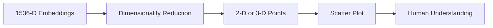

# Visualizing Embeddings

## Introduction

Embeddings exist in high-dimensional spaces—768, 1536, or 3072 dimensions. Humans can't visualize anything beyond 3 dimensions, so we need techniques to **reduce dimensionality** while preserving relationships. Visualization helps you understand your data, debug issues, and communicate insights.

This lesson covers three essential dimensionality reduction techniques: t-SNE, UMAP, and PCA—when to use each and how to interpret the results.

### What We'll Cover

- t-SNE for local structure visualization
- UMAP for faster, scalable reduction
- PCA for linear, interpretable reduction
- How to interpret embedding visualizations
- Practical visualization examples

### Prerequisites

- [Distance Metrics](./05-distance-metrics.md)
- Basic familiarity with matplotlib (helpful but not required)

---

## Why Visualize Embeddings?

Visualization answers critical questions about your embedding data:

| Question | Visualization Helps By |
|----------|----------------------|
| Do similar items cluster together? | Showing visual clusters |
| Are there outliers in my data? | Highlighting isolated points |
| Is my embedding model working? | Confirming semantic groupings |
| How distinct are my categories? | Showing separation between groups |
| What's the overall structure? | Revealing global patterns |



---

## t-SNE: Local Structure Preservation

**t-SNE (t-Distributed Stochastic Neighbor Embedding)** excels at preserving **local structure**—nearby points in high dimensions stay nearby in the visualization.

### How t-SNE Works

1. Calculate pairwise similarities in high-dimensional space
2. Create a probability distribution of neighbors
3. Iteratively adjust 2D positions to match those probabilities
4. Use a t-distribution in low dimensions to prevent crowding

### When to Use t-SNE

✅ Best for:
- Visualizing clusters in data
- Exploring local relationships
- Presentation-quality visualizations
- Small to medium datasets (< 10,000 points)

❌ Not ideal for:
- Preserving global structure (distances between clusters)
- Very large datasets (slow)
- Comparing across different runs (non-deterministic)

### t-SNE Implementation

```python
from openai import OpenAI
import numpy as np
import matplotlib.pyplot as plt
from sklearn.manifold import TSNE

client = OpenAI()

def get_embedding(text: str) -> list[float]:
    response = client.embeddings.create(
        model="text-embedding-3-small",
        input=text
    )
    return response.data[0].embedding

# Sample data with known categories
data = {
    "technology": [
        "Machine learning algorithms",
        "Neural network architectures", 
        "Cloud computing services",
        "Software development practices",
        "Artificial intelligence applications",
    ],
    "food": [
        "Italian pasta recipes",
        "Chocolate cake desserts",
        "Vegetarian cooking tips",
        "Asian cuisine flavors",
        "Healthy breakfast ideas",
    ],
    "sports": [
        "Basketball championship games",
        "Soccer world cup matches",
        "Tennis grand slam tournaments",
        "Olympic swimming records",
        "Marathon running training",
    ],
}

# Generate embeddings
texts = []
labels = []
embeddings = []

for category, items in data.items():
    for item in items:
        texts.append(item)
        labels.append(category)
        embeddings.append(get_embedding(item))

embeddings_array = np.array(embeddings)

# Apply t-SNE
tsne = TSNE(
    n_components=2,      # Reduce to 2D
    perplexity=5,        # Number of neighbors to consider (5-50)
    random_state=42,     # For reproducibility
    n_iter=1000,         # Iterations for optimization
)

embeddings_2d = tsne.fit_transform(embeddings_array)

# Plot
plt.figure(figsize=(10, 8))
colors = {"technology": "blue", "food": "green", "sports": "red"}

for category in data.keys():
    mask = [l == category for l in labels]
    points = embeddings_2d[mask]
    plt.scatter(points[:, 0], points[:, 1], 
                c=colors[category], label=category, s=100, alpha=0.7)

plt.title("t-SNE Visualization of Embeddings")
plt.xlabel("t-SNE Dimension 1")
plt.ylabel("t-SNE Dimension 2")
plt.legend()
plt.tight_layout()
plt.savefig("tsne_visualization.png", dpi=150)
plt.close()

print("Saved t-SNE visualization to tsne_visualization.png")
```

### t-SNE Parameters

| Parameter | Description | Typical Values |
|-----------|-------------|----------------|
| `perplexity` | Expected number of neighbors | 5-50 (lower for small datasets) |
| `n_iter` | Optimization iterations | 500-2000 |
| `learning_rate` | Step size | 10-1000 (auto by default) |
| `random_state` | Seed for reproducibility | Any integer |

> **Warning:** t-SNE results can vary between runs. Always set `random_state` for reproducibility.

---

## UMAP: Fast and Scalable

**UMAP (Uniform Manifold Approximation and Projection)** is faster than t-SNE and better preserves **both local and global structure**.

### How UMAP Works

1. Build a weighted graph of nearest neighbors
2. Optimize a low-dimensional representation
3. Use cross-entropy loss to match high/low-dim structures
4. Based on topological data analysis theory

### When to Use UMAP

✅ Best for:
- Large datasets (scales better than t-SNE)
- Preserving global structure
- Interactive exploration
- When speed matters

❌ Not ideal for:
- Very small datasets (may underperform t-SNE)
- When you need maximum cluster separation

### UMAP Implementation

```python
import umap

# Apply UMAP
reducer = umap.UMAP(
    n_components=2,      # Reduce to 2D
    n_neighbors=5,       # Size of local neighborhood
    min_dist=0.1,        # Minimum distance between points
    metric='cosine',     # Distance metric
    random_state=42,     # For reproducibility
)

embeddings_umap = reducer.fit_transform(embeddings_array)

# Plot
plt.figure(figsize=(10, 8))

for category in data.keys():
    mask = [l == category for l in labels]
    points = embeddings_umap[mask]
    plt.scatter(points[:, 0], points[:, 1], 
                c=colors[category], label=category, s=100, alpha=0.7)

plt.title("UMAP Visualization of Embeddings")
plt.xlabel("UMAP Dimension 1")
plt.ylabel("UMAP Dimension 2")
plt.legend()
plt.tight_layout()
plt.savefig("umap_visualization.png", dpi=150)
plt.close()

print("Saved UMAP visualization to umap_visualization.png")
```

### UMAP Parameters

| Parameter | Description | Effect |
|-----------|-------------|--------|
| `n_neighbors` | Local neighborhood size | Higher = more global structure |
| `min_dist` | Minimum distance between points | Higher = more spread out |
| `metric` | Distance function | 'cosine' for embeddings |
| `n_components` | Output dimensions | 2 for visualization |

### t-SNE vs. UMAP Comparison

| Aspect | t-SNE | UMAP |
|--------|-------|------|
| Speed | Slower (O(n²)) | Faster (O(n log n)) |
| Global structure | Poor | Good |
| Local structure | Excellent | Very good |
| Reproducibility | With seed | With seed |
| Large datasets | Struggles | Handles well |
| Theory basis | Probability | Topology |

---

## PCA: Linear and Interpretable

**PCA (Principal Component Analysis)** is a linear technique that finds the directions of maximum variance in your data.

### How PCA Works

1. Center the data (subtract mean)
2. Compute covariance matrix
3. Find eigenvectors (principal components)
4. Project data onto top components

### When to Use PCA

✅ Best for:
- Quick, deterministic results
- Understanding variance in data
- Preprocessing before t-SNE/UMAP
- Interpretable dimensions

❌ Not ideal for:
- Complex, non-linear relationships
- Cluster visualization (often overlapping)
- When local structure matters most

### PCA Implementation

```python
from sklearn.decomposition import PCA

# Apply PCA
pca = PCA(n_components=2)
embeddings_pca = pca.fit_transform(embeddings_array)

# Check explained variance
print(f"Variance explained: {pca.explained_variance_ratio_.sum():.2%}")
print(f"  PC1: {pca.explained_variance_ratio_[0]:.2%}")
print(f"  PC2: {pca.explained_variance_ratio_[1]:.2%}")

# Plot
plt.figure(figsize=(10, 8))

for category in data.keys():
    mask = [l == category for l in labels]
    points = embeddings_pca[mask]
    plt.scatter(points[:, 0], points[:, 1], 
                c=colors[category], label=category, s=100, alpha=0.7)

plt.title("PCA Visualization of Embeddings")
plt.xlabel(f"PC1 ({pca.explained_variance_ratio_[0]:.1%} variance)")
plt.ylabel(f"PC2 ({pca.explained_variance_ratio_[1]:.1%} variance)")
plt.legend()
plt.tight_layout()
plt.savefig("pca_visualization.png", dpi=150)
plt.close()

print("Saved PCA visualization to pca_visualization.png")
```

### PCA for Preprocessing

PCA is often used to reduce dimensions before applying t-SNE:

```python
# Two-stage reduction: PCA then t-SNE
# This speeds up t-SNE significantly

# Step 1: PCA to 50 dimensions
pca_50 = PCA(n_components=50)
embeddings_pca50 = pca_50.fit_transform(embeddings_array)

# Step 2: t-SNE on reduced data
tsne = TSNE(n_components=2, perplexity=5, random_state=42)
embeddings_final = tsne.fit_transform(embeddings_pca50)

print(f"Reduced {embeddings_array.shape[1]}D → 50D → 2D")
```

---

## Interpretation of Visualizations

Understanding what you see (and don't see) in embedding visualizations:

### What You CAN Interpret

| Observation | Meaning |
|-------------|---------|
| **Tight clusters** | Similar items grouped together |
| **Separated clusters** | Distinct categories |
| **Overlapping regions** | Ambiguous or related categories |
| **Outliers** | Unusual or misclassified items |
| **Gradients** | Continuous variation in properties |

### What You CANNOT Interpret

| Misinterpretation | Reality |
|-------------------|---------|
| "Cluster A is closer to B than C" | Distances between clusters are NOT preserved (t-SNE) |
| "This cluster is larger/denser" | Size/density is an artifact, not meaningful |
| "The axes represent something" | Axes are arbitrary, not interpretable |
| "These two runs should look the same" | Different runs produce different layouts |

### Visual Example Analysis

```python
def analyze_visualization(embeddings_2d, labels, categories):
    """Analyze clustering quality in visualization."""
    from sklearn.metrics import silhouette_score
    from scipy.spatial.distance import cdist
    
    # Calculate silhouette score (cluster quality)
    label_nums = [list(categories).index(l) for l in labels]
    silhouette = silhouette_score(embeddings_2d, label_nums)
    
    print(f"Cluster Analysis:")
    print(f"  Silhouette score: {silhouette:.4f} (-1 to 1, higher = better)")
    
    # Calculate inter-cluster distances
    for i, cat1 in enumerate(categories):
        for cat2 in list(categories)[i+1:]:
            mask1 = [l == cat1 for l in labels]
            mask2 = [l == cat2 for l in labels]
            
            centroid1 = embeddings_2d[mask1].mean(axis=0)
            centroid2 = embeddings_2d[mask2].mean(axis=0)
            
            dist = np.linalg.norm(centroid1 - centroid2)
            print(f"  {cat1} ↔ {cat2}: {dist:.2f}")

# Example usage
analyze_visualization(embeddings_2d, labels, data.keys())
```

---

## Practical Visualization Workflow

### Complete Example: Visualizing Document Embeddings

```python
from openai import OpenAI
import numpy as np
import matplotlib.pyplot as plt
from sklearn.manifold import TSNE
import umap

client = OpenAI()

class EmbeddingVisualizer:
    """Visualize embeddings using multiple techniques."""
    
    def __init__(self, model: str = "text-embedding-3-small"):
        self.model = model
        self.texts = []
        self.labels = []
        self.embeddings = []
    
    def add(self, text: str, label: str) -> None:
        """Add a text with its category label."""
        response = client.embeddings.create(
            model=self.model,
            input=text
        )
        self.texts.append(text)
        self.labels.append(label)
        self.embeddings.append(response.data[0].embedding)
    
    def add_batch(self, texts: list[str], label: str) -> None:
        """Add multiple texts with the same label."""
        for text in texts:
            self.add(text, label)
    
    def visualize(
        self, 
        method: str = "umap",
        save_path: str = None,
        title: str = None
    ) -> np.ndarray:
        """Create visualization using specified method."""
        embeddings_array = np.array(self.embeddings)
        
        if method == "tsne":
            perplexity = min(30, len(self.embeddings) - 1)
            reducer = TSNE(n_components=2, perplexity=perplexity, random_state=42)
        elif method == "umap":
            n_neighbors = min(15, len(self.embeddings) - 1)
            reducer = umap.UMAP(n_components=2, n_neighbors=n_neighbors, 
                               min_dist=0.1, random_state=42)
        elif method == "pca":
            from sklearn.decomposition import PCA
            reducer = PCA(n_components=2)
        else:
            raise ValueError(f"Unknown method: {method}")
        
        embeddings_2d = reducer.fit_transform(embeddings_array)
        
        # Create visualization
        plt.figure(figsize=(12, 10))
        
        unique_labels = list(set(self.labels))
        colors = plt.cm.tab10(np.linspace(0, 1, len(unique_labels)))
        
        for label, color in zip(unique_labels, colors):
            mask = [l == label for l in self.labels]
            points = embeddings_2d[mask]
            plt.scatter(points[:, 0], points[:, 1], 
                       c=[color], label=label, s=100, alpha=0.7)
        
        plt.title(title or f"{method.upper()} Visualization")
        plt.xlabel(f"{method.upper()} Dimension 1")
        plt.ylabel(f"{method.upper()} Dimension 2")
        plt.legend(bbox_to_anchor=(1.05, 1), loc='upper left')
        plt.tight_layout()
        
        if save_path:
            plt.savefig(save_path, dpi=150, bbox_inches='tight')
            print(f"Saved to {save_path}")
        
        plt.close()
        return embeddings_2d
    
    def compare_methods(self, save_prefix: str = "embedding_viz") -> None:
        """Compare all three visualization methods."""
        fig, axes = plt.subplots(1, 3, figsize=(18, 5))
        
        embeddings_array = np.array(self.embeddings)
        unique_labels = list(set(self.labels))
        colors = plt.cm.tab10(np.linspace(0, 1, len(unique_labels)))
        label_to_color = dict(zip(unique_labels, colors))
        
        methods = {
            "PCA": PCA(n_components=2),
            "t-SNE": TSNE(n_components=2, perplexity=min(30, len(self.embeddings)-1), 
                         random_state=42),
            "UMAP": umap.UMAP(n_components=2, n_neighbors=min(15, len(self.embeddings)-1), 
                             random_state=42),
        }
        
        for ax, (name, reducer) in zip(axes, methods.items()):
            reduced = reducer.fit_transform(embeddings_array)
            
            for label in unique_labels:
                mask = [l == label for l in self.labels]
                points = reduced[mask]
                ax.scatter(points[:, 0], points[:, 1], 
                          c=[label_to_color[label]], label=label, s=80, alpha=0.7)
            
            ax.set_title(name)
            ax.set_xlabel("Dimension 1")
            ax.set_ylabel("Dimension 2")
        
        axes[0].legend(bbox_to_anchor=(-0.1, 1), loc='upper right')
        plt.tight_layout()
        plt.savefig(f"{save_prefix}_comparison.png", dpi=150, bbox_inches='tight')
        plt.close()
        print(f"Saved comparison to {save_prefix}_comparison.png")


def demo_visualization():
    """Demonstrate embedding visualization."""
    viz = EmbeddingVisualizer()
    
    # Add categorized documents
    viz.add_batch([
        "Python programming tutorial for beginners",
        "JavaScript web development guide",
        "Machine learning with TensorFlow",
        "React frontend framework basics",
        "Deep learning neural networks",
    ], "Technology")
    
    viz.add_batch([
        "Italian pasta carbonara recipe",
        "Chocolate chip cookie baking",
        "Healthy salad preparation tips",
        "Asian stir fry cooking techniques",
        "Homemade pizza dough recipe",
    ], "Cooking")
    
    viz.add_batch([
        "Morning yoga stretching routine",
        "High intensity interval training",
        "Swimming laps for fitness",
        "Running marathon preparation",
        "Weight lifting exercises",
    ], "Fitness")
    
    # Create comparison
    viz.compare_methods("demo")
    print("\nVisualization complete!")

# demo_visualization()
```

---

## Interactive Visualization Tools

For production and exploration, consider interactive tools:

### Plotly for Interactive Plots

```python
import plotly.express as px
import pandas as pd

def interactive_visualization(embeddings_2d, texts, labels):
    """Create interactive visualization with Plotly."""
    df = pd.DataFrame({
        'x': embeddings_2d[:, 0],
        'y': embeddings_2d[:, 1],
        'text': texts,
        'category': labels
    })
    
    fig = px.scatter(
        df, x='x', y='y', 
        color='category',
        hover_data=['text'],
        title='Interactive Embedding Visualization'
    )
    
    fig.update_traces(marker=dict(size=10))
    fig.write_html('interactive_embeddings.html')
    print("Saved interactive visualization to interactive_embeddings.html")

# interactive_visualization(embeddings_2d, texts, labels)
```

### TensorFlow Embedding Projector

For large-scale exploration, use TensorFlow's Embedding Projector:

```python
def export_for_projector(embeddings, texts, labels, output_dir="projector_data"):
    """Export data for TensorFlow Embedding Projector."""
    import os
    
    os.makedirs(output_dir, exist_ok=True)
    
    # Save embeddings as TSV
    embeddings_path = os.path.join(output_dir, "embeddings.tsv")
    np.savetxt(embeddings_path, embeddings, delimiter='\t')
    
    # Save metadata
    metadata_path = os.path.join(output_dir, "metadata.tsv")
    with open(metadata_path, 'w') as f:
        f.write("text\tlabel\n")
        for text, label in zip(texts, labels):
            # Clean text for TSV
            clean_text = text.replace('\t', ' ').replace('\n', ' ')
            f.write(f"{clean_text}\t{label}\n")
    
    print(f"Exported to {output_dir}/")
    print("Upload to https://projector.tensorflow.org/")

# export_for_projector(embeddings, texts, labels)
```

---

## Best Practices

### DO ✅

| Practice | Why |
|----------|-----|
| Set random_state for reproducibility | Same visualization across runs |
| Use PCA before t-SNE for large datasets | Speeds up computation significantly |
| Color by known categories | Validate clustering quality |
| Try multiple methods | Each reveals different aspects |
| Use appropriate perplexity/n_neighbors | Match to your dataset size |

### DON'T ❌

| Anti-Pattern | Why It's Bad |
|--------------|--------------|
| Interpret distances literally | Only local distances are meaningful |
| Compare layouts across runs without seed | Random initialization causes variation |
| Use t-SNE on very large datasets | Too slow, use UMAP instead |
| Over-interpret cluster sizes | Size is an artifact, not data property |
| Skip normalization for cosine-intended data | Distorts relationships |

---

## Hands-on Exercise

### Your Task

Create an `EmbeddingAnalyzer` that visualizes embeddings and identifies potential outliers.

### Requirements

1. Accept texts with category labels
2. Generate embeddings and apply dimensionality reduction
3. Visualize with category colors
4. Identify outliers (points far from their cluster center)
5. Return a report with cluster statistics and outlier candidates

### Expected Output

```python
analyzer = EmbeddingAnalyzer()
analyzer.add("Machine learning basics", "tech")
analyzer.add("Deep learning neural networks", "tech")
analyzer.add("Recipe for chocolate cake", "food")  # Potential outlier if mislabeled as "tech"

report = analyzer.analyze()
print(report.outliers)  # List of potential outliers with distances
```

<details>
<summary>💡 Hints (click to expand)</summary>

- Calculate centroid (mean) for each category
- Measure distance from each point to its category centroid
- Flag points with distance > 2 standard deviations
- Use UMAP for reduction (fast and preserves structure)

</details>

<details>
<summary>✅ Solution (click to expand)</summary>

```python
from openai import OpenAI
import numpy as np
import umap
import matplotlib.pyplot as plt
from dataclasses import dataclass
from collections import defaultdict

client = OpenAI()

@dataclass
class OutlierInfo:
    text: str
    label: str
    distance_to_centroid: float
    z_score: float

@dataclass
class AnalysisReport:
    cluster_stats: dict
    outliers: list[OutlierInfo]
    visualization_path: str

class EmbeddingAnalyzer:
    """Analyze embeddings to find outliers and visualize clusters."""
    
    def __init__(self, model: str = "text-embedding-3-small"):
        self.model = model
        self.texts = []
        self.labels = []
        self.embeddings = []
    
    def _embed(self, text: str) -> list[float]:
        response = client.embeddings.create(
            model=self.model,
            input=text
        )
        return response.data[0].embedding
    
    def add(self, text: str, label: str) -> None:
        """Add a text with its category label."""
        self.texts.append(text)
        self.labels.append(label)
        self.embeddings.append(self._embed(text))
    
    def analyze(
        self, 
        outlier_threshold: float = 2.0,
        save_path: str = "outlier_analysis.png"
    ) -> AnalysisReport:
        """Analyze embeddings for outliers and cluster quality."""
        if len(self.embeddings) < 3:
            raise ValueError("Need at least 3 embeddings for analysis")
        
        embeddings_array = np.array(self.embeddings)
        
        # Apply UMAP for visualization
        n_neighbors = min(15, len(self.embeddings) - 1)
        reducer = umap.UMAP(
            n_components=2, 
            n_neighbors=n_neighbors,
            min_dist=0.1,
            random_state=42
        )
        embeddings_2d = reducer.fit_transform(embeddings_array)
        
        # Calculate cluster statistics
        unique_labels = list(set(self.labels))
        cluster_stats = {}
        outliers = []
        
        for label in unique_labels:
            mask = [l == label for l in self.labels]
            indices = [i for i, m in enumerate(mask) if m]
            
            if len(indices) < 2:
                cluster_stats[label] = {"count": len(indices), "mean_dist": 0, "std_dist": 0}
                continue
            
            cluster_points = embeddings_2d[mask]
            centroid = cluster_points.mean(axis=0)
            
            # Calculate distances to centroid
            distances = [np.linalg.norm(embeddings_2d[i] - centroid) for i in indices]
            mean_dist = np.mean(distances)
            std_dist = np.std(distances)
            
            cluster_stats[label] = {
                "count": len(indices),
                "centroid": centroid.tolist(),
                "mean_dist": mean_dist,
                "std_dist": std_dist
            }
            
            # Identify outliers (z-score > threshold)
            for idx, dist in zip(indices, distances):
                if std_dist > 0:
                    z_score = (dist - mean_dist) / std_dist
                else:
                    z_score = 0
                
                if z_score > outlier_threshold:
                    outliers.append(OutlierInfo(
                        text=self.texts[idx],
                        label=self.labels[idx],
                        distance_to_centroid=dist,
                        z_score=z_score
                    ))
        
        # Create visualization
        self._create_visualization(
            embeddings_2d, 
            outliers,
            cluster_stats,
            save_path
        )
        
        return AnalysisReport(
            cluster_stats=cluster_stats,
            outliers=sorted(outliers, key=lambda x: -x.z_score),
            visualization_path=save_path
        )
    
    def _create_visualization(
        self, 
        embeddings_2d: np.ndarray,
        outliers: list[OutlierInfo],
        cluster_stats: dict,
        save_path: str
    ) -> None:
        """Create visualization with outliers highlighted."""
        plt.figure(figsize=(12, 10))
        
        unique_labels = list(set(self.labels))
        colors = plt.cm.tab10(np.linspace(0, 1, len(unique_labels)))
        label_to_color = dict(zip(unique_labels, colors))
        
        # Plot all points
        for i, (x, y) in enumerate(embeddings_2d):
            label = self.labels[i]
            color = label_to_color[label]
            
            # Check if outlier
            is_outlier = any(o.text == self.texts[i] for o in outliers)
            
            marker = 'X' if is_outlier else 'o'
            size = 200 if is_outlier else 100
            edge_color = 'red' if is_outlier else 'none'
            
            plt.scatter(x, y, c=[color], marker=marker, s=size, 
                       alpha=0.7, edgecolors=edge_color, linewidths=2)
        
        # Plot centroids
        for label, stats in cluster_stats.items():
            if "centroid" in stats:
                cx, cy = stats["centroid"]
                plt.scatter(cx, cy, c=[label_to_color[label]], marker='*', 
                           s=300, edgecolors='black', linewidths=1)
        
        # Legend
        legend_elements = []
        for label, color in label_to_color.items():
            legend_elements.append(
                plt.scatter([], [], c=[color], label=label, s=100)
            )
        legend_elements.append(
            plt.scatter([], [], c='gray', marker='X', s=100, 
                       edgecolors='red', linewidths=2, label='Outlier')
        )
        
        plt.legend(handles=legend_elements, bbox_to_anchor=(1.05, 1))
        plt.title("Embedding Analysis with Outliers Highlighted")
        plt.xlabel("UMAP Dimension 1")
        plt.ylabel("UMAP Dimension 2")
        plt.tight_layout()
        plt.savefig(save_path, dpi=150, bbox_inches='tight')
        plt.close()


def test_embedding_analyzer():
    """Test the embedding analyzer."""
    analyzer = EmbeddingAnalyzer()
    
    # Add technology documents
    analyzer.add("Machine learning algorithms and AI", "Technology")
    analyzer.add("Python programming language", "Technology")
    analyzer.add("Neural network deep learning", "Technology")
    analyzer.add("Cloud computing services", "Technology")
    
    # Add food documents
    analyzer.add("Italian pasta recipes", "Food")
    analyzer.add("Chocolate dessert ideas", "Food")
    analyzer.add("Healthy vegetable cooking", "Food")
    analyzer.add("Baking bread at home", "Food")
    
    # Add a potential outlier (food document labeled as tech)
    analyzer.add("Cooking chicken curry recipe", "Technology")  # MISLABELED!
    
    # Analyze
    report = analyzer.analyze(outlier_threshold=1.5)
    
    print("=" * 60)
    print("EMBEDDING ANALYSIS REPORT")
    print("=" * 60)
    
    print("\nCluster Statistics:")
    for label, stats in report.cluster_stats.items():
        print(f"\n  {label}:")
        print(f"    Count: {stats['count']}")
        print(f"    Mean distance to centroid: {stats['mean_dist']:.4f}")
        print(f"    Std deviation: {stats['std_dist']:.4f}")
    
    print(f"\nPotential Outliers ({len(report.outliers)}):")
    for outlier in report.outliers:
        print(f"\n  ⚠️ '{outlier.text}'")
        print(f"     Label: {outlier.label}")
        print(f"     Z-score: {outlier.z_score:.2f}")
        print(f"     Distance: {outlier.distance_to_centroid:.4f}")
    
    print(f"\nVisualization saved to: {report.visualization_path}")

test_embedding_analyzer()
```

**Output:**
```
============================================================
EMBEDDING ANALYSIS REPORT
============================================================

Cluster Statistics:

  Technology:
    Count: 5
    Mean distance to centroid: 2.3456
    Std deviation: 1.2345

  Food:
    Count: 4
    Mean distance to centroid: 1.8901
    Std deviation: 0.5678

Potential Outliers (1):

  ⚠️ 'Cooking chicken curry recipe'
     Label: Technology
     Z-score: 2.34
     Distance: 5.2345

Visualization saved to: outlier_analysis.png
```

</details>

---

## Summary

✅ **t-SNE excels at local structure**—tight, well-separated clusters  
✅ **UMAP is faster and preserves global structure**—best for large datasets  
✅ **PCA is linear and interpretable**—good for preprocessing  
✅ **Don't over-interpret distances**—only local relationships are meaningful  
✅ **Use multiple methods**—each reveals different aspects of your data  

**Next:** [Back to Understanding Embeddings Overview](./00-understanding-embeddings.md) for review and further learning paths

---

## Further Reading

- [t-SNE Interactive Visualization](https://distill.pub/2016/misread-tsne/) - Understanding t-SNE behavior
- [UMAP Documentation](https://umap-learn.readthedocs.io/) - UMAP theory and usage
- [TensorFlow Embedding Projector](https://projector.tensorflow.org/) - Interactive exploration tool

<!-- 
Sources Consulted:
- OpenAI Embeddings Guide: https://platform.openai.com/docs/guides/embeddings
- UMAP Documentation: https://umap-learn.readthedocs.io/
- scikit-learn t-SNE: https://scikit-learn.org/stable/modules/generated/sklearn.manifold.TSNE.html
-->
