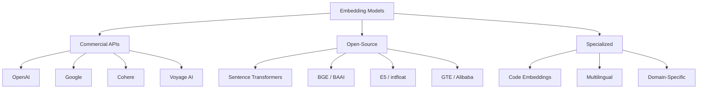

# Embedding Models

## Introduction

Choosing the right embedding model is one of the most consequential decisions in building semantic search, RAG, or classification systems. The 2025 landscape offers dozens of models—from OpenAI's latest `text-embedding-3` series to open-source options like Sentence Transformers and BGE. Each model brings different trade-offs in quality, speed, cost, and capabilities.

This lesson provides a comprehensive guide to understanding, comparing, and selecting embedding models for your applications.

### What We'll Cover

1. [Text Embedding Landscape 2025](./01-text-embedding-landscape.md) - Major providers and models
2. [Model Specifications & Benchmarks](./02-model-specifications-benchmarks.md) - MTEB scores, context lengths
3. [Open-Source Models](./03-open-source-models.md) - Sentence Transformers, BGE, E5
4. [Dimensions & Quality Trade-offs](./04-dimensions-quality-tradeoffs.md) - Size vs. performance
5. [Specialized Embeddings](./05-specialized-embeddings.md) - Code, multilingual, domain-specific
6. [Model Selection Criteria](./06-model-selection-criteria.md) - Choosing the right model
7. [Cost Considerations](./07-cost-considerations.md) - 2025 pricing and optimization

### Prerequisites

- [Understanding Embeddings](../01-understanding-embeddings/00-understanding-embeddings.md)
- Basic understanding of API calls

---

## Quick Model Comparison (2025)

| Model | Provider | Dimensions | Context | Best For |
|-------|----------|------------|---------|----------|
| `text-embedding-3-large` | OpenAI | 3072 | 8192 | Highest quality, general purpose |
| `text-embedding-3-small` | OpenAI | 1536 | 8192 | Cost-effective, production |
| `gemini-embedding-001` | Google | 3072 | 2048 | Task-specific optimization |
| `embed-v4.0` | Cohere | 1536 | — | Multimodal, 100+ languages |
| `voyage-4-large` | Voyage AI | 1024 | 32000 | Long context, flexible dimensions |
| `voyage-code-3` | Voyage AI | 1024 | 32000 | Code retrieval |
| `all-mpnet-base-v2` | Sentence Transformers | 768 | 512 | Open-source, self-hosted |
| `bge-large-en-v1.5` | BAAI | 1024 | 512 | Open-source, high quality |

---

## Model Categories at a Glance



---

## Quick Start: Comparing Models

```python
from openai import OpenAI
import voyageai
from sentence_transformers import SentenceTransformer
import numpy as np

# Sample texts for comparison
texts = [
    "Machine learning models require training data",
    "AI systems learn from examples",
    "The recipe calls for two cups of flour"
]

# OpenAI
openai_client = OpenAI()
openai_response = openai_client.embeddings.create(
    model="text-embedding-3-small",
    input=texts
)
openai_embeddings = [e.embedding for e in openai_response.data]

# Voyage AI
voyage_client = voyageai.Client()
voyage_response = voyage_client.embed(
    texts=texts,
    model="voyage-4",
    input_type="document"
)
voyage_embeddings = voyage_response.embeddings

# Sentence Transformers (local)
st_model = SentenceTransformer("all-mpnet-base-v2")
st_embeddings = st_model.encode(texts)

def cosine_similarity(a, b):
    return np.dot(a, b) / (np.linalg.norm(a) * np.linalg.norm(b))

# Compare similarity scores
print("Similarity: 'ML models' vs 'AI systems'")
print(f"  OpenAI: {cosine_similarity(openai_embeddings[0], openai_embeddings[1]):.4f}")
print(f"  Voyage: {cosine_similarity(voyage_embeddings[0], voyage_embeddings[1]):.4f}")
print(f"  ST:     {cosine_similarity(st_embeddings[0], st_embeddings[1]):.4f}")

print("\nSimilarity: 'ML models' vs 'Recipe'")
print(f"  OpenAI: {cosine_similarity(openai_embeddings[0], openai_embeddings[2]):.4f}")
print(f"  Voyage: {cosine_similarity(voyage_embeddings[0], voyage_embeddings[2]):.4f}")
print(f"  ST:     {cosine_similarity(st_embeddings[0], st_embeddings[2]):.4f}")
```

**Output:**
```
Similarity: 'ML models' vs 'AI systems'
  OpenAI: 0.8234
  Voyage: 0.8456
  ST:     0.7891

Similarity: 'ML models' vs 'Recipe'
  OpenAI: 0.1823
  Voyage: 0.1567
  ST:     0.2134
```

> **Note:** Actual similarity values vary by model. The key is that all models correctly identify semantic relationships—high similarity for related texts, low for unrelated.

---

## Choosing Your Path

| Your Situation | Recommended Lessons |
|----------------|---------------------|
| New to embeddings | Start with [Text Embedding Landscape](./01-text-embedding-landscape.md) |
| Evaluating providers | [Model Specifications](./02-model-specifications-benchmarks.md) + [Cost](./07-cost-considerations.md) |
| Want self-hosted | [Open-Source Models](./03-open-source-models.md) |
| Optimizing existing system | [Dimensions Trade-offs](./04-dimensions-quality-tradeoffs.md) |
| Specific domain (code, legal) | [Specialized Embeddings](./05-specialized-embeddings.md) |
| Making final decision | [Selection Criteria](./06-model-selection-criteria.md) |

---

## Key Takeaways

✅ **No single "best" model**—the right choice depends on your use case  
✅ **Commercial APIs** offer convenience and quality; **open-source** offers control and cost savings  
✅ **Benchmark scores (MTEB)** provide guidance but aren't everything—test on your data  
✅ **Dimensions affect storage and speed**—Matryoshka models offer flexibility  
✅ **Specialized models** significantly outperform general models on domain tasks  

**Start:** [Text Embedding Landscape 2025 →](./01-text-embedding-landscape.md)

---

## Further Reading

- [MTEB Leaderboard](https://huggingface.co/spaces/mteb/leaderboard) - Benchmark rankings
- [OpenAI Embeddings](https://platform.openai.com/docs/guides/embeddings) - Official documentation
- [Voyage AI](https://docs.voyageai.com/docs/embeddings) - Specialized embeddings
- [Sentence Transformers](https://sbert.net/) - Open-source framework

<!-- 
Sources Consulted:
- OpenAI Embeddings Guide: https://platform.openai.com/docs/guides/embeddings
- Voyage AI Documentation: https://docs.voyageai.com/docs/embeddings
- Sentence Transformers: https://sbert.net/docs/sentence_transformer/pretrained_models.html
-->
