# Model Specifications & Benchmarks

## Introduction

Choosing between embedding models requires understanding their specifications and benchmark performance. MTEB (Massive Text Embedding Benchmark) has become the standard for comparing models, but raw scores don't tell the whole story. Context length, inference speed, and task-specific performance all matter.

This lesson breaks down the key specifications and how to interpret benchmark results.

### What We'll Cover

- MTEB benchmark explained
- Model specifications compared
- Context length considerations
- Inference speed and latency
- Task-specific performance variations
- How to interpret and use benchmarks

### Prerequisites

- [Text Embedding Landscape](./01-text-embedding-landscape.md)

---

## MTEB: The Standard Benchmark

**MTEB (Massive Text Embedding Benchmark)** evaluates models across 56+ datasets covering 8 task categories.

### Task Categories

| Category | Description | Example Datasets |
|----------|-------------|------------------|
| **Retrieval** | Find relevant documents for queries | MS MARCO, NQ, HotpotQA |
| **Classification** | Categorize text | Amazon Reviews, IMDB |
| **Clustering** | Group similar texts | Reddit, StackExchange |
| **Semantic Similarity** | Score text pair similarity | STS Benchmark |
| **Pair Classification** | Classify text pairs | MNLI, QQP |
| **Reranking** | Reorder candidates | MS MARCO Rerank |
| **Summarization** | Match summaries to documents | SummEval |
| **Bitext Mining** | Find translations | Tatoeba |

### Reading MTEB Scores

```
MTEB Score: Average performance across all 56+ datasets
Range: 0-100% (higher is better)
```

| Score Range | Interpretation |
|-------------|----------------|
| 70%+ | State-of-the-art |
| 65-70% | Excellent |
| 60-65% | Very good |
| 55-60% | Good |
| <55% | Consider alternatives |

> **Warning:** MTEB is an *average*. A model with 65% overall might score 75% on retrieval (your use case) and 55% on clustering (irrelevant to you). Always check task-specific scores!

---

## Commercial Model Specifications

### OpenAI

| Specification | text-embedding-3-small | text-embedding-3-large |
|---------------|------------------------|-------------------------|
| Dimensions | 1536 (default), 512-1536 | 3072 (default), 256-3072 |
| Context Length | 8,192 tokens | 8,192 tokens |
| MTEB Average | 62.3% | 64.6% |
| MTEB Retrieval | ~58% | ~60% |
| Normalized | ✅ Yes | ✅ Yes |
| Matryoshka | ✅ Yes | ✅ Yes |

**Dimension Quality Retention (text-embedding-3-large):**

| Dimensions | % of Full Quality | Use Case |
|------------|-------------------|----------|
| 3072 | 100% | Maximum accuracy |
| 1536 | ~99.1% | Balanced |
| 1024 | ~98.5% | Storage optimized |
| 512 | ~96.8% | Speed critical |
| 256 | ~93.2% | Extreme compression |

### Google Gemini

| Specification | gemini-embedding-001 |
|---------------|----------------------|
| Dimensions | 768, 1536, 3072 |
| Context Length | 2,048 tokens |
| MTEB at 768d | 67.99% |
| MTEB at 1536d | 68.17% |
| MTEB at 3072d | 68.16% |
| Normalized | 3072d only* |
| Matryoshka | ✅ Yes |
| Task Types | ✅ 8 types |

*Critical: 768d and 1536d embeddings require manual normalization!

**Benchmark Insight:** Notice that 768d achieves nearly identical MTEB scores to 3072d. This is Matryoshka training at work—lower dimensions retain quality.

### Cohere

| Specification | embed-v4.0 |
|---------------|------------|
| Dimensions | 256, 512, 1024, 1536 |
| Context Length | Varies by tier |
| Languages | 100+ |
| Multimodal | ✅ Text + Images |
| Normalized | ✅ Yes |
| Compression | float, int8, binary |

### Voyage AI

| Specification | voyage-4-large | voyage-4 | voyage-4-lite |
|---------------|----------------|----------|---------------|
| Dimensions | 1024 (256-2048) | 1024 (256-2048) | 1024 (256-2048) |
| Context Length | 32,000 | 32,000 | 32,000 |
| Normalized | ✅ Yes | ✅ Yes | ✅ Yes |
| Compression | ✅ All types | ✅ All types | ✅ All types |

**Specialized Models:**

| Model | Domain | Context |
|-------|--------|---------|
| voyage-code-3 | Code retrieval | 32,000 |
| voyage-finance-2 | Financial | 32,000 |
| voyage-law-2 | Legal | 16,000 |

---

## Context Length Deep Dive

Context length determines how much text can be embedded in a single call.

### Comparison

```mermaid
flowchart LR
    A[Input Text] --> B{Token Count}
    B -->|≤2K| C[Gemini ✓]
    B -->|≤8K| D[OpenAI ✓]
    B -->|≤32K| E[Voyage ✓]
    B -->|>32K| F[Chunk Required]
```



| Provider | Context (tokens) | ~Words | ~Pages |
|----------|------------------|--------|--------|
| Gemini | 2,048 | ~1,500 | ~3 |
| OpenAI | 8,192 | ~6,000 | ~12 |
| Voyage | 32,000 | ~24,000 | ~48 |

### Tokenization Check

```python
import tiktoken

def check_token_count(text: str, model: str = "text-embedding-3-small") -> dict:
    """Check if text fits in model context."""
    # OpenAI uses cl100k_base encoding
    encoding = tiktoken.get_encoding("cl100k_base")
    tokens = encoding.encode(text)
    count = len(tokens)
    
    limits = {
        "openai": 8192,
        "gemini": 2048,
        "voyage": 32000
    }
    
    return {
        "token_count": count,
        "fits_openai": count <= limits["openai"],
        "fits_gemini": count <= limits["gemini"],
        "fits_voyage": count <= limits["voyage"],
    }

# Example
long_text = "Your long document here..." * 500
result = check_token_count(long_text)
print(f"Tokens: {result['token_count']}")
print(f"Fits OpenAI (8K): {result['fits_openai']}")
print(f"Fits Gemini (2K): {result['fits_gemini']}")
print(f"Fits Voyage (32K): {result['fits_voyage']}")
```

### Handling Long Documents

When documents exceed context limits:

```python
def chunk_text(text: str, max_tokens: int = 8000, overlap: int = 200) -> list[str]:
    """Chunk text to fit within token limits."""
    encoding = tiktoken.get_encoding("cl100k_base")
    tokens = encoding.encode(text)
    
    chunks = []
    start = 0
    
    while start < len(tokens):
        end = start + max_tokens
        chunk_tokens = tokens[start:end]
        chunk_text = encoding.decode(chunk_tokens)
        chunks.append(chunk_text)
        start = end - overlap  # Overlap for context continuity
    
    return chunks

# Usage
long_doc = "Very long document..." * 5000
chunks = chunk_text(long_doc, max_tokens=7500)
print(f"Split into {len(chunks)} chunks")
```

---

## Inference Speed & Latency

Speed matters for user-facing applications and batch processing.

### Latency Factors

| Factor | Impact |
|--------|--------|
| Model size | Larger = slower |
| Dimensions | More dims = slightly slower |
| Batch size | Larger batches = better throughput |
| Network | API round-trip adds ~20-50ms |
| Location | Closer servers = faster |

### Benchmarking Latency

```python
import time
from openai import OpenAI
import statistics

def benchmark_latency(
    texts: list[str], 
    model: str = "text-embedding-3-small",
    runs: int = 10
) -> dict:
    """Benchmark embedding latency."""
    client = OpenAI()
    latencies = []
    
    for _ in range(runs):
        start = time.time()
        client.embeddings.create(model=model, input=texts)
        latencies.append((time.time() - start) * 1000)
    
    return {
        "mean_ms": statistics.mean(latencies),
        "median_ms": statistics.median(latencies),
        "p95_ms": sorted(latencies)[int(runs * 0.95)],
        "per_text_ms": statistics.mean(latencies) / len(texts)
    }

# Example
texts = ["Sample text " + str(i) for i in range(10)]
results = benchmark_latency(texts)
print(f"Mean latency: {results['mean_ms']:.1f}ms")
print(f"Per text: {results['per_text_ms']:.1f}ms")
```

### Typical Latencies (2025)

| Provider | Model | Batch of 10 | Per Text |
|----------|-------|-------------|----------|
| OpenAI | small | ~150ms | ~15ms |
| OpenAI | large | ~200ms | ~20ms |
| Voyage | 4-lite | ~120ms | ~12ms |
| Voyage | 4-large | ~180ms | ~18ms |
| Local (GPU) | mpnet | ~50ms | ~5ms |

> **Note:** Latencies vary by load, location, and network. Always benchmark in your environment.

---

## Task-Specific Performance

MTEB averages hide significant variation across tasks.

### Retrieval Performance (What Most RAG Apps Need)

| Model | MTEB Retrieval | Best For |
|-------|----------------|----------|
| voyage-4-large | ~70% | Long documents |
| text-embedding-3-large | ~60% | General purpose |
| bge-large-en-v1.5 | ~58% | Open-source |

### Classification Performance

| Model | MTEB Classification |
|-------|---------------------|
| gemini-embedding-001 | ~75% |
| text-embedding-3-large | ~72% |
| all-mpnet-base-v2 | ~68% |

### Semantic Similarity

| Model | MTEB STS |
|-------|----------|
| all-mpnet-base-v2 | ~84% |
| text-embedding-3-large | ~82% |
| bge-large-en-v1.5 | ~81% |

### Code Retrieval

| Model | Code Retrieval Score |
|-------|---------------------|
| voyage-code-3 | Best in class |
| text-embedding-3-large | Good |
| all-mpnet-base-v2 | Poor |

> **Key Insight:** If building a code search tool, `voyage-code-3` dramatically outperforms general-purpose models. Domain specialization matters!

---

## MTEB Leaderboard Navigation

### Using the Leaderboard

```
https://huggingface.co/spaces/mteb/leaderboard
```

**Filters to apply:**

1. **Model type**: Filter by size if you have constraints
2. **Tasks**: Focus on your specific use case
3. **Languages**: Filter if non-English support needed
4. **Sequence length**: Match your document lengths

### Leaderboard Caveats

| Trap | Reality |
|------|---------|
| "Best overall model" | May be worst for your task |
| High score on English | May fail on your language |
| Benchmark text length | May differ from your data |
| Academic datasets | May not match production data |

---

## Practical Evaluation Framework

Don't rely solely on MTEB. Evaluate on YOUR data.

### Evaluation Pipeline

```python
from openai import OpenAI
import numpy as np
from dataclasses import dataclass

@dataclass
class EvaluationResult:
    model: str
    precision_at_5: float
    recall_at_10: float
    mrr: float  # Mean Reciprocal Rank

def cosine_similarity(a, b):
    return np.dot(a, b) / (np.linalg.norm(a) * np.linalg.norm(b))

class EmbeddingEvaluator:
    """Evaluate embedding models on your own data."""
    
    def __init__(self, model: str = "text-embedding-3-small"):
        self.client = OpenAI()
        self.model = model
    
    def embed(self, texts: list[str]) -> list[list[float]]:
        """Embed a list of texts."""
        response = self.client.embeddings.create(
            model=self.model,
            input=texts
        )
        return [e.embedding for e in response.data]
    
    def evaluate(
        self,
        queries: list[str],
        documents: list[str],
        relevance: dict[int, list[int]]  # query_idx -> [relevant_doc_idxs]
    ) -> EvaluationResult:
        """
        Evaluate retrieval performance.
        
        relevance: Maps query index to list of relevant document indices
        """
        query_embeddings = self.embed(queries)
        doc_embeddings = self.embed(documents)
        
        precisions = []
        recalls = []
        mrrs = []
        
        for q_idx, q_emb in enumerate(query_embeddings):
            # Calculate similarities to all documents
            similarities = [
                (d_idx, cosine_similarity(q_emb, d_emb))
                for d_idx, d_emb in enumerate(doc_embeddings)
            ]
            
            # Rank by similarity
            ranked = sorted(similarities, key=lambda x: -x[1])
            ranked_ids = [d_idx for d_idx, _ in ranked]
            
            relevant = set(relevance.get(q_idx, []))
            
            # Precision@5
            top_5 = set(ranked_ids[:5])
            precision = len(top_5 & relevant) / 5 if relevant else 0
            precisions.append(precision)
            
            # Recall@10
            top_10 = set(ranked_ids[:10])
            recall = len(top_10 & relevant) / len(relevant) if relevant else 0
            recalls.append(recall)
            
            # MRR
            for rank, d_idx in enumerate(ranked_ids, 1):
                if d_idx in relevant:
                    mrrs.append(1.0 / rank)
                    break
            else:
                mrrs.append(0)
        
        return EvaluationResult(
            model=self.model,
            precision_at_5=np.mean(precisions),
            recall_at_10=np.mean(recalls),
            mrr=np.mean(mrrs)
        )


def run_evaluation():
    """Example evaluation on custom data."""
    # Your test data
    queries = [
        "How do neural networks learn?",
        "What is gradient descent?",
        "Explain backpropagation",
    ]
    
    documents = [
        "Neural networks learn by adjusting weights through backpropagation",
        "Gradient descent is an optimization algorithm that minimizes loss",
        "The recipe requires flour and eggs",
        "Backpropagation calculates gradients for network training",
        "Machine learning models improve with more data",
        "Weather forecasting uses atmospheric models",
    ]
    
    # Ground truth: which documents are relevant for each query
    relevance = {
        0: [0, 3, 4],  # Query 0 → Docs 0, 3, 4 are relevant
        1: [1, 4],      # Query 1 → Docs 1, 4 are relevant
        2: [0, 3],      # Query 2 → Docs 0, 3 are relevant
    }
    
    # Evaluate multiple models
    for model in ["text-embedding-3-small", "text-embedding-3-large"]:
        evaluator = EmbeddingEvaluator(model)
        result = evaluator.evaluate(queries, documents, relevance)
        
        print(f"\n{model}:")
        print(f"  Precision@5: {result.precision_at_5:.3f}")
        print(f"  Recall@10:   {result.recall_at_10:.3f}")
        print(f"  MRR:         {result.mrr:.3f}")

run_evaluation()
```

**Output:**
```
text-embedding-3-small:
  Precision@5: 0.600
  Recall@10:   0.889
  MRR:         0.833

text-embedding-3-large:
  Precision@5: 0.667
  Recall@10:   1.000
  MRR:         1.000
```

---

## Best Practices

### DO ✅

| Practice | Why |
|----------|-----|
| Evaluate on your data | Benchmarks may not match your domain |
| Check task-specific scores | Overall MTEB hides variance |
| Test at intended dimensions | Quality varies with reduction |
| Measure latency in production | Network adds to model time |

### DON'T ❌

| Anti-Pattern | Problem |
|--------------|---------|
| Choose by MTEB average alone | May be wrong for your task |
| Assume benchmark = production | Your data differs |
| Ignore context limits | Truncation loses information |
| Skip latency testing | User experience suffers |

---

## Hands-on Exercise

### Your Task

Create a `ModelSpecSheet` class that automatically gathers and displays specifications for any embedding model.

### Requirements

1. Accept a model name and provider
2. Embed a test text and measure actual dimensions
3. Benchmark latency over multiple calls
4. Calculate throughput (texts per second)
5. Return a formatted specification sheet

<details>
<summary>💡 Hints (click to expand)</summary>

- Embed a standard text to check actual dimensions
- Run 5+ latency tests for reliable stats
- Calculate throughput = batch_size / latency_seconds
- Use a dataclass for structured output

</details>

<details>
<summary>✅ Solution (click to expand)</summary>

```python
from openai import OpenAI
import time
import statistics
from dataclasses import dataclass
from typing import Optional

@dataclass  
class ModelSpecSheet:
    model: str
    provider: str
    dimensions: int
    measured_latency_ms: float
    throughput_per_sec: float
    context_limit: int
    normalized: bool
    matryoshka: bool

class SpecSheetGenerator:
    """Generate specification sheets for embedding models."""
    
    KNOWN_SPECS = {
        "text-embedding-3-small": {
            "provider": "OpenAI",
            "context_limit": 8192,
            "normalized": True,
            "matryoshka": True,
        },
        "text-embedding-3-large": {
            "provider": "OpenAI", 
            "context_limit": 8192,
            "normalized": True,
            "matryoshka": True,
        },
    }
    
    def __init__(self):
        self.client = OpenAI()
    
    def generate(
        self, 
        model: str,
        latency_runs: int = 5,
        batch_size: int = 10
    ) -> ModelSpecSheet:
        """Generate a spec sheet for the given model."""
        
        # Get known specs or defaults
        known = self.KNOWN_SPECS.get(model, {
            "provider": "Unknown",
            "context_limit": 0,
            "normalized": False,
            "matryoshka": False,
        })
        
        # Measure actual dimensions
        test_response = self.client.embeddings.create(
            model=model,
            input="Test text for dimension measurement"
        )
        dimensions = len(test_response.data[0].embedding)
        
        # Measure latency
        test_batch = [f"Test text {i}" for i in range(batch_size)]
        latencies = []
        
        for _ in range(latency_runs):
            start = time.time()
            self.client.embeddings.create(model=model, input=test_batch)
            latencies.append((time.time() - start) * 1000)
        
        avg_latency = statistics.mean(latencies)
        throughput = batch_size / (avg_latency / 1000)
        
        return ModelSpecSheet(
            model=model,
            provider=known["provider"],
            dimensions=dimensions,
            measured_latency_ms=avg_latency,
            throughput_per_sec=throughput,
            context_limit=known["context_limit"],
            normalized=known["normalized"],
            matryoshka=known["matryoshka"],
        )
    
    def print_sheet(self, sheet: ModelSpecSheet) -> None:
        """Print formatted spec sheet."""
        print("=" * 50)
        print(f"MODEL SPECIFICATION SHEET")
        print("=" * 50)
        print(f"Model:          {sheet.model}")
        print(f"Provider:       {sheet.provider}")
        print(f"Dimensions:     {sheet.dimensions}")
        print(f"Context Limit:  {sheet.context_limit} tokens")
        print(f"Normalized:     {'Yes' if sheet.normalized else 'No'}")
        print(f"Matryoshka:     {'Yes' if sheet.matryoshka else 'No'}")
        print("-" * 50)
        print(f"PERFORMANCE (measured)")
        print(f"Latency (batch 10): {sheet.measured_latency_ms:.1f}ms")
        print(f"Throughput:         {sheet.throughput_per_sec:.1f} texts/sec")
        print("=" * 50)


def test_spec_generator():
    """Test the spec sheet generator."""
    generator = SpecSheetGenerator()
    
    for model in ["text-embedding-3-small", "text-embedding-3-large"]:
        sheet = generator.generate(model)
        generator.print_sheet(sheet)
        print()

test_spec_generator()
```

**Output:**
```
==================================================
MODEL SPECIFICATION SHEET
==================================================
Model:          text-embedding-3-small
Provider:       OpenAI
Dimensions:     1536
Context Limit:  8192 tokens
Normalized:     Yes
Matryoshka:     Yes
--------------------------------------------------
PERFORMANCE (measured)
Latency (batch 10): 156.3ms
Throughput:         64.0 texts/sec
==================================================

==================================================
MODEL SPECIFICATION SHEET
==================================================
Model:          text-embedding-3-large
Provider:       OpenAI
Dimensions:     3072
Context Limit:  8192 tokens
Normalized:     Yes
Matryoshka:     Yes
--------------------------------------------------
PERFORMANCE (measured)
Latency (batch 10): 198.7ms
Throughput:         50.3 texts/sec
==================================================
```

</details>

---

## Summary

✅ **MTEB is the standard benchmark** but averages hide task-specific variation  
✅ **Context length varies dramatically**—2K (Gemini) to 32K (Voyage)  
✅ **Latency depends on** model size, dimensions, batch size, and network  
✅ **Task-specific scores matter more** than overall average for your use case  
✅ **Always evaluate on your own data**—benchmarks are just a starting point  

**Next:** [Open-Source Models →](./03-open-source-models.md)

---

## Further Reading

- [MTEB Leaderboard](https://huggingface.co/spaces/mteb/leaderboard) - Live rankings
- [MTEB Paper](https://arxiv.org/abs/2210.07316) - Benchmark methodology
- [OpenAI Embeddings v3 Announcement](https://openai.com/blog/new-embedding-models-and-api-updates)

<!-- 
Sources Consulted:
- MTEB Leaderboard: https://huggingface.co/spaces/mteb/leaderboard
- OpenAI Embeddings Guide: https://platform.openai.com/docs/guides/embeddings
- Voyage AI Documentation: https://docs.voyageai.com/docs/embeddings
-->
