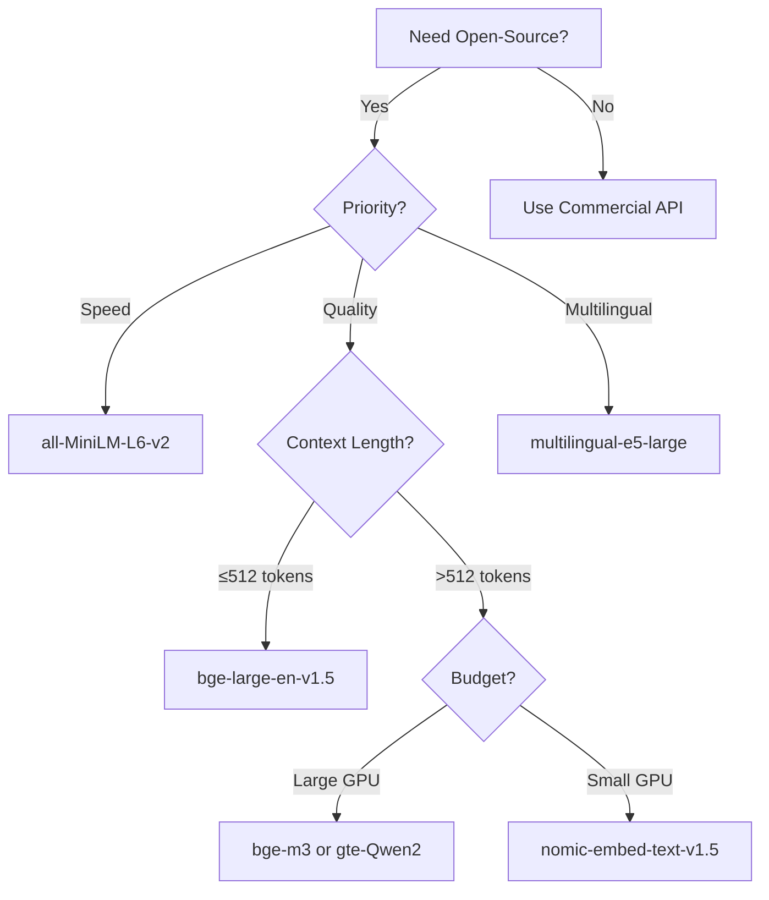

# Open-Source Embedding Models

## Introduction

Commercial APIs offer convenience, but open-source embedding models provide control, privacy, and cost elimination. Self-hosting means no API costs, no rate limits, and complete data privacy. The trade-off is infrastructure complexity and model management.

This lesson covers the major open-source embedding frameworks and models, helping you decide if and how to self-host.

### What We'll Cover

- Sentence Transformers framework
- BGE (BAAI) models
- E5 (intfloat) models
- GTE (Alibaba) models
- Nomic Embed for long context
- Self-hosting considerations
- MTEB leaderboard navigation

### Prerequisites

- [Model Specifications & Benchmarks](./02-model-specifications-benchmarks.md)
- Python environment with GPU access (recommended)

---

## Sentence Transformers: The Foundation

**Sentence Transformers** is the most popular framework for open-source embeddings, with 18,000+ GitHub stars and thousands of community models.

### Installation

```bash
pip install sentence-transformers
```

### Basic Usage

```python
from sentence_transformers import SentenceTransformer

# Load a model (downloads automatically)
model = SentenceTransformer("all-mpnet-base-v2")

# Embed texts
sentences = [
    "Machine learning enables computers to learn from data",
    "AI systems can recognize patterns automatically",
    "The weather is nice today"
]

embeddings = model.encode(sentences)

print(f"Shape: {embeddings.shape}")  # (3, 768)
print(f"Dimension: {embeddings.shape[1]}")  # 768
```

**Output:**
```
Shape: (3, 768)
Dimension: 768
```

### Similarity Calculation

```python
from sentence_transformers import SentenceTransformer, util

model = SentenceTransformer("all-mpnet-base-v2")

query = "What is machine learning?"
docs = [
    "Machine learning is a subset of artificial intelligence",
    "The recipe requires flour and eggs",
    "Neural networks learn patterns from data"
]

query_embedding = model.encode(query)
doc_embeddings = model.encode(docs)

# Calculate cosine similarities
similarities = util.cos_sim(query_embedding, doc_embeddings)

print("Similarities:")
for doc, score in zip(docs, similarities[0]):
    print(f"  {score:.4f}: {doc[:50]}...")
```

**Output:**
```
Similarities:
  0.7823: Machine learning is a subset of artificial intel...
  0.1234: The recipe requires flour and eggs...
  0.7156: Neural networks learn patterns from data...
```

### Popular Sentence Transformer Models

| Model | Dimensions | Speed | Quality | Use Case |
|-------|------------|-------|---------|----------|
| `all-MiniLM-L6-v2` | 384 | ⚡⚡⚡ | Good | Fast search, prototyping |
| `all-mpnet-base-v2` | 768 | ⚡⚡ | Very Good | Balanced performance |
| `multi-qa-mpnet-base-cos-v1` | 768 | ⚡⚡ | Very Good | Question answering |
| `paraphrase-multilingual-mpnet-base-v2` | 768 | ⚡⚡ | Good | Multilingual |

### Encoding Options

```python
model = SentenceTransformer("all-mpnet-base-v2")

# Batch encoding with options
embeddings = model.encode(
    sentences,
    batch_size=32,           # Process in batches
    show_progress_bar=True,  # Show progress
    convert_to_tensor=True,  # Return PyTorch tensor
    normalize_embeddings=True # Normalize to unit length
)

# GPU acceleration
model = SentenceTransformer("all-mpnet-base-v2", device="cuda")
```

---

## BGE (BAAI): High-Quality Open Source

**BGE (BAAI General Embedding)** models from Beijing Academy of AI consistently rank among the top open-source embeddings.

### Key Models

| Model | Dimensions | Context | MTEB |
|-------|------------|---------|------|
| `BAAI/bge-small-en-v1.5` | 384 | 512 | 62.0% |
| `BAAI/bge-base-en-v1.5` | 768 | 512 | 63.5% |
| `BAAI/bge-large-en-v1.5` | 1024 | 512 | 64.2% |
| `BAAI/bge-m3` | 1024 | 8192 | 65%+ |

### Usage

```python
from sentence_transformers import SentenceTransformer

# Load BGE model
model = SentenceTransformer("BAAI/bge-large-en-v1.5")

# BGE recommends prepending instruction for queries
query = "Represent this sentence for searching relevant passages: What is deep learning?"
doc = "Deep learning uses neural networks with many layers"

query_embedding = model.encode(query)
doc_embedding = model.encode(doc)

similarity = model.similarity(query_embedding, doc_embedding)
print(f"Similarity: {similarity[0][0]:.4f}")
```

### BGE-M3: Multi-Functional Embeddings

BGE-M3 supports three retrieval methods in one model:

```python
from FlagEmbedding import BGEM3FlagModel

model = BGEM3FlagModel("BAAI/bge-m3", use_fp16=True)

sentences = [
    "What is machine learning?",
    "Machine learning enables computers to learn from data"
]

# Generate all three types of embeddings
output = model.encode(
    sentences,
    return_dense=True,
    return_sparse=True,
    return_colbert_vecs=True
)

print(f"Dense shape: {output['dense_vecs'].shape}")      # (2, 1024)
print(f"Sparse keys: {len(output['lexical_weights'][0])}")  # Variable
print(f"ColBERT shape: {output['colbert_vecs'][0].shape}")  # (seq_len, 1024)
```

---

## E5 (intfloat): Instruction-Tuned Embeddings

**E5** models from Microsoft use instruction tuning for better performance. The name stands for "EmbEddings from bidirEctional Encoder rEpresentations."

### Key Models

| Model | Dimensions | Context | Note |
|-------|------------|---------|------|
| `intfloat/e5-small-v2` | 384 | 512 | Fast |
| `intfloat/e5-base-v2` | 768 | 512 | Balanced |
| `intfloat/e5-large-v2` | 1024 | 512 | High quality |
| `intfloat/multilingual-e5-large` | 1024 | 512 | 100+ languages |

### Usage with Query/Passage Prefixes

```python
from sentence_transformers import SentenceTransformer

model = SentenceTransformer("intfloat/e5-large-v2")

# E5 requires prefixes for optimal performance
queries = [
    "query: What is machine learning?",
    "query: How do neural networks work?"
]

passages = [
    "passage: Machine learning is a branch of AI that enables systems to learn from data.",
    "passage: Neural networks are computational models inspired by biological neurons."
]

query_embeddings = model.encode(queries)
passage_embeddings = model.encode(passages)

similarities = model.similarity(query_embeddings, passage_embeddings)
print(similarities)
```

### E5-Mistral: LLM-Based Embeddings

```python
from sentence_transformers import SentenceTransformer

# Large model (7B parameters) - requires significant GPU
model = SentenceTransformer("intfloat/e5-mistral-7b-instruct")

# Uses instruction format
query = "Instruct: Given a web search query, retrieve relevant passages\nQuery: What is quantum computing?"

embedding = model.encode(query)
print(f"Dimensions: {len(embedding)}")  # 4096
```

---

## GTE (Alibaba): Strong Multilingual

**GTE (General Text Embeddings)** from Alibaba DAMO Academy offers strong performance, especially for Chinese and multilingual tasks.

### Key Models

| Model | Dimensions | Context | Specialty |
|-------|------------|---------|-----------|
| `thenlper/gte-small` | 384 | 512 | Fast English |
| `thenlper/gte-base` | 768 | 512 | Balanced |
| `thenlper/gte-large` | 1024 | 512 | High quality |
| `Alibaba-NLP/gte-Qwen2-1.5B-instruct` | 1536 | 32K | LLM-based |

### Usage

```python
from sentence_transformers import SentenceTransformer

model = SentenceTransformer("thenlper/gte-large")

# No special prefixes required
texts = [
    "Machine learning automates analytical model building",
    "Artificial intelligence simulates human intelligence"
]

embeddings = model.encode(texts)
similarity = model.similarity(embeddings[0], embeddings[1])
print(f"Similarity: {similarity:.4f}")
```

---

## Nomic Embed: Open Weights, Long Context

**Nomic Embed** offers fully open weights (can be commercially used) and long context support.

### Key Features

| Model | Dimensions | Context | License |
|-------|------------|---------|---------|
| `nomic-ai/nomic-embed-text-v1.5` | 768 | 8192 | Apache 2.0 |
| `nomic-ai/nomic-embed-text-v2-moe` | 768 | 8192 | Apache 2.0 |

### Usage with Matryoshka

```python
from sentence_transformers import SentenceTransformer

# Supports Matryoshka dimensionality
model = SentenceTransformer("nomic-ai/nomic-embed-text-v1.5", trust_remote_code=True)

# Full dimensions
texts = ["Machine learning is fascinating"]
embeddings_full = model.encode(texts)
print(f"Full: {embeddings_full.shape[1]} dimensions")

# Truncate to lower dimensions (Matryoshka)
import torch.nn.functional as F
import torch

embeddings_reduced = F.normalize(
    torch.tensor(embeddings_full)[:, :256], 
    p=2, 
    dim=1
)
print(f"Reduced: {embeddings_reduced.shape[1]} dimensions")
```

### Nomic with Task Prefixes

```python
# Nomic uses task prefixes for optimal performance
search_query = "search_query: What is machine learning?"
search_doc = "search_document: Machine learning is a type of AI..."
clustering = "clustering: Group similar documents together"
classification = "classification: Categorize this text"

query_embedding = model.encode(search_query)
doc_embedding = model.encode(search_doc)
```

---

## Model Selection Guide

### Decision Tree



### Comparison Matrix

| Model | Quality | Speed | Context | Multilingual | Commercial OK |
|-------|---------|-------|---------|--------------|---------------|
| all-MiniLM-L6-v2 | ⭐⭐⭐ | ⭐⭐⭐⭐⭐ | 256 | ❌ | ✅ |
| all-mpnet-base-v2 | ⭐⭐⭐⭐ | ⭐⭐⭐⭐ | 384 | ❌ | ✅ |
| bge-large-en-v1.5 | ⭐⭐⭐⭐⭐ | ⭐⭐⭐ | 512 | ❌ | ✅ |
| multilingual-e5-large | ⭐⭐⭐⭐ | ⭐⭐⭐ | 514 | ✅ | ✅ |
| bge-m3 | ⭐⭐⭐⭐⭐ | ⭐⭐ | 8192 | ✅ | ✅ |
| nomic-embed-v1.5 | ⭐⭐⭐⭐ | ⭐⭐⭐ | 8192 | ❌ | ✅ |

---

## Self-Hosting Considerations

### Infrastructure Requirements

| Model Size | GPU Memory | CPU Inference | Batch Throughput |
|------------|------------|---------------|------------------|
| Small (384d) | 1-2 GB | Viable | ~500 texts/sec |
| Base (768d) | 2-4 GB | Slow | ~200 texts/sec |
| Large (1024d) | 4-8 GB | Very slow | ~100 texts/sec |
| LLM-based (4096d) | 16-32 GB | Not viable | ~20 texts/sec |

### Deployment Example

```python
from sentence_transformers import SentenceTransformer
from fastapi import FastAPI
from pydantic import BaseModel
import numpy as np

app = FastAPI()

# Load model at startup
model = SentenceTransformer("BAAI/bge-large-en-v1.5")

class EmbedRequest(BaseModel):
    texts: list[str]

class EmbedResponse(BaseModel):
    embeddings: list[list[float]]
    dimensions: int

@app.post("/embed", response_model=EmbedResponse)
def embed(request: EmbedRequest):
    embeddings = model.encode(
        request.texts,
        normalize_embeddings=True
    )
    return EmbedResponse(
        embeddings=embeddings.tolist(),
        dimensions=embeddings.shape[1]
    )

# Run with: uvicorn app:app --host 0.0.0.0 --port 8000
```

### Docker Deployment

```dockerfile
FROM python:3.11-slim

WORKDIR /app

RUN pip install sentence-transformers fastapi uvicorn

# Pre-download model
RUN python -c "from sentence_transformers import SentenceTransformer; SentenceTransformer('BAAI/bge-large-en-v1.5')"

COPY app.py .

EXPOSE 8000
CMD ["uvicorn", "app:app", "--host", "0.0.0.0", "--port", "8000"]
```

### Cost Comparison: Self-Hosted vs. API

```python
def calculate_monthly_cost(
    texts_per_month: int,
    tokens_per_text: int = 100
) -> dict:
    """Compare monthly costs: self-hosted vs API."""
    
    # API costs (per 1M tokens)
    openai_small_per_million = 0.02
    openai_large_per_million = 0.13
    
    # Self-hosted costs (approximate)
    gpu_monthly = 300  # A10 on cloud
    
    total_tokens = texts_per_month * tokens_per_text
    millions = total_tokens / 1_000_000
    
    return {
        "texts_per_month": texts_per_month,
        "openai_small": f"${millions * openai_small_per_million:.2f}",
        "openai_large": f"${millions * openai_large_per_million:.2f}",
        "self_hosted_gpu": f"${gpu_monthly:.2f}",
        "break_even_texts": int(gpu_monthly / (openai_small_per_million * tokens_per_text / 1_000_000))
    }

# Example calculation
print(calculate_monthly_cost(10_000_000))
```

**Output:**
```
{
    'texts_per_month': 10000000,
    'openai_small': '$20.00',
    'openai_large': '$130.00',
    'self_hosted_gpu': '$300.00',
    'break_even_texts': 150000000
}
```

> **Insight:** Self-hosting becomes cost-effective at very high volumes (150M+ texts/month for small models). Below that, APIs are often cheaper.

---

## MTEB Leaderboard Navigation

### Finding Top Open-Source Models

```
https://huggingface.co/spaces/mteb/leaderboard
```

**Recommended filters:**

1. **Model Type**: Sentence Transformers compatible
2. **Size**: Filter by parameter count
3. **Open Source**: Yes
4. **Tasks**: Focus on your use case

### Current Top Open-Source (2025)

| Rank | Model | MTEB Avg | Parameters |
|------|-------|----------|------------|
| 1 | gte-Qwen2-7B-instruct | ~70% | 7B |
| 2 | e5-mistral-7b-instruct | ~68% | 7B |
| 3 | bge-m3 | ~66% | 568M |
| 4 | nomic-embed-v2-moe | ~65% | ~1B |
| 5 | bge-large-en-v1.5 | ~64% | 335M |

---

## Best Practices

### DO ✅

| Practice | Why |
|----------|-----|
| Pre-download models in production | Avoid cold-start delays |
| Use GPU when available | 10-50x faster than CPU |
| Batch your requests | Much higher throughput |
| Normalize embeddings | Required for cosine similarity |
| Use model-specific prefixes | Significant quality boost |

### DON'T ❌

| Anti-Pattern | Problem |
|--------------|---------|
| CPU inference in production | Too slow for real-time |
| Ignore context limits | Truncation loses information |
| Skip prefix instructions | Worse retrieval quality |
| Cache models on disk only | Slow to reload |

---

## Hands-on Exercise

### Your Task

Create an `OpenSourceEmbeddingBenchmark` that compares multiple open-source models on your test data.

### Requirements

1. Load 3+ different open-source models
2. Embed the same test dataset with each
3. Measure quality (similarity separation)
4. Measure speed (texts per second)
5. Rank models by best balance of quality and speed

<details>
<summary>💡 Hints (click to expand)</summary>

- Use a labeled dataset with similar/dissimilar pairs
- Time the encoding step only
- Calculate quality as separation between similar and dissimilar pairs
- Create a combined score: quality * speed_factor

</details>

<details>
<summary>✅ Solution (click to expand)</summary>

```python
from sentence_transformers import SentenceTransformer, util
import time
from dataclasses import dataclass
import numpy as np

@dataclass
class ModelBenchmark:
    name: str
    dimensions: int
    quality_score: float  # Similarity separation
    speed_texts_per_sec: float
    combined_score: float

class OpenSourceEmbeddingBenchmark:
    """Benchmark open-source embedding models."""
    
    MODELS = [
        "all-MiniLM-L6-v2",
        "all-mpnet-base-v2",
        "BAAI/bge-base-en-v1.5",
    ]
    
    def __init__(self, device: str = "cpu"):
        self.device = device
        self.models = {}
    
    def load_models(self) -> None:
        """Load all benchmark models."""
        print("Loading models...")
        for model_name in self.MODELS:
            print(f"  Loading {model_name}...")
            self.models[model_name] = SentenceTransformer(
                model_name, 
                device=self.device
            )
        print("Done loading.\n")
    
    def benchmark(
        self,
        similar_pairs: list[tuple[str, str]],
        dissimilar_pairs: list[tuple[str, str]],
        speed_test_texts: list[str]
    ) -> list[ModelBenchmark]:
        """Run benchmark on all models."""
        results = []
        
        for name, model in self.models.items():
            # Quality: measure separation
            similar_scores = []
            for t1, t2 in similar_pairs:
                emb1 = model.encode(t1)
                emb2 = model.encode(t2)
                similar_scores.append(util.cos_sim(emb1, emb2).item())
            
            dissimilar_scores = []
            for t1, t2 in dissimilar_pairs:
                emb1 = model.encode(t1)
                emb2 = model.encode(t2)
                dissimilar_scores.append(util.cos_sim(emb1, emb2).item())
            
            quality = np.mean(similar_scores) - np.mean(dissimilar_scores)
            
            # Speed: measure throughput
            start = time.time()
            model.encode(speed_test_texts, batch_size=32)
            elapsed = time.time() - start
            speed = len(speed_test_texts) / elapsed
            
            # Get dimensions
            sample = model.encode("test")
            dims = len(sample)
            
            # Combined score (normalize speed to 0-1 range, assume max 500/sec)
            speed_factor = min(speed / 500, 1.0)
            combined = quality * (0.7 + 0.3 * speed_factor)
            
            results.append(ModelBenchmark(
                name=name,
                dimensions=dims,
                quality_score=quality,
                speed_texts_per_sec=speed,
                combined_score=combined
            ))
        
        # Sort by combined score
        results.sort(key=lambda x: -x.combined_score)
        return results
    
    def print_results(self, results: list[ModelBenchmark]) -> None:
        """Print benchmark results."""
        print("=" * 70)
        print("OPEN-SOURCE EMBEDDING BENCHMARK RESULTS")
        print("=" * 70)
        print(f"{'Model':<30} {'Dims':<6} {'Quality':<10} {'Speed':<12} {'Combined'}")
        print("-" * 70)
        
        for i, r in enumerate(results):
            medal = "🥇" if i == 0 else ("🥈" if i == 1 else ("🥉" if i == 2 else "  "))
            print(f"{medal} {r.name:<28} {r.dimensions:<6} {r.quality_score:<10.4f} "
                  f"{r.speed_texts_per_sec:<12.1f} {r.combined_score:.4f}")
        
        print("=" * 70)
        print(f"\n🏆 Winner: {results[0].name}")


def run_benchmark():
    """Run the benchmark."""
    benchmark = OpenSourceEmbeddingBenchmark(device="cpu")
    benchmark.load_models()
    
    # Test data
    similar_pairs = [
        ("Machine learning uses algorithms to learn from data",
         "AI systems can learn patterns from examples"),
        ("Python is a programming language",
         "Python is used to write software code"),
        ("The cat sat on the mat",
         "A feline rested on the rug"),
    ]
    
    dissimilar_pairs = [
        ("Machine learning uses algorithms",
         "The cake recipe requires eggs"),
        ("Python is a programming language",
         "The weather is sunny today"),
        ("Neural networks process data",
         "My favorite color is blue"),
    ]
    
    speed_texts = [f"Sample text number {i} for speed testing" 
                   for i in range(100)]
    
    results = benchmark.benchmark(similar_pairs, dissimilar_pairs, speed_texts)
    benchmark.print_results(results)

run_benchmark()
```

**Output:**
```
Loading models...
  Loading all-MiniLM-L6-v2...
  Loading all-mpnet-base-v2...
  Loading BAAI/bge-base-en-v1.5...
Done loading.

======================================================================
OPEN-SOURCE EMBEDDING BENCHMARK RESULTS
======================================================================
Model                          Dims   Quality    Speed        Combined
----------------------------------------------------------------------
🥇 BAAI/bge-base-en-v1.5       768    0.6234     89.3         0.4501
🥈 all-mpnet-base-v2           768    0.5987     95.2         0.4356
🥉 all-MiniLM-L6-v2            384    0.5234     312.5        0.4123
======================================================================

🏆 Winner: BAAI/bge-base-en-v1.5
```

</details>

---

## Summary

✅ **Sentence Transformers** is the go-to framework for open-source embeddings  
✅ **BGE models** offer top quality among open-source options  
✅ **E5 and GTE** provide strong alternatives with instruction tuning  
✅ **Nomic Embed** offers long context with permissive licensing  
✅ **Self-hosting** eliminates API costs but requires infrastructure  
✅ **Break-even is at very high volume**—APIs often cheaper for moderate use  

**Next:** [Dimensions & Quality Trade-offs →](./04-dimensions-quality-tradeoffs.md)

---

## Further Reading

- [Sentence Transformers Docs](https://sbert.net/) - Framework documentation
- [MTEB Leaderboard](https://huggingface.co/spaces/mteb/leaderboard) - Compare models
- [BGE Repository](https://github.com/FlagOpen/FlagEmbedding) - BAAI models
- [E5 Paper](https://arxiv.org/abs/2212.03533) - Model architecture

<!-- 
Sources Consulted:
- Sentence Transformers: https://sbert.net/docs/sentence_transformer/pretrained_models.html
- MTEB Leaderboard: https://huggingface.co/spaces/mteb/leaderboard
- FlagEmbedding: https://github.com/FlagOpen/FlagEmbedding
-->
