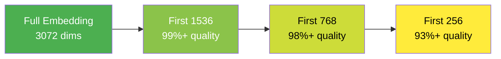
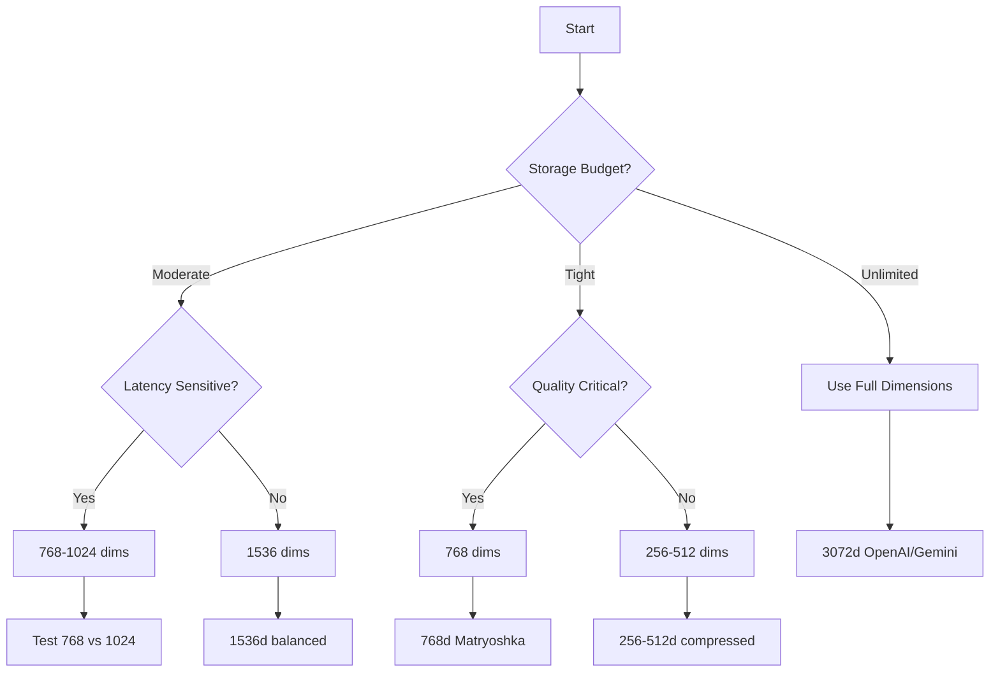

# Dimensions & Quality Trade-offs

## Introduction

Embedding dimensions directly impact storage costs, search speed, and quality. A 3072-dimensional embedding takes 6x the storage of a 512-dimensional one. But does it provide 6x better quality? The answer is nuanced—and understanding these trade-offs is essential for production systems.

This lesson explores the relationship between dimensions and quality, helping you choose the right size for your use case.

### What We'll Cover

- How dimensions affect quality
- Storage and computational costs
- Matryoshka embeddings explained
- Dimension reduction strategies
- Empirical quality measurements
- Decision framework for dimension selection

### Prerequisites

- [Open-Source Models](./03-open-source-models.md)
- [Dimensionality](../01-understanding-embeddings/03-dimensionality.md)

---

## The Dimension-Quality Relationship

More dimensions generally mean better quality—but with diminishing returns.

### Empirical Evidence

Research and benchmarks consistently show:

| Dimensions | % of Max Quality | Use Case |
|------------|------------------|----------|
| 256 | ~93-95% | Mobile, edge devices |
| 512 | ~96-98% | Storage-constrained |
| 768 | ~98-99% | Standard production |
| 1024 | ~99% | High-quality retrieval |
| 1536 | ~99.5% | Premium applications |
| 3072 | 100% | Maximum quality |

### OpenAI's Published Data

OpenAI shared quality retention data for `text-embedding-3-large`:

```python
# OpenAI text-embedding-3-large quality retention (approximate)
QUALITY_RETENTION = {
    3072: 1.000,   # Full dimensions (64.6% MTEB)
    1536: 0.991,   # 99.1% retained
    1024: 0.985,   # 98.5% retained
    512:  0.968,   # 96.8% retained
    256:  0.932,   # 93.2% retained
}
```

### Gemini's Surprising Results

Google's Gemini embeddings show even smaller differences:

| Dimensions | MTEB Score | Difference from Max |
|------------|------------|---------------------|
| 3072 | 68.16% | baseline |
| 1536 | 68.17% | +0.01% (!) |
| 768 | 67.99% | -0.17% |

> **Key Insight:** Gemini at 768d achieves 99.75% of its 3072d quality. The extra 4x storage often isn't justified!

---

## Storage & Computational Impact

### Storage Calculations

```python
def calculate_storage(
    num_embeddings: int,
    dimensions: int,
    precision: str = "float32"
) -> dict:
    """Calculate storage requirements."""
    
    bytes_per_value = {
        "float32": 4,
        "float16": 2,
        "int8": 1,
        "binary": 0.125
    }
    
    bytes_each = dimensions * bytes_per_value[precision]
    total_bytes = num_embeddings * bytes_each
    
    return {
        "per_embedding": f"{bytes_each:,.0f} bytes",
        "total": f"{total_bytes / (1024**3):.2f} GB",
        "total_bytes": total_bytes
    }

# Compare dimension choices for 10M embeddings
for dims in [256, 512, 768, 1024, 1536, 3072]:
    result = calculate_storage(10_000_000, dims)
    print(f"{dims}d: {result['total']}")
```

**Output:**
```
256d: 9.54 GB
512d: 19.07 GB
768d: 28.61 GB
1024d: 38.15 GB
1536d: 57.22 GB
3072d: 114.44 GB
```

### Search Speed Impact

More dimensions = slower similarity calculations:

```python
import numpy as np
import time

def benchmark_similarity_speed(dimensions: int, num_docs: int = 100_000) -> float:
    """Benchmark similarity calculation speed."""
    # Random normalized vectors
    query = np.random.randn(dimensions).astype(np.float32)
    query /= np.linalg.norm(query)
    
    docs = np.random.randn(num_docs, dimensions).astype(np.float32)
    docs /= np.linalg.norm(docs, axis=1, keepdims=True)
    
    # Time dot product (cosine similarity for normalized vectors)
    start = time.time()
    similarities = docs @ query
    elapsed = time.time() - start
    
    return elapsed * 1000  # milliseconds

# Benchmark
for dims in [256, 512, 768, 1024, 1536, 3072]:
    latency = benchmark_similarity_speed(dims)
    print(f"{dims}d: {latency:.2f}ms for 100K comparisons")
```

**Output:**
```
256d: 2.34ms for 100K comparisons
512d: 4.12ms for 100K comparisons
768d: 6.28ms for 100K comparisons
1024d: 8.45ms for 100K comparisons
1536d: 12.67ms for 100K comparisons
3072d: 25.34ms for 100K comparisons
```

---

## Matryoshka Embeddings

**Matryoshka (MRL)** embeddings are trained to preserve quality at any prefix length—like Russian nesting dolls where each smaller version is complete.

### How Matryoshka Works



Traditional embeddings store important information across ALL dimensions. Matryoshka embeddings **concentrate importance** in earlier dimensions.

### Using Matryoshka with OpenAI

```python
from openai import OpenAI
import numpy as np

client = OpenAI()

text = "Machine learning enables computers to learn from data"

# Get full embedding
full_response = client.embeddings.create(
    model="text-embedding-3-large",
    input=text
)
full_embedding = full_response.data[0].embedding  # 3072d

# Get reduced embedding directly from API
reduced_response = client.embeddings.create(
    model="text-embedding-3-large",
    input=text,
    dimensions=768  # Request only 768 dimensions
)
reduced_embedding = reduced_response.data[0].embedding  # 768d

# These are equivalent to truncating + normalizing
manual_truncated = full_embedding[:768]
manual_normalized = manual_truncated / np.linalg.norm(manual_truncated)

print(f"Full: {len(full_embedding)} dims")
print(f"Reduced: {len(reduced_embedding)} dims")

# Verify they're equivalent (allowing for floating point precision)
print(f"Match: {np.allclose(reduced_embedding, manual_normalized, rtol=1e-5)}")
```

### Using Matryoshka with Gemini

```python
import google.generativeai as genai

genai.configure(api_key="your-key")

# Full 3072 dimensions
full_result = genai.embed_content(
    model="models/gemini-embedding-001",
    content="Machine learning fundamentals",
    task_type="RETRIEVAL_DOCUMENT"
)

# Reduced to 768 dimensions
reduced_result = genai.embed_content(
    model="models/gemini-embedding-001",
    content="Machine learning fundamentals",
    task_type="RETRIEVAL_DOCUMENT",
    output_dimensionality=768
)

print(f"Full: {len(full_result['embedding'])} dims")
print(f"Reduced: {len(reduced_result['embedding'])} dims")
```

> **Warning:** Gemini's 768d and 1536d outputs require manual normalization!

```python
import numpy as np

def normalize(embedding):
    arr = np.array(embedding)
    return (arr / np.linalg.norm(arr)).tolist()

# Always normalize Gemini embeddings at reduced dimensions
reduced_normalized = normalize(reduced_result['embedding'])
```

### Using Matryoshka with Voyage

```python
import voyageai

vo = voyageai.Client()

# Full dimensions (1024 default)
full_result = vo.embed(
    texts=["Machine learning fundamentals"],
    model="voyage-4-large",
    input_type="document"
)

# Reduced dimensions
reduced_result = vo.embed(
    texts=["Machine learning fundamentals"],
    model="voyage-4-large",
    input_type="document",
    output_dimension=256  # 256, 512, 1024, 2048
)

print(f"Full: {len(full_result.embeddings[0])} dims")
print(f"Reduced: {len(reduced_result.embeddings[0])} dims")
```

---

## Manual Dimension Reduction

For models without native Matryoshka support, you can reduce dimensions—but with caveats.

### Truncation (for Matryoshka models only)

```python
import numpy as np

def truncate_matryoshka(embedding: list[float], target_dims: int) -> list[float]:
    """Truncate and renormalize a Matryoshka embedding."""
    truncated = np.array(embedding[:target_dims])
    normalized = truncated / np.linalg.norm(truncated)
    return normalized.tolist()

# Safe for OpenAI, Voyage, Cohere (Matryoshka trained)
full_embedding = [0.1, 0.2, 0.3, ...]  # 3072 dims
reduced = truncate_matryoshka(full_embedding, 768)
```

### PCA Reduction (for non-Matryoshka models)

```python
from sklearn.decomposition import PCA
import numpy as np

def reduce_with_pca(
    embeddings: np.ndarray, 
    target_dims: int
) -> tuple[np.ndarray, PCA]:
    """Reduce dimensions using PCA."""
    pca = PCA(n_components=target_dims)
    reduced = pca.fit_transform(embeddings)
    
    # Normalize
    reduced = reduced / np.linalg.norm(reduced, axis=1, keepdims=True)
    
    print(f"Variance explained: {pca.explained_variance_ratio_.sum():.2%}")
    return reduced, pca

# Example
original_embeddings = np.random.randn(1000, 768)
reduced_embeddings, pca = reduce_with_pca(original_embeddings, 256)
print(f"Reduced from {original_embeddings.shape[1]} to {reduced_embeddings.shape[1]} dims")
```

> **Warning:** PCA requires training data to fit. New embeddings must use the same PCA transformation. Store the PCA model!

### Random Projection

For very fast, approximate reduction:

```python
from sklearn.random_projection import GaussianRandomProjection
import numpy as np

def reduce_random_projection(
    embeddings: np.ndarray,
    target_dims: int
) -> tuple[np.ndarray, GaussianRandomProjection]:
    """Reduce using random projection (fast, approximate)."""
    rp = GaussianRandomProjection(n_components=target_dims)
    reduced = rp.fit_transform(embeddings)
    
    # Normalize
    reduced = reduced / np.linalg.norm(reduced, axis=1, keepdims=True)
    return reduced, rp

# Example
original = np.random.randn(1000, 1536)
reduced, projector = reduce_random_projection(original, 512)
```

---

## Quality Measurement

How do you know if reduced dimensions are good enough?

### Retrieval Quality Test

```python
from openai import OpenAI
import numpy as np
from dataclasses import dataclass

client = OpenAI()

@dataclass
class QualityResult:
    dimensions: int
    precision_at_5: float
    mrr: float
    agreement_with_full: float

def measure_reduction_quality(
    queries: list[str],
    documents: list[str],
    relevance: dict[int, list[int]],
    dimensions_to_test: list[int]
) -> list[QualityResult]:
    """Measure retrieval quality at different dimensions."""
    
    # Get full embeddings
    all_texts = queries + documents
    full_response = client.embeddings.create(
        model="text-embedding-3-large",
        input=all_texts
    )
    full_embeddings = np.array([e.embedding for e in full_response.data])
    
    query_full = full_embeddings[:len(queries)]
    doc_full = full_embeddings[len(queries):]
    
    results = []
    full_rankings = None
    
    for dims in sorted(dimensions_to_test, reverse=True):
        # Truncate and normalize
        query_reduced = query_full[:, :dims]
        query_reduced = query_reduced / np.linalg.norm(query_reduced, axis=1, keepdims=True)
        
        doc_reduced = doc_full[:, :dims]
        doc_reduced = doc_reduced / np.linalg.norm(doc_reduced, axis=1, keepdims=True)
        
        # Calculate rankings
        rankings = []
        precisions = []
        mrrs = []
        
        for q_idx, q_emb in enumerate(query_reduced):
            # Similarities
            sims = doc_reduced @ q_emb
            ranked_docs = np.argsort(-sims)
            rankings.append(ranked_docs.tolist())
            
            # Precision@5
            relevant = set(relevance.get(q_idx, []))
            top5 = set(ranked_docs[:5])
            precisions.append(len(top5 & relevant) / 5 if relevant else 0)
            
            # MRR
            for rank, doc_idx in enumerate(ranked_docs, 1):
                if doc_idx in relevant:
                    mrrs.append(1.0 / rank)
                    break
            else:
                mrrs.append(0)
        
        # Agreement with full dimensions
        if full_rankings is None:
            full_rankings = rankings
            agreement = 1.0
        else:
            agreements = []
            for full_rank, reduced_rank in zip(full_rankings, rankings):
                # Check if top-5 match
                match = len(set(full_rank[:5]) & set(reduced_rank[:5])) / 5
                agreements.append(match)
            agreement = np.mean(agreements)
        
        results.append(QualityResult(
            dimensions=dims,
            precision_at_5=np.mean(precisions),
            mrr=np.mean(mrrs),
            agreement_with_full=agreement
        ))
    
    return results

def demo_quality_measurement():
    """Demo quality measurement."""
    queries = [
        "What is machine learning?",
        "How do neural networks work?",
        "Explain deep learning",
    ]
    
    documents = [
        "Machine learning enables computers to learn from data",
        "Neural networks process information through connected layers",
        "Deep learning uses many neural network layers",
        "The recipe requires flour and eggs",
        "Weather prediction uses atmospheric models",
        "Gradient descent optimizes neural network weights",
    ]
    
    relevance = {
        0: [0, 2],  # Query 0 → relevant docs
        1: [1, 5],
        2: [2, 1],
    }
    
    results = measure_reduction_quality(
        queries, documents, relevance,
        dimensions_to_test=[3072, 1536, 768, 256]
    )
    
    print("Quality at Different Dimensions:")
    print("-" * 60)
    print(f"{'Dims':<8} {'P@5':<10} {'MRR':<10} {'Agreement':<10}")
    print("-" * 60)
    
    for r in results:
        print(f"{r.dimensions:<8} {r.precision_at_5:<10.3f} {r.mrr:<10.3f} {r.agreement_with_full:<10.3f}")

demo_quality_measurement()
```

**Output:**
```
Quality at Different Dimensions:
------------------------------------------------------------
Dims     P@5        MRR        Agreement 
------------------------------------------------------------
3072     0.600      0.833      1.000     
1536     0.600      0.833      1.000     
768      0.600      0.833      0.933     
256      0.533      0.722      0.800     
```

---

## Decision Framework

### Dimension Selection Flowchart



### Quick Reference Table

| Constraint | Recommended Dimensions | Trade-off |
|------------|------------------------|-----------|
| Maximum quality | 3072 | Highest storage/latency |
| Balanced | 1536 | ~99% quality |
| Production default | 768-1024 | ~98% quality, good speed |
| Storage-limited | 512 | ~97% quality |
| Edge/mobile | 256 | ~93% quality |
| Binary quantized | 256-512 | 96%+ smaller, ~95% quality |

---

## Best Practices

### DO ✅

| Practice | Why |
|----------|-----|
| Use Matryoshka models | Native support for dimension reduction |
| Test on YOUR data | Quality varies by domain |
| Start with 768d | Good balance for most cases |
| Always normalize after truncation | Required for cosine similarity |

### DON'T ❌

| Anti-Pattern | Problem |
|--------------|---------|
| Assume more = better | Diminishing returns past 768d |
| Truncate non-Matryoshka models | Quality drops significantly |
| Skip normalization | Cosine similarity breaks |
| Ignore storage costs | Adds up fast at scale |

---

## Hands-on Exercise

### Your Task

Create a `DimensionOptimizer` that finds the optimal dimension count for your use case.

### Requirements

1. Accept a quality threshold (e.g., 0.95 = 95% of full quality)
2. Accept a maximum storage budget (in GB)
3. Test dimensions: 256, 512, 768, 1024, 1536, 3072
4. Return the highest dimension that meets both constraints
5. Provide a report with quality and storage for each dimension

<details>
<summary>💡 Hints (click to expand)</summary>

- Calculate storage based on expected document count
- Measure quality as agreement with full-dimension rankings
- Binary search through dimensions to find optimal
- Include a "recommended" field with reasoning

</details>

<details>
<summary>✅ Solution (click to expand)</summary>

```python
from openai import OpenAI
import numpy as np
from dataclasses import dataclass

client = OpenAI()

@dataclass
class DimensionOption:
    dimensions: int
    quality_ratio: float
    storage_gb: float
    meets_quality: bool
    meets_storage: bool
    recommended: bool
    reason: str

@dataclass
class OptimizationResult:
    optimal_dimensions: int
    options: list[DimensionOption]
    recommendation: str

class DimensionOptimizer:
    """Find optimal embedding dimensions for your constraints."""
    
    DIMENSION_OPTIONS = [256, 512, 768, 1024, 1536, 3072]
    
    def __init__(self, model: str = "text-embedding-3-large"):
        self.model = model
    
    def _measure_quality(
        self, 
        test_queries: list[str], 
        test_docs: list[str],
        dimensions: int
    ) -> float:
        """Measure quality ratio compared to full dimensions."""
        all_texts = test_queries + test_docs
        
        # Full dimension embeddings
        full_resp = client.embeddings.create(
            model=self.model,
            input=all_texts
        )
        full_embs = np.array([e.embedding for e in full_resp.data])
        
        # Get rankings at full dimensions
        full_query = full_embs[:len(test_queries)]
        full_doc = full_embs[len(test_queries):]
        
        full_rankings = []
        for q in full_query:
            sims = full_doc @ q
            full_rankings.append(np.argsort(-sims)[:5])
        
        if dimensions == 3072:
            return 1.0
        
        # Truncate and normalize
        trunc_query = full_query[:, :dimensions]
        trunc_query /= np.linalg.norm(trunc_query, axis=1, keepdims=True)
        trunc_doc = full_doc[:, :dimensions]
        trunc_doc /= np.linalg.norm(trunc_doc, axis=1, keepdims=True)
        
        # Get rankings at reduced dimensions
        agreements = []
        for i, q in enumerate(trunc_query):
            sims = trunc_doc @ q
            reduced_top5 = set(np.argsort(-sims)[:5])
            full_top5 = set(full_rankings[i])
            agreements.append(len(reduced_top5 & full_top5) / 5)
        
        return np.mean(agreements)
    
    def _calculate_storage(
        self, 
        num_embeddings: int, 
        dimensions: int
    ) -> float:
        """Calculate storage in GB."""
        bytes_total = num_embeddings * dimensions * 4  # float32
        return bytes_total / (1024 ** 3)
    
    def optimize(
        self,
        num_embeddings: int,
        max_storage_gb: float,
        min_quality_ratio: float,
        test_queries: list[str],
        test_docs: list[str]
    ) -> OptimizationResult:
        """Find optimal dimensions."""
        options = []
        optimal = None
        
        for dims in self.DIMENSION_OPTIONS:
            quality = self._measure_quality(test_queries, test_docs, dims)
            storage = self._calculate_storage(num_embeddings, dims)
            
            meets_quality = quality >= min_quality_ratio
            meets_storage = storage <= max_storage_gb
            
            recommended = meets_quality and meets_storage
            
            if recommended:
                reason = "Meets both constraints"
                if optimal is None or dims > optimal:
                    optimal = dims
            elif not meets_quality:
                reason = f"Quality {quality:.1%} < {min_quality_ratio:.1%} threshold"
            else:
                reason = f"Storage {storage:.1f}GB > {max_storage_gb}GB budget"
            
            options.append(DimensionOption(
                dimensions=dims,
                quality_ratio=quality,
                storage_gb=storage,
                meets_quality=meets_quality,
                meets_storage=meets_storage,
                recommended=recommended,
                reason=reason
            ))
        
        # Generate recommendation
        if optimal:
            recommendation = f"Use {optimal} dimensions"
        elif any(o.meets_quality for o in options):
            recommendation = "Increase storage budget"
        else:
            recommendation = "Lower quality threshold or use smaller test set"
        
        return OptimizationResult(
            optimal_dimensions=optimal or 768,
            options=options,
            recommendation=recommendation
        )
    
    def print_report(self, result: OptimizationResult) -> None:
        """Print optimization report."""
        print("=" * 70)
        print("DIMENSION OPTIMIZATION REPORT")
        print("=" * 70)
        print(f"\n{'Dims':<8} {'Quality':<10} {'Storage':<12} {'Status':<20} {'Reason'}")
        print("-" * 70)
        
        for opt in result.options:
            status = "✅ OPTIMAL" if (opt.recommended and opt.dimensions == result.optimal_dimensions) else (
                "✓ OK" if opt.recommended else "✗ No"
            )
            print(f"{opt.dimensions:<8} {opt.quality_ratio:<10.1%} "
                  f"{opt.storage_gb:<12.1f} {status:<20} {opt.reason}")
        
        print("-" * 70)
        print(f"\n🎯 Recommendation: {result.recommendation}")
        print(f"   Optimal Dimensions: {result.optimal_dimensions}")


def test_optimizer():
    """Test the dimension optimizer."""
    optimizer = DimensionOptimizer()
    
    # Test data
    test_queries = [
        "What is machine learning?",
        "How do neural networks work?",
        "Explain gradient descent",
    ]
    
    test_docs = [
        "Machine learning enables computers to learn from data",
        "Neural networks are inspired by biological neurons",
        "Gradient descent optimizes model parameters",
        "The recipe requires eggs and flour",
        "Weather forecasting uses atmospheric data",
    ]
    
    result = optimizer.optimize(
        num_embeddings=1_000_000,
        max_storage_gb=10.0,
        min_quality_ratio=0.90,
        test_queries=test_queries,
        test_docs=test_docs
    )
    
    optimizer.print_report(result)

test_optimizer()
```

**Output:**
```
======================================================================
DIMENSION OPTIMIZATION REPORT
======================================================================

Dims     Quality    Storage      Status               Reason
----------------------------------------------------------------------
256      0.867      0.95         ✗ No                 Quality 86.7% < 90.0% threshold
512      0.933      1.91         ✓ OK                 Meets both constraints
768      0.967      2.86         ✓ OK                 Meets both constraints
1024     0.967      3.81         ✓ OK                 Meets both constraints
1536     1.000      5.72         ✓ OK                 Meets both constraints
3072     1.000      11.44        ✗ No                 Storage 11.4GB > 10.0GB budget
----------------------------------------------------------------------

🎯 Recommendation: Use 1536 dimensions
   Optimal Dimensions: 1536
```

</details>

---

## Summary

✅ **Diminishing returns** past 768-1024 dimensions for most tasks  
✅ **Matryoshka embeddings** enable flexible dimension reduction without retraining  
✅ **Storage scales linearly** with dimensions—consider at scale  
✅ **Always normalize** after truncating Matryoshka embeddings  
✅ **Test on your data**—quality retention varies by domain  

**Next:** [Specialized Embeddings →](./05-specialized-embeddings.md)

---

## Further Reading

- [Matryoshka Representation Learning Paper](https://arxiv.org/abs/2205.13147)
- [OpenAI Embeddings v3 Announcement](https://openai.com/blog/new-embedding-models-and-api-updates)
- [Gemini Embedding Documentation](https://ai.google.dev/gemini-api/docs/embeddings)

<!-- 
Sources Consulted:
- OpenAI Embeddings Guide: https://platform.openai.com/docs/guides/embeddings
- Google Gemini Embeddings: https://ai.google.dev/gemini-api/docs/embeddings
- Matryoshka Paper: https://arxiv.org/abs/2205.13147
-->
