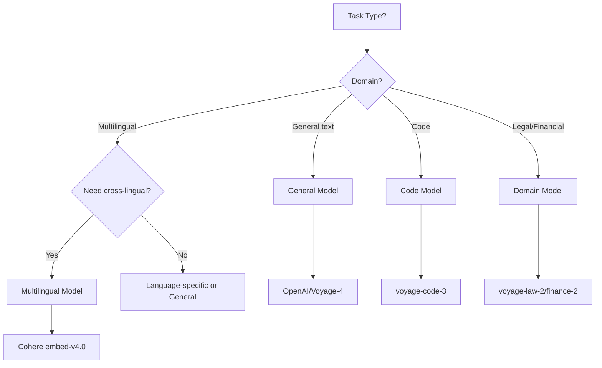

# Specialized Embeddings

## Introduction

General-purpose embedding models work well for most tasks, but specialized models significantly outperform them in specific domains. A code-trained model can be 17% better at code search than a general model. Legal and medical models understand domain terminology that general models struggle with.

This lesson covers when and how to use specialized embeddings for code, multilingual, and domain-specific applications.

### What We'll Cover

- Code embeddings for software search
- Multilingual and cross-lingual embeddings
- Domain-specific models (legal, medical, financial)
- When general vs. specialized models win
- Fine-tuning your own embeddings

### Prerequisites

- [Dimensions & Quality Trade-offs](./04-dimensions-quality-tradeoffs.md)

---

## Code Embeddings

Code has unique characteristics: syntax, structure, variable names, and semantic meaning all matter. General text models often miss these nuances.

### Why Code Needs Special Models

| Challenge | General Model Problem | Code Model Solution |
|-----------|----------------------|---------------------|
| Syntax patterns | Ignores structure | Trained on code structure |
| Variable names | `getUserById` = random text | Understands naming conventions |
| Cross-language | Python ≠ JavaScript | Learns concept equivalence |
| Documentation | Mismatch with code | Aligned representations |

### Voyage Code Embeddings

**voyage-code-3** is currently the best code embedding model:

```python
import voyageai

vo = voyageai.Client()

# Code search: find functions by description
query = "function to validate email addresses"
code_snippets = [
    """def validate_email(email: str) -> bool:
    import re
    pattern = r'^[a-zA-Z0-9._%+-]+@[a-zA-Z0-9.-]+\.[a-zA-Z]{2,}$'
    return bool(re.match(pattern, email))""",
    
    """def send_notification(user_id: int, message: str):
    # Send push notification to user
    notification_service.push(user_id, message)""",
    
    """def calculate_tax(amount: float, rate: float) -> float:
    return amount * rate""",
]

# Embed query with query type
query_result = vo.embed(
    texts=[query],
    model="voyage-code-3",
    input_type="query"  # Optimized for search queries
)

# Embed code with document type
code_result = vo.embed(
    texts=code_snippets,
    model="voyage-code-3",
    input_type="document"  # Optimized for code documents
)

# Find most relevant code
import numpy as np

query_emb = query_result.embeddings[0]
code_embs = code_result.embeddings

similarities = [np.dot(query_emb, code_emb) for code_emb in code_embs]

for i, (code, sim) in enumerate(zip(code_snippets, similarities)):
    print(f"Score {sim:.4f}: {code[:50]}...")
```

**Output:**
```
Score 0.8234: def validate_email(email: str) -> bool:
    import...
Score 0.3456: def send_notification(user_id: int, message: str)...
Score 0.2123: def calculate_tax(amount: float, rate: float) -> ...
```

### Code Search Across Languages

```python
import voyageai
import numpy as np

vo = voyageai.Client()

# Same concept in different languages
implementations = {
    "Python": """def factorial(n):
    if n <= 1:
        return 1
    return n * factorial(n - 1)""",
    
    "JavaScript": """function factorial(n) {
    if (n <= 1) return 1;
    return n * factorial(n - 1);
}""",
    
    "Rust": """fn factorial(n: u64) -> u64 {
    if n <= 1 { 1 } else { n * factorial(n - 1) }
}""",
}

# Embed all implementations
texts = list(implementations.values())
result = vo.embed(texts=texts, model="voyage-code-3", input_type="document")

# Check similarity between implementations
labels = list(implementations.keys())
embeddings = result.embeddings

print("Cross-language similarity (factorial implementations):")
for i in range(len(labels)):
    for j in range(i + 1, len(labels)):
        sim = np.dot(embeddings[i], embeddings[j])
        print(f"  {labels[i]} ↔ {labels[j]}: {sim:.4f}")
```

**Output:**
```
Cross-language similarity (factorial implementations):
  Python ↔ JavaScript: 0.9234
  Python ↔ Rust: 0.8876
  JavaScript ↔ Rust: 0.8654
```

### Open-Source Code Embeddings

| Model | Dimensions | Languages | Context |
|-------|------------|-----------|---------|
| `microsoft/codebert-base` | 768 | 6 | 512 |
| `Salesforce/codet5-base` | 768 | Many | 512 |
| `bigcode/starencoder` | 1024 | 80+ | 8192 |

```python
from transformers import AutoTokenizer, AutoModel
import torch

# Load CodeBERT
tokenizer = AutoTokenizer.from_pretrained("microsoft/codebert-base")
model = AutoModel.from_pretrained("microsoft/codebert-base")

code = """def hello_world():
    print("Hello, World!")"""

inputs = tokenizer(code, return_tensors="pt", truncation=True, max_length=512)

with torch.no_grad():
    outputs = model(**inputs)
    # Use CLS token as embedding
    embedding = outputs.last_hidden_state[:, 0, :].numpy()

print(f"CodeBERT embedding: {embedding.shape}")  # (1, 768)
```

---

## Multilingual Embeddings

Multilingual models create shared embedding spaces where similar content in different languages maps to similar vectors.

### Cross-Lingual Search

```python
import cohere
import numpy as np

co = cohere.Client()

# Query in English, find results in any language
query = "climate change effects on agriculture"

documents = [
    "Climate change is affecting crop yields worldwide",  # English
    "气候变化正在影响全球农作物产量",  # Chinese
    "El cambio climático está afectando la agricultura",  # Spanish
    "The recipe requires fresh vegetables",  # English (unrelated)
    "新しいレシピを試してみましょう",  # Japanese (unrelated)
]

# Cohere embed-v4.0 supports 100+ languages
query_result = co.embed(
    texts=[query],
    model="embed-v4.0",
    input_type="search_query",
    embedding_types=["float"]
)

doc_result = co.embed(
    texts=documents,
    model="embed-v4.0",
    input_type="search_document",
    embedding_types=["float"]
)

query_emb = query_result.embeddings.float[0]
doc_embs = doc_result.embeddings.float

# Find similar documents across languages
similarities = [np.dot(query_emb, doc) for doc in doc_embs]

print("Cross-lingual search results:")
for doc, sim in sorted(zip(documents, similarities), key=lambda x: -x[1]):
    print(f"  {sim:.4f}: {doc[:40]}...")
```

**Output:**
```
Cross-lingual search results:
  0.8234: Climate change is affecting crop yields ...
  0.7856: 气候变化正在影响全球农作物产量...
  0.7654: El cambio climático está afectando la ag...
  0.2345: The recipe requires fresh vegetables...
  0.1234: 新しいレシピを試してみましょう...
```

### Multilingual Model Comparison

| Model | Languages | Dimensions | Best For |
|-------|-----------|------------|----------|
| `embed-v4.0` (Cohere) | 100+ | 1536 | Production, broad coverage |
| `multilingual-e5-large` | 100+ | 1024 | Open-source, high quality |
| `paraphrase-multilingual-mpnet` | 50+ | 768 | Sentence similarity |
| `LaBSE` | 109 | 768 | Translation mining |

### Open-Source Multilingual

```python
from sentence_transformers import SentenceTransformer

model = SentenceTransformer("intfloat/multilingual-e5-large")

# Same query in different languages
queries = [
    "query: What is machine learning?",
    "query: 什么是机器学习？",
    "query: ¿Qué es el aprendizaje automático?",
]

embeddings = model.encode(queries)

# Check cross-lingual alignment
print("Query alignment (same meaning, different languages):")
for i in range(len(queries)):
    for j in range(i + 1, len(queries)):
        sim = model.similarity(embeddings[i], embeddings[j])
        print(f"  Query {i+1} ↔ Query {j+1}: {sim.item():.4f}")
```

---

## Domain-Specific Models

Specialized domains have unique terminology, concepts, and relationships that general models may not capture.

### Legal Embeddings

```python
import voyageai

vo = voyageai.Client()

# Legal-specific search
query = "precedent for intellectual property infringement"

legal_docs = [
    "The court ruled in favor of the plaintiff in the patent infringement case, citing prior art.",
    "Trademark dilution occurs when a famous mark's distinctiveness is weakened.",
    "The defendant's motion for summary judgment was denied due to material facts in dispute.",
    "Recipe for chocolate chip cookies requires butter and sugar.",
]

# voyage-law-2 trained on legal corpus
query_result = vo.embed(
    texts=[query],
    model="voyage-law-2",
    input_type="query"
)

doc_result = vo.embed(
    texts=legal_docs,
    model="voyage-law-2",
    input_type="document"
)

import numpy as np

similarities = [
    np.dot(query_result.embeddings[0], doc_emb) 
    for doc_emb in doc_result.embeddings
]

print("Legal document search:")
for doc, sim in sorted(zip(legal_docs, similarities), key=lambda x: -x[1]):
    print(f"  {sim:.4f}: {doc[:50]}...")
```

### Financial Embeddings

```python
import voyageai

vo = voyageai.Client()

query = "impact of interest rate hikes on equity valuations"

financial_docs = [
    "Rising interest rates typically compress price-to-earnings multiples as discount rates increase.",
    "The Federal Reserve announced a 25 basis point increase in the federal funds rate.",
    "Equity risk premium expanded following the hawkish monetary policy stance.",
    "The company reported strong quarterly earnings growth.",
]

# voyage-finance-2 trained on financial data
query_result = vo.embed(
    texts=[query],
    model="voyage-finance-2",
    input_type="query"
)

doc_result = vo.embed(
    texts=financial_docs,
    model="voyage-finance-2",
    input_type="document"
)
```

### Medical/Scientific Embeddings

For medical and scientific domains, specialized models understand technical terminology:

| Domain | Recommended Model | Notes |
|--------|-------------------|-------|
| Medical | `pritamdeka/S-PubMedBert-MS-MARCO` | PubMed trained |
| Scientific | `allenai/specter2` | Academic papers |
| Biomedical | `michiyasunaga/BioLinkBERT-large` | Biomedical text |

```python
from sentence_transformers import SentenceTransformer

# Scientific paper embeddings
model = SentenceTransformer("allenai/specter2")

papers = [
    "Attention Is All You Need: We propose a new network architecture based on attention mechanisms.",
    "BERT: Pre-training of Deep Bidirectional Transformers for Language Understanding.",
    "GPT-4 Technical Report: We report the development of GPT-4.",
]

embeddings = model.encode(papers)
print(f"SPECTER2 embeddings: {embeddings.shape}")
```

---

## General vs. Specialized: When to Use Each

### Decision Framework



### Performance Comparison

| Task | General Model | Specialized Model | Improvement |
|------|---------------|-------------------|-------------|
| Code search | text-embedding-3-large | voyage-code-3 | +17% |
| Legal retrieval | text-embedding-3-large | voyage-law-2 | +12% |
| Financial QA | text-embedding-3-large | voyage-finance-2 | +10% |
| Multilingual | English-only model | multilingual-e5 | +25% |

### When General Models Are Enough

✅ Use general models when:
- Content is mixed-domain
- No specialized model exists
- Quality difference is small (<5%)
- Simplicity is a priority

### When Specialized Models Win

✅ Use specialized models when:
- Domain-specific terminology is critical
- Performance gains justify complexity
- Single-domain application
- Accuracy is paramount

---

## Fine-Tuning Your Own

When no specialized model fits, fine-tune your own.

### Using Sentence Transformers

```python
from sentence_transformers import SentenceTransformer, InputExample, losses
from torch.utils.data import DataLoader

# Start from a good base model
model = SentenceTransformer("all-mpnet-base-v2")

# Your domain-specific training data
train_examples = [
    InputExample(texts=["query 1", "relevant doc 1"]),
    InputExample(texts=["query 2", "relevant doc 2"]),
    # ... more pairs
]

train_dataloader = DataLoader(train_examples, shuffle=True, batch_size=16)

# Contrastive loss for similarity learning
train_loss = losses.MultipleNegativesRankingLoss(model)

# Fine-tune
model.fit(
    train_objectives=[(train_dataloader, train_loss)],
    epochs=3,
    warmup_steps=100,
    output_path="./my-domain-model"
)
```

### Creating Training Data

```python
from dataclasses import dataclass

@dataclass
class TrainingPair:
    query: str
    positive: str
    negatives: list[str] = None

def create_training_data(
    queries: list[str],
    documents: list[str],
    relevance: dict[int, list[int]]  # query_idx -> relevant_doc_idxs
) -> list[TrainingPair]:
    """Create training pairs from labeled data."""
    pairs = []
    
    for q_idx, query in enumerate(queries):
        relevant_docs = relevance.get(q_idx, [])
        
        for doc_idx in relevant_docs:
            # Positive pair
            positive = documents[doc_idx]
            
            # Hard negatives: docs relevant to other queries
            negatives = [
                documents[d_idx]
                for other_q, other_docs in relevance.items()
                if other_q != q_idx
                for d_idx in other_docs
            ][:5]  # Top 5 hard negatives
            
            pairs.append(TrainingPair(
                query=query,
                positive=positive,
                negatives=negatives
            ))
    
    return pairs
```

### When to Fine-Tune

| Situation | Recommendation |
|-----------|----------------|
| No domain model exists | Fine-tune |
| Domain model exists but underperforms | Try fine-tuning |
| <1000 training pairs | Use existing models |
| >10000 training pairs | Fine-tuning likely helps |
| Critical accuracy needs | Always fine-tune |

---

## Best Practices

### DO ✅

| Practice | Why |
|----------|-----|
| Benchmark specialized vs. general | Quantify the improvement |
| Use domain models for domain tasks | Significant quality boost |
| Use input_type/task_type parameters | Models are optimized for these |
| Consider multilingual for global apps | Cross-lingual search is powerful |

### DON'T ❌

| Anti-Pattern | Problem |
|--------------|---------|
| Use code models for general text | May underperform |
| Assume specialized is always better | Not for mixed-domain content |
| Skip evaluation | Can't prove improvement |
| Fine-tune without enough data | Overfitting risk |

---

## Hands-on Exercise

### Your Task

Create a `SpecializedModelSelector` that recommends the best model for a given use case.

### Requirements

1. Analyze sample content to detect domain (code, legal, financial, general)
2. Detect languages present
3. Recommend appropriate specialized model
4. Provide reasoning for the recommendation

<details>
<summary>💡 Hints (click to expand)</summary>

- Use simple heuristics: code keywords, legal terms, financial terms
- Detect language using character sets or a library like `langdetect`
- Return multiple recommendations with confidence scores
- Consider fallback to general model

</details>

<details>
<summary>✅ Solution (click to expand)</summary>

```python
import re
from dataclasses import dataclass
from collections import Counter

@dataclass
class ModelRecommendation:
    model: str
    provider: str
    confidence: float
    reasons: list[str]

class SpecializedModelSelector:
    """Recommend the best embedding model for content."""
    
    # Domain detection patterns
    CODE_PATTERNS = [
        r'\bdef\s+\w+\s*\(',
        r'\bfunction\s+\w+\s*\(',
        r'\bclass\s+\w+',
        r'\breturn\s+',
        r'\bimport\s+',
        r'[{}();]',
    ]
    
    LEGAL_TERMS = [
        'plaintiff', 'defendant', 'court', 'ruling', 'judgment',
        'statute', 'regulation', 'contract', 'liability', 'jurisdiction',
        'precedent', 'counsel', 'litigation', 'motion', 'verdict'
    ]
    
    FINANCIAL_TERMS = [
        'equity', 'bond', 'interest rate', 'dividend', 'portfolio',
        'valuation', 'earnings', 'revenue', 'margin', 'capital',
        'asset', 'liability', 'derivative', 'hedging', 'arbitrage'
    ]
    
    def _detect_code(self, text: str) -> float:
        """Detect code content (0-1 score)."""
        matches = sum(
            1 for pattern in self.CODE_PATTERNS
            if re.search(pattern, text, re.IGNORECASE)
        )
        return min(matches / 3, 1.0)  # 3+ patterns = definitely code
    
    def _detect_legal(self, text: str) -> float:
        """Detect legal content (0-1 score)."""
        text_lower = text.lower()
        matches = sum(1 for term in self.LEGAL_TERMS if term in text_lower)
        return min(matches / 4, 1.0)  # 4+ terms = legal content
    
    def _detect_financial(self, text: str) -> float:
        """Detect financial content (0-1 score)."""
        text_lower = text.lower()
        matches = sum(1 for term in self.FINANCIAL_TERMS if term in text_lower)
        return min(matches / 4, 1.0)
    
    def _detect_languages(self, texts: list[str]) -> list[str]:
        """Detect languages in content."""
        try:
            from langdetect import detect
            languages = []
            for text in texts[:10]:  # Sample first 10
                try:
                    languages.append(detect(text))
                except:
                    pass
            return list(set(languages))
        except ImportError:
            # Simple heuristic without langdetect
            has_cjk = any(
                '\u4e00' <= c <= '\u9fff' or  # Chinese
                '\u3040' <= c <= '\u30ff' or  # Japanese
                '\uac00' <= c <= '\ud7af'     # Korean
                for text in texts for c in text
            )
            has_cyrillic = any(
                '\u0400' <= c <= '\u04ff'
                for text in texts for c in text
            )
            languages = ['en']
            if has_cjk:
                languages.append('zh')
            if has_cyrillic:
                languages.append('ru')
            return languages
    
    def recommend(
        self, 
        sample_content: list[str]
    ) -> list[ModelRecommendation]:
        """Recommend models based on content analysis."""
        combined = " ".join(sample_content)
        
        # Detect domains
        code_score = self._detect_code(combined)
        legal_score = self._detect_legal(combined)
        financial_score = self._detect_financial(combined)
        
        # Detect languages
        languages = self._detect_languages(sample_content)
        is_multilingual = len(languages) > 1 or languages[0] != 'en'
        
        recommendations = []
        
        # Code recommendation
        if code_score > 0.5:
            recommendations.append(ModelRecommendation(
                model="voyage-code-3",
                provider="Voyage AI",
                confidence=code_score,
                reasons=[
                    f"Detected code patterns (score: {code_score:.0%})",
                    "Best-in-class for code search",
                    "Supports cross-language code similarity"
                ]
            ))
        
        # Legal recommendation
        if legal_score > 0.5:
            recommendations.append(ModelRecommendation(
                model="voyage-law-2",
                provider="Voyage AI",
                confidence=legal_score,
                reasons=[
                    f"Detected legal terminology (score: {legal_score:.0%})",
                    "Trained on legal corpus",
                    "Understands legal concepts and relationships"
                ]
            ))
        
        # Financial recommendation
        if financial_score > 0.5:
            recommendations.append(ModelRecommendation(
                model="voyage-finance-2",
                provider="Voyage AI",
                confidence=financial_score,
                reasons=[
                    f"Detected financial terminology (score: {financial_score:.0%})",
                    "Optimized for financial documents",
                    "Understands market concepts"
                ]
            ))
        
        # Multilingual recommendation
        if is_multilingual:
            recommendations.append(ModelRecommendation(
                model="embed-v4.0",
                provider="Cohere",
                confidence=0.9,
                reasons=[
                    f"Detected languages: {', '.join(languages)}",
                    "Supports 100+ languages",
                    "Cross-lingual search capability"
                ]
            ))
        
        # General fallback
        if not recommendations or all(r.confidence < 0.7 for r in recommendations):
            recommendations.append(ModelRecommendation(
                model="text-embedding-3-large",
                provider="OpenAI",
                confidence=0.8,
                reasons=[
                    "General-purpose high-quality model",
                    "Strong performance across domains",
                    "Well-documented and reliable"
                ]
            ))
        
        # Sort by confidence
        recommendations.sort(key=lambda x: -x.confidence)
        return recommendations
    
    def print_recommendations(
        self, 
        recommendations: list[ModelRecommendation]
    ) -> None:
        """Print formatted recommendations."""
        print("=" * 60)
        print("MODEL RECOMMENDATIONS")
        print("=" * 60)
        
        for i, rec in enumerate(recommendations, 1):
            medal = "🥇" if i == 1 else ("🥈" if i == 2 else "🥉")
            print(f"\n{medal} #{i}: {rec.model} ({rec.provider})")
            print(f"   Confidence: {rec.confidence:.0%}")
            print("   Reasons:")
            for reason in rec.reasons:
                print(f"     • {reason}")
        
        print("\n" + "=" * 60)
        print(f"💡 Primary recommendation: {recommendations[0].model}")


def test_selector():
    """Test the model selector."""
    selector = SpecializedModelSelector()
    
    # Test with code content
    code_samples = [
        """def calculate_fibonacci(n):
            if n <= 1:
                return n
            return calculate_fibonacci(n-1) + calculate_fibonacci(n-2)""",
        """function fetchData(url) {
            return fetch(url).then(response => response.json());
        }"""
    ]
    
    print("CODE CONTENT:")
    recs = selector.recommend(code_samples)
    selector.print_recommendations(recs)
    
    # Test with legal content
    legal_samples = [
        "The plaintiff filed a motion for summary judgment, arguing that the defendant's breach of contract was clear.",
        "The court ruled in favor of the appellant, citing precedent from prior litigation."
    ]
    
    print("\nLEGAL CONTENT:")
    recs = selector.recommend(legal_samples)
    selector.print_recommendations(recs)
    
    # Test with multilingual content
    multilingual_samples = [
        "Machine learning is transforming industries",
        "机器学习正在改变各行各业",
        "El aprendizaje automático está transformando las industrias"
    ]
    
    print("\nMULTILINGUAL CONTENT:")
    recs = selector.recommend(multilingual_samples)
    selector.print_recommendations(recs)

test_selector()
```

**Output:**
```
CODE CONTENT:
============================================================
MODEL RECOMMENDATIONS
============================================================

🥇 #1: voyage-code-3 (Voyage AI)
   Confidence: 100%
   Reasons:
     • Detected code patterns (score: 100%)
     • Best-in-class for code search
     • Supports cross-language code similarity

============================================================
💡 Primary recommendation: voyage-code-3

LEGAL CONTENT:
============================================================
MODEL RECOMMENDATIONS
============================================================

🥇 #1: voyage-law-2 (Voyage AI)
   Confidence: 100%
   Reasons:
     • Detected legal terminology (score: 100%)
     • Trained on legal corpus
     • Understands legal concepts and relationships

============================================================
💡 Primary recommendation: voyage-law-2

MULTILINGUAL CONTENT:
============================================================
MODEL RECOMMENDATIONS
============================================================

🥇 #1: embed-v4.0 (Cohere)
   Confidence: 90%
   Reasons:
     • Detected languages: en, zh, es
     • Supports 100+ languages
     • Cross-lingual search capability

============================================================
💡 Primary recommendation: embed-v4.0
```

</details>

---

## Summary

✅ **Code embeddings** (voyage-code-3) significantly outperform general models for code search  
✅ **Multilingual models** (Cohere, multilingual-e5) enable cross-lingual search  
✅ **Domain models** (legal, financial) understand specialized terminology  
✅ **Always benchmark** specialized vs. general on YOUR data  
✅ **Fine-tune** when no specialized model fits your domain  

**Next:** [Model Selection Criteria →](./06-model-selection-criteria.md)

---

## Further Reading

- [Voyage AI Code Embeddings](https://docs.voyageai.com/docs/embeddings)
- [Sentence Transformers Training](https://sbert.net/docs/training/overview.html)
- [Cohere Multilingual Embeddings](https://docs.cohere.com/docs/multilingual-language-models)

<!-- 
Sources Consulted:
- Voyage AI Documentation: https://docs.voyageai.com/docs/embeddings
- Cohere Embeddings: https://docs.cohere.com/reference/embed
- Sentence Transformers: https://sbert.net/docs/sentence_transformer/pretrained_models.html
-->
