# Model Selection Criteria

## Introduction

With dozens of embedding models available, choosing the right one can be overwhelming. The "best" model depends entirely on your specific requirements: use case, scale, budget, latency needs, and deployment constraints. A model that's perfect for one application may be wrong for another.

This lesson provides a systematic framework for evaluating and selecting embedding models.

### What We'll Cover

- Selection criteria breakdown
- Decision framework with flowcharts
- Evaluation checklist
- Common scenarios and recommendations
- Migration considerations

### Prerequisites

- [Specialized Embeddings](./05-specialized-embeddings.md)
- Understanding of your application requirements

---

## The Five Selection Criteria

Every embedding model decision involves balancing these five factors:


---

## Criterion 1: Quality

Quality is the most important factor—but "quality" means different things for different tasks.

### Quality Metrics

| Metric | What It Measures | When It Matters |
|--------|------------------|-----------------|
| MTEB Average | Overall performance | General applications |
| Retrieval Score | Finding relevant docs | RAG, search |
| Clustering Score | Grouping similar items | Topic modeling |
| Classification Score | Categorizing text | Content tagging |
| STS Score | Semantic similarity | Duplicate detection |

### Quality Evaluation

```python
from openai import OpenAI
import numpy as np
from dataclasses import dataclass

client = OpenAI()

@dataclass
class QualityMetrics:
    model: str
    similarity_separation: float  # Higher = better discrimination
    retrieval_precision: float    # Higher = better retrieval

def evaluate_quality(
    model: str,
    similar_pairs: list[tuple[str, str]],
    dissimilar_pairs: list[tuple[str, str]]
) -> QualityMetrics:
    """Evaluate model quality on your data."""
    
    def embed(texts):
        response = client.embeddings.create(model=model, input=texts)
        return [e.embedding for e in response.data]
    
    def cosine_sim(a, b):
        return np.dot(a, b) / (np.linalg.norm(a) * np.linalg.norm(b))
    
    # Similar pair scores
    similar_scores = []
    for t1, t2 in similar_pairs:
        e1, e2 = embed([t1, t2])
        similar_scores.append(cosine_sim(e1, e2))
    
    # Dissimilar pair scores
    dissimilar_scores = []
    for t1, t2 in dissimilar_pairs:
        e1, e2 = embed([t1, t2])
        dissimilar_scores.append(cosine_sim(e1, e2))
    
    separation = np.mean(similar_scores) - np.mean(dissimilar_scores)
    
    # Retrieval precision: what % of similar pairs rank above dissimilar?
    threshold = np.median(similar_scores)
    precision = sum(1 for s in similar_scores if s > threshold) / len(similar_scores)
    
    return QualityMetrics(
        model=model,
        similarity_separation=separation,
        retrieval_precision=precision
    )
```

### Quality Decision Guide

| Your Priority | Recommended Approach |
|---------------|---------------------|
| Maximum quality | text-embedding-3-large or voyage-4-large |
| Good quality, lower cost | text-embedding-3-small |
| Domain-specific quality | Specialized model (code, legal, etc.) |
| Quality + self-hosting | bge-large-en-v1.5 |

---

## Criterion 2: Speed

Speed encompasses latency (time per request) and throughput (requests per second).

### Latency Requirements

| Application | Acceptable Latency | Model Constraint |
|-------------|-------------------|------------------|
| Real-time search | <100ms | Fast API or local |
| Batch processing | <1s per batch | Any |
| Interactive chat | <200ms | API with low latency |
| Background indexing | Any | Cost matters more |

### Speed Evaluation

```python
import time
from dataclasses import dataclass
from openai import OpenAI

client = OpenAI()

@dataclass
class SpeedMetrics:
    model: str
    avg_latency_ms: float
    p99_latency_ms: float
    throughput_per_sec: float

def evaluate_speed(
    model: str,
    test_texts: list[str],
    runs: int = 10
) -> SpeedMetrics:
    """Evaluate model speed."""
    latencies = []
    batch_size = len(test_texts)
    
    for _ in range(runs):
        start = time.time()
        client.embeddings.create(model=model, input=test_texts)
        latencies.append((time.time() - start) * 1000)
    
    latencies.sort()
    
    return SpeedMetrics(
        model=model,
        avg_latency_ms=sum(latencies) / len(latencies),
        p99_latency_ms=latencies[int(runs * 0.99)] if runs >= 100 else latencies[-1],
        throughput_per_sec=batch_size / (sum(latencies) / 1000 / runs)
    )
```

### Speed Comparison

| Model | Typical Latency (batch 10) | Best For |
|-------|---------------------------|----------|
| text-embedding-3-small | ~150ms | Real-time |
| text-embedding-3-large | ~200ms | Quality-first |
| voyage-4-lite | ~120ms | Speed-optimized |
| Local (GPU) | ~50ms | Ultra-low latency |
| Local (CPU) | ~500ms+ | Cost-sensitive |

---

## Criterion 3: Cost

Cost includes API pricing, infrastructure, and hidden costs like storage.

### API Cost Comparison (2025)

| Provider | Model | Price per 1M tokens |
|----------|-------|---------------------|
| OpenAI | text-embedding-3-small | $0.02 |
| OpenAI | text-embedding-3-large | $0.13 |
| Google | gemini-embedding-001 | $0.15 |
| Voyage | voyage-4 | ~$0.05 |
| Cohere | embed-v4.0 | Free tier + tiered |

### Total Cost Calculator

```python
from dataclasses import dataclass

@dataclass
class CostEstimate:
    model: str
    monthly_api_cost: float
    monthly_storage_cost: float
    total_monthly: float

def estimate_monthly_cost(
    model: str,
    texts_per_month: int,
    avg_tokens_per_text: int = 100,
    storage_price_per_gb: float = 0.02,  # S3 pricing
    dimensions: int = 1536
) -> CostEstimate:
    """Estimate total monthly cost."""
    
    # API costs (per 1M tokens)
    api_prices = {
        "text-embedding-3-small": 0.02,
        "text-embedding-3-large": 0.13,
        "gemini-embedding-001": 0.15,
        "voyage-4": 0.05,
    }
    
    price = api_prices.get(model, 0.10)  # Default assumption
    
    total_tokens = texts_per_month * avg_tokens_per_text
    api_cost = (total_tokens / 1_000_000) * price
    
    # Storage cost (float32 = 4 bytes per dimension)
    storage_bytes = texts_per_month * dimensions * 4
    storage_gb = storage_bytes / (1024 ** 3)
    storage_cost = storage_gb * storage_price_per_gb
    
    return CostEstimate(
        model=model,
        monthly_api_cost=api_cost,
        monthly_storage_cost=storage_cost,
        total_monthly=api_cost + storage_cost
    )

# Example: 10M texts per month
estimate = estimate_monthly_cost(
    model="text-embedding-3-small",
    texts_per_month=10_000_000
)
print(f"Monthly cost: ${estimate.total_monthly:.2f}")
```

### Cost Optimization Strategies

| Strategy | Savings | Trade-off |
|----------|---------|-----------|
| Use smaller model | 80-90% | Quality drop |
| Reduce dimensions | 50-75% | Slight quality drop |
| Self-host | 100% API | Infrastructure cost |
| Batch processing | ~50% (Gemini) | Delayed processing |
| Caching embeddings | Variable | Storage cost |

---

## Criterion 4: Features

Different models offer different capabilities beyond basic embedding.

### Feature Matrix

| Feature | OpenAI | Gemini | Cohere | Voyage |
|---------|--------|--------|--------|--------|
| Matryoshka | ✅ | ✅ | ✅ | ✅ |
| Task types | ❌ | ✅ (8 types) | ✅ (4 types) | ✅ |
| Multimodal | ❌ | ❌ | ✅ | ✅ |
| Multilingual | Good | Good | 100+ | Good |
| Context length | 8K | 2K | — | 32K |
| Compression | ❌ | ❌ | ✅ | ✅ |
| Batch discount | ❌ | ✅ 50% | ✅ | ❌ |

### Feature Requirements Checklist

```python
from dataclasses import dataclass, field

@dataclass
class FeatureRequirements:
    min_context_length: int = 2048
    needs_multilingual: bool = False
    languages_required: list[str] = field(default_factory=lambda: ["en"])
    needs_matryoshka: bool = False
    needs_multimodal: bool = False
    needs_task_types: bool = False
    needs_compression: bool = False
    needs_self_hosting: bool = False

def filter_models_by_features(requirements: FeatureRequirements) -> list[str]:
    """Filter models that meet feature requirements."""
    
    models = {
        "text-embedding-3-large": {
            "context": 8192,
            "multilingual": True,
            "matryoshka": True,
            "multimodal": False,
            "task_types": False,
            "compression": False,
            "self_hosting": False,
        },
        "gemini-embedding-001": {
            "context": 2048,
            "multilingual": True,
            "matryoshka": True,
            "multimodal": False,
            "task_types": True,
            "compression": False,
            "self_hosting": False,
        },
        "embed-v4.0": {
            "context": 4096,
            "multilingual": True,  # 100+ languages
            "matryoshka": True,
            "multimodal": True,
            "task_types": True,
            "compression": True,
            "self_hosting": False,
        },
        "voyage-4-large": {
            "context": 32000,
            "multilingual": True,
            "matryoshka": True,
            "multimodal": True,
            "task_types": True,
            "compression": True,
            "self_hosting": False,
        },
        "bge-large-en-v1.5": {
            "context": 512,
            "multilingual": False,
            "matryoshka": False,
            "multimodal": False,
            "task_types": False,
            "compression": False,
            "self_hosting": True,
        },
    }
    
    valid = []
    for name, features in models.items():
        if features["context"] < requirements.min_context_length:
            continue
        if requirements.needs_multilingual and not features["multilingual"]:
            continue
        if requirements.needs_multimodal and not features["multimodal"]:
            continue
        if requirements.needs_self_hosting and not features["self_hosting"]:
            continue
        valid.append(name)
    
    return valid
```

---

## Criterion 5: Operations

Operational concerns affect long-term maintainability.

### Operational Factors

| Factor | Questions to Ask |
|--------|------------------|
| Reliability | What's the uptime SLA? |
| Rate limits | Will limits constrain scale? |
| Data privacy | Where is data processed? |
| Vendor lock-in | How hard is migration? |
| Support | What support is available? |
| Updates | How are model updates handled? |

### Self-Hosting Consideration

```python
def should_self_host(
    monthly_api_cost: float,
    gpu_monthly_cost: float = 300,  # A10 on cloud
    privacy_critical: bool = False,
    latency_critical: bool = False,
    team_ml_expertise: bool = False
) -> dict:
    """Evaluate self-hosting decision."""
    
    reasons_for = []
    reasons_against = []
    
    # Cost analysis
    if monthly_api_cost > gpu_monthly_cost * 1.5:
        reasons_for.append(f"Cost savings: ${monthly_api_cost - gpu_monthly_cost:.0f}/month")
    else:
        reasons_against.append(f"API cheaper: ${monthly_api_cost:.0f} vs ${gpu_monthly_cost:.0f}")
    
    # Privacy
    if privacy_critical:
        reasons_for.append("Data never leaves your infrastructure")
    
    # Latency
    if latency_critical:
        reasons_for.append("Sub-50ms latency possible")
    
    # Expertise
    if not team_ml_expertise:
        reasons_against.append("Requires ML ops expertise")
    
    # Maintenance
    reasons_against.append("Ongoing maintenance burden")
    
    recommendation = "self-host" if len(reasons_for) > len(reasons_against) else "api"
    
    return {
        "recommendation": recommendation,
        "reasons_for_self_hosting": reasons_for,
        "reasons_for_api": reasons_against,
    }
```

---

## Decision Flowchart

### Primary Decision Tree

```mermaid
flowchart TD
    A[Start] --> B{Domain?}
    
    B -->|Code| C[voyage-code-3]
    B -->|Legal| D[voyage-law-2]
    B -->|Financial| E[voyage-finance-2]
    B -->|General| F{Context needed?}
    
    F -->|>8K tokens| G[voyage-4-large]
    F -->|≤8K tokens| H{Multilingual?}
    
    H -->|100+ languages| I[embed-v4.0]
    H -->|Few languages| J{Budget?}
    
    J -->|Cost-sensitive| K[text-embedding-3-small]
    J -->|Quality-first| L[text-embedding-3-large]
    
    C --> M[Done]
    D --> M
    E --> M
    G --> M
    I --> M
    K --> M
    L --> M
```



### Quick Reference Table

| Scenario | Recommended Model | Reason |
|----------|-------------------|--------|
| General RAG | text-embedding-3-large | Best quality/reliability |
| Budget RAG | text-embedding-3-small | 90% quality, 85% cheaper |
| Code search | voyage-code-3 | +17% vs general |
| Legal/finance | voyage-law-2/finance-2 | Domain optimized |
| Long documents | voyage-4-large | 32K context |
| Multilingual | embed-v4.0 | 100+ languages |
| Self-hosted | bge-large-en-v1.5 | Best open-source |
| Edge/mobile | all-MiniLM-L6-v2 | Tiny, fast |

---

## Evaluation Checklist

Use this checklist to systematically evaluate models:

```python
from dataclasses import dataclass, field
from typing import Optional

@dataclass
class ModelEvaluation:
    model: str
    
    # Quality (1-5)
    mteb_score: float = 0.0
    domain_fit: int = 3
    quality_on_my_data: int = 3
    
    # Speed (1-5)
    latency_acceptable: int = 3
    throughput_sufficient: int = 3
    
    # Cost (1-5)
    api_cost_acceptable: int = 3
    storage_cost_acceptable: int = 3
    
    # Features
    has_required_features: bool = True
    missing_features: list[str] = field(default_factory=list)
    
    # Operations
    reliability_acceptable: int = 3
    support_quality: int = 3
    migration_difficulty: int = 3  # 1=easy, 5=hard
    
    def overall_score(self) -> float:
        """Calculate weighted overall score."""
        weights = {
            "quality": 0.35,
            "speed": 0.20,
            "cost": 0.20,
            "features": 0.15,
            "operations": 0.10,
        }
        
        quality = (self.domain_fit + self.quality_on_my_data) / 2
        speed = (self.latency_acceptable + self.throughput_sufficient) / 2
        cost = (self.api_cost_acceptable + self.storage_cost_acceptable) / 2
        features = 5 if self.has_required_features else 1
        ops = (self.reliability_acceptable + self.support_quality + (6 - self.migration_difficulty)) / 3
        
        return (
            quality * weights["quality"] +
            speed * weights["speed"] +
            cost * weights["cost"] +
            features * weights["features"] +
            ops * weights["operations"]
        )

def compare_models(evaluations: list[ModelEvaluation]) -> None:
    """Compare model evaluations."""
    sorted_evals = sorted(evaluations, key=lambda e: -e.overall_score())
    
    print("Model Comparison:")
    print("-" * 50)
    for eval in sorted_evals:
        print(f"{eval.model}: {eval.overall_score():.2f}/5")
```

---

## Migration Considerations

When switching models, consider:

### Compatibility

| From | To | Migration Effort |
|------|-----|------------------|
| OpenAI v2 | OpenAI v3 | Low (re-embed) |
| OpenAI | Voyage | Medium (API changes) |
| Any API | Self-hosted | High (infrastructure) |
| Same model, fewer dims | Lower dims | Low (truncate if Matryoshka) |

### Migration Checklist

```python
def migration_checklist(current_model: str, new_model: str) -> list[str]:
    """Generate migration checklist."""
    checklist = [
        "[ ] Benchmark new model on representative data",
        "[ ] Compare quality metrics (precision, recall, MRR)",
        "[ ] Test latency in production-like environment",
        "[ ] Calculate new cost projections",
        "[ ] Check API compatibility (parameters, response format)",
        "[ ] Plan for re-embedding existing data",
        "[ ] Estimate re-embedding time and cost",
        "[ ] Set up parallel testing (A/B)",
        "[ ] Plan rollback strategy",
        "[ ] Update monitoring and alerting",
        "[ ] Document the change",
    ]
    
    # Add model-specific items
    if "voyage" in new_model.lower():
        checklist.append("[ ] Configure input_type parameter")
    
    if "gemini" in new_model.lower():
        checklist.append("[ ] Handle normalization for reduced dimensions")
    
    if "bge" in new_model.lower() or "e5" in new_model.lower():
        checklist.append("[ ] Set up GPU infrastructure")
        checklist.append("[ ] Configure query/passage prefixes")
    
    return checklist
```

---

## Best Practices

### DO ✅

| Practice | Why |
|----------|-----|
| Test on YOUR data | Benchmarks may not match your domain |
| Start with proven models | text-embedding-3-small is a safe default |
| Consider total cost | API + storage + infrastructure |
| Plan for scale | What works at 1K may fail at 1M |
| Document decisions | Future you will thank you |

### DON'T ❌

| Anti-Pattern | Problem |
|--------------|---------|
| Choose by MTEB alone | Your task may differ |
| Optimize prematurely | Start simple, optimize later |
| Ignore operational costs | Maintenance adds up |
| Lock into vendor without plan | Migration is expensive |

---

## Hands-on Exercise

### Your Task

Create a `ModelSelectionWizard` that interactively recommends a model based on user requirements.

### Requirements

1. Ask about use case (RAG, search, classification, etc.)
2. Ask about domain (general, code, legal, etc.)
3. Ask about scale (texts per month)
4. Ask about constraints (budget, latency, features)
5. Recommend top 3 models with reasoning

<details>
<summary>💡 Hints (click to expand)</summary>

- Use a scoring system for each model
- Weight criteria based on stated priorities
- Provide specific reasoning for each recommendation
- Include actionable next steps

</details>

<details>
<summary>✅ Solution (click to expand)</summary>

```python
from dataclasses import dataclass
from enum import Enum

class UseCase(Enum):
    RAG = "rag"
    SEARCH = "search"
    CLASSIFICATION = "classification"
    CLUSTERING = "clustering"
    SIMILARITY = "similarity"

class Domain(Enum):
    GENERAL = "general"
    CODE = "code"
    LEGAL = "legal"
    FINANCIAL = "financial"
    MEDICAL = "medical"
    MULTILINGUAL = "multilingual"

@dataclass
class Requirements:
    use_case: UseCase
    domain: Domain
    texts_per_month: int
    max_latency_ms: int
    max_monthly_budget: float
    needs_self_hosting: bool
    min_context_length: int
    languages: list[str]

@dataclass
class ModelScore:
    model: str
    provider: str
    score: float
    strengths: list[str]
    weaknesses: list[str]
    estimated_cost: float
    next_steps: list[str]

class ModelSelectionWizard:
    """Interactive model selection assistant."""
    
    MODELS = {
        "text-embedding-3-small": {
            "provider": "OpenAI",
            "quality": 0.85,
            "speed": 0.90,
            "cost_per_million": 0.02,
            "context": 8192,
            "domains": ["general"],
            "multilingual": True,
            "self_host": False,
        },
        "text-embedding-3-large": {
            "provider": "OpenAI",
            "quality": 0.95,
            "speed": 0.80,
            "cost_per_million": 0.13,
            "context": 8192,
            "domains": ["general"],
            "multilingual": True,
            "self_host": False,
        },
        "voyage-code-3": {
            "provider": "Voyage AI",
            "quality": 0.98,
            "speed": 0.85,
            "cost_per_million": 0.10,
            "context": 32000,
            "domains": ["code"],
            "multilingual": False,
            "self_host": False,
        },
        "voyage-law-2": {
            "provider": "Voyage AI",
            "quality": 0.96,
            "speed": 0.85,
            "cost_per_million": 0.10,
            "context": 16000,
            "domains": ["legal"],
            "multilingual": False,
            "self_host": False,
        },
        "voyage-finance-2": {
            "provider": "Voyage AI",
            "quality": 0.96,
            "speed": 0.85,
            "cost_per_million": 0.10,
            "context": 32000,
            "domains": ["financial"],
            "multilingual": False,
            "self_host": False,
        },
        "embed-v4.0": {
            "provider": "Cohere",
            "quality": 0.90,
            "speed": 0.85,
            "cost_per_million": 0.05,
            "context": 4096,
            "domains": ["general", "multilingual"],
            "multilingual": True,
            "self_host": False,
        },
        "bge-large-en-v1.5": {
            "provider": "BAAI (self-hosted)",
            "quality": 0.88,
            "speed": 0.95,
            "cost_per_million": 0.00,  # Self-hosted
            "context": 512,
            "domains": ["general"],
            "multilingual": False,
            "self_host": True,
        },
    }
    
    def _calculate_cost(self, model: str, texts_per_month: int) -> float:
        """Estimate monthly cost."""
        info = self.MODELS[model]
        if info["self_host"]:
            return 300  # GPU cost estimate
        tokens = texts_per_month * 100  # Avg tokens per text
        return (tokens / 1_000_000) * info["cost_per_million"]
    
    def _score_model(self, model: str, req: Requirements) -> ModelScore:
        """Score a model against requirements."""
        info = self.MODELS[model]
        score = 0.0
        strengths = []
        weaknesses = []
        
        # Domain fit (0-30 points)
        if req.domain.value in info["domains"] or "general" in info["domains"]:
            if req.domain.value in info["domains"]:
                score += 30
                strengths.append(f"Optimized for {req.domain.value} domain")
            else:
                score += 15
                weaknesses.append(f"General model, not {req.domain.value}-specific")
        else:
            score += 5
            weaknesses.append(f"Not designed for {req.domain.value}")
        
        # Quality (0-25 points)
        quality_score = info["quality"] * 25
        score += quality_score
        if info["quality"] >= 0.95:
            strengths.append("Highest quality tier")
        
        # Cost (0-20 points)
        est_cost = self._calculate_cost(model, req.texts_per_month)
        if est_cost <= req.max_monthly_budget:
            cost_score = 20 * (1 - est_cost / req.max_monthly_budget)
            score += cost_score
            strengths.append(f"Within budget (${est_cost:.2f}/month)")
        else:
            weaknesses.append(f"Over budget (${est_cost:.2f} > ${req.max_monthly_budget})")
        
        # Context (0-10 points)
        if info["context"] >= req.min_context_length:
            score += 10
        else:
            weaknesses.append(f"Context too short ({info['context']} < {req.min_context_length})")
        
        # Self-hosting (0-10 points)
        if req.needs_self_hosting:
            if info["self_host"]:
                score += 10
                strengths.append("Self-hosting available")
            else:
                weaknesses.append("Cannot self-host")
        
        # Multilingual (0-5 points)
        if len(req.languages) > 1:
            if info["multilingual"]:
                score += 5
                strengths.append("Multilingual support")
            else:
                weaknesses.append("Limited language support")
        
        # Next steps
        next_steps = [
            f"Test {model} on your data sample",
            f"Verify latency meets {req.max_latency_ms}ms requirement",
        ]
        if info["self_host"]:
            next_steps.append("Set up GPU infrastructure")
        else:
            next_steps.append(f"Create {info['provider']} API account")
        
        return ModelScore(
            model=model,
            provider=info["provider"],
            score=score,
            strengths=strengths,
            weaknesses=weaknesses,
            estimated_cost=est_cost,
            next_steps=next_steps
        )
    
    def recommend(self, requirements: Requirements) -> list[ModelScore]:
        """Get top 3 model recommendations."""
        scores = [
            self._score_model(model, requirements)
            for model in self.MODELS
        ]
        scores.sort(key=lambda x: -x.score)
        return scores[:3]
    
    def print_recommendations(self, recommendations: list[ModelScore]) -> None:
        """Print formatted recommendations."""
        print("=" * 70)
        print("MODEL RECOMMENDATIONS")
        print("=" * 70)
        
        for i, rec in enumerate(recommendations, 1):
            medal = "🥇" if i == 1 else ("🥈" if i == 2 else "🥉")
            print(f"\n{medal} #{i}: {rec.model}")
            print(f"   Provider: {rec.provider}")
            print(f"   Score: {rec.score:.1f}/100")
            print(f"   Est. Cost: ${rec.estimated_cost:.2f}/month")
            
            print("\n   Strengths:")
            for s in rec.strengths:
                print(f"     ✅ {s}")
            
            if rec.weaknesses:
                print("\n   Considerations:")
                for w in rec.weaknesses:
                    print(f"     ⚠️ {w}")
            
            print("\n   Next Steps:")
            for step in rec.next_steps:
                print(f"     → {step}")
        
        print("\n" + "=" * 70)


def demo_wizard():
    """Demo the selection wizard."""
    wizard = ModelSelectionWizard()
    
    # Example: Code search application
    code_requirements = Requirements(
        use_case=UseCase.SEARCH,
        domain=Domain.CODE,
        texts_per_month=1_000_000,
        max_latency_ms=200,
        max_monthly_budget=100,
        needs_self_hosting=False,
        min_context_length=8000,
        languages=["en"]
    )
    
    print("SCENARIO: Code Search Application\n")
    recommendations = wizard.recommend(code_requirements)
    wizard.print_recommendations(recommendations)
    
    # Example: Multilingual RAG
    print("\n\n")
    multilingual_requirements = Requirements(
        use_case=UseCase.RAG,
        domain=Domain.MULTILINGUAL,
        texts_per_month=500_000,
        max_latency_ms=300,
        max_monthly_budget=50,
        needs_self_hosting=False,
        min_context_length=4000,
        languages=["en", "es", "zh", "ja"]
    )
    
    print("SCENARIO: Multilingual RAG System\n")
    recommendations = wizard.recommend(multilingual_requirements)
    wizard.print_recommendations(recommendations)

demo_wizard()
```

**Output:**
```
SCENARIO: Code Search Application

======================================================================
MODEL RECOMMENDATIONS
======================================================================

🥇 #1: voyage-code-3
   Provider: Voyage AI
   Score: 78.5/100
   Est. Cost: $10.00/month

   Strengths:
     ✅ Optimized for code domain
     ✅ Highest quality tier
     ✅ Within budget ($10.00/month)

   Next Steps:
     → Test voyage-code-3 on your data sample
     → Verify latency meets 200ms requirement
     → Create Voyage AI API account

🥈 #2: text-embedding-3-large
   Provider: OpenAI
   Score: 67.2/100
   Est. Cost: $13.00/month

   Strengths:
     ✅ Highest quality tier
     ✅ Within budget ($13.00/month)

   Considerations:
     ⚠️ General model, not code-specific

...
======================================================================
```

</details>

---

## Summary

✅ **Balance five criteria**: quality, speed, cost, features, operations  
✅ **Start with use case and domain** to narrow options quickly  
✅ **Test on your data** before committing—benchmarks don't tell everything  
✅ **Consider total cost** including storage and infrastructure  
✅ **Plan for migration** from day one—avoid vendor lock-in  

**Next:** [Cost Considerations →](./07-cost-considerations.md)

---

## Further Reading

- [MTEB Leaderboard](https://huggingface.co/spaces/mteb/leaderboard) - Model comparison
- [OpenAI Embeddings Guide](https://platform.openai.com/docs/guides/embeddings)
- [Voyage AI Documentation](https://docs.voyageai.com/docs/embeddings)

<!-- 
Sources Consulted:
- OpenAI Embeddings: https://platform.openai.com/docs/guides/embeddings
- Voyage AI: https://docs.voyageai.com/docs/embeddings
- Cohere: https://docs.cohere.com/reference/embed
- Sentence Transformers: https://sbert.net/
-->
