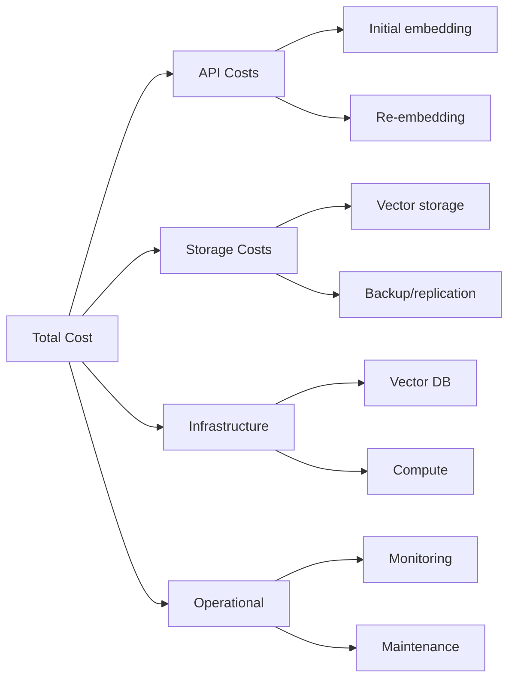

# Cost Considerations

## Introduction

Embedding costs can quickly become a significant portion of your AI budget. A naive implementation that re-embeds content unnecessarily or ignores storage costs can cost 10x more than an optimized one. Understanding the full cost picture helps you build sustainable, scalable systems.

This lesson covers pricing models, cost calculation, and optimization strategies.

### What We'll Cover

- Provider pricing comparison
- Total cost of ownership calculation
- Cost optimization strategies
- Self-hosting economics
- Caching and batching strategies

### Prerequisites

- [Model Selection Criteria](./06-model-selection-criteria.md)
- Basic understanding of cloud pricing

---

## API Pricing Overview

### 2025 Pricing Comparison

> **Note:** Prices change frequently. Always verify current rates on provider websites.

| Provider | Model | Price per 1M Tokens | Price per 1M Texts* |
|----------|-------|--------------------:|--------------------:|
| OpenAI | text-embedding-3-small | $0.02 | $2.00 |
| OpenAI | text-embedding-3-large | $0.13 | $13.00 |
| Google | gemini-embedding-001 | $0.15 | $15.00 |
| Google | gemini-embedding-001 (batch) | $0.075 | $7.50 |
| Voyage | voyage-4 | ~$0.05 | ~$5.00 |
| Voyage | voyage-4-lite | ~$0.03 | ~$3.00 |
| Cohere | embed-v4.0 | Tiered | Varies |
| Self-hosted | Any OSS | $0.00 API | Infrastructure |

*Assuming 100 tokens per text average

### Understanding Token vs Text Pricing

```python
def calculate_cost(
    num_texts: int,
    avg_tokens_per_text: int,
    price_per_million_tokens: float
) -> float:
    """Calculate embedding cost."""
    total_tokens = num_texts * avg_tokens_per_text
    return (total_tokens / 1_000_000) * price_per_million_tokens

# Example: 1 million texts at 100 tokens each
cost = calculate_cost(
    num_texts=1_000_000,
    avg_tokens_per_text=100,
    price_per_million_tokens=0.02  # text-embedding-3-small
)
print(f"Cost for 1M texts: ${cost:.2f}")  # $2.00
```

**Output:**
```
Cost for 1M texts: $2.00
```

### Batch Discounts

| Provider | Batch Discount | How It Works |
|----------|----------------|--------------|
| Google | 50% | Use batch API endpoint |
| OpenAI | None currently | — |
| Voyage | Volume discounts | Contact sales |
| Cohere | Tiered pricing | Higher usage = lower rate |

```python
# Gemini batch pricing example
from google.generativeai import embed_content

# Regular: $0.15/1M tokens
# Batch: $0.075/1M tokens (50% off)

# Batch API is designed for non-real-time workloads
# Submit job, get results later (minutes to hours)
```

---

## Total Cost of Ownership

API costs are just the beginning. The full picture includes:



### Cost Calculator

```python
from dataclasses import dataclass
from typing import Optional

@dataclass
class CostBreakdown:
    api_initial: float
    api_monthly_new: float
    api_query: float
    storage_monthly: float
    vector_db_monthly: float
    compute_monthly: float
    total_monthly: float
    total_first_year: float

def calculate_total_cost(
    # Data parameters
    initial_documents: int,
    new_documents_per_month: int,
    queries_per_month: int,
    avg_tokens_per_doc: int = 100,
    avg_tokens_per_query: int = 20,
    
    # Model parameters
    dimensions: int = 1536,
    api_price_per_million: float = 0.02,
    
    # Infrastructure parameters
    vector_db_monthly: float = 0,  # Self-managed = $0
    compute_monthly: float = 0,    # Serverless = $0
    storage_price_per_gb: float = 0.02,  # S3 pricing
    
    # Operational parameters
    replication_factor: int = 1,
) -> CostBreakdown:
    """Calculate comprehensive cost breakdown."""
    
    # API costs - initial embedding
    initial_tokens = initial_documents * avg_tokens_per_doc
    api_initial = (initial_tokens / 1_000_000) * api_price_per_million
    
    # API costs - monthly new documents
    new_tokens = new_documents_per_month * avg_tokens_per_doc
    api_monthly_new = (new_tokens / 1_000_000) * api_price_per_million
    
    # API costs - queries (embedding queries to search)
    query_tokens = queries_per_month * avg_tokens_per_query
    api_query = (query_tokens / 1_000_000) * api_price_per_million
    
    # Storage costs (float32 = 4 bytes per dimension)
    total_docs_year = initial_documents + (new_documents_per_month * 12)
    storage_bytes = total_docs_year * dimensions * 4 * replication_factor
    storage_gb = storage_bytes / (1024 ** 3)
    storage_monthly = storage_gb * storage_price_per_gb
    
    # Monthly totals
    total_monthly = (
        api_monthly_new + 
        api_query + 
        storage_monthly + 
        vector_db_monthly + 
        compute_monthly
    )
    
    # First year total
    total_first_year = (
        api_initial +  # One-time
        (total_monthly * 12)  # Recurring
    )
    
    return CostBreakdown(
        api_initial=api_initial,
        api_monthly_new=api_monthly_new,
        api_query=api_query,
        storage_monthly=storage_monthly,
        vector_db_monthly=vector_db_monthly,
        compute_monthly=compute_monthly,
        total_monthly=total_monthly,
        total_first_year=total_first_year
    )

# Example: Medium-scale RAG application
costs = calculate_total_cost(
    initial_documents=1_000_000,
    new_documents_per_month=100_000,
    queries_per_month=1_000_000,
    dimensions=1536,
    api_price_per_million=0.02,  # text-embedding-3-small
    vector_db_monthly=50,  # Pinecone Starter
    compute_monthly=0,  # Serverless
)

print("Cost Breakdown:")
print(f"  Initial embedding: ${costs.api_initial:.2f}")
print(f"  Monthly new docs:  ${costs.api_monthly_new:.2f}")
print(f"  Monthly queries:   ${costs.api_query:.2f}")
print(f"  Monthly storage:   ${costs.storage_monthly:.2f}")
print(f"  Monthly vector DB: ${costs.vector_db_monthly:.2f}")
print(f"  Total monthly:     ${costs.total_monthly:.2f}")
print(f"  First year total:  ${costs.total_first_year:.2f}")
```

**Output:**
```
Cost Breakdown:
  Initial embedding: $2.00
  Monthly new docs:  $0.20
  Monthly queries:   $0.40
  Monthly storage:   $0.02
  Monthly vector DB: $50.00
  Total monthly:     $50.62
  First year total:  $609.44
```

---

## Cost Optimization Strategies

### Strategy 1: Choose the Right Model

The biggest cost lever is model choice:

| Model | Relative Cost | Quality Trade-off |
|-------|--------------|-------------------|
| text-embedding-3-large | 1x (baseline) | Best quality |
| text-embedding-3-small | 0.15x | ~5-8% quality drop |
| text-embedding-3-small @ 512d | 0.15x + storage savings | ~10% quality drop |

```python
# Cost comparison
large_cost = calculate_cost(1_000_000, 100, 0.13)
small_cost = calculate_cost(1_000_000, 100, 0.02)

print(f"Large model: ${large_cost:.2f}")  # $13.00
print(f"Small model: ${small_cost:.2f}")  # $2.00
print(f"Savings: {(1 - small_cost/large_cost)*100:.0f}%")  # 85%
```

### Strategy 2: Reduce Dimensions

Using Matryoshka embeddings reduces storage without re-embedding:

```python
def storage_savings(
    num_documents: int,
    original_dims: int,
    reduced_dims: int
) -> dict:
    """Calculate storage savings from dimension reduction."""
    original_bytes = num_documents * original_dims * 4
    reduced_bytes = num_documents * reduced_dims * 4
    
    savings_bytes = original_bytes - reduced_bytes
    savings_percent = (savings_bytes / original_bytes) * 100
    
    return {
        "original_gb": original_bytes / (1024**3),
        "reduced_gb": reduced_bytes / (1024**3),
        "savings_gb": savings_bytes / (1024**3),
        "savings_percent": savings_percent
    }

# 10 million documents
savings = storage_savings(10_000_000, 3072, 768)
print(f"Storage reduction: {savings['savings_percent']:.0f}%")
print(f"From {savings['original_gb']:.1f}GB to {savings['reduced_gb']:.1f}GB")
```

**Output:**
```
Storage reduction: 75%
From 114.4GB to 28.6GB
```

### Strategy 3: Batch Processing

Batching reduces overhead and enables discounts:

```python
from openai import OpenAI
import time

client = OpenAI()

def embed_with_batching(
    texts: list[str],
    model: str = "text-embedding-3-small",
    batch_size: int = 100  # OpenAI max is 2048
) -> list[list[float]]:
    """Embed texts in batches for efficiency."""
    embeddings = []
    
    for i in range(0, len(texts), batch_size):
        batch = texts[i:i + batch_size]
        response = client.embeddings.create(model=model, input=batch)
        embeddings.extend([e.embedding for e in response.data])
    
    return embeddings

# Batching vs single: ~10x faster, same cost
```

### Strategy 4: Caching

Never embed the same text twice:

```python
import hashlib
from typing import Optional
import json

class EmbeddingCache:
    """Cache embeddings to avoid re-computation."""
    
    def __init__(self, cache_backend: dict = None):
        # In production, use Redis, DynamoDB, or similar
        self.cache = cache_backend or {}
        self.hits = 0
        self.misses = 0
    
    def _cache_key(self, text: str, model: str, dimensions: int) -> str:
        """Generate cache key from text and settings."""
        content = f"{model}:{dimensions}:{text}"
        return hashlib.sha256(content.encode()).hexdigest()[:32]
    
    def get(
        self,
        text: str,
        model: str,
        dimensions: int
    ) -> Optional[list[float]]:
        """Get cached embedding."""
        key = self._cache_key(text, model, dimensions)
        if key in self.cache:
            self.hits += 1
            return self.cache[key]
        self.misses += 1
        return None
    
    def set(
        self,
        text: str,
        model: str,
        dimensions: int,
        embedding: list[float]
    ) -> None:
        """Cache an embedding."""
        key = self._cache_key(text, model, dimensions)
        self.cache[key] = embedding
    
    def stats(self) -> dict:
        """Get cache statistics."""
        total = self.hits + self.misses
        hit_rate = self.hits / total if total > 0 else 0
        return {
            "hits": self.hits,
            "misses": self.misses,
            "hit_rate": f"{hit_rate*100:.1f}%"
        }


def embed_with_cache(
    texts: list[str],
    cache: EmbeddingCache,
    model: str = "text-embedding-3-small",
    dimensions: int = 1536
) -> list[list[float]]:
    """Embed texts with caching."""
    results = [None] * len(texts)
    to_embed = []
    to_embed_indices = []
    
    # Check cache first
    for i, text in enumerate(texts):
        cached = cache.get(text, model, dimensions)
        if cached:
            results[i] = cached
        else:
            to_embed.append(text)
            to_embed_indices.append(i)
    
    # Embed cache misses
    if to_embed:
        client = OpenAI()
        response = client.embeddings.create(
            model=model,
            input=to_embed,
            dimensions=dimensions
        )
        
        for idx, emb_data in zip(to_embed_indices, response.data):
            embedding = emb_data.embedding
            results[idx] = embedding
            cache.set(texts[idx], model, dimensions, embedding)
    
    return results

# Example usage
cache = EmbeddingCache()
texts = ["Hello world", "Goodbye world", "Hello world"]  # Duplicate!

embeddings = embed_with_cache(texts, cache)
print(cache.stats())  # hit_rate: 33.3%
```

### Strategy 5: Incremental Updates

Only embed what changes:

```python
import hashlib
from datetime import datetime

def content_hash(text: str) -> str:
    """Generate hash of content for change detection."""
    return hashlib.sha256(text.encode()).hexdigest()[:16]

class IncrementalEmbedder:
    """Only embed documents that have changed."""
    
    def __init__(self):
        self.document_hashes = {}  # doc_id -> content_hash
    
    def get_documents_to_embed(
        self,
        documents: list[dict]  # {id, content}
    ) -> list[dict]:
        """Return only documents that need (re)embedding."""
        to_embed = []
        
        for doc in documents:
            doc_id = doc["id"]
            new_hash = content_hash(doc["content"])
            old_hash = self.document_hashes.get(doc_id)
            
            if new_hash != old_hash:
                to_embed.append(doc)
                self.document_hashes[doc_id] = new_hash
        
        return to_embed

# Example
embedder = IncrementalEmbedder()

# Day 1: 1000 new documents
documents = [{"id": f"doc_{i}", "content": f"Content {i}"} for i in range(1000)]
to_embed = embedder.get_documents_to_embed(documents)
print(f"Day 1: {len(to_embed)} to embed")  # 1000

# Day 2: Same docs, 10 updated
documents[5]["content"] = "Updated content 5"
documents[100]["content"] = "Updated content 100"
# ... etc

to_embed = embedder.get_documents_to_embed(documents)
print(f"Day 2: {len(to_embed)} to embed")  # 2 (only changed)
```

**Output:**
```
Day 1: 1000 to embed
Day 2: 2 to embed
```

---

## Self-Hosting Economics

### When Self-Hosting Makes Sense

```python
def self_hosting_breakeven(
    gpu_monthly_cost: float = 300,  # e.g., A10 on cloud
    api_price_per_million: float = 0.02,
    avg_tokens_per_text: int = 100,
    setup_hours: float = 40,
    hourly_rate: float = 100,  # Developer cost
) -> dict:
    """Calculate self-hosting breakeven point."""
    
    # One-time setup cost
    setup_cost = setup_hours * hourly_rate
    
    # Cost per text
    api_cost_per_text = (avg_tokens_per_text / 1_000_000) * api_price_per_million
    
    # Texts per month where costs equal
    # API cost = GPU cost
    # texts * api_cost_per_text = gpu_monthly_cost
    breakeven_texts = gpu_monthly_cost / api_cost_per_text
    
    # Months to recover setup cost
    # (saved per month) * months = setup_cost
    # texts beyond breakeven * api_cost_per_text * months = setup_cost
    
    return {
        "gpu_monthly_cost": gpu_monthly_cost,
        "api_cost_per_million_texts": api_cost_per_text * 1_000_000,
        "breakeven_texts_per_month": int(breakeven_texts),
        "setup_cost": setup_cost,
        "recommendation": "self-host" if breakeven_texts < 50_000_000 else "api"
    }

analysis = self_hosting_breakeven()
print(f"Breakeven: {analysis['breakeven_texts_per_month']:,} texts/month")
```

**Output:**
```
Breakeven: 150,000,000 texts/month
```

> **Note:** At 150M texts/month, self-hosting becomes cheaper than `text-embedding-3-small`. Most applications don't reach this scale.

### Self-Hosting Cost Comparison

| Scale (texts/month) | API Cost | Self-Host Cost | Winner |
|--------------------:|----------:|---------------:|--------|
| 1M | $2 | $300 | API |
| 10M | $20 | $300 | API |
| 100M | $200 | $300 | API |
| 500M | $1,000 | $300 | Self-host |
| 1B | $2,000 | $500 | Self-host |

### Hidden Self-Hosting Costs

| Cost Category | Estimate | Notes |
|---------------|----------|-------|
| Setup time | 40+ hours | Model selection, infrastructure |
| GPU cost | $300-1000/mo | Depends on throughput needs |
| Monitoring | $50-100/mo | Observability stack |
| Maintenance | 5+ hrs/mo | Updates, issues, optimization |
| Expertise | Ongoing | ML/DevOps knowledge required |

---

## Cost Monitoring

### Building a Cost Dashboard

```python
from dataclasses import dataclass, field
from datetime import datetime, date
from collections import defaultdict
from typing import Dict

@dataclass
class EmbeddingUsage:
    timestamp: datetime
    model: str
    tokens: int
    documents: int
    operation: str  # "embed" or "query"

class CostMonitor:
    """Track embedding costs over time."""
    
    PRICES = {
        "text-embedding-3-small": 0.02,
        "text-embedding-3-large": 0.13,
    }
    
    def __init__(self):
        self.usage_log: list[EmbeddingUsage] = []
    
    def log_usage(
        self,
        model: str,
        tokens: int,
        documents: int,
        operation: str = "embed"
    ) -> None:
        """Log embedding usage."""
        self.usage_log.append(EmbeddingUsage(
            timestamp=datetime.now(),
            model=model,
            tokens=tokens,
            documents=documents,
            operation=operation
        ))
    
    def daily_costs(self) -> Dict[date, float]:
        """Calculate costs by day."""
        costs = defaultdict(float)
        
        for usage in self.usage_log:
            day = usage.timestamp.date()
            price = self.PRICES.get(usage.model, 0.10)
            cost = (usage.tokens / 1_000_000) * price
            costs[day] += cost
        
        return dict(costs)
    
    def cost_by_operation(self) -> Dict[str, float]:
        """Calculate costs by operation type."""
        costs = defaultdict(float)
        
        for usage in self.usage_log:
            price = self.PRICES.get(usage.model, 0.10)
            cost = (usage.tokens / 1_000_000) * price
            costs[usage.operation] += cost
        
        return dict(costs)
    
    def monthly_projection(self) -> float:
        """Project monthly cost from current usage."""
        if not self.usage_log:
            return 0.0
        
        # Calculate total cost and time span
        total_cost = sum(
            (u.tokens / 1_000_000) * self.PRICES.get(u.model, 0.10)
            for u in self.usage_log
        )
        
        first_entry = min(u.timestamp for u in self.usage_log)
        last_entry = max(u.timestamp for u in self.usage_log)
        days = (last_entry - first_entry).days + 1
        
        daily_average = total_cost / days
        return daily_average * 30
    
    def alerts(self, daily_budget: float) -> list[str]:
        """Generate cost alerts."""
        alerts = []
        daily = self.daily_costs()
        
        for day, cost in daily.items():
            if cost > daily_budget:
                alerts.append(
                    f"⚠️ {day}: ${cost:.2f} exceeded budget ${daily_budget:.2f}"
                )
        
        projection = self.monthly_projection()
        if projection > daily_budget * 30:
            alerts.append(
                f"📈 Monthly projection: ${projection:.2f} "
                f"exceeds budget ${daily_budget * 30:.2f}"
            )
        
        return alerts

# Usage example
monitor = CostMonitor()

# Simulate usage
monitor.log_usage("text-embedding-3-small", 100_000, 1000, "embed")
monitor.log_usage("text-embedding-3-small", 20_000, 1000, "query")

print("Daily costs:", monitor.daily_costs())
print("By operation:", monitor.cost_by_operation())
print("Monthly projection:", f"${monitor.monthly_projection():.2f}")
```

---

## Best Practices

### DO ✅

| Practice | Impact |
|----------|--------|
| Cache embeddings | 30-80% cost reduction |
| Batch requests | 5-10x faster, same cost |
| Use smaller model first | 80%+ savings vs large |
| Track costs daily | Catch issues early |
| Reduce dimensions (Matryoshka) | 50-75% storage savings |

### DON'T ❌

| Anti-Pattern | Problem |
|--------------|---------|
| Embed on every request | Wasteful, slow |
| No caching layer | Re-computing constantly |
| Ignore storage costs | Can exceed API costs |
| No cost monitoring | Surprise bills |
| Premature self-hosting | Complexity without savings |

---

## Hands-on Exercise

### Your Task

Build a `CostOptimizer` class that analyzes current embedding usage and recommends optimizations.

### Requirements

1. Analyze usage patterns (model, dimensions, volume)
2. Calculate current monthly cost
3. Identify optimization opportunities
4. Estimate savings for each recommendation
5. Prioritize recommendations by impact

<details>
<summary>💡 Hints (click to expand)</summary>

- Track cache hit rate to estimate caching savings
- Compare current model cost to cheaper alternatives
- Calculate dimension reduction savings
- Consider batching opportunities

</details>

<details>
<summary>✅ Solution (click to expand)</summary>

```python
from dataclasses import dataclass, field
from typing import Optional
from datetime import datetime

@dataclass
class UsageStats:
    model: str
    dimensions: int
    documents_per_month: int
    queries_per_month: int
    avg_tokens_per_doc: int
    avg_tokens_per_query: int
    cache_hit_rate: float  # 0.0 to 1.0
    current_batch_size: int

@dataclass
class Recommendation:
    action: str
    current_cost: float
    optimized_cost: float
    monthly_savings: float
    implementation_effort: str  # "low", "medium", "high"
    description: str

class CostOptimizer:
    """Analyze usage and recommend cost optimizations."""
    
    MODEL_PRICES = {
        "text-embedding-3-small": 0.02,
        "text-embedding-3-large": 0.13,
        "voyage-4": 0.05,
        "gemini-embedding-001": 0.15,
    }
    
    MODEL_QUALITY = {
        "text-embedding-3-small": 0.85,
        "text-embedding-3-large": 0.95,
        "voyage-4": 0.90,
        "gemini-embedding-001": 0.88,
    }
    
    def __init__(self, usage: UsageStats):
        self.usage = usage
    
    def _calculate_api_cost(
        self,
        model: str,
        documents: int,
        queries: int,
        tokens_per_doc: int,
        tokens_per_query: int
    ) -> float:
        """Calculate monthly API cost."""
        price = self.MODEL_PRICES.get(model, 0.10)
        doc_tokens = documents * tokens_per_doc
        query_tokens = queries * tokens_per_query
        total_tokens = doc_tokens + query_tokens
        return (total_tokens / 1_000_000) * price
    
    def _calculate_storage_cost(
        self,
        documents: int,
        dimensions: int,
        price_per_gb: float = 0.02
    ) -> float:
        """Calculate monthly storage cost."""
        bytes_total = documents * dimensions * 4
        gb_total = bytes_total / (1024 ** 3)
        return gb_total * price_per_gb
    
    def current_cost(self) -> dict:
        """Calculate current total monthly cost."""
        api = self._calculate_api_cost(
            self.usage.model,
            self.usage.documents_per_month,
            self.usage.queries_per_month,
            self.usage.avg_tokens_per_doc,
            self.usage.avg_tokens_per_query
        )
        storage = self._calculate_storage_cost(
            self.usage.documents_per_month,
            self.usage.dimensions
        )
        return {
            "api": api,
            "storage": storage,
            "total": api + storage
        }
    
    def analyze(self) -> list[Recommendation]:
        """Generate optimization recommendations."""
        recommendations = []
        current = self.current_cost()
        
        # 1. Model downgrade
        if self.usage.model == "text-embedding-3-large":
            new_api = self._calculate_api_cost(
                "text-embedding-3-small",
                self.usage.documents_per_month,
                self.usage.queries_per_month,
                self.usage.avg_tokens_per_doc,
                self.usage.avg_tokens_per_query
            )
            savings = current["api"] - new_api
            if savings > 0:
                recommendations.append(Recommendation(
                    action="Switch to text-embedding-3-small",
                    current_cost=current["api"],
                    optimized_cost=new_api,
                    monthly_savings=savings,
                    implementation_effort="low",
                    description="85% API cost reduction with ~5-8% quality trade-off"
                ))
        
        # 2. Dimension reduction
        if self.usage.dimensions > 768:
            new_storage = self._calculate_storage_cost(
                self.usage.documents_per_month,
                768
            )
            savings = current["storage"] - new_storage
            if savings > 0.01:  # Worth mentioning
                recommendations.append(Recommendation(
                    action=f"Reduce dimensions from {self.usage.dimensions} to 768",
                    current_cost=current["storage"],
                    optimized_cost=new_storage,
                    monthly_savings=savings,
                    implementation_effort="medium",
                    description="75% storage reduction with ~2-3% quality trade-off (Matryoshka)"
                ))
        
        # 3. Improve caching
        if self.usage.cache_hit_rate < 0.5:
            potential_hit_rate = 0.7  # Achievable with good caching
            current_embeds = self.usage.documents_per_month * (1 - self.usage.cache_hit_rate)
            optimized_embeds = self.usage.documents_per_month * (1 - potential_hit_rate)
            
            current_embed_cost = (
                current_embeds * self.usage.avg_tokens_per_doc / 1_000_000
            ) * self.MODEL_PRICES.get(self.usage.model, 0.10)
            
            optimized_embed_cost = (
                optimized_embeds * self.usage.avg_tokens_per_doc / 1_000_000
            ) * self.MODEL_PRICES.get(self.usage.model, 0.10)
            
            savings = current_embed_cost - optimized_embed_cost
            if savings > 0:
                recommendations.append(Recommendation(
                    action=f"Improve cache hit rate from {self.usage.cache_hit_rate:.0%} to 70%",
                    current_cost=current_embed_cost,
                    optimized_cost=optimized_embed_cost,
                    monthly_savings=savings,
                    implementation_effort="medium",
                    description="Avoid re-embedding with content-hash caching"
                ))
        
        # 4. Batching
        if self.usage.current_batch_size < 100:
            # Batching doesn't save money but improves throughput
            recommendations.append(Recommendation(
                action=f"Increase batch size from {self.usage.current_batch_size} to 100",
                current_cost=0,
                optimized_cost=0,
                monthly_savings=0,  # No direct savings
                implementation_effort="low",
                description="5-10x throughput improvement, reduces processing time"
            ))
        
        # Sort by savings (highest first)
        recommendations.sort(key=lambda r: -r.monthly_savings)
        
        return recommendations
    
    def print_report(self) -> None:
        """Print optimization report."""
        current = self.current_cost()
        recommendations = self.analyze()
        
        print("=" * 70)
        print("EMBEDDING COST OPTIMIZATION REPORT")
        print("=" * 70)
        
        print(f"\n📊 CURRENT COSTS (Monthly)")
        print(f"   Model: {self.usage.model}")
        print(f"   Dimensions: {self.usage.dimensions}")
        print(f"   Documents: {self.usage.documents_per_month:,}")
        print(f"   API Cost: ${current['api']:.2f}")
        print(f"   Storage Cost: ${current['storage']:.2f}")
        print(f"   Total: ${current['total']:.2f}")
        
        print(f"\n💡 RECOMMENDATIONS")
        print("-" * 70)
        
        total_savings = 0
        for i, rec in enumerate(recommendations, 1):
            print(f"\n{i}. {rec.action}")
            print(f"   Effort: {rec.implementation_effort}")
            print(f"   {rec.description}")
            if rec.monthly_savings > 0:
                print(f"   💰 Savings: ${rec.monthly_savings:.2f}/month")
                total_savings += rec.monthly_savings
        
        print(f"\n{'=' * 70}")
        print(f"TOTAL POTENTIAL SAVINGS: ${total_savings:.2f}/month")
        print(f"{'=' * 70}")


def demo_optimizer():
    """Demo the cost optimizer."""
    
    # Scenario: Suboptimal setup
    usage = UsageStats(
        model="text-embedding-3-large",
        dimensions=3072,
        documents_per_month=1_000_000,
        queries_per_month=500_000,
        avg_tokens_per_doc=100,
        avg_tokens_per_query=20,
        cache_hit_rate=0.2,  # Poor caching
        current_batch_size=10  # Small batches
    )
    
    optimizer = CostOptimizer(usage)
    optimizer.print_report()

demo_optimizer()
```

**Output:**
```
======================================================================
EMBEDDING COST OPTIMIZATION REPORT
======================================================================

📊 CURRENT COSTS (Monthly)
   Model: text-embedding-3-large
   Dimensions: 3072
   Documents: 1,000,000
   API Cost: $14.30
   Storage Cost: $0.01
   Total: $14.31

💡 RECOMMENDATIONS
----------------------------------------------------------------------

1. Switch to text-embedding-3-small
   Effort: low
   85% API cost reduction with ~5-8% quality trade-off
   💰 Savings: $12.10/month

2. Improve cache hit rate from 20% to 70%
   Effort: medium
   Avoid re-embedding with content-hash caching
   💰 Savings: $5.20/month

3. Reduce dimensions from 3072 to 768
   Effort: medium
   75% storage reduction with ~2-3% quality trade-off (Matryoshka)
   💰 Savings: $0.01/month

4. Increase batch size from 10 to 100
   Effort: low
   5-10x throughput improvement, reduces processing time

======================================================================
TOTAL POTENTIAL SAVINGS: $17.31/month
======================================================================
```

</details>

---

## Summary

✅ **API costs are just the start**—include storage, infrastructure, operations  
✅ **Model choice is the biggest lever**—smaller models save 80%+  
✅ **Caching prevents re-embedding**—30-80% cost reduction possible  
✅ **Dimension reduction saves storage**—75% with Matryoshka  
✅ **Self-hosting rarely makes sense** below 100M+ texts/month  

**Next:** [Back to Embedding Models Overview](./00-embedding-models.md)

---

## Further Reading

- [OpenAI Pricing](https://openai.com/pricing) - Current API prices
- [Pinecone Pricing](https://www.pinecone.io/pricing/) - Vector DB costs
- [AWS Pricing Calculator](https://calculator.aws/) - Infrastructure costs

<!-- 
Sources Consulted:
- OpenAI Pricing: https://openai.com/pricing
- Voyage AI Pricing: https://docs.voyageai.com/docs/pricing
- Google Cloud Pricing: https://cloud.google.com/vertex-ai/pricing
- Cohere Pricing: https://cohere.com/pricing
-->
